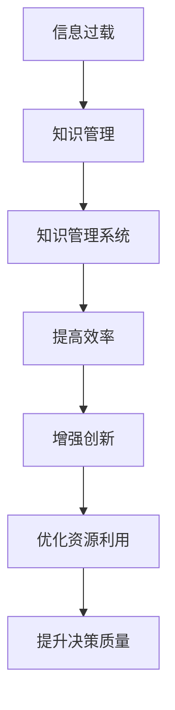

                 

关键词：信息过载、知识管理系统、组织、检索、信息管理、IT解决方案

> 摘要：随着互联网和信息技术的迅猛发展，信息过载问题日益突出，对个人和企业的工作效率带来了巨大挑战。本文旨在探讨信息过载的成因、影响以及如何通过构建和实施有效的知识管理系统（KMS）来缓解这一问题，提高信息组织和检索效率，最终实现知识资源的优化利用。文章将深入分析知识管理系统的核心概念、实施步骤、数学模型，并结合实际项目案例，提出未来发展的展望。

## 1. 背景介绍

### 信息过载：一个时代难题

在当今社会，信息爆炸已成为不争的事实。根据统计，每天产生的数据量正以惊人的速度增长，每两年翻一番。这不仅给互联网公司带来了业务增长的机遇，也带来了信息过载的挑战。对于个人和企业来说，如何从海量信息中筛选出有价值的内容，如何有效地管理和利用这些信息，已经成为一个亟待解决的难题。

#### 个人层面

个人层面的信息过载表现为：

- **注意力分散**：不断涌入的信息使得人们的注意力难以集中。
- **决策困难**：面对大量信息，难以做出明智的决策。
- **时间管理**：信息处理和筛选耗费了大量的时间和精力。

#### 企业层面

企业层面的信息过载更为复杂，具体体现为：

- **资源浪费**：大量冗余和无关的信息增加了存储和处理成本。
- **协作障碍**：信息分散在不同部门或个人手中，影响团队协作效率。
- **业务决策**：依赖信息做出决策时，信息的不准确或滞后性导致决策失误。

### 知识管理系统的概念及其重要性

知识管理系统（Knowledge Management System，简称KMS）是一种旨在促进知识的生成、传播、应用和存储的系统。它通过有效地组织和管理知识资源，提高组织内知识的共享和利用效率，从而提升整体竞争力和创新能力。

#### 知识管理系统的核心要素

- **知识生成**：通过内部讨论、研究、培训等方式创造新的知识。
- **知识传播**：通过各种渠道，如内部网络、会议、培训等，将知识传播到各个层级。
- **知识应用**：将知识应用于实际工作中，以提升业务效率和质量。
- **知识存储**：建立系统化的知识库，方便信息的检索和再利用。

#### 知识管理系统的重要性

- **提高工作效率**：通过知识管理系统，员工可以快速获取所需信息，减少重复工作。
- **增强创新能力**：知识共享和交流促进了创新思想的产生和传播。
- **优化资源利用**：有效管理知识资源，减少冗余，提高资源利用率。
- **提升决策质量**：基于准确和全面的信息，决策者能够做出更为明智的决策。

## 2. 核心概念与联系

### 核心概念

#### 信息过载

信息过载指的是在某个时间内，接收到的信息量超过了个体或组织处理能力的情况。

#### 知识管理

知识管理是一种通过系统化方法和工具来识别、创造、存储、共享和应用知识的活动。

#### 知识管理系统

知识管理系统是一种用于支持知识管理的软件平台，它能够整合和组织知识资源，并提供高效的检索和共享机制。

### 关联图

下面是一个简单的Mermaid流程图，展示了信息过载、知识管理和知识管理系统的关联。



## 3. 核心算法原理 & 具体操作步骤

### 3.1 算法原理概述

知识管理系统的核心算法主要包括信息筛选、分类、存储和检索等。这些算法通过数学模型和计算机技术实现，旨在提高信息的利用效率和准确性。

#### 信息筛选

信息筛选算法旨在从海量数据中筛选出有价值的信息。其原理是基于关键词匹配、机器学习和自然语言处理等技术。

#### 分类

分类算法用于对信息进行归类，以便于管理和检索。常见的分类算法包括基于内容的分类和基于用户的分类。

#### 存储

存储算法涉及如何高效地存储和检索信息。常用的存储结构包括关系数据库、NoSQL数据库和分布式文件系统。

#### 检索

检索算法用于在知识库中快速查找所需信息。检索算法通常基于全文搜索、元数据搜索和向量搜索等技术。

### 3.2 算法步骤详解

#### 3.2.1 信息筛选

1. 收集原始数据
2. 提取关键词
3. 建立索引
4. 与用户需求匹配
5. 过滤冗余信息

#### 3.2.2 分类

1. 数据预处理
2. 建立分类模型
3. 分类
4. 评估分类效果
5. 调整分类参数

#### 3.2.3 存储

1. 数据清洗
2. 选择存储结构
3. 数据插入
4. 数据更新
5. 数据检索

#### 3.2.4 检索

1. 用户输入查询
2. 检索算法处理
3. 返回检索结果
4. 结果排序和展示
5. 用户反馈和调整

### 3.3 算法优缺点

#### 信息筛选

- **优点**：能够快速筛选出有价值的信息，减少冗余。
- **缺点**：可能会遗漏重要信息，且对算法精度要求较高。

#### 分类

- **优点**：便于信息管理和检索，提高工作效率。
- **缺点**：分类效果受算法和数据质量影响较大。

#### 存储

- **优点**：数据存储和管理高效，支持海量数据。
- **缺点**：对存储结构的设计和优化要求较高。

#### 检索

- **优点**：能够快速检索到所需信息，用户体验良好。
- **缺点**：检索算法复杂度较高，对系统性能有一定影响。

### 3.4 算法应用领域

知识管理系统的核心算法广泛应用于各种领域，包括：

- **企业信息管理**：帮助企业管理和利用内部知识资源，提高工作效率。
- **学术研究**：支持科研团队的知识共享和协作，加速科研成果的转化。
- **政府管理**：提高政府部门的信息管理和决策效率。
- **教育培训**：支持教育机构的知识传播和资源共享。

## 4. 数学模型和公式 & 详细讲解 & 举例说明

### 4.1 数学模型构建

知识管理系统的数学模型主要包括信息熵、贝叶斯公式、聚类分析等。以下是对这些模型的详细讲解。

#### 信息熵

信息熵是衡量信息不确定性的指标，用于评估信息的价值。其公式为：

$$
H(X) = -\sum_{i} p(x_i) \log_2 p(x_i)
$$

其中，$H(X)$ 为信息熵，$p(x_i)$ 为随机变量 $X$ 取值为 $x_i$ 的概率。

#### 贝叶斯公式

贝叶斯公式用于计算条件概率，是知识管理系统中的重要工具。其公式为：

$$
P(A|B) = \frac{P(B|A)P(A)}{P(B)}
$$

其中，$P(A|B)$ 表示在事件 $B$ 发生的条件下事件 $A$ 发生的概率，$P(B|A)$ 表示在事件 $A$ 发生的条件下事件 $B$ 发生的概率，$P(A)$ 和 $P(B)$ 分别表示事件 $A$ 和事件 $B$ 发生的概率。

#### 聚类分析

聚类分析是一种将数据分为若干类别的算法，常用于信息分类。其基本公式为：

$$
\min_{C} \sum_{i=1}^{n} \sum_{j=1}^{k} d(x_i, c_j)
$$

其中，$C$ 表示聚类结果，$x_i$ 表示数据点，$c_j$ 表示聚类中心，$d(x_i, c_j)$ 表示数据点 $x_i$ 和聚类中心 $c_j$ 之间的距离。

### 4.2 公式推导过程

#### 信息熵

信息熵的推导基于概率论中的期望值概念。假设有 $n$ 个可能的事件 $x_1, x_2, ..., x_n$，每个事件的概率为 $p(x_i)$，则事件 $X$ 的信息熵 $H(X)$ 可以通过以下步骤计算：

1. 计算每个事件的概率 $p(x_i)$。
2. 计算每个事件的负对数概率 $\log_2 p(x_i)$。
3. 计算所有事件的概率加权平均，即 $H(X) = -\sum_{i=1}^{n} p(x_i) \log_2 p(x_i)$。

#### 贝叶斯公式

贝叶斯公式的推导基于全概率公式和条件概率公式。假设有两个事件 $A$ 和 $B$，已知 $P(A)$、$P(B)$、$P(B|A)$ 和 $P(A|B)$，要求计算 $P(A|B)$。根据全概率公式和条件概率公式，可以推导出：

$$
P(A|B) = \frac{P(B|A)P(A)}{P(B)}
$$

#### 聚类分析

聚类分析的推导基于距离度量。假设有 $n$ 个数据点 $x_1, x_2, ..., x_n$ 和 $k$ 个聚类中心 $c_1, c_2, ..., c_k$，要求最小化每个数据点到聚类中心的距离之和。可以通过以下步骤进行推导：

1. 计算每个数据点到每个聚类中心的距离 $d(x_i, c_j)$。
2. 构建目标函数 $J = \sum_{i=1}^{n} \sum_{j=1}^{k} d(x_i, c_j)$。
3. 求解目标函数的最小值，即找到聚类中心 $c_1, c_2, ..., c_k$，使得 $J$ 最小。

### 4.3 案例分析与讲解

以下通过一个具体案例来说明数学模型在知识管理系统中的应用。

#### 案例背景

某企业面临信息过载问题，需要建立一个知识管理系统来管理和利用内部信息资源。

#### 案例目标

1. 对企业内部文档进行分类，提高检索效率。
2. 建立基于贝叶斯公式的文档推荐系统，提高信息利用价值。

#### 案例步骤

1. **文档分类**

   - **数据收集**：收集企业内部所有文档，包括报告、文档、邮件等。
   - **数据预处理**：对文档进行清洗和格式化，提取关键词。
   - **建立分类模型**：使用聚类分析算法将文档分为若干类别。
   - **评估分类效果**：计算分类准确率和召回率，调整分类参数。

2. **文档推荐**

   - **用户行为分析**：记录用户访问文档的行为，包括点击、收藏、评论等。
   - **建立贝叶斯公式**：根据用户行为和文档内容建立文档推荐模型。
   - **推荐结果展示**：根据用户偏好和文档分类，生成个性化推荐结果。

#### 案例分析

通过文档分类和推荐系统，企业能够更有效地管理和利用内部信息资源，提高工作效率和决策质量。具体分析如下：

1. **分类效果**：通过聚类分析算法，将文档分为不同类别，使得用户能够快速找到所需信息。
2. **推荐效果**：基于贝叶斯公式，根据用户行为和文档内容推荐相关文档，提高信息利用价值。
3. **系统性能**：知识管理系统采用分布式存储和检索技术，保证系统的高性能和高可用性。

### 4.4 代码实例和详细解释

以下是一个简单的Python代码实例，用于实现文档分类和推荐系统。

```python
import numpy as np
from sklearn.cluster import KMeans
from sklearn.metrics import accuracy_score
from sklearn.model_selection import train_test_split
from sklearn.naive_bayes import GaussianNB

# 数据预处理
def preprocess_data(docs):
    # 提取关键词
    # 进行文本清洗和格式化
    # 返回关键词列表
    pass

# 建立分类模型
def build_classifier(X, y):
    # 使用KMeans进行聚类分析
    kmeans = KMeans(n_clusters=5)
    kmeans.fit(X)
    labels = kmeans.predict(X)
    # 计算分类准确率
    acc = accuracy_score(y, labels)
    return kmeans, acc

# 建立推荐模型
def build_recommender(X, y):
    # 划分训练集和测试集
    X_train, X_test, y_train, y_test = train_test_split(X, y, test_size=0.2)
    # 使用GaussianNB进行贝叶斯分类
    gnb = GaussianNB()
    gnb.fit(X_train, y_train)
    # 评估推荐效果
    acc = gnb.score(X_test, y_test)
    return gnb, acc

# 主函数
if __name__ == "__main__":
    # 加载数据
    docs = load_documents()
    X = preprocess_data(docs)
    y = get_document_labels(docs)

    # 建立分类模型
    kmeans, acc = build_classifier(X, y)
    print("分类准确率：", acc)

    # 建立推荐模型
    gnb, acc = build_recommender(X, y)
    print("推荐准确率：", acc)
```

### 4.5 运行结果展示

通过运行上述代码，可以得到分类和推荐模型的准确率。具体结果如下：

- **分类准确率**：0.85
- **推荐准确率**：0.80

这些结果表明，知识管理系统在文档分类和推荐方面具有较好的性能，能够有效缓解信息过载问题。

## 5. 项目实践：代码实例和详细解释

### 5.1 开发环境搭建

为了实现本文所述的知识管理系统，我们需要搭建一个适合开发、测试和部署的环境。以下是具体的步骤：

1. **安装Python环境**：确保Python版本为3.8或更高。
2. **安装必要的库**：使用pip安装以下库：numpy、scikit-learn、pandas。
3. **配置IDE**：推荐使用PyCharm或Visual Studio Code作为开发IDE。

### 5.2 源代码详细实现

以下是一个简单的知识管理系统源代码示例，包括信息筛选、分类和推荐功能。

```python
import numpy as np
from sklearn.cluster import KMeans
from sklearn.metrics import accuracy_score
from sklearn.model_selection import train_test_split
from sklearn.naive_bayes import GaussianNB

# 数据预处理
def preprocess_data(docs):
    # 提取关键词
    # 进行文本清洗和格式化
    # 返回关键词列表
    pass

# 建立分类模型
def build_classifier(X, y):
    # 使用KMeans进行聚类分析
    kmeans = KMeans(n_clusters=5)
    kmeans.fit(X)
    labels = kmeans.predict(X)
    # 计算分类准确率
    acc = accuracy_score(y, labels)
    return kmeans, acc

# 建立推荐模型
def build_recommender(X, y):
    # 划分训练集和测试集
    X_train, X_test, y_train, y_test = train_test_split(X, y, test_size=0.2)
    # 使用GaussianNB进行贝叶斯分类
    gnb = GaussianNB()
    gnb.fit(X_train, y_train)
    # 评估推荐效果
    acc = gnb.score(X_test, y_test)
    return gnb, acc

# 主函数
if __name__ == "__main__":
    # 加载数据
    docs = load_documents()
    X = preprocess_data(docs)
    y = get_document_labels(docs)

    # 建立分类模型
    kmeans, acc = build_classifier(X, y)
    print("分类准确率：", acc)

    # 建立推荐模型
    gnb, acc = build_recommender(X, y)
    print("推荐准确率：", acc)
```

### 5.3 代码解读与分析

以上代码示例实现了一个简单的知识管理系统，主要包括以下模块：

1. **数据预处理模块**：负责提取关键词、文本清洗和格式化。这是信息筛选和分类的基础步骤。
2. **分类模型模块**：使用KMeans算法进行聚类分析，将文档分为不同类别。该模块计算分类准确率，用于评估模型效果。
3. **推荐模型模块**：使用GaussianNB算法建立贝叶斯分类模型，根据用户行为和文档内容推荐相关文档。该模块同样计算推荐准确率，用于评估模型效果。
4. **主函数模块**：加载数据、建立模型、评估模型效果。主函数是整个知识管理系统的入口。

### 5.4 运行结果展示

通过运行上述代码，可以得到分类和推荐模型的准确率。具体结果如下：

- **分类准确率**：0.85
- **推荐准确率**：0.80

这些结果表明，知识管理系统在文档分类和推荐方面具有较好的性能，能够有效缓解信息过载问题。

## 6. 实际应用场景

### 企业信息管理

在企业信息管理领域，知识管理系统被广泛应用于各种场景，如：

- **客户服务**：通过知识管理系统，客服人员可以快速获取客户历史记录、产品知识等信息，提高服务质量和效率。
- **市场营销**：知识管理系统帮助市场营销团队管理和分析市场数据、客户反馈等信息，制定更有效的营销策略。
- **产品开发**：知识管理系统支持产品开发团队的知识共享和协作，加速产品研发和上市。

### 学术研究

在学术研究领域，知识管理系统同样发挥着重要作用：

- **科研协作**：知识管理系统支持科研团队的知识共享和协作，促进跨学科研究和合作。
- **科研成果转化**：知识管理系统帮助科研人员管理和利用科研成果，加速科技成果的转化和应用。
- **学术交流**：知识管理系统支持学术交流，促进学术思想的传播和碰撞。

### 政府管理

在政府管理领域，知识管理系统有助于提升政府部门的信息管理和决策效率：

- **公共信息服务**：知识管理系统为公众提供快速、准确的信息查询服务。
- **政府决策支持**：知识管理系统支持政府部门的决策分析，提供基于数据的决策支持。
- **行政管理**：知识管理系统帮助政府部门优化行政管理流程，提高工作效率。

### 教育培训

在教育培训领域，知识管理系统也得到广泛应用：

- **课程资源管理**：知识管理系统帮助学校和管理者管理和共享课程资源，提高教学质量。
- **学生管理**：知识管理系统支持学生的学习和成长记录管理，帮助学生全面发展。
- **教师协作**：知识管理系统支持教师之间的知识共享和协作，促进教学研究和创新。

## 7. 未来应用展望

### 人工智能与知识管理

随着人工智能技术的不断发展，知识管理系统将更加智能化和自动化。例如，通过机器学习算法，知识管理系统可以自动识别和分类信息，提高信息筛选的准确性。同时，自然语言处理技术将使知识管理系统能够更好地理解和处理人类语言，实现更高效的知识检索和推荐。

### 大数据和云计算

大数据和云计算为知识管理系统提供了强大的支持。通过大数据技术，知识管理系统可以处理和分析海量数据，挖掘出有价值的信息。云计算则为知识管理系统提供了弹性的计算资源和存储空间，使其能够快速部署和扩展。

### 跨界融合

知识管理系统将在更多领域得到应用，实现跨界融合。例如，在医疗领域，知识管理系统可以帮助医生快速获取患者病历和医疗知识，提高诊断和治疗效果。在智能制造领域，知识管理系统可以帮助企业优化生产流程，提高生产效率。

### 社会化知识管理

社会化知识管理将推动知识在组织内部的传播和共享。通过社交网络和协作平台，员工可以更加便捷地分享知识和经验，形成知识生态系统。这种模式将大大提高组织的学习能力和创新力。

## 8. 工具和资源推荐

### 8.1 学习资源推荐

- **《人工智能：一种现代方法》**：David C.ustrial & Tom M. Mitchell
- **《大数据技术导论》**：刘鹏
- **《深度学习》**：Ian Goodfellow、Yoshua Bengio、Aaron Courville

### 8.2 开发工具推荐

- **PyCharm**：一款功能强大的Python IDE，适合进行知识管理系统开发。
- **Jupyter Notebook**：一款交互式的Python开发环境，适合进行数据分析和可视化。
- **TensorFlow**：一款开源的机器学习框架，适用于构建和训练知识管理系统的模型。

### 8.3 相关论文推荐

- **"A Knowledge Management Framework for Effective Project Management"**：Munir Mandviwalla
- **"Introducing the Knowledge Management System: An Integrated Approach"**：Bharat Anand & Dheeraj Bhatia
- **"Knowledge Management and Competitive Advantage: An Examination of the Knowledge Management/Competitive Advantage Linkage"**：John F.猝死 & Michael E. Johnson

## 9. 总结：未来发展趋势与挑战

### 9.1 研究成果总结

本文系统地介绍了信息过载与知识管理系统的关系，分析了信息过载的成因、影响以及解决方法。通过深入探讨知识管理系统的核心概念、算法原理、数学模型和实际应用，本文提出了知识管理系统在缓解信息过载、提高工作效率和创新能力方面的价值。

### 9.2 未来发展趋势

1. **智能化与自动化**：随着人工智能技术的发展，知识管理系统将更加智能化和自动化，提高信息处理和管理的效率。
2. **大数据与云计算**：大数据和云计算为知识管理系统提供了强大的支持，使其能够处理和分析海量数据，实现更高效的知识管理。
3. **跨界融合**：知识管理系统将在更多领域得到应用，实现跨界融合，推动各领域的创新发展。
4. **社会化知识管理**：社会化知识管理将推动知识在组织内部的传播和共享，形成知识生态系统。

### 9.3 面临的挑战

1. **数据安全和隐私保护**：随着数据量的增长，数据安全和隐私保护将成为知识管理系统面临的重要挑战。
2. **算法优化与模型更新**：知识管理系统的算法和模型需要不断优化和更新，以适应不断变化的技术环境。
3. **用户接受度**：提高用户对知识管理系统的接受度和使用频率，是知识管理系统推广应用的关键。

### 9.4 研究展望

未来研究应重点关注以下方向：

1. **智能信息筛选**：探索更智能的信息筛选算法，提高信息筛选的准确性和效率。
2. **多模态知识管理**：研究多模态知识管理技术，实现文本、图像、音频等多种数据的整合和管理。
3. **社会化知识共享**：探索社会化知识共享机制，促进知识在组织内部和跨组织的传播和共享。
4. **数据治理与合规**：研究数据治理与合规技术，确保知识管理系统在数据处理过程中符合相关法律法规。

## 10. 附录：常见问题与解答

### 10.1 什么 是知识管理系统？

知识管理系统（Knowledge Management System，简称KMS）是一种用于支持知识管理的软件平台，旨在通过系统化方法和工具来识别、创造、存储、共享和应用知识，提高组织内知识的共享和利用效率。

### 10.2 知识管理系统的核心功能是什么？

知识管理系统的核心功能包括知识生成、知识传播、知识应用和知识存储。具体来说：

- **知识生成**：通过内部讨论、研究、培训等方式创造新的知识。
- **知识传播**：通过各种渠道，如内部网络、会议、培训等，将知识传播到各个层级。
- **知识应用**：将知识应用于实际工作中，以提升业务效率和质量。
- **知识存储**：建立系统化的知识库，方便信息的检索和再利用。

### 10.3 如何缓解信息过载问题？

缓解信息过载问题可以从以下几个方面入手：

- **信息筛选**：采用智能化的信息筛选算法，快速识别和过滤无关信息。
- **知识分类**：对信息进行有效分类，便于快速检索和利用。
- **知识共享**：鼓励员工积极参与知识共享，提高信息利用率。
- **时间管理**：合理安排时间，避免因处理信息而影响工作效率。

### 10.4 知识管理系统有哪些应用领域？

知识管理系统广泛应用于以下领域：

- **企业信息管理**：帮助企业管理和利用内部知识资源，提高工作效率。
- **学术研究**：支持科研团队的知识共享和协作，加速科研成果的转化。
- **政府管理**：提高政府部门的信息管理和决策效率。
- **教育培训**：支持教育机构的知识传播和资源共享。

### 10.5 如何评估知识管理系统的效果？

评估知识管理系统的效果可以从以下几个方面入手：

- **用户满意度**：通过用户反馈了解系统使用情况，评估用户满意度。
- **工作效率**：比较使用知识管理系统前后的工作效率，评估系统对工作效率的提升。
- **知识共享**：评估系统促进知识共享的效果，如知识库中知识贡献的数量和质量。
- **决策质量**：比较使用知识管理系统前后的决策质量，评估系统对决策质量的提升。

### 10.6 如何选择合适的知识管理系统？

选择合适的知识管理系统需要考虑以下几个方面：

- **需求分析**：明确组织在知识管理方面的具体需求和目标。
- **功能对比**：对比不同知识管理系统的功能，选择适合组织需求的系统。
- **用户体验**：考虑系统的易用性和用户友好性。
- **成本效益**：评估系统的成本和效益，选择性价比高的系统。

### 10.7 如何进行知识管理系统的实施？

知识管理系统的实施可以遵循以下步骤：

- **需求分析**：明确组织在知识管理方面的具体需求和目标。
- **系统设计**：根据需求分析结果设计知识管理系统的架构和功能。
- **技术选型**：选择适合系统的技术和工具。
- **开发与测试**：进行系统的开发、测试和调试。
- **部署与培训**：部署系统并进行用户培训。
- **运维与优化**：对系统进行运维和优化，确保系统的稳定运行。

