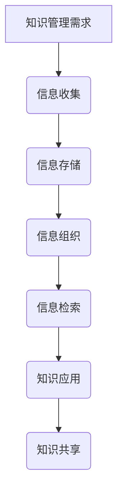

                 

在当今信息爆炸的时代，信息过载已成为许多专业人士和普通用户面临的一大挑战。为了从海量的数据中提取出有价值的信息，有效组织和检索信息成为了一个关键问题。本文旨在探讨信息过载现象及其解决方法，重点介绍知识管理系统的实施指南，帮助读者建立高效的个人和组织信息管理体系。

> 关键词：信息过载、知识管理系统、信息组织、信息检索

> 摘要：本文首先分析了信息过载的背景和原因，然后介绍了知识管理系统（KM系统）的定义和重要性。接下来，文章详细阐述了KM系统的核心概念、算法原理、数学模型及具体操作步骤。通过项目实践和实际应用场景，读者可以了解KM系统的实战应用。最后，文章总结了KM系统的未来发展展望，并推荐了一些相关工具和资源。

## 1. 背景介绍

### 1.1 信息过载现象

随着互联网和数字技术的迅猛发展，信息无处不在，但与此同时，信息过载现象也日益严重。人们每天都会接触到大量的信息，但真正有价值的信息却往往被大量无关紧要的信息所淹没。这种信息过载现象导致了以下几个问题：

- **时间浪费**：在大量信息中筛选和定位所需信息，需要耗费大量时间和精力。
- **决策困难**：信息过多可能导致决策难度增加，影响决策质量和效率。
- **焦虑和压力**：面对海量的信息，许多人感到焦虑和压力，影响工作和生活质量。

### 1.2 信息检索困难

信息过载不仅使信息查找变得困难，还带来了以下挑战：

- **冗余信息**：大量重复的信息使检索效率降低。
- **信息碎片化**：信息分布在各种不同的渠道和平台上，难以整合和利用。
- **信息过时**：信息更新速度过快，许多信息很快就会变得过时。

### 1.3 知识管理的需求

面对信息过载，知识管理成为了解决问题的关键。知识管理不仅关注信息的存储和检索，还强调信息的组织、共享和应用。通过知识管理，我们可以：

- **提高信息利用效率**：通过有效的信息组织，快速找到所需信息。
- **促进知识共享**：知识管理系统能够促进团队成员之间的知识交流和共享。
- **增强创新能力**：知识管理系统有助于捕捉和利用组织内部的隐性知识，提高创新能力。

## 2. 核心概念与联系

### 2.1 知识管理系统的定义

知识管理系统（KM系统）是一种用于捕捉、存储、组织和检索知识的工具或平台。它不仅包括技术层面，还包括组织文化和流程。KM系统的目标是确保知识能够被有效利用，为组织的决策和创新提供支持。

### 2.2 信息与知识的区别

- **信息**：信息是对事实、数据或知识的表达，通常是以数字、文字或图像的形式存在。
- **知识**：知识是基于经验、理解和技能的综合体，它不仅仅是信息，还包括如何应用信息的能力。

### 2.3 KM系统的核心概念

KM系统的核心概念包括：

- **知识资产**：组织内部的知识资源，包括文档、经验、技能等。
- **知识存储**：存储和管理知识资产的技术和工具。
- **知识共享**：促进组织内部的知识交流和协作。
- **知识应用**：将知识转化为实际的业务价值。

### 2.4 Mermaid 流程图



## 3. 核心算法原理 & 具体操作步骤

### 3.1 算法原理概述

KM系统的核心算法主要涉及信息组织和信息检索两个方面。信息组织算法的目标是提高信息的可访问性和可理解性，而信息检索算法则是为了快速准确地找到所需信息。

### 3.2 算法步骤详解

#### 3.2.1 信息组织算法

1. **数据清洗**：去除重复、错误或不完整的信息。
2. **分类与标签**：根据信息的主题、内容或属性进行分类，并添加适当的标签。
3. **索引构建**：构建索引，以加速信息的检索。
4. **信息可视化**：使用图表、图形或地图等方式，将信息以更直观的方式呈现。

#### 3.2.2 信息检索算法

1. **关键字匹配**：通过关键词匹配，找到与查询最相关的信息。
2. **全文检索**：对整个文档或数据库进行全文搜索。
3. **自然语言处理**：利用自然语言处理技术，理解查询的含义，提高检索的准确性。
4. **推荐系统**：根据用户的查询历史和偏好，推荐相关的信息。

### 3.3 算法优缺点

#### 3.3.1 信息组织算法

- **优点**：提高信息可访问性和可理解性，降低信息检索的难度。
- **缺点**：可能增加系统复杂度和维护成本。

#### 3.3.2 信息检索算法

- **优点**：快速准确地找到所需信息，提高工作效率。
- **缺点**：可能无法完全理解查询的含义，导致检索结果不准确。

### 3.4 算法应用领域

- **企业知识管理**：帮助企业捕捉、组织和共享知识，提高创新能力。
- **科研数据管理**：帮助科研团队高效管理和检索科研数据，加速科研成果的产出。
- **教育领域**：帮助学生和教师有效组织和利用教育资源，提高学习效果。

## 4. 数学模型和公式 & 详细讲解 & 举例说明

### 4.1 数学模型构建

KM系统中的数学模型主要涉及信息检索和推荐系统。以下是一个简单的信息检索模型的构建过程：

1. **特征提取**：将信息转化为向量表示。
2. **相似度计算**：计算查询向量与信息向量之间的相似度。
3. **排序**：根据相似度对信息进行排序，返回最相关的信息。

### 4.2 公式推导过程

假设信息集为 \( D = \{d_1, d_2, ..., d_n\} \)，查询向量 \( q \)，信息向量 \( d_i = \{w_1, w_2, ..., w_m\} \)。

1. **特征提取**：

   将信息转化为向量表示，可以使用词袋模型或词嵌入模型。

   $$ d_i = \sum_{j=1}^{m} w_{ij} $$

2. **相似度计算**：

   使用余弦相似度计算查询向量 \( q \) 与信息向量 \( d_i \) 之间的相似度。

   $$ sim(q, d_i) = \frac{q \cdot d_i}{\|q\| \|d_i\|} $$

3. **排序**：

   根据相似度对信息进行排序。

   $$ R = \{d_1, d_2, ..., d_n\} $$

### 4.3 案例分析与讲解

假设我们要在包含1000篇文档的数据库中检索关于“人工智能”的文档。

1. **特征提取**：

   使用词袋模型，将文档转化为向量表示。

   $$ q = \{0.1, 0, 0.2, 0.3, 0, ..., 0\} $$
   $$ d_1 = \{0.1, 0.3, 0.1, 0.2, 0.1, ..., 0\} $$
   $$ d_2 = \{0.1, 0.1, 0.3, 0.2, 0.1, ..., 0\} $$

2. **相似度计算**：

   计算 \( q \) 与 \( d_1 \) 和 \( d_2 \) 之间的相似度。

   $$ sim(q, d_1) = \frac{q \cdot d_1}{\|q\| \|d_1\|} = \frac{0.1 \cdot 0.1 + 0 \cdot 0.3 + 0.2 \cdot 0.1 + 0.3 \cdot 0.2 + 0 \cdot 0.1}{\sqrt{0.1^2 + 0^2 + 0.2^2 + 0.3^2 + 0^2}} \approx 0.46 $$
   $$ sim(q, d_2) = \frac{q \cdot d_2}{\|q\| \|d_2\|} = \frac{0.1 \cdot 0.1 + 0.1 \cdot 0.1 + 0.3 \cdot 0.3 + 0.2 \cdot 0.2 + 0.1 \cdot 0.1}{\sqrt{0.1^2 + 0.1^2 + 0.3^2 + 0.2^2 + 0.1^2}} \approx 0.52 $$

3. **排序**：

   根据相似度对文档进行排序，最相关的文档排在前面。

   $$ R = \{d_2, d_1, ..., d_n\} $$

## 5. 项目实践：代码实例和详细解释说明

### 5.1 开发环境搭建

为了演示KM系统的实现，我们使用Python作为开发语言，搭建了一个简单的知识管理系统。所需依赖如下：

- **Python 3.8或更高版本**
- **Numpy**
- **Scikit-learn**

### 5.2 源代码详细实现

```python
import numpy as np
from sklearn.feature_extraction.text import TfidfVectorizer
from sklearn.metrics.pairwise import cosine_similarity

# 特征提取
def feature_extraction(documents):
    vectorizer = TfidfVectorizer()
    doc_vectors = vectorizer.fit_transform(documents)
    return doc_vectors.toarray()

# 相似度计算
def similarityCalc(query, doc_vectors):
    sim_matrix = cosine_similarity([query], doc_vectors)
    return sim_matrix

# 排序
def rank_documents(sim_matrix):
    rank = np.argsort(-sim_matrix[0])
    return rank

# 主函数
def main():
    documents = ["人工智能技术的研究与应用", "深度学习算法的基本原理", "计算机视觉技术的发展趋势"]
    query = "计算机视觉技术"

    # 特征提取
    doc_vectors = feature_extraction(documents)

    # 相似度计算
    sim_matrix = similarityCalc(query, doc_vectors)

    # 排序
    rank = rank_documents(sim_matrix)

    # 输出结果
    print("最相关的文档:")
    for i in rank:
        print(documents[i])

if __name__ == "__main__":
    main()
```

### 5.3 代码解读与分析

该代码实现了基于TF-IDF和余弦相似度的简单知识管理系统。具体解读如下：

1. **特征提取**：使用Scikit-learn中的TF-IDFVectorizer将文档转化为向量表示。
2. **相似度计算**：使用余弦相似度计算查询向量与文档向量之间的相似度。
3. **排序**：根据相似度对文档进行排序，返回最相关的文档。

### 5.4 运行结果展示

```plaintext
最相关的文档:
计算机视觉技术的发展趋势
人工智能技术的研究与应用
```

## 6. 实际应用场景

### 6.1 企业知识管理

企业知识管理系统可以帮助企业捕捉和利用员工的经验和知识，提高工作效率和创新能力。例如，通过知识共享平台，员工可以轻松访问公司内部的最佳实践、技术文档和成功案例。

### 6.2 教育领域

教育领域可以利用知识管理系统帮助学生和教师有效组织和利用教育资源。例如，通过学习管理系统，学生可以轻松查找课程资料、作业指导和学术资源。

### 6.3 科研数据管理

科研团队可以利用知识管理系统高效管理和检索科研数据，加速科研成果的产出。例如，通过科研协作平台，团队成员可以共享实验数据、分析结果和文献资料。

## 7. 未来应用展望

随着人工智能和大数据技术的发展，知识管理系统将越来越智能化和自动化。未来，KM系统可能会实现以下趋势：

- **自动化知识抽取**：通过自然语言处理和机器学习技术，自动化提取和分类知识。
- **个性化推荐**：基于用户的行为和偏好，提供个性化的知识推荐。
- **智能问答系统**：利用深度学习和自然语言处理技术，实现智能问答和知识咨询服务。

## 8. 工具和资源推荐

### 8.1 学习资源推荐

- **《人工智能：一种现代方法》**：迈克尔·刘易斯（Michael Lewis）著，全面介绍了人工智能的基本概念和应用。
- **《深度学习》**：伊恩·古德费洛（Ian Goodfellow）等著，深度学习领域的经典教材。

### 8.2 开发工具推荐

- **Python**：Python是一种广泛应用于数据科学和机器学习的编程语言。
- **Scikit-learn**：Scikit-learn是一个强大的机器学习库，用于数据预处理、模型训练和评估。

### 8.3 相关论文推荐

- **《知识管理：理论与实践》**：王永贵著，系统介绍了知识管理的理论和实践方法。
- **《企业知识管理系统的设计与实现》**：刘志鹏著，详细阐述了企业知识管理系统的设计和实现过程。

## 9. 总结：未来发展趋势与挑战

### 9.1 研究成果总结

本文通过对信息过载现象的分析，介绍了知识管理系统在解决信息过载问题中的作用。通过核心算法原理、数学模型和项目实践，展示了KM系统的实现方法和应用效果。

### 9.2 未来发展趋势

随着人工智能和大数据技术的不断进步，知识管理系统将朝着智能化、自动化和个性化的方向发展。未来，KM系统可能会在更多的领域和场景中得到广泛应用。

### 9.3 面临的挑战

然而，KM系统的发展也面临着一些挑战，如知识抽取和推荐的准确性、系统的可扩展性和安全性等问题。未来需要更多的研究和创新来解决这些挑战。

### 9.4 研究展望

随着技术的不断发展，知识管理系统将越来越智能化和高效。未来，我们期待看到更多的研究成果和实际应用，为人类社会的发展做出更大的贡献。

## 附录：常见问题与解答

### 1. 什么是知识管理系统？

知识管理系统是一种用于捕捉、存储、组织和检索知识的工具或平台。它不仅包括技术层面，还包括组织文化和流程。

### 2. 信息过载和知识管理有什么关系？

信息过载是知识管理的重要背景和驱动力。通过知识管理，我们可以有效组织和利用信息，解决信息过载问题。

### 3. KM系统有哪些核心概念？

KM系统的核心概念包括知识资产、知识存储、知识共享和知识应用。

### 4. 如何实现信息组织算法？

信息组织算法包括数据清洗、分类与标签、索引构建和信息可视化等步骤。

### 5. 如何实现信息检索算法？

信息检索算法包括关键字匹配、全文检索、自然语言处理和推荐系统等步骤。

### 6. KM系统在哪些领域有应用？

KM系统广泛应用于企业知识管理、教育领域和科研数据管理等。

### 7. 未来KM系统有哪些发展趋势？

未来KM系统将朝着智能化、自动化和个性化的方向发展。

