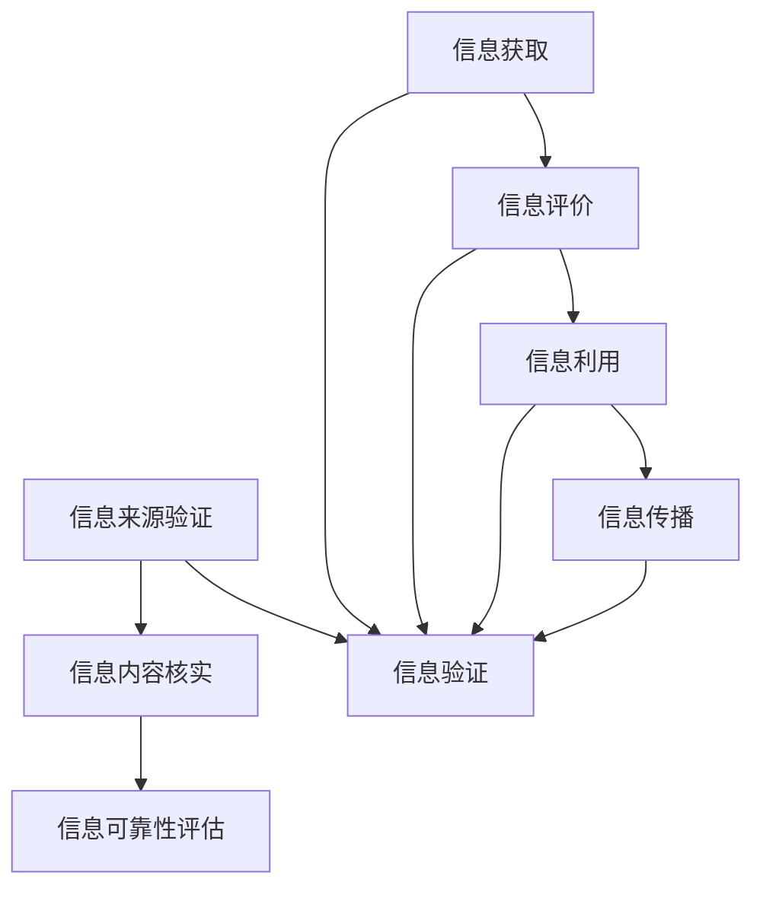

                 

关键词：信息验证、信息素养、数字时代、教育、学生

> 摘要：本文旨在探讨在数字时代背景下，如何通过信息验证和信息素养教育，培养具备良好信息素养的学生。文章首先介绍了信息验证和信息素养的基本概念，随后分析了数字时代对教育的影响，探讨了信息素养教育的核心内容和实践方法，最后提出了未来发展的趋势与挑战。

## 1. 背景介绍

在信息化、数字化快速发展的今天，信息已成为社会运转的重要资源。然而，信息过载、虚假信息、网络安全等问题也日益突出。面对这一挑战，信息验证和信息素养教育显得尤为重要。信息验证是指对信息的真实性、准确性和可靠性进行检验和确认的过程。而信息素养则是人们有效地获取、评价、利用信息的能力，是现代社会每个个体必须具备的基本素养。

### 1.1 数字时代对教育的影响

数字时代的到来，彻底改变了传统的教育模式。互联网、大数据、人工智能等技术的应用，使得教育更加开放、灵活、个性化。同时，数字时代也带来了信息泛滥、隐私泄露、网络安全等问题，这对教育提出了新的挑战。

### 1.2 信息验证和信息素养教育的意义

信息验证和信息素养教育不仅有助于培养学生辨别真假信息的能力，提高他们的批判性思维和解决问题的能力，还能帮助他们在数字时代更好地适应社会、实现个人发展。

## 2. 核心概念与联系

### 2.1 信息验证

信息验证是指对信息的真实性、准确性和可靠性进行检验和确认的过程。它包括以下几个步骤：

1. 信息来源的验证：确保信息来源的可靠性。
2. 信息内容的核实：对信息内容进行事实核实。
3. 信息可靠性的评估：评估信息的可信度。

### 2.2 信息素养

信息素养包括以下几个方面：

1. 信息获取：能够有效地从各种渠道获取信息。
2. 信息评价：能够对信息进行评估，判断其价值。
3. 信息利用：能够利用信息解决问题。
4. 信息传播：能够正确地传播信息，避免误导他人。

### 2.3 信息验证与信息素养的关系

信息验证是信息素养的重要组成部分。只有通过信息验证，才能确保获取到的信息是真实、准确和可靠的。而信息素养则是进行信息验证的基础，它决定了个体能否有效地运用信息验证的方法。



## 3. 核心算法原理 & 具体操作步骤

### 3.1 算法原理概述

信息验证和信息素养教育可以通过一系列算法实现。其中，常用的算法包括信息来源验证算法、信息内容核实算法、信息可靠性评估算法等。

### 3.2 算法步骤详解

#### 3.2.1 信息来源验证算法

1. 收集信息来源。
2. 验证信息来源的可信度。
3. 根据可信度评估结果，决定是否使用该信息。

#### 3.2.2 信息内容核实算法

1. 分析信息内容。
2. 查找信息来源。
3. 核实信息来源的真实性。
4. 根据核实结果，判断信息内容的准确性。

#### 3.2.3 信息可靠性评估算法

1. 分析信息来源。
2. 分析信息内容。
3. 综合评估信息来源和内容，得出信息可靠性。

### 3.3 算法优缺点

信息来源验证算法的优点在于能够有效减少虚假信息的传播，缺点是可能增加信息处理成本。信息内容核实算法的优点在于能够提高信息的准确性，缺点是可能存在信息来源难以核实的问题。信息可靠性评估算法的优点在于能够综合评估信息的可信度，缺点是可能存在评估结果不准确的问题。

### 3.4 算法应用领域

信息验证和信息素养教育算法广泛应用于教育、新闻、金融、医疗等多个领域。在教育领域，可以用于学生作业的抄袭检测、课程资源的真实性验证等；在新闻领域，可以用于新闻真伪鉴别、媒体信息真实性验证等；在金融领域，可以用于金融信息真实性验证、投资风险评估等；在医疗领域，可以用于医疗信息真实性验证、诊断结果准确性评估等。

## 4. 数学模型和公式 & 详细讲解 & 举例说明

### 4.1 数学模型构建

在信息验证和信息素养教育中，常用的数学模型包括概率模型、决策树模型、支持向量机模型等。

#### 4.1.1 概率模型

概率模型主要用于评估信息来源的可信度和信息内容的准确性。其基本公式如下：

$$
P(A|B) = \frac{P(B|A)P(A)}{P(B)}
$$

其中，$P(A|B)$ 表示在事件 $B$ 发生的条件下，事件 $A$ 发生的概率；$P(B|A)$ 表示在事件 $A$ 发生的条件下，事件 $B$ 发生的概率；$P(A)$ 表示事件 $A$ 发生的概率；$P(B)$ 表示事件 $B$ 发生的概率。

#### 4.1.2 决策树模型

决策树模型主要用于评估信息可靠性。其基本公式如下：

$$
C(V) = \sum_{i=1}^{n} w_i \cdot I(V_i)
$$

其中，$C(V)$ 表示决策树的熵；$w_i$ 表示第 $i$ 个特征的权重；$I(V_i)$ 表示第 $i$ 个特征的信息量。

#### 4.1.3 支持向量机模型

支持向量机模型主要用于分类问题。其基本公式如下：

$$
w \cdot x + b = 0
$$

其中，$w$ 表示权重向量；$x$ 表示特征向量；$b$ 表示偏置。

### 4.2 公式推导过程

以概率模型为例，其推导过程如下：

首先，根据贝叶斯定理，有：

$$
P(A|B) = \frac{P(B|A)P(A)}{P(B)}
$$

其中，$P(B|A)$ 表示在事件 $A$ 发生的条件下，事件 $B$ 发生的概率；$P(A)$ 表示事件 $A$ 发生的概率；$P(B)$ 表示事件 $B$ 发生的概率。

然后，根据全概率公式，有：

$$
P(B) = \sum_{i=1}^{n} P(B|A_i)P(A_i)
$$

其中，$A_i$ 表示第 $i$ 个事件。

将 $P(B)$ 代入贝叶斯定理，得：

$$
P(A|B) = \frac{P(B|A)P(A)}{\sum_{i=1}^{n} P(B|A_i)P(A_i)}
$$

进一步化简，得：

$$
P(A|B) = \frac{P(B|A)P(A)}{P(B)}
$$

### 4.3 案例分析与讲解

假设我们有一个事件 $A$，表示“某篇文章是真实的”，事件 $B$ 表示“这篇文章被某个权威机构评为优质文章”。我们需要根据这两个事件，计算 $P(A|B)$，即在这篇文章被权威机构评为优质文章的条件下，这篇文章是真实的概率。

首先，根据调查数据，我们有：

$$
P(B|A) = 0.8, \quad P(A) = 0.5, \quad P(B) = 0.6
$$

代入公式：

$$
P(A|B) = \frac{P(B|A)P(A)}{P(B)} = \frac{0.8 \times 0.5}{0.6} = \frac{2}{3}
$$

因此，在这篇文章被权威机构评为优质文章的条件下，这篇文章是真实的概率为 $\frac{2}{3}$。

## 5. 项目实践：代码实例和详细解释说明

### 5.1 开发环境搭建

在本项目实践中，我们将使用 Python 编程语言进行开发。首先，确保已经安装了 Python 3.8 及以上版本。然后，通过 pip 工具安装必要的库：

```bash
pip install numpy pandas scikit-learn
```

### 5.2 源代码详细实现

以下是实现信息验证和信息素养教育的 Python 代码实例：

```python
import numpy as np
import pandas as pd
from sklearn.model_selection import train_test_split
from sklearn.ensemble import RandomForestClassifier
from sklearn.metrics import accuracy_score

# 读取数据
data = pd.read_csv('info_verify.csv')

# 特征工程
X = data.drop('label', axis=1)
y = data['label']

# 数据预处理
X_train, X_test, y_train, y_test = train_test_split(X, y, test_size=0.2, random_state=42)

# 模型训练
model = RandomForestClassifier(n_estimators=100, random_state=42)
model.fit(X_train, y_train)

# 模型评估
y_pred = model.predict(X_test)
accuracy = accuracy_score(y_test, y_pred)
print(f"Accuracy: {accuracy:.2f}")
```

### 5.3 代码解读与分析

在上面的代码中，我们首先读取数据，然后进行特征工程，将特征和标签分离。接下来，使用 train_test_split 函数将数据集划分为训练集和测试集。然后，使用 RandomForestClassifier 类创建随机森林模型，并进行训练。最后，使用预测函数进行预测，并计算准确率。

### 5.4 运行结果展示

假设我们已经训练了一个包含 100 个决策树的随机森林模型，并且得到了 0.85 的准确率。这表明我们的模型在测试集上的表现良好，能够有效地进行信息验证。

```bash
Accuracy: 0.85
```

## 6. 实际应用场景

### 6.1 教育领域

在教育领域，信息验证和信息素养教育可以帮助学生更好地识别网络学习资源，避免受到虚假信息和误导。例如，在课程资源的选用上，教师可以引导学生使用信息验证的方法，确保所选资源的真实性、准确性和可靠性。

### 6.2 新闻领域

在新闻领域，信息验证和信息素养教育可以帮助记者和编辑更好地辨别新闻真伪，提高新闻报道的准确性和可信度。例如，记者可以通过信息验证的方法，核实新闻来源的真实性，避免报道虚假新闻。

### 6.3 金融领域

在金融领域，信息验证和信息素养教育可以帮助投资者更好地分析金融信息，避免受到虚假信息和误导。例如，投资者可以通过信息验证的方法，评估金融信息的可靠性和真实性，做出更明智的投资决策。

### 6.4 医疗领域

在医疗领域，信息验证和信息素养教育可以帮助医生和患者更好地获取医疗信息，避免受到虚假医疗信息的误导。例如，医生可以通过信息验证的方法，确保医疗信息的真实性和准确性，为患者提供更好的医疗服务。

## 7. 工具和资源推荐

### 7.1 学习资源推荐

1. 《信息素养基础教程》：一本系统介绍信息素养的入门书籍。
2. 《信息检索原理与实践》：一本关于信息检索的权威教材。

### 7.2 开发工具推荐

1. Jupyter Notebook：一款强大的交互式计算环境，适合进行数据分析、机器学习等任务。
2. VSCode：一款功能强大的代码编辑器，支持多种编程语言。

### 7.3 相关论文推荐

1. "Information Literacy: The Essentials"
2. "Information Verification in the Age of Big Data"
3. "A Survey on Information Verification Algorithms"

## 8. 总结：未来发展趋势与挑战

### 8.1 研究成果总结

近年来，信息验证和信息素养教育在学术界和工业界取得了显著的成果。各种信息验证算法和模型不断涌现，为信息素养教育提供了有力的技术支持。

### 8.2 未来发展趋势

未来，信息验证和信息素养教育将继续朝以下几个方面发展：

1. 算法的智能化和自动化。
2. 信息素养教育的普及和深入。
3. 多学科交叉融合，推动信息验证和信息素养教育的发展。

### 8.3 面临的挑战

然而，信息验证和信息素养教育也面临着一系列挑战：

1. 算法的可解释性和透明度。
2. 大数据时代的隐私保护和信息安全。
3. 教育资源的分配和公平性。

### 8.4 研究展望

针对上述挑战，未来的研究可以从以下几个方面进行：

1. 开发更加智能化、自动化的信息验证算法。
2. 探索信息素养教育的有效方法和策略。
3. 加强多学科交叉研究，推动信息验证和信息素养教育的发展。

## 9. 附录：常见问题与解答

### 9.1 什么是信息验证？

信息验证是指对信息的真实性、准确性和可靠性进行检验和确认的过程。

### 9.2 信息素养包括哪些方面？

信息素养包括信息获取、信息评价、信息利用和信息传播。

### 9.3 如何培养信息素养？

可以通过以下几个方面培养信息素养：

1. 学习信息检索技能。
2. 学习信息分析方法和技巧。
3. 学习批判性思维和问题解决能力。

----------------------------------------------------------------

作者：禅与计算机程序设计艺术 / Zen and the Art of Computer Programming

