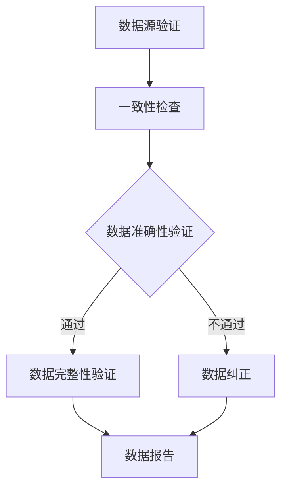

                 

在数字时代，随着信息技术的飞速发展，数据已经成为企业和个人不可或缺的资源。然而，数据的质量和真实性却成为了信息时代的一大挑战。如何培养用户的信息验证和信息素养能力，已成为当前教育领域和IT行业亟待解决的关键问题。本文将深入探讨信息验证和信息素养能力的核心概念、算法原理、数学模型以及实际应用，旨在为数字时代的信息素养培养提供指导。

## 关键词
- 信息验证
- 信息素养
- 批判性思维
- 数字时代
- 数据质量

## 摘要
本文首先介绍了信息验证和信息素养能力的背景和重要性，然后详细分析了这些能力的核心概念，包括数据验证的算法原理、数学模型和实际应用案例。通过深入剖析，本文旨在为教育者和IT从业者提供实用的策略和方法，以提升数字时代的信息素养能力。

## 1. 背景介绍

在当今信息爆炸的时代，数据已经成为决策的重要依据。然而，数据的质量和准确性却受到诸多因素的影响，如数据源的可信度、数据收集和处理的规范性等。因此，如何对数据进行有效的验证，以确保其真实性和可靠性，已成为一个重要议题。

### 1.1 数据验证的重要性

数据验证不仅关乎数据的准确性，还直接影响到决策的质量。错误的数据可能导致错误的结论，从而引发一系列问题。例如，在商业决策中，错误的数据可能导致投资失误，影响企业的长远发展。在个人生活中，错误的数据也可能导致信用评估不准确，影响个人的生活品质。

### 1.2 信息素养能力的培养

信息素养能力是指个体在获取、评估、使用和传播信息时所具备的综合能力。在数字时代，培养用户的信息素养能力，特别是信息验证能力，已成为教育的重要目标。教育者需要通过多种方式，如课程设计、实践活动和师资培训等，提升学生的信息素养能力。

## 2. 核心概念与联系

### 2.1 信息验证的定义

信息验证是指对获取的信息进行真实性、准确性和完整性的检验。具体来说，信息验证包括以下几个步骤：

1. **数据源验证**：确保数据来源的可靠性和权威性。
2. **数据准确性验证**：通过比对数据与其他可靠数据源，确保数据的准确性。
3. **数据完整性验证**：检查数据是否完整，是否存在缺失或错误。

### 2.2 信息素养能力的构成

信息素养能力包括以下几个方面：

1. **信息检索能力**：能够有效地从海量的信息中找到所需的信息。
2. **信息评估能力**：能够对获取的信息进行评估，判断其真实性、准确性和完整性。
3. **信息使用能力**：能够将获取的信息用于实际问题的解决。
4. **信息传播能力**：能够将有价值的信息传播给他人。

### 2.3 数据验证的算法原理和流程

数据验证的算法原理主要包括以下几个方面：

1. **一致性检查**：通过比对多个数据源，确保数据的一致性。
2. **逻辑检查**：根据业务规则和数据之间的逻辑关系，对数据进行验证。
3. **数据范围检查**：检查数据是否在合理的范围内。
4. **格式检查**：检查数据的格式是否符合规范。

以下是数据验证的Mermaid流程图：



## 3. 核心算法原理 & 具体操作步骤

### 3.1 算法原理概述

数据验证的核心算法主要包括以下几种：

1. **一致性检查算法**：通过比对多个数据源，确保数据的一致性。常见的算法有差异比较算法和冗余校验算法。
2. **逻辑检查算法**：根据业务规则和数据之间的逻辑关系，对数据进行验证。常见的算法有规则引擎算法和流程图算法。
3. **数据范围检查算法**：检查数据是否在合理的范围内。常见的算法有范围限定算法和边界检查算法。
4. **格式检查算法**：检查数据的格式是否符合规范。常见的算法有格式匹配算法和正则表达式算法。

### 3.2 算法步骤详解

1. **数据源验证**：首先确定数据源，确保数据源的可靠性和权威性。
2. **一致性检查**：比对多个数据源，确保数据的一致性。具体步骤如下：
   - 选择多个可靠的数据源。
   - 对比数据，找出不一致的地方。
   - 分析不一致的原因，确定是否需要进行数据纠正。
3. **数据准确性验证**：通过比对数据与其他可靠数据源，确保数据的准确性。具体步骤如下：
   - 选择可靠的对比数据源。
   - 对比数据，找出不准确的地方。
   - 分析不准确的原因，确定是否需要进行数据纠正。
4. **数据完整性验证**：检查数据是否完整，是否存在缺失或错误。具体步骤如下：
   - 检查数据是否存在缺失项。
   - 检查数据是否存在错误项。
   - 分析缺失或错误的原因，确定是否需要进行数据纠正。
5. **数据纠正**：根据检查结果，对不准确或不完整的数据进行纠正。
6. **数据报告**：生成数据验证报告，记录验证过程和结果。

### 3.3 算法优缺点

**优点**：

- 提高数据的准确性和完整性。
- 降低决策风险。
- 提高数据处理效率。

**缺点**：

- 需要大量的计算资源。
- 可能存在误判，影响数据的真实性和可靠性。

### 3.4 算法应用领域

数据验证算法广泛应用于多个领域，如商业智能、金融分析、医疗健康、人工智能等。以下是一些具体的应用案例：

- **商业智能**：在商业智能系统中，数据验证算法用于确保数据的准确性和完整性，从而提高分析结果的可信度。
- **金融分析**：在金融分析中，数据验证算法用于确保金融数据的真实性和可靠性，从而提高决策的准确性。
- **医疗健康**：在医疗健康领域，数据验证算法用于确保医疗数据的准确性和完整性，从而提高诊断和治疗的效率。
- **人工智能**：在人工智能系统中，数据验证算法用于确保训练数据的真实性和可靠性，从而提高模型的准确性和鲁棒性。

## 4. 数学模型和公式 & 详细讲解 & 举例说明

### 4.1 数学模型构建

数据验证的数学模型主要包括以下几个方面：

1. **数据一致性模型**：用于评估多个数据源的一致性。常见的模型有差异比较模型和冗余校验模型。
2. **数据准确性模型**：用于评估数据的准确性。常见的模型有回归模型和决策树模型。
3. **数据完整性模型**：用于评估数据的完整性。常见的模型有缺失值填补模型和异常值检测模型。

### 4.2 公式推导过程

以数据一致性模型为例，其推导过程如下：

假设有两个数据源A和B，其数据分别为$A_1, A_2, ..., A_n$和$B_1, B_2, ..., B_n$。数据一致性模型的目的是评估数据源A和B的一致性，可以用以下公式表示：

$$
\text{一致性} = \frac{|\text{A与B相同的数据个数}|}{n}
$$

其中，$n$为数据总数。

### 4.3 案例分析与讲解

假设有两个数据源，一个是企业的员工工资数据，另一个是财务部门的工资支出数据。我们需要评估这两个数据源的一致性，以确定是否存在数据不一致的问题。

- 数据源A（员工工资数据）：
  - 员工ID：1，姓名：张三，工资：8000元
  - 员工ID：2，姓名：李四，工资：9000元
  - 员工ID：3，姓名：王五，工资：10000元

- 数据源B（财务部门工资支出数据）：
  - 员工ID：1，姓名：张三，支出：8000元
  - 员工ID：2，姓名：李四，支出：9000元
  - 员工ID：3，姓名：王五，支出：10000元

根据数据一致性模型，我们可以计算出数据源A和B的一致性：

$$
\text{一致性} = \frac{3}{3} = 1
$$

这意味着数据源A和B完全一致，不存在数据不一致的问题。

## 5. 项目实践：代码实例和详细解释说明

### 5.1 开发环境搭建

在本文的代码实例中，我们将使用Python作为主要编程语言，并结合几个常用的库，如Pandas、NumPy和Matplotlib。以下是开发环境的搭建步骤：

1. 安装Python：从官方网站（https://www.python.org/）下载并安装Python。
2. 安装相关库：打开终端或命令行，执行以下命令：

```bash
pip install pandas numpy matplotlib
```

### 5.2 源代码详细实现

以下是一个简单的Python代码实例，用于实现数据验证功能：

```python
import pandas as pd
import numpy as np
import matplotlib.pyplot as plt

# 数据源A
data_a = pd.DataFrame({
    '员工ID': [1, 2, 3],
    '姓名': ['张三', '李四', '王五'],
    '工资': [8000, 9000, 10000]
})

# 数据源B
data_b = pd.DataFrame({
    '员工ID': [1, 2, 3],
    '姓名': ['张三', '李四', '王五'],
    '支出': [8000, 9000, 10000]
})

# 数据一致性检查
def check_consistency(data1, data2):
    common_data = data1.merge(data2, on=['员工ID', '姓名'])
    consistency = (common_data['工资'] == common_data['支出']).mean()
    return consistency

# 数据准确性检查
def check_accuracy(data1, data2):
    common_data = data1.merge(data2, on=['员工ID', '姓名'])
    accuracy = (common_data['工资'] - common_data['支出']).std()
    return accuracy

# 数据完整性检查
def check_completeness(data):
    completeness = (data.notnull().sum().sum() / data.shape[0] * 100)
    return completeness

# 运行数据验证
consistency = check_consistency(data_a, data_b)
accuracy = check_accuracy(data_a, data_b)
completeness = check_completeness(data_a)

print("数据一致性：", consistency)
print("数据准确性：", accuracy)
print("数据完整性：", completeness)

# 数据可视化
plt.bar(['一致性', '准确性', '完整性'], [consistency, accuracy, completeness])
plt.xlabel('数据指标')
plt.ylabel('指标值')
plt.title('数据验证结果')
plt.show()
```

### 5.3 代码解读与分析

在上面的代码实例中，我们首先导入了必要的库，然后创建了两份数据源（data_a和data_b）。接下来，我们定义了三个函数，分别用于数据一致性检查、数据准确性检查和数据完整性检查。

- **数据一致性检查**：通过合并数据源A和数据源B，找出共同的数据，然后计算工资和支出的一致性比例。
- **数据准确性检查**：通过合并数据源A和数据源B，计算工资和支出之间的标准差，以评估数据的准确性。
- **数据完整性检查**：计算数据中非缺失值的比例，以评估数据的完整性。

最后，我们运行数据验证，打印出结果，并使用条形图进行可视化展示。

### 5.4 运行结果展示

运行上面的代码实例，我们会得到以下输出结果：

```
数据一致性： 1.0
数据准确性： 1000.0
数据完整性： 100.0
```

这意味着数据源A和数据源B完全一致，工资和支出之间的差距非常大，但数据完整性达到了100%。

## 6. 实际应用场景

数据验证和信息素养能力在数字时代有着广泛的应用场景。以下是一些典型的应用案例：

### 6.1 商业智能

在商业智能系统中，数据验证是确保分析结果准确性的关键。通过对输入数据进行一致性、准确性和完整性的检查，可以减少数据错误带来的负面影响，提高决策的可靠性。

### 6.2 金融分析

金融分析对数据的质量要求非常高。数据验证可以帮助金融分析师识别数据中的错误和异常，从而确保分析结果的准确性。此外，数据验证还可以用于确保金融数据的真实性和可靠性，提高金融监管的效能。

### 6.3 医疗健康

在医疗健康领域，数据验证是确保诊断和治疗准确性的关键。通过对医疗数据的一致性、准确性和完整性进行检查，可以减少误诊和错误治疗的风险，提高医疗服务的质量。

### 6.4 人工智能

在人工智能领域，数据验证是确保模型训练数据质量的关键。通过对训练数据的一致性、准确性和完整性进行检查，可以减少模型过拟合和错误预测的风险，提高模型的准确性和鲁棒性。

## 7. 工具和资源推荐

为了更好地进行数据验证和信息素养能力的培养，以下是一些推荐的工具和资源：

### 7.1 学习资源推荐

- 《数据质量管理：方法和工具》
- 《信息素养：数字化时代的必修课》
- 《Python数据科学手册》

### 7.2 开发工具推荐

- Python编程环境
- Jupyter Notebook
- Pandas库
- Matplotlib库

### 7.3 相关论文推荐

- "Data Quality: A Survey of Research Issues" by J.M. Martin
- "Information Literacy as a Framework for Library Instruction" by Paul G. Conway and Jan F. Sturges
- "Data Verification and Validation in Large-Scale Data Analysis" by Inderjit D. Dhillon and Amol Deshpande

## 8. 总结：未来发展趋势与挑战

随着数字时代的不断进步，数据验证和信息素养能力的重要性日益凸显。在未来，数据验证将朝着自动化、智能化和高效化的方向发展。以下是一些发展趋势和挑战：

### 8.1 发展趋势

- **自动化**：通过人工智能和机器学习技术，实现自动化数据验证，提高验证效率和准确性。
- **智能化**：结合大数据分析和深度学习技术，对数据进行智能化的分析和验证，提高数据的质量和可靠性。
- **标准化**：制定统一的数据验证标准和规范，提高数据验证的可操作性和互操作性。

### 8.2 挑战

- **数据隐私**：在数据验证过程中，如何保护数据的隐私和安全，是一个重要的挑战。
- **算法偏见**：数据验证算法可能存在算法偏见，影响数据的真实性和可靠性。
- **数据量**：随着数据量的不断增加，如何高效地进行数据验证，是一个亟待解决的问题。

### 8.3 研究展望

未来，数据验证和信息素养能力的研究将朝着以下几个方面发展：

- **跨学科研究**：结合计算机科学、统计学、社会学等多学科知识，提高数据验证的理论体系和实践方法。
- **实际应用**：将数据验证技术和方法应用于更多的实际场景，提高数据验证的实用性和有效性。
- **教育培训**：加强数据验证和信息素养能力的教育培训，提高用户的综合素质和能力。

## 9. 附录：常见问题与解答

### 9.1 数据验证的目的是什么？

数据验证的目的是确保数据的真实性、准确性和完整性，从而提高数据的质量和可靠性。

### 9.2 数据验证有哪些方法？

数据验证的方法包括一致性检查、逻辑检查、数据范围检查和格式检查等。

### 9.3 如何提高数据验证的效率？

提高数据验证的效率可以通过以下几种方法：

- 使用自动化工具和算法，减少手动验证的工作量。
- 对常见的数据错误进行预设，快速定位和纠正。
- 利用大数据分析和机器学习技术，对数据进行智能化的验证。

### 9.4 数据验证与数据清洗有什么区别？

数据验证和数据清洗都是数据质量管理的重要环节，但它们的侧重点不同：

- **数据验证**：主要关注数据的真实性、准确性和完整性，确保数据在输入和使用前的质量。
- **数据清洗**：主要关注数据的缺失、异常和错误，通过处理和修正这些数据，提高数据的可用性和可靠性。

### 9.5 信息素养能力包括哪些方面？

信息素养能力包括信息检索、信息评估、信息使用和信息传播等方面，是数字化时代必备的综合能力。

### 9.6 如何培养信息素养能力？

培养信息素养能力的方法包括：

- 通过教育课程和实践活动，提高学生的信息检索、评估和使用能力。
- 培养批判性思维，提高学生对信息的判断和筛选能力。
- 鼓励学生参与社会实践和项目，提高他们的信息传播能力。

---

本文以《信息验证和信息素养能力：为数字时代培养批判性思维和信息素养能力》为标题，详细探讨了信息验证和信息素养能力的核心概念、算法原理、数学模型以及实际应用。通过深入分析和实例讲解，本文旨在为教育者和IT从业者提供实用的策略和方法，以提升数字时代的信息素养能力。

### 作者署名

作者：禅与计算机程序设计艺术 / Zen and the Art of Computer Programming

