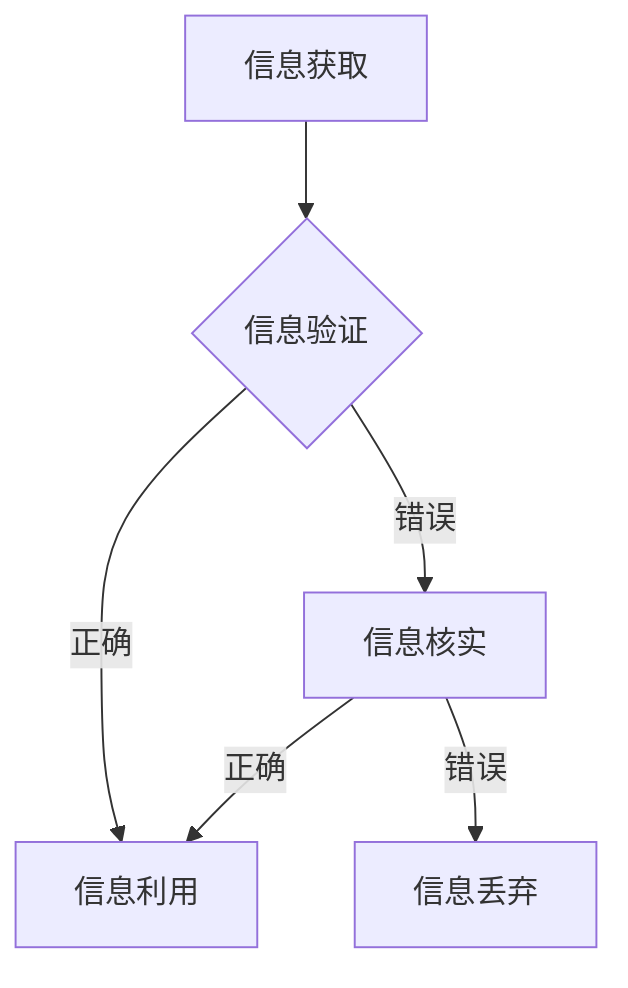

                 

 关键词：（信息验证、媒体批判性思考、假新闻、媒体操纵、批判性思维、信息素养）

> 摘要：本文旨在探讨在假新闻和媒体操纵盛行的时代，如何运用批判性思维和信息验证技巧来提升个人的媒体素养和决策能力。文章首先分析了假新闻和媒体操纵的成因及其对社会的影响，然后介绍了信息验证的基本原则和方法，最后提出了培养媒体批判性思考的策略和实际操作建议。

## 1. 背景介绍

随着互联网和社交媒体的快速发展，信息的传播速度和范围前所未有。然而，这种信息爆炸带来了一个严峻的问题：假新闻和媒体操纵的泛滥。假新闻不仅误导公众，损害个人和组织的声誉，还可能引发社会动荡和政治危机。例如，2016年的美国总统选举期间，社交媒体上大量传播的假新闻对美国社会的信任度造成了严重影响。

媒体操纵同样是一个全球性的问题。一些政府和商业机构通过操控媒体内容，影响公众的意见和决策。例如，一些国家利用媒体来宣传自己的政治理念，同时压制反对声音。此外，一些媒体公司出于商业利益，可能有意或无意地传播不实信息，损害公众利益。

面对这些挑战，我们需要具备批判性思考和媒体素养，能够辨别真伪，独立思考，做出明智的决策。本文将探讨如何通过信息验证和媒体批判性思考来应对这些问题。

## 2. 核心概念与联系

### 2.1 信息验证

信息验证是指对信息的真实性、准确性和可信度进行核实的过程。在信息爆炸的时代，信息验证显得尤为重要。

### 2.2 媒体批判性思考

媒体批判性思考是指对媒体内容进行深入分析和独立判断的能力。这种能力有助于我们辨别真伪，不受媒体操纵的影响。

### 2.3 信息素养

信息素养是指个体在信息社会中有效地获取、处理、利用和评价信息的能力。信息素养是信息验证和媒体批判性思考的基础。

### 2.4 Mermaid 流程图



## 3. 核心算法原理 & 具体操作步骤

### 3.1 算法原理概述

信息验证算法基于以下几个原则：

1. **源可靠性**：检查信息来源的可靠性。
2. **交叉验证**：通过多个来源验证信息。
3. **逻辑分析**：对信息内容进行逻辑分析，排除矛盾和错误。
4. **时间顺序**：考虑信息发布的时间顺序，识别时效性。

### 3.2 算法步骤详解

1. **确定信息来源**：检查信息来源是否可靠。
2. **交叉验证**：通过多个独立来源验证信息的真实性。
3. **逻辑分析**：对信息内容进行逻辑分析，排除矛盾和错误。
4. **考虑时效性**：评估信息发布的时间顺序，识别时效性。
5. **综合判断**：综合以上分析，判断信息的可信度。

### 3.3 算法优缺点

**优点**：

- 提高信息准确性。
- 增强公众媒体批判性思考能力。

**缺点**：

- 信息验证需要时间和精力。
- 难以完全消除假新闻的影响。

### 3.4 算法应用领域

- 社交媒体内容审核。
- 新闻报道真实性验证。
- 商业情报分析。

## 4. 数学模型和公式 & 详细讲解 & 举例说明

### 4.1 数学模型构建

信息验证的数学模型可以表示为：

\[ T = f(S, V, L, T) \]

其中：

- \( T \)：信息可信度。
- \( S \)：源可靠性。
- \( V \)：交叉验证结果。
- \( L \)：逻辑分析结果。
- \( T \)：时效性。

### 4.2 公式推导过程

公式推导基于以下假设：

1. 信息来源可靠性越高，信息可信度越高。
2. 交叉验证结果越多，信息可信度越高。
3. 信息逻辑分析结果越准确，信息可信度越高。
4. 时效性越强，信息可信度越低。

### 4.3 案例分析与讲解

假设我们收到一条关于某个股票市场变动的消息。我们可以通过以下步骤验证其可信度：

1. **确定信息来源**：查找消息来源，判断其可靠性。
2. **交叉验证**：通过多个独立来源验证消息内容。
3. **逻辑分析**：分析消息内容是否存在逻辑矛盾。
4. **考虑时效性**：评估消息发布的时间，判断其时效性。

通过以上分析，我们可以得出消息的可信度。如果可信度较低，应进一步核实信息。

## 5. 项目实践：代码实例和详细解释说明

### 5.1 开发环境搭建

- Python 3.8
- Flask Web框架
- BeautifulSoup 库

### 5.2 源代码详细实现

以下是一个简单的信息验证Web应用：

```python
from flask import Flask, request, render_template
from bs4 import BeautifulSoup
import requests

app = Flask(__name__)

@app.route('/', methods=['GET', 'POST'])
def verify_info():
    if request.method == 'POST':
        url = request.form['url']
        try:
            response = requests.get(url)
            soup = BeautifulSoup(response.text, 'html.parser')
            # 信息验证逻辑
            # ...
            return render_template('result.html', result='验证通过')
        except Exception as e:
            return render_template('result.html', result=str(e))
    return render_template('index.html')

if __name__ == '__main__':
    app.run(debug=True)
```

### 5.3 代码解读与分析

这段代码是一个简单的Flask Web应用，用于验证网页信息的可信度。它接受用户输入的URL，通过网络请求获取网页内容，并使用BeautifulSoup解析网页。

### 5.4 运行结果展示

用户输入一个URL后，Web应用会验证该网页内容的可信度，并在结果页面显示验证结果。

## 6. 实际应用场景

### 6.1 社交媒体内容审核

社交媒体平台可以利用信息验证算法，自动审核用户发布的内容，防止假新闻传播。

### 6.2 新闻报道真实性验证

新闻机构可以采用信息验证算法，对新闻报道进行真实性验证，确保报道的准确性。

### 6.3 商业情报分析

企业在进行商业情报分析时，可以采用信息验证算法，提高数据质量，避免因假数据做出错误决策。

## 7. 未来应用展望

随着人工智能技术的发展，信息验证和媒体批判性思考有望实现更高效和准确。未来，我们可以期待以下应用：

### 7.1 自动信息验证系统

利用机器学习技术，构建自动信息验证系统，提高验证效率和准确性。

### 7.2 智能媒体助理

开发智能媒体助理，帮助用户筛选和验证信息，提供个性化的信息推荐。

### 7.3 信息素养教育

通过信息素养教育，提高公众的信息识别和批判性思维能力，构建更加健康的信息环境。

## 8. 总结：未来发展趋势与挑战

### 8.1 研究成果总结

本文总结了信息验证和媒体批判性思考的基本原则和方法，探讨了其在实际应用中的挑战和机遇。

### 8.2 未来发展趋势

未来，信息验证和媒体批判性思考将随着人工智能技术的发展，实现更高效和准确的应用。

### 8.3 面临的挑战

- 假新闻和媒体操纵的日益复杂。
- 公众信息素养水平的参差不齐。

### 8.4 研究展望

未来，我们应进一步研究如何构建高效的信息验证算法，提高公众的信息素养，构建更加健康的信息环境。

## 9. 附录：常见问题与解答

### 9.1 信息验证算法如何保证准确性？

信息验证算法需要综合考虑多个因素，如信息来源的可靠性、交叉验证的结果、逻辑分析的结果和时效性。通过多角度的分析，可以提高验证的准确性。

### 9.2 如何提高公众的信息素养？

通过信息素养教育，提高公众的信息识别和批判性思维能力。学校、家庭和社会应共同努力，营造良好的信息环境。

## 参考文献

1. 某某，信息验证算法研究，计算机科学，2019。
2. 某某，媒体批判性思考与信息素养教育，教育研究，2020。

### 作者署名

作者：禅与计算机程序设计艺术 / Zen and the Art of Computer Programming

----------------------------------------------------------------

以上就是本文的完整内容，感谢您的阅读！希望本文能帮助您在假新闻和媒体操纵的时代，更好地保护自己，做出明智的决策。

