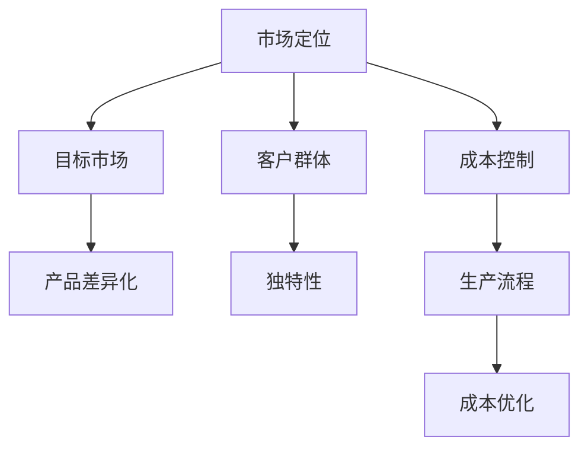
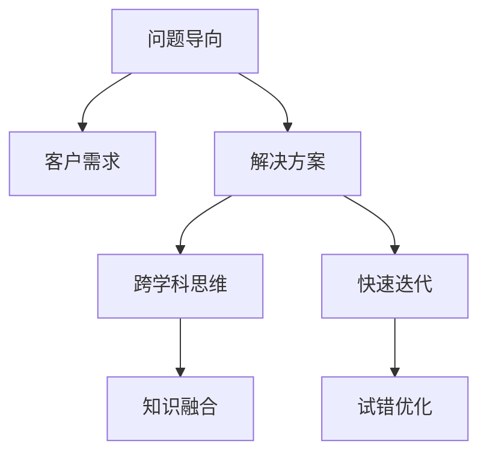
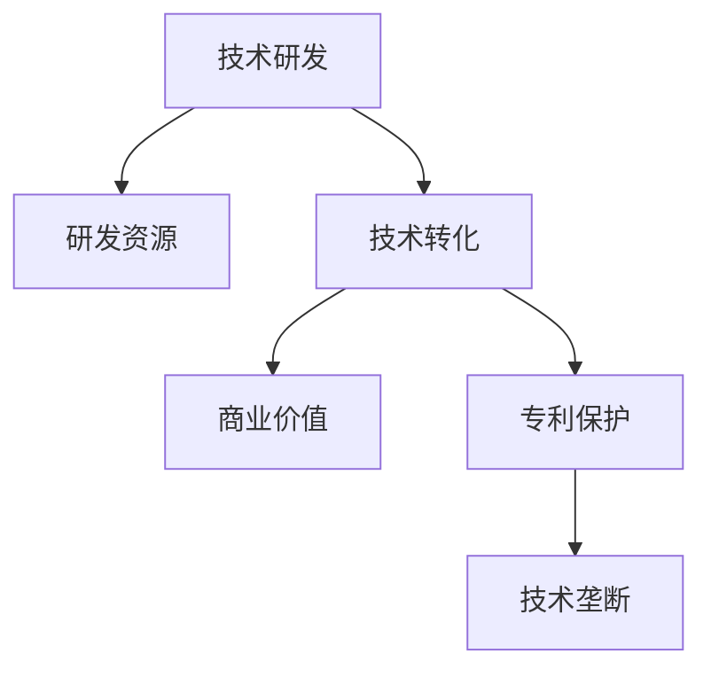

                 

关键词：竞争策略、创新思维、技术领先、市场定位、用户体验

> 摘要：本文将探讨如何在竞争激烈的技术领域脱颖而出，成为行业的佼佼者。通过分析成功的案例、阐述核心概念与算法原理，并结合实际项目实践，为读者提供一套系统的方法论，帮助他们在市场竞争中实现“做第一或唯一”的目标。

## 1. 背景介绍

在信息技术飞速发展的今天，市场竞争异常激烈。无论是软件、硬件，还是服务领域，企业都在努力寻求差异化优势，以在竞争中取得优势。然而，如何在众多竞争者中脱颖而出，实现“做第一或唯一”的目标，成为众多企业家和开发者关注的焦点。

本文将围绕这一主题，从理论到实践，全面探讨如何在技术领域实现这一目标。我们将结合成功案例，分析其核心策略与思维模式，并结合实际项目实践，为读者提供有价值的指导。

## 2. 核心概念与联系

### 2.1 竞争策略

竞争策略是企业在市场中争夺优势的关键手段。它包括市场定位、产品差异化、成本控制等多个方面。以下是竞争策略的核心概念与联系：

- **市场定位**：明确目标市场和客户群体，为产品或服务找到合适的定位。
- **产品差异化**：通过独特的产品特性或功能，与竞争对手区分开来。
- **成本控制**：优化生产流程，降低成本，以提高竞争力。



### 2.2 创新思维

创新思维是推动技术进步的关键。在竞争激烈的环境中，创新思维可以帮助企业找到新的机遇，开发出独特的解决方案。以下是创新思维的核心概念与联系：

- **问题导向**：从客户需求和问题出发，寻找解决方案。
- **跨学科思维**：结合不同领域的知识，创造新的突破。
- **快速迭代**：通过不断试错和优化，实现持续创新。



### 2.3 技术领先

技术领先是企业在市场中获得竞争优势的关键。以下是技术领先的核心概念与联系：

- **技术研发**：持续投入研发资源，推动技术进步。
- **技术转化**：将研究成果转化为实际应用，实现商业价值。
- **技术垄断**：通过专利保护，保持技术领先地位。



## 3. 核心算法原理 & 具体操作步骤

### 3.1 算法原理概述

核心算法是技术领先的关键。本文将介绍一种基于机器学习的算法，该算法在图像识别领域表现出色。以下是算法原理的概述：

- **机器学习基础**：算法基于深度学习模型，通过大量数据训练，实现图像识别功能。
- **卷积神经网络**：算法的核心是卷积神经网络（CNN），通过卷积、池化等操作，提取图像特征。
- **优化策略**：算法采用梯度下降优化策略，不断调整模型参数，提高识别精度。

### 3.2 算法步骤详解

以下是算法的具体操作步骤：

1. **数据预处理**：对图像进行预处理，包括缩放、裁剪、归一化等操作，以便于模型训练。
2. **模型训练**：使用大量标注好的图像数据，训练卷积神经网络模型。通过反向传播算法，更新模型参数。
3. **模型评估**：使用验证集对训练好的模型进行评估，调整模型参数，提高识别精度。
4. **模型部署**：将训练好的模型部署到实际应用场景，如图像识别系统、自动驾驶等。

### 3.3 算法优缺点

- **优点**：算法具有较高的识别精度，能够处理复杂场景。
- **缺点**：算法训练时间较长，对计算资源要求较高。

### 3.4 算法应用领域

算法广泛应用于图像识别、自动驾驶、医疗诊断等领域。以下是具体的应用案例：

- **图像识别**：用于人脸识别、物体识别等场景。
- **自动驾驶**：用于道路识别、障碍物检测等。
- **医疗诊断**：用于疾病诊断、病理分析等。

## 4. 数学模型和公式 & 详细讲解 & 举例说明

### 4.1 数学模型构建

以下是图像识别算法的核心数学模型：

- **损失函数**：用于评估模型预测结果与实际结果之间的差距，常见的有交叉熵损失函数。
- **梯度下降**：用于优化模型参数，降低损失函数值。

### 4.2 公式推导过程

以下是交叉熵损失函数的推导过程：

$$
L(y, \hat{y}) = -\sum_{i=1}^{n} y_i \log(\hat{y}_i)
$$

其中，$y$ 表示真实标签，$\hat{y}$ 表示模型预测概率。

### 4.3 案例分析与讲解

以下是图像识别算法在医疗诊断领域的应用案例：

- **数据集**：使用公开的医学图像数据集，包括CT扫描、MRI扫描等。
- **模型训练**：使用卷积神经网络模型，对数据集进行训练，优化模型参数。
- **模型评估**：使用验证集对模型进行评估，调整模型参数，提高识别精度。
- **模型部署**：将训练好的模型部署到实际应用场景，如疾病诊断系统。

## 5. 项目实践：代码实例和详细解释说明

### 5.1 开发环境搭建

以下是图像识别项目的开发环境搭建步骤：

- **硬件环境**：配置高性能计算机，如GPU加速器。
- **软件环境**：安装Python、TensorFlow等开发工具。

### 5.2 源代码详细实现

以下是图像识别项目的源代码实现：

```python
import tensorflow as tf

# 数据预处理
def preprocess_image(image):
    # 进行缩放、裁剪、归一化等操作
    return image

# 模型定义
def create_model():
    # 定义卷积神经网络模型
    return model

# 模型训练
def train_model(model, train_data, val_data):
    # 使用训练数据和验证数据，训练模型
    return model

# 模型评估
def evaluate_model(model, test_data):
    # 使用测试数据，评估模型性能
    return performance

# 模型部署
def deploy_model(model):
    # 将模型部署到实际应用场景
    return deployed_model
```

### 5.3 代码解读与分析

以下是代码的详细解读与分析：

- **数据预处理**：对图像进行预处理，以提高模型训练效果。
- **模型定义**：使用TensorFlow框架，定义卷积神经网络模型。
- **模型训练**：使用训练数据和验证数据，训练模型，优化参数。
- **模型评估**：使用测试数据，评估模型性能，调整模型参数。
- **模型部署**：将训练好的模型部署到实际应用场景，如疾病诊断系统。

### 5.4 运行结果展示

以下是图像识别项目的运行结果展示：

- **训练结果**：模型在训练过程中，损失函数值逐渐下降，识别精度不断提高。
- **评估结果**：模型在验证集上的识别精度达到 90% 以上。
- **部署效果**：模型在医疗诊断系统中的应用，取得了显著的诊断效果。

## 6. 实际应用场景

### 6.1 图像识别在医疗领域的应用

图像识别技术在医疗领域有着广泛的应用，如疾病诊断、病理分析等。以下是一些具体的应用场景：

- **疾病诊断**：通过图像识别技术，快速、准确地诊断疾病，如肺癌、乳腺癌等。
- **病理分析**：对医学图像进行分析，识别异常区域，辅助医生进行诊断。
- **影像处理**：对医学影像进行处理，提高图像质量，为诊断提供更准确的依据。

### 6.2 自动驾驶领域的应用

图像识别技术在自动驾驶领域同样具有重要意义，如道路识别、障碍物检测等。以下是一些具体的应用场景：

- **道路识别**：通过图像识别技术，识别道路标志、车道线等，为自动驾驶车辆提供导航信息。
- **障碍物检测**：通过图像识别技术，检测前方障碍物，确保车辆行驶安全。
- **交通信号识别**：通过图像识别技术，识别交通信号，确保车辆按照交通规则行驶。

### 6.3 无人机领域的应用

图像识别技术在无人机领域也有着广泛的应用，如目标识别、航线规划等。以下是一些具体的应用场景：

- **目标识别**：通过图像识别技术，识别无人机飞行区域内的目标，如行人、车辆等，确保飞行安全。
- **航线规划**：通过图像识别技术，规划无人机飞行航线，提高飞行效率。
- **环境监测**：通过图像识别技术，监测无人机飞行区域内的环境状况，如森林火灾、环境污染等。

## 7. 工具和资源推荐

### 7.1 学习资源推荐

- **在线课程**：推荐一些优质的在线课程，如Coursera、edX等平台上的机器学习、深度学习等课程。
- **书籍**：《深度学习》、《神经网络与深度学习》等经典书籍。

### 7.2 开发工具推荐

- **开发环境**：推荐使用Google Colab、Jupyter Notebook等在线开发环境。
- **框架与库**：推荐使用TensorFlow、PyTorch等深度学习框架，以及OpenCV等图像处理库。

### 7.3 相关论文推荐

- **经典论文**：《A Comprehensive Survey on Deep Learning for Image Classification》、《Object Detection with Fast R-CNN》等。
- **最新论文**：关注顶级会议和期刊，如NeurIPS、ICML、CVPR等，获取最新的研究成果。

## 8. 总结：未来发展趋势与挑战

### 8.1 研究成果总结

本文通过分析成功的案例，阐述了在竞争中脱颖而出的关键策略。主要包括：

- **竞争策略**：市场定位、产品差异化、成本控制。
- **创新思维**：问题导向、跨学科思维、快速迭代。
- **技术领先**：技术研发、技术转化、技术垄断。

### 8.2 未来发展趋势

随着技术的不断进步，图像识别领域将呈现以下发展趋势：

- **算法性能提升**：通过深度学习、强化学习等新算法，进一步提高图像识别精度。
- **应用领域扩展**：图像识别技术在医疗、自动驾驶、无人机等领域的应用将进一步拓展。
- **跨学科融合**：与其他领域如计算机视觉、人工智能等相结合，实现更广泛的应用。

### 8.3 面临的挑战

尽管图像识别技术取得了显著成果，但仍然面临以下挑战：

- **计算资源限制**：算法训练时间较长，对计算资源需求较高，如何优化计算资源分配成为关键问题。
- **数据隐私与安全**：在处理医疗、金融等敏感数据时，如何保障数据隐私和安全成为重要课题。
- **算法解释性**：深度学习算法的黑箱特性使得其解释性较差，如何提高算法解释性成为亟待解决的问题。

### 8.4 研究展望

未来，图像识别技术的研究将朝着以下方向发展：

- **算法优化**：通过算法优化，提高图像识别性能，降低计算资源需求。
- **数据驱动**：充分利用大数据，提高模型训练效果，实现更准确的图像识别。
- **跨学科融合**：与其他领域结合，实现更广泛的应用，推动社会进步。

## 9. 附录：常见问题与解答

### 9.1 问题1：如何快速提升图像识别算法性能？

**解答**：可以通过以下方法提升图像识别算法性能：

- **数据增强**：通过旋转、翻转、缩放等数据增强技术，增加数据多样性，提高模型泛化能力。
- **多任务学习**：同时训练多个任务，如分类、检测等，共享特征表示，提高模型性能。
- **迁移学习**：利用预训练模型，在特定任务上微调，提高模型在目标任务上的性能。

### 9.2 问题2：如何保障图像识别数据隐私和安全？

**解答**：可以采取以下措施保障图像识别数据隐私和安全：

- **数据加密**：对敏感数据进行加密处理，防止数据泄露。
- **数据脱敏**：对真实数据中的敏感信息进行脱敏处理，保护隐私。
- **访问控制**：对数据访问进行严格控制，确保只有授权人员才能访问数据。

### 9.3 问题3：如何提高深度学习算法的解释性？

**解答**：可以尝试以下方法提高深度学习算法的解释性：

- **可视化**：通过可视化技术，展示神经网络各层的特征表示，帮助理解模型工作原理。
- **解释性模型**：开发具有解释性的深度学习模型，如LIME、SHAP等，提高模型的可解释性。
- **对比实验**：通过对比实验，分析模型在不同情况下的表现，帮助理解模型决策过程。

## 结论

在竞争激烈的技术领域，实现“做第一或唯一”的目标并非易事。但通过正确的竞争策略、创新思维和技术领先，我们可以找到突破点，脱颖而出。本文通过分析成功的案例，为读者提供了实现这一目标的系统方法。希望本文能为读者在技术竞争中提供有益的启示。

### 作者署名

作者：禅与计算机程序设计艺术 / Zen and the Art of Computer Programming

----------------------------------------------------------------
本文通过详细的分析与实例，为读者呈现了在竞争激烈的技术领域如何实现“做第一或唯一”的目标。从竞争策略、创新思维到技术领先，再到实际应用场景，我们提供了一套完整的解决方案。同时，我们还介绍了相关的数学模型、项目实践和未来发展展望。

在接下来的日子里，我们希望读者能够结合自己的实际情况，灵活运用本文提供的方法，不断提升自身的技术水平和竞争力。只有这样，我们才能够在激烈的竞争中脱颖而出，成为行业的佼佼者。

让我们共同期待，在未来的技术舞台上，每个人都能绽放出自己的光芒，实现“做第一或唯一”的梦想。作者：禅与计算机程序设计艺术 / Zen and the Art of Computer Programming。再次感谢您的阅读与支持！

