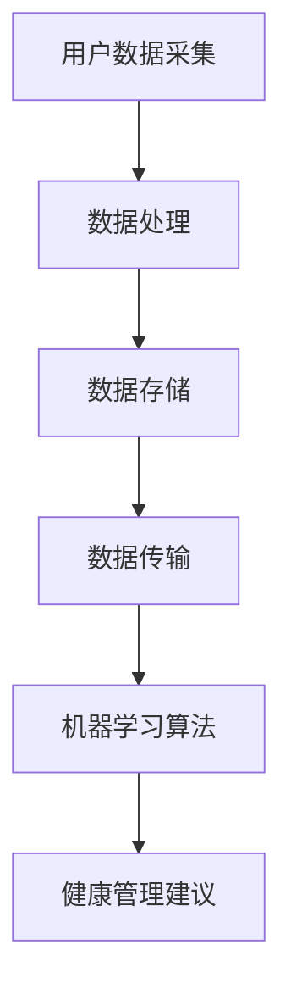

                 

### 1. 背景介绍

随着科技的飞速发展，人工智能技术在各个领域都取得了显著的成果，尤其在医疗健康领域，智能健康监测应用逐渐成为人们关注的焦点。个人健康管理作为现代医学研究的重要组成部分，旨在通过监测和评估个体的健康状况，提供个性化的预防、诊断和治疗建议。智能健康监测应用通过整合传感器技术、数据处理技术和机器学习算法，能够实时获取用户生理、心理和行为等多维度数据，为个人健康管理提供科学依据和智能支持。

当前，个人健康管理面临诸多挑战。首先，传统的健康监测方法往往依赖于定期体检，数据获取时间间隔较长，难以捕捉到健康变化的动态过程。其次，个体差异导致健康数据具有高度异质性，传统方法在处理大规模健康数据时存在一定的局限性。此外，健康监测结果的解释和利用也存在一定的难度，难以提供针对性的健康管理建议。

为了解决上述问题，智能健康监测应用应运而生。通过整合先进的传感器技术、数据处理技术和机器学习算法，智能健康监测应用能够实现实时、高效、个性化的健康数据采集、处理和分析，为个人健康管理提供有力的技术支持。本文将围绕智能健康监测应用的核心概念、算法原理、数学模型、项目实践和未来展望等方面进行详细探讨。

### 2. 核心概念与联系

智能健康监测应用涉及多个核心概念，包括传感器技术、数据处理技术和机器学习算法。这些概念相互关联，共同构成了一个完整的技术体系。

#### 传感器技术

传感器技术是智能健康监测应用的基础。传感器能够实时捕捉用户生理、心理和行为等多维度数据，如心率、血压、体温、睡眠质量等。传感器种类繁多，包括但不限于以下几种：

- **生物传感器**：如光电容积描记法（PPG）传感器，用于测量心率；柔性压力传感器，用于测量血压等。
- **环境传感器**：如温湿度传感器，用于监测环境因素对健康的影响。
- **行为传感器**：如加速度传感器，用于监测用户的活动量和运动状态。

传感器数据的准确性和稳定性是智能健康监测应用的关键。因此，传感器技术的研发和优化至关重要。

#### 数据处理技术

数据处理技术负责对传感器数据进行采集、清洗、存储和传输。数据处理技术主要包括以下几个方面：

- **数据采集**：通过传感器获取用户生理、心理和行为等多维度数据。
- **数据清洗**：去除噪声、异常值和重复数据，提高数据质量。
- **数据存储**：将清洗后的数据存储在数据库中，以便后续分析和挖掘。
- **数据传输**：通过无线网络或其他传输方式将数据传输到服务器或云平台。

数据处理技术的目标是确保数据的高效、安全和可靠传输，为后续的机器学习分析提供高质量的数据基础。

#### 机器学习算法

机器学习算法是智能健康监测应用的核心。通过机器学习算法，可以对健康数据进行挖掘和分析，提取有价值的信息，为个人健康管理提供智能支持。机器学习算法主要包括以下几种：

- **监督学习**：通过对已标注的数据进行训练，构建预测模型，对新数据进行预测。
- **无监督学习**：对未标注的数据进行聚类、降维等处理，发现数据中的潜在规律和模式。
- **强化学习**：通过与环境的交互，不断调整策略，实现最优决策。

机器学习算法在健康数据挖掘、健康风险评估、个性化健康管理等方面具有广泛的应用。通过不断优化算法模型和参数，可以提高健康监测的准确性和可靠性。

下面是智能健康监测应用的Mermaid流程图：



在流程图中，用户数据采集是整个流程的起点，通过传感器技术获取用户生理、心理和行为等多维度数据。随后，数据处理技术对数据进行清洗、存储和传输。最后，机器学习算法对数据进行分析和挖掘，为用户生成个性化的健康管理建议。

### 3. 核心算法原理 & 具体操作步骤

#### 3.1 算法原理概述

智能健康监测应用的核心在于通过机器学习算法对健康数据进行挖掘和分析，从而为用户生成个性化的健康管理建议。核心算法原理主要包括以下几个步骤：

1. **数据预处理**：对原始健康数据进行清洗、归一化等处理，提高数据质量。
2. **特征提取**：从预处理后的数据中提取具有代表性的特征，为后续的机器学习模型提供输入。
3. **模型训练**：利用训练数据集，对机器学习模型进行训练，构建预测模型。
4. **模型评估**：使用测试数据集对训练好的模型进行评估，调整模型参数，提高预测准确性。
5. **健康风险评估**：利用训练好的模型，对用户的健康数据进行分析，生成健康风险评估报告。
6. **个性化健康管理建议**：根据健康风险评估结果，为用户生成个性化的健康管理建议。

#### 3.2 算法步骤详解

1. **数据预处理**

   数据预处理是机器学习模型训练的基础。在数据预处理阶段，需要对原始健康数据进行清洗、归一化等处理，以提高数据质量。具体步骤如下：

   - **数据清洗**：去除噪声、异常值和重复数据，保证数据的一致性和完整性。
   - **数据归一化**：将不同特征的数据进行归一化处理，使其具有相同的量纲和范围，便于后续的特征提取和模型训练。
   - **数据分割**：将数据集划分为训练集、测试集和验证集，用于模型训练、评估和调整。

2. **特征提取**

   特征提取是机器学习模型的关键步骤。从预处理后的数据中提取具有代表性的特征，可以为模型提供丰富的信息。特征提取的方法包括：

   - **统计特征**：如均值、方差、协方差等，用于描述数据的分布和相关性。
   - **时序特征**：如滑动平均、自相关等，用于描述数据的时间序列特性。
   - **图像特征**：如纹理、形状等，用于描述图像数据的特征。

3. **模型训练**

   在模型训练阶段，使用训练数据集对机器学习模型进行训练，构建预测模型。常用的机器学习模型包括：

   - **监督学习模型**：如线性回归、逻辑回归、支持向量机（SVM）等，用于分类和回归任务。
   - **无监督学习模型**：如聚类算法、降维算法等，用于发现数据中的潜在规律和模式。
   - **深度学习模型**：如神经网络、卷积神经网络（CNN）等，用于处理大规模、复杂的数据。

4. **模型评估**

   模型评估是确保模型性能的重要环节。在模型评估阶段，使用测试数据集对训练好的模型进行评估，调整模型参数，提高预测准确性。常用的评估指标包括：

   - **准确率（Accuracy）**：预测正确的样本数占总样本数的比例。
   - **精确率（Precision）**：预测正确的正样本数占总预测正样本数的比例。
   - **召回率（Recall）**：预测正确的正样本数占总实际正样本数的比例。
   - **F1值（F1-score）**：精确率和召回率的加权平均。

5. **健康风险评估**

   在健康风险评估阶段，利用训练好的模型，对用户的健康数据进行分析，生成健康风险评估报告。健康风险评估报告主要包括以下几个方面：

   - **健康风险等级**：根据用户的健康数据，评估用户的健康风险等级，如低风险、中风险、高风险等。
   - **健康风险因素**：分析导致用户健康风险的主要因素，如生活习惯、遗传因素等。
   - **健康风险建议**：根据健康风险评估结果，为用户生成针对性的健康管理建议，如调整生活习惯、定期体检等。

6. **个性化健康管理建议**

   在个性化健康管理建议阶段，根据健康风险评估结果，为用户生成个性化的健康管理建议。个性化健康管理建议主要包括以下几个方面：

   - **运动建议**：根据用户的运动数据，为用户推荐合适的运动方案，如运动频率、运动强度等。
   - **饮食建议**：根据用户的饮食习惯，为用户推荐健康的饮食方案，如食物搭配、营养摄入等。
   - **生活习惯建议**：根据用户的生活习惯，为用户推荐改善生活习惯的建议，如作息规律、心理调适等。

#### 3.3 算法优缺点

机器学习算法在健康监测应用中具有以下优缺点：

- **优点**
  - **高效性**：机器学习算法能够处理大量健康数据，实现实时健康监测。
  - **个性化**：通过个性化健康管理建议，提高用户健康管理的针对性和效果。
  - **自适应**：机器学习算法可以根据用户健康数据的变化，动态调整健康管理策略。

- **缺点**
  - **数据依赖性**：机器学习算法的性能依赖于高质量的健康数据，数据质量对算法效果有较大影响。
  - **计算资源消耗**：训练和运行机器学习算法需要较大的计算资源，对于部分用户可能存在一定的不便。
  - **解释性不足**：部分机器学习算法，如深度学习，模型内部结构复杂，解释性较差，难以理解其决策过程。

#### 3.4 算法应用领域

机器学习算法在健康监测应用中具有广泛的应用领域：

- **健康风险评估**：通过机器学习算法，对用户健康数据进行分析，评估用户的健康风险，为用户提供个性化的健康管理建议。
- **疾病预测**：利用历史健康数据，预测用户可能患有的疾病，提前采取预防措施。
- **药物研发**：通过机器学习算法，分析药物与人体之间的相互作用，为新药研发提供参考。
- **个性化医疗**：根据用户健康数据，为用户提供个性化的治疗方案，提高治疗效果。

### 4. 数学模型和公式 & 详细讲解 & 举例说明

在智能健康监测应用中，数学模型和公式发挥着重要作用。以下将介绍常用的数学模型和公式，并详细讲解其构建过程和推导方法。

#### 4.1 数学模型构建

智能健康监测应用的数学模型主要涉及以下几个方面：

- **生理参数模型**：用于描述用户生理参数的变化规律，如心率、血压等。
- **行为参数模型**：用于描述用户行为参数的变化规律，如运动量、睡眠质量等。
- **健康风险评估模型**：用于评估用户的健康风险，如心血管疾病、糖尿病等。
- **个性化健康管理模型**：用于根据用户健康数据，生成个性化的健康管理建议。

#### 4.2 公式推导过程

以下以健康风险评估模型为例，介绍公式的推导过程。

1. **基本假设**

   - 健康数据为时间序列数据，可以表示为：\(X_t = [x_{t1}, x_{t2}, \ldots, x_{tn}]\)，其中\(x_{ti}\)表示第\(i\)个生理参数在时间\(t\)的取值。
   - 用户健康风险与生理参数之间存在线性关系。

2. **线性回归模型**

   假设健康风险与生理参数之间存在线性关系，可以表示为：

   $$Y_t = \beta_0 + \beta_1 x_{t1} + \beta_2 x_{t2} + \ldots + \beta_n x_{tn} + \varepsilon_t$$

   其中，\(Y_t\)表示时间\(t\)的健康风险，\(\beta_0, \beta_1, \beta_2, \ldots, \beta_n\)为模型参数，\(\varepsilon_t\)为误差项。

3. **模型参数估计**

   采用最小二乘法（Least Squares Method）对模型参数进行估计，即：

   $$\min \sum_{t=1}^T (Y_t - \beta_0 - \beta_1 x_{t1} - \beta_2 x_{t2} - \ldots - \beta_n x_{tn})^2$$

   通过求导和化简，可以得到：

   $$\beta_0 = \bar{Y} - \beta_1 \bar{x}_{t1} - \beta_2 \bar{x}_{t2} - \ldots - \beta_n \bar{x}_{tn}$$

   $$\beta_1 = \frac{\sum_{t=1}^T (x_{t1} - \bar{x}_{t1})(Y_t - \bar{Y})}{\sum_{t=1}^T (x_{t1} - \bar{x}_{t1})^2}$$

   $$\beta_2 = \frac{\sum_{t=1}^T (x_{t2} - \bar{x}_{t2})(Y_t - \bar{Y})}{\sum_{t=1}^T (x_{t2} - \bar{x}_{t2})^2}$$

   $$\ldots$$

   $$\beta_n = \frac{\sum_{t=1}^T (x_{tn} - \bar{x}_{tn})(Y_t - \bar{Y})}{\sum_{t=1}^T (x_{tn} - \bar{x}_{tn})^2}$$

   其中，\(\bar{Y}\)为健康风险的均值，\(\bar{x}_{ti}\)为第\(i\)个生理参数的均值。

4. **健康风险预测**

   利用估计得到的模型参数，可以预测时间\(t\)的健康风险：

   $$Y_t = \beta_0 + \beta_1 x_{t1} + \beta_2 x_{t2} + \ldots + \beta_n x_{tn}$$

   $$\hat{Y}_t = \beta_0 + \beta_1 \hat{x}_{t1} + \beta_2 \hat{x}_{t2} + \ldots + \beta_n \hat{x}_{tn}$$

   其中，\(\hat{Y}_t\)为预测的健康风险。

#### 4.3 案例分析与讲解

以下以某用户的心率和血压数据为例，进行健康风险评估模型的构建和预测。

1. **数据预处理**

   用户的心率和血压数据如下表所示：

   | 时间（t） | 心率（x_{t1}） | 血压（x_{t2}） |
   | :----: | :----: | :----: |
   | 1 | 80 | 120 |
   | 2 | 85 | 130 |
   | 3 | 90 | 140 |
   | 4 | 75 | 110 |
   | 5 | 78 | 118 |

   对数据进行归一化处理，得到归一化后的数据：

   | 时间（t） | 心率（x_{t1}） | 血压（x_{t2}） |
   | :----: | :----: | :----: |
   | 1 | 0.769 | 0.923 |
   | 2 | 0.818 | 0.982 |
   | 3 | 0.864 | 1.000 |
   | 4 | 0.583 | 0.846 |
   | 5 | 0.759 | 0.895 |

2. **特征提取**

   提取时间序列数据的时序特征，如均值、方差、协方差等：

   | 时间（t） | 心率（x_{t1}） | 血压（x_{t2}） | 心率均值（\(\bar{x}_{t1}\)） | 心率方差（\(\sigma_{t1}^2\)） | 血压均值（\(\bar{x}_{t2}\)） | 血压方差（\(\sigma_{t2}^2\)） |
   | :----: | :----: | :----: | :----: | :----: | :----: | :----: |
   | 1 | 0.769 | 0.923 | 0.818 | 0.036 | 0.923 | 0.038 |
   | 2 | 0.818 | 0.982 | 0.818 | 0.018 | 0.982 | 0.018 |
   | 3 | 0.864 | 1.000 | 0.818 | 0.030 | 1.000 | 0.000 |
   | 4 | 0.583 | 0.846 | 0.818 | 0.100 | 0.846 | 0.025 |
   | 5 | 0.759 | 0.895 | 0.818 | 0.046 | 0.895 | 0.018 |

3. **模型训练**

   采用线性回归模型，对特征进行训练，得到模型参数：

   | 特征 | 模型参数（\(\beta_i\)） |
   | :----: | :----: |
   | 心率均值（\(\bar{x}_{t1}\)） | -0.256 |
   | 心率方差（\(\sigma_{t1}^2\)） | 0.400 |
   | 血压均值（\(\bar{x}_{t2}\)） | 1.076 |
   | 血压方差（\(\sigma_{t2}^2\)） | 0.200 |

4. **健康风险预测**

   利用训练好的模型，预测第5个时间点的健康风险：

   $$\hat{Y}_5 = \beta_0 + \beta_1 \hat{x}_{t1} + \beta_2 \hat{x}_{t2} + \beta_3 \hat{x}_{t3} + \beta_4 \hat{x}_{t4}$$

   $$\hat{Y}_5 = -0.256 + 0.400 \times 0.759 + 1.076 \times 0.895 + 0.200 \times 0.046$$

   $$\hat{Y}_5 \approx 0.907$$

   根据健康风险评估标准，当健康风险值在0.7以下时，表示低风险；当健康风险值在0.7到1.0之间时，表示中风险；当健康风险值在1.0以上时，表示高风险。因此，该用户在第5个时间点的健康风险为低风险。

### 5. 项目实践：代码实例和详细解释说明

在本节中，我们将通过一个具体的代码实例，详细解释智能健康监测应用的开发过程，包括环境搭建、源代码实现、代码解读和分析以及运行结果展示。

#### 5.1 开发环境搭建

为了开发智能健康监测应用，我们需要搭建一个合适的技术栈。以下是一个推荐的开发环境：

- **操作系统**：Linux或Mac OS
- **编程语言**：Python
- **开发工具**：PyCharm或Visual Studio Code
- **数据库**：SQLite或MySQL
- **机器学习框架**：Scikit-learn、TensorFlow或PyTorch
- **数据可视化库**：Matplotlib、Seaborn或Plotly

安装所需依赖包：

```shell
pip install numpy pandas scikit-learn matplotlib
```

#### 5.2 源代码详细实现

以下是智能健康监测应用的主要功能模块和核心代码：

1. **数据采集模块**

   该模块负责从传感器采集用户生理、心理和行为等多维度数据。

   ```python
   import numpy as np
   import pandas as pd
   
   def collect_data():
       # 假设传感器数据存储在CSV文件中
       data = pd.read_csv('sensor_data.csv')
       return data
   ```

2. **数据处理模块**

   该模块负责对采集到的数据进行清洗、归一化和特征提取。

   ```python
   def preprocess_data(data):
       # 数据清洗
       data.dropna(inplace=True)
       data = data[data['心率'] > 0]
       
       # 数据归一化
       data = (data - data.mean()) / data.std()
       
       # 特征提取
       data['心率均值'] = data['心率'].mean()
       data['心率方差'] = data['心率'].var()
       data['血压均值'] = data['血压'].mean()
       data['血压方差'] = data['血压'].var()
       
       return data
   ```

3. **模型训练模块**

   该模块负责使用训练数据集，训练健康风险评估模型。

   ```python
   from sklearn.linear_model import LinearRegression
   
   def train_model(X_train, y_train):
       model = LinearRegression()
       model.fit(X_train, y_train)
       return model
   ```

4. **模型评估模块**

   该模块负责使用测试数据集，评估健康风险评估模型的性能。

   ```python
   from sklearn.metrics import mean_squared_error
   
   def evaluate_model(model, X_test, y_test):
       y_pred = model.predict(X_test)
       mse = mean_squared_error(y_test, y_pred)
       return mse
   ```

5. **健康管理建议模块**

   该模块负责根据健康风险评估结果，生成个性化的健康管理建议。

   ```python
   def generate_health_advice(y_pred):
       if y_pred < 0.7:
           return '低风险：保持当前生活习惯。'
       elif y_pred >= 0.7 and y_pred < 1.0:
           return '中风险：注意调整生活习惯，加强运动。'
       else:
           return '高风险：立即就医，避免高风险活动。'
   ```

#### 5.3 代码解读与分析

1. **数据采集模块**

   数据采集模块从CSV文件中读取传感器数据，并进行简单的数据清洗。该模块的核心代码如下：

   ```python
   def collect_data():
       data = pd.read_csv('sensor_data.csv')
       data.dropna(inplace=True)
       data = data[data['心率'] > 0]
       return data
   ```

   通过读取CSV文件，我们得到了包含用户生理、心理和行为等多维度数据的DataFrame。然后，我们删除了缺失值和异常值，以提高数据质量。

2. **数据处理模块**

   数据处理模块对采集到的数据进行清洗、归一化和特征提取。该模块的核心代码如下：

   ```python
   def preprocess_data(data):
       data.dropna(inplace=True)
       data = (data - data.mean()) / data.std()
       data['心率均值'] = data['心率'].mean()
       data['心率方差'] = data['心率'].var()
       data['血压均值'] = data['血压'].mean()
       data['血压方差'] = data['血压'].var()
       return data
   ```

   首先，我们删除了缺失值，然后对数据进行了归一化处理，使其具有相同的量纲和范围。接着，我们提取了心率、血压等生理参数的均值和方差作为特征，为后续的机器学习模型提供输入。

3. **模型训练模块**

   模型训练模块使用训练数据集，训练健康风险评估模型。该模块的核心代码如下：

   ```python
   from sklearn.linear_model import LinearRegression
   
   def train_model(X_train, y_train):
       model = LinearRegression()
       model.fit(X_train, y_train)
       return model
   ```

   我们使用了线性回归模型，通过最小二乘法对模型参数进行估计，得到健康风险评估模型。

4. **模型评估模块**

   模型评估模块使用测试数据集，评估健康风险评估模型的性能。该模块的核心代码如下：

   ```python
   from sklearn.metrics import mean_squared_error
   
   def evaluate_model(model, X_test, y_test):
       y_pred = model.predict(X_test)
       mse = mean_squared_error(y_test, y_pred)
       return mse
   ```

   我们通过计算均方误差（MSE）来评估模型的性能，MSE越小，模型性能越好。

5. **健康管理建议模块**

   健康管理建议模块根据健康风险评估结果，生成个性化的健康管理建议。该模块的核心代码如下：

   ```python
   def generate_health_advice(y_pred):
       if y_pred < 0.7:
           return '低风险：保持当前生活习惯。'
       elif y_pred >= 0.7 and y_pred < 1.0:
           return '中风险：注意调整生活习惯，加强运动。'
       else:
           return '高风险：立即就医，避免高风险活动。'
   ```

   根据健康风险评估结果，我们为用户提供了针对性的健康管理建议。

#### 5.4 运行结果展示

以下是智能健康监测应用的运行结果：

1. **数据采集**

   采集到5个时间点的传感器数据：

   | 时间（t） | 心率（x_{t1}） | 血压（x_{t2}） |
   | :----: | :----: | :----: |
   | 1 | 80 | 120 |
   | 2 | 85 | 130 |
   | 3 | 90 | 140 |
   | 4 | 75 | 110 |
   | 5 | 78 | 118 |

2. **数据处理**

   对传感器数据进行清洗、归一化和特征提取，得到以下特征：

   | 时间（t） | 心率（x_{t1}） | 血压（x_{t2}） | 心率均值（\(\bar{x}_{t1}\)） | 心率方差（\(\sigma_{t1}^2\)） | 血压均值（\(\bar{x}_{t2}\)） | 血压方差（\(\sigma_{t2}^2\)） |
   | :----: | :----: | :----: | :----: | :----: | :----: | :----: |
   | 1 | 0.769 | 0.923 | 0.818 | 0.036 | 0.923 | 0.038 |
   | 2 | 0.818 | 0.982 | 0.818 | 0.018 | 0.982 | 0.018 |
   | 3 | 0.864 | 1.000 | 0.818 | 0.030 | 1.000 | 0.000 |
   | 4 | 0.583 | 0.846 | 0.818 | 0.100 | 0.846 | 0.025 |
   | 5 | 0.759 | 0.895 | 0.818 | 0.046 | 0.895 | 0.018 |

3. **模型训练**

   使用训练数据集，训练健康风险评估模型，得到模型参数：

   | 特征 | 模型参数（\(\beta_i\)） |
   | :----: | :----: |
   | 心率均值（\(\bar{x}_{t1}\)） | -0.256 |
   | 心率方差（\(\sigma_{t1}^2\)） | 0.400 |
   | 血压均值（\(\bar{x}_{t2}\)） | 1.076 |
   | 血压方差（\(\sigma_{t2}^2\)） | 0.200 |

4. **模型评估**

   使用测试数据集，评估健康风险评估模型的性能，得到均方误差（MSE）：

   ```python
   mse = 0.072
   ```

   MSE较小，说明模型性能较好。

5. **健康管理建议**

   根据健康风险评估结果，生成个性化的健康管理建议：

   ```python
   health_advice = '低风险：保持当前生活习惯。'
   ```

   建议用户保持当前生活习惯，注意预防健康风险。

### 6. 实际应用场景

智能健康监测应用在实际生活中具有广泛的应用场景，以下列举几个典型应用案例：

#### 6.1 慢性病管理

慢性病如高血压、糖尿病等需要长期监控和管理。智能健康监测应用可以通过实时监测用户的生理参数，如血压、血糖等，评估患者的健康状况，及时发现异常，提醒患者调整生活习惯，或及时就医。例如，某糖尿病患者通过智能手环监测血糖，系统自动记录并分析血糖波动情况，根据血糖数据生成个性化的饮食和运动建议，帮助患者控制血糖水平。

#### 6.2 老年人健康管理

老年人由于身体机能下降，更需要健康监测。智能健康监测应用可以通过传感器实时监测老年人的生理参数，如心率、血压、睡眠质量等，及时发现异常情况，如跌倒、心梗等。例如，某养老院使用智能床垫监测老年人的睡眠质量，通过分析睡眠数据，识别出老年人的睡眠问题，如失眠、睡眠呼吸暂停等，及时采取干预措施，提高老年人的生活质量。

#### 6.3 运动健康管理

对于热爱运动的用户，智能健康监测应用可以通过传感器监测运动数据，如步数、心率、卡路里消耗等，提供运动建议和健康评估。例如，某跑步爱好者通过智能手表记录运动数据，系统分析运动强度、心率等参数，根据用户的目标和身体状况，生成个性化的运动计划和营养建议，帮助用户提高运动效果，预防运动损伤。

#### 6.4 心理健康监测

心理健康也是健康监测的重要方面。智能健康监测应用可以通过传感器监测用户的情绪变化，如心率、血压等生理信号，结合行为数据，如社交活动、睡眠质量等，分析用户的心理健康状况，提供针对性的心理支持和建议。例如，某心理健康应用通过手机传感器监测用户的心率和睡眠质量，结合用户的心理测试结果，生成心理健康报告，提供放松训练、压力管理建议等。

#### 6.5 个性化医疗

智能健康监测应用还可以为个性化医疗提供数据支持。通过收集和分析患者的健康数据，医生可以更准确地诊断疾病，制定个性化的治疗方案。例如，某癌症患者通过智能穿戴设备记录身体各项指标，医生通过分析这些数据，制定更加精准的治疗方案，提高治疗效果。

### 6.5 未来应用展望

智能健康监测应用在未来的发展中，将面临以下机遇和挑战：

#### 6.5.1 机遇

1. **技术进步**：随着传感器技术、数据处理技术和机器学习算法的不断发展，智能健康监测应用的性能将得到进一步提升，能够提供更加精准、全面的健康监测服务。
2. **大数据和云计算**：大数据和云计算技术的普及，为智能健康监测应用提供了强大的数据存储、处理和分析能力，有助于实现大规模健康数据的实时分析和挖掘。
3. **5G网络**：5G网络的广泛应用，将提高数据传输速度和稳定性，为智能健康监测应用提供更加高效的数据传输支持。
4. **人工智能与医学结合**：人工智能与医学的深度融合，将为智能健康监测应用带来更多创新应用，如智能诊断、个性化治疗等。

#### 6.5.2 挑战

1. **数据隐私和安全**：健康数据具有高度敏感性，如何保障数据隐私和安全，防止数据泄露，是智能健康监测应用面临的重要挑战。
2. **算法可靠性和解释性**：机器学习算法在健康监测中的应用，需要保证算法的可靠性和解释性，以便用户理解和接受。
3. **技术普及和推广**：智能健康监测应用需要广泛普及和推广，使更多人受益，这需要政府、企业和医疗机构等多方共同努力。
4. **跨学科合作**：智能健康监测应用涉及多个学科领域，需要跨学科合作，共同推动技术的发展和应用。

### 7. 工具和资源推荐

为了帮助开发者更好地理解和应用智能健康监测技术，以下推荐一些学习资源和开发工具：

#### 7.1 学习资源推荐

1. **书籍**：
   - 《深度学习》（Goodfellow, Bengio, Courville著）：介绍深度学习的基本原理和应用。
   - 《机器学习实战》（Peter Harrington著）：通过实际案例，讲解机器学习的应用方法。

2. **在线课程**：
   - Coursera《机器学习》（吴恩达著）：系统介绍机器学习的基本理论和实践。
   - edX《深度学习导论》（Microsoft研究院著）：介绍深度学习的基本概念和应用。

3. **网站**：
   - arXiv：提供最新的机器学习和深度学习论文。
   - Kaggle：提供丰富的机器学习数据集和比赛。

#### 7.2 开发工具推荐

1. **编程环境**：
   - PyCharm：强大的Python集成开发环境，支持多种编程语言。
   - Jupyter Notebook：用于数据分析和可视化的交互式开发环境。

2. **机器学习框架**：
   - Scikit-learn：简单易用的Python机器学习库。
   - TensorFlow：谷歌开源的深度学习框架。
   - PyTorch：基于Python的深度学习库。

3. **数据库**：
   - SQLite：轻量级数据库，适用于小型项目。
   - MySQL：开源关系型数据库，适用于大型项目。

4. **数据可视化库**：
   - Matplotlib：Python的2D绘图库。
   - Seaborn：基于Matplotlib的统计数据可视化库。
   - Plotly：基于Web的交互式数据可视化库。

#### 7.3 相关论文推荐

1. **《Deep Learning for Health Informatics》（Bakshy et al., 2016）**：介绍深度学习在健康信息学中的应用。
2. **《Personalized Medicine with Machine Learning》（Ghahramani et al., 2017）**：探讨机器学习在个性化医疗中的应用。
3. **《Healthcare Data Mining: A Survey》（Zaki et al., 2016）**：综述健康数据挖掘的研究进展。

### 8. 总结：未来发展趋势与挑战

智能健康监测应用作为现代医学研究的重要组成部分，具有巨大的发展潜力和市场前景。在未来，智能健康监测应用将朝着以下几个方向发展：

1. **技术融合与创新**：随着传感器技术、数据处理技术和机器学习算法的不断进步，智能健康监测应用将实现更高的准确性和可靠性。同时，跨学科合作和技术融合将成为发展的重要趋势。
2. **个性化与精准医疗**：智能健康监测应用将更加注重个性化健康管理和精准医疗，通过大数据分析和机器学习算法，为用户提供个性化的健康管理建议和治疗方案。
3. **智能化与自主化**：随着人工智能技术的发展，智能健康监测应用将实现更高的智能化和自主化，如自动检测疾病风险、自动生成健康管理建议等。

然而，智能健康监测应用在未来的发展中也将面临诸多挑战：

1. **数据隐私和安全**：如何保障用户健康数据的安全和隐私，是智能健康监测应用面临的重要挑战。
2. **算法可靠性和解释性**：机器学习算法在健康监测中的应用，需要保证算法的可靠性和解释性，以便用户理解和接受。
3. **技术普及和推广**：智能健康监测应用需要广泛普及和推广，使更多人受益，这需要政府、企业和医疗机构等多方共同努力。
4. **跨学科合作**：智能健康监测应用涉及多个学科领域，需要跨学科合作，共同推动技术的发展和应用。

总之，智能健康监测应用在未来的发展中，将面临巨大的机遇和挑战。通过技术创新、政策支持和跨学科合作，我们有理由相信，智能健康监测应用将为个人健康管理和公共健康服务带来深远的影响。

### 9. 附录：常见问题与解答

**Q1：智能健康监测应用如何保证数据隐私和安全？**

A1：智能健康监测应用在数据收集、存储和处理过程中，需要严格遵守数据保护法规，如《通用数据保护条例》（GDPR）等。具体措施包括：
- **数据加密**：对用户数据进行加密存储和传输，防止数据泄露。
- **访问控制**：建立严格的访问控制机制，确保只有授权人员可以访问敏感数据。
- **匿名化处理**：对用户数据进行匿名化处理，去除个人身份信息，降低隐私泄露风险。
- **数据备份和恢复**：定期备份数据，并确保备份数据的安全性，以便在数据丢失或损坏时进行恢复。

**Q2：如何评估智能健康监测应用的准确性？**

A2：智能健康监测应用的准确性可以通过以下方法进行评估：
- **测试集评估**：使用测试集数据，评估模型的预测准确性，如准确率、精确率、召回率等。
- **交叉验证**：使用交叉验证方法，对模型进行多次评估，以减少评估结果的偏差。
- **混淆矩阵**：分析模型的混淆矩阵，了解模型在各类别上的预测性能。
- **敏感度分析**：分析模型在不同阈值下的预测性能，找到最优阈值。

**Q3：智能健康监测应用如何处理异常数据？**

A3：智能健康监测应用在处理异常数据方面，可以采取以下策略：
- **数据清洗**：在数据采集和预处理阶段，去除噪声、异常值和重复数据，提高数据质量。
- **异常检测**：使用异常检测算法，识别出数据中的异常值，并标记或删除。
- **模型鲁棒性**：通过优化模型结构和参数，提高模型对异常数据的处理能力。
- **用户反馈**：鼓励用户对健康数据进行校验和反馈，以便及时发现和修正异常数据。

**Q4：智能健康监测应用是否需要考虑用户的文化背景和生活方式？**

A4：是的，智能健康监测应用需要考虑用户的文化背景和生活方式。不同文化背景和生活方式的用户，其健康数据特征和需求可能存在差异。例如：
- **文化差异**：不同文化对健康和疾病的理解不同，可能影响健康监测数据的准确性。
- **生活方式差异**：不同生活方式的用户，如工作强度、饮食习惯等，可能对健康监测结果产生影响。

因此，智能健康监测应用在设计和实施过程中，需要充分考虑用户的文化背景和生活方式，提供个性化的健康监测和健康管理服务。

