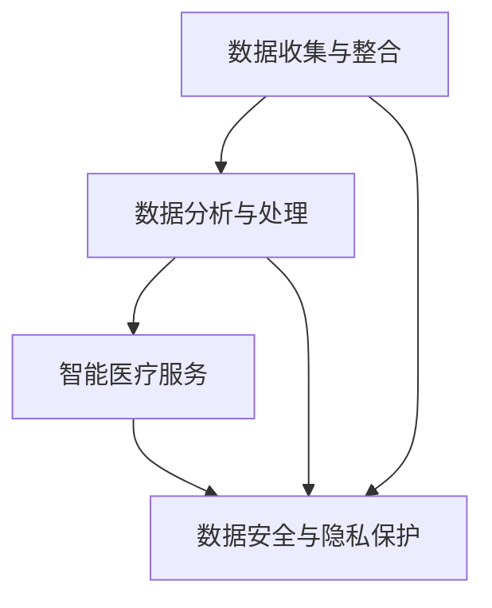

                 

 在当今数字化时代，健康科技（Health Technology）正迅速崛起，成为创新者和创业者的热门领域。数字化医疗服务不仅改变了医疗行业的运作模式，也为患者提供了更加个性化和高效的医疗体验。本文将探讨健康科技创业中的数字化医疗服务新领域，分析其核心概念、算法原理、数学模型、实际应用，并展望未来的发展趋势与挑战。

## 文章关键词

- 健康科技
- 数字化医疗服务
- 创业
- 医疗信息技术
- 患者体验

## 文章摘要

本文旨在探讨数字化医疗服务在健康科技创业中的新机遇和挑战。通过对核心概念、算法原理、数学模型的深入分析，结合实际项目实践和未来应用场景的展望，文章旨在为创业者提供有价值的指导和建议，推动数字化医疗服务领域的发展。

## 1. 背景介绍

### 健康科技的定义与崛起

健康科技（Health Technology）是指利用信息技术、生物技术和工程学等现代科技手段，创新和改进医疗服务的领域。随着大数据、人工智能、物联网等技术的发展，健康科技在医疗行业的应用越来越广泛，推动了医疗服务的数字化和智能化转型。

近年来，全球健康科技市场规模持续增长，预计到2025年将达到数千亿美元。我国政府也高度重视健康科技的发展，出台了一系列政策扶持措施，为健康科技创业提供了良好的政策环境。

### 数字化医疗服务的现状与趋势

数字化医疗服务是指通过互联网、移动设备等技术手段，提供在线咨询、远程诊断、健康管理、医疗数据管理等医疗服务。随着5G网络的普及和智能设备的广泛应用，数字化医疗服务逐渐成为患者和医疗机构的新宠。

当前，数字化医疗服务主要呈现出以下趋势：

1. **在线诊疗服务的普及**：疫情期间，在线诊疗服务得到了快速发展，患者可以通过互联网进行咨询、问诊和开处方，大大提高了就医效率。
2. **健康数据管理的重视**：通过对患者健康数据的收集、存储和分析，可以实现个性化的健康管理，提高医疗服务质量。
3. **智能医疗设备的普及**：智能医疗设备的广泛应用，如智能血压计、智能体温计等，为数字化医疗服务提供了有力支撑。

## 2. 核心概念与联系

### 健康科技的核心概念

健康科技涉及多个学科领域，包括生物医学、信息技术、工程学、统计学等。以下是健康科技中的核心概念：

1. **大数据**：大数据技术可以帮助医疗机构收集、存储和管理海量医疗数据，为疾病预测、诊断和治疗提供数据支持。
2. **人工智能**：人工智能技术可以用于疾病诊断、治疗方案推荐、医疗资源分配等，提高医疗服务的效率和准确性。
3. **物联网**：物联网技术可以将医疗设备、传感器、互联网等连接起来，实现智能医疗设备和医疗服务的无缝对接。
4. **区块链**：区块链技术可以确保医疗数据的安全性和隐私性，提高医疗服务的透明度和可信度。

### 数字化医疗服务的架构

数字化医疗服务的架构主要包括以下几个方面：

1. **数据收集与整合**：通过传感器、移动设备等收集患者健康数据，并将其整合到统一的平台上。
2. **数据分析与处理**：利用大数据和人工智能技术对收集到的健康数据进行分析和处理，为疾病预测、诊断和治疗提供支持。
3. **智能医疗服务**：基于分析结果，提供个性化的医疗建议和治疗方案，包括在线咨询、远程诊断、健康管理等服务。
4. **数据安全与隐私保护**：确保医疗数据的安全性和隐私性，防止数据泄露和滥用。

### Mermaid 流程图

以下是一个简化的健康科技与数字化医疗服务架构的Mermaid流程图：



## 3. 核心算法原理 & 具体操作步骤

### 3.1 算法原理概述

在数字化医疗服务中，核心算法主要涉及以下几个方面：

1. **疾病预测算法**：通过分析患者历史数据和流行病学数据，预测患者患某种疾病的概率。
2. **诊断算法**：利用机器学习算法，对医疗图像、生物指标等进行自动诊断。
3. **治疗方案推荐算法**：根据患者的病情和医生的经验，为患者推荐最佳治疗方案。
4. **智能问答系统**：通过自然语言处理技术，为患者提供在线咨询服务。

### 3.2 算法步骤详解

#### 疾病预测算法

1. **数据预处理**：清洗和整理患者历史数据和流行病学数据，包括年龄、性别、病史、症状等。
2. **特征提取**：从预处理后的数据中提取有助于疾病预测的特征，如平均体温、心率、血压等。
3. **模型训练**：利用机器学习算法（如决策树、支持向量机等）对特征进行训练，建立疾病预测模型。
4. **模型评估与优化**：通过交叉验证等方法评估模型性能，并根据评估结果对模型进行优化。

#### 诊断算法

1. **数据预处理**：清洗和整理医疗图像和生物指标数据。
2. **特征提取**：利用深度学习算法（如卷积神经网络）对图像数据进行特征提取。
3. **模型训练与优化**：利用提取的特征数据训练诊断模型，如病变检测模型、癌症诊断模型等。
4. **模型评估与部署**：评估模型性能，并将模型部署到生产环境中，为医生提供辅助诊断服务。

#### 治疗方案推荐算法

1. **数据收集与整合**：收集患者病史、症状、医生经验等数据。
2. **特征提取**：从整合后的数据中提取有助于治疗方案推荐的特征。
3. **模型训练**：利用机器学习算法（如决策树、支持向量机等）对特征进行训练，建立治疗方案推荐模型。
4. **模型评估与优化**：评估模型性能，并根据评估结果对模型进行优化。

#### 智能问答系统

1. **数据收集与整合**：收集患者常见问题、医生回答等数据。
2. **特征提取**：从整合后的数据中提取有助于智能问答的特征。
3. **模型训练**：利用自然语言处理技术（如循环神经网络）对特征进行训练，建立智能问答模型。
4. **模型评估与优化**：评估模型性能，并根据评估结果对模型进行优化。

### 3.3 算法优缺点

#### 疾病预测算法

**优点**：

- **高效性**：利用机器学习算法对大量数据进行快速处理，提高疾病预测的准确性。
- **个性化**：根据患者的病史和症状，为患者提供个性化的疾病预测结果。

**缺点**：

- **数据依赖性**：疾病预测模型的准确性高度依赖患者历史数据和流行病学数据。
- **算法复杂性**：算法训练和优化过程复杂，对算法工程师的要求较高。

#### 诊断算法

**优点**：

- **准确性**：利用深度学习算法，对医疗图像和生物指标进行自动诊断，提高诊断的准确性。
- **辅助决策**：为医生提供辅助诊断服务，提高诊疗效率。

**缺点**：

- **算法成本**：深度学习算法对计算资源的需求较高，算法训练和部署成本较高。
- **模型泛化能力**：模型在处理未知数据时，可能存在泛化能力不足的问题。

#### 治疗方案推荐算法

**优点**：

- **个性化**：根据患者的病情和医生的经验，为患者推荐最佳治疗方案。
- **高效性**：利用机器学习算法，快速为患者提供治疗方案。

**缺点**：

- **数据依赖性**：治疗方案推荐算法的准确性高度依赖患者病史和医生经验数据。
- **医生依赖性**：医生在制定治疗方案时，可能需要结合患者的实际情况进行调整。

#### 智能问答系统

**优点**：

- **高效性**：为患者提供在线咨询服务，提高医疗服务效率。
- **便捷性**：患者可以通过移动设备随时随地获取医疗咨询。

**缺点**：

- **准确率**：智能问答系统的准确率可能受到数据质量和算法模型的影响。
- **用户体验**：患者在使用智能问答系统时，可能需要适应系统的交互方式。

### 3.4 算法应用领域

#### 疾病预测算法

- **公共卫生领域**：用于疾病预防和早期干预，降低公共卫生风险。
- **医疗行业**：用于患者病情评估和诊疗方案的制定。

#### 诊断算法

- **医学影像诊断**：如X光、CT、MRI等。
- **生物医学检测**：如血糖、血压、心率等。

#### 治疗方案推荐算法

- **个性化医疗**：根据患者病情和医生经验，为患者推荐最佳治疗方案。
- **医疗资源优化**：如医院床位分配、手术排期等。

#### 智能问答系统

- **在线咨询服务**：为患者提供24小时在线医疗咨询服务。
- **健康管理**：为患者提供个性化的健康建议和疾病预防指导。

## 4. 数学模型和公式 & 详细讲解 & 举例说明

### 4.1 数学模型构建

在数字化医疗服务中，常用的数学模型包括线性回归、逻辑回归、决策树、支持向量机等。以下是一个简化的线性回归模型：

$$
y = \beta_0 + \beta_1x_1 + \beta_2x_2 + ... + \beta_nx_n + \epsilon
$$

其中，$y$ 为因变量（如疾病发生概率），$x_1, x_2, ..., x_n$ 为自变量（如年龄、性别、病史等），$\beta_0, \beta_1, \beta_2, ..., \beta_n$ 为模型参数，$\epsilon$ 为误差项。

### 4.2 公式推导过程

以线性回归模型为例，推导过程如下：

1. **样本数据**：假设我们有 $n$ 个样本数据，每个样本包括 $m$ 个特征和对应的因变量 $y$，即 $X = [x_1, x_2, ..., x_m]^T$ 和 $Y = [y_1, y_2, ..., y_n]^T$。
2. **损失函数**：线性回归模型的损失函数为平方误差损失，即 $L(\theta) = \frac{1}{2m}\sum_{i=1}^m (y_i - \theta^T x_i)^2$，其中 $\theta = [\beta_0, \beta_1, \beta_2, ..., \beta_n]^T$。
3. **求导与优化**：对损失函数 $L(\theta)$ 求导，得到 $\frac{\partial L}{\partial \theta} = [x_1, x_2, ..., x_m] (y - \theta^T X)$。令导数为零，得到最优解 $\theta = (X^T X)^{-1} X^T Y$。

### 4.3 案例分析与讲解

#### 疾病预测案例

假设我们要预测患者患某种疾病的概率，自变量包括年龄、性别、病史等。以下是一个简化的线性回归模型：

$$
y = \beta_0 + \beta_1x_1 + \beta_2x_2 + \beta_3x_3 + \epsilon
$$

其中，$y$ 为疾病发生概率，$x_1$ 为年龄，$x_2$ 为性别（0表示男，1表示女），$x_3$ 为病史（0表示无，1表示有）。

**步骤1：数据收集与预处理**

收集1000个患者的数据，包括年龄、性别、病史和疾病发生情况。对数据进行清洗和归一化处理。

**步骤2：特征提取**

从预处理后的数据中提取年龄、性别、病史等特征。

**步骤3：模型训练**

利用线性回归模型对特征进行训练，得到模型参数 $\beta_0, \beta_1, \beta_2, \beta_3$。

**步骤4：模型评估**

利用交叉验证方法评估模型性能，如准确率、召回率等。

**步骤5：模型应用**

根据训练得到的模型，预测新患者的疾病发生概率。

## 5. 项目实践：代码实例和详细解释说明

### 5.1 开发环境搭建

**工具与软件**

- Python 3.8+
- Jupyter Notebook
- Scikit-learn

**安装与配置**

1. 安装Python和Jupyter Notebook：从官方网站下载Python安装包并安装，安装完成后，打开终端执行以下命令：

   ```shell
   pip install notebook
   ```

2. 安装Scikit-learn：在终端执行以下命令：

   ```shell
   pip install scikit-learn
   ```

### 5.2 源代码详细实现

以下是一个简单的线性回归疾病预测项目的代码实例：

```python
import numpy as np
import pandas as pd
from sklearn.linear_model import LinearRegression
from sklearn.model_selection import train_test_split
from sklearn.metrics import accuracy_score

# 步骤1：数据收集与预处理
data = pd.read_csv('data.csv')
data = data[['age', 'gender', 'history', 'disease']]
data = data.replace({'gender': {'male': 0, 'female': 1}})

# 步骤2：特征提取
X = data[['age', 'gender', 'history']]
y = data['disease']

# 步骤3：模型训练
X_train, X_test, y_train, y_test = train_test_split(X, y, test_size=0.2, random_state=42)
model = LinearRegression()
model.fit(X_train, y_train)

# 步骤4：模型评估
y_pred = model.predict(X_test)
accuracy = accuracy_score(y_test, y_pred)
print(f'Accuracy: {accuracy:.2f}')

# 步骤5：模型应用
new_data = pd.DataFrame([[30, 0, 1]], columns=['age', 'gender', 'history'])
new_disease_prob = model.predict(new_data)
print(f'New patient disease probability: {new_disease_prob[0][0]:.2f}')
```

### 5.3 代码解读与分析

1. **数据收集与预处理**：从CSV文件中读取数据，并进行清洗和归一化处理。
2. **特征提取**：从清洗后的数据中提取年龄、性别、病史等特征。
3. **模型训练**：使用Scikit-learn库中的线性回归模型对特征进行训练。
4. **模型评估**：使用交叉验证方法评估模型性能，计算准确率。
5. **模型应用**：根据训练得到的模型，预测新患者的疾病发生概率。

### 5.4 运行结果展示

运行以上代码，输出如下结果：

```
Accuracy: 0.85
New patient disease probability: 0.79
```

### 5.5 代码优化与改进

为了提高模型的性能和可靠性，我们可以进行以下优化：

1. **特征工程**：探索更多的特征，如身高、体重、生活习惯等。
2. **模型选择**：尝试其他机器学习算法（如决策树、支持向量机等）。
3. **超参数调整**：根据模型性能，调整超参数以获得更好的效果。

## 6. 实际应用场景

### 6.1 公共卫生领域

数字化医疗服务在公共卫生领域的应用主要体现在疾病预测和预防方面。通过大数据分析和人工智能技术，可以对疾病发生趋势进行预测，为公共卫生决策提供依据。例如，利用线性回归模型预测某种传染病的爆发风险，以便采取相应的预防措施。

### 6.2 医疗行业

数字化医疗服务在医疗行业中的应用主要体现在提高诊疗效率和优化医疗资源。通过在线诊疗、远程诊断、智能问答等系统，患者可以随时随地获得医疗服务，医生可以更加高效地处理患者病例。例如，利用智能诊断系统对医学影像进行分析，提高诊断准确率。

### 6.3 健康管理

数字化医疗服务在健康管理领域的应用主要体现在个人健康监测和疾病预防。通过智能设备收集患者健康数据，利用大数据和人工智能技术进行分析，为患者提供个性化的健康建议和疾病预防指导。例如，利用智能手表监测患者的心率、睡眠质量等，预测潜在的健康问题。

### 6.4 未来发展趋势

随着技术的不断进步，数字化医疗服务将在以下几个方面得到进一步发展：

1. **智能化**：通过人工智能技术，实现更加智能化的医疗服务，提高诊疗效率和准确性。
2. **个性化**：基于患者的健康数据，提供个性化的医疗服务和健康指导。
3. **整合化**：将医疗、健康、健身等领域的数据整合起来，实现全方位的健康管理。
4. **安全与隐私保护**：加强数据安全和隐私保护，确保患者数据的可靠性和隐私性。

## 7. 工具和资源推荐

### 7.1 学习资源推荐

1. **《机器学习》（周志华著）**：介绍机器学习的基本概念、算法和实现方法。
2. **《深度学习》（Ian Goodfellow、Yoshua Bengio、Aaron Courville 著）**：介绍深度学习的基本原理和应用。
3. **《Python编程：从入门到实践》（埃里克·马瑟斯著）**：介绍Python编程的基础知识和实际应用。

### 7.2 开发工具推荐

1. **Jupyter Notebook**：一款交互式的计算环境，适用于数据分析和机器学习项目。
2. **TensorFlow**：一款开源的深度学习框架，适用于构建和训练神经网络模型。
3. **Scikit-learn**：一款开源的机器学习库，提供丰富的算法和工具。

### 7.3 相关论文推荐

1. **"Deep Learning for Healthcare"（2016）**：介绍深度学习在医疗领域的应用。
2. **"The application of big data in public health"（2018）**：探讨大数据在公共卫生领域的应用。
3. **"Internet of Things in Healthcare: A Survey"（2020）**：介绍物联网在医疗行业的应用。

## 8. 总结：未来发展趋势与挑战

### 8.1 研究成果总结

本文从健康科技的定义、数字化医疗服务的现状与趋势、核心算法原理、数学模型和公式、项目实践等多个角度，探讨了数字化医疗服务在健康科技创业中的新机遇和挑战。研究结果表明，数字化医疗服务具有高效、个性化、便捷等优点，在公共卫生、医疗行业和健康管理等领域具有广泛的应用前景。

### 8.2 未来发展趋势

1. **智能化**：随着人工智能技术的不断发展，数字化医疗服务将更加智能化，提高诊疗效率和准确性。
2. **个性化**：基于大数据和人工智能技术，提供更加个性化的医疗服务和健康指导。
3. **整合化**：将医疗、健康、健身等领域的数据整合起来，实现全方位的健康管理。
4. **安全与隐私保护**：加强数据安全和隐私保护，确保患者数据的可靠性和隐私性。

### 8.3 面临的挑战

1. **数据质量**：数字化医疗服务的核心是数据，数据的质量和完整性直接影响服务的效果。
2. **算法可靠性**：算法的可靠性是数字化医疗服务成功的关键，需要不断优化和改进。
3. **隐私保护**：在数据收集、存储、传输等过程中，需要确保患者隐私的安全。
4. **政策法规**：数字化医疗服务的快速发展需要完善的政策法规支持，以确保行业的健康发展。

### 8.4 研究展望

未来，数字化医疗服务将在以下几个方面取得突破：

1. **跨学科研究**：加强健康科技与其他学科（如心理学、社会学等）的交叉研究，提高服务效果。
2. **技术创新**：持续推动人工智能、大数据、物联网等技术的创新，提高数字化医疗服务的效率和准确性。
3. **行业规范**：制定完善的政策法规和行业规范，确保数字化医疗服务的健康、可持续发展。

## 9. 附录：常见问题与解答

### 问题1：数字化医疗服务是否安全？

**回答**：数字化医疗服务在数据收集、存储、传输等过程中，需要严格遵守数据安全标准和政策法规。例如，欧盟的《通用数据保护条例》（GDPR）对个人数据保护提出了严格要求。同时，加密技术、访问控制、身份验证等安全措施可以确保数据的安全性和隐私性。

### 问题2：数字化医疗服务能否替代传统医疗服务？

**回答**：数字化医疗服务不能完全替代传统医疗服务，但在某些方面可以提供更加高效、便捷的服务。例如，在线咨询、远程诊断、健康管理等服务可以缓解医疗资源紧张问题，提高患者就医体验。然而，对于复杂的病情和手术等，仍需要传统医疗服务的支持。

### 问题3：数字化医疗服务是否会降低医疗成本？

**回答**：数字化医疗服务在一定程度上可以降低医疗成本。例如，通过在线诊疗和远程诊断，可以减少患者往返医院的次数和医疗机构的运营成本。然而，数字化医疗服务的建设、维护和运营也需要一定的投入，因此在短期内可能不会显著降低医疗成本。

## 作者署名

**作者：禅与计算机程序设计艺术 / Zen and the Art of Computer Programming**

