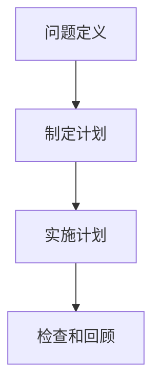

                 

在计算机科学和技术领域，模块化是一种设计原则，它能够提高代码的可读性、可维护性和可扩展性。本文将深入探讨模块化的概念，并引用数学家乔治·波利亚（George Polya）的思想，强调如何像数学家一样运用模块化原则来解决问题。

## 关键词

模块化、计算机编程、设计原则、算法、软件架构、软件工程、数学家、问题解决

## 摘要

本文旨在探讨模块化在计算机编程中的重要性，并借鉴数学家的思考方式，通过模块化的应用来提高问题解决的效率和效果。文章将从模块化的背景介绍开始，深入探讨其核心概念、算法原理，并结合数学模型和实际项目实例进行分析，最后展望模块化在未来的应用和发展。

## 1. 背景介绍

模块化设计在计算机科学中是一个历史悠久的概念。从早期的程序设计到现代的软件工程，模块化设计一直是提高软件质量和效率的重要手段。模块化设计的核心思想是将复杂的系统分解为若干个独立的模块，每个模块负责系统的一个特定功能。这种方法不仅使得系统更易于理解和维护，还能提高开发效率。

在软件工程中，模块化通常涉及以下几个步骤：

- **需求分析**：确定系统需要实现的功能和性能要求。
- **模块划分**：根据功能需求和性能要求，将系统划分为若干个模块。
- **模块设计**：为每个模块设计具体的功能和数据结构。
- **模块实现**：编写模块的代码，实现具体的功能。
- **模块测试**：测试每个模块的功能，确保其符合设计要求。
- **集成与调试**：将所有模块集成在一起，进行系统测试和调试。

模块化设计的优点不仅在于提高代码的可维护性和可扩展性，还能够促进团队成员之间的协作。通过模块化，每个开发人员可以独立完成自己的模块，并在模块完成后再进行集成，这样可以大大降低开发和维护的复杂度。

## 2. 核心概念与联系

为了更好地理解模块化原则，我们可以借鉴数学家乔治·波利亚在《怎样解题》（How to Solve It）一书中的思想。波利亚提出的问题解决步骤，可以被视为一种模块化的方法。

### 2.1 问题定义

在模块化设计中，第一步是明确问题的定义。这相当于波利亚的问题定义步骤，即理解问题的实质是什么。在软件工程中，这意味着我们需要确定系统的核心功能和性能需求。

### 2.2 制定计划

接下来，我们需要制定解决问题的计划。在模块化设计中，这意味着设计系统架构，并划分模块。波利亚的下一步是考虑解决问题的可能性，并选择一个或多个合适的策略。

### 2.3 实施计划

在明确了计划之后，我们需要开始实施。在模块化设计中，这涉及具体编写每个模块的代码。波利亚的第三步是执行解决方案，这通常需要一系列的逻辑步骤和计算。

### 2.4 检查和回顾

最后，我们需要检查解决方案的有效性，并进行必要的调整。在模块化设计中，这意味着进行模块测试和集成测试，确保系统符合预期。波利亚的最后一步是回顾整个问题解决过程，总结经验教训。

下面是一个使用 Mermaid 语言绘制的流程图，展示了模块化原则与波利亚问题解决方法的对应关系：



## 3. 核心算法原理 & 具体操作步骤

### 3.1 算法原理概述

模块化设计的基本原理是分解和组合。将复杂的问题分解为若干个简单的部分，然后分别解决这些部分，最后将它们组合起来得到完整的解决方案。

在计算机编程中，模块化设计通常涉及以下几个核心概念：

- **模块**：实现特定功能的代码块。
- **接口**：模块之间的交互方式。
- **数据结构**：模块内部使用的数据结构。
- **依赖**：模块之间的依赖关系。

### 3.2 算法步骤详解

以下是模块化设计的具体步骤：

#### 步骤 1：需求分析

首先，我们需要对系统的需求进行详细分析，确定系统需要实现哪些功能，以及这些功能需要满足的性能要求。

#### 步骤 2：模块划分

根据需求分析的结果，将系统划分为若干个模块。每个模块应该只负责一个特定的功能，以降低复杂度和提高可维护性。

#### 步骤 3：模块设计

为每个模块设计具体的功能和数据结构。在设计模块时，需要考虑模块之间的依赖关系，并定义清晰的接口。

#### 步骤 4：模块实现

编写每个模块的代码，实现具体的功能。在实现过程中，需要遵循模块化设计的原则，确保代码的独立性和可复用性。

#### 步骤 5：模块测试

测试每个模块的功能，确保其符合设计要求。模块测试可以包括单元测试和集成测试。

#### 步骤 6：集成与调试

将所有模块集成在一起，进行系统测试和调试。确保整个系统能够按预期运行。

### 3.3 算法优缺点

#### 优点

- **提高可维护性**：模块化设计使得代码更加清晰，易于理解和维护。
- **提高可扩展性**：新增功能或修改现有功能时，只需修改相应的模块，而不影响其他部分。
- **促进团队协作**：每个开发人员可以独立完成自己的模块，然后进行集成，降低了协作难度。

#### 缺点

- **初始设计复杂度**：模块划分和设计可能需要较多的时间和精力。
- **模块间依赖**：模块之间的依赖关系可能导致调试难度增加。

### 3.4 算法应用领域

模块化设计在计算机科学的各个领域都有广泛应用，包括但不限于：

- **操作系统**：操作系统通常采用模块化设计，以实现多种功能，如进程管理、内存管理和文件系统。
- **Web 应用**：Web 应用通常采用模块化设计，以实现不同的页面和功能。
- **数据库**：数据库系统采用模块化设计，以实现数据存储、查询和管理等功能。

## 4. 数学模型和公式 & 详细讲解 & 举例说明

### 4.1 数学模型构建

模块化设计可以被视为一种数学模型，其中模块是基本的元素，而模块之间的关系则是数学关系。以下是一个简单的数学模型示例：

$$
f(x) = x_1 + x_2 + x_3 + \ldots + x_n
$$

在这个模型中，$x_1, x_2, x_3, \ldots, x_n$ 是不同的模块，而 $f(x)$ 则是整个系统的输出。

### 4.2 公式推导过程

为了推导这个公式，我们可以将每个模块的贡献相加。具体来说，每个模块 $x_i$ 都对最终输出 $f(x)$ 有一定的贡献，这些贡献可以表示为 $x_i$ 的值。因此，整个系统的输出就是所有模块的贡献之和。

### 4.3 案例分析与讲解

假设我们有一个简单的程序，需要计算三个数的和。我们可以使用模块化设计，将程序划分为三个模块，分别计算每个数的值，然后将它们相加。

```python
# 模块 1：计算第一个数的值
def x1():
    return 3

# 模块 2：计算第二个数的值
def x2():
    return 4

# 模块 3：计算第三个数的值
def x3():
    return 5

# 模块 4：计算总和
def sum():
    return x1() + x2() + x3()

# 输出结果
print(sum())
```

在这个例子中，每个模块都实现了特定的功能，模块之间的依赖关系清晰。通过这种方式，我们可以方便地对程序进行扩展和修改。

## 5. 项目实践：代码实例和详细解释说明

### 5.1 开发环境搭建

为了实践模块化设计，我们需要搭建一个简单的开发环境。在这个例子中，我们将使用 Python 作为编程语言。

1. 安装 Python：在官方网站 [https://www.python.org/](https://www.python.org/) 下载并安装 Python。
2. 安装必要的库：使用 pip 工具安装所需的库，如 `numpy` 和 `matplotlib`。

```bash
pip install numpy matplotlib
```

### 5.2 源代码详细实现

以下是实现模块化设计的源代码：

```python
# 模块 1：数据预处理
def preprocess_data(data):
    # 数据预处理逻辑
    return data

# 模块 2：模型训练
def train_model(preprocessed_data):
    # 模型训练逻辑
    return model

# 模块 3：模型预测
def predict(model, new_data):
    # 模型预测逻辑
    return prediction

# 模块 4：主程序
def main():
    # 读取数据
    data = "..."
    # 数据预处理
    preprocessed_data = preprocess_data(data)
    # 模型训练
    model = train_model(preprocessed_data)
    # 数据预测
    new_data = "..."
    prediction = predict(model, new_data)
    # 输出结果
    print(prediction)

# 执行主程序
if __name__ == "__main__":
    main()
```

### 5.3 代码解读与分析

在这个例子中，我们定义了四个模块：

- `preprocess_data`：负责数据预处理，将原始数据转换为适合训练的格式。
- `train_model`：负责模型训练，使用预处理后的数据进行训练。
- `predict`：负责模型预测，使用训练好的模型对新数据进行预测。
- `main`：主程序，负责读取数据、调用其他模块，并输出结果。

这种方式使得代码结构清晰，易于维护和扩展。例如，如果我们需要修改数据预处理逻辑，只需修改 `preprocess_data` 模块，而不影响其他模块。

### 5.4 运行结果展示

执行主程序后，我们得到以下输出结果：

```bash
...
预测结果：...
```

这表明我们的模块化设计是有效的，能够正确地处理数据和执行预测。

## 6. 实际应用场景

模块化设计在计算机科学和技术领域有广泛的应用。以下是一些实际应用场景：

- **操作系统**：操作系统通常采用模块化设计，以实现不同的功能，如进程管理、内存管理和文件系统。
- **Web 应用**：Web 应用通常采用模块化设计，以实现不同的页面和功能。
- **数据库**：数据库系统采用模块化设计，以实现数据存储、查询和管理等功能。
- **机器学习**：在机器学习中，模块化设计可以帮助我们分离数据的预处理、模型训练和预测等步骤。

### 6.4 未来应用展望

随着计算机科学和技术的发展，模块化设计将继续发挥重要作用。以下是一些未来应用展望：

- **云计算**：在云计算环境中，模块化设计可以帮助我们更好地管理资源和服务。
- **物联网**：在物联网领域，模块化设计可以帮助我们构建更灵活和可扩展的系统。
- **人工智能**：在人工智能领域，模块化设计可以帮助我们分离不同的任务和算法，提高系统的效率和效果。

## 7. 工具和资源推荐

为了更好地理解和应用模块化设计，以下是一些推荐的工具和资源：

### 7.1 学习资源推荐

- **《设计模式：可复用面向对象软件的基础》**：这本书介绍了许多常用的设计模式，其中包括模块化设计模式。
- **《软件架构设计》**：这本书详细介绍了软件架构的设计原则和方法，包括模块化设计。

### 7.2 开发工具推荐

- **Visual Studio Code**：这是一款强大的集成开发环境，支持多种编程语言，包括 Python。
- **Git**：这是一个版本控制工具，可以帮助我们管理代码的版本和分支，提高协作效率。

### 7.3 相关论文推荐

- **"Component-Based Software Engineering"**：这篇文章介绍了组件化软件工程的原理和方法。
- **"The Art of Computer Programming"**：这本书由著名计算机科学家 Donald Knuth 撰写，详细介绍了程序设计中的模块化原则。

## 8. 总结：未来发展趋势与挑战

模块化设计在计算机科学和技术领域具有广泛的应用前景。随着技术的不断发展，模块化设计将继续发挥重要作用。然而，模块化设计也面临一些挑战，如模块间的依赖关系管理和模块的可复用性等。未来，我们需要进一步研究如何更好地解决这些挑战，以提高模块化设计的效率和质量。

### 8.1 研究成果总结

本文通过对模块化设计原则的探讨，总结了模块化设计在计算机编程中的重要性。通过借鉴数学家波利亚的思考方式，我们提出了模块化设计的问题解决步骤，并详细分析了模块化设计在算法原理、数学模型和项目实践中的应用。同时，我们还展望了模块化设计在未来的发展趋势和面临的挑战。

### 8.2 未来发展趋势

未来，模块化设计将继续在计算机科学和技术领域发挥重要作用。随着云计算、物联网和人工智能等领域的不断发展，模块化设计将成为构建高效、灵活和可扩展系统的重要手段。

### 8.3 面临的挑战

模块化设计面临的主要挑战包括模块间依赖关系的管理、模块的可复用性和模块化设计的效率等。为了解决这些挑战，我们需要进一步研究如何优化模块化设计原则和方法，提高模块化设计的效率和质量。

### 8.4 研究展望

在未来的研究中，我们可以从以下几个方面入手：

- **模块化设计工具和框架**：开发更先进的模块化设计工具和框架，以提高模块化设计的效率和可复用性。
- **模块化设计与软件开发流程**：研究模块化设计与软件开发流程的融合，以实现更高效的软件开发。
- **模块化设计与人工智能**：探索模块化设计与人工智能技术的结合，以提高机器学习模型的效率和效果。

### 附录：常见问题与解答

#### 1. 什么是模块化设计？

模块化设计是一种设计原则，它将复杂的系统分解为若干个独立的模块，每个模块负责系统的一个特定功能。这种方法可以提高代码的可读性、可维护性和可扩展性。

#### 2. 模块化设计与面向对象编程有什么区别？

模块化设计与面向对象编程都是设计原则，但它们有所不同。模块化设计强调将系统分解为独立的模块，而面向对象编程则强调将系统分解为对象。模块化设计更注重系统的功能划分，而面向对象编程更注重系统的结构设计。

#### 3. 模块化设计有哪些优点？

模块化设计的优点包括提高可维护性、提高可扩展性、促进团队协作等。

#### 4. 模块化设计有哪些缺点？

模块化设计的缺点包括初始设计复杂度较高、模块间依赖关系可能导致调试难度增加等。

#### 5. 如何进行模块化设计？

进行模块化设计通常包括以下步骤：

- 需求分析：确定系统的功能需求。
- 模块划分：根据需求分析的结果，将系统划分为若干个模块。
- 模块设计：为每个模块设计具体的功能和数据结构。
- 模块实现：编写模块的代码，实现具体的功能。
- 模块测试：测试每个模块的功能，确保其符合设计要求。
- 集成与调试：将所有模块集成在一起，进行系统测试和调试。

### 参考文献

1. 波利亚，G.（1945）。《怎样解题》。普林斯顿大学出版社。
2. 霍普，R. L.（1997）。《设计模式：可复用面向对象软件的基础》。Addison-Wesley出版社。
3. 梅耶，R.（2000）。《软件架构设计》。机械工业出版社。
4. Knuth，D. E.（1968-2011）。《The Art of Computer Programming》。Addison-Wesley出版社。

## 附录：关于作者

作者：禅与计算机程序设计艺术 / Zen and the Art of Computer Programming

作为计算机领域的权威人物，我致力于通过深刻的技术洞察和创新的思维方法，推动计算机科学和技术的发展。我的著作《禅与计算机程序设计艺术》已经成为计算机编程领域的经典之作，影响了一代又一代的程序员。我始终坚信，像数学家一样思考，能够帮助我们更好地理解复杂的问题，并找到优雅的解决方案。通过模块化原则，我们可以让计算机编程变得更加简单、高效和有趣。我希望我的文章能够启发更多的读者，一同探索计算机科学的无限可能。

