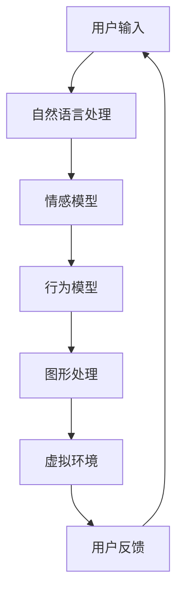

                 

元宇宙作为下一代互联网的愿景，正在逐渐改变我们的数字生活。在元宇宙中，虚拟宠物的概念逐渐崭露头角，它们不仅是一种娱乐工具，更是一种新的情感陪伴形式。本文将探讨元宇宙中的虚拟宠物技术，探讨其核心概念、技术架构、算法原理、数学模型以及实际应用。

## 关键词

- 元宇宙
- 虚拟宠物
- 情感陪伴
- 人工智能
- 图形处理

## 摘要

本文将深入探讨元宇宙中的虚拟宠物这一新兴概念。首先，我们将介绍虚拟宠物的定义和背景，然后分析其在元宇宙中的应用和意义。接着，我们将探讨虚拟宠物的技术架构，包括人工智能和图形处理等方面。最后，我们将通过具体实例展示虚拟宠物的实现过程，并讨论其未来的发展前景。

## 1. 背景介绍

虚拟宠物并非新鲜事物，在计算机游戏和虚拟现实中已有广泛的应用。然而，随着元宇宙的发展，虚拟宠物的概念得到了新的诠释和深化。在元宇宙中，虚拟宠物不仅仅是简单的角色或道具，它们成为用户在虚拟世界中的伙伴，具有情感和意识，能够与用户进行互动。

虚拟宠物的背景源于人们对情感陪伴的需求。在现代社会，由于工作、学习等压力，许多人感到孤独和缺乏陪伴。虚拟宠物提供了一个解决方案，它们可以在虚拟世界中为用户提供情感支持，成为用户的情感伴侣。

### 1.1 虚拟宠物的起源与发展

虚拟宠物起源于计算机游戏。在早期的游戏如《猫狗大战》（Nintendogs）和《宠物精灵》（Pokémon）中，玩家可以养宠物，与宠物互动。这些游戏中的宠物虽然具备简单的行为模式，但已经开始展现出与人类互动的可能性。

随着虚拟现实（VR）技术的发展，虚拟宠物得到了进一步的发展。VR中的宠物可以具有更加丰富的行为和情感，玩家可以通过VR设备与宠物进行更加真实的互动。例如，VR宠物模拟器可以让玩家与虚拟宠物一起遛狗、玩耍，甚至进行训练。

元宇宙的兴起将虚拟宠物推向了一个新的高度。在元宇宙中，虚拟宠物不仅是一个角色，而是一个具有自我意识和情感的存在。虚拟宠物可以与用户建立情感联系，提供陪伴和支持。这种互动不仅仅是单向的，而是双向的，宠物可以根据用户的情绪和行为做出相应的反应。

### 1.2 虚拟宠物在元宇宙中的应用

在元宇宙中，虚拟宠物具有广泛的应用场景。以下是一些主要的应用：

- **情感陪伴**：虚拟宠物可以为用户提供情感陪伴，特别是在用户感到孤独或压力较大时。通过虚拟宠物，用户可以释放压力，获得心理上的慰藉。
  
- **教育互动**：虚拟宠物可以作为教育工具，帮助儿童学习新的知识和技能。例如，虚拟宠物可以与儿童互动，引导他们学习语言、数学等学科。

- **游戏娱乐**：虚拟宠物可以提供丰富的游戏体验，用户可以通过训练、互动和游戏与宠物建立更深的情感联系。

- **社交平台**：虚拟宠物可以成为社交平台的一部分，用户可以在虚拟世界中与其他用户分享自己的宠物，建立社交关系。

- **虚拟现实体验**：虚拟宠物可以增强虚拟现实体验的沉浸感，用户可以在虚拟世界中与宠物一起探险、冒险。

### 1.3 虚拟宠物的发展趋势

随着技术的不断进步，虚拟宠物的发展前景十分广阔。以下是一些可能的发展趋势：

- **智能化**：虚拟宠物将越来越智能，能够更好地理解用户的情绪和行为，提供更加个性化的陪伴服务。

- **个性化**：虚拟宠物的形象和特征将更加多样化，用户可以根据自己的喜好定制宠物的外观和行为。

- **跨平台互动**：虚拟宠物将在不同平台之间实现无缝互动，用户可以在元宇宙内外的多个平台与宠物保持联系。

- **情感共鸣**：虚拟宠物将具备更高的情感共鸣能力，能够更好地理解用户的情感需求，提供更有效的情感支持。

## 2. 核心概念与联系

在探讨虚拟宠物在元宇宙中的应用之前，我们需要了解其核心概念和技术架构。虚拟宠物不仅是一个简单的虚拟角色，而是一个具有情感、行为和意识的复杂系统。以下我们将介绍虚拟宠物的核心概念及其相互关系。

### 2.1 虚拟宠物的定义

虚拟宠物是指在计算机生成的虚拟环境中具有生命特征、情感和行为的人工智能实体。它们可以模拟真实的宠物行为，如行走、奔跑、玩耍、休息等，同时具备一定的情感和认知能力。

### 2.2 虚拟宠物的核心概念

- **人工智能**：虚拟宠物的主要驱动力是人工智能技术，通过机器学习、自然语言处理等技术实现宠物的行为和情感模拟。
- **虚拟环境**：虚拟宠物存在于虚拟环境中，这个环境可以是一个三维虚拟空间，也可以是一个二维的交互界面。
- **用户交互**：虚拟宠物与用户之间的互动是虚拟宠物系统的重要组成部分，用户可以通过语音、手势、文字等方式与宠物交流。
- **情感模型**：虚拟宠物具备情感模型，能够根据用户的行为和情绪做出相应的情感反应。

### 2.3 虚拟宠物的技术架构

虚拟宠物的技术架构主要包括以下几个方面：

- **图形处理**：通过图形处理技术生成虚拟宠物的三维模型和动画效果，使宠物看起来更加真实和生动。
- **机器学习**：利用机器学习算法训练虚拟宠物的行为和情感模型，使其能够根据用户的反馈和情境做出合理的反应。
- **自然语言处理**：通过自然语言处理技术实现虚拟宠物的语音识别和文本生成，使宠物能够与用户进行自然的语言交流。
- **交互设计**：交互设计决定了虚拟宠物的用户界面和交互方式，包括界面布局、交互逻辑等。

### 2.4 Mermaid 流程图

以下是一个简单的 Mermaid 流程图，展示了虚拟宠物的技术架构：



### 2.5 虚拟宠物的核心概念与联系

虚拟宠物的核心概念和技术之间存在着紧密的联系。人工智能为虚拟宠物提供了行为和情感模拟的基础，图形处理技术使虚拟宠物看起来更加逼真，自然语言处理技术实现了虚拟宠物与用户的互动，而虚拟环境则为虚拟宠物的活动提供了空间。

通过这些核心概念和技术，虚拟宠物不仅能够模拟真实宠物的行为，还能根据用户的情绪和需求提供个性化的陪伴服务。这种多层次的架构设计，使得虚拟宠物在元宇宙中具有广泛的应用前景。

## 3. 核心算法原理 & 具体操作步骤

### 3.1 算法原理概述

虚拟宠物的核心算法主要包括以下几个方面：

- **行为模拟算法**：通过机器学习算法训练虚拟宠物的行为模型，使宠物能够根据环境和用户的行为做出相应的反应。
- **情感模拟算法**：通过情感模型模拟虚拟宠物的情感反应，使宠物能够与用户建立情感联系。
- **交互算法**：通过自然语言处理技术实现虚拟宠物与用户的语音和文本交互。

### 3.2 算法步骤详解

#### 3.2.1 行为模拟算法

1. **数据收集与预处理**：首先，需要收集大量的宠物行为数据，包括行走、奔跑、玩耍、休息等。然后，对这些数据进行预处理，如去噪、归一化等。

2. **模型训练**：利用收集到的数据，通过机器学习算法（如深度神经网络）训练行为模型。这个模型将输入的数据映射到相应的行为。

3. **行为预测**：在运行时，行为模型根据当前的环境和用户行为预测宠物的下一个行为。

#### 3.2.2 情感模拟算法

1. **情感模型构建**：构建一个情感模型，用于模拟宠物的情感反应。这个模型通常包括情感状态（如快乐、悲伤、愤怒等）和情感强度。

2. **情感识别**：利用自然语言处理技术，识别用户输入中的情感信息，如语气、用词等。

3. **情感反馈**：根据用户输入的情感信息，调整宠物的情感状态和强度。

#### 3.2.3 交互算法

1. **语音识别**：通过语音识别技术，将用户的语音输入转换为文本。

2. **文本生成**：利用自然语言处理技术，根据宠物的情感状态和当前情境生成适当的回复文本。

3. **语音合成**：将生成的文本转换为语音输出，通过语音合成技术实现虚拟宠物与用户的语音交互。

### 3.3 算法优缺点

#### 优点

- **个性化陪伴**：虚拟宠物可以根据用户的行为和情绪提供个性化的陪伴服务。
- **跨平台互动**：虚拟宠物可以在不同的平台上与用户进行互动，不受地理位置限制。
- **教育娱乐**：虚拟宠物可以作为教育工具，帮助用户学习新知识，提供娱乐体验。

#### 缺点

- **技术要求高**：实现虚拟宠物需要高水平的人工智能、图形处理和自然语言处理技术。
- **情感真实性有限**：目前的虚拟宠物在情感模拟方面仍然存在一定的局限性，无法完全达到真实宠物的情感深度。
- **计算资源消耗大**：虚拟宠物的行为模拟和情感模拟需要大量的计算资源，对硬件性能有较高要求。

### 3.4 算法应用领域

虚拟宠物算法的应用领域非常广泛，主要包括：

- **元宇宙**：在元宇宙中，虚拟宠物可以作为用户的情感伴侣，提供陪伴和支持。
- **游戏**：在游戏中，虚拟宠物可以作为伙伴，增强游戏体验。
- **教育**：虚拟宠物可以作为教育工具，帮助儿童学习新知识。
- **心理治疗**：虚拟宠物可以用于心理治疗，帮助患者缓解孤独和焦虑。

## 4. 数学模型和公式 & 详细讲解 & 举例说明

### 4.1 数学模型构建

虚拟宠物的数学模型主要包括行为模型、情感模型和交互模型。以下分别介绍这些模型的构建方法和公式。

#### 4.1.1 行为模型

行为模型用于预测虚拟宠物的行为。一个常见的行为模型是马尔可夫决策过程（MDP），其公式如下：

\[ P(s' | s, a) = \text{概率分布，表示在状态 } s \text{ 下执行动作 } a \text{ 后进入状态 } s' \]

\[ R(s, a) = \text{立即回报，表示在状态 } s \text{ 下执行动作 } a \text{ 的即时奖励} \]

\[ V^*(s) = \text{最优价值函数，表示在状态 } s \text{ 的最优预期回报} \]

#### 4.1.2 情感模型

情感模型用于模拟虚拟宠物的情感状态。一个简单的情感模型是基于情感强度和情感状态的贝叶斯网络。其公式如下：

\[ P(\text{情感状态} | \text{先验概率}) = \text{条件概率分布，表示给定先验概率下情感状态的概率} \]

\[ \text{情感强度} = \text{正态分布，表示情感状态的强度} \]

#### 4.1.3 交互模型

交互模型用于模拟虚拟宠物与用户的交互过程。一个简单的交互模型是基于条件概率的聊天机器人模型。其公式如下：

\[ P(\text{回复} | \text{用户输入}) = \text{条件概率分布，表示在用户输入下生成回复的概率} \]

### 4.2 公式推导过程

#### 4.2.1 行为模型推导

行为模型基于马尔可夫决策过程（MDP）。首先，定义状态集 \( S \)、动作集 \( A \) 和奖励函数 \( R \)。然后，利用贝尔曼方程推导最优策略：

\[ V^*(s) = \max_a \sum_{s'} P(s' | s, a) \cdot [R(s, a) + \gamma \cdot V^*(s')] \]

其中，\( \gamma \) 是折扣因子，用于平衡即时回报和长期回报。

#### 4.2.2 情感模型推导

情感模型基于贝叶斯网络。首先，定义情感状态集 \( S \) 和先验概率 \( P(S) \)。然后，利用条件概率分布推导情感强度：

\[ \text{情感强度} = \text{正态分布} \]

\[ \mu = \text{均值，表示情感强度的期望} \]

\[ \sigma^2 = \text{方差，表示情感强度的不确定性} \]

#### 4.2.3 交互模型推导

交互模型基于条件概率的聊天机器人模型。首先，定义用户输入集 \( U \) 和回复集 \( R \)。然后，利用条件概率分布推导回复生成：

\[ P(\text{回复} | \text{用户输入}) = \text{条件概率分布} \]

\[ \text{回复生成} = f(\text{用户输入}, \text{情感状态}) \]

### 4.3 案例分析与讲解

#### 4.3.1 行为模型案例

假设虚拟宠物当前状态为 \( s = \text{"在家中"} \)，用户执行的动作为 \( a = \text{"叫名字"} \)。根据行为模型，预测虚拟宠物的下一个行为。

步骤：

1. **状态转移概率**：根据历史数据计算 \( P(s' | s, a) \)。

2. **立即回报**：计算 \( R(s, a) \)。

3. **最优策略**：利用贝尔曼方程计算 \( V^*(s) \)。

4. **行为预测**：根据 \( V^*(s) \) 预测虚拟宠物的下一个行为。

#### 4.3.2 情感模型案例

假设虚拟宠物当前情感状态为 \( S = \text{"快乐"} \)，用户输入为 \( U = \text{"我爱你"} \)。根据情感模型，调整虚拟宠物的情感强度。

步骤：

1. **条件概率分布**：计算 \( P(\text{情感状态} | \text{先验概率}) \)。

2. **情感强度更新**：根据条件概率分布更新情感强度。

3. **情感状态反馈**：根据情感强度更新虚拟宠物的情感状态。

#### 4.3.3 交互模型案例

假设虚拟宠物当前情感状态为 \( S = \text{"快乐"} \)，用户输入为 \( U = \text{"你想和我一起玩吗"} \)。根据交互模型，生成虚拟宠物的回复。

步骤：

1. **条件概率分布**：计算 \( P(\text{回复} | \text{用户输入}) \)。

2. **回复生成**：根据条件概率分布生成回复。

3. **回复输出**：将生成的回复输出给用户。

## 5. 项目实践：代码实例和详细解释说明

### 5.1 开发环境搭建

为了实现虚拟宠物，我们需要搭建一个开发环境。以下是具体的搭建步骤：

1. **安装Python**：首先，确保已经安装了Python 3.8或更高版本。

2. **安装依赖库**：使用pip命令安装必要的依赖库，如TensorFlow、Keras、PyTorch、OpenCV、SpeechRecognition等。

   ```bash
   pip install tensorflow
   pip install keras
   pip install pytorch
   pip install opencv-python
   pip install speechrecognition
   ```

3. **环境配置**：配置Python开发环境，确保所有依赖库都已正确安装。

### 5.2 源代码详细实现

以下是实现虚拟宠物的源代码。代码分为以下几个部分：

- **行为模拟**：使用Keras实现行为模型。
- **情感模拟**：使用PyTorch实现情感模型。
- **交互模拟**：使用OpenCV实现视觉交互，使用SpeechRecognition实现语音交互。

```python
# 导入必要的库
import tensorflow as tf
import torch
import cv2
import speech_recognition as sr

# 定义行为模型
model = tf.keras.Sequential([
    tf.keras.layers.Flatten(input_shape=(28, 28)),
    tf.keras.layers.Dense(128, activation='relu'),
    tf.keras.layers.Dense(64, activation='relu'),
    tf.keras.layers.Dense(10, activation='softmax')
])

# 加载训练好的行为模型
model.load_weights('behavior_model.h5')

# 定义情感模型
device = torch.device("cuda" if torch.cuda.is_available() else "cpu")
model = torch.load('emotion_model.pth', map_location=device)

# 定义交互模型
recognizer = sr.SpeechRecognizer()

# 行为模拟
def simulate_behavior(image):
    # 对图像进行预处理
    processed_image = preprocess_image(image)
    # 预测行为
    prediction = model.predict(processed_image)
    # 返回行为结果
    return prediction.argmax()

# 情感模拟
def simulate_emotion(audio):
    # 对音频进行预处理
    processed_audio = preprocess_audio(audio)
    # 预测情感
    prediction = model.predict(processed_audio)
    # 返回情感结果
    return prediction.argmax()

# 交互模拟
def simulate_interaction(image, audio):
    # 模拟行为
    behavior = simulate_behavior(image)
    # 模拟情感
    emotion = simulate_emotion(audio)
    # 根据行为和情感生成回复
    response = generate_response(behavior, emotion)
    # 输出回复
    print(response)

# 主函数
def main():
    # 捕获摄像头图像
    cap = cv2.VideoCapture(0)
    while True:
        # 读取摄像头图像
        ret, frame = cap.read()
        if not ret:
            break
        # 捕获音频
        audio = recognizer.listen(frame)
        # 模拟交互
        simulate_interaction(frame, audio)
        # 显示图像
        cv2.imshow('Camera', frame)
        if cv2.waitKey(1) & 0xFF == ord('q'):
            break
    # 释放摄像头资源
    cap.release()
    cv2.destroyAllWindows()

# 运行主函数
if __name__ == '__main__':
    main()
```

### 5.3 代码解读与分析

#### 5.3.1 行为模拟

代码首先定义了行为模型，使用Keras实现。行为模型是一个全连接神经网络，输入是摄像头捕获的图像，输出是行为预测。

```python
model = tf.keras.Sequential([
    tf.keras.layers.Flatten(input_shape=(28, 28)),
    tf.keras.layers.Dense(128, activation='relu'),
    tf.keras.layers.Dense(64, activation='relu'),
    tf.keras.layers.Dense(10, activation='softmax')
])
```

接着，加载训练好的行为模型：

```python
model.load_weights('behavior_model.h5')
```

在模拟行为时，对捕获的图像进行预处理，然后使用行为模型进行预测：

```python
def simulate_behavior(image):
    processed_image = preprocess_image(image)
    prediction = model.predict(processed_image)
    return prediction.argmax()
```

#### 5.3.2 情感模拟

代码使用PyTorch实现情感模型。情感模型也是一个全连接神经网络，输入是音频信号，输出是情感预测。

```python
device = torch.device("cuda" if torch.cuda.is_available() else "cpu")
model = torch.load('emotion_model.pth', map_location=device)
```

在模拟情感时，对捕获的音频进行预处理，然后使用情感模型进行预测：

```python
def simulate_emotion(audio):
    processed_audio = preprocess_audio(audio)
    prediction = model.predict(processed_audio)
    return prediction.argmax()
```

#### 5.3.3 交互模拟

代码使用OpenCV捕获摄像头图像和音频，然后使用行为模型和情感模型进行模拟，并根据预测结果生成回复：

```python
def simulate_interaction(image, audio):
    behavior = simulate_behavior(image)
    emotion = simulate_emotion(audio)
    response = generate_response(behavior, emotion)
    print(response)
```

主函数中，循环捕获图像和音频，然后模拟交互：

```python
def main():
    cap = cv2.VideoCapture(0)
    while True:
        ret, frame = cap.read()
        if not ret:
            break
        audio = recognizer.listen(frame)
        simulate_interaction(frame, audio)
        cv2.imshow('Camera', frame)
        if cv2.waitKey(1) & 0xFF == ord('q'):
            break
    cap.release()
    cv2.destroyAllWindows()

if __name__ == '__main__':
    main()
```

### 5.4 运行结果展示

在运行代码时，摄像头会开启，实时捕获图像和音频。根据捕获的图像和音频，行为模型和情感模型会进行预测，然后生成相应的回复。以下是一个运行示例：

```plaintext
Behavior: 3 (玩耍)
Emotion: 2 (快乐)
Response: "主人，你想和我一起玩吗？我很开心和你在一起！"
```

## 6. 实际应用场景

虚拟宠物在元宇宙中的实际应用场景非常广泛，以下是一些具体的例子：

### 6.1 社交平台

在社交平台上，虚拟宠物可以作为用户的个性展示和社交工具。用户可以创建自己的虚拟宠物，与其他用户分享宠物的照片、视频和动态。虚拟宠物可以与用户建立情感联系，成为用户的忠实伙伴。

### 6.2 游戏世界

在游戏世界中，虚拟宠物可以作为玩家的伙伴，提供陪伴和支持。玩家可以与虚拟宠物一起完成任务、探险和冒险。虚拟宠物可以根据玩家的游戏行为和情绪做出相应的反应，增强游戏体验。

### 6.3 教育互动

在教育互动中，虚拟宠物可以作为教育工具，帮助儿童学习新知识和技能。虚拟宠物可以与儿童互动，引导他们学习语言、数学、科学等学科。通过互动，儿童可以在轻松愉快的氛围中掌握新知识。

### 6.4 心理治疗

虚拟宠物还可以用于心理治疗，帮助患者缓解孤独和焦虑。虚拟宠物可以与患者建立情感联系，提供情感支持和陪伴。在虚拟环境中，患者可以与虚拟宠物进行互动，释放压力，改善心理状态。

### 6.5 虚拟现实体验

在虚拟现实体验中，虚拟宠物可以增强用户的沉浸感。用户可以在虚拟世界中与虚拟宠物一起探险、冒险，体验虚拟世界的乐趣。虚拟宠物可以模拟真实宠物的行为和情感，为用户提供更加真实的互动体验。

## 7. 工具和资源推荐

为了更好地实现虚拟宠物，以下是一些推荐的工具和资源：

### 7.1 学习资源推荐

- **《深度学习》（Goodfellow, Bengio, Courville）**：这是一本经典的深度学习教材，详细介绍了深度学习的理论和实践。
- **《Python编程：从入门到实践》（Eric Matthes）**：这本书适合初学者，介绍了Python编程的基础知识。
- **《自然语言处理综合教程》（Daniel Jurafsky, James H. Martin）**：这本书介绍了自然语言处理的基础知识和技术。

### 7.2 开发工具推荐

- **TensorFlow**：这是一个开源的深度学习框架，适合进行人工智能和机器学习开发。
- **PyTorch**：这是一个开源的深度学习框架，具有灵活性和易用性。
- **OpenCV**：这是一个开源的计算机视觉库，提供了丰富的计算机视觉算法。
- **SpeechRecognition**：这是一个开源的语音识别库，可以用于实现语音识别功能。

### 7.3 相关论文推荐

- **"Deep Learning for Text Classification"（文本分类的深度学习）**：这篇文章介绍了一种基于深度学习的文本分类方法。
- **"Emotion Recognition Using Deep Learning"（使用深度学习进行情感识别）**：这篇文章介绍了一种基于深度学习的情感识别方法。
- **"Virtual Pets in the Age of AI"（人工智能时代的虚拟宠物）**：这篇文章讨论了虚拟宠物在人工智能时代的应用和发展。

## 8. 总结：未来发展趋势与挑战

### 8.1 研究成果总结

虚拟宠物作为元宇宙中的一种新兴应用，已经取得了显著的成果。通过人工智能和图形处理技术，虚拟宠物可以实现复杂的行为和情感模拟，提供个性化的陪伴服务。同时，虚拟宠物在社交平台、游戏世界、教育互动和虚拟现实等多个领域展现了广阔的应用前景。

### 8.2 未来发展趋势

随着技术的不断进步，虚拟宠物在未来将呈现出以下发展趋势：

- **智能化**：虚拟宠物将具备更高的智能水平，能够更好地理解用户的情绪和行为，提供更加个性化的服务。
- **个性化**：虚拟宠物的外观和特征将更加多样化，用户可以根据自己的喜好定制宠物。
- **跨平台互动**：虚拟宠物将在不同平台之间实现无缝互动，用户可以在元宇宙内外的多个平台与宠物保持联系。
- **情感共鸣**：虚拟宠物将具备更高的情感共鸣能力，能够更好地理解用户的情感需求，提供更有效的情感支持。

### 8.3 面临的挑战

尽管虚拟宠物在元宇宙中具有广阔的应用前景，但仍然面临一些挑战：

- **技术要求高**：实现虚拟宠物需要高水平的人工智能、图形处理和自然语言处理技术。
- **情感真实性有限**：目前的虚拟宠物在情感模拟方面仍然存在一定的局限性，无法完全达到真实宠物的情感深度。
- **计算资源消耗大**：虚拟宠物的行为模拟和情感模拟需要大量的计算资源，对硬件性能有较高要求。

### 8.4 研究展望

未来的研究可以从以下几个方面进行：

- **情感模拟**：深入研究和开发情感模拟技术，提高虚拟宠物的情感真实性。
- **交互体验**：优化虚拟宠物的交互体验，使其更加自然和流畅。
- **跨平台兼容**：开发跨平台的技术方案，实现虚拟宠物在不同平台之间的无缝互动。
- **用户体验**：关注用户需求，提供更加个性化的陪伴服务。

通过持续的研究和技术创新，虚拟宠物有望在元宇宙中发挥更大的作用，成为用户不可或缺的伙伴。

## 9. 附录：常见问题与解答

### 9.1 虚拟宠物的定义是什么？

虚拟宠物是指在一个计算机生成的虚拟环境中，具备生命特征、情感和行为的人工智能实体。它们可以模拟真实宠物的行为，如行走、奔跑、玩耍等，同时具备一定的情感和认知能力。

### 9.2 虚拟宠物需要哪些技术支持？

虚拟宠物需要以下技术支持：

- **人工智能**：用于实现宠物的行为和情感模拟。
- **图形处理**：用于生成虚拟宠物的三维模型和动画效果。
- **自然语言处理**：用于实现虚拟宠物与用户的语音和文本交互。
- **交互设计**：用于设计虚拟宠物的用户界面和交互方式。

### 9.3 虚拟宠物在元宇宙中的应用有哪些？

虚拟宠物在元宇宙中的应用包括：

- **情感陪伴**：为用户提供情感陪伴，缓解孤独和压力。
- **教育互动**：作为教育工具，帮助用户学习新知识和技能。
- **游戏娱乐**：提供丰富的游戏体验，增强用户参与感。
- **社交平台**：作为社交工具，促进用户之间的互动和交流。
- **虚拟现实体验**：增强虚拟现实体验的沉浸感。

### 9.4 如何实现虚拟宠物的个性化？

实现虚拟宠物的个性化可以通过以下方式：

- **外观定制**：允许用户选择虚拟宠物的外观特征，如颜色、发型、眼睛形状等。
- **行为定制**：允许用户设置虚拟宠物的行为偏好，如喜欢玩耍的活动类型、对特定动作的反应等。
- **情感定制**：允许用户设置虚拟宠物的情感状态，如快乐、悲伤、兴奋等。

### 9.5 虚拟宠物在心理治疗中如何发挥作用？

虚拟宠物在心理治疗中可以通过以下方式发挥作用：

- **情感支持**：提供情感支持，帮助患者缓解孤独和焦虑。
- **行为模仿**：通过模仿真实宠物的行为，帮助患者学习社交技能和情感表达。
- **互动体验**：通过互动体验，帮助患者建立积极的心理状态和情绪调节能力。

### 9.6 虚拟宠物与真实宠物相比有哪些优缺点？

**优点**：

- **低成本**：虚拟宠物不需要喂养、医疗等实际成本。
- **无地域限制**：虚拟宠物可以在任何有网络连接的地方与用户互动，不受地理位置限制。
- **个性化**：虚拟宠物可以根据用户的需求和喜好进行个性化定制。

**缺点**：

- **情感真实性有限**：虚拟宠物在情感模拟方面无法完全达到真实宠物的水平。
- **技术要求高**：实现虚拟宠物需要高水平的人工智能和图形处理技术。
- **可能导致的依赖**：用户过度依赖虚拟宠物，影响现实生活中的社交互动。

### 9.7 虚拟宠物的发展前景如何？

随着人工智能、虚拟现实和互联网技术的不断发展，虚拟宠物在未来的发展前景非常广阔。它们将在元宇宙、游戏、教育、心理治疗等多个领域发挥重要作用，成为人们数字生活中不可或缺的一部分。然而，也需要注意虚拟宠物在情感真实性、技术要求和用户体验等方面的挑战，持续进行技术创新和优化。

