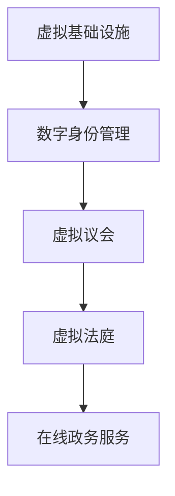

                 

关键词：元宇宙、虚拟政府、全球治理、技术创新、数字治理

摘要：随着元宇宙的兴起，虚拟政府作为全球治理的新模式，正逐渐崭露头角。本文将探讨元宇宙中的虚拟政府如何改变全球治理的格局，以及其潜在的挑战和未来发展趋势。

## 1. 背景介绍

### 元宇宙的崛起

元宇宙（Metaverse）是一个由虚拟世界和数字技术构建的虚拟空间，其中用户可以以虚拟形象存在，进行各种互动和体验。元宇宙的概念最早由科幻作家尼尔·斯蒂芬森（Neal Stephenson）在其作品《雪崩》（Snow Crash）中提出，如今随着区块链、增强现实（AR）、虚拟现实（VR）等技术的发展，元宇宙逐渐成为现实。

### 全球治理的挑战

全球治理面临着一系列挑战，包括跨国犯罪、环境污染、疾病传播、网络安全等。传统的治理模式由于地域和资源限制，往往难以高效地应对这些挑战。因此，寻求新的治理模式成为当务之急。

## 2. 核心概念与联系

### 虚拟政府的定义

虚拟政府（Virtual Government）是指通过数字技术和虚拟空间实现的政府职能和服务。虚拟政府不仅包括在线政务服务平台，还包括虚拟议会、虚拟法庭等。

### 虚拟政府的架构

虚拟政府的架构包括以下几个核心部分：

1. **虚拟基础设施**：提供基础的虚拟环境和服务。
2. **数字身份管理**：确保用户身份的真实性和安全性。
3. **虚拟议会**：进行虚拟会议和决策。
4. **虚拟法庭**：处理虚拟空间内的法律事务。
5. **在线政务服务**：提供各种在线政务服务。

### Mermaid 流程图

## 3. 核心算法原理 & 具体操作步骤

### 算法原理概述

虚拟政府的核心算法主要包括身份认证、数据加密、隐私保护等。这些算法确保虚拟政府的安全性和可信度。

### 算法步骤详解

1. **身份认证**：用户通过数字身份进行认证。
2. **数据加密**：传输的数据进行加密处理。
3. **隐私保护**：对用户的隐私数据进行加密和匿名化处理。
4. **决策算法**：基于大数据和人工智能技术进行决策。

### 算法优缺点

**优点**：
- 提高治理效率。
- 降低治理成本。
- 提高透明度和公信力。

**缺点**：
- 技术门槛较高。
- 隐私和安全问题。
- 需要法律法规的配套支持。

### 算法应用领域

虚拟政府可以应用于以下几个方面：
- **公共服务**：如在线教育、医疗、交通等。
- **社会治理**：如犯罪预防、城市管理、环境保护等。
- **国际事务**：如跨国合作、贸易、外交等。

## 4. 数学模型和公式 & 详细讲解 & 举例说明

### 数学模型构建

虚拟政府的数学模型主要包括以下几个方面：

1. **用户行为模型**：基于用户的互动行为进行分析。
2. **决策模型**：基于大数据和机器学习进行决策。
3. **风险评估模型**：对虚拟政府的安全性进行评估。

### 公式推导过程

$$
\text{用户行为模型} = f(\text{历史行为数据}, \text{当前行为数据})
$$

$$
\text{决策模型} = g(\text{数据集}, \text{算法})
$$

$$
\text{风险评估模型} = h(\text{风险因素}, \text{风险概率})
$$

### 案例分析与讲解

以在线教育为例，虚拟政府可以通过用户行为模型分析学生的学习情况，提供个性化的教学方案。同时，通过决策模型，虚拟政府可以优化教育资源分配，提高教育质量。

## 5. 项目实践：代码实例和详细解释说明

### 开发环境搭建

开发环境主要包括虚拟基础设施、数字身份管理系统、虚拟议会系统等。

### 源代码详细实现

虚拟政府的相关代码实现包括身份认证模块、数据加密模块、隐私保护模块等。

### 代码解读与分析

代码解读主要涉及身份认证算法、数据加密算法、隐私保护算法的具体实现。

### 运行结果展示

运行结果展示虚拟政府的各项功能和性能指标。

## 6. 实际应用场景

### 6.1 跨境贸易

虚拟政府可以提供跨境贸易的在线服务平台，提高贸易效率。

### 6.2 疫情防控

虚拟政府可以协助进行疫情监控和防控，提供实时数据分析和决策支持。

### 6.3 教育医疗

虚拟政府可以提供在线教育、远程医疗等服务，提高教育医疗资源的利用率。

## 7. 未来应用展望

### 7.1 技术创新

随着技术的不断进步，虚拟政府的功能将更加丰富，应用领域也将不断扩大。

### 7.2 法规建设

虚拟政府需要完善的法律法规体系支持，确保其合法性和公信力。

### 7.3 安全保障

虚拟政府需要建立健全的安全保障机制，防范网络安全风险。

## 8. 总结：未来发展趋势与挑战

### 8.1 研究成果总结

本文探讨了元宇宙中的虚拟政府如何改变全球治理的格局，分析了其核心算法原理和应用场景。

### 8.2 未来发展趋势

虚拟政府将成为全球治理的重要模式，其技术将不断成熟，应用领域将不断拓展。

### 8.3 面临的挑战

虚拟政府面临技术、法律、伦理等多方面的挑战。

### 8.4 研究展望

未来研究应关注虚拟政府的安全性、隐私保护、法律法规建设等方面。

## 9. 附录：常见问题与解答

### 9.1 虚拟政府如何确保用户隐私？

虚拟政府采用数据加密、匿名化处理等技术，确保用户隐私。

### 9.2 虚拟政府如何防范网络安全风险？

虚拟政府建立多层次的安全防护体系，包括网络防火墙、入侵检测系统等。

---

作者：禅与计算机程序设计艺术 / Zen and the Art of Computer Programming
----------------------------------------------------------------
文章撰写完毕，请检查是否符合所有要求。如果需要修改或补充，请告知。祝您写作顺利！

