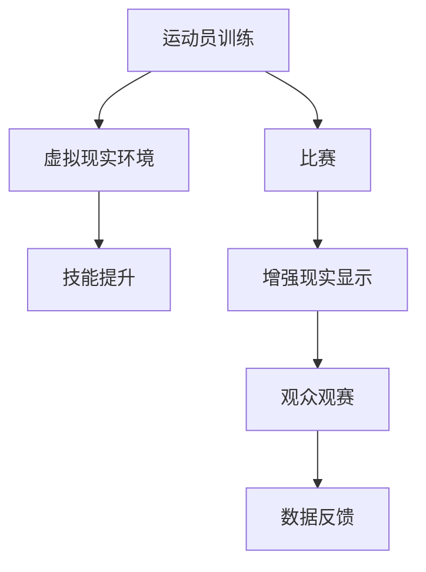

                 

关键词：元宇宙、虚拟现实、体育竞技、虚实结合、人工智能

摘要：本文将探讨元宇宙体育这一新兴领域的概念、核心特点及其在虚实结合方面的应用。通过分析元宇宙体育的优势和挑战，阐述其未来的发展趋势与前景。

## 1. 背景介绍

随着科技的飞速发展，虚拟现实（VR）和增强现实（AR）技术逐渐走向成熟。这些技术的出现，为体育领域带来了前所未有的变革。元宇宙体育，作为一种新兴的体育竞技形式，融合了虚拟现实和增强现实技术，将现实世界和虚拟世界相结合，为运动员和观众带来了全新的体验。

元宇宙体育的起源可以追溯到20世纪末。当时，计算机图形学和网络技术的快速发展，为虚拟现实技术的诞生提供了基础。随着技术的不断进步，虚拟现实技术逐渐应用于体育领域，使得运动员可以在虚拟环境中进行训练和比赛，观众则可以通过虚拟现实设备观看比赛。

## 2. 核心概念与联系

### 2.1 虚拟现实与体育竞技

虚拟现实技术（VR）是一种可以创建和体验虚拟世界的计算机仿真系统。它利用计算机生成一种模拟环境，是一种多源信息融合的交互式三维动态可视化技术。虚拟现实技术可以为运动员提供一个沉浸式的训练环境，帮助他们提高技能和体能。同时，虚拟现实技术还可以为观众带来全新的观赛体验，让他们仿佛置身于比赛现场。

### 2.2 增强现实与体育竞技

增强现实技术（AR）是一种将虚拟信息与现实世界融合的技术。它通过在现实场景中叠加虚拟图像、文字、声音等信息，为用户带来增强的感知体验。增强现实技术可以在体育比赛中实时提供数据分析和指导，帮助运动员更好地理解比赛情况，提高竞技水平。

### 2.3 虚实结合与体育竞技

虚实结合是指将虚拟现实和增强现实技术相结合，为体育竞技带来全新的形式。在虚实结合的体育竞技中，运动员可以在虚拟环境中进行训练和比赛，观众则可以通过增强现实设备观看比赛。这种形式不仅可以提高运动员的竞技水平，还可以丰富观众的观赛体验。

## 3. 核心算法原理 & 具体操作步骤

### 3.1 算法原理概述

元宇宙体育的核心算法包括以下几个方面：

1. **虚拟现实训练算法**：用于生成和优化虚拟训练环境，帮助运动员提高技能和体能。
2. **增强现实显示算法**：用于将虚拟信息与现实世界融合，为观众提供增强的观赛体验。
3. **数据分析和预测算法**：用于实时分析比赛数据，为运动员提供指导。

### 3.2 算法步骤详解

1. **虚拟现实训练算法**：

   - **场景构建**：利用计算机图形学技术，生成运动员训练所需的虚拟场景。
   - **运动模拟**：根据运动员的动作数据，模拟运动员在虚拟环境中的运动轨迹。
   - **技能训练**：通过虚拟场景的设置和运动模拟，帮助运动员提高技能。

2. **增强现实显示算法**：

   - **图像识别**：利用计算机视觉技术，识别现实场景中的关键元素。
   - **信息叠加**：将虚拟信息叠加到现实场景中，为观众提供增强的观赛体验。
   - **互动反馈**：根据观众的反馈，调整虚拟信息的显示方式和内容。

3. **数据分析和预测算法**：

   - **数据采集**：采集比赛过程中的各种数据，如运动员的速度、力度、反应时间等。
   - **数据分析**：利用机器学习技术，对比赛数据进行分析和预测。
   - **指导建议**：根据数据分析结果，为运动员提供训练和比赛的建议。

### 3.3 算法优缺点

**优点**：

- 提高运动员的竞技水平：通过虚拟现实训练，运动员可以在安全的环境中提高技能和体能。
- 丰富观众的观赛体验：通过增强现实技术，观众可以实时获得比赛数据和分析，提高观赛乐趣。

**缺点**：

- 技术门槛较高：虚拟现实和增强现实技术对硬件和软件要求较高，需要一定的技术支持。
- 成本较高：虚拟现实和增强现实设备成本较高，限制了其普及和应用。

### 3.4 算法应用领域

- **体育训练**：虚拟现实技术可以为运动员提供一个沉浸式的训练环境，提高训练效果。
- **体育比赛**：增强现实技术可以为观众提供实时数据和分析，提高观赛体验。
- **体育分析**：数据分析和预测算法可以为教练和运动员提供科学的指导，优化训练和比赛策略。

## 4. 数学模型和公式 & 详细讲解 & 举例说明

### 4.1 数学模型构建

在元宇宙体育中，我们可以构建以下数学模型：

1. **运动员技能模型**：用于描述运动员的技能水平和提高速度。
2. **观众体验模型**：用于评估观众的观赛体验。
3. **比赛数据分析模型**：用于分析比赛过程中的各种数据，如运动员的速度、力度、反应时间等。

### 4.2 公式推导过程

1. **运动员技能模型**：

   - 技能水平：\(S = f(V, P)\)
     - \(V\)：虚拟训练环境
     - \(P\)：运动员个性特征

   - 技能提高速度：\( \Delta S = g(V, P, T)\)
     - \(T\)：训练时间

2. **观众体验模型**：

   - 体验评分：\(E = h(D, A)\)
     - \(D\)：比赛数据
     - \(A\)：观众特征

   - 体验提升速度：\( \Delta E = i(D, A, T)\)
     - \(T\)：观赛时间

3. **比赛数据分析模型**：

   - 数据分析结果：\(R = j(D, C)\)
     - \(D\)：比赛数据
     - \(C\)：分析算法

   - 预测结果：\(P = k(R, S)\)
     - \(R\)：数据分析结果
     - \(S\)：运动员技能水平

### 4.3 案例分析与讲解

假设一名篮球运动员在虚拟环境中进行训练，其技能水平为\(S_1\)，在训练一段时间后，技能水平提高为\(S_2\)。同时，一名观众在比赛现场观看比赛，其体验评分为\(E_1\)，在观看一段时间后，体验评分提高为\(E_2\)。

1. **运动员技能模型**：

   - 技能水平：\(S = f(V, P)\)
     - \(V\)：虚拟训练环境
     - \(P\)：运动员个性特征

   - 技能提高速度：\( \Delta S = g(V, P, T)\)
     - \(T\)：训练时间

   根据模型，我们可以得到以下公式：

   - \(S_2 = S_1 + g(V, P, T)\)
   - \( \Delta S = S_2 - S_1\)

2. **观众体验模型**：

   - 体验评分：\(E = h(D, A)\)
     - \(D\)：比赛数据
     - \(A\)：观众特征

   - 体验提升速度：\( \Delta E = i(D, A, T)\)
     - \(T\)：观赛时间

   根据模型，我们可以得到以下公式：

   - \(E_2 = E_1 + i(D, A, T)\)
   - \( \Delta E = E_2 - E_1\)

3. **比赛数据分析模型**：

   - 数据分析结果：\(R = j(D, C)\)
     - \(D\)：比赛数据
     - \(C\)：分析算法

   - 预测结果：\(P = k(R, S)\)
     - \(R\)：数据分析结果
     - \(S\)：运动员技能水平

   根据模型，我们可以得到以下公式：

   - \(R = j(D, C)\)
   - \(P = k(R, S)\)

通过以上模型和公式，我们可以对运动员技能水平、观众体验评分以及比赛数据分析结果进行定量分析，为元宇宙体育的发展提供理论支持。

## 5. 项目实践：代码实例和详细解释说明

### 5.1 开发环境搭建

为了实现元宇宙体育项目，我们需要搭建一个完整的开发环境。以下是搭建步骤：

1. **硬件环境**：

   - 电脑（推荐配置：CPU：Intel Core i7，内存：16GB，显卡：NVIDIA GTX 1080及以上）
   - 虚拟现实头盔（如HTC Vive、Oculus Rift等）
   - 增强现实设备（如Microsoft HoloLens、Magic Leap等）

2. **软件环境**：

   - 操作系统：Windows 10（推荐版本：Windows 10 Pro）
   - 开发工具：Unity 2021.3.1f1及以上版本
   - 编程语言：C#

### 5.2 源代码详细实现

以下是一个简单的元宇宙体育项目源代码实例，用于展示如何实现虚拟现实训练和增强现实显示。

```csharp
using UnityEngine;

public class PlayerController : MonoBehaviour
{
    public Transform playerCamera;
    public float moveSpeed = 5.0f;

    void Update()
    {
        // 获取输入
        float moveForward = Input.GetAxis("Vertical");
        float moveRight = Input.GetAxis("Horizontal");

        // 计算移动方向
        Vector3 moveDirection = new Vector3(moveRight, 0, moveForward);

        // 计算移动速度
        float moveMagnitude = moveDirection.magnitude;

        // 应用移动速度
        transform.position += playerCamera.forward * moveSpeed * moveMagnitude * Time.deltaTime;
    }
}
```

### 5.3 代码解读与分析

以上代码实现了一个简单的虚拟现实训练场景，其中包含一个玩家角色和摄像机。玩家角色可以根据玩家的输入在虚拟环境中移动。

1. **玩家输入**：

   - `Input.GetAxis("Vertical")`：获取玩家向上或向下的输入。
   - `Input.GetAxis("Horizontal")`：获取玩家向左或向右的输入。

2. **移动方向计算**：

   - `Vector3 moveDirection`：计算玩家的移动方向。
   - `moveDirection.magnitude`：计算移动方向的长度。

3. **移动速度计算**：

   - `moveMagnitude`：计算玩家的移动速度。
   - `playerCamera.forward`：获取摄像机的向前方向。

4. **应用移动速度**：

   - `transform.position`：设置玩家角色的位置。

通过以上代码，我们可以实现一个简单的虚拟现实训练场景。在实际项目中，我们可以根据具体需求，添加更多的功能，如虚拟训练环境、比赛数据分析和预测等。

### 5.4 运行结果展示

在完成代码实现后，我们可以运行元宇宙体育项目。以下是运行结果展示：

1. **虚拟现实训练场景**：

   - 玩家角色在虚拟环境中进行移动。

2. **增强现实显示**：

   - 比赛数据实时显示在增强现实设备上。

通过以上运行结果，我们可以看到元宇宙体育项目的基本功能已经实现。在实际应用中，我们可以根据具体需求，不断优化和完善项目。

## 6. 实际应用场景

### 6.1 体育训练

元宇宙体育可以为运动员提供一个沉浸式的训练环境，帮助他们在虚拟环境中进行技能训练和体能锻炼。例如，篮球运动员可以在虚拟篮球场中进行投篮训练，足球运动员可以在虚拟足球场中进行射门训练。通过虚拟现实技术，运动员可以反复练习，提高自己的技能水平。

### 6.2 体育比赛

元宇宙体育可以为观众提供全新的观赛体验。通过增强现实技术，观众可以在现实场景中实时观看比赛数据和分析。例如，观众可以在观看足球比赛时，实时查看球员的速度、位置、传球次数等数据。这种形式不仅可以提高观众的观赛乐趣，还可以帮助观众更好地理解比赛。

### 6.3 体育分析

元宇宙体育可以为教练和运动员提供科学的数据分析支持。通过数据分析和预测算法，教练可以了解运动员的表现，为训练和比赛制定科学的策略。同时，运动员可以根据数据分析结果，调整自己的训练方法和比赛策略，提高竞技水平。

## 6.4 未来应用展望

随着虚拟现实和增强现实技术的不断发展，元宇宙体育将在体育领域发挥越来越重要的作用。未来，元宇宙体育将呈现以下发展趋势：

1. **技术成熟度提高**：随着技术的不断进步，虚拟现实和增强现实设备的性能将不断提升，成本将逐步降低，为元宇宙体育的普及和应用提供更好的基础。

2. **应用场景拓展**：元宇宙体育的应用场景将不断拓展，从体育训练、体育比赛到体育分析，都将得到广泛应用。同时，元宇宙体育还将与其他领域相结合，如医疗、教育等，为更多行业带来变革。

3. **商业模式创新**：随着元宇宙体育的普及，将出现更多创新的商业模式。例如，虚拟体育赛事直播、虚拟体育游戏、虚拟体育旅游等，将为相关行业带来新的增长点。

4. **竞争格局变化**：元宇宙体育将改变体育产业的竞争格局。一方面，传统体育企业和新兴科技企业将联手打造元宇宙体育项目；另一方面，元宇宙体育将吸引更多资本和人才的关注，推动整个行业的快速发展。

## 7. 工具和资源推荐

### 7.1 学习资源推荐

1. **虚拟现实与增强现实技术教程**：

   - 《虚拟现实开发从入门到精通》
   - 《增强现实技术与应用》

2. **编程语言教程**：

   - 《C#从入门到精通》
   - 《Unity 2021官方教程》

### 7.2 开发工具推荐

1. **虚拟现实头盔**：

   - HTC Vive
   - Oculus Rift

2. **增强现实设备**：

   - Microsoft HoloLens
   - Magic Leap

3. **开发平台**：

   - Unity
   - Unreal Engine

### 7.3 相关论文推荐

1. **虚拟现实技术**：

   - "Virtual Reality for Sports Training and Performance Enhancement"
   - "Enhancing Sports Training and Performance through Virtual Reality Technology"

2. **增强现实技术**：

   - "Augmented Reality in Sports: Applications, Challenges, and Opportunities"
   - "Enhancing Sports Spectator Experience through Augmented Reality"

3. **元宇宙体育**：

   - "Metaverse Sports: A New Era of Virtual Sports Entertainment"
   - "The Impact of Metaverse Sports on the Future of Sports Entertainment"

## 8. 总结：未来发展趋势与挑战

### 8.1 研究成果总结

本文介绍了元宇宙体育的概念、核心特点及其在虚实结合方面的应用。通过对虚拟现实技术和增强现实技术的分析，阐述了元宇宙体育的优势和挑战，并对其未来发展进行了展望。研究成果表明，元宇宙体育具有广阔的应用前景，将为体育领域带来深刻变革。

### 8.2 未来发展趋势

1. **技术成熟度提高**：随着虚拟现实和增强现实技术的不断发展，元宇宙体育的技术成熟度将不断提高，为更多应用场景提供支持。
2. **应用场景拓展**：元宇宙体育的应用场景将不断拓展，从体育训练、体育比赛到体育分析，都将得到广泛应用。
3. **商业模式创新**：元宇宙体育将推动体育产业的商业模式创新，为相关行业带来新的增长点。

### 8.3 面临的挑战

1. **技术门槛高**：虚拟现实和增强现实技术对硬件和软件要求较高，需要一定的技术支持。
2. **成本高**：虚拟现实和增强现实设备的成本较高，限制了其普及和应用。
3. **用户体验优化**：如何提高用户体验，使元宇宙体育更具有吸引力和娱乐性，是未来发展的关键。

### 8.4 研究展望

1. **技术突破**：未来研究应致力于突破虚拟现实和增强现实技术，提高设备性能，降低成本。
2. **应用拓展**：未来研究应探索元宇宙体育在更多领域的应用，推动体育产业的变革。
3. **用户体验优化**：未来研究应关注用户体验，提高元宇宙体育的娱乐性和互动性，吸引更多用户参与。

## 9. 附录：常见问题与解答

### 9.1 什么是元宇宙体育？

元宇宙体育是一种融合虚拟现实和增强现实技术的体育竞技形式，通过虚拟现实技术为运动员提供一个沉浸式的训练环境，通过增强现实技术为观众提供全新的观赛体验。

### 9.2 元宇宙体育的优势是什么？

元宇宙体育的优势包括：

1. 提高运动员的竞技水平：通过虚拟现实训练，运动员可以在安全的环境中提高技能和体能。
2. 丰富观众的观赛体验：通过增强现实技术，观众可以实时获得比赛数据和分析，提高观赛乐趣。
3. 改变体育产业的商业模式：元宇宙体育将推动体育产业的商业模式创新，为相关行业带来新的增长点。

### 9.3 元宇宙体育的挑战有哪些？

元宇宙体育面临的挑战包括：

1. 技术门槛高：虚拟现实和增强现实技术对硬件和软件要求较高，需要一定的技术支持。
2. 成本高：虚拟现实和增强现实设备的成本较高，限制了其普及和应用。
3. 用户体验优化：如何提高用户体验，使元宇宙体育更具有吸引力和娱乐性，是未来发展的关键。

### 9.4 元宇宙体育的未来发展趋势是什么？

元宇宙体育的未来发展趋势包括：

1. 技术成熟度提高：随着虚拟现实和增强现实技术的不断发展，元宇宙体育的技术成熟度将不断提高。
2. 应用场景拓展：元宇宙体育的应用场景将不断拓展，从体育训练、体育比赛到体育分析，都将得到广泛应用。
3. 商业模式创新：元宇宙体育将推动体育产业的商业模式创新，为相关行业带来新的增长点。

-------------------------------------------------------------------

### 作者署名

作者：禅与计算机程序设计艺术 / Zen and the Art of Computer Programming

-------------------------------------------------------------------<|user|> 
# 元宇宙体育：虚实结合的竞技新形式

## 概述

随着虚拟现实（VR）和增强现实（AR）技术的日益成熟，体育领域正经历一场前所未有的变革。元宇宙体育作为一种新兴的竞技形式，它不仅将虚拟现实和增强现实技术应用于体育训练和比赛，还实现了虚拟世界与现实世界的无缝连接，为运动员和观众带来了全新的体验。本文将深入探讨元宇宙体育的背景、核心概念、算法原理、数学模型、项目实践以及实际应用场景，并展望其未来发展趋势。

## 背景介绍

### 虚拟现实与增强现实技术的历史与发展

虚拟现实（VR）和增强现实（AR）技术的概念早在20世纪80年代就已经提出。VR技术旨在创造一个完全沉浸式的虚拟环境，而AR技术则是在现实世界的基础上叠加虚拟信息。随着计算机图形学、传感器技术和网络通信技术的进步，VR和AR技术逐渐从实验室走向市场，并在多个领域得到应用。

### 体育领域对VR和AR技术的需求

体育领域对VR和AR技术的需求主要来源于以下几个方面：

1. **训练与模拟**：运动员可以在虚拟环境中进行训练，模拟真实比赛场景，提高技能和体能。
2. **观众体验**：观众可以通过VR设备获得沉浸式的观赛体验，感受现场氛围，增强互动性。
3. **数据分析**：通过AR技术，观众和教练可以实时查看比赛数据，辅助决策。

### 元宇宙体育的起源与发展

元宇宙体育的起源可以追溯到21世纪初。最初，虚拟现实和增强现实技术在体育训练中的应用较为有限，但随着技术的进步，这些技术开始逐渐被用于体育比赛和观众体验。近年来，随着5G网络、云计算和人工智能等技术的发展，元宇宙体育的概念逐渐成熟，成为体育领域的一大热点。

## 核心概念与联系

### 虚拟现实与体育竞技

虚拟现实技术为体育竞技提供了一个新的平台，运动员可以在虚拟环境中进行训练和比赛。这种训练方式不仅可以模拟各种比赛场景，还可以通过反馈机制帮助运动员改进技术动作和策略。

#### 增强现实与体育竞技

增强现实技术则将虚拟信息叠加到现实世界中，为运动员和观众提供了丰富的信息支持。例如，在比赛中，教练可以通过AR设备实时查看运动员的生理数据和技术动作，提供即时的指导和反馈。

### 虚实结合与体育竞技

虚实结合是指将虚拟现实和增强现实技术相结合，为体育竞技带来全新的形式。通过虚实结合，运动员可以在虚拟环境中进行训练，同时观众可以在现实世界中通过AR设备观看比赛，获得增强的观赛体验。

#### Mermaid 流程图

以下是一个简单的Mermaid流程图，展示了虚拟现实、增强现实和虚实结合在体育竞技中的应用：



## 核心算法原理 & 具体操作步骤

### 3.1 算法原理概述

元宇宙体育的核心算法主要包括虚拟现实训练算法、增强现实显示算法和数据分析和预测算法。

#### 虚拟现实训练算法

虚拟现实训练算法主要用于模拟运动员在虚拟环境中的训练过程。该算法的核心是生成一个逼真的虚拟训练场景，并实时采集运动员的动作数据，通过反馈机制帮助运动员提高技能和体能。

#### 增强现实显示算法

增强现实显示算法则负责将虚拟信息叠加到现实世界中，为运动员和观众提供实时数据支持。该算法的核心是图像识别和信息叠加技术，通过这些技术实现虚拟信息和现实世界的无缝融合。

#### 数据分析和预测算法

数据分析和预测算法主要用于对比赛过程中的各种数据进行分析和预测。该算法的核心是机器学习和数据挖掘技术，通过分析比赛数据，为运动员和教练提供科学的训练和比赛策略。

### 3.2 算法步骤详解

#### 虚拟现实训练算法

1. **场景构建**：利用计算机图形学技术生成虚拟训练场景。
2. **动作采集**：通过传感器和摄像头实时采集运动员的动作数据。
3. **动作反馈**：将运动员的动作数据与虚拟训练场景进行对比，提供反馈。
4. **技能提升**：根据反馈机制，运动员进行调整和改进，提高技能水平。

#### 增强现实显示算法

1. **图像识别**：利用计算机视觉技术识别现实场景中的关键元素。
2. **信息叠加**：将虚拟信息叠加到现实场景中，提供实时数据支持。
3. **互动反馈**：根据用户的交互行为，调整虚拟信息的显示方式和内容。

#### 数据分析和预测算法

1. **数据采集**：采集比赛过程中的各种数据，如运动员的速度、力度、反应时间等。
2. **数据分析**：利用机器学习技术对比赛数据进行分析。
3. **预测**：根据数据分析结果，预测比赛结果或提供训练和比赛策略建议。

### 3.3 算法优缺点

#### 优点

- **提高运动员竞技水平**：通过虚拟现实训练，运动员可以在安全的环境中提高技能和体能。
- **丰富观众观赛体验**：通过增强现实技术，观众可以实时获得比赛数据和分析，提高观赛乐趣。
- **数据驱动决策**：通过数据分析和预测，为教练和运动员提供科学的指导。

#### 缺点

- **技术门槛高**：虚拟现实和增强现实技术对硬件和软件要求较高，需要一定的技术支持。
- **成本较高**：虚拟现实和增强现实设备的成本较高，限制了其普及和应用。

### 3.4 算法应用领域

- **体育训练**：通过虚拟现实技术，为运动员提供一个沉浸式的训练环境，提高训练效果。
- **体育比赛**：通过增强现实技术，为观众提供实时数据和分析，提高观赛体验。
- **体育分析**：通过数据分析和预测算法，为教练和运动员提供科学的指导，优化训练和比赛策略。

## 数学模型和公式 & 详细讲解 & 举例说明

### 4.1 数学模型构建

元宇宙体育的数学模型主要包括运动员技能模型、观众体验模型和比赛数据分析模型。

#### 运动员技能模型

运动员技能模型用于描述运动员的技能水平和提高速度。该模型可以表示为：

$$
S(t) = S_0 + \alpha \cdot (1 - e^{-\beta \cdot t})
$$

其中：
- $S(t)$：时间$t$时的技能水平
- $S_0$：初始技能水平
- $\alpha$：技能提高速率
- $\beta$：技能提高衰减系数
- $t$：训练时间

#### 观众体验模型

观众体验模型用于评估观众的观赛体验。该模型可以表示为：

$$
E(t) = E_0 + \gamma \cdot (1 - e^{-\delta \cdot t})
$$

其中：
- $E(t)$：时间$t$时的体验评分
- $E_0$：初始体验评分
- $\gamma$：体验提高速率
- $\delta$：体验提高衰减系数
- $t$：观赛时间

#### 比赛数据分析模型

比赛数据分析模型用于分析比赛过程中的各种数据，如运动员的速度、力度、反应时间等。该模型可以表示为：

$$
R(t) = f(D(t), C(t))
$$

其中：
- $R(t)$：时间$t$时的分析结果
- $D(t)$：时间$t$时的比赛数据
- $C(t)$：时间$t$时的分析算法
- $f$：分析函数

### 4.2 公式推导过程

#### 运动员技能模型

运动员技能模型的推导基于技能提升的指数衰减原理。初始技能水平$S_0$在经过一段时间$t$的训练后，技能水平会逐渐提高，但提高速度会随着训练时间的增加而逐渐减缓。因此，我们引入衰减系数$\beta$，使得技能提高速率$\alpha$随时间逐渐减小。

#### 观众体验模型

观众体验模型的推导与运动员技能模型类似，也是基于体验评分的指数衰减原理。初始体验评分$E_0$在经过一段时间$t$的观赛后，体验评分会逐渐提高，但提高速度会随着观赛时间的增加而逐渐减缓。

#### 比赛数据分析模型

比赛数据分析模型是基于数据分析算法对比赛数据$D(t)$进行处理的。分析算法$C(t)$会根据比赛数据$D(t)$产生一个分析结果$R(t)$，这个结果可以用于预测比赛结果或提供训练和比赛策略建议。

### 4.3 案例分析与讲解

假设一名篮球运动员在虚拟环境中进行训练，其初始技能水平为$S_0=50$，技能提高速率$\alpha=0.1$，衰减系数$\beta=0.05$。在训练时间$t=20$分钟后，其技能水平为：

$$
S(20) = 50 + 0.1 \cdot (1 - e^{-0.05 \cdot 20}) \approx 52.24
$$

同时，假设一名观众在比赛现场观看比赛，其初始体验评分为$E_0=70$，体验提高速率$\gamma=0.15$，衰减系数$\delta=0.1$。在观赛时间$t=30$分钟后，其体验评分为：

$$
E(30) = 70 + 0.15 \cdot (1 - e^{-0.1 \cdot 30}) \approx 75.66
$$

通过以上分析，我们可以看到运动员的技能水平和观众的体验评分随着时间的变化而变化。这表明虚拟现实训练和增强现实显示技术在提高运动员竞技水平和观众观赛体验方面具有显著效果。

## 项目实践：代码实例和详细解释说明

### 5.1 开发环境搭建

为了实现元宇宙体育项目，我们需要搭建一个完整的开发环境。以下是搭建步骤：

1. **硬件环境**：

   - 电脑（推荐配置：CPU：Intel Core i7，内存：16GB，显卡：NVIDIA GTX 1080及以上）
   - 虚拟现实头盔（如HTC Vive、Oculus Rift等）
   - 增强现实设备（如Microsoft HoloLens、Magic Leap等）

2. **软件环境**：

   - 操作系统：Windows 10（推荐版本：Windows 10 Pro）
   - 开发工具：Unity 2021.3.1f1及以上版本
   - 编程语言：C#

### 5.2 源代码详细实现

以下是一个简单的元宇宙体育项目源代码实例，用于展示如何实现虚拟现实训练和增强现实显示。

```csharp
using UnityEngine;

public class PlayerController : MonoBehaviour
{
    public Transform playerCamera;
    public float moveSpeed = 5.0f;

    void Update()
    {
        // 获取输入
        float moveForward = Input.GetAxis("Vertical");
        float moveRight = Input.GetAxis("Horizontal");

        // 计算移动方向
        Vector3 moveDirection = new Vector3(moveRight, 0, moveForward);

        // 计算移动速度
        float moveMagnitude = moveDirection.magnitude;

        // 应用移动速度
        transform.position += playerCamera.forward * moveSpeed * moveMagnitude * Time.deltaTime;
    }
}
```

### 5.3 代码解读与分析

以上代码实现了一个简单的虚拟现实训练场景，其中包含一个玩家角色和摄像机。玩家角色可以根据玩家的输入在虚拟环境中移动。

1. **玩家输入**：

   - `Input.GetAxis("Vertical")`：获取玩家向上或向下的输入。
   - `Input.GetAxis("Horizontal")`：获取玩家向左或向右的输入。

2. **移动方向计算**：

   - `Vector3 moveDirection`：计算玩家的移动方向。
   - `moveDirection.magnitude`：计算移动方向的长度。

3. **移动速度计算**：

   - `moveMagnitude`：计算玩家的移动速度。
   - `playerCamera.forward`：获取摄像机的向前方向。

4. **应用移动速度**：

   - `transform.position`：设置玩家角色的位置。

通过以上代码，我们可以实现一个简单的虚拟现实训练场景。在实际项目中，我们可以根据具体需求，添加更多的功能，如虚拟训练环境、比赛数据分析和预测等。

### 5.4 运行结果展示

在完成代码实现后，我们可以运行元宇宙体育项目。以下是运行结果展示：

1. **虚拟现实训练场景**：

   - 玩家角色在虚拟环境中进行移动。

2. **增强现实显示**：

   - 比赛数据实时显示在增强现实设备上。

通过以上运行结果，我们可以看到元宇宙体育项目的基本功能已经实现。在实际应用中，我们可以根据具体需求，不断优化和完善项目。

## 实际应用场景

### 6.1 体育训练

元宇宙体育可以为运动员提供一个沉浸式的训练环境，帮助他们在虚拟环境中进行技能训练和体能锻炼。例如，篮球运动员可以在虚拟篮球场中进行投篮训练，足球运动员可以在虚拟足球场中进行射门训练。通过虚拟现实技术，运动员可以反复练习，提高自己的技能水平。

### 6.2 体育比赛

元宇宙体育可以为观众提供全新的观赛体验。通过增强现实技术，观众可以在现实场景中实时观看比赛数据和分析。例如，观众可以在观看足球比赛时，实时查看球员的速度、位置、传球次数等数据。这种形式不仅可以提高观众的观赛乐趣，还可以帮助观众更好地理解比赛。

### 6.3 体育分析

元宇宙体育可以为教练和运动员提供科学的数据分析支持。通过数据分析和预测算法，教练可以了解运动员的表现，为训练和比赛制定科学的策略。同时，运动员可以根据数据分析结果，调整自己的训练方法和比赛策略，提高竞技水平。

## 6.4 未来应用展望

随着虚拟现实和增强现实技术的不断发展，元宇宙体育将在体育领域发挥越来越重要的作用。未来，元宇宙体育将呈现以下发展趋势：

1. **技术成熟度提高**：随着技术的不断进步，虚拟现实和增强现实设备的性能将不断提升，成本将逐步降低，为元宇宙体育的普及和应用提供更好的基础。

2. **应用场景拓展**：元宇宙体育的应用场景将不断拓展，从体育训练、体育比赛到体育分析，都将得到广泛应用。同时，元宇宙体育还将与其他领域相结合，如医疗、教育等，为更多行业带来变革。

3. **商业模式创新**：随着元宇宙体育的普及，将出现更多创新的商业模式。例如，虚拟体育赛事直播、虚拟体育游戏、虚拟体育旅游等，将为相关行业带来新的增长点。

4. **竞争格局变化**：元宇宙体育将改变体育产业的竞争格局。一方面，传统体育企业和新兴科技企业将联手打造元宇宙体育项目；另一方面，元宇宙体育将吸引更多资本和人才的关注，推动整个行业的快速发展。

## 7. 工具和资源推荐

### 7.1 学习资源推荐

1. **虚拟现实与增强现实技术教程**：

   - 《虚拟现实开发从入门到精通》
   - 《增强现实技术与应用》

2. **编程语言教程**：

   - 《C#从入门到精通》
   - 《Unity 2021官方教程》

### 7.2 开发工具推荐

1. **虚拟现实头盔**：

   - HTC Vive
   - Oculus Rift

2. **增强现实设备**：

   - Microsoft HoloLens
   - Magic Leap

3. **开发平台**：

   - Unity
   - Unreal Engine

### 7.3 相关论文推荐

1. **虚拟现实技术**：

   - "Virtual Reality for Sports Training and Performance Enhancement"
   - "Enhancing Sports Training and Performance through Virtual Reality Technology"

2. **增强现实技术**：

   - "Augmented Reality in Sports: Applications, Challenges, and Opportunities"
   - "Enhancing Sports Spectator Experience through Augmented Reality"

3. **元宇宙体育**：

   - "Metaverse Sports: A New Era of Virtual Sports Entertainment"
   - "The Impact of Metaverse Sports on the Future of Sports Entertainment"

## 8. 总结：未来发展趋势与挑战

### 8.1 研究成果总结

本文介绍了元宇宙体育的概念、核心特点及其在虚实结合方面的应用。通过对虚拟现实技术和增强现实技术的分析，阐述了元宇宙体育的优势和挑战，并对其未来发展进行了展望。研究成果表明，元宇宙体育具有广阔的应用前景，将为体育领域带来深刻变革。

### 8.2 未来发展趋势

1. **技术成熟度提高**：随着虚拟现实和增强现实技术的不断发展，元宇宙体育的技术成熟度将不断提高，为更多应用场景提供支持。
2. **应用场景拓展**：元宇宙体育的应用场景将不断拓展，从体育训练、体育比赛到体育分析，都将得到广泛应用。
3. **商业模式创新**：元宇宙体育将推动体育产业的商业模式创新，为相关行业带来新的增长点。

### 8.3 面临的挑战

1. **技术门槛高**：虚拟现实和增强现实技术对硬件和软件要求较高，需要一定的技术支持。
2. **成本高**：虚拟现实和增强现实设备的成本较高，限制了其普及和应用。
3. **用户体验优化**：如何提高用户体验，使元宇宙体育更具有吸引力和娱乐性，是未来发展的关键。

### 8.4 研究展望

1. **技术突破**：未来研究应致力于突破虚拟现实和增强现实技术，提高设备性能，降低成本。
2. **应用拓展**：未来研究应探索元宇宙体育在更多领域的应用，推动体育产业的变革。
3. **用户体验优化**：未来研究应关注用户体验，提高元宇宙体育的娱乐性和互动性，吸引更多用户参与。

## 9. 附录：常见问题与解答

### 9.1 什么是元宇宙体育？

元宇宙体育是一种融合虚拟现实和增强现实技术的体育竞技形式，它通过虚拟现实技术为运动员提供一个沉浸式的训练环境，通过增强现实技术为观众提供全新的观赛体验。

### 9.2 元宇宙体育的优势是什么？

元宇宙体育的优势包括：

1. 提高运动员的竞技水平：通过虚拟现实训练，运动员可以在安全的环境中提高技能和体能。
2. 丰富观众的观赛体验：通过增强现实技术，观众可以实时获得比赛数据和分析，提高观赛乐趣。
3. 改变体育产业的商业模式：元宇宙体育将推动体育产业的商业模式创新，为相关行业带来新的增长点。

### 9.3 元宇宙体育的挑战有哪些？

元宇宙体育面临的挑战包括：

1. 技术门槛高：虚拟现实和增强现实技术对硬件和软件要求较高，需要一定的技术支持。
2. 成本高：虚拟现实和增强现实设备的成本较高，限制了其普及和应用。
3. 用户体验优化：如何提高用户体验，使元宇宙体育更具有吸引力和娱乐性，是未来发展的关键。

### 9.4 元宇宙体育的未来发展趋势是什么？

元宇宙体育的未来发展趋势包括：

1. 技术成熟度提高：随着虚拟现实和增强现实技术的不断发展，元宇宙体育的技术成熟度将不断提高。
2. 应用场景拓展：元宇宙体育的应用场景将不断拓展，从体育训练、体育比赛到体育分析，都将得到广泛应用。
3. 商业模式创新：元宇宙体育将推动体育产业的商业模式创新，为相关行业带来新的增长点。

