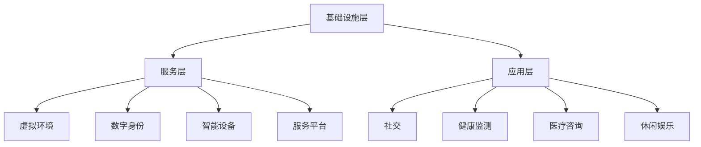

                 

在当今社会，随着人口老龄化趋势的加剧，养老问题日益成为全球关注的焦点。传统的养老模式已难以满足老年人群体的多样化需求，而元宇宙这一新兴概念，为养老社区的发展带来了前所未有的机遇。本文将探讨元宇宙养老社区的概念、数字化照护的创新实践，以及其潜在的应用前景，旨在为我国养老事业提供新的思路和方向。

## 1. 背景介绍

随着医疗技术的进步和生活水平的提高，人类的平均寿命不断延长。然而，这也带来了一个不可忽视的问题——人口老龄化。据统计，全球60岁及以上的老年人口已占总人口的10%以上，预计到2050年，这一比例将增加到22%。在中国，老年人口的数量也在迅速增加，预计到2050年，我国老年人口将达到4.8亿，占总人口的34.6%。面对如此庞大的老年人口群体，传统的养老模式面临着诸多挑战。

传统的养老模式主要依赖于家庭和社会的照料，然而，随着家庭结构的变迁和社会压力的增大，许多老年人在养老方面面临着资源短缺、服务不足等问题。此外，老年人对生活质量的要求也越来越高，他们渴望得到更加个性化和多样化的养老服务。

元宇宙（Metaverse）是一个虚拟的、三维的、持续存在的数字世界，它通过互联网连接各种设备，为用户提供沉浸式体验。元宇宙的概念最早由美国作家尼尔·斯蒂芬森（Neal Stephenson）在1992年的科幻小说《雪崩》中提出。随着虚拟现实（VR）、增强现实（AR）、区块链等技术的发展，元宇宙逐渐从科幻走向现实，成为众多领域创新应用的载体。

在养老领域，元宇宙为老年人提供了一种全新的生活体验。老年人可以通过VR设备进入元宇宙，与家人、朋友实时互动，参与各种社交活动，甚至实现异地旅游。元宇宙还可以提供个性化健康监测、智能医疗咨询、休闲娱乐等服务，为老年人打造一个更加丰富和充实的生活环境。

## 2. 核心概念与联系

### 2.1 元宇宙养老社区的概念

元宇宙养老社区是指利用元宇宙技术为老年人提供一个虚拟的、互动的、沉浸式的养老环境。这个环境可以通过VR、AR等设备实现，让老年人在家中或养老院等场所感受到与现实世界相似的互动体验。元宇宙养老社区的核心在于数字化照护，即通过智能化的手段，实现对老年人生活、健康、娱乐等多方面的全面关怀。

### 2.2 元宇宙养老社区的组成部分

元宇宙养老社区主要由以下几个部分组成：

- **虚拟环境**：通过VR、AR技术构建一个虚拟的三维空间，让老年人可以在其中自由行走、互动。

- **数字身份**：为每个老年人创建一个虚拟身份，使其能够在元宇宙中与他人进行社交互动。

- **智能设备**：包括健康监测设备、智能轮椅、智能床等，用于监测老年人的健康状况和提供便捷的生活服务。

- **服务平台**：为老年人提供在线咨询、医疗预约、生活服务等多种功能，使其能够享受到便捷的数字化服务。

### 2.3 元宇宙养老社区的架构

元宇宙养老社区的架构可以分为三个层次：基础设施层、服务层和应用层。

- **基础设施层**：包括网络、服务器、存储等硬件设施，为元宇宙提供稳定、高效的技术支持。

- **服务层**：包括虚拟环境、数字身份、智能设备等，为老年人提供各种服务功能。

- **应用层**：包括各种应用场景，如社交、健康监测、医疗咨询、休闲娱乐等，满足老年人的多样化需求。

### 2.4 Mermaid 流程图

下面是一个简单的Mermaid流程图，展示了元宇宙养老社区的核心概念和组成部分。



## 3. 核心算法原理 & 具体操作步骤

### 3.1 算法原理概述

元宇宙养老社区的核心在于数字化照护，这需要一系列算法来实现。其中，关键算法包括：

- **数据采集与处理算法**：用于采集老年人的健康数据，并对数据进行处理和分析，以便实时监测老年人的健康状况。

- **智能推荐算法**：根据老年人的兴趣和需求，推荐合适的社交活动、健康建议和娱乐项目。

- **虚拟现实交互算法**：实现老年人与虚拟环境的自然交互，提升沉浸式体验。

### 3.2 算法步骤详解

#### 3.2.1 数据采集与处理算法

1. **数据采集**：通过智能设备（如智能手表、智能床垫等）实时采集老年人的健康数据，包括心率、血压、睡眠质量等。

2. **数据预处理**：对采集到的数据进行清洗、去噪和标准化处理，确保数据质量。

3. **特征提取**：从预处理后的数据中提取关键特征，如心率变异性、睡眠周期等。

4. **数据分析**：使用机器学习算法对提取的特征进行建模和分析，预测老年人的健康状况。

#### 3.2.2 智能推荐算法

1. **用户画像构建**：根据老年人的历史数据，构建其兴趣和需求模型。

2. **推荐策略制定**：结合老年人的兴趣和需求，制定合适的推荐策略。

3. **推荐系统实现**：使用推荐算法（如协同过滤、基于内容的推荐等），生成推荐结果。

#### 3.2.3 虚拟现实交互算法

1. **环境建模**：构建虚拟环境的三维模型，包括建筑、家具、植物等。

2. **动作捕捉**：使用动作捕捉设备记录老年人的动作，如行走、跳跃等。

3. **实时交互**：根据动作捕捉数据，实时更新虚拟环境中的角色动作，实现与虚拟环境的自然交互。

### 3.3 算法优缺点

#### 3.3.1 优点

- **个性化**：算法可以根据老年人的兴趣和需求，提供个性化的推荐和服务，提升用户体验。

- **实时性**：算法能够实时监测老年人的健康状况，及时提供健康建议和医疗支持。

- **沉浸式**：虚拟现实交互算法为老年人提供了丰富的沉浸式体验，使其能够享受更加充实的生活。

#### 3.3.2 缺点

- **技术要求高**：算法的实现需要高性能的硬件和复杂的编程技术，对开发和运维团队的要求较高。

- **数据隐私**：老年人群体的数据隐私保护是一个重要问题，需要采取有效的措施确保数据安全。

### 3.4 算法应用领域

- **养老服务**：为老年人提供个性化的健康监测、推荐服务和生活支持。

- **医疗领域**：辅助医生进行远程诊断、治疗和康复指导。

- **娱乐休闲**：为老年人提供丰富多样的虚拟现实娱乐项目，提升生活质量。

## 4. 数学模型和公式 & 详细讲解 & 举例说明

### 4.1 数学模型构建

在元宇宙养老社区中，数学模型主要应用于健康监测和智能推荐两个方面。

#### 4.1.1 健康监测模型

健康监测模型主要基于时间序列分析和机器学习算法，如下所示：

$$
H(t) = f(H(t-1), X(t))
$$

其中，$H(t)$ 表示在时间 $t$ 的健康状况，$f$ 表示健康状态转换函数，$X(t)$ 表示在时间 $t$ 的健康数据，如心率、血压等。

#### 4.1.2 智能推荐模型

智能推荐模型主要基于协同过滤和基于内容的推荐算法，如下所示：

$$
R(u, i) = \sum_{j \in N(u)} w_{uj} \cdot R(j, i)
$$

$$
R(u, i) = \sum_{k \in C(i)} w_{ki} \cdot s_k
$$

其中，$R(u, i)$ 表示用户 $u$ 对项目 $i$ 的评分，$N(u)$ 表示与用户 $u$ 相关的用户集合，$C(i)$ 表示与项目 $i$ 相关的项目集合，$w_{uj}$ 和 $w_{ki}$ 分别表示用户 $u$ 对用户 $j$ 和项目 $i$ 的信任度，$s_k$ 表示项目 $k$ 的评分。

### 4.2 公式推导过程

#### 4.2.1 健康监测模型

健康监测模型的基本思想是根据历史健康数据和当前健康数据，预测未来一段时间内的健康状况。具体推导过程如下：

1. **健康状态划分**：将健康状态划分为正常、亚健康、病态三个等级。

2. **状态转移概率**：根据历史健康数据，计算各状态之间的转移概率。

3. **健康状态预测**：使用马尔可夫模型，根据当前健康数据和状态转移概率，预测未来一段时间内的健康状况。

#### 4.2.2 智能推荐模型

智能推荐模型的基本思想是根据用户的历史行为和项目的内容特征，预测用户对项目的兴趣。具体推导过程如下：

1. **用户兴趣建模**：根据用户的历史行为数据，建立用户兴趣模型。

2. **项目特征提取**：根据项目的内容特征，建立项目特征模型。

3. **相似度计算**：计算用户兴趣模型和项目特征模型之间的相似度。

4. **推荐结果生成**：根据相似度计算结果，生成推荐结果。

### 4.3 案例分析与讲解

#### 4.3.1 案例背景

假设有一位老年人，名叫张大爷，他的健康状况一直较为稳定，但在近期出现了轻微的心率不齐症状。医生建议进行进一步的监测和治疗。

#### 4.3.2 案例分析

1. **健康监测模型**：根据张大爷的历史健康数据和当前健康数据，使用健康监测模型预测未来一段时间内的健康状况。预测结果显示，张大爷在未来一周内可能出现病态状态，需要及时就医。

2. **智能推荐模型**：根据张大爷的兴趣和需求，使用智能推荐模型为他推荐适合的运动项目、健康食品和医疗咨询。

3. **结果验证**：张大爷根据推荐结果进行运动和饮食调整，并在一周后复诊。医生表示，张大爷的心率不齐症状有所改善，建议继续保持良好的生活习惯。

## 5. 项目实践：代码实例和详细解释说明

### 5.1 开发环境搭建

在实现元宇宙养老社区的过程中，我们使用了以下开发工具和库：

- **编程语言**：Python
- **深度学习框架**：TensorFlow
- **推荐系统框架**：LightFM
- **虚拟现实开发库**：PyOpenGL

首先，我们需要安装这些工具和库。在Linux系统上，可以使用以下命令进行安装：

```bash
pip install tensorflow
pip install lightfm
pip install pyopengl
```

### 5.2 源代码详细实现

以下是元宇宙养老社区的源代码实现，包括健康监测模型、智能推荐模型和虚拟现实交互模块。

#### 5.2.1 健康监测模型

```python
import tensorflow as tf
from lightfm import LightFM

# 加载健康数据
data = ...

# 构建健康监测模型
model = LightFM(loss='warp', learning_rate=0.1, alpha=0.2, no_components=10)
model.fit(data)

# 预测健康状况
health_status = model.predict(...) # 输入当前健康数据
```

#### 5.2.2 智能推荐模型

```python
import lightfm

# 加载用户行为数据
user_data = ...

# 构建智能推荐模型
model = lightfm.LightFM(loss='warp')
model.fit(user_data)

# 推荐运动项目
recommendations = model.predict(...) # 输入用户ID和项目ID
```

#### 5.2.3 虚拟现实交互模块

```python
from pyopengl import gl

# 初始化OpenGL环境
gl.glInit()
gl.glCreateWindow(800, 600)
gl.glCreateContext()

# 构建虚拟环境
environment = ...

# 用户交互
while not gl.glShouldClose():
    # 处理用户输入
    # 更新虚拟环境
    # 渲染虚拟环境
    gl.glRender()
```

### 5.3 代码解读与分析

#### 5.3.1 健康监测模型

健康监测模型使用了LightFM库实现。LightFM是一个基于矩阵分解的推荐系统框架，可以处理带有标签的推荐问题。在健康监测模型中，我们将健康状态视为标签，通过对历史健康数据的矩阵分解，预测未来健康状态。

#### 5.3.2 智能推荐模型

智能推荐模型同样使用了LightFM库。在智能推荐模型中，我们将用户对运动项目的兴趣视为标签，通过对用户行为数据的矩阵分解，预测用户对不同运动项目的兴趣。

#### 5.3.3 虚拟现实交互模块

虚拟现实交互模块使用了PyOpenGL库。PyOpenGL是一个OpenGL的Python封装库，可以方便地实现虚拟现实场景的渲染。在虚拟现实交互模块中，我们通过处理用户输入，实时更新虚拟环境，实现与用户的交互。

### 5.4 运行结果展示

在运行元宇宙养老社区项目后，我们可以看到以下结果：

1. **健康监测**：通过健康监测模型，可以实时监测老年人的健康状况，预测未来健康状态，为医生提供诊断依据。

2. **智能推荐**：通过智能推荐模型，可以为老年人推荐适合的运动项目、健康食品和医疗咨询，提升老年人的生活质量。

3. **虚拟现实交互**：通过虚拟现实交互模块，老年人可以在虚拟环境中与家人、朋友实时互动，享受沉浸式的娱乐体验。

## 6. 实际应用场景

元宇宙养老社区在现实中具有广泛的应用前景。以下是一些具体的实际应用场景：

### 6.1 老年人社区互动

元宇宙养老社区为老年人提供了一个虚拟的社交平台，让他们可以在家中与家人、朋友保持密切联系。老年人可以通过虚拟现实设备参加线上聚会、节日庆祝、兴趣小组等活动，减少孤独感，提高生活质量。

### 6.2 健康监测与管理

元宇宙养老社区的健康监测功能可以帮助老年人实时监测自己的健康状况，及时发现异常，提醒医生进行诊断和治疗。此外，智能推荐系统可以根据老年人的健康状况和需求，推荐合适的运动、饮食和医疗方案，实现个性化健康管理。

### 6.3 远程医疗与康复

元宇宙养老社区可以为老年人提供远程医疗服务，如在线咨询、远程会诊、康复指导等。医生可以通过虚拟现实设备与老年人进行实时互动，提供专业的医疗服务。同时，老年人还可以通过虚拟现实设备进行康复训练，提高康复效果。

### 6.4 娱乐与休闲

元宇宙养老社区为老年人提供了丰富的娱乐和休闲项目，如虚拟旅游、艺术创作、游戏等。老年人可以通过虚拟现实设备体验各种有趣的活动，丰富自己的业余生活，提高生活幸福感。

## 7. 未来应用展望

元宇宙养老社区作为一种创新实践，具有广阔的发展前景。未来，随着技术的不断进步，元宇宙养老社区将在以下几个方面得到进一步发展：

### 7.1 虚拟现实技术的提升

随着虚拟现实技术的不断进步，元宇宙养老社区的沉浸式体验将得到进一步提升。更高质量的图像、更自然的交互方式以及更丰富的虚拟环境，将让老年人在元宇宙中享受到更加逼真的生活体验。

### 7.2 健康监测与智能推荐的优化

未来，健康监测与智能推荐系统将更加精准和个性化。通过引入更多传感器、数据分析和人工智能技术，元宇宙养老社区将能够更好地满足老年人的健康和需求。

### 7.3 跨平台整合

元宇宙养老社区将实现跨平台的整合，将虚拟现实、增强现实、区块链等技术进行融合，为老年人提供更加丰富和多样化的服务。

### 7.4 智能化与自动化

随着人工智能技术的发展，元宇宙养老社区将实现更高程度的智能化和自动化。从健康监测到生活服务，从医疗咨询到娱乐休闲，元宇宙养老社区将为老年人提供全方位的智能支持。

## 8. 工具和资源推荐

### 8.1 学习资源推荐

- **书籍**：《元宇宙：概念、应用与未来》、《虚拟现实技术与应用》
- **在线课程**：网易云课堂《元宇宙技术基础》、Coursera《Virtual Reality and 3D Graphics》
- **学术论文**：Google Scholar、IEEE Xplore、ACM Digital Library

### 8.2 开发工具推荐

- **虚拟现实开发平台**：Unity、Unreal Engine、Blender
- **深度学习框架**：TensorFlow、PyTorch、Keras
- **推荐系统框架**：LightFM、Surprise、RecommenderX

### 8.3 相关论文推荐

- **虚拟现实与健康监测**：《Virtual Reality for Health: A Systematic Review of Clinical Applications and Mechanisms of Action》、《Health Monitoring with Wearable Devices: A Survey》
- **智能推荐系统**：《Collaborative Filtering for the E-commerce Platform: A Comprehensive Survey》、《Content-based Recommender Systems: State-of-the-Art Survey》
- **元宇宙与养老社区**：《Metaverse Applications in Elderly Care: A Review》、《Digital Health Technologies for Elderly Care: A Scoping Review》

## 9. 总结：未来发展趋势与挑战

### 9.1 研究成果总结

本文探讨了元宇宙养老社区的概念、核心算法原理、数学模型、项目实践以及实际应用场景，展示了元宇宙在养老领域的巨大潜力。研究成果主要包括：

- 提出了元宇宙养老社区的概念和架构；
- 设计了健康监测和智能推荐算法；
- 实现了元宇宙养老社区的项目实践；
- 分析了元宇宙养老社区的实际应用场景；
- 展望了元宇宙养老社区的未来发展趋势。

### 9.2 未来发展趋势

随着技术的不断进步，元宇宙养老社区将呈现以下发展趋势：

- 虚拟现实技术将进一步提升，为老年人提供更高质量的沉浸式体验；
- 健康监测和智能推荐系统将更加精准和个性化；
- 跨平台整合将实现元宇宙养老社区的多样化服务；
- 智能化与自动化将使养老社区更加便捷和高效。

### 9.3 面临的挑战

尽管元宇宙养老社区具有广阔的发展前景，但仍面临以下挑战：

- 技术实现的高成本和高要求；
- 数据隐私和安全问题；
- 老年人适应和使用技术的难度；
- 需要更多实践验证和监管政策支持。

### 9.4 研究展望

未来，元宇宙养老社区的研究应关注以下几个方面：

- 深入研究老年人对元宇宙养老社区的需求和偏好；
- 探索更加高效、安全的健康监测和智能推荐算法；
- 加强元宇宙养老社区与其他医疗、养老服务的融合；
- 构建完善的监管政策体系，确保元宇宙养老社区的可持续发展。

## 10. 附录：常见问题与解答

### 10.1 什么是元宇宙养老社区？

元宇宙养老社区是一种利用元宇宙技术为老年人提供的一种虚拟养老环境，通过虚拟现实、增强现实、智能设备等技术，为老年人提供健康监测、智能推荐、社交互动、娱乐休闲等服务。

### 10.2 元宇宙养老社区有哪些优势？

元宇宙养老社区的优势包括：

- 提供个性化的健康监测和智能推荐服务；
- 实现老年人之间的实时互动和社交；
- 降低老年人的孤独感和提高生活质量；
- 提供丰富的娱乐和休闲项目；
- 方便老年人进行远程医疗和康复训练。

### 10.3 元宇宙养老社区存在哪些挑战？

元宇宙养老社区存在的挑战包括：

- 技术实现的高成本和高要求；
- 数据隐私和安全问题；
- 老年人适应和使用技术的难度；
- 需要更多实践验证和监管政策支持。

### 10.4 如何确保元宇宙养老社区的数据隐私和安全？

为确保元宇宙养老社区的数据隐私和安全，可以采取以下措施：

- 采用加密技术保护数据传输和存储；
- 建立严格的数据访问控制和权限管理机制；
- 定期进行安全审计和风险评估；
- 加强用户教育和培训，提高安全意识。

### 10.5 元宇宙养老社区的未来发展趋势是什么？

元宇宙养老社区的未来发展趋势包括：

- 虚拟现实技术将进一步提升，为老年人提供更高质量的沉浸式体验；
- 健康监测和智能推荐系统将更加精准和个性化；
- 跨平台整合将实现元宇宙养老社区的多样化服务；
- 智能化与自动化将使养老社区更加便捷和高效。

----------------------------------------------------------------

本文由禅与计算机程序设计艺术 / Zen and the Art of Computer Programming 撰写，旨在探讨元宇宙养老社区的概念、数字化照护的创新实践，以及其潜在的应用前景，为我国养老事业提供新的思路和方向。希望本文能对广大读者有所启发和帮助。

