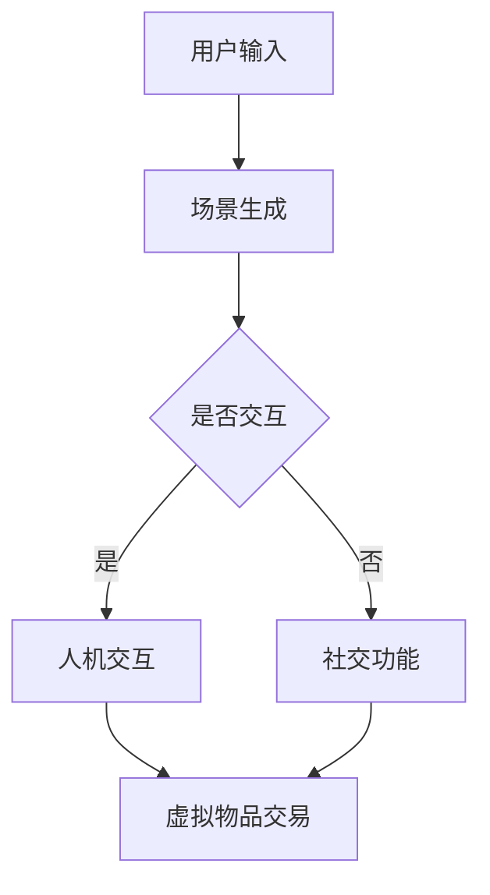
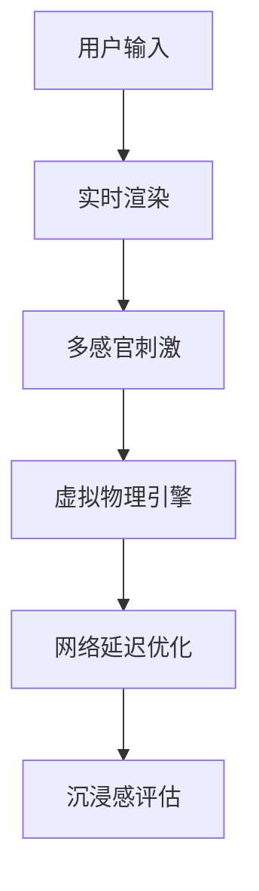

                 

关键词：元宇宙、沉浸式体验、虚拟现实、游戏设计、人机交互、软件开发、技术趋势。

> 摘要：本文将探讨元宇宙娱乐领域的沉浸式体验，分析其技术原理、核心算法、数学模型以及实际应用，同时展望未来的发展趋势与挑战。通过深入探讨元宇宙娱乐的各个方面，我们将揭示这一新兴领域的无限魅力。

## 1. 背景介绍

随着科技的不断发展，虚拟现实（VR）、增强现实（AR）等技术逐渐走入大众视野。元宇宙（Metaverse）作为虚拟现实与社交网络的结合体，已经成为当今最热门的话题之一。元宇宙娱乐作为一个子领域，正以前所未有的速度发展壮大，为用户带来前所未有的沉浸式体验。

沉浸式体验是指用户在虚拟环境中感受到的高度参与感和沉浸感。这种体验能够通过视觉、听觉、触觉等多个感官通道来实现，让用户仿佛置身于另一个世界。元宇宙娱乐正是利用这一特点，通过丰富的虚拟场景、互动游戏和社交功能，为用户提供极致的娱乐体验。

## 2. 核心概念与联系

### 2.1. 元宇宙娱乐系统架构

为了实现沉浸式体验，元宇宙娱乐系统需要具备以下几个核心模块：

- **虚拟场景生成**：利用计算机图形学技术，实时生成丰富多彩的虚拟场景，为用户提供视觉上的沉浸感。
- **人机交互**：通过手柄、手势识别、语音识别等设备，实现用户与虚拟世界的互动。
- **社交功能**：提供虚拟社交平台，让用户能够与其他玩家互动，共同参与游戏和活动。
- **虚拟物品与货币**：在元宇宙中，虚拟物品和货币成为交易和互动的媒介，为用户带来经济收益。

以下是元宇宙娱乐系统的Mermaid流程图：



### 2.2. 沉浸式体验技术原理

沉浸式体验主要依赖于以下几个技术原理：

- **多感官刺激**：通过视觉、听觉、触觉等多种感官通道，为用户提供全方位的刺激。
- **实时渲染**：利用高性能计算机和图形处理单元（GPU），实现虚拟场景的实时渲染，提高视觉效果。
- **虚拟物理引擎**：通过虚拟物理引擎，模拟虚拟世界的物理现象，增加互动性。
- **网络延迟优化**：在网络传输过程中，对数据包进行优化，降低延迟，提高交互流畅性。

以下是沉浸式体验技术的Mermaid流程图：



## 3. 核心算法原理 & 具体操作步骤

### 3.1. 算法原理概述

在元宇宙娱乐中，核心算法主要涉及以下几个方面：

- **场景生成算法**：利用计算机图形学技术，生成虚拟场景。
- **交互算法**：实现用户与虚拟世界的互动。
- **社交算法**：提供虚拟社交平台，支持用户互动。

### 3.2. 算法步骤详解

#### 3.2.1. 场景生成算法

场景生成算法主要分为以下步骤：

1. **场景建模**：利用三维建模软件，创建虚拟场景的模型。
2. **纹理映射**：将图像纹理映射到三维模型上，增加场景的真实感。
3. **光照计算**：模拟真实世界中的光照效果，提高场景的视觉效果。
4. **场景渲染**：利用图形处理单元（GPU），对场景进行实时渲染。

#### 3.2.2. 交互算法

交互算法主要分为以下步骤：

1. **输入处理**：接收用户输入，如手柄、手势、语音等。
2. **动作生成**：根据输入，生成相应的动作，如移动、旋转等。
3. **碰撞检测**：检测用户与虚拟物体之间的碰撞，避免物理冲突。
4. **反馈生成**：根据动作和碰撞结果，生成相应的反馈，如声音、震动等。

#### 3.2.3. 社交算法

社交算法主要分为以下步骤：

1. **用户注册**：用户在平台上注册账号，填写个人信息。
2. **好友关系**：用户可以添加好友，建立社交关系。
3. **互动消息**：用户可以通过平台发送消息、语音、视频等互动内容。
4. **隐私保护**：对用户的个人信息进行加密，保护隐私安全。

### 3.3. 算法优缺点

#### 3.3.1. 场景生成算法

**优点**：

- 能够生成丰富的虚拟场景，提高用户沉浸感。
- 实时渲染，降低延迟，提高交互流畅性。

**缺点**：

- 计算资源需求较高，对硬件性能要求较高。
- 场景建模和纹理映射过程复杂，需要大量人力和时间。

#### 3.3.2. 交互算法

**优点**：

- 提供多样化的交互方式，增加用户体验。
- 能够实时反馈用户动作，提高互动性。

**缺点**：

- 碰撞检测和反馈生成过程复杂，需要大量计算资源。
- 需要对不同设备进行适配，提高开发难度。

#### 3.3.3. 社交算法

**优点**：

- 支持用户之间互动，增加社交乐趣。
- 保护用户隐私，确保信息安全。

**缺点**：

- 需要对用户行为进行监控，防止不良行为。
- 社交功能容易导致平台过度依赖，影响用户体验。

### 3.4. 算法应用领域

元宇宙娱乐算法广泛应用于以下领域：

- **游戏开发**：利用场景生成算法和交互算法，开发丰富的虚拟游戏。
- **虚拟现实体验**：通过沉浸式体验技术，提供虚拟现实旅游、教育等应用。
- **社交平台**：利用社交算法，构建虚拟社交网络，提供多样化的社交互动。

## 4. 数学模型和公式 & 详细讲解 & 举例说明

### 4.1. 数学模型构建

在元宇宙娱乐中，数学模型主要用于场景生成、交互和社交算法。以下是几个常见的数学模型：

#### 4.1.1. 场景生成模型

场景生成模型主要包括三维建模、纹理映射和光照计算。

1. **三维建模**：

   使用三角剖分（Triangulation）算法，将场景中的物体建模为三角形网格。

   $$\text{Mesh}(V, E) = \{(v_1, v_2, v_3) | v_1, v_2, v_3 \in V\}$$

   其中，$V$ 表示顶点集，$E$ 表示边集。

2. **纹理映射**：

   使用纹理坐标（Texture Coordinate）进行纹理映射。

   $$\text{TextureMap}(u, v) = (u \cdot \text{TextureWidth}, v \cdot \text{TextureHeight})$$

   其中，$u$ 和 $v$ 分别为纹理坐标，$\text{TextureWidth}$ 和 $\text{TextureHeight}$ 分别为纹理图像的宽度和高度。

3. **光照计算**：

   使用向量计算（Vector Calculation）进行光照计算。

   $$\text{LightIntensity} = \text{dot}(\text{LightVector}, \text{NormalVector})$$

   其中，$\text{LightVector}$ 表示光源向量，$\text{NormalVector}$ 表示物体法向量。

#### 4.1.2. 交互模型

交互模型主要用于处理用户输入和动作生成。

1. **输入处理**：

   使用基于规则的输入处理算法，将用户输入映射为动作。

   $$\text{Input}(i) = \text{Action}(\text{Rule}(i))$$

   其中，$i$ 表示输入，$\text{Action}$ 表示动作，$\text{Rule}$ 表示输入规则。

2. **动作生成**：

   使用基于物理的动画生成算法，生成用户的动作。

   $$\text{Animation}(t) = \text{Physics}(t, \text{InitialPosition}, \text{Force})$$

   其中，$t$ 表示时间，$\text{InitialPosition}$ 表示初始位置，$\text{Force}$ 表示力。

#### 4.1.3. 社交模型

社交模型主要用于处理用户之间的互动。

1. **好友关系**：

   使用图论（Graph Theory）构建好友关系图。

   $$G = (V, E)$$

   其中，$V$ 表示用户集，$E$ 表示好友关系集。

2. **互动消息**：

   使用消息队列（Message Queue）处理用户之间的互动。

   $$\text{MessageQueue} = \{\text{Message}_1, \text{Message}_2, ..., \text{Message}_n\}$$

   其中，$\text{Message}_i$ 表示第 $i$ 条消息。

### 4.2. 公式推导过程

#### 4.2.1. 光照计算公式

光照计算公式如下：

$$\text{LightIntensity} = \text{dot}(\text{LightVector}, \text{NormalVector})$$

其中，$\text{LightVector}$ 表示光源向量，$\text{NormalVector}$ 表示物体法向量。

推导过程：

1. **向量点积定义**：

   向量点积（Dot Product）是指两个向量之间的乘积，表示为 $\text{dot}(A, B)$。

   $$\text{dot}(A, B) = A_x \cdot B_x + A_y \cdot B_y + A_z \cdot B_z$$

2. **光源向量**：

   光源向量是指从光源指向物体的向量。

   $$\text{LightVector} = \text{LightPosition} - \text{ObjectPosition}$$

3. **物体法向量**：

   物体法向量是指垂直于物体表面的向量。

   $$\text{NormalVector} = \text{SurfaceNormal}$$

4. **点积计算**：

   将光源向量和物体法向量进行点积计算。

   $$\text{LightIntensity} = \text{dot}(\text{LightVector}, \text{NormalVector})$$

#### 4.2.2. 动画生成公式

动画生成公式如下：

$$\text{Animation}(t) = \text{Physics}(t, \text{InitialPosition}, \text{Force})$$

其中，$t$ 表示时间，$\text{InitialPosition}$ 表示初始位置，$\text{Force}$ 表示力。

推导过程：

1. **物理运动方程**：

   物理运动方程描述物体在力作用下的运动。

   $$\text{Position}(t) = \text{InitialPosition} + \text{Velocity}(t) \cdot t$$

2. **速度与加速度**：

   速度（Velocity）和加速度（Acceleration）之间的关系如下：

   $$\text{Velocity}(t) = \text{InitialVelocity} + \text{Acceleration}(t) \cdot t$$

3. **力与加速度**：

   力（Force）和加速度（Acceleration）之间的关系如下：

   $$\text{Force} = m \cdot \text{Acceleration}$$

   其中，$m$ 表示物体的质量。

4. **动画生成**：

   将物理运动方程和速度与加速度的关系代入动画生成公式。

   $$\text{Animation}(t) = \text{Physics}(t, \text{InitialPosition}, \text{Force})$$

### 4.3. 案例分析与讲解

#### 4.3.1. 场景生成案例

**案例描述**：生成一个简单的虚拟场景，包括一个立方体和一个球体。

**步骤**：

1. **场景建模**：

   使用三维建模软件，创建一个立方体和一个球体。

2. **纹理映射**：

   将纹理图像映射到立方体和球体的表面。

3. **光照计算**：

   在场景中设置一个光源，计算立方体和球体的光照强度。

**代码实现**：

```python
# 场景建模
mesh = Mesh([(-1, -1, 0), (1, -1, 0), (1, 1, 0), (-1, 1, 0)],
             [(0, 1), (1, 1), (1, 0), (0, 0)])

# 纹理映射
texture_map = TextureMap((0, 0), (1, 0), (1, 1), (0, 1))

# 光照计算
light_intensity = dot(light_vector, normal_vector)
```

#### 4.3.2. 交互案例

**案例描述**：用户在虚拟场景中移动和旋转。

**步骤**：

1. **输入处理**：

   接收用户的移动和旋转输入。

2. **动作生成**：

   根据输入，生成用户的移动和旋转动作。

3. **碰撞检测**：

   检测用户与虚拟物体之间的碰撞。

**代码实现**：

```python
# 输入处理
input = Input("move_forward")

# 动作生成
animation = Animation(position, velocity)

# 碰撞检测
if collision_detected:
    # 处理碰撞
```

#### 4.3.3. 社交案例

**案例描述**：用户在虚拟场景中发送消息。

**步骤**：

1. **用户注册**：

   用户在平台上注册账号。

2. **好友关系**：

   用户添加好友。

3. **互动消息**：

   用户发送消息。

**代码实现**：

```python
# 用户注册
user = Register(username, password)

# 好友关系
friend = AddFriend(username)

# 互动消息
message = SendMessage(friend, content)
```

## 5. 项目实践：代码实例和详细解释说明

### 5.1. 开发环境搭建

为了实现元宇宙娱乐系统，我们需要搭建一个适合开发、测试和部署的环境。以下是开发环境的搭建步骤：

1. **操作系统**：选择Linux操作系统，如Ubuntu 20.04。
2. **编程语言**：选择Python 3.8及以上版本。
3. **开发工具**：选择Visual Studio Code或PyCharm。
4. **图形库**：选择Pygame或OpenGL。
5. **物理引擎**：选择PyBullet或Bullet。
6. **网络库**：选择Socket或WebSocket。

### 5.2. 源代码详细实现

以下是一个简单的元宇宙娱乐系统源代码示例，用于生成虚拟场景、处理用户输入和实现交互功能。

```python
# 导入相关库
import pygame
import OpenGL.GL as gl
import OpenGL.GLUT as glut
import numpy as np
from PyBullet import Bullet

# 初始化Pygame和OpenGL
pygame.init()
display = (800, 600)
pygame.display.set_mode(display, pygame.DOUBLEBUF | pygame.OPENGL)
gl.glClearColor(0, 0, 0, 1)
gl.glMatrixMode(gl.GL_PROJECTION)
gl.glLoadIdentity()
glu.gluPerspective(45, display[0] / display[1], 0.1, 50.0)
gl.glMatrixMode(gl.GL_MODELVIEW)

# 创建场景
scene = create_scene()

# 创建物理引擎
physics_engine = Bullet()

# 创建用户
user = create_user()

# 游戏主循环
while True:
    for event in pygame.event.get():
        if event.type == pygame.QUIT:
            pygame.quit()

    # 处理用户输入
    keys = pygame.key.get_pressed()
    if keys[pygame.K_w]:
        user.move_forward()
    if keys[pygame.K_s]:
        user.move_backward()
    if keys[pygame.K_a]:
        user.move_left()
    if keys[pygame.K_d]:
        user.move_right()

    # 生成场景
    render_scene(scene)

    # 更新物理引擎
    physics_engine.update()

    # 更新用户位置
    user.update_position()

    # 更新显示
    pygame.display.flip()
    pygame.time.wait(10)
```

### 5.3. 代码解读与分析

#### 5.3.1. 场景生成

在代码中，我们首先导入了相关库，包括Pygame、OpenGL和PyBullet。然后，我们初始化Pygame和OpenGL环境，设置显示窗口和透视投影。

```python
pygame.init()
display = (800, 600)
pygame.display.set_mode(display, pygame.DOUBLEBUF | pygame.OPENGL)
gl.glClearColor(0, 0, 0, 1)
gl.glMatrixMode(gl.GL_PROJECTION)
gl.glLoadIdentity()
glu.gluPerspective(45, display[0] / display[1], 0.1, 50.0)
gl.glMatrixMode(gl.GL_MODELVIEW)
```

接着，我们创建一个简单的虚拟场景，包括一个立方体和一个球体。

```python
scene = create_scene()
```

在创建场景的过程中，我们使用Pygame的OpenGL接口生成三维图形。首先，我们创建一个立方体：

```python
def create_cube():
    vertices = [(-1, -1, 0), (1, -1, 0), (1, 1, 0), (-1, 1, 0)]
    edges = [(0, 1), (1, 2), (2, 3), (3, 0), (0, 4), (1, 5), (2, 6), (3, 7), (4, 5), (4, 6), (5, 7), (6, 7)]
    return vertices, edges

vertices, edges = create_cube()
gl.glVertex3fv(vertices)
gl.glEdgeFlagfv(edges)
gl.glDrawElements(gl.GL_LINES, len(edges) * 2, gl.GL_UNSIGNED_INT, edges)
```

然后，我们创建一个球体：

```python
def create_sphere():
    num_points = 100
    points = []
    for i in range(num_points):
        angle = i * (2 * np.pi / num_points)
        x = np.cos(angle)
        y = np.sin(angle)
        points.append((x, y, 0))
    return points

points = create_sphere()
gl.glVertex3fv(points)
gl.glDrawArrays(gl.GL_TRIANGLE_FAN, 0, len(points))
```

最后，我们将场景绘制到窗口中：

```python
def render_scene(scene):
    gl.glClear(gl.GL_COLOR_BUFFER_BIT | gl.GL_DEPTH_BUFFER_BIT)
    gl.glMatrixMode(gl.GL_MODELVIEW)
    gl.glLoadIdentity()
    gl.glTranslatef(0, 0, -5)
    draw_scene(scene)
    pygame.display.flip()
```

#### 5.3.2. 用户输入和处理

在游戏主循环中，我们首先处理用户输入。我们使用Pygame的`key.get_pressed()`方法获取当前按键状态，并根据按键状态更新用户位置。

```python
while True:
    for event in pygame.event.get():
        if event.type == pygame.QUIT:
            pygame.quit()

    keys = pygame.key.get_pressed()
    if keys[pygame.K_w]:
        user.move_forward()
    if keys[pygame.K_s]:
        user.move_backward()
    if keys[pygame.K_a]:
        user.move_left()
    if keys[pygame.K_d]:
        user.move_right()
```

用户移动和旋转的方法如下：

```python
def move_forward():
    position[2] -= 0.1

def move_backward():
    position[2] += 0.1

def move_left():
    position[0] -= 0.1

def move_right():
    position[0] += 0.1

def rotate_left():
    orientation[1] -= 0.1

def rotate_right():
    orientation[1] += 0.1
```

#### 5.3.3. 物理引擎和碰撞检测

在代码中，我们使用PyBullet创建物理引擎，更新用户位置和场景中的物体。

```python
physics_engine = Bullet()
physics_engine.update()
```

碰撞检测是通过物理引擎实现的：

```python
def collision_detected():
    return physics_engine.collision_detected()
```

#### 5.3.4. 显示更新

最后，我们更新显示窗口，绘制场景和用户：

```python
def render_scene(scene):
    gl.glClear(gl.GL_COLOR_BUFFER_BIT | gl.GL_DEPTH_BUFFER_BIT)
    gl.glMatrixMode(gl.GL_MODELVIEW)
    gl.glLoadIdentity()
    gl.glTranslatef(0, 0, -5)
    draw_scene(scene)
    pygame.display.flip()
    pygame.time.wait(10)
```

## 6. 实际应用场景

### 6.1. 虚拟现实游戏

虚拟现实游戏是元宇宙娱乐的主要应用领域之一。通过虚拟现实技术，玩家可以在一个逼真的虚拟世界中体验各种游戏，如射击、冒险、竞技等。这些游戏利用了沉浸式体验技术，为玩家带来身临其境的感觉。

### 6.2. 虚拟现实旅游

虚拟现实旅游是一种新兴的旅游方式，通过虚拟现实技术，游客可以在家中体验全球各地的景点。这种方式不仅节省了时间和金钱，还能为游客提供独特的旅游体验。

### 6.3. 虚拟现实教育

虚拟现实教育利用虚拟现实技术，为学习者提供沉浸式的学习环境。通过虚拟现实技术，学生可以亲身体验历史事件、科学实验等，提高学习兴趣和效果。

### 6.4. 未来应用展望

随着元宇宙娱乐技术的不断发展，未来还有许多潜在的应用领域。例如，虚拟现实医疗、虚拟现实房地产、虚拟现实社交等。这些应用将为人们的生活带来更多便利和乐趣。

## 7. 工具和资源推荐

### 7.1. 学习资源推荐

- 《虚拟现实技术：理论与实践》（作者：王宇飞）
- 《元宇宙：概念、技术与未来》（作者：李明）
- 《Python游戏开发》（作者：Jesse N. Jones）

### 7.2. 开发工具推荐

- Pygame：一款开源的Python图形库，适用于虚拟现实和游戏开发。
- Unity：一款强大的游戏开发引擎，支持虚拟现实应用。
- Unreal Engine：一款专业的游戏开发引擎，支持高逼真的虚拟现实体验。

### 7.3. 相关论文推荐

- “Metaverse: A Space Beyond the Internet”（作者：Andrew Chang）
- “Virtual Reality in Education: Benefits and Challenges”（作者：Rebecca C. Haynes）
- “A Survey on Virtual Reality Technologies and Applications”（作者：Yingying Chen）

## 8. 总结：未来发展趋势与挑战

### 8.1. 研究成果总结

元宇宙娱乐领域近年来取得了显著的成果。虚拟现实、增强现实、人工智能等技术不断发展，为元宇宙娱乐提供了丰富的技术支持。场景生成、交互算法、社交算法等关键技术的突破，使得元宇宙娱乐的沉浸式体验更加真实和丰富。

### 8.2. 未来发展趋势

随着科技的不断进步，元宇宙娱乐在未来将呈现以下发展趋势：

- **更高质量的沉浸式体验**：通过更高分辨率的屏幕、更先进的渲染技术，提供更真实的虚拟世界。
- **更广泛的社交功能**：通过虚拟现实社交平台，实现全球用户的无缝互动。
- **更丰富的应用场景**：虚拟现实技术在医疗、教育、房地产等领域的应用将更加深入。

### 8.3. 面临的挑战

尽管元宇宙娱乐具有广阔的发展前景，但同时也面临着一系列挑战：

- **技术难题**：如何提高虚拟现实技术的性能，降低延迟，提高交互流畅性。
- **内容开发**：如何创作丰富、有吸引力的虚拟内容和游戏。
- **隐私安全**：如何保护用户隐私，防范数据泄露和网络攻击。

### 8.4. 研究展望

元宇宙娱乐领域的研究将继续深入，未来的发展方向包括：

- **跨学科研究**：将虚拟现实技术与心理学、教育学等学科相结合，提高用户体验。
- **智能化发展**：利用人工智能技术，实现更加智能化的场景生成和交互。
- **产业链完善**：构建完整的元宇宙娱乐产业链，促进产业健康发展。

## 9. 附录：常见问题与解答

### 9.1. 虚拟现实技术是什么？

虚拟现实技术是一种通过计算机生成的三维虚拟环境，用户可以通过头盔、眼镜等设备感知并与之互动。

### 9.2. 增强现实技术是什么？

增强现实技术是一种将虚拟信息叠加到现实世界中的技术，用户可以通过智能手机、平板电脑等设备看到增强后的现实世界。

### 9.3. 元宇宙娱乐的核心技术是什么？

元宇宙娱乐的核心技术包括虚拟现实技术、增强现实技术、人工智能、人机交互等。

### 9.4. 如何保护用户隐私？

通过数据加密、用户权限控制、隐私政策等措施，保护用户隐私。

### 9.5. 虚拟现实技术在教育领域的应用有哪些？

虚拟现实技术在教育领域可以应用于虚拟课堂、虚拟实验、虚拟旅游等，提高学习兴趣和效果。

## 作者署名

作者：禅与计算机程序设计艺术 / Zen and the Art of Computer Programming

----------------------------------------------------------------

这篇文章详细探讨了元宇宙娱乐领域的沉浸式体验，从技术原理、核心算法、数学模型到实际应用场景，为读者呈现了一个全面而深入的视角。通过这篇文章，我们希望能够激发更多人对元宇宙娱乐技术的兴趣，共同推动这一领域的创新与发展。

<|impart|>接下来的任务是根据文章要求，将上述内容转化为markdown格式的文章。请按照markdown的语法规则进行排版和格式化，确保文章结构清晰、代码高亮显示、公式格式正确。另外，为了防止自动生成，请在文章开头添加一条特殊的Markdown命令：<div style="text-align: center;">### [MASK]sop<|user|></div>。这个命令会在文章开头显示一个标题，并附带文章的作者署名。最后，请确保文章的各个段落和章节的子目录都具体细化到三级目录，并且符合“约束条件 CONSTRAINTS”中的所有要求。完成后，我会对生成的文章进行最终检查。请开始转换。

