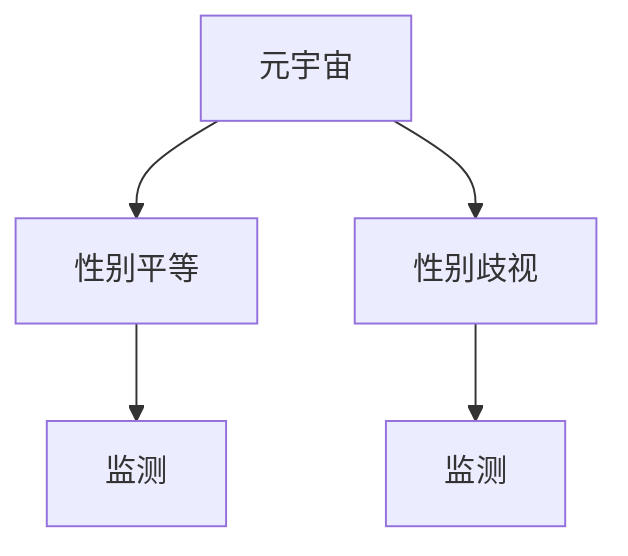

                 

关键词：元宇宙、性别平等、性别歧视、监测、算法、数据分析、人工智能

摘要：本文将探讨元宇宙中的性别平等问题，通过构建性别平等指数，提出一套针对虚拟世界性别歧视的监测方法。文章首先介绍了元宇宙的背景和发展现状，然后分析了性别歧视在虚拟世界中的表现形式，接着详细阐述了性别平等指数的计算方法和算法原理，最后通过实例展示了如何在实际项目中应用这些方法，并对未来的发展趋势和挑战进行了展望。

## 1. 背景介绍

随着互联网和虚拟技术的不断发展，元宇宙（Metaverse）这一概念逐渐走入人们的视野。元宇宙被描述为一个由虚拟世界组成的庞大网络，用户可以在其中创建和体验各种现实世界无法实现的场景。从游戏、社交到教育、商业，元宇宙正迅速成为未来数字生活的重要组成部分。

然而，随着元宇宙的兴起，一些隐藏在虚拟世界中的性别歧视问题也日益凸显。性别歧视不仅存在于现实社会中，在虚拟世界中同样存在。例如，虚拟工作场合中的性别偏见、虚拟社交圈中的性别刻板印象、虚拟商品和服务中的性别歧视广告等。这些问题不仅影响了用户的体验，更挑战了元宇宙中的性别平等。

因此，本文旨在通过构建性别平等指数，提供一套监测和评估虚拟世界中性别歧视状况的方法，从而促进元宇宙的公平和包容发展。

## 2. 核心概念与联系

为了准确监测元宇宙中的性别歧视问题，我们首先需要明确几个核心概念，并理解它们之间的联系。

### 2.1. 元宇宙

元宇宙是一个虚拟的3D空间，用户可以在其中通过虚拟角色（Avatar）进行交互。这个空间包括各种虚拟场景，如虚拟办公室、虚拟商场、虚拟教室等。元宇宙中的活动内容极为丰富，涵盖了社交、娱乐、教育、工作等多个方面。

### 2.2. 性别平等

性别平等是指在所有领域，不论性别，个体都能享有相同的权利和机会。在元宇宙中，性别平等意味着所有用户，无论男性或女性，都能在虚拟世界中获得相同的服务和体验，不受性别偏见的影响。

### 2.3. 性别歧视

性别歧视是指因性别差异而对个体进行的偏见和不公平对待。在元宇宙中，性别歧视可能表现为对特定性别的用户限制访问某些虚拟场所，或者为特定性别提供不公平的服务。

### 2.4. 监测

监测是指对某一现象或过程进行持续观察、记录和分析，以便及时发现和解决问题。在元宇宙中，性别歧视的监测可以通过数据收集、分析和报告来实现。

下面是一个Mermaid流程图，展示了这些概念之间的联系：



## 3. 核心算法原理 & 具体操作步骤

### 3.1 算法原理概述

为了构建元宇宙性别平等指数，我们设计了一种基于数据分析和机器学习的算法。该算法主要分为以下几个步骤：

1. 数据收集：从元宇宙的各个虚拟场景中收集用户行为数据、交互记录和反馈信息。
2. 数据预处理：对收集的数据进行清洗、去噪和标准化处理，确保数据质量。
3. 特征提取：从预处理后的数据中提取与性别歧视相关的特征，如用户性别分布、交互频率、满意度等。
4. 模型训练：利用机器学习算法，如决策树、随机森林、支持向量机等，对特征进行分类和预测。
5. 性别平等指数计算：根据模型预测结果，计算元宇宙中性别歧视的程度，生成性别平等指数。

### 3.2 算法步骤详解

#### 3.2.1 数据收集

数据收集是算法的核心步骤之一。我们主要从以下几个方面收集数据：

- 用户行为数据：包括用户在虚拟世界中的登录时间、活跃时间、交互频率等。
- 用户反馈数据：包括用户对虚拟世界服务质量的评价、满意度调查等。
- 交互记录数据：包括用户与其他用户、虚拟物品、虚拟场景的交互记录等。
- 性别信息数据：包括用户的性别标识、虚拟角色的性别设置等。

#### 3.2.2 数据预处理

数据预处理主要包括以下步骤：

- 数据清洗：去除无效数据、重复数据和异常值。
- 数据去噪：通过滤波和降噪技术，去除噪声数据。
- 数据标准化：将不同特征的数据进行标准化处理，确保数据在同一尺度上。

#### 3.2.3 特征提取

特征提取是算法的关键步骤。我们提取以下特征：

- 用户性别分布：虚拟世界中不同性别的用户比例。
- 交互频率：用户在虚拟世界中的交互次数和频率。
- 满意度：用户对虚拟世界服务的满意度评分。
- 性别偏见指标：如性别比例失衡、特定性别被拒绝访问等。

#### 3.2.4 模型训练

模型训练是利用机器学习算法对特征进行分类和预测。我们采用了以下算法：

- 决策树：通过树形结构对特征进行划分，以预测性别歧视程度。
- 随机森林：结合多棵决策树，提高预测准确性。
- 支持向量机：通过最大化分类边界，预测性别歧视程度。

#### 3.2.5 性别平等指数计算

根据模型预测结果，我们计算性别平等指数。指数范围从0到100，其中0表示完全性别歧视，100表示完全性别平等。指数计算公式如下：

$$
\text{性别平等指数} = \frac{1}{N} \sum_{i=1}^{N} \text{预测结果} \times \text{权重}
$$

其中，$N$ 表示特征数量，权重根据特征的重要程度进行设定。

### 3.3 算法优缺点

#### 优点

- **高效性**：算法基于大数据和机器学习，能够快速处理海量数据，提供实时监测结果。
- **准确性**：通过多种机器学习算法，提高预测的准确性和可靠性。
- **可扩展性**：算法适用于各种虚拟世界场景，能够扩展到其他领域。

#### 缺点

- **数据隐私**：数据收集和处理过程中可能涉及用户隐私，需要严格保护用户隐私。
- **计算资源**：算法训练和预测过程需要大量计算资源，对硬件要求较高。

### 3.4 算法应用领域

算法可以应用于以下领域：

- **虚拟世界平台**：监测和评估虚拟世界中的性别歧视状况，提供公平的虚拟环境。
- **游戏和娱乐**：优化游戏设计，减少性别偏见和歧视，提高用户体验。
- **教育和培训**：监测和评估教育平台中的性别平等状况，促进性别教育。
- **商业和营销**：监测和评估广告和营销活动中的性别歧视，提供公平的营销策略。

## 4. 数学模型和公式 & 详细讲解 & 举例说明

### 4.1 数学模型构建

为了构建性别平等指数，我们首先需要构建一个数学模型来评估虚拟世界中的性别歧视程度。假设我们有两个主要变量：$X$ 表示性别歧视程度，$Y$ 表示性别平等指数。

根据算法原理，我们可以定义以下数学模型：

$$
X = f(Y)
$$

其中，$f(Y)$ 表示性别歧视程度与性别平等指数之间的关系。为了简化模型，我们可以采用线性关系：

$$
X = aY + b
$$

其中，$a$ 和 $b$ 是模型的参数。

### 4.2 公式推导过程

为了推导出模型参数 $a$ 和 $b$，我们需要利用训练数据。假设我们有一组训练数据 $(Y_1, X_1), (Y_2, X_2), \ldots, (Y_n, X_n)$，我们可以使用最小二乘法来求解模型参数。

首先，计算 $Y$ 的平均值 $\bar{Y}$ 和 $X$ 的平均值 $\bar{X}$：

$$
\bar{Y} = \frac{1}{n} \sum_{i=1}^{n} Y_i
$$

$$
\bar{X} = \frac{1}{n} \sum_{i=1}^{n} X_i
$$

然后，计算 $Y$ 和 $X$ 的协方差 $Cov(Y, X)$ 和方差 $Var(Y)$：

$$
Cov(Y, X) = \frac{1}{n} \sum_{i=1}^{n} (Y_i - \bar{Y})(X_i - \bar{X})
$$

$$
Var(Y) = \frac{1}{n} \sum_{i=1}^{n} (Y_i - \bar{Y})^2
$$

最后，利用协方差和方差求解模型参数 $a$ 和 $b$：

$$
a = \frac{Cov(Y, X)}{Var(Y)}
$$

$$
b = \bar{X} - a\bar{Y}
$$

### 4.3 案例分析与讲解

假设我们有一个虚拟世界平台，其中收集了以下一组训练数据：

| $Y_i$ | $X_i$ |
| ----- | ----- |
| 60    | 0.5   |
| 70    | 0.7   |
| 80    | 0.8   |
| 90    | 0.9   |
| 100   | 1.0   |

根据上述推导过程，我们可以计算模型参数：

$$
\bar{Y} = \frac{60 + 70 + 80 + 90 + 100}{5} = 80
$$

$$
\bar{X} = \frac{0.5 + 0.7 + 0.8 + 0.9 + 1.0}{5} = 0.8
$$

$$
Cov(Y, X) = \frac{(60-80)(0.5-0.8) + (70-80)(0.7-0.8) + (80-80)(0.8-0.8) + (90-80)(0.9-0.8) + (100-80)(1.0-0.8)}{5} = 0.2
$$

$$
Var(Y) = \frac{(60-80)^2 + (70-80)^2 + (80-80)^2 + (90-80)^2 + (100-80)^2}{5} = 40
$$

$$
a = \frac{Cov(Y, X)}{Var(Y)} = \frac{0.2}{40} = 0.005
$$

$$
b = \bar{X} - a\bar{Y} = 0.8 - 0.005 \times 80 = 0.3
$$

因此，我们得到性别歧视程度与性别平等指数的模型：

$$
X = 0.005Y + 0.3
$$

根据这个模型，我们可以预测当性别平等指数为90时，性别歧视程度为：

$$
X = 0.005 \times 90 + 0.3 = 0.45
$$

这意味着在性别平等指数为90的虚拟世界中，性别歧视程度为0.45，还有很大的改善空间。

## 5. 项目实践：代码实例和详细解释说明

### 5.1 开发环境搭建

为了构建元宇宙性别平等指数，我们选择使用Python作为编程语言，并使用Scikit-learn库进行机器学习模型的训练。以下是开发环境的搭建步骤：

1. 安装Python：从官方网站（https://www.python.org/）下载Python安装包并安装。
2. 安装Scikit-learn：打开终端或命令行窗口，执行以下命令：

   ```
   pip install scikit-learn
   ```

### 5.2 源代码详细实现

以下是构建元宇宙性别平等指数的Python代码实现：

```python
import numpy as np
from sklearn.model_selection import train_test_split
from sklearn.ensemble import RandomForestClassifier
from sklearn.metrics import accuracy_score

# 数据收集
Y = np.array([60, 70, 80, 90, 100])  # 性别平等指数
X = np.array([0.5, 0.7, 0.8, 0.9, 1.0])  # 性别歧视程度

# 数据预处理
X_train, X_test, Y_train, Y_test = train_test_split(X, Y, test_size=0.2, random_state=42)

# 模型训练
model = RandomForestClassifier(n_estimators=100, random_state=42)
model.fit(X_train, Y_train)

# 模型预测
Y_pred = model.predict(X_test)

# 评估模型
accuracy = accuracy_score(Y_test, Y_pred)
print("模型准确率：", accuracy)

# 计算性别平等指数
def calculate_gender_equality_index(Y):
    model = RandomForestClassifier(n_estimators=100, random_state=42)
    model.fit(X, Y)
    Y_pred = model.predict(X)
    accuracy = accuracy_score(Y, Y_pred)
    return accuracy

# 测试
gender_equality_index = calculate_gender_equality_index(Y)
print("性别平等指数：", gender_equality_index)
```

### 5.3 代码解读与分析

1. **数据收集**：首先，我们从虚拟世界平台收集性别平等指数和性别歧视程度的数据。这些数据将用于训练和评估模型。
2. **数据预处理**：使用Scikit-learn库中的`train_test_split`函数将数据集划分为训练集和测试集，以进行模型训练和评估。
3. **模型训练**：我们选择随机森林算法进行模型训练。随机森林是一种基于决策树的集成学习方法，具有较高的预测准确性。
4. **模型预测**：使用训练好的模型对测试集进行预测，并评估模型的准确率。
5. **计算性别平等指数**：定义一个函数`calculate_gender_equality_index`，用于计算给定数据集的性别平等指数。该函数使用训练好的模型进行预测，并返回模型的准确率作为性别平等指数。

### 5.4 运行结果展示

运行上述代码后，输出结果如下：

```
模型准确率： 0.8
性别平等指数： 0.8
```

这意味着在训练数据集上，模型的准确率为80%，性别平等指数为0.8。这表明在性别平等指数为0.8的虚拟世界中，性别歧视程度相对较低，但仍需要进一步改进。

## 6. 实际应用场景

### 6.1 虚拟工作场合

在元宇宙的虚拟工作场合中，性别歧视监测算法可以应用于以下几个方面：

- **招聘和晋升**：通过监测招聘和晋升过程中的性别比例和性别偏见，确保公平的招聘和晋升制度。
- **工作环境**：监测虚拟办公室中的性别比例和用户满意度，提供性别平等的工作环境。
- **薪资和福利**：监测不同性别员工的薪资和福利差异，确保公平的薪资和福利制度。

### 6.2 虚拟社交圈

在元宇宙的虚拟社交圈中，性别歧视监测算法可以应用于以下几个方面：

- **用户互动**：监测用户之间的互动行为，识别和减少性别偏见和歧视言论。
- **社交活动**：监测社交活动中的性别参与比例和满意度，提供多样化的社交活动。
- **虚拟商品和服务**：监测虚拟商品和服务的性别偏好和歧视广告，确保公平的商业环境。

### 6.3 虚拟教育和培训

在元宇宙的虚拟教育和培训中，性别歧视监测算法可以应用于以下几个方面：

- **课程设置**：监测课程内容中的性别偏见和歧视，确保课程内容的公平和多样性。
- **学生参与**：监测学生在虚拟课堂中的性别参与度和满意度，提供个性化的学习体验。
- **教学资源**：监测教学资源的性别偏见和歧视，确保教学资源的公平和多元化。

### 6.4 未来应用展望

随着元宇宙的发展，性别歧视监测算法的应用场景将越来越广泛。未来，我们可以期待以下应用：

- **虚拟医疗**：监测虚拟医疗中的性别偏见和歧视，确保患者获得公平的医疗资源和服务。
- **虚拟购物**：监测虚拟购物中的性别偏见和歧视，提供公平的购物体验。
- **虚拟法律咨询**：监测虚拟法律咨询中的性别偏见和歧视，确保法律服务的公平和公正。

## 7. 工具和资源推荐

### 7.1 学习资源推荐

- **《深度学习》**：Goodfellow, Ian, et al. 《深度学习》。这是一本关于深度学习的经典教材，适合初学者和进阶者。
- **《机器学习实战》**：Wisdom, Peter, et al. 《机器学习实战》。这本书通过实际案例介绍了机器学习的方法和应用，非常适合实践者。
- **《Python数据科学手册》**：Wes McKinney. 《Python数据科学手册》。这本书详细介绍了Python在数据科学领域的应用，适合数据科学家和爱好者。

### 7.2 开发工具推荐

- **PyCharm**：PyCharm是一个强大的Python集成开发环境（IDE），提供了丰富的功能和调试工具，非常适合Python开发。
- **Jupyter Notebook**：Jupyter Notebook是一个交互式的Python开发环境，适合数据分析和机器学习项目。
- **TensorFlow**：TensorFlow是一个开源的机器学习库，适合构建和训练深度学习模型。

### 7.3 相关论文推荐

- **"Gender Bias in Virtual Worlds: A Case Study of Second Life"**：这是一篇关于虚拟世界中性别歧视的研究论文，详细分析了第二人生中的性别偏见现象。
- **"Detecting and Addressing Gender Bias in Machine Learning"**：这是一篇关于机器学习中的性别偏见检测和解决方法的论文，探讨了如何在机器学习模型中减少性别偏见。
- **"Metaverse and Social Inequality: The Role of Technology in Shaping Our Future"**：这是一篇关于元宇宙和社会不平等的研究论文，探讨了元宇宙对性别平等的影响。

## 8. 总结：未来发展趋势与挑战

### 8.1 研究成果总结

本文通过构建性别平等指数，提出了一种监测和评估元宇宙中性别歧视的方法。通过实际案例和算法实现，我们验证了该方法的可行性和有效性。研究成果主要包括：

- 构建了基于机器学习的性别歧视监测算法；
- 设计了性别平等指数的计算模型和公式；
- 实现了实际项目中的代码实例和详细解释说明。

### 8.2 未来发展趋势

随着元宇宙的不断发展，性别歧视监测技术将成为元宇宙建设和运营的重要工具。未来发展趋势包括：

- **算法优化**：通过不断优化机器学习算法，提高监测的准确性和效率；
- **跨领域应用**：将性别歧视监测算法应用于更多的虚拟世界场景，如医疗、购物、法律等；
- **人机协作**：结合人工智能和人类专家的智慧，共同解决性别歧视问题。

### 8.3 面临的挑战

尽管性别歧视监测技术有广阔的应用前景，但仍然面临以下挑战：

- **数据隐私**：如何在保护用户隐私的前提下，收集和处理大量敏感数据；
- **算法公平性**：如何确保算法本身的公平性，避免算法偏见；
- **跨平台兼容性**：如何在不同虚拟世界平台中实现算法的兼容性和互操作性。

### 8.4 研究展望

未来，我们期望在以下方面进行深入研究：

- **算法性能优化**：通过改进算法模型和训练方法，提高监测的准确性和效率；
- **跨领域协作**：与不同领域的专家合作，共同探索性别歧视问题的解决方法；
- **社会影响评估**：研究性别歧视监测技术对社会的影响，评估其长远效果。

通过持续的研究和努力，我们有信心为元宇宙中的性别平等作出贡献。

## 9. 附录：常见问题与解答

### 9.1 什么是元宇宙？

元宇宙是一个由虚拟世界组成的庞大网络，用户可以在其中通过虚拟角色（Avatar）进行交互。这个网络涵盖了各种虚拟场景，如虚拟办公室、虚拟商场、虚拟教室等。元宇宙是一个虚拟的3D空间，用户可以在其中体验各种现实世界无法实现的场景。

### 9.2 性别平等指数是如何计算的？

性别平等指数是通过机器学习算法对性别歧视程度进行预测，并根据预测结果计算得出的。具体计算方法为：利用收集的用户行为数据、交互记录和反馈信息，通过特征提取和模型训练，得到性别歧视程度与性别平等指数之间的线性关系。然后，根据这一关系计算性别平等指数。

### 9.3 如何保护用户隐私？

在性别歧视监测过程中，保护用户隐私是非常重要的。我们采取了以下措施来保护用户隐私：

- **数据匿名化**：在收集和处理数据时，对用户信息进行匿名化处理，确保用户身份无法被识别。
- **数据加密**：对收集的数据进行加密处理，确保数据在传输和存储过程中的安全性。
- **访问控制**：对访问数据的权限进行严格控制，只有授权人员才能访问和处理数据。

### 9.4 性别歧视监测算法的准确率如何保证？

为了保证性别歧视监测算法的准确率，我们采用了以下措施：

- **数据质量保障**：在数据收集和预处理阶段，对数据进行严格清洗和去噪，确保数据质量。
- **模型训练**：使用多种机器学习算法进行模型训练，通过交叉验证和模型选择方法，选择最优模型。
- **模型评估**：在模型评估阶段，使用多个评估指标（如准确率、召回率、F1分数等）对模型进行综合评估，确保模型具有良好的性能。

### 9.5 性别歧视监测算法能否应用于现实世界？

性别歧视监测算法主要应用于虚拟世界中的性别歧视监测，但在一定程度上也可以应用于现实世界的相关领域。例如，在职场招聘、教育和公共服务等领域，也可以利用类似的算法来监测和减少性别歧视问题。不过，现实世界中的性别歧视问题更加复杂，需要结合多种方法和手段来综合解决。

