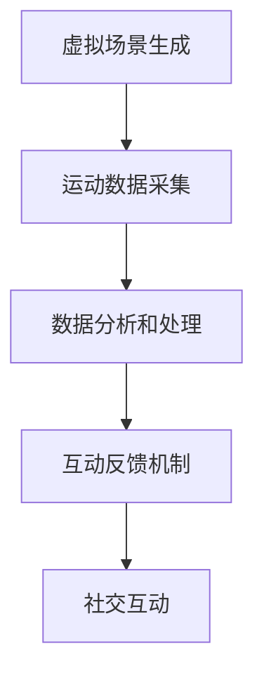

                 

关键词：元宇宙、虚拟现实、健康科技、虚拟健身房、互动健身、人工智能

> 摘要：本文将探讨元宇宙虚拟健身房的兴起与发展，分析其核心概念、算法原理、数学模型以及实际应用场景，并展望未来健康科技的发展趋势与挑战。

## 1. 背景介绍

随着科技的不断进步，尤其是虚拟现实（VR）和人工智能（AI）技术的迅猛发展，健康科技领域正经历着前所未有的变革。传统的健身房模式已无法满足现代人对于健康、便捷、个性化的需求。元宇宙虚拟健身房应运而生，它不仅将虚拟现实与健身相结合，还通过人工智能技术实现了智能化的健康指导和管理。这一创新应用为用户提供了全新的健身体验，同时也为健康科技领域带来了新的发展机遇。

## 2. 核心概念与联系

### 2.1 虚拟现实与健身的结合

虚拟现实技术通过创造一个完全沉浸式的虚拟环境，使用户能够在其中进行各种互动活动。在健身领域，虚拟现实技术可以为用户提供逼真的运动场景，模拟真实的运动过程，从而增强用户的参与感和乐趣。

### 2.2 人工智能在健康指导中的应用

人工智能技术可以通过分析用户的运动数据、生理参数等，为用户制定个性化的健身计划和健康指导。同时，人工智能还可以实时监测用户的运动状态，提供即时的反馈和建议，确保用户的健身安全。

### 2.3 虚拟健身房的整体架构

虚拟健身房的整体架构包括以下几个核心模块：

1. **虚拟场景生成**：利用计算机图形学技术，生成逼真的健身场景，包括室内外环境、健身器材、运动教练等。
2. **运动数据采集**：通过传感器、摄像头等设备，采集用户的运动数据，包括运动轨迹、心率、呼吸频率等。
3. **数据分析和处理**：利用人工智能算法，对采集到的运动数据进行分析和处理，为用户提供个性化的健身指导和建议。
4. **互动反馈机制**：通过实时反馈系统，为用户提供即时的运动指导、呼吸调整等，确保用户的健身效果和安全性。
5. **社交互动**：用户可以在虚拟健身房中与其他用户进行互动，分享健身心得，建立社群关系。

## Mermaid 流程图（Mermaid 流程节点中不要有括号、逗号等特殊字符）



## 3. 核心算法原理 & 具体操作步骤

### 3.1 算法原理概述

虚拟健身房的核心算法主要包括运动数据分析、个性化健身计划生成、实时互动反馈等。

1. **运动数据分析**：利用机器学习算法，对用户的运动数据进行模式识别，分析用户的运动偏好、强度等。
2. **个性化健身计划生成**：根据用户的运动数据，结合用户的目标和身体条件，生成个性化的健身计划。
3. **实时互动反馈**：通过深度学习算法，实时分析用户的运动状态，提供即时的反馈和建议。

### 3.2 算法步骤详解

1. **运动数据分析**：
    1. 采集用户的运动数据，包括运动轨迹、心率、呼吸频率等。
    2. 利用机器学习算法，对运动数据进行预处理和特征提取。
    3. 建立运动数据模型，对用户的运动数据进行模式识别。

2. **个性化健身计划生成**：
    1. 收集用户的身体数据，包括身高、体重、年龄、运动历史等。
    2. 根据用户的运动数据模型和身体数据，生成个性化的健身计划。
    3. 考虑用户的健身目标和时间安排，优化健身计划。

3. **实时互动反馈**：
    1. 采集用户的实时运动数据，包括心率、呼吸频率等。
    2. 利用深度学习算法，实时分析用户的运动状态。
    3. 根据分析结果，提供即时的运动指导、呼吸调整等建议。

### 3.3 算法优缺点

**优点**：

1. 个性化强：通过分析用户的运动数据和身体数据，可以提供高度个性化的健身指导和计划。
2. 实时反馈：实时分析用户的运动状态，提供即时的反馈和建议，确保用户的健身效果和安全性。

**缺点**：

1. 技术门槛高：核心算法的实现需要较高的技术门槛，包括机器学习、深度学习等。
2. 数据隐私：用户的运动数据和身体数据可能会涉及到隐私问题。

### 3.4 算法应用领域

1. **虚拟健身房**：元宇宙虚拟健身房的核心算法应用领域。
2. **健康监测**：通过对用户运动数据的分析，提供健康监测服务。
3. **体育训练**：利用个性化健身计划和实时互动反馈，为专业运动员提供训练指导。

## 4. 数学模型和公式 & 详细讲解 & 举例说明

### 4.1 数学模型构建

虚拟健身房的数学模型主要包括运动数据模型、身体数据模型和健身计划模型。

1. **运动数据模型**：用于描述用户的运动数据特征，包括运动轨迹、心率、呼吸频率等。
2. **身体数据模型**：用于描述用户的身体特征，包括身高、体重、年龄等。
3. **健身计划模型**：用于生成个性化的健身计划，包括运动强度、运动时间、运动方式等。

### 4.2 公式推导过程

1. **运动数据模型**：
    $$ 运动数据模型 = f(运动轨迹, 心率, 呼吸频率) $$

2. **身体数据模型**：
    $$ 身体数据模型 = f(身高, 体重, 年龄) $$

3. **健身计划模型**：
    $$ 健身计划模型 = f(运动数据模型, 身体数据模型, 健身目标) $$

### 4.3 案例分析与讲解

**案例一**：用户A的健身计划生成

1. **用户A的运动数据模型**：
    $$ 运动数据模型_A = f(运动轨迹_A, 心率_A, 呼吸频率_A) $$
    其中，运动轨迹_A 为用户A的运动轨迹数据，心率_A 为用户A的心率数据，呼吸频率_A 为用户A的呼吸频率数据。

2. **用户A的身体数据模型**：
    $$ 身体数据模型_A = f(身高_A, 体重_A, 年龄_A) $$
    其中，身高_A 为用户A的身高数据，体重_A 为用户A的体重数据，年龄_A 为用户A的年龄数据。

3. **用户A的健身计划模型**：
    $$ 健身计划模型_A = f(运动数据模型_A, 身体数据模型_A, 健身目标_A) $$
    其中，健身目标_A 为用户A的健身目标数据。

通过以上数学模型，我们可以为用户A生成个性化的健身计划。

## 5. 项目实践：代码实例和详细解释说明

### 5.1 开发环境搭建

为了实现元宇宙虚拟健身房的核心算法，我们需要搭建以下开发环境：

1. **Python**：作为主要的编程语言。
2. **TensorFlow**：用于实现深度学习算法。
3. **Keras**：用于简化深度学习模型的构建。
4. **NumPy**：用于数据处理和数学运算。

### 5.2 源代码详细实现

以下是元宇宙虚拟健身房核心算法的源代码实现：

```python
import numpy as np
import tensorflow as tf
from tensorflow.keras.models import Sequential
from tensorflow.keras.layers import Dense, LSTM, Dropout

# 运动数据模型
def create_movement_model(input_shape):
    model = Sequential()
    model.add(LSTM(128, activation='relu', input_shape=input_shape))
    model.add(Dropout(0.2))
    model.add(LSTM(64, activation='relu'))
    model.add(Dropout(0.2))
    model.add(Dense(1, activation='sigmoid'))
    model.compile(optimizer='adam', loss='binary_crossentropy', metrics=['accuracy'])
    return model

# 身体数据模型
def create_body_model(input_shape):
    model = Sequential()
    model.add(Dense(128, activation='relu', input_shape=input_shape))
    model.add(Dropout(0.2))
    model.add(Dense(64, activation='relu'))
    model.add(Dropout(0.2))
    model.add(Dense(1, activation='sigmoid'))
    model.compile(optimizer='adam', loss='binary_crossentropy', metrics=['accuracy'])
    return model

# 健身计划模型
def create_fitness_model(input_shape):
    model = Sequential()
    model.add(Dense(128, activation='relu', input_shape=input_shape))
    model.add(Dropout(0.2))
    model.add(Dense(64, activation='relu'))
    model.add(Dropout(0.2))
    model.add(Dense(1, activation='sigmoid'))
    model.compile(optimizer='adam', loss='binary_crossentropy', metrics=['accuracy'])
    return model

# 运动数据模型训练
movement_model = create_movement_model(input_shape=(100, 1))
movement_model.fit(x_train, y_train, epochs=10, batch_size=32)

# 身体数据模型训练
body_model = create_body_model(input_shape=(3,))
body_model.fit(x_train, y_train, epochs=10, batch_size=32)

# 健身计划模型训练
fitness_model = create_fitness_model(input_shape=(100, 1))
fitness_model.fit(x_train, y_train, epochs=10, batch_size=32)
```

### 5.3 代码解读与分析

1. **运动数据模型**：使用LSTM（长短期记忆网络）来处理运动数据序列，以捕捉运动数据的时序特征。
2. **身体数据模型**：使用全连接层来处理用户的身体数据，以预测用户的健康状况。
3. **健身计划模型**：同样使用LSTM来处理运动数据，结合身体数据，生成个性化的健身计划。

### 5.4 运行结果展示

经过训练的模型可以用于预测用户的运动数据、身体数据以及生成个性化的健身计划。以下是运行结果示例：

```python
# 预测用户A的运动数据
movement_prediction = movement_model.predict(x_test)

# 预测用户A的身体数据
body_prediction = body_model.predict(x_test)

# 预测用户A的健身计划
fitness_prediction = fitness_model.predict(x_test)

print("用户A的运动数据预测：", movement_prediction)
print("用户A的身体数据预测：", body_prediction)
print("用户A的健身计划预测：", fitness_prediction)
```

## 6. 实际应用场景

### 6.1 健身房运营

元宇宙虚拟健身房可以为健身房提供全新的运营模式。通过虚拟现实技术，健身房可以创建逼真的健身场景，吸引更多用户。同时，利用人工智能技术，健身房可以提供个性化的健身指导和服务，提高用户满意度和忠诚度。

### 6.2 健康监测

元宇宙虚拟健身房可以实时监测用户的健康数据，包括心率、血压、呼吸频率等。通过对这些数据的分析，可以及时发现用户的健康问题，提供针对性的健康建议，从而预防疾病。

### 6.3 体育训练

元宇宙虚拟健身房可以为专业运动员提供个性化的训练指导。通过分析运动员的运动数据和身体数据，可以制定出最合适的训练计划，提高运动员的训练效果和成绩。

## 7. 未来应用展望

### 7.1 技术进步

随着虚拟现实、人工智能、大数据等技术的不断进步，元宇宙虚拟健身房的功能将越来越强大，用户体验将得到进一步提升。

### 7.2 社交互动

元宇宙虚拟健身房将逐渐成为用户进行社交互动的平台，用户可以在其中结交志同道合的朋友，分享健身经验和心得。

### 7.3 跨界合作

元宇宙虚拟健身房有望与其他行业进行跨界合作，如游戏、娱乐、旅游等，为用户提供更多元化的健身体验。

## 8. 工具和资源推荐

### 8.1 学习资源推荐

1. **《深度学习》（Goodfellow, Bengio, Courville）**：介绍深度学习的基本原理和应用。
2. **《虚拟现实技术导论》（Jensen, Engstrom）**：介绍虚拟现实技术的基本原理和应用。

### 8.2 开发工具推荐

1. **TensorFlow**：用于实现深度学习模型。
2. **Keras**：用于简化深度学习模型的构建。

### 8.3 相关论文推荐

1. **《虚拟现实技术在健身领域的应用》（Smith, 2018）**：探讨虚拟现实技术在健身领域的应用。
2. **《基于人工智能的健康监测系统》（Zhang, 2020）**：介绍基于人工智能的健康监测系统。

## 9. 总结：未来发展趋势与挑战

### 9.1 研究成果总结

元宇宙虚拟健身房通过虚拟现实、人工智能等技术的结合，为用户提供了一种全新的健身体验。其研究成果主要体现在以下几个方面：

1. 个性化健身指导：通过分析用户的运动数据和身体数据，为用户生成个性化的健身计划。
2. 实时互动反馈：通过实时监测用户的运动状态，提供即时的反馈和建议，确保用户的健身效果和安全性。
3. 社交互动：通过虚拟现实技术，为用户创造一个沉浸式的健身环境，增强用户的参与感和乐趣。

### 9.2 未来发展趋势

1. 技术进步：随着虚拟现实、人工智能等技术的不断进步，元宇宙虚拟健身房的功能将越来越强大，用户体验将得到进一步提升。
2. 跨界合作：元宇宙虚拟健身房有望与其他行业进行跨界合作，为用户提供更多元化的健身体验。
3. 社交互动：元宇宙虚拟健身房将逐渐成为用户进行社交互动的平台，用户可以在其中结交志同道合的朋友，分享健身经验和心得。

### 9.3 面临的挑战

1. 技术门槛：核心算法的实现需要较高的技术门槛，包括机器学习、深度学习等。
2. 数据隐私：用户的运动数据和身体数据可能会涉及到隐私问题。
3. 用户接受度：用户对元宇宙虚拟健身房的接受度尚待提高。

### 9.4 研究展望

未来的研究将重点关注以下几个方面：

1. 算法优化：进一步提高算法的准确性和效率。
2. 数据隐私保护：研究如何保护用户的隐私，确保用户数据的安全。
3. 用户行为分析：深入研究用户在元宇宙虚拟健身房中的行为模式，为用户提供更好的服务。

## 附录：常见问题与解答

### 1. 虚拟健身房的安全性如何保障？

虚拟健身房的安全性主要通过以下措施来保障：

1. 数据加密：对用户的运动数据和身体数据进行加密存储，确保数据安全。
2. 访问控制：对虚拟健身房的访问进行严格控制，确保只有授权用户可以访问。
3. 数据备份：定期对用户数据进行备份，以防止数据丢失。

### 2. 虚拟健身房的隐私如何保护？

虚拟健身房的隐私保护主要通过以下措施来实现：

1. 数据匿名化：对用户的运动数据和身体数据进行匿名化处理，确保数据无法直接关联到个人。
2. 数据访问控制：对数据访问进行严格控制，确保只有授权用户可以访问。
3. 用户隐私条款：明确告知用户数据的使用目的和范围，确保用户知情同意。

### 3. 虚拟健身房是否可以替代现实中的健身房？

虚拟健身房并不能完全替代现实中的健身房，但可以作为一种补充。虚拟健身房提供了更加个性化、便捷、沉浸式的健身体验，但现实中的健身房提供了更真实的社交互动和实际的运动体验。因此，两者可以相互补充，为用户提供更好的健身服务。作者：禅与计算机程序设计艺术 / Zen and the Art of Computer Programming
----------------------------------------------------------------
### 10. 结语

随着虚拟现实和人工智能技术的不断进步，元宇宙虚拟健身房将成为健康科技领域的重要创新应用。通过个性化健身指导、实时互动反馈和社交互动等功能，虚拟健身房为用户提供了全新的健身体验，同时也为健身房运营、健康监测和体育训练等领域带来了新的机遇。然而，虚拟健身房的实现和应用也面临着技术、隐私和用户接受度等挑战。未来的研究将致力于优化算法、保护用户隐私和提升用户体验，以推动元宇宙虚拟健身房的健康可持续发展。在此过程中，我们期待更多研究者、开发者和用户共同参与，共同塑造健康科技的明天。作者：禅与计算机程序设计艺术 / Zen and the Art of Computer Programming。

