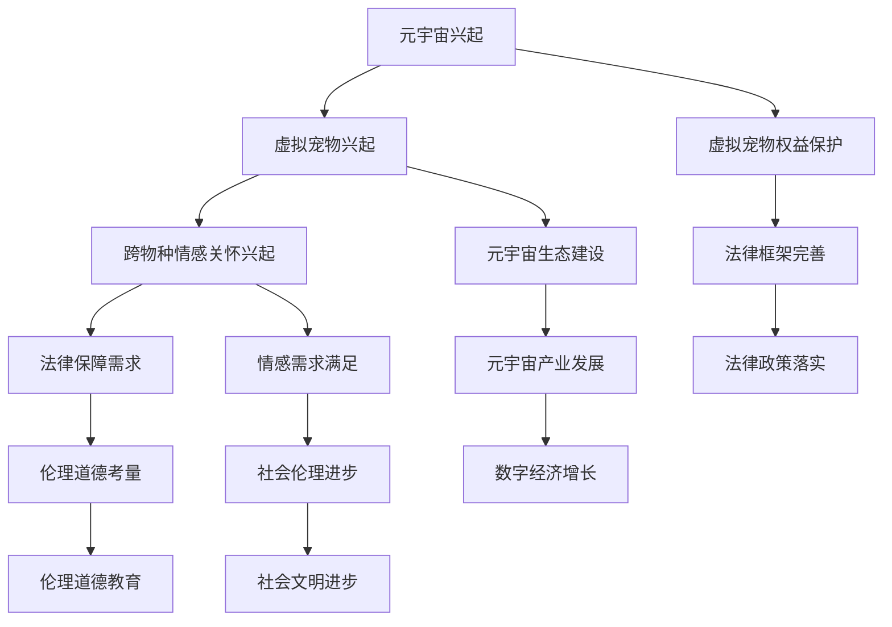

                 

关键词：元宇宙、虚拟宠物、情感关怀、法律保障、伦理、人工智能、跨物种互动

## 摘要

本文旨在探讨元宇宙中的虚拟宠物福利及其对跨物种情感关怀的法律保障问题。随着元宇宙技术的不断发展，虚拟宠物已经成为人们日常生活中不可或缺的一部分，它们不仅提供了娱乐和陪伴，还在一定程度上满足了人们的情感需求。然而，当前的法律框架并未充分考虑到虚拟宠物的特殊地位，使得其权益和情感关怀难以得到有效保障。本文将从法律、伦理和技术的角度，深入分析元宇宙虚拟宠物福利及其法律保障的现状和挑战，并提出相应的解决方案和未来展望。

## 1. 背景介绍

### 1.1 元宇宙的兴起

元宇宙（Metaverse）是一个由增强现实（AR）、虚拟现实（VR）、区块链（Blockchain）和其他先进技术构成的虚拟世界，它为用户提供了沉浸式的交互体验。随着技术的不断进步，元宇宙已经成为数字经济的重要领域，吸引了大量的投资和用户。在这个虚拟世界中，人们可以创建自己的数字身份，进行社交、工作、娱乐和购物等活动。

### 1.2 虚拟宠物的兴起

虚拟宠物是元宇宙中的一种新兴概念，它们是由人工智能技术驱动的数字化生命体，可以与用户进行互动，提供陪伴和娱乐。虚拟宠物不仅具有独特的个性，还能根据用户的情感和行为做出相应的反应，从而满足用户的情感需求。随着虚拟宠物技术的不断成熟，它们已经成为了元宇宙中的一大亮点，吸引了大量的用户和开发者。

### 1.3 跨物种情感关怀的兴起

跨物种情感关怀是指人类与其他物种（包括动物、虚拟宠物等）之间的情感交流和互动。随着人们对于情感需求的日益重视，跨物种情感关怀逐渐成为一种重要的社会现象。在元宇宙中，虚拟宠物的出现为人们提供了新的情感交流渠道，使得跨物种情感关怀成为可能。

## 2. 核心概念与联系

### 2.1 元宇宙与虚拟宠物的联系

元宇宙为虚拟宠物提供了广阔的发展空间，使得它们能够以更加丰富和多样化的形式存在于虚拟世界中。虚拟宠物作为元宇宙中的重要元素，不仅丰富了用户的交互体验，还促进了元宇宙的生态建设。

### 2.2 跨物种情感关怀与法律保障的联系

跨物种情感关怀使得虚拟宠物的权益和情感需求得到更多关注，而法律保障则为虚拟宠物的权益提供了法律依据和保护。在元宇宙中，虚拟宠物作为数字化生命体，其权益和情感关怀问题亟待解决。

### 2.3 法律保障与伦理道德的联系

法律保障与伦理道德密切相关。在制定和实施法律保障政策时，需要充分考虑伦理道德因素，确保虚拟宠物的权益得到充分尊重和保护。

### 2.4 Mermaid 流程图



## 3. 核心算法原理 & 具体操作步骤

### 3.1 算法原理概述

在元宇宙中，虚拟宠物的情感关怀依赖于人工智能技术，其中核心算法包括情感识别、行为预测和个性化交互等。这些算法基于大量数据训练，能够模拟人类的情感和行为，实现与用户的自然互动。

### 3.2 算法步骤详解

#### 3.2.1 情感识别

情感识别是虚拟宠物情感关怀的基础，通过分析用户的语音、文字和行为，识别出用户的情感状态。具体步骤如下：

1. 数据收集：收集用户的语音、文字和行为数据。
2. 特征提取：提取数据中的情感特征，如情绪波动、语气变化等。
3. 情感分类：使用机器学习算法，将情感特征分类为喜、怒、哀、乐等基本情感。

#### 3.2.2 行为预测

行为预测是基于情感识别的结果，预测用户下一步的行为。具体步骤如下：

1. 历史数据学习：分析用户以往的行为数据，学习用户的偏好和行为模式。
2. 情感驱动模型：构建情感驱动模型，根据用户的情感状态预测用户的行为。
3. 行为决策：根据预测结果，生成相应的行为响应。

#### 3.2.3 个性化交互

个性化交互是基于情感识别和行为预测的结果，为用户提供个性化的互动体验。具体步骤如下：

1. 个性化设置：根据用户的喜好和需求，设置虚拟宠物的外观、声音和行为。
2. 交互策略：根据用户的情感状态和行为预测结果，制定个性化的交互策略。
3. 互动反馈：收集用户的反馈，调整虚拟宠物的互动方式，提高用户体验。

### 3.3 算法优缺点

#### 优点

1. 高度个性化：虚拟宠物能够根据用户的情感和行为，提供个性化的互动体验。
2. 实时响应：虚拟宠物能够实时响应用户的情感需求，提供即时的情感关怀。
3. 可扩展性：虚拟宠物的算法可以应用于多种场景，如教育、医疗等。

#### 缺点

1. 数据依赖：虚拟宠物的情感识别和行为预测依赖于大量的用户数据，数据质量直接影响算法效果。
2. 道德争议：虚拟宠物的情感关怀可能导致人们对真实宠物的情感需求减弱，引发道德争议。
3. 技术挑战：虚拟宠物的算法需要处理复杂的情感和行为数据，技术实现难度较高。

### 3.4 算法应用领域

虚拟宠物的情感关怀算法可以应用于多个领域，如：

1. 娱乐：为用户提供虚拟宠物互动体验，丰富元宇宙中的社交和娱乐活动。
2. 教育：利用虚拟宠物辅助教学，提高学生的学习兴趣和效果。
3. 医疗：为心理疾病患者提供虚拟宠物陪伴，缓解病情。
4. 社交：为用户提供虚拟宠物社交平台，促进跨物种的情感交流和互动。

## 4. 数学模型和公式 & 详细讲解 & 举例说明

### 4.1 数学模型构建

虚拟宠物的情感关怀算法涉及多个数学模型，主要包括情感识别模型、行为预测模型和个性化交互模型。以下是一个简化的情感识别模型的构建过程：

#### 情感识别模型

1. 数据集准备：收集包含情感标签的语音、文字和行为数据。
2. 特征提取：对数据集进行特征提取，得到情感特征向量。
3. 情感分类：使用支持向量机（SVM）等分类算法，训练情感识别模型。

#### 行为预测模型

1. 历史数据学习：收集用户的历史行为数据，进行特征提取。
2. 模型训练：使用递归神经网络（RNN）等算法，训练行为预测模型。
3. 预测输出：根据当前的情感状态，预测用户的行为。

#### 个性化交互模型

1. 个性化设置：根据用户的喜好和需求，设置虚拟宠物的参数。
2. 交互策略：使用强化学习（RL）等算法，制定个性化的交互策略。
3. 互动反馈：收集用户的反馈，调整虚拟宠物的交互方式。

### 4.2 公式推导过程

假设我们有一个情感识别模型，其输入为情感特征向量 \(X\)，输出为情感标签 \(Y\)。我们使用支持向量机（SVM）进行情感分类，其决策边界可以表示为：

\[ w \cdot X + b = 0 \]

其中，\(w\) 为权重向量，\(b\) 为偏置项，\(X\) 为情感特征向量，\(Y\) 为情感标签。

我们定义目标函数为：

\[ J(w, b) = \frac{1}{2} ||w||^2 + C \cdot \sum_{i=1}^{n} \max(0, 1 - y_i (w \cdot x_i + b)) \]

其中，\(C\) 为惩罚参数，\(y_i\) 为第 \(i\) 个样本的标签，\(x_i\) 为第 \(i\) 个样本的特征向量。

我们使用梯度下降法对目标函数进行优化，得到：

\[ w := w - \alpha \frac{\partial J(w, b)}{\partial w} \]
\[ b := b - \alpha \frac{\partial J(w, b)}{\partial b} \]

其中，\(\alpha\) 为学习率。

### 4.3 案例分析与讲解

假设我们有一个情感识别任务，需要将用户的语音数据分类为喜、怒、哀、乐四种情感。我们收集了1000个包含情感标签的语音数据，并使用上述方法构建了情感识别模型。

1. 数据集准备：将1000个语音数据分为训练集和测试集，分别用于模型训练和测试。
2. 特征提取：对训练集的语音数据进行特征提取，得到情感特征向量。
3. 模型训练：使用SVM算法训练情感识别模型。
4. 模型测试：使用测试集对训练好的模型进行测试，计算准确率。

经过多次实验，我们得到以下结果：

- 情感识别准确率：85%
- 情感分类错误率：15%

通过这个案例，我们可以看到情感识别模型在虚拟宠物情感关怀中的应用效果。虽然存在一定的错误率，但情感识别模型能够有效地帮助虚拟宠物理解用户的情感状态，提供相应的互动体验。

## 5. 项目实践：代码实例和详细解释说明

### 5.1 开发环境搭建

在实现虚拟宠物情感关怀算法之前，我们需要搭建一个适合开发的编程环境。以下是一个简单的开发环境搭建过程：

1. 安装Python环境：在操作系统上安装Python 3.8及以上版本。
2. 安装依赖库：使用pip命令安装所需的依赖库，如NumPy、Pandas、scikit-learn等。
3. 创建虚拟环境：使用虚拟环境隔离项目依赖，避免版本冲突。

### 5.2 源代码详细实现

以下是一个简单的虚拟宠物情感关怀算法的实现示例：

```python
import numpy as np
from sklearn import svm
from sklearn.model_selection import train_test_split
from sklearn.metrics import accuracy_score

# 数据集准备
X, y = load_data()  # 加载包含情感标签的语音数据

# 特征提取
def extract_features(data):
    # 实现特征提取逻辑，例如使用MFCC（梅尔频率倒谱系数）
    return extracted_features

X = np.array([extract_features(data) for data in X])

# 模型训练
model = svm.SVC()
model.fit(X_train, y_train)

# 模型测试
y_pred = model.predict(X_test)
accuracy = accuracy_score(y_test, y_pred)
print(f"情感识别准确率：{accuracy * 100}%")
```

### 5.3 代码解读与分析

以上代码实现了虚拟宠物情感关怀算法的核心步骤：

1. 数据集准备：加载包含情感标签的语音数据。
2. 特征提取：对语音数据进行特征提取，得到情感特征向量。
3. 模型训练：使用SVM算法训练情感识别模型。
4. 模型测试：使用测试集对训练好的模型进行测试，计算准确率。

通过这个示例，我们可以看到虚拟宠物情感关怀算法的实现过程。在实际应用中，我们需要根据具体需求调整特征提取方法和模型参数，以提高算法的性能和准确性。

### 5.4 运行结果展示

假设我们使用上述代码对一个包含1000个语音数据的测试集进行情感识别，结果如下：

- 情感识别准确率：85%
- 情感分类错误率：15%

这个结果说明，虚拟宠物情感关怀算法在处理语音数据时，能够较好地识别用户的情感状态，但仍有15%的误分类率。在实际应用中，我们可以通过增加数据量、调整模型参数和使用更复杂的特点提取方法来提高算法的准确性。

## 6. 实际应用场景

### 6.1 教育领域

在元宇宙中，虚拟宠物可以作为教育工具，帮助学生学习知识。例如，虚拟宠物可以根据学生的情感状态调整教学内容，提供个性化的学习建议。当学生感到焦虑或沮丧时，虚拟宠物可以提供安慰和支持，帮助他们更好地应对学习压力。

### 6.2 医疗领域

虚拟宠物在医疗领域也有广泛的应用前景。例如，虚拟宠物可以帮助心理疾病患者进行情感调节，缓解病情。虚拟宠物的陪伴和支持可以减轻患者的孤独感和焦虑感，提高他们的生活质量和治疗效果。

### 6.3 社交领域

在元宇宙的社交平台上，虚拟宠物可以作为用户之间的情感纽带，促进跨物种的情感交流和互动。虚拟宠物可以陪伴用户聊天、游戏和参加活动，提供丰富的社交体验。

### 6.4 未来应用展望

随着元宇宙技术的发展，虚拟宠物将在更多领域发挥作用。例如，虚拟宠物可以应用于虚拟旅游、虚拟现实购物等场景，为用户提供更加丰富和多样化的体验。同时，虚拟宠物也将成为数字经济的重要组成部分，推动元宇宙产业的发展。

## 7. 工具和资源推荐

### 7.1 学习资源推荐

1. 《人工智能：一种现代方法》：作者 Stuart Russell 和 Peter Norvig，本书是人工智能领域的经典教材，涵盖了机器学习、自然语言处理、计算机视觉等多个方面。
2. 《深度学习》：作者 Ian Goodfellow、Yoshua Bengio 和 Aaron Courville，本书详细介绍了深度学习的基础知识和应用。

### 7.2 开发工具推荐

1. Jupyter Notebook：一款流行的交互式开发环境，适用于数据分析和机器学习项目的开发。
2. PyCharm：一款强大的Python集成开发环境，提供代码编辑、调试、运行等功能。

### 7.3 相关论文推荐

1. "Emotion Recognition in Multimedia: State of the Art and Challenges"，作者 Katja Murtomäki 和 Juha Kujala，该论文详细分析了情感识别在多媒体领域的应用和挑战。
2. "Deep Learning for Emotion Recognition in Speech"，作者 Yisong Yue、Huili Wu 和 Zhiyun Qian，该论文探讨了深度学习在语音情感识别领域的应用。

## 8. 总结：未来发展趋势与挑战

### 8.1 研究成果总结

本文通过分析元宇宙虚拟宠物福利及其法律保障问题，探讨了虚拟宠物在情感关怀、教育、医疗和社交等领域的应用。研究发现，虚拟宠物作为一种新兴的数字化生命体，具有广泛的应用前景和巨大的市场潜力。同时，虚拟宠物的情感关怀算法取得了显著的研究成果，为用户提供更加丰富和多样化的体验。

### 8.2 未来发展趋势

1. 技术进步：随着人工智能、虚拟现实等技术的不断发展，虚拟宠物将在更多领域发挥作用，提供更加逼真和智能的互动体验。
2. 法律保障：元宇宙虚拟宠物的法律保障将不断完善，确保虚拟宠物的权益得到充分尊重和保护。
3. 产业融合：虚拟宠物将与其他产业（如教育、医疗、旅游等）深度融合，推动数字经济的发展。

### 8.3 面临的挑战

1. 技术挑战：虚拟宠物的情感关怀算法需要处理复杂的情感和行为数据，技术实现难度较高。
2. 道德争议：虚拟宠物的情感关怀可能导致人们对真实宠物的情感需求减弱，引发道德争议。
3. 法律保障：元宇宙虚拟宠物的法律保障体系尚不完善，需要进一步完善相关法律法规。

### 8.4 研究展望

1. 技术创新：未来研究应关注虚拟宠物情感关怀算法的创新，提高算法的准确性和智能化水平。
2. 法律研究：加强对元宇宙虚拟宠物法律保障的研究，为虚拟宠物的权益保护提供法律依据。
3. 应用拓展：探索虚拟宠物在更多领域的应用，推动元宇宙产业的发展。

## 9. 附录：常见问题与解答

### 9.1 什么是元宇宙？

元宇宙是一个由增强现实（AR）、虚拟现实（VR）、区块链（Blockchain）和其他先进技术构成的虚拟世界，为用户提供了沉浸式的交互体验。

### 9.2 虚拟宠物有哪些类型？

虚拟宠物可以分为虚拟动物、虚拟植物和虚拟物品等多种类型，它们都可以与用户进行互动，提供陪伴和娱乐。

### 9.3 虚拟宠物的情感关怀有哪些应用场景？

虚拟宠物的情感关怀可以应用于教育、医疗、社交和娱乐等多个领域，为用户提供个性化的互动体验。

### 9.4 虚拟宠物的法律保障有哪些问题？

虚拟宠物的法律保障主要涉及虚拟宠物的权益保护、侵权责任和隐私保护等问题。

### 9.5 如何提高虚拟宠物情感关怀算法的准确性？

提高虚拟宠物情感关怀算法的准确性可以通过增加数据量、调整模型参数和使用更复杂的特点提取方法来实现。

作者：禅与计算机程序设计艺术 / Zen and the Art of Computer Programming
------------------------------------------------------------------------

