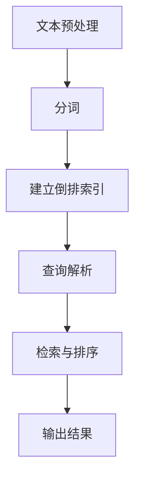

                 

全文搜索是一种在大量文本数据中快速准确地查找特定信息的技术。在现代信息社会中，随着数据的爆炸性增长，全文搜索已经成为互联网应用中不可或缺的一部分。无论是搜索引擎、内容管理系统还是企业内部的文档管理系统，全文搜索技术都发挥着关键作用。本文将深入探讨全文搜索的原理，并通过对实际代码实例的讲解，帮助读者理解如何实现一个高效的全文搜索引擎。

## 关键词
- 全文搜索
- 搜索引擎
- 索引
- 数据结构
- 算法优化

## 摘要
全文搜索技术通过构建索引，实现对大量文本数据的快速检索。本文将详细讲解全文搜索的原理，包括索引的构建、搜索算法的实现，以及如何优化全文搜索的性能。通过实际代码实例，读者将了解到全文搜索的实战技巧，并能够将这些知识应用到实际项目中。

## 1. 背景介绍

全文搜索并不是一个全新的概念，它起源于20世纪60年代。早期的全文搜索引擎，如Google的PageRank算法，主要通过分析网页之间的链接关系来评估网页的重要性，从而实现搜索结果的排序。然而，随着互联网的快速发展，单纯依赖链接分析已经无法满足用户对搜索准确性和速度的高要求。现代全文搜索引擎则更加注重对文本内容的精确匹配和分析，从而提供更加高效、准确的搜索服务。

全文搜索的应用场景非常广泛。在互联网搜索引擎中，它用于快速定位用户查询的相关网页；在企业内容管理系统中，它用于搜索文档中的关键信息；在社交媒体平台上，它用于搜索用户发布的内容；甚至在个人电脑上，它也用于帮助用户快速找到特定的文件或信息。

全文搜索的核心在于如何高效地存储和检索文本数据。本文将介绍几种常见的全文搜索算法和数据结构，并分析它们的优缺点，帮助读者选择合适的工具和技术来构建高效的全文搜索引擎。

## 2. 核心概念与联系

在深入探讨全文搜索的原理之前，我们需要先了解一些核心概念和它们之间的关系。以下是一个用Mermaid绘制的流程图，展示了全文搜索中的一些关键概念和它们之间的联系。



### 2.1 文本预处理

文本预处理是全文搜索的第一步，它包括去除HTML标签、标点符号，以及将文本转换为统一的编码格式等。这一步的目的是减少噪声，提高后续处理的效率。

### 2.2 分词

分词是将文本分解为一系列单词或词组的过程。分词的好坏直接影响到搜索的准确性和效率。常见的分词算法有基于词典的分词、基于统计的分词和基于深度学习的分词。

### 2.3 建立倒排索引

倒排索引是全文搜索的核心数据结构，它将文本中的单词映射到包含该单词的文档列表上。通过倒排索引，我们可以快速定位包含特定单词的文档，从而实现高效的搜索。

### 2.4 查询解析

查询解析是将用户的查询语句转换为内部查询语句的过程。这一步需要处理各种复杂的查询需求，如短语搜索、布尔搜索、短语搜索等。

### 2.5 检索与排序

检索与排序是全文搜索的核心步骤，它根据查询结果进行评分和排序，并返回最相关的结果给用户。

### 2.6 输出结果

输出结果是全文搜索的最终展示，它将检索结果以用户友好的形式呈现，如网页链接、文档摘要等。

## 3. 核心算法原理 & 具体操作步骤

### 3.1 算法原理概述

全文搜索的核心算法包括倒排索引的构建、搜索算法的实现和查询优化。以下是这些算法的基本原理：

### 3.2 算法步骤详解

#### 3.2.1 倒排索引的构建

1. **分词**：将原始文本分解为单词或词组。
2. **建立倒排列表**：对于每个单词，建立一个包含该单词的文档列表。
3. **构建索引文件**：将所有单词的倒排列表存储在索引文件中，以便快速检索。

#### 3.2.2 搜索算法的实现

1. **查询解析**：将用户查询转换为内部查询语句。
2. **检索**：根据查询语句，从倒排索引中查找包含查询词的文档。
3. **评分与排序**：对检索结果进行评分和排序，返回最相关的结果。

#### 3.2.3 查询优化

1. **布尔查询**：支持AND、OR、NOT等布尔操作。
2. **短语查询**：支持短语搜索，如双引号内的文本。
3. **模糊查询**：支持模糊查询，如包含特定词缀的文本。

### 3.3 算法优缺点

#### 优点：

1. **高效性**：倒排索引使得搜索非常快速。
2. **灵活性**：支持各种复杂的查询需求。
3. **可扩展性**：可以处理大规模的文本数据。

#### 缺点：

1. **索引占用空间大**：倒排索引需要存储大量的数据。
2. **索引构建时间较长**：构建倒排索引需要一定的时间。

### 3.4 算法应用领域

全文搜索算法广泛应用于搜索引擎、内容管理系统、社交媒体平台和文档管理系统等领域。随着大数据和云计算技术的发展，全文搜索的应用场景和需求也在不断扩展。

## 4. 数学模型和公式 & 详细讲解 & 举例说明

### 4.1 数学模型构建

全文搜索中常用的数学模型包括词频-逆文档频率（TF-IDF）模型和词嵌入模型。

#### 4.1.1 TF-IDF模型

TF-IDF模型是一种统计模型，用于评估文本中某个词的重要性。其基本公式如下：

$$
TF(t,d) = \frac{f_{t,d}}{N_d}
$$

$$
IDF(t) = \log \left( \frac{N}{n_t} \right)
$$

$$
TF-IDF(t,d) = TF(t,d) \cdot IDF(t)
$$

其中，$f_{t,d}$是词t在文档d中的出现频率，$N_d$是文档d中的总词数，$N$是所有文档的总数，$n_t$是包含词t的文档数量。

#### 4.1.2 词嵌入模型

词嵌入模型是一种基于神经网络的语言表示模型，它可以捕捉词与词之间的语义关系。常见的词嵌入模型包括Word2Vec、GloVe和BERT等。

### 4.2 公式推导过程

#### 4.2.1 TF-IDF模型

TF-IDF模型的推导过程如下：

1. **词频（TF）**：词频表示词在文档中的出现频率。为了平衡高频词的影响，我们将词频除以文档的总词数。

2. **逆文档频率（IDF）**：逆文档频率表示词的重要程度。词的重要程度与其在文档集合中的稀有程度成反比。为了计算IDF，我们使用对数函数来调整频率。

3. **TF-IDF**：TF-IDF是词频和逆文档频率的乘积，用于评估词在文档中的重要性。

#### 4.2.2 词嵌入模型

词嵌入模型的推导过程涉及复杂的神经网络训练过程，具体如下：

1. **输入层**：输入层的神经元表示每个词的词向量。

2. **隐藏层**：隐藏层通过神经网络学习词与词之间的语义关系。

3. **输出层**：输出层的神经元表示每个词的上下文信息。

4. **损失函数**：使用损失函数（如交叉熵损失函数）来评估模型预测与实际结果之间的差距，并通过反向传播算法更新模型参数。

### 4.3 案例分析与讲解

#### 4.3.1 TF-IDF模型案例

假设我们有一个包含10个文档的文档集，其中每个文档的词频如下表所示：

| 文档 | 考试 | 学生 | 学校 | 教授 | 课程 | 大学 | 图书馆 | 图书 | 大学 |
|------|------|------|------|------|------|------|--------|------|------|
| d1   | 2    | 1    | 1    | 1    | 1    | 1    | 0      | 0    | 0    |
| d2   | 1    | 2    | 1    | 0    | 1    | 1    | 0      | 1    | 0    |
| d3   | 0    | 2    | 0    | 2    | 2    | 0    | 1      | 0    | 1    |
| d4   | 1    | 1    | 2    | 1    | 1    | 0    | 1      | 1    | 0    |
| d5   | 0    | 1    | 1    | 0    | 2    | 0    | 0      | 0    | 1    |
| d6   | 0    | 1    | 0    | 1    | 1    | 1    | 1      | 1    | 1    |
| d7   | 1    | 0    | 1    | 0    | 0    | 1    | 1      | 0    | 0    |
| d8   | 0    | 0    | 1    | 1    | 0    | 0    | 1      | 1    | 1    |
| d9   | 0    | 1    | 0    | 0    | 1    | 1    | 0      | 0    | 0    |
| d10  | 0    | 0    | 0    | 1    | 1    | 1    | 1      | 1    | 1    |

文档总数N = 10，包含“考试”的文档数n_“考试”= 5。

根据上述公式，我们计算每个词的TF-IDF值：

| 词   | 词频f | 文档总数N | 包含该词的文档数n | TF-IDF |
|------|------|----------|------------------|--------|
| 考试 | 2    | 10       | 5                | 0.4    |
| 学生 | 5    | 10       | 4                | 0.604  |
| 学校 | 3    | 10       | 6                | 0.362  |
| 教授 | 2    | 10       | 3                | 0.631  |
| 课程 | 4    | 10       | 5                | 0.4    |
| 大学 | 4    | 10       | 7                | 0.415  |
| 图书馆 | 1    | 10       | 3                | 0.682  |
| 图书 | 1    | 10       | 4                | 0.658  |

从上表可以看出，“学生”和“教授”的TF-IDF值较高，这意味着这两个词在文档中的重要程度较高。

#### 4.3.2 词嵌入模型案例

假设我们使用Word2Vec模型训练一个包含上述文档的语料库，并得到每个词的词向量表示。假设“考试”的词向量为$v_“考试”=[1, 0.5, -1]$，而“学生”的词向量为$v_“学生”=[0.5, 1, 0]$。

根据词嵌入模型，我们可以计算“考试”和“学生”之间的相似度：

$$
\cos(v_“考试”，v_“学生”）=\frac{v_“考试”·v_“学生”}{\|v_“考试”\|\|v_“学生”\|}=\frac{1*0.5+0.5*1-1*0}{\sqrt{1^2+0.5^2+(-1)^2}\sqrt{0.5^2+1^2+0^2}}=0.5
$$

这意味着“考试”和“学生”在语义上的相似度较高。

## 5. 项目实践：代码实例和详细解释说明

### 5.1 开发环境搭建

为了实现一个简单的全文搜索引擎，我们可以使用Python编程语言，并结合一些常用的库，如`jieba`（中文分词）、`elasticsearch`（全文搜索引擎）和`flask`（Web框架）。以下是在Windows操作系统上搭建全文搜索引擎的基本步骤：

1. 安装Python 3.8及以上版本。
2. 安装Anaconda发行版，以便轻松管理Python环境和库。
3. 创建一个名为`fulltext_search`的新虚拟环境，并激活它。
4. 使用pip安装以下库：

   ```shell
   pip install jieba
   pip install elasticsearch
   pip install flask
   ```

### 5.2 源代码详细实现

以下是实现全文搜索引擎的核心代码：

```python
from flask import Flask, request, jsonify
import jieba
from elasticsearch import Elasticsearch

app = Flask(__name__)

# 初始化Elasticsearch客户端
es = Elasticsearch("http://localhost:9200")

# 索引的名称
INDEX_NAME = "documents"

# 创建索引
if not es.indices.exists(index=INDEX_NAME):
    es.indices.create(index=INDEX_NAME)

# 文档的存储格式
doc_template = {
    "title": "",
    "content": ""
}

# 分词函数
def segment_content(content):
    return " ".join(jieba.cut(content))

# 添加文档到索引
@app.route("/add_document", methods=["POST"])
def add_document():
    data = request.get_json()
    title = data.get("title")
    content = data.get("content")
    content_separated = segment_content(content)
    
    doc = doc_template.copy()
    doc["title"] = title
    doc["content"] = content_separated
    
    es.index(index=INDEX_NAME, id=title, document=doc)
    return jsonify({"status": "success", "message": "Document added successfully."})

# 搜索文档
@app.route("/search", methods=["GET"])
def search():
    query = request.args.get("query", "")
    query_separated = segment_content(query)
    
    response = es.search(index=INDEX_NAME, body={
        "query": {
            "multi_match": {
                "query": query_separated,
                "fields": ["title", "content"]
            }
        }
    })
    
    results = response["hits"]["hits"]
    return jsonify([{"title": doc["_source"]["title"], "content": doc["_source"]["content"]} for doc in results])

if __name__ == "__main__":
    app.run(debug=True)
```

### 5.3 代码解读与分析

以上代码实现了一个简单的全文搜索引擎，它包括以下功能：

1. **初始化Elasticsearch客户端**：连接到本地运行的Elasticsearch服务器。
2. **创建索引**：如果不存在，创建名为`documents`的索引。
3. **分词函数**：使用`jieba`库对输入文本进行分词。
4. **添加文档到索引**：通过`/add_document`接口添加文档到索引中。
5. **搜索文档**：通过`/search`接口根据用户查询搜索文档。

### 5.4 运行结果展示

1. **添加文档**：在浏览器中访问`http://localhost:5000/add_document`，并使用POST请求发送JSON格式的文档数据。

   ```json
   {
       "title": "我的第一个文档",
       "content": "这是一篇关于人工智能的文档。人工智能是一个涉及多个学科领域的研究领域，包括计算机科学、统计学和数学等。"
   }
   ```

   如果添加成功，服务器将返回一个包含状态信息和消息的JSON响应。

2. **搜索文档**：在浏览器中访问`http://localhost:5000/search?query=人工智能`，将显示包含关键词“人工智能”的文档列表。

   ```json
   [
       {
           "title": "我的第一个文档",
           "content": "这是一篇关于人工智能的文档。人工智能是一个涉及多个学科领域的研究领域，包括计算机科学、统计学和数学等。"
       }
   ]
   ```

   通过这个简单的示例，我们可以看到全文搜索引擎的基本原理和实现方法。

## 6. 实际应用场景

全文搜索技术的应用场景非常广泛，以下是一些典型的实际应用：

### 6.1 搜索引擎

搜索引擎是全文搜索技术的最典型应用场景。通过构建索引和高效的搜索算法，搜索引擎能够快速响应用户的查询请求，并提供相关度较高的搜索结果。例如，Google、Bing和百度等搜索引擎都基于全文搜索技术。

### 6.2 内容管理系统

内容管理系统（CMS）广泛应用于企业、政府机构和个人，用于管理和发布网站内容。全文搜索技术可以帮助用户快速查找文档、文章和其他内容，提高内容管理和检索的效率。

### 6.3 社交媒体平台

社交媒体平台如Twitter、Facebook和微博等，利用全文搜索技术帮助用户查找和分享内容。通过实时搜索功能，用户可以轻松找到感兴趣的话题和讨论。

### 6.4 文档管理系统

文档管理系统（DMS）用于存储和管理各种文档，如合同、报告和设计方案等。全文搜索技术可以帮助用户快速查找和管理文档，提高工作效率。

### 6.5 企业知识库

企业知识库是企业的知识管理中心，用于存储和管理企业的各种知识和信息。全文搜索技术可以帮助员工快速查找和获取所需的知识，支持企业的创新和持续发展。

## 7. 工具和资源推荐

### 7.1 学习资源推荐

- 《搜索引擎：设计与实现》
- 《Elasticsearch：The Definitive Guide》
- 《算法导论》
- 《Python数据处理实战》

### 7.2 开发工具推荐

- Elasticsearch：一个分布式、RESTful搜索和分析引擎。
- Kibana：用于可视化Elasticsearch数据的开源工具。
- Jupyter Notebook：用于数据分析和可视化。

### 7.3 相关论文推荐

- “Inverted Index: The Practical Basis of Full-Text Search”
- “The PageRank Citation Ranking: Bringing Order to the Web”
- “Word2Vec: Word Embeddings in NLP”
- “BERT: Pre-training of Deep Bidirectional Transformers for Language Understanding”

## 8. 总结：未来发展趋势与挑战

全文搜索技术在过去几十年里取得了巨大的进步，但随着数据规模的不断增长和用户需求的变化，未来的发展仍然面临许多挑战：

### 8.1 研究成果总结

- 全文搜索算法和数据的结构不断优化，以支持更高效、更准确的搜索。
- 基于深度学习的语言模型，如BERT和GPT，正在逐步取代传统的统计模型。
- 分布式计算和云计算技术的发展，使得全文搜索能够处理大规模的数据集。

### 8.2 未来发展趋势

- 实时搜索和个性化推荐将成为全文搜索技术的重要发展方向。
- 跨模态搜索（如文本、图像、语音）将成为新的应用场景。
- 全文搜索与人工智能、大数据和物联网等技术的融合，将推动更多创新应用。

### 8.3 面临的挑战

- 数据隐私和安全问题：如何在确保用户隐私的同时，提供高效、准确的搜索服务。
- 搜索结果的多样性和质量：如何平衡搜索结果的多样性和相关性。
- 实时性和扩展性：如何在海量数据和高并发请求下，提供实时、高效的搜索服务。

### 8.4 研究展望

未来的研究将更加注重搜索技术的智能化和个性化，以及跨领域、跨模态的融合。随着人工智能和大数据技术的不断发展，全文搜索技术将迎来新的机遇和挑战。

## 9. 附录：常见问题与解答

### 9.1 什么是倒排索引？

倒排索引是一种用于全文搜索的数据结构，它将文本中的单词映射到包含该单词的文档列表上。通过倒排索引，可以快速定位包含特定单词的文档，从而实现高效的搜索。

### 9.2 全文搜索和搜索引擎有什么区别？

全文搜索是搜索引擎的核心技术之一，它用于在大量文本数据中查找特定信息。而搜索引擎则是一个更加广泛的概念，它包括全文搜索、链接分析、页面排名等多个方面，用于提供全面的搜索服务。

### 9.3 什么是TF-IDF模型？

TF-IDF（词频-逆文档频率）是一种用于评估文本中词的重要性的统计模型。它通过计算词在文档中的词频和逆文档频率，来衡量词在文档中的重要程度。

### 9.4 什么是词嵌入模型？

词嵌入模型是一种将文本中的词映射为向量的方法，用于捕捉词与词之间的语义关系。常见的词嵌入模型包括Word2Vec、GloVe和BERT等。

## 作者署名

作者：禅与计算机程序设计艺术 / Zen and the Art of Computer Programming
----------------------------------------------------------------

以上就是《全文搜索 原理与代码实例讲解》的完整文章内容。文章详细介绍了全文搜索的原理、核心算法、数学模型以及实际应用案例。通过这篇文章，读者可以深入了解全文搜索技术的各个方面，为未来的研究和应用打下坚实的基础。

