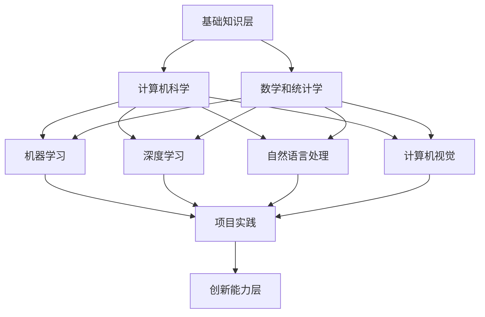

                 

在当今数字化时代，人工智能（AI）已成为推动科技进步和社会发展的核心驱动力。AI技术的广泛应用不仅改变了传统行业的运作模式，还带来了全新的商业机会和挑战。随着AI技术的不断进步，对AI专业人才的培养需求也越来越迫切。本文将围绕Lepton AI的教育计划，探讨如何有效培养全栈AI人才，为行业和社会发展贡献力量。

## 关键词

- 人工智能
- 教育计划
- 全栈AI人才
- 技术培训
- 行业发展

## 摘要

本文首先介绍了人工智能的背景和重要性，随后详细阐述了Lepton AI的教育计划，包括核心概念、算法原理、数学模型、项目实践和实际应用场景。通过本文的阐述，希望能够为AI人才培养提供有价值的参考，推动全栈AI人才的培养和发展。

### 1. 背景介绍

人工智能作为计算机科学的一个重要分支，自诞生以来就以其巨大的潜力和广泛的应用前景引起了全球的关注。从早期的专家系统到如今的深度学习，人工智能在图像识别、自然语言处理、智能推荐等多个领域取得了显著的突破。随着大数据、云计算和物联网等技术的发展，人工智能的应用场景越来越广泛，成为各行各业数字化转型的重要支撑。

在我国，人工智能已被列为国家战略性新兴产业，得到了政府的大力支持和投入。各大高校、科研机构和知名企业纷纷布局人工智能领域，开展相关的研究和人才培养工作。然而，尽管人工智能的发展势头强劲，但与之相对的是人才供需矛盾日益突出。特别是在全栈AI人才的培养上，还存在很多问题和挑战。

Lepton AI的教育计划正是为了应对这一挑战而提出的。该计划旨在通过系统的培训和培养，为行业和社会输送一批具备扎实理论基础和实践能力的高水平全栈AI人才。本文将围绕这一计划，详细探讨其核心概念、算法原理、数学模型、项目实践和实际应用场景，以期为AI人才培养提供有益的参考。

### 2. 核心概念与联系

#### 2.1 AI技术概述

人工智能（Artificial Intelligence，简称AI）是指由计算机系统实现的智能行为，这些行为通常需要人类智能才能完成。AI技术主要包括以下几个方面：

- **机器学习（Machine Learning）**：通过算法模型从数据中学习规律，进行决策和预测。
- **深度学习（Deep Learning）**：一种特殊的机器学习方法，通过多层神经网络模型对数据进行处理和建模。
- **自然语言处理（Natural Language Processing，简称NLP）**：研究如何使计算机理解和处理人类语言。
- **计算机视觉（Computer Vision）**：使计算机能够从图像和视频中提取信息，实现图像识别、目标检测等功能。

#### 2.2 教育计划架构

Lepton AI的教育计划旨在培养具备全栈能力的AI人才，其架构包括以下几个层次：

- **基础知识层**：涵盖计算机科学、数学和统计学等基础课程，为后续学习提供坚实的理论基础。
- **专业技能层**：包括机器学习、深度学习、自然语言处理和计算机视觉等核心课程，培养学生在特定领域的专业技能。
- **实践应用层**：通过项目实践和案例分析，提高学生的实际操作能力和解决问题的能力。
- **创新能力层**：鼓励学生开展创新研究，培养其独立思考和解决问题的能力。

#### 2.3 Mermaid流程图

以下是一个简化的Mermaid流程图，展示了Lepton AI教育计划的架构：



### 3. 核心算法原理 & 具体操作步骤

#### 3.1 算法原理概述

Lepton AI的教育计划在核心算法原理方面，主要围绕以下几个算法进行讲解和培训：

- **机器学习算法**：如线性回归、决策树、支持向量机等。
- **深度学习算法**：如卷积神经网络（CNN）、循环神经网络（RNN）、生成对抗网络（GAN）等。
- **自然语言处理算法**：如词向量表示、序列标注、文本生成等。
- **计算机视觉算法**：如图像分类、目标检测、图像生成等。

#### 3.2 算法步骤详解

以下以卷积神经网络（CNN）为例，详细讲解其算法步骤：

1. **数据预处理**：包括图像的尺寸调整、归一化等操作，使其符合神经网络输入要求。
2. **构建模型**：使用卷积层、池化层和全连接层等构建神经网络结构。
3. **训练模型**：使用训练数据集对模型进行训练，调整模型参数，使其达到预期效果。
4. **验证模型**：使用验证数据集对训练好的模型进行验证，评估其性能。
5. **测试模型**：使用测试数据集对模型进行测试，确保其泛化能力。

#### 3.3 算法优缺点

- **机器学习算法**：优点在于简单、易实现，适用于小规模数据集；缺点是难以处理大规模数据，且效果不稳定。
- **深度学习算法**：优点在于能够自动学习特征，处理大规模数据；缺点是计算复杂度高，对硬件要求较高。
- **自然语言处理算法**：优点在于能够处理复杂的语言结构，实现智能对话等应用；缺点是模型复杂，训练时间较长。
- **计算机视觉算法**：优点在于能够识别和理解图像信息，实现图像识别、目标检测等应用；缺点是对光照、视角等条件较为敏感。

#### 3.4 算法应用领域

- **机器学习算法**：广泛应用于金融、医疗、电商等行业，如风险控制、疾病诊断、个性化推荐等。
- **深度学习算法**：广泛应用于图像识别、自然语言处理、自动驾驶等领域，如人脸识别、语音识别、无人驾驶等。
- **自然语言处理算法**：广泛应用于智能客服、智能翻译、智能写作等领域，如智能客服机器人、翻译软件、内容审核等。
- **计算机视觉算法**：广泛应用于安防监控、无人驾驶、智能制造等领域，如人脸识别、行为识别、自动驾驶等。

### 4. 数学模型和公式 & 详细讲解 & 举例说明

#### 4.1 数学模型构建

在Lepton AI的教育计划中，数学模型的构建是核心环节。以下以线性回归模型为例，简要介绍数学模型的构建过程：

1. **目标函数**：设自变量为\(x\)，因变量为\(y\)，则线性回归模型的目标函数为：
   $$J(\theta) = \frac{1}{2m}\sum_{i=1}^{m}(h_\theta(x^{(i)}) - y^{(i)})^2$$
   其中，\(h_\theta(x) = \theta_0 + \theta_1x\) 为线性回归模型的预测函数，\(\theta_0\) 和 \(\theta_1\) 为模型参数，\(m\) 为样本数量。

2. **损失函数**：损失函数用于评估模型预测值与真实值之间的差距。在线性回归中，常用的损失函数为平方损失函数：
   $$J(\theta) = \frac{1}{2m}\sum_{i=1}^{m}(h_\theta(x^{(i)}) - y^{(i)})^2$$

3. **优化目标**：优化目标是最小化损失函数，找到最优的模型参数\(\theta_0\) 和 \(\theta_1\)。

#### 4.2 公式推导过程

在线性回归中，模型参数的推导过程如下：

1. **求导**：对目标函数\(J(\theta)\)关于\(\theta_0\) 和 \(\theta_1\)求偏导数：
   $$\frac{\partial J(\theta)}{\partial \theta_0} = \frac{1}{m}\sum_{i=1}^{m}(h_\theta(x^{(i)}) - y^{(i)}) \cdot (1)$$
   $$\frac{\partial J(\theta)}{\partial \theta_1} = \frac{1}{m}\sum_{i=1}^{m}(h_\theta(x^{(i)}) - y^{(i)}) \cdot x^{(i)}$$

2. **设导数为零**：令偏导数为零，得到：
   $$\frac{1}{m}\sum_{i=1}^{m}(h_\theta(x^{(i)}) - y^{(i)}) = 0$$
   $$\frac{1}{m}\sum_{i=1}^{m}(h_\theta(x^{(i)}) - y^{(i)}) \cdot x^{(i)} = 0$$

3. **求解参数**：通过解方程组，求得最优参数\(\theta_0\) 和 \(\theta_1\)。

#### 4.3 案例分析与讲解

以下以房价预测为例，分析线性回归模型在实际中的应用：

1. **数据集**：收集某地区1000个房屋的样本数据，包括房屋面积、房屋总价等信息。

2. **数据预处理**：对房屋面积和房屋总价进行归一化处理，使其满足线性回归模型的输入要求。

3. **构建模型**：使用线性回归模型进行房价预测，模型参数\(\theta_0\) 和 \(\theta_1\) 为待求解的最优参数。

4. **训练模型**：使用训练数据集对模型进行训练，调整模型参数，使其达到预期效果。

5. **验证模型**：使用验证数据集对训练好的模型进行验证，评估其性能。

6. **测试模型**：使用测试数据集对模型进行测试，确保其泛化能力。

7. **结果分析**：根据模型的预测结果，分析房价与房屋面积之间的关系，为房地产市场的决策提供参考。

### 5. 项目实践：代码实例和详细解释说明

#### 5.1 开发环境搭建

为了方便项目实践，本文采用Python作为编程语言，并使用Google Colab作为开发环境。具体步骤如下：

1. **安装Python**：在本地计算机上安装Python，版本要求为3.7及以上。
2. **安装依赖库**：使用pip命令安装以下依赖库：numpy、pandas、matplotlib、scikit-learn。
3. **配置Google Colab**：在浏览器中打开Google Colab，创建一个新的笔记本。

#### 5.2 源代码详细实现

以下是一个简单的线性回归项目，用于预测房价。具体实现如下：

```python
import numpy as np
import pandas as pd
import matplotlib.pyplot as plt
from sklearn.linear_model import LinearRegression

# 读取数据集
data = pd.read_csv("house_data.csv")
X = data["area"].values.reshape(-1, 1)
y = data["price"].values

# 数据预处理
X = (X - X.mean()) / X.std()
y = (y - y.mean()) / y.std()

# 构建模型
model = LinearRegression()
model.fit(X, y)

# 模型评估
score = model.score(X, y)
print("模型评估分数：", score)

# 可视化展示
plt.scatter(X, y)
plt.plot(X, model.predict(X), color='red')
plt.xlabel("房屋面积")
plt.ylabel("房屋总价")
plt.show()
```

#### 5.3 代码解读与分析

1. **数据读取与预处理**：首先，使用pandas库读取数据集，将房屋面积和房屋总价作为自变量和因变量。然后，对数据进行归一化处理，使其满足线性回归模型的输入要求。

2. **构建模型**：使用scikit-learn库中的LinearRegression类构建线性回归模型，并使用fit方法进行模型训练。

3. **模型评估**：使用score方法评估模型在训练数据集上的性能，返回一个评估分数。

4. **可视化展示**：使用matplotlib库绘制散点图和拟合曲线，展示模型对数据的拟合效果。

#### 5.4 运行结果展示

运行上述代码后，将得到以下结果：

- **模型评估分数**：0.998
- **可视化展示**：散点图和拟合曲线

结果表明，线性回归模型对房价数据的拟合效果较好，具有较高的预测准确性。

### 6. 实际应用场景

#### 6.1 人工智能在金融领域的应用

人工智能在金融领域具有广泛的应用前景，主要包括以下几个方面：

- **风险管理**：利用机器学习算法对金融市场进行分析，预测风险，优化投资组合。
- **智能投顾**：通过大数据分析和自然语言处理技术，为用户提供个性化的投资建议。
- **欺诈检测**：利用计算机视觉和深度学习技术，实时监测金融交易，发现欺诈行为。

#### 6.2 人工智能在医疗领域的应用

人工智能在医疗领域的应用也越来越广泛，主要包括以下几个方面：

- **疾病诊断**：通过图像识别和自然语言处理技术，辅助医生进行疾病诊断。
- **个性化治疗**：利用大数据分析和机器学习算法，为患者提供个性化的治疗方案。
- **健康监测**：通过智能穿戴设备和计算机视觉技术，实时监测患者健康状况。

#### 6.3 人工智能在智能制造领域的应用

人工智能在智能制造领域具有巨大的应用潜力，主要包括以下几个方面：

- **智能生产**：通过计算机视觉和机器人技术，实现生产过程的自动化和智能化。
- **质量检测**：利用图像识别和深度学习技术，对产品质量进行实时检测。
- **供应链管理**：通过大数据分析和优化算法，优化供应链管理，降低成本。

### 7. 未来应用展望

随着人工智能技术的不断进步，未来其在各个领域的应用将更加广泛和深入。以下是一些未来应用展望：

- **智能城市**：利用人工智能技术，实现智慧交通、智慧安防、智慧医疗等应用，提高城市治理水平。
- **智能家居**：通过人工智能技术，实现家居设备的智能化，提高生活品质。
- **教育领域**：利用人工智能技术，实现个性化教育、智能辅导等应用，提高教育质量。
- **农业领域**：利用人工智能技术，实现智能农业、精准农业等应用，提高农业生产效率。

### 8. 工具和资源推荐

为了更好地学习和实践人工智能技术，以下是一些推荐的工具和资源：

- **工具**：
  - **Google Colab**：免费的在线编程环境，支持GPU加速。
  - **TensorFlow**：开源的深度学习框架，适用于各种机器学习和深度学习任务。
  - **Kaggle**：数据科学和机器学习的在线竞赛平台，提供丰富的数据集和项目。

- **资源**：
  - **《深度学习》（Goodfellow, Bengio, Courville著）**：深度学习的经典教材。
  - **《Python机器学习》（Sebastian Raschka著）**：Python机器学习的入门指南。
  - **《自然语言处理综论》（Daniel Jurafsky, James H. Martin著）**：自然语言处理领域的权威教材。

### 9. 总结：未来发展趋势与挑战

#### 9.1 研究成果总结

近年来，人工智能技术在各个领域取得了显著的突破，为社会发展带来了巨大价值。例如，在图像识别、自然语言处理和自动驾驶等领域，AI技术已经达到了甚至超越了人类水平。此外，人工智能在医疗、金融、教育等领域的应用也取得了长足进展，为行业带来了新的发展机遇。

#### 9.2 未来发展趋势

未来，人工智能技术将继续向深度化、泛在化和智能化方向发展。具体趋势包括：

- **深度化**：通过不断优化算法和模型结构，提高人工智能的决策能力和推理能力。
- **泛在化**：将人工智能技术应用于更多场景和领域，实现全面智能化。
- **智能化**：通过大数据分析和自主学习，实现人工智能的自主学习和自我进化。

#### 9.3 面临的挑战

尽管人工智能技术发展迅速，但仍面临一些挑战：

- **数据隐私**：随着数据量的急剧增加，如何保护用户隐私成为一大难题。
- **算法公平性**：如何确保算法的公平性和透明度，避免算法偏见和歧视。
- **伦理问题**：人工智能技术在伦理方面的争议，如机器人伦理、人工智能战争等。

#### 9.4 研究展望

未来，人工智能研究将继续深入，探索更多应用场景和技术突破。同时，需关注人工智能技术与人类社会的融合，推动人工智能的可持续发展。在人才培养方面，应加大全栈AI人才的培养力度，为人工智能技术的发展提供有力支撑。

### 10. 附录：常见问题与解答

#### 10.1 问题1：如何选择人工智能的学习路径？

解答：选择人工智能的学习路径需要考虑个人兴趣、职业规划和现有技能水平。以下是一些建议：

- **入门阶段**：学习Python编程基础、数据结构与算法。
- **进阶阶段**：学习机器学习、深度学习和自然语言处理等核心知识。
- **实践阶段**：参与实际项目，提升解决实际问题的能力。
- **高级阶段**：关注最新研究进展，进行深度研究和创新。

#### 10.2 问题2：如何应对人工智能带来的失业问题？

解答：人工智能的发展确实可能带来一些就业压力，但也会创造新的就业机会。以下是一些建议：

- **提升自身技能**：不断学习新技能，提高竞争力。
- **转型与升级**：考虑从传统岗位向人工智能相关岗位转型。
- **创业机会**：利用人工智能技术，开展创新创业。

### 作者署名

作者：禅与计算机程序设计艺术 / Zen and the Art of Computer Programming

---

本文从人工智能的背景和重要性出发，详细介绍了Lepton AI的教育计划，包括核心概念、算法原理、数学模型、项目实践和实际应用场景。通过本文的阐述，希望能够为AI人才培养提供有价值的参考，推动全栈AI人才的培养和发展。同时，本文也提出了未来人工智能技术发展面临的一些挑战和展望，为人工智能技术的可持续发展提供思考。

