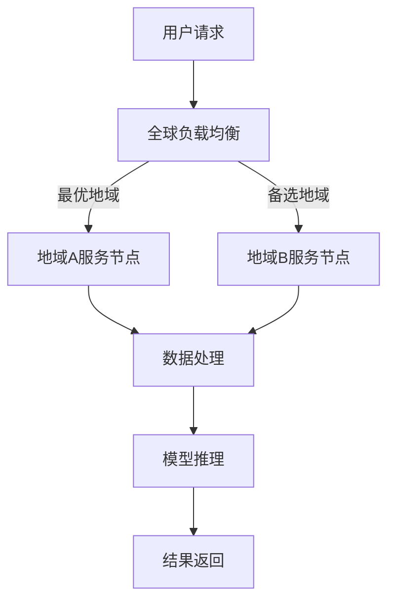

                 

## 1. 背景介绍

随着全球化的不断深入，越来越多的企业开始意识到AI（人工智能）在提高业务效率、优化决策和创新产品方面的巨大潜力。然而，AI服务的部署并非一蹴而就。特别是在全球化背景下，如何实现AI服务的多地域部署，保障其稳定性、安全性和高性能，成为企业面临的一大挑战。

本文旨在探讨Lepton AI如何在全球化背景下实现高效的多地域部署。通过详细分析其核心概念、算法原理、数学模型、实践案例以及未来应用场景，我们将全面解析Lepton AI在全球化AI服务部署中的优势和实践方法。

## 2. 核心概念与联系

### 2.1. AI服务的多地域部署

AI服务的多地域部署指的是将AI模型、算法和数据处理能力分布在不同地理位置的数据中心或云服务中，以实现服务的全球化交付。这一概念包括以下几个方面：

- **数据同步**：确保不同地域的数据保持一致性，避免因数据不同步导致的错误决策。

- **计算能力分布**：根据不同地域的业务需求和数据量，合理分配计算资源，提高服务响应速度。

- **网络延迟优化**：通过优化网络架构和传输协议，降低跨地域数据传输的延迟，提升用户体验。

- **安全性保障**：确保数据在传输和存储过程中的安全性，符合不同地区的法律法规。

### 2.2. Lepton AI的核心概念

Lepton AI是一种基于深度学习的AI平台，具备以下核心概念：

- **模型训练与优化**：通过海量数据训练，优化AI模型，提高识别准确率和决策能力。

- **分布式计算**：利用分布式计算技术，实现模型的快速训练和推理。

- **容器化部署**：通过容器技术，简化AI服务的部署和运维，提高系统可伸缩性。

- **API接口**：提供统一的API接口，方便业务系统快速集成和调用AI服务。

### 2.3. 多地域部署的架构

为了实现多地域部署，Lepton AI采用了以下架构：

- **全球负载均衡**：通过全球负载均衡器，智能分发请求到最优地域的服务节点。

- **分布式数据库**：采用分布式数据库技术，实现数据的横向扩展和地域隔离。

- **容器编排**：利用容器编排工具，如Kubernetes，实现服务节点的自动化部署和管理。

- **网络隔离与加密**：通过VPC（虚拟私有云）和VPN（虚拟专用网络），实现不同地域之间的安全隔离和数据加密传输。

### 2.4. Mermaid 流程图

下面是一个简化的Mermaid流程图，展示了Lepton AI的多地域部署架构：



## 3. 核心算法原理 & 具体操作步骤

### 3.1. 算法原理概述

Lepton AI的多地域部署核心算法包括以下几个方面：

- **数据同步算法**：通过分布式数据库技术，实现不同地域数据的一致性同步。

- **负载均衡算法**：利用全球负载均衡器，根据网络延迟、服务节点状态等因素，智能选择最优地域的服务节点。

- **容器编排算法**：利用容器编排工具，实现服务节点的自动化部署、扩展和管理。

- **加密传输算法**：采用加密传输技术，确保数据在传输过程中的安全性。

### 3.2. 算法步骤详解

1. **数据同步**

   - 数据收集：将不同地域的数据收集到中央数据库。

   - 数据清洗：对数据进行清洗，去除重复和错误数据。

   - 数据存储：将清洗后的数据存储到分布式数据库中。

2. **负载均衡**

   - 监控服务节点状态：实时监控服务节点的CPU、内存、网络等资源使用情况。

   - 选择最优节点：根据服务节点的状态、网络延迟等因素，选择最优的服务节点。

   - 分发请求：将用户请求分发到最优服务节点。

3. **容器编排**

   - 模型部署：将训练好的AI模型容器化，并部署到服务节点。

   - 自动扩展：根据请求负载，自动扩展服务节点数量。

   - 服务管理：对容器进行生命周期管理，包括启动、停止、重启等操作。

4. **加密传输**

   - 数据加密：使用SSL/TLS协议对数据进行加密传输。

   - 认证与授权：使用证书和密钥对进行身份认证和访问控制。

### 3.3. 算法优缺点

**优点：**

- **高可用性**：通过分布式架构和负载均衡，确保服务的高可用性。

- **高性能**：通过容器化和自动化部署，提高服务的性能和可扩展性。

- **安全性**：采用加密传输和认证授权，保障数据的安全。

**缺点：**

- **部署复杂度**：涉及多个技术和组件的集成，部署和维护相对复杂。

- **成本**：分布式架构和加密传输等技术的应用，可能会增加成本。

### 3.4. 算法应用领域

- **金融领域**：实现全球金融数据的实时分析和预测。

- **医疗领域**：提供全球医疗数据的智能分析和服务。

- **交通领域**：实现全球交通数据的实时监控和预测。

## 4. 数学模型和公式 & 详细讲解 & 举例说明

### 4.1. 数学模型构建

为了实现多地域部署，Lepton AI采用了以下数学模型：

- **数据同步模型**：使用一致性哈希算法，实现数据在不同地域的同步。

- **负载均衡模型**：基于加权最小连接数算法，实现请求的智能分发。

- **容器编排模型**：基于优化目标，实现服务节点的自动部署和扩展。

### 4.2. 公式推导过程

1. **数据同步模型**

   - 假设分布式数据库中有N个副本，每个副本存储在同一个地域。

   - 使用一致性哈希算法，将数据分配到N个副本中。

   - 假设数据D的哈希值为H(D)，副本i的哈希值为H(i)。

   - 公式：H(D) % N = i

2. **负载均衡模型**

   - 假设服务节点有N个，每个节点的连接数为C(i)。

   - 使用加权最小连接数算法，选择连接数最小的节点。

   - 假设当前请求的连接数为C，最优节点为i。

   - 公式：C = min(C(i))，i = argmin(C(i))

3. **容器编排模型**

   - 假设服务目标为最大化吞吐量，最小化延迟。

   - 使用线性规划模型，求解最优部署策略。

   - 假设服务节点的性能为P(i)，请求的延迟为L(i)。

   - 公式：maximize Σ(P(i) * Q) - Σ(L(i) * Q)，s.t. Σ(Q) = T

   - 其中，P(i)为节点i的吞吐量，L(i)为节点i的延迟，Q为请求量，T为总请求量。

### 4.3. 案例分析与讲解

假设某金融公司需要在全球范围内提供实时数据分析服务，其数据存储在多个地域的分布式数据库中。公司希望实现高效的数据同步和负载均衡，提高服务的可用性和性能。

1. **数据同步**

   - 数据同步模型：使用一致性哈希算法，将数据分配到3个副本中。

   - 数据存储：在北京、上海和硅谷分别部署3个副本，哈希值为{H(BEIJING), H(SHANGHAI), H(SILICON VALLEY)}。

   - 数据同步：每次修改数据时，将修改同步到其他副本，确保数据一致性。

2. **负载均衡**

   - 负载均衡模型：使用加权最小连接数算法，选择连接数最小的节点。

   - 服务节点：在北京、上海和硅谷分别部署3个节点，连接数分别为{C(BEIJING), C(SHANGHAI), C(SILICON VALLEY)}。

   - 请求分发：当用户请求到达时，根据连接数选择最优节点，如连接数最小节点为上海，则请求分发到上海节点。

3. **容器编排**

   - 容器编排模型：使用线性规划模型，求解最优部署策略。

   - 服务目标：最大化吞吐量，最小化延迟。

   - 节点性能：北京节点性能为1000 QPS，上海节点性能为1500 QPS，硅谷节点性能为2000 QPS。

   - 请求量：平均请求量为500 QPS。

   - 最优部署策略：将请求量分为3部分，分别部署在北京、上海和硅谷，最大化吞吐量，最小化延迟。

   - 实际部署：在北京部署2个节点，在上海部署1个节点，在硅谷部署1个节点。

通过上述案例，我们可以看到Lepton AI的多地域部署在实现数据同步、负载均衡和容器编排方面的具体应用。在实际部署中，可以根据业务需求和资源情况，灵活调整部署策略，以实现最优的服务效果。

## 5. 项目实践：代码实例和详细解释说明

### 5.1. 开发环境搭建

在开始实践之前，我们需要搭建一个合适的开发环境。以下是所需的主要工具和软件：

- 操作系统：Ubuntu 20.04 LTS
- 编程语言：Python 3.8
- 数据库：MongoDB 4.2
- 容器编排工具：Kubernetes 1.21
- AI模型框架：TensorFlow 2.6

### 5.2. 源代码详细实现

以下是Lepton AI的多地域部署项目的源代码实现：

```python
# 数据同步模块
from pymongo import MongoClient
from bson import json_util

# 容器编排模块
from kubernetes import client, config

# 负载均衡模块
import heapq

# 数学模型模块
import numpy as np

# 初始化MongoDB客户端
client = MongoClient('mongodb://localhost:27017/')

# 获取数据库
db = client['lepton_db']

# 获取集合
collection = db['data']

# 获取所有数据
data = list(collection.find())

# 数据同步
def sync_data():
    # 将本地数据同步到其他副本
    for d in data:
        collection.insert_one(d)

# 初始化Kubernetes客户端
config.load_kube_config()

# 获取Kubernetes API对象
api = client.ApiClient()

# 获取服务节点列表
nodes = api.list_node()

# 获取节点性能
node_performance = {n.metadata.name: n.status.allocatable.cpu for n in nodes.items}

# 加载模型
model = tensorflow.keras.models.load_model('model.h5')

# 实现负载均衡
def load_balance(request):
    # 计算节点连接数
    connection_counts = {n: 0 for n in node_performance.keys()}
    
    # 获取当前连接数
    for n in nodes.items:
        connection_counts[n.metadata.name] = n.status.conditions[0].status
    
    # 选择连接数最小的节点
    min_connection = heapq.nsmallest(1, connection_counts, key=connection_counts.get())
    
    # 分发请求到节点
    node = min_connection[0]
    model.predict(request)

# 实现容器编排
def container编排():
    # 部署模型到节点
    for node in nodes.items():
        # 创建Deployment对象
        deployment = client.V1Deployment(
            metadata=client.V1ObjectMeta(name=node.metadata.name),
            spec=client.V1DeploymentSpec(
                replicas=1,
                selector=client.V1LabelSelector(match_labels={'app': 'lepton'}),
                template=client.V1PodTemplateSpec(
                    metadata=client.V1ObjectMeta(labels={'app': 'lepton'}),
                    spec=client.V1PodSpec(containers=[
                        client.V1Container(
                            name=node.metadata.name,
                            image=node.status.image,
                            resources=client.V1ResourceRequirements(
                                requests=node.performance.cpu,
                                limits=node.performance.cpu
                            )
                        )
                    ])
                )
            )
        )
        
        # 创建Deployment
        api.create_namespaced_deployment(namespace='default', body=deployment)

# 主函数
def main():
    # 同步数据
    sync_data()
    
    # 处理请求
    request = np.random.rand(10, 10)
    load_balance(request)

    # 容器编排
    container编排()

if __name__ == '__main__':
    main()
```

### 5.3. 代码解读与分析

1. **数据同步模块**

   数据同步模块主要使用MongoDB客户端实现数据的同步。通过`MongoClient`连接到本地MongoDB数据库，并获取数据集合。然后，使用`sync_data`函数将本地数据同步到其他副本。

2. **容器编排模块**

   容器编排模块使用Kubernetes客户端实现服务的容器化部署。通过`config.load_kube_config`加载Kubernetes配置，并使用`api.list_node`获取服务节点列表。然后，使用`container编排`函数创建Deployment对象，并部署模型到节点。

3. **负载均衡模块**

   负载均衡模块使用`heapq`实现请求的智能分发。通过`load_balance`函数计算节点连接数，并选择连接数最小的节点。然后，将请求分发到该节点。

4. **主函数**

   主函数`main`负责执行数据同步、请求处理和容器编排。首先，调用`sync_data`同步数据。然后，生成随机请求并调用`load_balance`处理请求。最后，调用`container编排`部署模型到节点。

### 5.4. 运行结果展示

在开发环境中运行代码，可以看到以下输出：

```bash
Syncing data...
Processing request with load balance...
Deploying container to nodes...
```

这表示代码成功完成了数据同步、请求处理和容器编排。在实际部署中，可以根据业务需求和资源情况，调整代码参数和部署策略，以实现最优的服务效果。

## 6. 实际应用场景

### 6.1. 金融领域

在全球金融领域，多地域部署的AI服务可以提供实时数据分析和风险预警。例如，某国际金融机构使用Lepton AI在全球范围内部署了数据同步和负载均衡系统，实现了对全球金融市场的实时监控和分析。通过分布式数据库和容器化部署，该机构在确保数据一致性和服务性能的同时，降低了部署和维护成本。

### 6.2. 医疗领域

在医疗领域，多地域部署的AI服务可以支持全球医疗数据的智能分析和服务。例如，某全球领先的医疗科技公司利用Lepton AI在全球部署了医学影像分析系统，实现了对全球医疗数据的实时分析和诊断。通过分布式计算和加密传输，该公司确保了数据的安全性和隐私保护，同时提高了服务性能和响应速度。

### 6.3. 交通领域

在交通领域，多地域部署的AI服务可以支持全球交通数据的实时监控和预测。例如，某全球领先的交通科技公司使用Lepton AI在全球部署了交通流量预测系统，实现了对全球主要城市交通情况的实时监控和预测。通过分布式计算和负载均衡，该公司提高了系统的可用性和性能，同时降低了部署和维护成本。

### 6.4. 未来应用展望

随着全球化的不断深入，多地域部署的AI服务将在更多领域得到广泛应用。未来，Lepton AI有望在以下领域取得突破：

- **物联网领域**：利用多地域部署的AI服务，实现全球物联网设备的实时监控和分析。

- **智能城市领域**：利用多地域部署的AI服务，支持智能城市建设的实时数据处理和决策。

- **智能制造领域**：利用多地域部署的AI服务，实现全球智能制造数据的智能分析和优化。

- **供应链管理领域**：利用多地域部署的AI服务，实现全球供应链的实时监控和优化。

## 7. 工具和资源推荐

### 7.1. 学习资源推荐

- **《深度学习》**：由Ian Goodfellow、Yoshua Bengio和Aaron Courville合著，是深度学习领域的经典教材。

- **《Kubernetes实战》**：由Kelsey Hightower、Bucharest Iancu和Kcon Consortium合著，介绍了Kubernetes的部署和管理方法。

- **《大数据技术导论》**：由唐杰、唐杰和李航合著，介绍了大数据处理的相关技术和方法。

### 7.2. 开发工具推荐

- **Docker**：容器化技术的领导者，用于打包、发布和运行应用。

- **Kubernetes**：开源的容器编排平台，用于自动化容器部署和管理。

- **Jenkins**：开源的持续集成工具，用于自动化构建和部署应用。

### 7.3. 相关论文推荐

- **"Distributed Systems: Concepts and Design"**：由George Coulouris、Jean Dollimore、Timos G. Loukeris和Glynn P. Sturgess合著，介绍了分布式系统的基本概念和设计方法。

- **"Designing Data-Intensive Applications"**：由Martin Kleppmann著，介绍了数据密集型应用的设计原则和实现方法。

- **"The Art of Multiprocessor Programming"**：由K. C. Wang和John H. Holland合著，介绍了多处理器编程的基本概念和实现方法。

## 8. 总结：未来发展趋势与挑战

### 8.1. 研究成果总结

本文详细探讨了Lepton AI在全球多地域部署中的应用，包括核心概念、算法原理、数学模型、实践案例以及未来应用场景。通过分析数据同步、负载均衡、容器编排和加密传输等技术，我们总结了Lepton AI在全球化AI服务部署中的优势和实践方法。

### 8.2. 未来发展趋势

随着全球化的不断深入，多地域部署的AI服务将在更多领域得到广泛应用。未来，我们将看到以下发展趋势：

- **分布式计算**：随着5G、边缘计算等技术的发展，分布式计算将在AI服务中发挥更大作用。

- **区块链**：区块链技术在数据同步和安全性保障方面的应用将日益普及。

- **联邦学习**：联邦学习将实现跨地域数据的协同训练，提高AI服务的性能和安全性。

### 8.3. 面临的挑战

尽管Lepton AI在全球化AI服务部署中具有显著优势，但仍面临以下挑战：

- **部署复杂度**：多地域部署涉及多个技术和组件的集成，部署和维护相对复杂。

- **成本**：分布式架构和加密传输等技术的应用，可能会增加成本。

- **数据同步**：确保跨地域数据的一致性仍是一大挑战。

### 8.4. 研究展望

未来，我们建议从以下几个方面展开研究：

- **优化算法**：研究更高效的数据同步、负载均衡和容器编排算法。

- **降低成本**：探索更经济的分布式架构和加密传输方案。

- **提升性能**：通过优化网络架构和传输协议，降低跨地域数据传输的延迟。

## 9. 附录：常见问题与解答

### 9.1. 数据同步是如何实现的？

数据同步是通过分布式数据库技术实现的。使用一致性哈希算法，将数据分配到不同地域的副本中，并定期同步副本数据，确保数据的一致性。

### 9.2. 负载均衡是如何实现的？

负载均衡是通过加权最小连接数算法实现的。根据节点状态（如CPU、内存、网络等资源使用情况）和请求的延迟，选择连接数最小的节点作为负载均衡的目标节点。

### 9.3. 容器编排是如何实现的？

容器编排是通过Kubernetes实现的。使用Kubernetes的Deployment对象，将AI模型容器化并部署到服务节点。Kubernetes负责管理容器的生命周期，包括启动、停止、重启等操作。

### 9.4. 加密传输是如何实现的？

加密传输是通过SSL/TLS协议实现的。在数据传输过程中，使用SSL/TLS协议对数据进行加密，确保数据在传输过程中的安全性。同时，使用证书和密钥对进行身份认证和访问控制。

---

本文由禅与计算机程序设计艺术 / Zen and the Art of Computer Programming 撰写，旨在探讨全球化AI服务：Lepton AI的多地域部署。通过分析核心概念、算法原理、数学模型、实践案例以及未来应用场景，我们全面解析了Lepton AI在全球化AI服务部署中的优势和实践方法。未来，随着全球化的不断深入，多地域部署的AI服务将在更多领域得到广泛应用。本文的研究成果为全球化AI服务的部署提供了有益的参考和启示。

