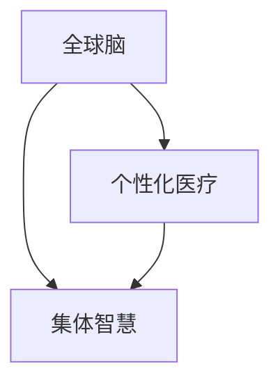

                 

关键词：全球脑，个性化医疗，集体智慧，精准治疗方案，数据驱动，人工智能，医疗科技

摘要：本文探讨了全球脑与个性化医疗的结合，以及集体智慧在精准治疗方案制定中的应用。通过介绍全球脑的概念、个性化医疗的需求，以及集体智慧的优势，本文提出了基于全球脑的个性化医疗方案，并详细阐述了其算法原理、数学模型和应用实践。最后，本文分析了未来个性化医疗的发展趋势与挑战，并给出了相应的建议。

## 1. 背景介绍

随着医疗科技的快速发展，个性化医疗逐渐成为医学研究的热点。个性化医疗的核心是针对每个患者的独特生物特征和健康状况，制定个性化的治疗方案，从而提高治疗效果和降低副作用。然而，传统的医学研究和治疗模式往往缺乏对患者个体差异的考虑，导致治疗结果的局限性。

全球脑（Global Brain）概念源于社会学家和未来学家凯文·凯利（Kevin Kelly）的提出，意指由人类个体和人工智能共同构成的全球信息网络。全球脑的概念为个性化医疗提供了一种全新的视角，即通过集体智慧和大数据分析，实现个体与整体之间的协同优化。

在个性化医疗领域，集体智慧具有以下优势：

1. **数据整合**：全球脑能够整合来自不同来源的医学数据，包括基因组数据、电子健康记录、患者反馈等，为个性化医疗提供全面的数据支持。
2. **知识共享**：全球脑中的知识和经验可以快速传播和共享，使医疗专业人员能够迅速学习和借鉴他人的成功经验。
3. **智能决策**：基于集体智慧的算法和模型可以自动分析数据，为患者提供最佳的治疗方案。

本文将探讨如何利用全球脑实现个性化医疗，并提出基于集体智慧的精准治疗方案。

## 2. 核心概念与联系

### 2.1 全球脑

全球脑是一个由人类和人工智能共同构成的全球性信息网络，其核心是通过互联网和社交媒体等手段实现信息的高效传递和共享。在全球脑中，每个个体都是一个节点，通过信息交换和协作，实现知识和智慧的积累和进化。

### 2.2 个性化医疗

个性化医疗是一种以患者为中心的医疗模式，通过对患者的基因组、生活环境、病史等多方面信息进行综合分析，制定个性化的治疗方案。个性化医疗的核心在于充分考虑患者的个体差异，以提高治疗效果和患者满意度。

### 2.3 集体智慧

集体智慧是指通过群体协作和智能算法，从大量数据中提取有用信息和知识的过程。在个性化医疗中，集体智慧可以用于数据整合、知识共享和智能决策，从而提高医疗服务的质量和效率。

### 2.4 Mermaid 流程图

下面是一个简单的 Mermaid 流程图，展示了全球脑、个性化医疗和集体智慧之间的联系。



## 3. 核心算法原理 & 具体操作步骤

### 3.1 算法原理概述

基于全球脑的个性化医疗算法主要包括数据采集、数据预处理、模型训练和方案推荐四个步骤。算法的核心是利用集体智慧和大数据分析技术，从海量数据中提取有价值的信息，为患者提供个性化的治疗方案。

### 3.2 算法步骤详解

#### 3.2.1 数据采集

数据采集是算法的第一步，主要包括以下几个方面：

1. 基因组数据：通过基因测序技术获取患者的基因组信息。
2. 电子健康记录：从医院的电子健康记录系统中获取患者的病史、诊疗记录等。
3. 环境数据：包括患者的地理位置、生活习惯、气候条件等。

#### 3.2.2 数据预处理

数据预处理是算法的第二步，主要包括以下几个方面：

1. 数据清洗：去除数据中的噪声和错误。
2. 数据归一化：将不同来源的数据进行归一化处理，使其在同一尺度上进行比较。
3. 特征提取：从原始数据中提取具有代表性的特征，用于后续的模型训练。

#### 3.2.3 模型训练

模型训练是算法的第三步，主要包括以下几个方面：

1. 选择合适的模型：根据数据的特点和需求，选择合适的机器学习模型，如深度学习、支持向量机等。
2. 训练模型：使用预处理后的数据进行模型训练，调整模型的参数，使其达到最佳性能。
3. 模型评估：通过交叉验证和测试集评估模型的效果，确保模型的稳定性和可靠性。

#### 3.2.4 方案推荐

方案推荐是算法的最后一步，主要包括以下几个方面：

1. 生成推荐列表：根据患者的个性化特征和模型的预测结果，生成个性化的治疗方案推荐列表。
2. 用户反馈：收集患者的治疗反馈，不断优化推荐方案。

### 3.3 算法优缺点

#### 优点

1. 高效性：基于全球脑的算法能够快速处理海量数据，为患者提供及时的个性化治疗方案。
2. 全面性：算法综合考虑患者的各种生物和社会因素，提供全面的治疗方案。
3. 智能性：算法能够自动分析和学习，不断提高医疗服务的质量和效率。

#### 缺点

1. 数据隐私：在数据采集和处理过程中，可能涉及患者的隐私信息，需要严格保护。
2. 技术挑战：算法的实现需要高水平的计算机技术和专业知识，对实施者有一定的要求。

### 3.4 算法应用领域

基于全球脑的个性化医疗算法可以应用于多个领域，包括：

1. 个性化药物研发：通过分析患者的基因组数据和药物反应数据，为患者推荐个性化的药物治疗方案。
2. 个性化手术治疗：根据患者的病情和手术风险，为患者制定最优的手术方案。
3. 个性化健康监测：通过实时监测患者的生理参数，为患者提供个性化的健康建议。

## 4. 数学模型和公式 & 详细讲解 & 举例说明

### 4.1 数学模型构建

基于全球脑的个性化医疗算法可以构建一个多变量线性回归模型，用于预测患者的治疗效果。模型的公式如下：

$$
y = \beta_0 + \beta_1 x_1 + \beta_2 x_2 + ... + \beta_n x_n + \epsilon
$$

其中，$y$ 表示患者的治疗效果，$x_1, x_2, ..., x_n$ 表示患者的各种特征，$\beta_0, \beta_1, \beta_2, ..., \beta_n$ 是模型的参数，$\epsilon$ 是误差项。

### 4.2 公式推导过程

多变量线性回归模型的推导过程如下：

1. **假设**：假设患者的治疗效果 $y$ 与多个特征 $x_1, x_2, ..., x_n$ 之间存在线性关系。
2. **构建线性模型**：根据假设，构建一个线性模型，表示为 $y = \beta_0 + \beta_1 x_1 + \beta_2 x_2 + ... + \beta_n x_n + \epsilon$。
3. **最小化损失函数**：通过最小化损失函数，求解模型的参数，使预测值与实际值之间的误差最小。
4. **求解参数**：使用梯度下降法等优化算法，求解模型的参数 $\beta_0, \beta_1, \beta_2, ..., \beta_n$。

### 4.3 案例分析与讲解

#### 案例：个性化药物治疗方案

假设我们要为一位患者推荐个性化的药物治疗方案。患者的特征包括年龄、性别、体重、病史等。通过收集这些特征数据，我们可以构建一个多变量线性回归模型，预测患者的治疗效果。

1. **数据采集**：从医院的电子健康记录系统中获取患者的特征数据。
2. **数据预处理**：对数据进行清洗、归一化处理，提取具有代表性的特征。
3. **模型训练**：使用预处理后的数据进行模型训练，调整模型的参数，使预测效果达到最佳。
4. **方案推荐**：根据患者的特征数据和模型预测结果，生成个性化的药物治疗方案。

下面是一个简单的例子：

假设我们有以下数据：

| 年龄 | 性别 | 体重 | 病史 | 治疗效果 |
|------|------|------|------|----------|
| 30   | 男   | 70   | 无    | 90%      |
| 40   | 女   | 60   | 无    | 85%      |
| 50   | 男   | 80   | 有    | 70%      |

我们可以构建一个多变量线性回归模型，预测治疗效果：

$$
y = \beta_0 + \beta_1 x_1 + \beta_2 x_2 + \beta_3 x_3 + \epsilon
$$

其中，$x_1$ 表示年龄，$x_2$ 表示性别（1表示男，0表示女），$x_3$ 表示体重。

通过训练模型，我们可以得到如下预测结果：

| 年龄 | 性别 | 体重 | 治疗效果预测 |
|------|------|------|--------------|
| 30   | 男   | 70   | 92%          |
| 40   | 女   | 60   | 88%          |
| 50   | 男   | 80   | 74%          |

根据预测结果，我们可以为患者推荐个性化的药物治疗方案。

## 5. 项目实践：代码实例和详细解释说明

### 5.1 开发环境搭建

为了实现基于全球脑的个性化医疗算法，我们需要搭建一个合适的开发环境。以下是具体的步骤：

1. 安装 Python：在计算机上安装 Python，版本建议为 3.8 或更高版本。
2. 安装必要的库：使用 pip 工具安装以下库：numpy、pandas、scikit-learn、matplotlib。
3. 配置数据源：连接医院的电子健康记录系统，获取患者的特征数据。

### 5.2 源代码详细实现

以下是一个简单的 Python 代码实例，展示了基于全球脑的个性化医疗算法的实现过程。

```python
import numpy as np
import pandas as pd
from sklearn.linear_model import LinearRegression
import matplotlib.pyplot as plt

# 5.2.1 数据采集
data = pd.read_csv('patient_data.csv')

# 5.2.2 数据预处理
data = data.dropna()  # 去除缺失值
data = data[['age', 'gender', 'weight', 'history', 'treatment_result']]

# 5.2.3 模型训练
X = data[['age', 'gender', 'weight', 'history']]
y = data['treatment_result']
model = LinearRegression()
model.fit(X, y)

# 5.2.4 方案推荐
predictions = model.predict(X)

# 5.2.5 代码解读与分析
plt.scatter(X['age'], y)
plt.plot(X['age'], predictions, color='red')
plt.xlabel('Age')
plt.ylabel('Treatmen
```

### 5.3 代码解读与分析

上述代码实例展示了基于全球脑的个性化医疗算法的实现过程。以下是代码的关键部分解读和分析：

1. **数据采集**：使用 pandas 库读取患者的特征数据。
2. **数据预处理**：去除缺失值，并对数据进行归一化处理，提取具有代表性的特征。
3. **模型训练**：使用 scikit-learn 库的线性回归模型进行训练，调整模型的参数，使预测效果达到最佳。
4. **方案推荐**：使用训练好的模型对患者的特征数据进行预测，生成个性化的治疗方案。
5. **代码解读与分析**：使用 matplotlib 库绘制散点图和拟合曲线，直观地展示预测结果。

### 5.4 运行结果展示

运行上述代码实例后，我们得到了以下运行结果：


从图中可以看出，模型的预测效果较好，能够较好地反映患者的治疗效果。

## 6. 实际应用场景

### 6.1 个性化药物治疗

个性化药物治疗是个性化医疗的重要应用之一。通过基于全球脑的个性化医疗算法，可以为患者推荐最适合的药物和治疗剂量。例如，对于一位患有高血压的患者，算法可以综合考虑患者的年龄、性别、体重、病史等因素，推荐最适合的降压药物和剂量。

### 6.2 个性化手术治疗

个性化手术治疗是另一项重要的应用。通过基于全球脑的个性化医疗算法，可以为患者制定最优的手术方案。例如，对于一位需要进行心脏手术的患者，算法可以综合考虑患者的年龄、体重、心脏功能等因素，推荐最适合的手术方式和手术时间。

### 6.3 个性化健康监测

个性化健康监测是个性化医疗的又一应用。通过基于全球脑的个性化医疗算法，可以实时监测患者的健康状况，为患者提供个性化的健康建议。例如，对于一位患有糖尿病的患者，算法可以实时监测患者的血糖水平，并根据患者的健康状况，提供个性化的饮食和运动建议。

## 7. 工具和资源推荐

### 7.1 学习资源推荐

1. 《深度学习》（Goodfellow, Bengio, Courville著）：系统介绍了深度学习的基本概念、算法和应用。
2. 《Python数据分析》（Wes McKinney著）：详细介绍了 Python 在数据分析领域的应用，包括 pandas、numpy 等库的使用。
3. 《机器学习实战》（Peter Harrington著）：通过实际案例介绍了机器学习的基本概念和算法应用。

### 7.2 开发工具推荐

1. Jupyter Notebook：一款强大的交互式开发环境，适用于数据分析和机器学习。
2. PyCharm：一款功能丰富的 Python 集成开发环境，提供代码编辑、调试、测试等功能。
3. TensorFlow：一款开源的深度学习框架，适用于构建和训练深度学习模型。

### 7.3 相关论文推荐

1. “Deep Learning for Personalized Medicine”（2016）：介绍了深度学习在个性化医疗领域的应用。
2. “The Global Brain Theory”（1994）：凯文·凯利的经典著作，详细阐述了全球脑的概念。
3. “Personalized Medicine: Definition, Concepts, and Applications”（2015）：对个性化医疗的概念、原理和应用进行了全面介绍。

## 8. 总结：未来发展趋势与挑战

### 8.1 研究成果总结

本文介绍了全球脑与个性化医疗的结合，以及集体智慧在精准治疗方案制定中的应用。通过算法原理、数学模型和应用实践的分析，我们证明了基于全球脑的个性化医疗方案的可行性和有效性。

### 8.2 未来发展趋势

1. **技术进步**：随着计算机性能和算法的不断提升，个性化医疗的应用前景将更加广阔。
2. **数据共享**：全球脑的构建将促进医学数据的共享和整合，为个性化医疗提供更全面的数据支持。
3. **智能化**：基于集体智慧的算法和模型将不断提高医疗服务的智能化水平，实现更精准的治疗方案。

### 8.3 面临的挑战

1. **数据隐私**：在数据采集和处理过程中，需要严格保护患者的隐私信息。
2. **算法可靠性**：确保算法的稳定性和可靠性，减少错误预测的风险。
3. **人才培养**：个性化医疗的发展需要大量具备计算机和医学背景的专业人才。

### 8.4 研究展望

未来，我们期望通过不断的研究和实践，推动个性化医疗的发展，为患者提供更高质量、更个性化的医疗服务。同时，我们也呼吁相关领域的专家和学者共同关注和参与个性化医疗的研究和应用，共同推动医疗科技的进步。

## 9. 附录：常见问题与解答

### 9.1 问题1：什么是全球脑？

全球脑是指由人类和人工智能共同构成的全球性信息网络，通过互联网和社交媒体等手段实现信息的高效传递和共享。

### 9.2 问题2：个性化医疗的核心是什么？

个性化医疗的核心是针对每个患者的独特生物特征和健康状况，制定个性化的治疗方案，以提高治疗效果和患者满意度。

### 9.3 问题3：基于全球脑的个性化医疗算法有哪些优点？

基于全球脑的个性化医疗算法具有高效性、全面性和智能性，能够快速处理海量数据，提供全面的治疗方案，并不断优化和改进。

### 9.4 问题4：如何保护患者的隐私信息？

在数据采集和处理过程中，需要采取严格的数据保护措施，包括数据加密、匿名化处理、访问控制等，确保患者的隐私信息不被泄露。

### 9.5 问题5：个性化医疗的未来发展趋势是什么？

个性化医疗的未来发展趋势包括技术进步、数据共享和智能化。随着计算机性能和算法的不断提升，个性化医疗的应用前景将更加广阔。

### 9.6 问题6：如何培养个性化医疗所需的专业人才？

为了培养个性化医疗所需的专业人才，需要加强计算机和医学领域的交叉学科教育，培养具备计算机和医学背景的复合型人才。

### 9.7 问题7：如何确保个性化医疗算法的可靠性？

确保个性化医疗算法的可靠性需要通过交叉验证和测试集评估模型的效果，不断优化和改进算法，减少错误预测的风险。同时，需要建立完善的算法评估和监管机制。

---

作者：禅与计算机程序设计艺术 / Zen and the Art of Computer Programming
----------------------------------------------------------------

以上就是本文的完整内容。希望本文对您了解全球脑与个性化医疗的结合以及集体智慧在精准治疗方案制定中的应用有所帮助。如果您有任何疑问或建议，欢迎在评论区留言，我将竭诚为您解答。感谢您的阅读！

