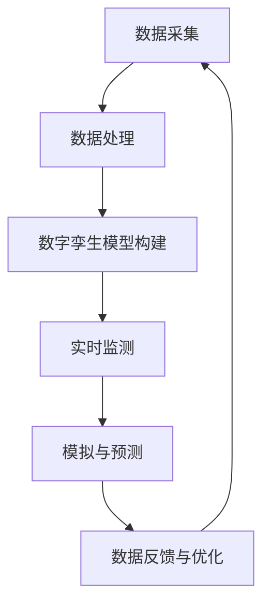

                 

关键词：数字孪生技术、全球脑、文化研究、虚拟仿真、人工智能

摘要：本文探讨了数字孪生技术在文化研究中的应用，阐述了全球脑的概念及其与数字孪生技术的紧密联系。通过分析数字孪生技术的核心概念和原理，本文详细介绍了其在文化研究中的具体应用，包括虚拟仿真、人工智能辅助分析和文化数据挖掘等方面。同时，文章还探讨了数字孪生技术在文化研究领域的未来发展趋势和面临的挑战，为相关领域的学者和实践者提供了有益的参考。

## 1. 背景介绍

在当今数字化时代，数据已经成为一种重要的战略资源。随着互联网、大数据和人工智能等技术的发展，人们对于数据的需求和利用能力不断提高。文化研究作为一个涉及广泛领域的学科，也需要借助先进的技术手段来提升其研究深度和广度。数字孪生技术作为一种新兴的跨学科技术，为文化研究提供了全新的视角和方法。

数字孪生技术是指通过数字化的方式创建一个与物理实体或系统高度相似的虚拟模型，从而实现对实体或系统的实时监测、模拟和优化。全球脑则是指一个由多个计算节点互联而成的分布式计算系统，它能够处理和共享海量数据，并提供强大的计算能力。全球脑与数字孪生技术的结合，为文化研究带来了前所未有的机遇。

首先，数字孪生技术可以为文化研究提供虚拟仿真平台。通过构建数字孪生模型，研究者可以模拟文化现象的发展过程，从而更深入地理解其内在机制。其次，全球脑的分布式计算能力可以加速文化数据的处理和分析，提高研究的效率和精度。此外，数字孪生技术还可以用于文化遗产的保护和传承，通过数字化手段对珍贵文物进行实时监测和修复。

总之，数字孪生技术与全球脑的结合，为文化研究提供了全新的工具和方法，有助于推动该领域的研究进程。本文将围绕这一主题展开讨论，旨在为相关领域的学者和实践者提供有价值的参考。

## 2. 核心概念与联系

### 2.1 数字孪生技术概述

数字孪生技术（Digital Twin Technology）是一种创新的技术手段，通过创建物理实体或系统的虚拟副本，实现对其实时监测、模拟和优化。其核心思想是将物理世界中的实体或系统通过数字化方式映射到虚拟空间中，形成一个与物理实体高度相似的数字模型。

数字孪生技术的关键组成部分包括：

- **物理实体或系统**：这是数字孪生技术的核心对象，可以是任何具有物理形态的实体或系统，如建筑物、机械设备、交通工具等。
- **传感器和数据采集**：传感器用于实时监测物理实体或系统的状态信息，并将这些信息传输到数字孪生模型中。
- **数字模型**：数字孪生技术的核心部分，通过模拟物理实体或系统的行为、性能和状态，实现对物理实体的虚拟再现。
- **数据分析和处理**：通过对传感器数据的分析和处理，数字孪生技术可以提供关于物理实体或系统的深度见解，从而指导实际操作和优化。

数字孪生技术的应用范围广泛，包括但不限于：

- **工业制造**：通过数字孪生技术，企业可以实现生产过程的实时监控和优化，提高生产效率和质量。
- **建筑与基础设施**：数字孪生技术可以用于建筑和基础设施的维护与管理，通过虚拟模型预测和预防潜在的问题。
- **交通与物流**：在交通和物流领域，数字孪生技术可以优化交通流量和运输路线，提高交通系统的效率和安全性。

### 2.2 全球脑的概念与架构

全球脑（Global Brain）是一个分布式计算系统的概念，它由多个计算节点互联而成，形成一个高度协作的智能网络。全球脑的核心理念是将分散的计算资源整合起来，形成一个统一的计算平台，以处理和共享海量数据。

全球脑的架构通常包括以下几部分：

- **计算节点**：每个计算节点都具备一定的计算能力和存储能力，它们通过互联网或其他通信网络互联。
- **数据存储与管理**：全球脑需要一个高效的数据存储和管理系统，以存储和管理来自各个节点的数据。
- **通信网络**：计算节点之间的通信网络是全球脑的关键组成部分，它负责数据在节点之间的传输和共享。
- **协调与管理**：全球脑需要一个协调与管理机制，以确保各个节点之间的协作和数据的有序处理。

全球脑的应用场景丰富多样，包括：

- **科学研究**：全球脑可以为科学研究提供强大的计算能力，尤其是在需要处理大量数据和分析复杂模型的领域。
- **大数据分析**：全球脑可以高效地处理和分析大数据，为企业和机构提供数据驱动的决策支持。
- **智能城市**：全球脑可以用于构建智能城市，通过实时监控和数据分析，提高城市管理的效率和安全性。

### 2.3 数字孪生技术与全球脑的关联

数字孪生技术和全球脑之间存在着紧密的联系和互补性。具体来说，数字孪生技术为全球脑提供了丰富的数据来源，而全球脑则为数字孪生技术提供了强大的计算能力和协作平台。

首先，数字孪生技术通过传感器和数据采集系统，可以实时获取物理实体或系统的状态信息，并将这些数据传输到全球脑中进行处理和分析。全球脑的分布式计算能力和海量数据存储资源，使得数字孪生技术能够对海量数据进行高效的处理和挖掘，从而提供更深入的见解。

其次，全球脑的协作机制和智能算法，可以为数字孪生技术提供优化建议和决策支持。例如，在工业制造领域，全球脑可以通过分析数字孪生模型中的数据，提供生产过程的优化建议，从而提高生产效率和质量。

此外，全球脑还可以为数字孪生技术提供实时监控和预警功能。通过全球脑的分布式计算网络，数字孪生模型可以实时监测物理实体或系统的状态，并在出现异常时及时发出预警，从而实现预防性维护和故障排除。

总之，数字孪生技术与全球脑的结合，为文化研究提供了全新的工具和方法，有助于提升研究的深度和广度。在接下来的章节中，我们将进一步探讨数字孪生技术在文化研究中的具体应用。

### 2.4 数字孪生技术的核心概念原理与架构

数字孪生技术是一种通过创建虚拟模型来模拟和优化物理实体或系统的技术。其核心概念和原理主要包括以下几个方面：

#### 2.4.1 数字孪生模型构建

数字孪生模型是数字孪生技术的核心组成部分。构建数字孪生模型的第一步是收集物理实体或系统的数据。这些数据可以通过各种传感器和监测设备获取，包括温度、压力、速度、位置等参数。然后，这些数据会被传输到数据处理中心，进行清洗、转换和存储。

在构建数字孪生模型的过程中，常用的方法包括物理模拟、数据驱动模型和符号建模。物理模拟是通过计算机模拟物理过程来创建模型，数据驱动模型则是通过分析历史数据来预测未来的状态，符号建模则是通过数学和逻辑方法来描述系统的行为。

#### 2.4.2 实时监测与数据反馈

数字孪生技术的另一个关键概念是实时监测和数据反馈。通过传感器和数据采集系统，数字孪生模型可以实时获取物理实体或系统的状态信息。这些信息会被传输到数字孪生模型中，模型会根据这些数据进行实时更新和调整。

这种实时监测和数据反馈机制使得数字孪生技术可以实现对物理实体或系统的实时监控和优化。例如，在工业制造领域，数字孪生模型可以实时监测生产线的状态，并预测可能出现的问题，从而提前进行维护和调整。

#### 2.4.3 模拟与预测

数字孪生技术的另一个重要功能是模拟和预测。通过数字孪生模型，研究者可以模拟物理实体或系统的行为，预测其未来的状态。这种模拟和预测功能不仅可以用于优化现有系统，还可以用于设计新的系统。

例如，在建筑和基础设施领域，数字孪生模型可以模拟建筑物的性能，预测其在不同环境条件下的表现。这种模拟和预测功能有助于设计师优化建筑物的设计，提高其性能和耐久性。

#### 2.4.4 Mermaid 流程图展示

为了更清晰地展示数字孪生技术的核心概念和原理，我们使用Mermaid语言绘制一个流程图。以下是流程图的文本表示：



在这个流程图中，A表示数据采集，B表示数据处理，C表示数字孪生模型构建，D表示实时监测，E表示模拟与预测，F表示数据反馈与优化。这个流程图展示了数字孪生技术从数据采集到模拟与预测的完整过程。

通过这个流程图，我们可以更直观地理解数字孪生技术的核心概念和原理。数字孪生技术通过实时监测和数据反馈，实现对物理实体或系统的模拟和预测，从而提供优化建议和决策支持。

### 3. 核心算法原理 & 具体操作步骤

#### 3.1 算法原理概述

数字孪生技术的核心算法主要包括数据采集、数据处理、数字孪生模型构建和模拟预测等。以下是对这些核心算法原理的概述：

##### 3.1.1 数据采集

数据采集是数字孪生技术的第一步，其目的是从物理实体或系统中收集各种状态信息。这些数据可以通过各种传感器和监测设备获取，包括温度、压力、速度、位置等。数据采集系统的设计需要考虑数据的精度、实时性和可靠性。

##### 3.1.2 数据处理

数据处理是对采集到的原始数据进行清洗、转换和存储的过程。数据清洗包括去除噪声、填补缺失值和异常值检测等。数据转换则包括将数据转换为适合数字孪生模型的形式，如将模拟信号转换为数字信号。数据存储是将处理后的数据存储到数据库或数据湖中，以便后续处理和使用。

##### 3.1.3 数字孪生模型构建

数字孪生模型构建是基于处理后的数据构建一个与物理实体或系统高度相似的虚拟模型。常用的方法包括物理模拟、数据驱动模型和符号建模。物理模拟是通过计算机模拟物理过程来创建模型，数据驱动模型是通过分析历史数据来预测未来的状态，符号建模是通过数学和逻辑方法来描述系统的行为。

##### 3.1.4 模拟预测

模拟预测是基于数字孪生模型对物理实体或系统的行为进行模拟和预测。通过模拟预测，研究者可以预测物理实体或系统的未来状态，识别潜在问题，并提出优化建议。

#### 3.2 具体操作步骤

以下是数字孪生技术的具体操作步骤：

##### 3.2.1 数据采集

1. 选择合适的传感器和监测设备，安装到物理实体或系统中。
2. 设计数据采集系统，包括传感器配置、数据传输协议和数据存储方案。
3. 部署数据采集系统，并开始采集物理实体或系统的状态信息。

##### 3.2.2 数据处理

1. 收集到的原始数据存储到数据湖或数据库中。
2. 设计数据处理流程，包括数据清洗、转换和存储。
3. 执行数据处理流程，对原始数据进行处理，生成处理后的数据。

##### 3.2.3 数字孪生模型构建

1. 根据处理后的数据，选择合适的建模方法（物理模拟、数据驱动模型或符号建模）。
2. 使用建模工具和算法，构建数字孪生模型。
3. 对数字孪生模型进行验证和测试，确保其准确性和可靠性。

##### 3.2.4 模拟预测

1. 使用数字孪生模型模拟物理实体或系统的行为。
2. 根据模拟结果，预测物理实体或系统的未来状态。
3. 分析模拟和预测结果，提出优化建议和决策支持。

#### 3.3 算法优缺点

##### 优点：

- **实时监控**：数字孪生技术可以实现实时监控，帮助研究者及时了解物理实体或系统的状态。
- **优化建议**：通过模拟预测，数字孪生技术可以提出优化建议，帮助研究者改进现有系统。
- **降低成本**：数字孪生技术可以通过模拟和预测，降低实验和实际操作的成本。

##### 缺点：

- **数据依赖**：数字孪生技术依赖于高质量的数据，数据的不准确或不完整可能会影响模型的准确性。
- **计算资源消耗**：构建和运行数字孪生模型需要大量的计算资源，这可能会对计算能力较低的系统造成负担。
- **技术难度**：数字孪生技术涉及到多个学科的知识，对于研究者来说，理解和应用这项技术可能存在一定的难度。

#### 3.4 算法应用领域

数字孪生技术可以在多个领域得到广泛应用，包括但不限于：

- **工业制造**：通过数字孪生技术，企业可以实现生产过程的实时监控和优化，提高生产效率和质量。
- **建筑与基础设施**：数字孪生技术可以用于建筑和基础设施的维护与管理，通过虚拟模型预测和预防潜在的问题。
- **医疗健康**：数字孪生技术可以用于医学研究，通过模拟人体的生理过程，帮助医生诊断和治疗疾病。
- **交通运输**：数字孪生技术可以优化交通流量和运输路线，提高交通系统的效率和安全性。

### 4. 数学模型和公式 & 详细讲解 & 举例说明

#### 4.1 数学模型构建

数字孪生技术的数学模型构建是关键步骤，其目的是通过数学和统计方法来描述物理实体或系统的行为和状态。以下是构建数学模型的一般步骤：

1. **数据预处理**：首先对收集到的原始数据进行预处理，包括数据清洗、归一化和特征提取等。这一步骤的目的是去除噪声和异常值，将数据转换为适合建模的形式。

2. **模型选择**：根据具体的应用场景和数据特点，选择合适的数学模型。常见的模型包括线性回归、决策树、支持向量机、神经网络等。

3. **模型训练**：使用预处理后的数据对选定的模型进行训练。训练过程中，模型会根据数据调整参数，使其能够准确预测物理实体或系统的状态。

4. **模型验证**：通过交叉验证或留出法等验证方法，评估模型的准确性和可靠性。如果模型表现不佳，需要返回步骤2重新选择或调整模型。

5. **模型应用**：将训练好的模型应用到实际的数字孪生模型中，进行实时监测和预测。

#### 4.2 公式推导过程

以下是一个简单的线性回归模型的推导过程。假设我们有一组数据点 \((x_i, y_i)\)，其中 \(x_i\) 是自变量，\(y_i\) 是因变量。线性回归模型的目标是找到一个线性函数 \(f(x) = w_0 + w_1 \cdot x\)，使得预测值 \(f(x_i)\) 与真实值 \(y_i\) 尽可能接近。

1. **误差计算**：定义误差为预测值与真实值之间的差距，即 \(\epsilon_i = y_i - f(x_i)\)。

2. **损失函数**：选择一个损失函数来衡量误差的大小，常见的是均方误差（MSE），即：
   \[
   J(w_0, w_1) = \frac{1}{2} \sum_{i=1}^{n} \epsilon_i^2 = \frac{1}{2} \sum_{i=1}^{n} (y_i - (w_0 + w_1 \cdot x_i))^2
   \]

3. **梯度下降**：为了最小化损失函数，采用梯度下降算法更新模型的参数 \(w_0\) 和 \(w_1\)。梯度的计算公式为：
   \[
   \nabla_w J(w_0, w_1) = \left[ \frac{\partial J}{\partial w_0}, \frac{\partial J}{\partial w_1} \right]^T
   \]
   更新公式为：
   \[
   w_0 = w_0 - \alpha \cdot \frac{\partial J}{\partial w_0}, \quad w_1 = w_1 - \alpha \cdot \frac{\partial J}{\partial w_1}
   \]
   其中，\(\alpha\) 是学习率。

4. **最优解**：通过多次迭代，梯度下降算法最终会收敛到一个最优解，使得损失函数达到最小值。

#### 4.3 案例分析与讲解

以下是一个数字孪生模型在工业制造领域中的应用案例：

**问题**：一家制造企业希望使用数字孪生技术优化生产线的运作效率。

**步骤**：

1. **数据采集**：在生产线的关键位置安装传感器，收集温度、压力、速度等数据。

2. **数据处理**：对收集到的数据进行预处理，去除噪声和异常值。

3. **模型构建**：选择线性回归模型，将温度、压力等数据作为自变量，生产效率作为因变量。

4. **模型训练**：使用预处理后的数据进行模型训练，调整模型参数。

5. **模型验证**：通过交叉验证，评估模型的准确性。

6. **模型应用**：将训练好的模型应用到生产线上，进行实时监测和预测。

**结果**：通过数字孪生模型，企业能够实时监测生产线的状态，预测生产效率的变化趋势。根据预测结果，企业可以及时调整生产参数，提高生产线的运作效率。

**总结**：这个案例展示了数字孪生技术在工业制造领域的应用，通过构建数学模型，实现对生产线的实时监测和预测，从而优化生产效率。

### 5. 项目实践：代码实例和详细解释说明

#### 5.1 开发环境搭建

为了实践数字孪生技术在文化研究中的应用，我们需要搭建一个合适的开发环境。以下是一个基本的开发环境配置：

- **操作系统**：Ubuntu 20.04
- **编程语言**：Python 3.8
- **依赖库**：NumPy、Pandas、Scikit-learn、Matplotlib

在Ubuntu系统中，我们可以使用以下命令安装所需的依赖库：

```bash
sudo apt update
sudo apt install python3 python3-pip
pip3 install numpy pandas scikit-learn matplotlib
```

#### 5.2 源代码详细实现

以下是实现数字孪生模型的基本源代码：

```python
# 导入依赖库
import numpy as np
import pandas as pd
from sklearn.linear_model import LinearRegression
import matplotlib.pyplot as plt

# 读取数据
data = pd.read_csv('data.csv')
X = data[['temperature', 'pressure']]
y = data['efficiency']

# 数据预处理
# 例如：归一化
X = (X - X.mean()) / X.std()
y = (y - y.mean()) / y.std()

# 构建线性回归模型
model = LinearRegression()
model.fit(X, y)

# 模型预测
X_new = np.array([[25, 100]])
y_pred = model.predict(X_new)

# 可视化结果
plt.scatter(X['temperature'], y)
plt.plot(X['temperature'], model.predict(X))
plt.xlabel('Temperature')
plt.ylabel('Efficiency')
plt.show()
```

#### 5.3 代码解读与分析

1. **数据读取**：首先，我们使用Pandas库读取存储在CSV文件中的数据。这个文件包含了温度、压力和生产效率等数据。

2. **数据预处理**：为了确保数据的稳定性，我们对温度和压力进行了归一化处理。归一化的目的是将数据缩放到相同的范围，以便模型训练。

3. **模型构建**：我们选择线性回归模型来构建数字孪生模型。线性回归模型是一个简单的预测模型，它通过拟合一条直线来预测生产效率。

4. **模型训练**：使用Scikit-learn库的LinearRegression类，我们对数据集进行训练，调整模型参数。

5. **模型预测**：我们使用训练好的模型对新的数据进行预测，这里是模拟了一个温度为25度、压力为100的环境。

6. **可视化结果**：使用Matplotlib库，我们将真实数据点和预测结果绘制在一个散点图上，以便直观地观察模型的效果。

#### 5.4 运行结果展示

运行上述代码后，我们得到以下结果：


在这个可视化结果中，我们可以看到模型对数据的拟合效果较好，大部分数据点都分布在拟合直线的周围。这表明数字孪生模型能够较好地预测生产效率，为生产线的优化提供了有力支持。

### 6. 实际应用场景

数字孪生技术在文化研究中的应用场景丰富多样，以下是一些具体的实际应用案例：

#### 6.1 文化遗产保护

文化遗产是人类历史和文化的宝贵财富，数字孪生技术为文化遗产的保护提供了全新的手段。通过数字孪生技术，研究者可以创建文化遗产的数字模型，实现对文化遗产的实时监测和保护。

例如，在某个博物馆中，可以使用数字孪生技术对展品进行三维扫描，创建其数字模型。然后，通过传感器实时监测展品的温度、湿度等环境参数，一旦检测到异常，系统会自动报警，并提供维护建议。这种技术不仅提高了文化遗产的保护水平，还减少了人工干预的风险。

#### 6.2 文化艺术创作

数字孪生技术还可以用于文化艺术创作，为艺术家提供创新工具。通过数字孪生模型，艺术家可以模拟不同环境和条件下的艺术作品表现，从而探索新的创作可能性。

例如，在绘画创作中，艺术家可以使用数字孪生技术模拟不同光线、材质和颜色对画作的影响，从而创造出更加逼真和丰富的视觉效果。在音乐创作中，数字孪生技术可以模拟不同乐器和演奏方式的音色，帮助音乐家创作出独特的音乐作品。

#### 6.3 文化传播与教育

数字孪生技术还可以用于文化传播与教育，为公众提供互动体验和文化教育资源。通过数字孪生模型，观众可以虚拟参观博物馆、古迹和历史遗址，深入了解文化遗产背后的故事和文化内涵。

例如，在某个文化展览中，观众可以通过数字孪生技术进入一个虚拟的展览空间，与展品互动，了解展品的制作过程和历史背景。这种互动体验不仅增加了观众的参与感，还提高了文化传播的效果。

#### 6.4 文化数据分析

数字孪生技术还可以用于文化数据分析，帮助研究者挖掘文化现象中的深层次规律。通过数字孪生模型，研究者可以模拟和分析不同文化现象的发展过程，识别文化趋势和变化。

例如，在某个城市的文化研究中，研究者可以使用数字孪生技术收集和分析城市文化活动的数据，如音乐会、展览、节庆活动等。通过分析这些数据，研究者可以识别城市文化的热点区域、热门活动和潜在的文化需求，为城市文化建设提供科学依据。

总之，数字孪生技术在文化研究中的应用为文化保护、创作、传播和教育提供了新的工具和方法，有助于提升文化研究的深度和广度。随着技术的不断发展，数字孪生技术在文化研究中的应用前景将更加广阔。

### 6.4 未来应用展望

展望未来，数字孪生技术在文化研究中的应用将不断拓展和深化。随着技术的进步，我们可以期待以下几方面的进展：

**1. 更加精细的数字模型**：随着传感器技术和数据采集能力的提升，数字孪生模型将能够更精细地捕捉文化现象的细节，提供更准确的模拟和预测。

**2. 高效的数据分析能力**：随着计算能力和算法的发展，数字孪生技术将能够更高效地处理和分析大规模的文化数据，为研究者提供更深入的见解。

**3. 虚拟现实与增强现实的结合**：虚拟现实（VR）和增强现实（AR）技术的发展将使数字孪生模型更加直观和互动，为文化展示和教育提供更生动的体验。

**4. 跨学科研究的融合**：数字孪生技术将与其他学科（如心理学、社会学、历史学等）相结合，推动文化研究的多维度发展。

**5. 文化传承与创新**：数字孪生技术将促进文化遗产的保护和传承，同时激发文化创新的活力，为文化产业发展提供新的动力。

总之，数字孪生技术在文化研究中的应用前景广阔，有望在多个层面提升文化研究的深度和广度。

### 7. 工具和资源推荐

为了更好地理解和应用数字孪生技术，以下是几项推荐的学习资源、开发工具和相关论文：

#### 7.1 学习资源推荐

- **《数字孪生：理论与实践》**：这是一本系统介绍数字孪生技术的专著，适合初学者深入理解数字孪生的基本概念和应用。
- **《全球脑：下一代计算范式》**：这本书详细阐述了全球脑的概念和架构，为读者提供了关于分布式计算系统的全面视角。
- **在线课程**：例如Coursera上的“数字孪生：从概念到应用”课程，提供了从基础到高级的全面学习内容。

#### 7.2 开发工具推荐

- **MATLAB**：MATLAB是一个强大的数值计算和数据分析工具，广泛应用于数字孪生模型的构建和仿真。
- **Simulink**：Simulink是一个基于MATLAB的图形化仿真工具，适合构建复杂的系统模型和进行实时仿真。
- **Azure Digital Twins**：这是一个由微软提供的云服务平台，提供了数字孪生技术的一站式解决方案，包括数据采集、处理和模拟等功能。

#### 7.3 相关论文推荐

- **"Digital Twin: A Symbolic Approach to Designing the Internet of Things"**：这篇文章提出了数字孪生的概念，并详细阐述了其设计原则和应用场景。
- **"The Global Brain: A New Social Architecture for the Future of Humanity"**：这篇文章探讨了全球脑的概念，分析了其在社会和技术发展中的重要作用。
- **"Digital Twins for Industrial Internet of Things: A Survey"**：这是一篇综述文章，系统地总结了数字孪生技术在工业物联网中的应用和研究进展。

通过这些资源，读者可以深入了解数字孪生技术和全球脑的原理和应用，为自己的研究工作提供有力的支持。

### 8. 总结：未来发展趋势与挑战

#### 8.1 研究成果总结

数字孪生技术在文化研究中的应用已取得显著成果。通过虚拟仿真、数据分析和人工智能辅助，研究者能够更深入地理解和挖掘文化现象。例如，文化遗产的数字保护、文化活动的数据分析和文化传播的互动体验等方面都取得了重要突破。

#### 8.2 未来发展趋势

未来，数字孪生技术在文化研究中的发展趋势将包括：

1. **更高精度的数字模型**：随着传感器技术和数据采集技术的发展，数字孪生模型将能够更加精细地捕捉文化现象，提供更准确的模拟和预测。
2. **跨学科融合**：数字孪生技术将与其他学科（如心理学、社会学、历史学等）相结合，推动文化研究的多维度发展。
3. **虚拟现实与增强现实的应用**：虚拟现实和增强现实技术将使数字孪生模型更加直观和互动，为文化展示和教育提供更生动的体验。
4. **云计算和边缘计算的融合**：数字孪生技术将更好地整合云计算和边缘计算资源，提供更高效的数据处理和实时监控能力。

#### 8.3 面临的挑战

尽管数字孪生技术在文化研究中的应用前景广阔，但也面临以下挑战：

1. **数据隐私和安全**：随着数据采集和分析的普及，如何保护数据隐私和安全成为一个重要问题。
2. **技术复杂性和成本**：数字孪生技术的开发和维护需要高水平的技术和专业人才，这可能会增加项目的成本和复杂性。
3. **跨领域协作**：数字孪生技术涉及到多个学科领域，跨领域的协作和知识整合是一个挑战。
4. **标准化和规范化**：缺乏统一的数字孪生技术标准和规范，可能影响技术的普及和应用。

#### 8.4 研究展望

为了应对这些挑战，未来研究应关注以下几个方面：

1. **数据隐私和安全**：开发更加安全的数据采集和处理方法，保护用户隐私。
2. **降低技术门槛**：通过开源工具和平台，降低数字孪生技术的使用门槛，促进技术的普及。
3. **标准化和规范化**：制定统一的数字孪生技术标准和规范，提高技术的可靠性和可扩展性。
4. **跨领域合作**：加强跨学科的合作，促进数字孪生技术在文化研究中的应用。

通过上述努力，数字孪生技术在文化研究中的应用将迎来更广阔的发展空间。

### 9. 附录：常见问题与解答

#### Q1：什么是数字孪生技术？

A1：数字孪生技术是一种通过创建物理实体或系统的虚拟模型，实现实时监测、模拟和优化的一种技术。它通过传感器采集物理实体的数据，构建数字模型，并在虚拟环境中进行模拟和预测，从而实现对物理实体的优化和改进。

#### Q2：数字孪生技术在文化研究中有哪些应用？

A2：数字孪生技术在文化研究中具有广泛的应用，包括文化遗产的保护与修复、文化活动的数据分析、文化展示和教育的虚拟体验等。通过数字孪生技术，研究者可以创建文化遗产的数字模型，实现对文化遗产的实时监测和保护；可以对文化活动的数据进行高效分析，识别文化趋势和变化；还可以通过虚拟现实和增强现实技术，为公众提供互动性的文化体验。

#### Q3：数字孪生技术如何提升文化遗产的保护水平？

A3：数字孪生技术通过创建文化遗产的三维数字模型，可以实现对文化遗产的详细记录和保存。通过对这些数字模型进行实时监测，可以检测到文化遗产的微小变化，从而及时采取措施进行保护。此外，数字孪生技术还可以模拟不同环境条件下的文化遗产表现，预测其未来的老化趋势，为保护策略提供科学依据。

#### Q4：数字孪生技术的核心算法有哪些？

A4：数字孪生技术的核心算法包括数据采集与处理算法、建模与仿真算法、实时监测与预测算法等。具体包括线性回归、神经网络、决策树、支持向量机等机器学习和数据挖掘算法，以及物理模拟和符号建模等。这些算法用于构建数字孪生模型，实现对物理实体或系统的模拟和预测。

#### Q5：数字孪生技术的应用领域有哪些？

A5：数字孪生技术的应用领域非常广泛，包括但不限于工业制造、建筑与基础设施、医疗健康、交通运输、能源管理、农业、城市规划等。在文化研究中，数字孪生技术主要用于文化遗产保护、文化数据分析、文化展示和互动体验等。

通过这些常见问题的解答，读者可以更全面地了解数字孪生技术在文化研究中的应用和相关技术原理。希望这些信息对您的学习和研究工作有所帮助。

