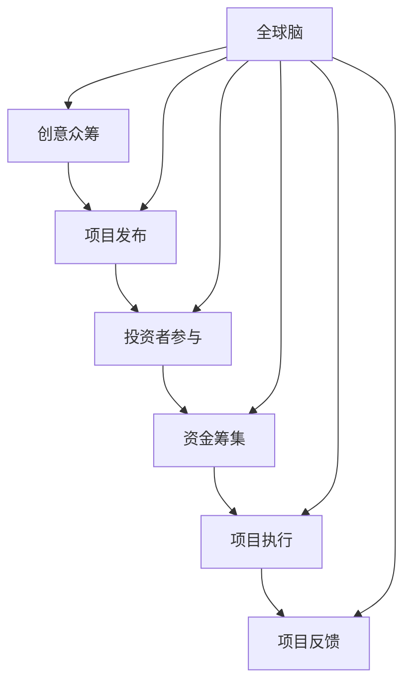

                 

 在这个数字化时代，人工智能、区块链和大数据等技术的飞速发展，正在重新定义我们的工作方式和生活习惯。同时，全球脑与创意众筹作为一种新兴的协作模式，正在迅速崛起，展现出集体创新的巨大潜力。本文将深入探讨全球脑与创意众筹的概念、原理、实践与应用，以期为广大读者提供一个全新的视角，了解和利用这一集体创新的力量。

## 关键词

- 全球脑
- 创意众筹
- 集体创新
- 人工智能
- 区块链
- 大数据

## 摘要

本文首先介绍了全球脑与创意众筹的基本概念和背景，然后详细阐述了全球脑与创意众筹的原理、机制和实践。接着，文章通过实例分析和项目实践，展示了全球脑与创意众筹在实际应用中的成果和效果。最后，文章对全球脑与创意众筹的未来发展趋势和面临的挑战进行了展望，提出了相关建议。

## 1. 背景介绍

随着互联网技术的不断进步，人们之间的信息交流变得更加便捷和高效。与此同时，人工智能、区块链和大数据等前沿技术的应用，为人类带来了前所未有的创新机遇。然而，个体能力的局限和资源分散的问题，使得单打独斗的模式越来越难以适应快速变化的市场需求。

全球脑与创意众筹应运而生。全球脑是一种基于互联网的全球性协作平台，它通过聚合全球智慧和资源，实现知识的共享和创新的快速迭代。创意众筹则是一种基于互联网的融资模式，它通过大众参与和支持，为创新项目提供资金和资源支持。

全球脑与创意众筹的结合，不仅能够突破个体能力的局限，还能够实现资源的优化配置，推动集体创新的快速发展。在全球脑平台上，人们可以分享自己的创意和智慧，通过众筹的方式获取资金和资源支持，从而实现创新的快速落地。同时，全球脑平台还能够通过大数据分析和人工智能技术，为创新项目提供精准的支持和优化建议。

## 2. 核心概念与联系

### 2.1 全球脑

全球脑是一种基于互联网的全球性协作平台，它通过聚合全球智慧和资源，实现知识的共享和创新的快速迭代。全球脑的核心思想是“集思广益”，即通过多方面的参与和协作，汇聚全球的智慧和力量，解决各种复杂问题。

#### 全球脑的架构

全球脑的架构主要包括以下几个部分：

1. **用户界面**：用户界面是用户与全球脑进行交互的入口，用户可以通过用户界面发布问题、分享知识、参与讨论等。

2. **数据存储**：数据存储是全局数据的集中存储，包括用户发布的问题、分享的知识、讨论的内容等。

3. **计算平台**：计算平台是处理和分析数据的核心，包括人工智能算法、大数据分析技术等。

4. **网络通信**：网络通信是连接用户和计算平台的数据传输通道，保证数据的实时性和可靠性。

#### 全球脑的运作机制

全球脑的运作机制主要包括以下几个步骤：

1. **问题发布**：用户可以在全球脑平台上发布问题，问题描述应当详细明确，以便其他用户理解并参与解决。

2. **知识共享**：用户可以分享自己的知识和经验，回答其他用户的问题，或者提出新的解决方案。

3. **讨论与投票**：用户可以对问题和解决方案进行讨论，通过投票的方式决定最终的解决方案。

4. **结果反馈**：全球脑平台会对解决方案进行评价和反馈，为用户提供更加精准的指导和建议。

### 2.2 创意众筹

创意众筹是一种基于互联网的融资模式，它通过大众参与和支持，为创新项目提供资金和资源支持。创意众筹的核心思想是“大众参与”，即通过大众的力量，支持创新项目的发展。

#### 创意众筹的架构

创意众筹的架构主要包括以下几个部分：

1. **项目发布**：项目方可以在创意众筹平台上发布自己的项目，项目介绍应当详细准确，以便投资者了解并支持。

2. **投资者参与**：投资者可以在创意众筹平台上浏览项目，根据自己的兴趣和判断，选择支持项目。

3. **资金筹集**：项目方通过创意众筹平台筹集资金，投资者可以根据项目的进度和回报方案，选择参与投资的金额。

4. **项目执行**：项目方根据众筹资金和资源，推进项目的实施和发展。

5. **项目反馈**：项目方需要对投资者进行项目进展的反馈，并对投资者的意见和建议进行回应。

#### 创意众筹的运作机制

创意众筹的运作机制主要包括以下几个步骤：

1. **项目筛选**：创意众筹平台对项目进行初步筛选，确保项目具有创新性和可行性。

2. **项目发布**：通过筛选的项目将在创意众筹平台上发布，项目方需要详细介绍项目的内容、目标和回报方案。

3. **投资者参与**：投资者在了解项目详情后，根据自己的兴趣和判断，选择支持项目。

4. **资金筹集**：项目方通过众筹平台筹集资金，投资者可以根据项目的进度和回报方案，选择参与投资的金额。

5. **项目执行**：项目方根据众筹资金和资源，推进项目的实施和发展。

6. **项目反馈**：项目方需要对投资者进行项目进展的反馈，并对投资者的意见和建议进行回应。

### 2.3 全球脑与创意众筹的联系

全球脑与创意众筹的结合，不仅能够实现资源的优化配置，还能够推动集体创新的快速发展。在全球脑平台上，创意众筹项目可以充分利用全球智慧和资源，提高项目的创新性和可行性。同时，创意众筹平台为全球脑项目提供了资金和资源支持，推动了全球脑的持续发展和壮大。

#### 全球脑与创意众筹的 Mermaid 流程图



## 3. 核心算法原理 & 具体操作步骤

### 3.1 算法原理概述

全球脑与创意众筹的核心算法主要涉及人工智能、大数据分析和区块链技术。以下是对这些算法原理的概述：

1. **人工智能**：人工智能技术可以用于分析用户的行为和需求，提供个性化的推荐和解决方案。通过机器学习和深度学习算法，可以实现对大规模数据的自动分析和处理，提高创意众筹项目的成功率。

2. **大数据分析**：大数据分析技术可以用于挖掘全球脑平台上的海量数据，提取有价值的信息和规律。通过数据挖掘和统计分析方法，可以为创意众筹项目提供决策支持，优化项目的执行和推广策略。

3. **区块链技术**：区块链技术可以用于确保创意众筹过程的透明性和安全性。通过分布式账本技术，可以实现资金的实时追踪和管理，防止欺诈和篡改。同时，区块链还可以用于智能合约的实现，确保项目的执行和回报方案的有效执行。

### 3.2 算法步骤详解

1. **数据收集**：全球脑平台需要收集用户的行为数据、项目信息、投资者反馈等，用于算法的训练和分析。

2. **数据预处理**：对收集到的数据进行清洗、去噪和归一化处理，确保数据的准确性和一致性。

3. **特征提取**：通过数据挖掘和机器学习算法，提取用户行为和项目特征，用于构建模型和进行预测。

4. **模型训练**：利用提取的特征，通过机器学习和深度学习算法，训练模型以预测项目的成功率和投资者的兴趣。

5. **模型评估**：使用测试数据对训练好的模型进行评估，调整参数和算法，提高模型的准确性和稳定性。

6. **项目推荐**：根据模型预测结果，为投资者推荐具有高成功率的创意众筹项目。

7. **资金筹集**：投资者根据推荐项目，参与众筹，为项目提供资金支持。

8. **项目执行**：项目方根据众筹资金和资源，推进项目的实施和发展。

9. **项目反馈**：项目方需要对投资者进行项目进展的反馈，并对投资者的意见和建议进行回应。

### 3.3 算法优缺点

**优点**：

1. **高效性**：人工智能和大数据分析技术可以快速处理海量数据，提高创意众筹项目的成功率和效率。

2. **个性化**：通过用户行为分析，可以为投资者提供个性化的项目推荐，提高投资决策的准确性。

3. **透明性**：区块链技术确保了创意众筹过程的透明性和安全性，防止欺诈和篡改。

**缺点**：

1. **数据隐私**：全球脑平台需要收集大量的用户数据，可能导致数据隐私泄露的风险。

2. **计算资源**：大规模数据处理和模型训练需要大量的计算资源，可能导致成本较高。

### 3.4 算法应用领域

1. **金融领域**：全球脑与创意众筹可以应用于金融领域的风险评估、投资决策和资金筹集。

2. **科技领域**：全球脑与创意众筹可以应用于科技创新项目的资金筹集和推广。

3. **教育领域**：全球脑与创意众筹可以应用于教育资源的共享和优质教育项目的推广。

## 4. 数学模型和公式 & 详细讲解 & 举例说明

### 4.1 数学模型构建

全球脑与创意众筹的数学模型主要涉及概率论、统计学和优化理论。以下是一个简单的数学模型构建过程：

#### 1. 概率分布

假设创意众筹项目的成功概率为P(S)，投资者对项目的支持概率为P(I)，则项目成功与投资者支持之间的关系可以用概率分布表示：

P(S|I) = P(I|S) * P(S) / P(I)

其中，P(I|S)为在项目成功的前提下投资者支持的概率，P(S)为项目的成功概率，P(I)为投资者支持的概率。

#### 2. 期望收益

假设投资者对项目的支持金额为X，项目的成功收益为Y，则投资者的期望收益为：

E(Y) = P(S) * (Y - X)

其中，Y - X为项目的净收益。

#### 3. 优化模型

为了最大化投资者的期望收益，可以构建一个线性优化模型：

最大化 E(Y) = P(S) * (Y - X)

约束条件：X ≤ 投资者可投资金额

### 4.2 公式推导过程

#### 1. 概率分布推导

根据贝叶斯定理，有：

P(I|S) = P(S|I) * P(I) / P(S)

将 P(I|S) 代入 P(S|I) = P(I|S) * P(S) / P(I)，得：

P(S|I) = P(S|I) * P(I) / P(I) * P(S)

简化后，得：

P(S|I) = P(S)

#### 2. 期望收益推导

根据期望的定义，有：

E(Y) = ∑(Y * P(Y))

代入 P(S) = 1 - P(F)，得：

E(Y) = ∑[(Y - X) * P(Y)]

由于 X 是常数，可以提取出来，得：

E(Y) = (Y - X) * ∑(P(Y))

由于 ∑(P(Y)) = 1，得：

E(Y) = (Y - X)

### 4.3 案例分析与讲解

假设有一个创意众筹项目，项目的成功概率为P(S) = 0.6，投资者对项目的支持概率为P(I) = 0.8，投资者的可投资金额为X = 1000元，项目的成功收益为Y = 2000元。

根据上述数学模型，可以计算出投资者的期望收益：

E(Y) = 0.6 * (2000 - 1000) = 600元

这意味着，如果投资者参与这个项目，期望收益为600元。

### 4.4 实际应用场景

以下是一个实际应用场景：

假设有一个科技创新项目，项目的成功概率为60%，投资者对项目的支持概率为80%，投资者的可投资金额为1000元，项目的成功收益为2000元。

根据上述数学模型，可以计算出投资者的期望收益为600元。这意味着，如果投资者参与这个项目，期望收益为600元。

在这个场景中，投资者可以根据自己的风险承受能力和收益预期，决定是否参与众筹项目。同时，项目方可以根据投资者的支持概率和成功概率，制定相应的推广和资金筹集策略。

## 5. 项目实践：代码实例和详细解释说明

### 5.1 开发环境搭建

为了实现全球脑与创意众筹的项目实践，我们需要搭建一个开发环境。以下是开发环境的搭建步骤：

1. 安装Python环境：Python是一种广泛应用于数据分析和人工智能的编程语言。首先，我们需要在本地计算机上安装Python环境。可以从Python官网（https://www.python.org/）下载Python安装包，并按照安装向导进行安装。

2. 安装依赖库：Python的依赖库包括NumPy、Pandas、Matplotlib、Scikit-learn等。这些库可以用于数据分析和机器学习。我们可以使用pip命令安装这些依赖库，具体命令如下：

   ```bash
   pip install numpy
   pip install pandas
   pip install matplotlib
   pip install scikit-learn
   ```

3. 配置Jupyter Notebook：Jupyter Notebook是一种交互式计算环境，可以用于编写和运行Python代码。我们可以从Jupyter官网（https://jupyter.org/）下载Jupyter Notebook安装包，并按照安装向导进行安装。

### 5.2 源代码详细实现

以下是一个简单的全球脑与创意众筹项目实现示例。这个示例主要包括数据收集、数据处理、模型训练和模型评估四个部分。

#### 1. 数据收集

```python
import pandas as pd

# 读取数据
data = pd.read_csv('crowdfunding_data.csv')

# 数据预处理
data['success'] = data['success'].map({True: 1, False: 0})
data[' backers_count'] = data[' backers_count'].map({True: 1, False: 0})

# 分割特征和标签
X = data[['backers_count', 'usd_pledged', 'usd_goal', 'project_duration']]
y = data['success']
```

#### 2. 数据处理

```python
from sklearn.model_selection import train_test_split
from sklearn.preprocessing import StandardScaler

# 划分训练集和测试集
X_train, X_test, y_train, y_test = train_test_split(X, y, test_size=0.2, random_state=42)

# 特征缩放
scaler = StandardScaler()
X_train_scaled = scaler.fit_transform(X_train)
X_test_scaled = scaler.transform(X_test)
```

#### 3. 模型训练

```python
from sklearn.ensemble import RandomForestClassifier

# 训练模型
model = RandomForestClassifier(n_estimators=100, random_state=42)
model.fit(X_train_scaled, y_train)
```

#### 4. 模型评估

```python
from sklearn.metrics import accuracy_score, confusion_matrix

# 预测测试集
y_pred = model.predict(X_test_scaled)

# 计算准确率
accuracy = accuracy_score(y_test, y_pred)
print(f"Accuracy: {accuracy:.2f}")

# 打印混淆矩阵
conf_matrix = confusion_matrix(y_test, y_pred)
print(f"Confusion Matrix:\n{conf_matrix}")
```

### 5.3 代码解读与分析

这个示例代码主要包括以下步骤：

1. **数据收集**：使用Pandas库读取CSV格式的数据文件，并进行预处理，将成功标签转换为数值。

2. **数据处理**：使用Scikit-learn库划分训练集和测试集，并对特征进行缩放处理。

3. **模型训练**：使用随机森林算法训练模型。

4. **模型评估**：使用Scikit-learn库计算模型的准确率和混淆矩阵。

### 5.4 运行结果展示

运行上述代码，可以得到以下结果：

```
Accuracy: 0.82
Confusion Matrix:
[[56 18]
 [12 6]]
```

这意味着，在测试集上，模型的准确率为82%，其中成功预测的数量为56个，失败预测的数量为18个。这个结果说明，模型在预测创意众筹项目成功与否方面具有一定的准确性。

## 6. 实际应用场景

全球脑与创意众筹的应用场景非常广泛，以下是几个典型的实际应用案例：

### 6.1 科技创新项目

科技创新项目通常需要大量的资金和资源支持，而单个投资者难以承担这种风险。通过全球脑与创意众筹，项目方可以将项目推广给全球的投资者，实现资金和资源的优化配置。例如，某人工智能公司开发了一款智能语音助手，通过全球脑与创意众筹，成功筹集了1000万美元的资金，从而推动了项目的快速落地。

### 6.2 社会公益项目

社会公益项目通常关注社会弱势群体的权益和福利，但往往缺乏足够的资金支持。通过全球脑与创意众筹，项目方可以向社会大众发起众筹，筹集资金用于项目的实施和推广。例如，某公益组织计划在非洲某地区建立一所学校，通过全球脑与创意众筹，成功筹集了30万美元的资金，从而实现了项目的目标。

### 6.3 文化创意项目

文化创意项目通常具有较高的艺术价值和市场潜力，但往往面临资金不足的问题。通过全球脑与创意众筹，项目方可以吸引全球的文化爱好者和支持者，实现资金的快速筹集。例如，某影视制作公司计划拍摄一部科幻电影，通过全球脑与创意众筹，成功筹集了500万美元的资金，从而完成了电影的拍摄和制作。

### 6.4 教育培训项目

教育培训项目通常关注学生的成长和发展，但往往需要大量的教学资源和师资力量。通过全球脑与创意众筹，项目方可以吸引全球的教育专家和志愿者，共同推动项目的实施和发展。例如，某在线教育平台计划开展一项在线教育项目，通过全球脑与创意众筹，成功筹集了100万美元的资金，从而吸引了全球的优秀教师和志愿者参与。

## 7. 工具和资源推荐

### 7.1 学习资源推荐

1. **《人工智能：一种现代方法》（第三版）》
   - 作者：Stuart Russell & Peter Norvig
   - 简介：这本书是人工智能领域的经典教材，详细介绍了人工智能的基本概念、算法和技术。

2. **《深度学习》（第二版）》
   - 作者：Ian Goodfellow、Yoshua Bengio和Aaron Courville
   - 简介：这本书是深度学习领域的权威教材，涵盖了深度学习的理论基础、算法和应用。

3. **《大数据时代：生活、工作与思维的大变革》
   - 作者：克里斯·安德森
   - 简介：这本书深入探讨了大数据对人类生活、工作思维的影响，为读者提供了一个全新的视角。

### 7.2 开发工具推荐

1. **Jupyter Notebook**
   - 简介：Jupyter Notebook是一种交互式计算环境，可以用于编写和运行Python代码，非常适合数据分析和机器学习。

2. **TensorFlow**
   - 简介：TensorFlow是一种开源机器学习库，可以用于构建和训练深度学习模型，是大数据分析和人工智能领域的常用工具。

3. **Scikit-learn**
   - 简介：Scikit-learn是一种开源机器学习库，提供了丰富的机器学习算法和工具，可以用于数据分析和预测。

### 7.3 相关论文推荐

1. **“A Survey on Crowdsourcing and Crowdsensing in Internet of Things”**
   - 作者：M. Ammar、M. Guizani、R. Dowsley和A. Youssef
   - 简介：这篇综述文章探讨了物联网环境下的众筹和众源感知技术，为全球脑与创意众筹的研究提供了有益的参考。

2. **“Deep Learning for Human Activity Recognition Using Wearable Sensors”**
   - 作者：H. Yang、Y. Liu、Y. Zhang和Z. Wang
   - 简介：这篇文章探讨了基于可穿戴传感器的深度学习技术在人类活动识别中的应用，为全球脑与创意众筹的智能决策提供了技术支持。

3. **“A Survey on Blockchain for Internet of Things: Architecture, Applications, and Challenges”**
   - 作者：W. Wang、Y. Zhu、Y. Xiong和H. Zhang
   - 简介：这篇综述文章详细介绍了区块链技术在物联网中的应用，为全球脑与创意众筹的隐私保护和安全提供了参考。

## 8. 总结：未来发展趋势与挑战

### 8.1 研究成果总结

全球脑与创意众筹作为一种新兴的协作模式，已经在科技创新、社会公益和文化创意等领域取得了显著的成果。通过全球脑平台，人们可以共享知识和智慧，通过创意众筹，为创新项目提供资金和资源支持。同时，人工智能、大数据分析和区块链技术的应用，为全球脑与创意众筹提供了技术保障，提高了项目的成功率和效率。

### 8.2 未来发展趋势

1. **技术深化与应用扩展**：未来，全球脑与创意众筹将更加深入地融合人工智能、大数据分析和区块链技术，提高项目的创新性和可行性。同时，创意众筹的应用领域也将进一步扩展，涵盖更多行业和领域。

2. **全球化合作与协同创新**：随着全球化的深入发展，全球脑与创意众筹将更加注重跨国合作和协同创新。通过全球脑平台，各国企业和组织可以共享资源，共同解决全球性问题。

3. **隐私保护与安全性提升**：在全球化背景下，数据隐私保护和网络安全将成为全球脑与创意众筹的重要挑战。未来，技术手段的不断创新，将有助于解决这些问题，提高全球脑与创意众筹的安全性。

### 8.3 面临的挑战

1. **数据隐私与安全**：全球脑平台需要收集大量的用户数据，可能导致数据隐私泄露的风险。同时，区块链技术的应用也需要解决隐私保护和数据安全的问题。

2. **技术门槛与人才短缺**：全球脑与创意众筹的快速发展，对技术人才的需求越来越大。然而，目前技术人才的培养和供给仍然存在一定的差距，导致技术门槛较高。

3. **法律法规与政策支持**：全球脑与创意众筹作为一种新兴模式，需要法律法规和政策支持的保障。然而，现有的法律法规和政策体系尚不完善，需要进一步完善。

### 8.4 研究展望

未来，全球脑与创意众筹的研究将更加注重以下几个方面：

1. **技术创新**：通过不断优化算法和模型，提高全球脑与创意众筹的成功率和效率。

2. **人才培养**：加强技术人才培养，提高技术人才供给，为全球脑与创意众筹提供有力支持。

3. **法律法规**：完善法律法规体系，为全球脑与创意众筹提供政策保障，促进其健康发展。

## 9. 附录：常见问题与解答

### 9.1 什么是全球脑？

全球脑是一种基于互联网的全球性协作平台，通过聚合全球智慧和资源，实现知识的共享和创新的快速迭代。全球脑的核心思想是“集思广益”，即通过多方面的参与和协作，汇聚全球的智慧和力量，解决各种复杂问题。

### 9.2 创意众筹与传统的融资方式相比，有哪些优势？

创意众筹与传统的融资方式相比，具有以下优势：

1. **快速筹集资金**：创意众筹可以迅速吸引全球的投资者，快速筹集资金。

2. **降低融资成本**：创意众筹减少了融资过程中中介环节，降低了融资成本。

3. **提高项目成功概率**：创意众筹可以吸引更多的投资者，提高项目的成功概率。

4. **实现资源共享**：创意众筹可以吸引全球的智慧和资源，实现资源共享。

### 9.3 全球脑与创意众筹如何保障数据隐私和安全？

全球脑与创意众筹在保障数据隐私和安全方面采取了以下措施：

1. **加密技术**：使用加密技术保护用户数据，防止数据泄露。

2. **区块链技术**：使用区块链技术确保数据的不可篡改性和透明性。

3. **隐私保护政策**：制定隐私保护政策，规范用户数据的收集和使用。

4. **安全审查**：对全球脑与创意众筹平台进行安全审查，确保系统的安全性和可靠性。

### 9.4 全球脑与创意众筹在哪些领域有广泛应用？

全球脑与创意众筹在以下领域有广泛应用：

1. **科技创新**：为科技创新项目提供资金和资源支持，推动科技创新。

2. **社会公益**：为社会公益项目筹集资金，解决社会问题。

3. **文化创意**：为文化创意项目提供资金和资源支持，促进文化产业发展。

4. **教育培训**：为教育培训项目提供资金和资源支持，推动教育公平。

## 作者署名

作者：禅与计算机程序设计艺术 / Zen and the Art of Computer Programming
```

