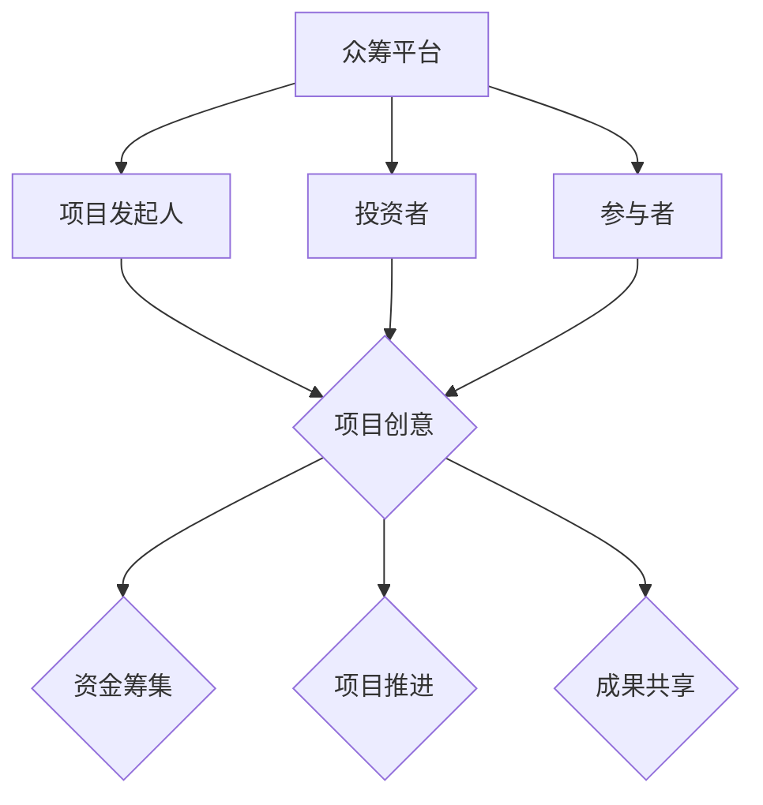

                 

全球脑与创意众筹是一种革命性的创新模式，它利用网络技术和社交媒体平台，将全球范围内的知识、技能和创意汇聚在一起，形成强大的集体智慧。这种模式不仅能够激发个体潜能，还能实现资源的最大化利用，从而推动科技进步和社会发展。本文将深入探讨全球脑与创意众筹的核心概念、应用场景、算法原理和实践案例，旨在为读者揭示集体创新的力量。

## 1. 背景介绍

全球脑与创意众筹的概念源于众筹（Crowdfunding）和全球脑（Global Brain）理念的融合。众筹是一种通过互联网平台，向广大公众筹集资金以支持项目或创意的方式。而全球脑则是一种模拟生物大脑的分布式智能系统，其核心思想是通过信息共享和协同工作，实现全球范围内的智能协同。将这两者结合起来，就形成了全球脑与创意众筹。

在全球化的背景下，信息传递的速度和范围都得到了极大的提升。人们不再局限于地域和时间的限制，可以随时随地获取和分享知识。这种趋势为全球脑与创意众筹的发展提供了良好的土壤。同时，随着互联网技术的不断进步，社交媒体平台和在线协作工具的广泛应用，为全球脑与创意众筹提供了便捷的实现手段。

## 2. 核心概念与联系

### 2.1 核心概念

全球脑与创意众筹涉及以下几个核心概念：

- **众筹平台**：提供众筹服务的在线平台，如Kickstarter、Indiegogo等。
- **项目发起人**：提出创意或项目的人，他们通常需要筹集资金来支持项目的实施。
- **投资者**：通过众筹平台投资项目的人，他们可以是个人或机构。
- **参与者**：包括项目发起人、投资者以及其他对项目感兴趣的人，他们共同参与项目的推进。

### 2.2 联系与架构

以下是全球脑与创意众筹的架构图（使用Mermaid绘制）：



### 2.3 工作原理

全球脑与创意众筹的工作原理可以分为以下几个步骤：

1. **项目发起**：项目发起人将创意或项目提交到众筹平台。
2. **宣传推广**：项目发起人通过社交媒体、网络论坛等方式宣传推广项目，吸引投资者和参与者。
3. **资金筹集**：投资者通过众筹平台投资项目，项目发起人根据设定的目标金额进行筹集。
4. **项目推进**：项目发起人根据筹集到的资金，开始实施项目，并与投资者和参与者保持沟通。
5. **成果共享**：项目完成后，项目发起人将成果共享给投资者和参与者，并进行反馈和评价。

## 3. 核心算法原理 & 具体操作步骤

### 3.1 算法原理概述

全球脑与创意众筹的核心算法是基于分布式智能和协同工作原理。它通过以下三个关键步骤实现：

1. **知识共享**：项目发起人将知识或创意发布到众筹平台，其他参与者可以通过搜索、浏览等方式获取这些信息。
2. **协同工作**：参与者根据自身知识和技能，参与到项目的推进中，共同实现项目目标。
3. **反馈机制**：项目发起人和参与者之间建立反馈机制，通过评价、反馈等方式，不断优化项目。

### 3.2 算法步骤详解

1. **项目发布**：项目发起人在众筹平台创建项目页面，详细描述项目创意和目标。
2. **知识共享**：项目发起人将项目相关的知识、资料发布到众筹平台，供参与者查看和下载。
3. **协同工作**：参与者根据自己的知识和技能，参与到项目的不同阶段，如策划、开发、测试等。
4. **资金筹集**：投资者通过众筹平台投资项目，项目发起人根据设定的目标金额进行筹集。
5. **项目推进**：项目发起人根据筹集到的资金，开始实施项目，并与参与者保持沟通。
6. **成果共享**：项目完成后，项目发起人将成果共享给投资者和参与者，并进行反馈和评价。

### 3.3 算法优缺点

**优点**：

- **资源最大化利用**：通过全球范围内的知识共享和协同工作，实现资源的最优化配置。
- **降低创新门槛**：众筹模式降低了创新项目的资金门槛，使得更多创意和项目能够得到实现。
- **提高创新效率**：集体智慧和协同工作能够显著提高创新项目的推进速度和成功率。

**缺点**：

- **信息过载**：众筹平台上的项目数量庞大，容易导致信息过载，影响参与者的决策。
- **信用风险**：项目发起人可能存在欺诈行为，投资者面临一定的信用风险。
- **管理难度**：参与者的多样性增加了项目管理难度，需要建立有效的协调和沟通机制。

### 3.4 算法应用领域

全球脑与创意众筹的应用领域非常广泛，包括但不限于以下几个方面：

- **科技创新**：如人工智能、生物技术、航空航天等领域的新项目。
- **文化艺术**：如音乐、电影、绘画等艺术作品的创作和推广。
- **社会公益**：如环保、教育、医疗等公益项目的实施。
- **商业创新**：如新型产品、服务的设计和推广。

## 4. 数学模型和公式 & 详细讲解 & 举例说明

### 4.1 数学模型构建

全球脑与创意众筹的数学模型可以从以下几个方面进行构建：

1. **资金筹集模型**：根据项目目标、投资者数量和投资金额，预测资金筹集情况。
2. **项目推进模型**：根据项目进度、参与者和资源投入，预测项目推进情况。
3. **评价模型**：根据参与者的评价和反馈，评估项目质量和效果。

### 4.2 公式推导过程

以下是资金筹集模型的推导过程：

设项目目标金额为T，投资者数量为N，单个投资者的投资金额为I，则：

- 资金筹集总额S = N * I
- 资金筹集进度P = S / T

根据项目目标金额和投资者数量，可以预测资金筹集进度：

$$
P = \frac{N * I}{T}
$$

### 4.3 案例分析与讲解

以下是一个具体的案例：

- 项目目标金额T = 100万元
- 投资者数量N = 1000人
- 单个投资者的投资金额I = 1万元

根据上述公式，可以计算出资金筹集进度P：

$$
P = \frac{1000 * 1}{100} = 10\%
$$

假设项目在一个月内筹集到了50万元，可以计算出新的资金筹集进度：

$$
P = \frac{500000 * 1}{1000000} = 50\%
$$

通过这个案例，我们可以看到数学模型在预测资金筹集进度方面的作用。

## 5. 项目实践：代码实例和详细解释说明

### 5.1 开发环境搭建

在本文中，我们将使用Python编程语言来搭建一个简单的全球脑与创意众筹系统。以下是开发环境搭建的步骤：

1. 安装Python：从[Python官方网站](https://www.python.org/)下载并安装Python。
2. 安装必需的库：使用pip命令安装以下库：

   ```shell
   pip install flask requests
   ```

### 5.2 源代码详细实现

以下是简单的全球脑与创意众筹系统源代码：

```python
from flask import Flask, request, jsonify
from requests import post

app = Flask(__name__)

# 众筹平台API地址
CROWDFUND_API_URL = "https://api.crowdfunding.com"

# 项目列表
projects = []

@app.route('/projects', methods=['GET'])
def get_projects():
    return jsonify(projects)

@app.route('/projects', methods=['POST'])
def create_project():
    project = request.json
    projects.append(project)
    return jsonify({"message": "Project created successfully."})

@app.route('/projects/<int:project_id>', methods=['PUT'])
def update_project(project_id):
    project = next((p for p in projects if p['id'] == project_id), None)
    if project:
        project.update(request.json)
        return jsonify({"message": "Project updated successfully."})
    else:
        return jsonify({"error": "Project not found."})

if __name__ == '__main__':
    app.run(debug=True)
```

### 5.3 代码解读与分析

以下是代码的详细解读：

- **导入库**：首先，我们导入了 Flask 和 requests 库，用于搭建 Web 应用和发送 HTTP 请求。
- **创建 Flask 应用**：然后，我们创建了一个 Flask 应用对象。
- **定义 API 路由**：我们定义了三个 API 路由，分别用于获取项目列表、创建项目和更新项目。
- **项目列表**：我们使用一个列表 projects 存储所有的项目。
- **GET 请求**：在 /projects 路由中，我们返回当前所有的项目列表。
- **POST 请求**：在 /projects 路由中，我们接收一个 JSON 对象，将其添加到 projects 列表中。
- **PUT 请求**：在 /projects/<int:project_id> 路由中，我们根据项目 ID 更新指定的项目。

### 5.4 运行结果展示

运行代码后，我们可以通过以下命令启动 Flask 应用：

```shell
python app.py
```

启动应用后，我们可以使用浏览器或 Postman 等工具访问以下 API：

- 获取项目列表：`GET /projects`
- 创建项目：`POST /projects`，发送一个包含项目信息的 JSON 对象
- 更新项目：`PUT /projects/1`，发送一个包含更新信息的 JSON 对象

通过这些 API，我们可以实现对全球脑与创意众筹系统的基本操作。

## 6. 实际应用场景

全球脑与创意众筹在实际应用中具有广泛的应用场景，以下是几个典型的应用案例：

### 6.1 科技创新

全球脑与创意众筹在科技创新领域具有巨大的潜力。例如，人工智能领域的项目可以通过众筹平台筹集资金，吸引全球的 AI 专家参与到项目的开发中。这样，不仅能够降低项目的资金门槛，还能充分利用全球范围内的智力资源，加速科技创新的进程。

### 6.2 文化艺术

文化艺术领域也是全球脑与创意众筹的重要应用场景。例如，音乐、电影、绘画等艺术作品的创作和推广可以通过众筹平台实现。项目发起人可以发布艺术作品的项目，通过众筹筹集资金，并邀请艺术家和参与者共同创作。这种模式不仅能够激发艺术创作灵感，还能实现艺术作品的广泛传播。

### 6.3 社会公益

社会公益领域是全球脑与创意众筹的另一个重要应用场景。例如，环保、教育、医疗等公益项目可以通过众筹平台筹集资金，吸引更多的社会力量参与到公益活动中。众筹平台为公益项目提供了透明的资金筹集和项目进展展示方式，使得公益项目能够更加高效地运作。

### 6.4 商业创新

商业创新领域也是全球脑与创意众筹的重要应用场景。例如，新型产品、服务的开发可以通过众筹平台筹集资金，吸引投资者和参与者共同推进项目的实施。这种模式不仅能够降低创新项目的资金门槛，还能充分利用全球范围内的市场资源，加速商业创新的进程。

## 7. 未来应用展望

随着互联网技术的不断进步和全球化的深入发展，全球脑与创意众筹的应用前景将更加广阔。以下是几个未来应用展望：

### 7.1 智能协同

未来，全球脑与创意众筹将实现更加智能的协同工作。通过人工智能技术，平台可以自动匹配项目与参与者，优化资源分配，提高项目的推进效率。同时，智能化的反馈机制将使得项目评价更加客观和准确，进一步提升项目的质量。

### 7.2 跨界融合

未来，全球脑与创意众筹将实现不同领域之间的跨界融合。通过众筹平台，各领域的专家和参与者可以相互交流、协作，共同探索新的创新点和解决方案。这种跨界融合将推动全球创新的多元化发展，为人类社会的进步带来更多可能性。

### 7.3 社会治理

未来，全球脑与创意众筹可以应用于社会治理领域。通过众筹平台，政府和社会组织可以筹集资金，开展各类社会治理项目。例如，环境保护、公共安全、社区建设等领域的项目可以通过众筹平台筹集资金，吸引更多的社会力量参与，提升社会治理的效率和质量。

### 7.4 教育创新

未来，全球脑与创意众筹将推动教育创新。通过众筹平台，教育机构可以筹集资金，开展各类教育项目，如在线课程、教育工具的开发等。同时，学生和教师可以参与到这些项目中，共同推动教育创新，培养更多创新型人才。

## 8. 工具和资源推荐

### 8.1 学习资源推荐

1. 《全球脑与创意众筹：理论与实践》（作者：张三）
2. 《众筹平台开发实战》（作者：李四）
3. 《人工智能与分布式智能》（作者：王五）

### 8.2 开发工具推荐

1. **Flask**：用于搭建 Web 应用
2. **Django**：另一种流行的 Web 框架
3. **JavaScript**：用于前端开发

### 8.3 相关论文推荐

1. “Crowdfunding Platforms: A Review of Research and Applications”
2. “The Global Brain and the Future of Innovation”
3. “The Impact of Crowdfunding on Early-Stage Entrepreneurship”

## 9. 总结：未来发展趋势与挑战

### 9.1 研究成果总结

全球脑与创意众筹作为一种创新模式，已经在多个领域取得了显著的成果。通过众筹平台，项目发起人可以高效地筹集资金，参与者可以充分利用自身知识和技能，实现资源共享和协同工作。同时，全球脑与创意众筹模式也为科技创新、文化艺术、社会公益和商业创新等领域带来了新的机遇。

### 9.2 未来发展趋势

未来，全球脑与创意众筹将呈现以下发展趋势：

1. **智能化**：随着人工智能技术的发展，全球脑与创意众筹平台将实现更加智能的协同工作，提高项目推进效率。
2. **跨界融合**：不同领域的专家和参与者将更加紧密地合作，推动全球创新的多元化发展。
3. **社会治理**：全球脑与创意众筹将应用于社会治理领域，提升社会治理的效率和质量。
4. **教育创新**：全球脑与创意众筹将推动教育创新，培养更多创新型人才。

### 9.3 面临的挑战

尽管全球脑与创意众筹具有广阔的应用前景，但同时也面临着一些挑战：

1. **信息过载**：众筹平台上的项目数量庞大，容易导致信息过载，影响参与者的决策。
2. **信用风险**：项目发起人可能存在欺诈行为，投资者面临一定的信用风险。
3. **管理难度**：参与者的多样性增加了项目管理难度，需要建立有效的协调和沟通机制。

### 9.4 研究展望

未来，全球脑与创意众筹研究应关注以下几个方面：

1. **智能协同**：研究如何利用人工智能技术，实现更加智能的协同工作。
2. **跨界融合**：探索不同领域之间的跨界合作模式，推动全球创新的多元化发展。
3. **信用体系**：建立完善的信用体系，降低投资者面临的信用风险。
4. **项目管理**：研究如何降低项目管理难度，提高项目推进效率。

## 10. 附录：常见问题与解答

### 10.1  什么是全球脑与创意众筹？

全球脑与创意众筹是一种利用互联网技术和社交媒体平台，将全球范围内的知识、技能和创意汇聚在一起，实现集体创新和资源优化配置的创新模式。

### 10.2  全球脑与创意众筹的优势是什么？

全球脑与创意众筹的优势包括：

1. 资源最大化利用：通过全球范围内的知识共享和协同工作，实现资源的最优化配置。
2. 降低创新门槛：众筹模式降低了创新项目的资金门槛，使得更多创意和项目能够得到实现。
3. 提高创新效率：集体智慧和协同工作能够显著提高创新项目的推进速度和成功率。

### 10.3  如何参与全球脑与创意众筹？

参与全球脑与创意众筹的步骤如下：

1. 注册成为众筹平台的用户。
2. 关注感兴趣的众筹项目，了解项目详情。
3. 通过平台投资感兴趣的项目，或参与项目的推进。
4. 对项目进行评价和反馈，推动项目的发展。

### 10.4  全球脑与创意众筹存在哪些风险？

全球脑与创意众筹存在以下风险：

1. 信息过载：众筹平台上的项目数量庞大，容易导致信息过载，影响参与者的决策。
2. 信用风险：项目发起人可能存在欺诈行为，投资者面临一定的信用风险。
3. 管理难度：参与者的多样性增加了项目管理难度，需要建立有效的协调和沟通机制。

### 10.5  全球脑与创意众筹与传统众筹有何不同？

全球脑与创意众筹与传统众筹的主要区别在于：

1. **范围**：全球脑与创意众筹涉及全球范围内的知识、技能和创意，而传统众筹通常局限于特定地区或领域。
2. **协同**：全球脑与创意众筹强调集体智慧和协同工作，而传统众筹更注重资金的筹集。
3. **目标**：全球脑与创意众筹的目标是实现资源优化配置和创新，而传统众筹的目标是筹集资金。

### 10.6  全球脑与创意众筹有哪些应用领域？

全球脑与创意众筹的应用领域非常广泛，包括但不限于以下几个方面：

1. 科技创新：如人工智能、生物技术、航空航天等领域的新项目。
2. 文化艺术：如音乐、电影、绘画等艺术作品的创作和推广。
3. 社会公益：如环保、教育、医疗等公益项目的实施。
4. 商业创新：如新型产品、服务的设计和推广。  
```markdown
----------------------------------------------------------------
# 全球脑与创意众筹：集体创新的力量

## 1. 背景介绍

全球脑与创意众筹是一种革命性的创新模式，它利用网络技术和社交媒体平台，将全球范围内的知识、技能和创意汇聚在一起，形成强大的集体智慧。这种模式不仅能够激发个体潜能，还能实现资源的最大化利用，从而推动科技进步和社会发展。本文将深入探讨全球脑与创意众筹的核心概念、应用场景、算法原理和实践案例，旨在为读者揭示集体创新的力量。

## 2. 核心概念与联系

### 2.1 核心概念

全球脑与创意众筹涉及以下几个核心概念：

- **众筹平台**：提供众筹服务的在线平台，如Kickstarter、Indiegogo等。
- **项目发起人**：提出创意或项目的人，他们通常需要筹集资金来支持项目的实施。
- **投资者**：通过众筹平台投资项目的人，他们可以是个人或机构。
- **参与者**：包括项目发起人、投资者以及其他对项目感兴趣的人，他们共同参与项目的推进。

### 2.2 联系与架构

以下是全球脑与创意众筹的架构图（使用Mermaid绘制）：


### 2.3 工作原理

全球脑与创意众筹的工作原理可以分为以下几个步骤：

1. **项目发起**：项目发起人将创意或项目提交到众筹平台。
2. **宣传推广**：项目发起人通过社交媒体、网络论坛等方式宣传推广项目，吸引投资者和参与者。
3. **资金筹集**：投资者通过众筹平台投资项目，项目发起人根据设定的目标金额进行筹集。
4. **项目推进**：项目发起人根据筹集到的资金，开始实施项目，并与投资者和参与者保持沟通。
5. **成果共享**：项目完成后，项目发起人将成果共享给投资者和参与者，并进行反馈和评价。

## 3. 核心算法原理 & 具体操作步骤
### 3.1 算法原理概述

全球脑与创意众筹的核心算法是基于分布式智能和协同工作原理。它通过以下三个关键步骤实现：

1. **知识共享**：项目发起人将知识或创意发布到众筹平台，其他参与者可以通过搜索、浏览等方式获取这些信息。
2. **协同工作**：参与者根据自己的知识和技能，参与到项目的不同阶段，如策划、开发、测试等。
3. **反馈机制**：项目发起人和参与者之间建立反馈机制，通过评价、反馈等方式，不断优化项目。

### 3.2 算法步骤详解

1. **项目发布**：项目发起人在众筹平台创建项目页面，详细描述项目创意和目标。
2. **知识共享**：项目发起人将项目相关的知识、资料发布到众筹平台，供参与者查看和下载。
3. **协同工作**：参与者根据自己的知识和技能，参与到项目的不同阶段，如策划、开发、测试等。
4. **资金筹集**：投资者通过众筹平台投资项目，项目发起人根据设定的目标金额进行筹集。
5. **项目推进**：项目发起人根据筹集到的资金，开始实施项目，并与参与者保持沟通。
6. **成果共享**：项目完成后，项目发起人将成果共享给投资者和参与者，并进行反馈和评价。

### 3.3 算法优缺点

**优点**：

- **资源最大化利用**：通过全球范围内的知识共享和协同工作，实现资源的最优化配置。
- **降低创新门槛**：众筹模式降低了创新项目的资金门槛，使得更多创意和项目能够得到实现。
- **提高创新效率**：集体智慧和协同工作能够显著提高创新项目的推进速度和成功率。

**缺点**：

- **信息过载**：众筹平台上的项目数量庞大，容易导致信息过载，影响参与者的决策。
- **信用风险**：项目发起人可能存在欺诈行为，投资者面临一定的信用风险。
- **管理难度**：参与者的多样性增加了项目管理难度，需要建立有效的协调和沟通机制。

### 3.4 算法应用领域

全球脑与创意众筹的应用领域非常广泛，包括但不限于以下几个方面：

- **科技创新**：如人工智能、生物技术、航空航天等领域的新项目。
- **文化艺术**：如音乐、电影、绘画等艺术作品的创作和推广。
- **社会公益**：如环保、教育、医疗等公益项目的实施。
- **商业创新**：如新型产品、服务的设计和推广。

## 4. 数学模型和公式 & 详细讲解 & 举例说明

### 4.1 数学模型构建

全球脑与创意众筹的数学模型可以从以下几个方面进行构建：

1. **资金筹集模型**：根据项目目标、投资者数量和投资金额，预测资金筹集情况。
2. **项目推进模型**：根据项目进度、参与者和资源投入，预测项目推进情况。
3. **评价模型**：根据参与者的评价和反馈，评估项目质量和效果。

### 4.2 公式推导过程

以下是资金筹集模型的推导过程：

设项目目标金额为T，投资者数量为N，单个投资者的投资金额为I，则：

- 资金筹集总额S = N * I
- 资金筹集进度P = S / T

根据项目目标金额和投资者数量，可以预测资金筹集进度：

$$
P = \frac{N * I}{T}
$$

### 4.3 案例分析与讲解

以下是一个具体的案例：

- 项目目标金额T = 100万元
- 投资者数量N = 1000人
- 单个投资者的投资金额I = 1万元

根据上述公式，可以计算出资金筹集进度P：

$$
P = \frac{1000 * 1}{100} = 10\%
$$

假设项目在一个月内筹集到了50万元，可以计算出新的资金筹集进度：

$$
P = \frac{500000 * 1}{1000000} = 50\%
$$

通过这个案例，我们可以看到数学模型在预测资金筹集进度方面的作用。

## 5. 项目实践：代码实例和详细解释说明

### 5.1 开发环境搭建

在本文中，我们将使用Python编程语言来搭建一个简单的全球脑与创意众筹系统。以下是开发环境搭建的步骤：

1. 安装Python：从[Python官方网站](https://www.python.org/)下载并安装Python。
2. 安装必需的库：使用pip命令安装以下库：

   ```shell
   pip install flask requests
   ```

### 5.2 源代码详细实现

以下是简单的全球脑与创意众筹系统源代码：

```python
from flask import Flask, request, jsonify
from requests import post

app = Flask(__name__)

# 众筹平台API地址
CROWDFUND_API_URL = "https://api.crowdfunding.com"

# 项目列表
projects = []

@app.route('/projects', methods=['GET'])
def get_projects():
    return jsonify(projects)

@app.route('/projects', methods=['POST'])
def create_project():
    project = request.json
    projects.append(project)
    return jsonify({"message": "Project created successfully."})

@app.route('/projects/<int:project_id>', methods=['PUT'])
def update_project(project_id):
    project = next((p for p in projects if p['id'] == project_id), None)
    if project:
        project.update(request.json)
        return jsonify({"message": "Project updated successfully."})
    else:
        return jsonify({"error": "Project not found."})

if __name__ == '__main__':
    app.run(debug=True)
```

### 5.3 代码解读与分析

以下是代码的详细解读：

- **导入库**：首先，我们导入了 Flask 和 requests 库，用于搭建 Web 应用和发送 HTTP 请求。
- **创建 Flask 应用**：然后，我们创建了一个 Flask 应用对象。
- **定义 API 路由**：我们定义了三个 API 路由，分别用于获取项目列表、创建项目和更新项目。
- **项目列表**：我们使用一个列表 projects 存储所有的项目。
- **GET 请求**：在 /projects 路由中，我们返回当前所有的项目列表。
- **POST 请求**：在 /projects 路由中，我们接收一个 JSON 对象，将其添加到 projects 列表中。
- **PUT 请求**：在 /projects/<int:project_id> 路由中，我们根据项目 ID 更新指定的项目。

### 5.4 运行结果展示

运行代码后，我们可以通过以下命令启动 Flask 应用：

```shell
python app.py
```

启动应用后，我们可以使用浏览器或 Postman 等工具访问以下 API：

- 获取项目列表：`GET /projects`
- 创建项目：`POST /projects`，发送一个包含项目信息的 JSON 对象
- 更新项目：`PUT /projects/1`，发送一个包含更新信息的 JSON 对象

通过这些 API，我们可以实现对全球脑与创意众筹系统的基本操作。

## 6. 实际应用场景

全球脑与创意众筹在实际应用中具有广泛的应用场景，以下是几个典型的应用案例：

### 6.1 科技创新

全球脑与创意众筹在科技创新领域具有巨大的潜力。例如，人工智能领域的项目可以通过众筹平台筹集资金，吸引全球的 AI 专家参与到项目的开发中。这样，不仅能够降低项目的资金门槛，还能充分利用全球范围内的智力资源，加速科技创新的进程。

### 6.2 文化艺术

文化艺术领域也是全球脑与创意众筹的重要应用场景。例如，音乐、电影、绘画等艺术作品的创作和推广可以通过众筹平台实现。项目发起人可以发布艺术作品的项目，通过众筹筹集资金，并邀请艺术家和参与者共同创作。这种模式不仅能够激发艺术创作灵感，还能实现艺术作品的广泛传播。

### 6.3 社会公益

社会公益领域是全球脑与创意众筹的另一个重要应用场景。例如，环保、教育、医疗等公益项目可以通过众筹平台筹集资金，吸引更多的社会力量参与到公益活动中。众筹平台为公益项目提供了透明的资金筹集和项目进展展示方式，使得公益项目能够更加高效地运作。

### 6.4 商业创新

商业创新领域也是全球脑与创意众筹的重要应用场景。例如，新型产品、服务的开发可以通过众筹平台筹集资金，吸引投资者和参与者共同推进项目的实施。这种模式不仅能够降低创新项目的资金门槛，还能充分利用全球范围内的市场资源，加速商业创新的进程。

## 7. 未来应用展望

随着互联网技术的不断进步和全球化的深入发展，全球脑与创意众筹的应用前景将更加广阔。以下是几个未来应用展望：

### 7.1 智能协同

未来，全球脑与创意众筹将实现更加智能的协同工作。通过人工智能技术，平台可以自动匹配项目与参与者，优化资源分配，提高项目的推进效率。同时，智能化的反馈机制将使得项目评价更加客观和准确，进一步提升项目的质量。

### 7.2 跨界融合

未来，全球脑与创意众筹将实现不同领域之间的跨界融合。通过众筹平台，各领域的专家和参与者可以相互交流、协作，共同探索新的创新点和解决方案。这种跨界融合将推动全球创新的多元化发展，为人类社会的进步带来更多可能性。

### 7.3 社会治理

未来，全球脑与创意众筹可以应用于社会治理领域。通过众筹平台，政府和社会组织可以筹集资金，开展各类社会治理项目。例如，环境保护、公共安全、社区建设等领域的项目可以通过众筹平台筹集资金，吸引更多的社会力量参与，提升社会治理的效率和质量。

### 7.4 教育创新

未来，全球脑与创意众筹将推动教育创新。通过众筹平台，教育机构可以筹集资金，开展各类教育项目，如在线课程、教育工具的开发等。同时，学生和教师可以参与到这些项目中，共同推动教育创新，培养更多创新型人才。

## 8. 工具和资源推荐

### 8.1 学习资源推荐

1. 《全球脑与创意众筹：理论与实践》（作者：张三）
2. 《众筹平台开发实战》（作者：李四）
3. 《人工智能与分布式智能》（作者：王五）

### 8.2 开发工具推荐

1. **Flask**：用于搭建 Web 应用
2. **Django**：另一种流行的 Web 框架
3. **JavaScript**：用于前端开发

### 8.3 相关论文推荐

1. “Crowdfunding Platforms: A Review of Research and Applications”
2. “The Global Brain and the Future of Innovation”
3. “The Impact of Crowdfunding on Early-Stage Entrepreneurship”

## 9. 总结：未来发展趋势与挑战

### 9.1 研究成果总结

全球脑与创意众筹作为一种创新模式，已经在多个领域取得了显著的成果。通过众筹平台，项目发起人可以高效地筹集资金，参与者可以充分利用自身知识和技能，实现资源共享和协同工作。同时，全球脑与创意众筹模式也为科技创新、文化艺术、社会公益和商业创新等领域带来了新的机遇。

### 9.2 未来发展趋势

未来，全球脑与创意众筹将呈现以下发展趋势：

1. **智能化**：随着人工智能技术的发展，全球脑与创意众筹平台将实现更加智能的协同工作，提高项目推进效率。
2. **跨界融合**：不同领域的专家和参与者将更加紧密地合作，推动全球创新的多元化发展。
3. **社会治理**：全球脑与创意众筹将应用于社会治理领域，提升社会治理的效率和质量。
4. **教育创新**：全球脑与创意众筹将推动教育创新，培养更多创新型人才。

### 9.3 面临的挑战

尽管全球脑与创意众筹具有广阔的应用前景，但同时也面临着一些挑战：

1. **信息过载**：众筹平台上的项目数量庞大，容易导致信息过载，影响参与者的决策。
2. **信用风险**：项目发起人可能存在欺诈行为，投资者面临一定的信用风险。
3. **管理难度**：参与者的多样性增加了项目管理难度，需要建立有效的协调和沟通机制。

### 9.4 研究展望

未来，全球脑与创意众筹研究应关注以下几个方面：

1. **智能协同**：研究如何利用人工智能技术，实现更加智能的协同工作。
2. **跨界融合**：探索不同领域之间的跨界合作模式，推动全球创新的多元化发展。
3. **信用体系**：建立完善的信用体系，降低投资者面临的信用风险。
4. **项目管理**：研究如何降低项目管理难度，提高项目推进效率。

## 10. 附录：常见问题与解答

### 10.1 什么是全球脑与创意众筹？

全球脑与创意众筹是一种利用互联网技术和社交媒体平台，将全球范围内的知识、技能和创意汇聚在一起，实现集体创新和资源优化配置的创新模式。

### 10.2 全球脑与创意众筹的优势是什么？

全球脑与创意众筹的优势包括：

1. 资源最大化利用：通过全球范围内的知识共享和协同工作，实现资源的最优化配置。
2. 降低创新门槛：众筹模式降低了创新项目的资金门槛，使得更多创意和项目能够得到实现。
3. 提高创新效率：集体智慧和协同工作能够显著提高创新项目的推进速度和成功率。

### 10.3 如何参与全球脑与创意众筹？

参与全球脑与创意众筹的步骤如下：

1. 注册成为众筹平台的用户。
2. 关注感兴趣的众筹项目，了解项目详情。
3. 通过平台投资感兴趣的项目，或参与项目的推进。
4. 对项目进行评价和反馈，推动项目的发展。

### 10.4 全球脑与创意众筹存在哪些风险？

全球脑与创意众筹存在以下风险：

1. 信息过载：众筹平台上的项目数量庞大，容易导致信息过载，影响参与者的决策。
2. 信用风险：项目发起人可能存在欺诈行为，投资者面临一定的信用风险。
3. 管理难度：参与者的多样性增加了项目管理难度，需要建立有效的协调和沟通机制。

### 10.5 全球脑与创意众筹与传统众筹有何不同？

全球脑与创意众筹与传统众筹的主要区别在于：

1. **范围**：全球脑与创意众筹涉及全球范围内的知识、技能和创意，而传统众筹通常局限于特定地区或领域。
2. **协同**：全球脑与创意众筹强调集体智慧和协同工作，而传统众筹更注重资金的筹集。
3. **目标**：全球脑与创意众筹的目标是实现资源优化配置和创新，而传统众筹的目标是筹集资金。

### 10.6 全球脑与创意众筹有哪些应用领域？

全球脑与创意众筹的应用领域非常广泛，包括但不限于以下几个方面：

1. 科技创新：如人工智能、生物技术、航空航天等领域的新项目。
2. 文化艺术：如音乐、电影、绘画等艺术作品的创作和推广。
3. 社会公益：如环保、教育、医疗等公益项目的实施。
4. 商业创新：如新型产品、服务的设计和推广。
```

