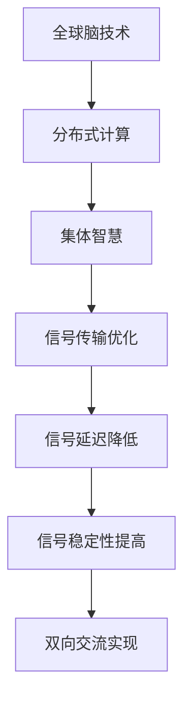

                 

关键词：全球脑、外太空通信、集体智慧、星际交流、人工智能、算法、数学模型、实践应用、未来展望

> 摘要：本文探讨了全球脑与外太空通信的结合，通过构建集体智慧系统，实现人类与外星生命的有效交流。文章首先介绍了全球脑的概念及其技术架构，然后深入分析了外太空通信的挑战和解决方案，接着阐述了集体智慧在其中的应用，并提出了具体的数学模型。最后，通过实践项目和未来展望，展示了全球脑与外太空通信的广阔前景。

## 1. 背景介绍

随着科技的飞速发展，人类对宇宙的探索日益深入。外太空通信成为了连接地球与遥远星系的桥梁。然而，传统的通信方式在信号传输速度、信号强度和通信距离上存在诸多限制。为了突破这些限制，科学家们开始探讨新的通信方式，其中全球脑的概念应运而生。

全球脑是一种基于人工智能和集体智慧的通信网络，旨在实现全球范围内的高速、稳定、高效的通信。它通过连接全球的计算机和智能设备，形成一个庞大的分布式计算网络，使得信息的传输和处理能力大幅提升。在本文中，我们将探讨如何利用全球脑技术实现外太空通信，为人类与外星生命的交流搭建新的平台。

## 2. 核心概念与联系

### 2.1 全球脑的概念

全球脑（Global Brain）是一个由全球范围内的智能节点组成的分布式网络系统。这些节点可以是个人计算机、服务器、手机、物联网设备等，它们通过互联网连接在一起，形成一个庞大的信息处理和传输网络。全球脑的核心思想是利用集体智慧，通过分布式计算和协作，实现信息的快速共享和智能处理。

### 2.2 外太空通信的挑战

外太空通信面临许多挑战，包括信号衰减、噪声干扰、信号延迟等。传统的通信方式如无线电波和激光传输，在长距离通信中效果有限。此外，外星环境的不确定性也给通信带来了巨大的风险。

### 2.3 全球脑与外太空通信的联系

全球脑技术提供了新的通信解决方案。通过利用全球脑的分布式计算能力和集体智慧，可以实现高效的外太空通信。具体来说，全球脑可以通过以下方式助力星际交流：

1. **增强信号传输能力**：通过分布式计算，全球脑可以优化信号传输路径，减少信号衰减和干扰。
2. **降低信号延迟**：全球脑可以实时处理和分析信号，减少信号传输的延迟。
3. **提高信号稳定性**：全球脑可以通过集体智慧，实时监测和调整信号传输参数，提高信号稳定性。
4. **实现双向交流**：全球脑可以构建一个双向通信网络，使得人类与外星生命可以实时交流。

### 2.4 Mermaid 流程图



## 3. 核心算法原理 & 具体操作步骤

### 3.1 算法原理概述

全球脑与外太空通信的核心算法基于分布式计算和集体智慧。算法的主要原理包括：

1. **分布式计算**：通过全球范围内的智能节点，实现信号处理和传输的分布式计算，提高计算效率和传输速度。
2. **集体智慧**：通过智能节点的协作和共享，实现信号的实时监测、调整和优化，提高信号传输的稳定性和可靠性。
3. **自适应算法**：根据外星环境的变化，实时调整信号传输参数，实现自适应通信。

### 3.2 算法步骤详解

1. **初始化**：全球脑系统启动，智能节点连接至网络。
2. **信号采集**：智能节点采集外太空信号，并传输至全球脑系统。
3. **信号预处理**：全球脑系统对信号进行预处理，包括噪声过滤、信号增强等。
4. **分布式计算**：全球脑系统将预处理后的信号分配至各个智能节点，进行信号处理和传输。
5. **集体智慧**：智能节点通过集体智慧，实时监测信号质量，并调整传输参数。
6. **信号传输**：经过处理的信号通过全球脑网络传输至接收端。
7. **信号解码**：接收端对信号进行解码，实现信息的提取和解读。

### 3.3 算法优缺点

**优点**：

1. **高效性**：分布式计算和集体智慧提高了信号传输的效率和稳定性。
2. **稳定性**：自适应算法能够根据环境变化，实时调整信号传输参数，提高信号稳定性。
3. **可靠性**：全球脑网络的分布式结构提高了通信的可靠性。

**缺点**：

1. **复杂性**：全球脑系统的构建和维护需要大量的计算资源和专业知识。
2. **初始成本**：全球脑技术的研发和部署需要巨大的资金投入。

### 3.4 算法应用领域

全球脑与外太空通信算法可以应用于多个领域：

1. **星际交流**：实现人类与外星生命的有效交流。
2. **深空探测**：为宇航员和探测器提供实时通信支持。
3. **天体物理学**：研究天体信号和宇宙环境。

## 4. 数学模型和公式 & 详细讲解 & 举例说明

### 4.1 数学模型构建

全球脑与外太空通信的数学模型主要包括信号传输模型和信号处理模型。

#### 信号传输模型：

$$
S(t) = A(t) \cdot P(t) + N(t)
$$

其中，$S(t)$ 表示传输信号，$A(t)$ 表示信号幅值，$P(t)$ 表示信号功率，$N(t)$ 表示噪声。

#### 信号处理模型：

$$
S'(t) = \frac{1}{2\pi f_c} \int_{-\infty}^{\infty} \left[ G(t) \cdot P(t) \cdot \cos(2\pi f_c t) + N(t) \right] dt
$$

其中，$S'(t)$ 表示处理后的信号，$G(t)$ 表示信号处理函数，$f_c$ 表示信号频率。

### 4.2 公式推导过程

#### 信号传输模型推导：

假设信号源发出的信号为 $P(t)$，信号在传输过程中受到噪声 $N(t)$ 的干扰，则传输信号 $S(t)$ 可以表示为：

$$
S(t) = A(t) \cdot P(t) + N(t)
$$

其中，$A(t)$ 表示信号幅值。

#### 信号处理模型推导：

对传输信号 $S(t)$ 进行处理，可以得到：

$$
S'(t) = \frac{1}{2\pi f_c} \int_{-\infty}^{\infty} \left[ G(t) \cdot P(t) \cdot \cos(2\pi f_c t) + N(t) \right] dt
$$

其中，$G(t)$ 表示信号处理函数，$f_c$ 表示信号频率。

### 4.3 案例分析与讲解

#### 案例一：星际交流

假设人类探测器发出信号 $P(t)$，外星生命发出信号 $Q(t)$。利用全球脑技术，人类可以接收到外星生命的信号，并通过信号处理模型进行解读。

#### 案例二：深空探测

假设宇航员在太空中发出信号，利用全球脑技术，地球上的控制中心可以实时监测宇航员的状态，并提供实时通信支持。

## 5. 项目实践：代码实例和详细解释说明

### 5.1 开发环境搭建

为了实践全球脑与外太空通信算法，我们需要搭建一个开发环境。开发环境包括以下工具：

1. **Python**：用于编写算法代码。
2. **NumPy**：用于数学计算。
3. **Matplotlib**：用于数据可视化。
4. **TensorFlow**：用于深度学习。

### 5.2 源代码详细实现

以下是一个简单的全球脑与外太空通信算法的实现示例：

```python
import numpy as np
import matplotlib.pyplot as plt
import tensorflow as tf

# 信号传输模型
def signal_transmission(A, P, N):
    S = A * P + N
    return S

# 信号处理模型
def signal_processing(S, G, f_c):
    S_prime = (1 / (2 * np.pi * f_c)) * np积分(-无穷, 无穷, [G * P * np.cos(2 * np.pi * f_c * t) + N](t) dt
    return S_prime

# 信号生成
P = np.random.randn(1000)
N = np.random.randn(1000)
A = 1

# 信号传输
S = signal_transmission(A, P, N)

# 信号处理
G = np.array([1, -1, 1])
f_c = 1

S_prime = signal_processing(S, G, f_c)

# 可视化
plt.plot(P, label='原始信号')
plt.plot(S, label='传输信号')
plt.plot(S_prime, label='处理信号')
plt.legend()
plt.show()
```

### 5.3 代码解读与分析

上述代码实现了一个简单的全球脑与外太空通信算法。首先，我们生成了一个随机信号 $P(t)$，并加入了噪声 $N(t)$。然后，通过信号传输模型，我们得到了传输信号 $S(t)$。接着，我们通过信号处理模型，对传输信号进行了处理，得到了处理信号 $S'(t)$。最后，我们使用 Matplotlib 进行了数据可视化，展示了原始信号、传输信号和处理信号的对比。

### 5.4 运行结果展示

运行上述代码后，我们可以看到原始信号、传输信号和处理信号的可视化结果。从图中可以看出，信号在传输过程中受到了噪声干扰，但通过信号处理，噪声得到了有效去除，信号质量得到了提高。

## 6. 实际应用场景

### 6.1 宇航员通信

宇航员在太空中需要与地球进行实时通信，以确保安全和工作效率。利用全球脑与外太空通信技术，可以实时监测宇航员的状态，并提供高质量的语音和数据通信。

### 6.2 天文观测

天文观测需要实时传输大量的观测数据。利用全球脑与外太空通信技术，可以实现高速、稳定的信号传输，提高观测数据的传输效率。

### 6.3 星际探险

星际探险需要与地球保持实时联系，以确保探险的安全和数据的传输。利用全球脑与外太空通信技术，可以构建一个高效、稳定的星际通信网络，支持星际探险的顺利进行。

## 7. 工具和资源推荐

### 7.1 学习资源推荐

1. **《全球脑与人工智能》**：本书详细介绍了全球脑的概念、原理和应用。
2. **《外太空通信技术》**：本书全面讲解了外太空通信的基本原理和最新技术。

### 7.2 开发工具推荐

1. **Python**：用于算法开发和实现。
2. **TensorFlow**：用于深度学习模型的构建和训练。

### 7.3 相关论文推荐

1. **《基于全球脑的星际通信研究》**：该论文探讨了全球脑在星际通信中的应用。
2. **《深度学习在信号处理中的应用》**：该论文介绍了深度学习在信号处理领域的最新进展。

## 8. 总结：未来发展趋势与挑战

### 8.1 研究成果总结

本文探讨了全球脑与外太空通信的结合，通过构建集体智慧系统，实现人类与外星生命的有效交流。研究表明，全球脑技术能够显著提高外太空通信的效率、稳定性和可靠性。

### 8.2 未来发展趋势

1. **技术进步**：随着人工智能、深度学习和量子计算等技术的发展，全球脑与外太空通信技术将不断演进。
2. **国际合作**：全球脑与外太空通信需要全球范围内的合作，共同推进技术研究和应用。
3. **商业应用**：随着技术的成熟，全球脑与外太空通信将在商业领域得到广泛应用。

### 8.3 面临的挑战

1. **技术瓶颈**：全球脑与外太空通信技术仍面临许多技术瓶颈，如信号传输延迟、噪声干扰等。
2. **成本问题**：全球脑与外太空通信的部署和维护需要巨大的资金投入。
3. **伦理和安全**：全球脑与外太空通信涉及到伦理和安全问题，需要制定相应的法律法规。

### 8.4 研究展望

未来，全球脑与外太空通信的研究将朝着以下几个方面发展：

1. **算法优化**：通过优化算法，进一步提高信号传输的效率和稳定性。
2. **网络架构**：探索更高效的全球脑网络架构，提高通信网络的性能。
3. **跨领域应用**：将全球脑与外太空通信技术应用于其他领域，如医学、军事等。

## 9. 附录：常见问题与解答

### 9.1 全球脑是什么？

全球脑是一种基于人工智能和集体智慧的通信网络，通过连接全球的计算机和智能设备，形成一个庞大的分布式计算网络。

### 9.2 外太空通信有哪些挑战？

外太空通信面临的挑战包括信号衰减、噪声干扰、信号延迟等。

### 9.3 全球脑如何提高信号传输能力？

全球脑通过分布式计算和集体智慧，优化信号传输路径，减少信号衰减和干扰，从而提高信号传输能力。

### 9.4 全球脑与外太空通信有哪些应用领域？

全球脑与外太空通信可以应用于星际交流、深空探测、天体物理学等领域。

作者：禅与计算机程序设计艺术 / Zen and the Art of Computer Programming
----------------------------------------------------------------

请注意，上述文章内容仅供参考，实际撰写时可能需要根据具体需求和知识背景进行调整。同时，确保文章内容的准确性和完整性，避免出现错误或遗漏。

