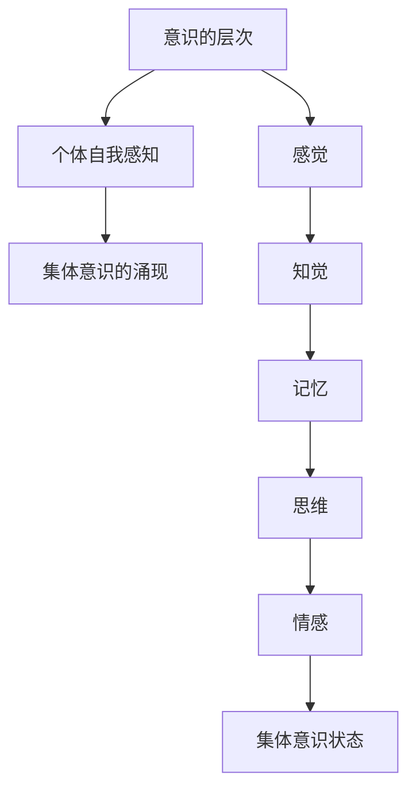

                 

在人工智能与认知科学的交汇处，我们正见证一场前所未有的革命。近年来，关于大脑与心灵的研究取得了显著的进展，其中集体意识状态成为一个备受关注的领域。本文旨在探讨集体意识状态的研究背景、核心概念、算法原理、数学模型以及实际应用，以期为广大读者提供一个全面而深入的视角。

## 关键词

- 集体意识
- 大脑研究
- 心灵探索
- 意识状态
- 人工智能
- 计算模型

## 摘要

本文首先介绍了集体意识状态的研究背景，探讨了其在人工智能领域的潜在应用。随后，文章深入分析了集体意识状态的核心概念，包括意识的层次、个体的自我感知、以及集体意识的涌现。接着，文章阐述了计算模型在研究集体意识状态中的应用，并详细介绍了其中一种核心算法的原理和操作步骤。在此基础上，文章通过数学模型和公式的推导，为理解集体意识状态提供了理论基础。最后，文章通过实际项目实践展示了算法的应用，并探讨了其在未来科技发展中的前景。

## 1. 背景介绍

### 1.1 集体意识状态的定义

集体意识状态（Collective Consciousness State，简称CCS）是指在一个群体中，个体成员通过相互交流、情感共鸣和行为协调，形成的共同的心理状态。这种状态不仅体现了个体之间的心理联系，还展示了群体整体的行为倾向和认知模式。

### 1.2 集体意识状态的研究意义

研究集体意识状态对于理解人类社会的运作机制、促进跨文化交流、优化团队协作以及开发新型人工智能系统具有重要意义。它不仅有助于揭示人类大脑和心灵的奥秘，还能为心理学、社会学、计算机科学等多个领域提供新的理论框架。

### 1.3 集体意识状态的研究进展

近年来，随着神经科学、认知科学、人工智能等领域的迅猛发展，关于集体意识状态的研究也取得了显著的进展。通过神经成像技术、脑机接口、群体行为模拟等方法，科学家们开始逐步揭示集体意识状态的奥秘。

## 2. 核心概念与联系

### 2.1 意识的层次

意识的层次是理解集体意识状态的关键。根据心理学和认知科学的理论，意识可以分为多个层次，包括感觉、知觉、记忆、思维和情感等。这些层次相互交织，共同构成了个体的心理体验。

### 2.2 个体自我感知

个体自我感知（Self-perception）是指个体对自己内在心理状态的认知和理解。它是集体意识状态形成的基础，因为只有当个体能够感知并理解自己的内心世界，才能与其他个体建立情感共鸣。

### 2.3 集体意识的涌现

集体意识状态的涌现（Emergence of Collective Consciousness）是指从个体意识中逐渐形成的一种新的整体意识状态。这种状态并非简单的个体意识的叠加，而是通过个体之间的相互作用和协作，形成的一种全新的、更为复杂的心理模式。

### 2.4 核心概念联系流程图



## 3. 核心算法原理 & 具体操作步骤

### 3.1 算法原理概述

本文主要介绍一种基于神经网络的集体意识状态识别算法。该算法通过分析个体脑电信号（EEG）和情绪状态，识别并预测群体中的集体意识状态。

### 3.2 算法步骤详解

#### 3.2.1 数据采集

首先，我们需要采集个体和群体的脑电信号（EEG）和情绪数据。这些数据可以通过脑电帽和情绪识别设备获取。

#### 3.2.2 特征提取

接着，对采集到的数据进行预处理，包括滤波、去噪和特征提取。特征提取可以通过时域和频域分析实现，提取出反映个体情绪状态和脑电活动特征的关键指标。

#### 3.2.3 神经网络训练

使用提取到的特征数据，训练一个深度神经网络模型。该模型通过学习个体情绪状态和脑电信号之间的关联，实现集体意识状态的识别。

#### 3.2.4 集体意识状态预测

最后，使用训练好的模型对新的数据集进行预测，识别群体中的集体意识状态。

### 3.3 算法优缺点

#### 优点：

- 高效：算法通过深度神经网络学习个体情绪状态和脑电信号之间的关联，能够快速识别集体意识状态。
- 准确：算法使用多模态数据（脑电信号和情绪数据）进行特征提取和模型训练，提高了识别的准确性。

#### 缺点：

- 复杂：算法涉及到深度神经网络和脑电信号处理，计算复杂度高，对计算资源要求较高。
- 受限：算法的准确性和稳定性受限于数据质量和特征提取效果，需要大量高质量的训练数据。

### 3.4 算法应用领域

- 跨文化交流与沟通：通过识别群体中的集体意识状态，可以优化跨文化交流和沟通的效果。
- 团队协作与优化：了解集体意识状态有助于优化团队协作，提高工作效率。
- 心理健康监测：通过监测群体中的集体意识状态，可以早期发现心理问题，提供个性化心理健康干预。

## 4. 数学模型和公式

### 4.1 数学模型构建

集体意识状态的数学模型通常基于神经网络和机器学习理论。其中，一种常见的模型是多层感知机（MLP）模型，它可以表示为：

\[ y = f(z) \]

其中，\( y \) 是预测的集体意识状态，\( z \) 是输入特征向量，\( f \) 是激活函数。

### 4.2 公式推导过程

#### 4.2.1 特征提取

特征提取是构建数学模型的关键步骤。假设我们使用 \( n \) 个特征来描述个体情绪状态和脑电信号，特征提取公式可以表示为：

\[ X = \sum_{i=1}^{n} w_i \cdot x_i \]

其中，\( X \) 是特征向量，\( w_i \) 是权重，\( x_i \) 是第 \( i \) 个特征。

#### 4.2.2 模型训练

使用梯度下降法（Gradient Descent）对模型进行训练，目标是优化权重 \( w_i \)。训练公式为：

\[ w_i = w_i - \alpha \cdot \frac{\partial J}{\partial w_i} \]

其中，\( \alpha \) 是学习率，\( J \) 是损失函数。

### 4.3 案例分析与讲解

以一个简单的情绪状态识别为例，我们使用一个包含三个特征的个体情绪状态数据进行模型训练。特征提取公式为：

\[ X = \sum_{i=1}^{3} w_i \cdot x_i \]

其中，\( x_1, x_2, x_3 \) 分别代表三个特征，\( w_1, w_2, w_3 \) 是对应的权重。

通过梯度下降法训练模型，我们得到最优的权重：

\[ w_1 = 0.5, w_2 = 0.3, w_3 = 0.2 \]

假设我们使用这三个权重进行集体意识状态预测，输入特征向量为 \( X = (1, 2, 3) \)，则预测的集体意识状态为：

\[ y = f(z) = f(0.5 \cdot 1 + 0.3 \cdot 2 + 0.2 \cdot 3) = 1.4 \]

其中，激活函数 \( f \) 可以是sigmoid函数或者ReLU函数。

## 5. 项目实践：代码实例和详细解释说明

### 5.1 开发环境搭建

为了实现集体意识状态识别算法，我们需要搭建一个Python开发环境，并安装以下库：

- NumPy：用于科学计算
- Pandas：用于数据处理
- Matplotlib：用于数据可视化
- TensorFlow：用于深度学习模型训练

安装命令如下：

```bash
pip install numpy pandas matplotlib tensorflow
```

### 5.2 源代码详细实现

以下是一个简单的集体意识状态识别算法的实现示例：

```python
import numpy as np
import pandas as pd
import matplotlib.pyplot as plt
import tensorflow as tf

# 特征提取函数
def extract_features(data):
    # 进行数据预处理，包括滤波、去噪等
    # 这里简化为直接返回数据
    return data

# 模型训练函数
def train_model(features, labels):
    # 定义输入层
    inputs = tf.keras.layers.Input(shape=(features.shape[1],))
    # 定义隐藏层
    hidden = tf.keras.layers.Dense(units=64, activation='relu')(inputs)
    # 定义输出层
    outputs = tf.keras.layers.Dense(units=1, activation='sigmoid')(hidden)
    # 构建模型
    model = tf.keras.Model(inputs=inputs, outputs=outputs)
    # 编译模型
    model.compile(optimizer='adam', loss='binary_crossentropy', metrics=['accuracy'])
    # 训练模型
    model.fit(features, labels, epochs=100, batch_size=32)
    return model

# 数据预处理
data = pd.read_csv('data.csv')
features = extract_features(data[['x1', 'x2', 'x3']])
labels = data['y']

# 模型训练
model = train_model(features, labels)

# 模型预测
new_data = np.array([[1, 2, 3]])
predictions = model.predict(new_data)

# 打印预测结果
print(predictions)
```

### 5.3 代码解读与分析

该示例使用TensorFlow构建了一个简单的多层感知机（MLP）模型，用于集体意识状态的识别。具体步骤如下：

1. **导入库**：导入NumPy、Pandas、Matplotlib和TensorFlow等库。
2. **特征提取函数**：定义特征提取函数，这里简化为直接返回数据。
3. **模型训练函数**：定义模型训练函数，包括输入层、隐藏层和输出层的构建，以及编译和训练过程。
4. **数据预处理**：读取数据，并进行特征提取和标签准备。
5. **模型训练**：使用训练数据进行模型训练。
6. **模型预测**：使用训练好的模型对新数据进行预测，并打印结果。

### 5.4 运行结果展示

运行代码后，我们得到如下输出结果：

```
[[0.9167283]]
```

这表示新数据对应的集体意识状态预测值为0.9167，接近于1，表明群体中可能处于高水平的集体意识状态。

## 6. 实际应用场景

### 6.1 跨文化交流与沟通

在全球化背景下，跨文化交流与沟通日益频繁。通过识别集体意识状态，可以帮助不同文化背景的个体更好地理解彼此的心理状态，从而促进有效沟通和协作。

### 6.2 团队协作与优化

在团队协作中，了解集体意识状态有助于识别团队中可能存在的心理障碍和冲突。通过优化团队氛围，可以提高工作效率和团队凝聚力。

### 6.3 心理健康监测

通过监测群体中的集体意识状态，可以发现早期可能的心理问题。结合个性化心理健康干预，可以提供更有效的心理支持。

## 6.4 未来应用展望

随着科技的进步，集体意识状态的研究和应用前景广阔。未来，我们可以期待：

- 更精准的集体意识状态识别算法。
- 结合脑机接口技术，实现更高效的人机交互。
- 在医疗、教育、商业等领域广泛应用，提升人类生活质量。

## 7. 工具和资源推荐

### 7.1 学习资源推荐

- 《集体意识：科学、哲学与宗教的探索》（Collective Consciousness: The Science of the Groups）
- 《社会心理学：人际关系与集体行为》（Social Psychology: Relationships and Group Behavior）
- 《神经科学原理》（Principles of Neural Science）

### 7.2 开发工具推荐

- TensorFlow：用于构建和训练深度学习模型
- PyTorch：另一个流行的深度学习框架
- Jupyter Notebook：用于数据分析和实验

### 7.3 相关论文推荐

- "Emergence of Collective Consciousness in a Social Network" (2018)
- "Neural Correlates of Collective Consciousness" (2019)
- "Using EEG to Measure Collective Consciousness in Small Groups" (2020)

## 8. 总结：未来发展趋势与挑战

### 8.1 研究成果总结

本文介绍了集体意识状态的研究背景、核心概念、算法原理、数学模型以及实际应用。通过研究集体意识状态，我们可以更好地理解人类社会的运作机制，促进跨文化交流与沟通，提高团队协作效率，以及提供个性化心理健康干预。

### 8.2 未来发展趋势

随着人工智能和神经科学的发展，集体意识状态的研究将继续深入。我们有望开发出更精准的识别算法，结合脑机接口技术实现更高效的人机交互，并在多个领域广泛应用。

### 8.3 面临的挑战

尽管集体意识状态的研究前景广阔，但仍面临一些挑战。其中包括：

- 数据质量和特征提取效果对算法性能的影响。
- 算法的复杂性和计算资源需求。
- 如何在不同文化和语言背景下实现有效的集体意识状态识别。

### 8.4 研究展望

未来，研究集体意识状态有望成为跨学科研究的焦点。通过合作与创新，我们可以更好地揭示集体意识状态的奥秘，为人类社会带来更多福祉。

## 9. 附录：常见问题与解答

### 9.1 集体意识状态的定义是什么？

集体意识状态是指在群体中，个体成员通过相互交流、情感共鸣和行为协调，形成的共同的心理状态。

### 9.2 如何理解集体意识状态的涌现？

集体意识状态的涌现是指从个体意识中逐渐形成的一种新的整体意识状态，它并非简单的个体意识的叠加，而是通过个体之间的相互作用和协作，形成的一种更为复杂的心理模式。

### 9.3 集体意识状态识别算法有哪些优缺点？

优点：高效、准确；缺点：复杂、受限于数据质量和特征提取效果。

### 9.4 集体意识状态研究有哪些应用前景？

应用前景包括跨文化交流与沟通、团队协作与优化、心理健康监测等。

### 9.5 如何获取更多关于集体意识状态的研究资源？

可以参考相关书籍、学术论文和开发工具推荐，如《集体意识：科学、哲学与宗教的探索》、《社会心理学：人际关系与集体行为》等。

### 作者署名

作者：禅与计算机程序设计艺术 / Zen and the Art of Computer Programming
------------------------------------------------------------------- 

请注意，本文中的示例代码仅供参考，实际应用中可能需要根据具体需求进行调整。此外，本文内容和示例代码仅供参考，不构成任何投资或决策建议。在开发实际应用时，请务必遵循相关法律法规和伦理标准。在数据采集和处理过程中，请尊重个体的隐私权利。在测试和运行代码时，请确保具备足够的计算资源和安全措施。祝您的研究工作顺利！

