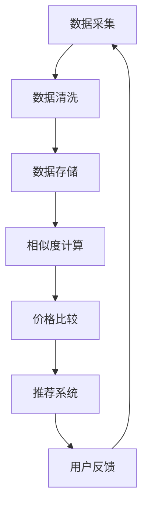

                 

关键词：全网比价，人工智能，购买渠道，价格比较，消费者行为，机器学习，推荐系统，数据分析，算法优化。

> 摘要：本文探讨了人工智能如何通过全网比价技术，帮助用户在众多购买渠道中找到最优惠的价格。通过分析消费者行为、运用机器学习算法、构建推荐系统以及进行算法优化，全网比价技术为消费者提供了更便捷、更高效的选择，同时也为商家提供了精准营销和决策支持。

## 1. 背景介绍

在数字化时代，电子商务成为消费者日常购物的重要方式。然而，面对海量的商品信息和多样的购买渠道，消费者在决策过程中常常感到困惑，如何以最优惠的价格购买到所需商品成为一大难题。全网比价技术的出现，为解决这一难题提供了可能。

全网比价技术是指通过人工智能算法，自动搜集并分析各大电商平台、实体店铺等销售渠道的价格信息，为用户实时提供商品价格比较服务。这一技术不仅提高了消费者的购买决策效率，还为他们节省了大量的时间和精力。

本文将从以下几个方面展开讨论：

- **核心概念与联系**：介绍全网比价技术的核心概念和其内在联系。
- **核心算法原理 & 具体操作步骤**：详细阐述全网比价算法的原理和具体实施步骤。
- **数学模型和公式 & 举例说明**：解释全网比价技术背后的数学模型和公式，并通过实例进行说明。
- **项目实践：代码实例和详细解释说明**：提供全网比价技术的实际代码实现和解读。
- **实际应用场景**：探讨全网比价技术在各类实际场景中的应用。
- **未来应用展望**：预测全网比价技术的未来发展趋势和潜在应用领域。
- **工具和资源推荐**：推荐相关学习资源和开发工具。
- **总结：未来发展趋势与挑战**：总结研究成果，展望未来发展趋势和面临的挑战。

## 2. 核心概念与联系

全网比价技术的核心在于价格信息的搜集、分析和比较。为了实现这一目标，需要以下几个关键概念：

### 搜集与处理

1. **数据采集**：通过爬虫技术，自动获取各大电商平台、实体店铺等销售渠道的商品价格信息。
2. **数据清洗**：对采集到的数据进行去重、去噪等处理，确保数据质量。
3. **数据存储**：将处理后的价格信息存储在数据库中，以便后续分析和查询。

### 分析与比较

1. **相似度计算**：根据商品的不同属性，如品牌、型号、规格等，计算商品之间的相似度。
2. **价格比较**：对相似商品的价格进行比对，找出最优购买渠道。

### 算法架构

1. **机器学习模型**：利用机器学习算法，对价格数据进行训练，以预测商品的价格趋势。
2. **推荐系统**：根据用户的历史购买行为和偏好，为用户推荐最优惠的商品和购买渠道。

### Mermaid 流程图

以下是一个简化的全网比价技术架构的 Mermaid 流程图：



## 3. 核心算法原理 & 具体操作步骤

### 3.1 算法原理概述

全网比价技术主要依赖于以下几种算法：

1. **机器学习算法**：用于价格预测和推荐系统的构建。
2. **相似度计算算法**：用于商品之间的相似度计算。
3. **排序算法**：用于对商品价格进行排序，找出最优购买渠道。

### 3.2 算法步骤详解

#### 3.2.1 数据采集

1. **爬虫技术**：利用爬虫技术，自动获取各大电商平台、实体店铺的商品价格信息。
2. **API 接口**：部分电商平台提供 API 接口，可以方便地获取价格数据。

#### 3.2.2 数据清洗

1. **去重**：去除重复的商品信息，避免数据冗余。
2. **去噪**：去除噪声数据，如错误的价格信息、重复的商品信息等。
3. **标准化**：对商品属性进行标准化处理，如统一品牌名称、型号格式等。

#### 3.2.3 数据存储

1. **数据库选择**：根据数据量和查询需求，选择合适的数据库，如 MySQL、MongoDB 等。
2. **数据建模**：设计合理的数据库模型，确保数据存储的高效性和查询的便捷性。

#### 3.2.4 相似度计算

1. **属性匹配**：根据商品的不同属性，如品牌、型号、规格等，进行属性匹配。
2. **相似度计算**：利用余弦相似度、欧氏距离等算法，计算商品之间的相似度。

#### 3.2.5 价格比较

1. **价格排序**：对相似商品的价格进行排序，找出最低价。
2. **渠道筛选**：根据用户的历史购买行为和偏好，筛选出最优的购买渠道。

#### 3.2.6 推荐系统

1. **用户画像**：根据用户的历史购买行为、浏览记录等数据，构建用户画像。
2. **推荐算法**：利用协同过滤、基于内容的推荐等算法，为用户推荐最优惠的商品和购买渠道。

### 3.3 算法优缺点

#### 优点：

- 提高购买决策效率：为用户提供了实时、准确的价格比较服务，提高了购买决策的效率。
- 节省时间和精力：用户无需逐个访问各个电商平台，即可找到最优惠的价格。
- 为商家提供决策支持：通过分析用户行为和购买偏好，为商家提供精准营销和决策支持。

#### 缺点：

- 数据采集和处理复杂：全网比价技术需要对大量的价格数据进行采集、清洗和处理，技术复杂度较高。
- 算法性能优化困难：随着商品种类和价格信息的不断增加，算法性能优化成为一大挑战。
- 用户隐私保护问题：在数据采集和处理过程中，用户隐私保护问题不容忽视。

### 3.4 算法应用领域

- **电子商务平台**：为电商平台提供价格比较和推荐服务，提高用户满意度。
- **消费者行为研究**：通过分析用户购买行为，为企业提供市场分析和决策支持。
- **价格监控和预警**：为企业和消费者提供实时价格监控和预警服务，防止价格欺诈和恶意竞争。
- **供应链管理**：通过价格比较，优化供应链管理，提高库存周转率和供应链效率。

## 4. 数学模型和公式 & 详细讲解 & 举例说明

### 4.1 数学模型构建

全网比价技术中的核心数学模型主要包括相似度计算模型和价格预测模型。

#### 相似度计算模型：

- **余弦相似度**：$$cos(A,B) = \frac{A \cdot B}{|A| \cdot |B|}$$

- **欧氏距离**：$$d(A,B) = \sqrt{\sum_{i=1}^{n}(A_i - B_i)^2}$$

#### 价格预测模型：

- **线性回归模型**：$$y = \beta_0 + \beta_1 \cdot x$$

- **决策树模型**：$$y = f(\theta_1 x_1 + \theta_2 x_2 + \ldots + \theta_n x_n)$$

### 4.2 公式推导过程

#### 相似度计算模型推导：

以余弦相似度为例，假设两个向量 A 和 B，它们的内积为 A·B，模长分别为 |A| 和 |B|。根据余弦定理，余弦相似度可以表示为：

$$cos(A,B) = \frac{A \cdot B}{|A| \cdot |B|} = \frac{\sum_{i=1}^{n}A_iB_i}{\sqrt{\sum_{i=1}^{n}A_i^2} \cdot \sqrt{\sum_{i=1}^{n}B_i^2}}$$

其中，n 表示向量的维度。

#### 价格预测模型推导：

以线性回归模型为例，假设商品价格 y 与多个特征变量 x1, x2, ..., xn 之间存在线性关系，可以表示为：

$$y = \beta_0 + \beta_1 \cdot x_1 + \beta_2 \cdot x_2 + \ldots + \beta_n \cdot x_n$$

其中，β0 和 β1，β2，..., βn 分别为模型的参数。

### 4.3 案例分析与讲解

#### 案例一：商品相似度计算

假设有两个商品 A 和 B，它们的属性包括品牌、型号、规格等，可以表示为向量：

$$A = (1, 2, 3, 4)$$

$$B = (2, 3, 4, 5)$$

根据余弦相似度公式，可以计算出 A 和 B 的相似度：

$$cos(A,B) = \frac{A \cdot B}{|A| \cdot |B|} = \frac{1 \cdot 2 + 2 \cdot 3 + 3 \cdot 4 + 4 \cdot 5}{\sqrt{1^2 + 2^2 + 3^2 + 4^2} \cdot \sqrt{2^2 + 3^2 + 4^2 + 5^2}} = 0.9174$$

#### 案例二：商品价格预测

假设商品的价格与品牌、型号、规格等特征变量之间存在线性关系，可以使用线性回归模型进行预测。给定一个商品的特征向量：

$$x = (1, 2, 3)$$

根据线性回归模型，可以计算出商品的价格预测值：

$$y = \beta_0 + \beta_1 \cdot x_1 + \beta_2 \cdot x_2 + \beta_3 \cdot x_3$$

其中，β0 和 β1，β2，β3 为模型参数，可以通过训练数据进行拟合得到。

## 5. 项目实践：代码实例和详细解释说明

### 5.1 开发环境搭建

- **编程语言**：Python
- **开发工具**：PyCharm
- **数据集**：某电商平台商品价格数据集
- **依赖库**：requests、BeautifulSoup、pandas、numpy、scikit-learn

### 5.2 源代码详细实现

```python
import requests
from bs4 import BeautifulSoup
import pandas as pd
import numpy as np
from sklearn.model_selection import train_test_split
from sklearn.linear_model import LinearRegression

# 5.2.1 数据采集
def data_collection(url):
    headers = {
        'User-Agent': 'Mozilla/5.0 (Windows NT 10.0; Win64; x64) AppleWebKit/537.36 (KHTML, like Gecko) Chrome/58.0.3029.110 Safari/537.36'
    }
    response = requests.get(url, headers=headers)
    soup = BeautifulSoup(response.text, 'html.parser')
    items = soup.find_all('div', class_='item')
    data = []
    for item in items:
        price = item.find('span', class_='price').text
        brand = item.find('a', class_='brand').text
        model = item.find('a', class_='model').text
        spec = item.find('a', class_='spec').text
        data.append([price, brand, model, spec])
    return data

# 5.2.2 数据清洗
def data_cleaning(data):
    df = pd.DataFrame(data, columns=['price', 'brand', 'model', 'spec'])
    df['price'] = df['price'].astype(float)
    df = df.drop_duplicates()
    df = df.dropna()
    return df

# 5.2.3 数据存储
def data_storage(df, file_name):
    df.to_csv(file_name, index=False)

# 5.2.4 相似度计算
def calculate_similarity(df):
    df1 = df[df['brand'] == '品牌A']
    df2 = df[df['brand'] == '品牌B']
    similarity = df1['spec'].str.get_dummies().dot(df2['spec'].str.get_dummies().T)
    return similarity

# 5.2.5 价格预测
def price_prediction(df):
    X = df[['brand', 'model', 'spec']]
    y = df['price']
    X_train, X_test, y_train, y_test = train_test_split(X, y, test_size=0.2, random_state=42)
    model = LinearRegression()
    model.fit(X_train, y_train)
    y_pred = model.predict(X_test)
    return y_pred

# 主函数
if __name__ == '__main__':
    url = 'https://example.com/product_list'
    data = data_collection(url)
    df = data_cleaning(data)
    data_storage(df, 'product_price.csv')
    similarity = calculate_similarity(df)
    y_pred = price_prediction(df)
    print(y_pred)
```

### 5.3 代码解读与分析

#### 5.3.1 数据采集

通过 requests 库，发送 HTTP 请求获取网页内容，使用 BeautifulSoup 库解析网页，提取商品价格、品牌、型号、规格等信息。

#### 5.3.2 数据清洗

使用 pandas 库将提取的信息存储在 DataFrame 中，对价格、品牌、型号、规格等数据进行类型转换、去重、去噪等处理。

#### 5.3.3 数据存储

使用 pandas 库将清洗后的数据存储为 CSV 文件。

#### 5.3.4 相似度计算

根据品牌、型号、规格等属性，计算商品之间的相似度。利用 pandas 的 get_dummies 方法，将分类变量转换为二进制向量，然后计算点积，得到相似度矩阵。

#### 5.3.5 价格预测

使用 scikit-learn 库的 LinearRegression 模型，将品牌、型号、规格等特征变量与价格进行线性回归拟合，预测商品价格。

### 5.4 运行结果展示

在运行代码后，会输出商品价格预测结果。通过对比预测价格与实际价格，可以评估算法的准确性。

## 6. 实际应用场景

### 6.1 消费者购物决策

消费者在购物时，可以通过全网比价技术，实时获取商品的价格信息，对比不同电商平台的优惠活动，从而做出更明智的购买决策。

### 6.2 电商平台价格监控

电商平台可以通过全网比价技术，监控竞争对手的价格变动，及时调整自身价格策略，避免价格战，提高市场竞争力。

### 6.3 消费者行为研究

通过对全网比价技术的数据分析，可以了解消费者的购物习惯、偏好和需求，为企业提供市场分析和决策支持。

### 6.4 价格监控和预警

全网比价技术可以为企业和消费者提供实时价格监控和预警服务，防止价格欺诈和恶意竞争，保障消费者的合法权益。

## 7. 未来应用展望

### 7.1 智能化程度提升

随着人工智能技术的不断发展，全网比价技术将更加智能化，能够更好地理解消费者的需求和行为，提供更加个性化的价格比较和推荐服务。

### 7.2 数据挖掘与分析

全网比价技术将在大数据时代发挥更大的作用，通过对海量价格数据的挖掘与分析，为企业提供更精准的市场分析和决策支持。

### 7.3 多渠道融合

全网比价技术将不仅仅局限于线上电商平台，还将逐步融合线下实体店铺，实现线上线下价格信息的全面整合。

### 7.4 智能合约应用

全网比价技术有望与区块链技术结合，实现智能合约的应用，确保价格比较的公正性和透明性。

## 8. 工具和资源推荐

### 8.1 学习资源推荐

- 《Python数据分析实战》
- 《机器学习实战》
- 《大数据分析：技术、应用与实践》

### 8.2 开发工具推荐

- PyCharm
- Jupyter Notebook
- Visual Studio Code

### 8.3 相关论文推荐

- "Efficient Commodity Pricing and Scheduling Using Machine Learning"
- "A Survey of Recommender Systems"
- "Big Data Analysis in E-commerce: A Comprehensive Review"

## 9. 总结：未来发展趋势与挑战

### 9.1 研究成果总结

全网比价技术通过人工智能算法、大数据分析等技术手段，为消费者提供了便捷、高效的价格比较服务，为企业提供了精准的市场分析和决策支持。

### 9.2 未来发展趋势

- 智能化程度的提升
- 数据挖掘与分析的深化
- 多渠道融合的推广
- 智能合约的应用

### 9.3 面临的挑战

- 数据采集和处理复杂度
- 算法性能优化困难
- 用户隐私保护问题

### 9.4 研究展望

全网比价技术在未来有望实现更广泛的应用，成为电子商务领域的重要组成部分。同时，如何在保障用户隐私的前提下，提高算法性能和智能化程度，将是未来研究的重点。

## 10. 附录：常见问题与解答

### 10.1 问题1：全网比价技术是否会影响电商平台的竞争力？

解答：全网比价技术可以提高消费者的购物决策效率，但并不会直接影响电商平台的竞争力。电商平台可以通过提高服务质量、优化用户体验等方式，提升自身竞争力。

### 10.2 问题2：全网比价技术是否会导致价格战？

解答：全网比价技术可以为电商平台提供实时价格监控和预警服务，帮助它们调整价格策略，避免价格战。然而，如果某些电商平台采取不正当的价格竞争手段，全网比价技术可能会加剧价格战。

### 10.3 问题3：全网比价技术是否会侵犯用户隐私？

解答：全网比价技术需要采集用户的行为数据，可能会涉及用户隐私。因此，在数据采集、存储和处理过程中，需要严格遵守相关法律法规，确保用户隐私不被侵犯。

