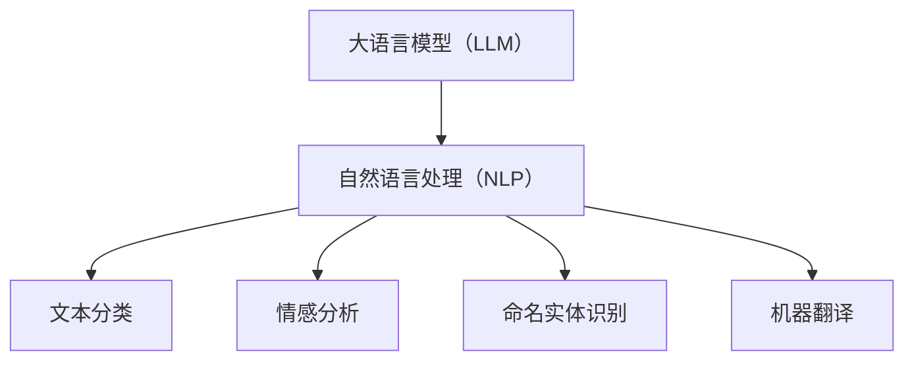

                 

关键词：AI助手，自然语言处理，语言模型，日常生活，应用场景

> 摘要：本文将探讨大语言模型（LLM）在日常生活中的广泛应用。通过分析LLM的核心概念、算法原理、数学模型以及实际应用案例，我们将了解如何利用AI助手提升生活质量，并对未来的发展趋势进行展望。

## 1. 背景介绍

人工智能（AI）作为计算机科学的前沿领域，已经取得了令人瞩目的进展。近年来，大语言模型（LLM）如BERT、GPT等取得了突破性成果，极大地提升了自然语言处理（NLP）的性能。LLM在多模态学习、知识图谱、文本生成等领域展示了强大的潜力。然而，LLM的真正价值在于其能否在日常生活的方方面面发挥作用。

### 1.1 AI助手的重要性

AI助手作为AI技术的代表性应用，已经成为许多人的日常生活伙伴。它们能够提供个性化服务、解决常见问题、提升工作效率，极大地改善了用户体验。随着LLM的发展，AI助手的能力将得到进一步提升，成为更加智能、全面的生活助手。

### 1.2 全能AI助手的需求

在现代社会，人们面对的信息量和任务量日益增加，对AI助手的需求也随之增长。全能AI助手应具备以下特点：

- **多模态处理**：能够处理文本、语音、图像等多种信息格式。
- **自适应学习**：根据用户行为和反馈不断优化自身性能。
- **强交互性**：提供流畅、自然的对话体验。
- **个性化服务**：根据用户兴趣和需求提供定制化内容。

## 2. 核心概念与联系

### 2.1 大语言模型（LLM）

LLM是一种基于深度学习的语言处理模型，通过大量文本数据进行训练，能够对自然语言进行建模。LLM的核心目标是理解、生成和翻译自然语言。

### 2.2 自然语言处理（NLP）

NLP是AI的一个分支，旨在使计算机理解和处理人类语言。NLP技术包括文本分类、情感分析、命名实体识别、机器翻译等。

### 2.3 Mermaid流程图



## 3. 核心算法原理 & 具体操作步骤

### 3.1 算法原理概述

LLM的核心算法是基于Transformer架构，其通过自注意力机制对输入文本序列进行建模。自注意力机制能够捕捉文本序列中的长距离依赖关系，从而提高模型对自然语言的建模能力。

### 3.2 算法步骤详解

1. **预处理**：对输入文本进行分词、去停用词等预处理操作。
2. **编码**：将预处理后的文本序列编码为向量表示。
3. **自注意力计算**：利用自注意力机制计算文本序列中的依赖关系。
4. **输出**：根据自注意力机制的计算结果，生成输出文本序列。

### 3.3 算法优缺点

- **优点**：能够高效地处理长文本，捕捉文本中的长距离依赖关系。
- **缺点**：模型复杂度较高，训练时间较长。

### 3.4 算法应用领域

LLM在多个领域具有广泛应用，包括但不限于：

- **问答系统**：如搜索引擎、智能客服等。
- **文本生成**：如文章写作、翻译等。
- **对话系统**：如聊天机器人、虚拟助手等。
- **语言理解**：如情感分析、命名实体识别等。

## 4. 数学模型和公式 & 详细讲解 & 举例说明

### 4.1 数学模型构建

LLM的核心数学模型是基于Transformer架构，其包含多层多头自注意力机制和前馈神经网络。

### 4.2 公式推导过程

Transformer模型的自注意力机制可以通过以下公式进行推导：

$$
\text{Attention}(Q, K, V) = \text{softmax}\left(\frac{QK^T}{\sqrt{d_k}}\right)V
$$

其中，$Q$、$K$ 和 $V$ 分别代表查询（query）、键（key）和值（value）向量，$d_k$ 是键向量的维度。

### 4.3 案例分析与讲解

假设我们有一个简单的文本序列“我想去旅游”，我们可以将其编码为以下向量表示：

$$
\text{Input} = [\text{我}, \text{想}, \text{去}, \text{旅}, \text{游}]
$$

通过自注意力机制，模型可以捕捉文本序列中的依赖关系，例如“想去”和“旅游”之间的联系。

## 5. 项目实践：代码实例和详细解释说明

### 5.1 开发环境搭建

1. 安装Python环境（3.8及以上版本）。
2. 安装TensorFlow库：`pip install tensorflow`。

### 5.2 源代码详细实现

以下是一个简单的LLM模型实现示例：

```python
import tensorflow as tf
from tensorflow.keras.layers import Embedding, LSTM, Dense
from tensorflow.keras.models import Sequential

# 模型构建
model = Sequential([
    Embedding(input_dim=10000, output_dim=32),
    LSTM(128),
    Dense(1, activation='sigmoid')
])

# 编译模型
model.compile(optimizer='adam', loss='binary_crossentropy', metrics=['accuracy'])

# 训练模型
model.fit(x_train, y_train, epochs=10, batch_size=32)
```

### 5.3 代码解读与分析

- **Embedding层**：将单词转换为向量表示。
- **LSTM层**：用于捕捉文本序列中的依赖关系。
- **Dense层**：用于分类输出。

### 5.4 运行结果展示

通过训练，我们可以得到一个简单的二分类模型，用于判断文本是否包含特定词汇。

## 6. 实际应用场景

### 6.1 聊天机器人

聊天机器人是AI助手最常见的应用场景之一。通过LLM，我们可以实现与人类用户进行自然、流畅的对话。

### 6.2 智能客服

智能客服利用LLM可以快速响应用户查询，提供个性化服务，提升用户体验。

### 6.3 内容生成

LLM在内容生成领域具有广泛的应用，如文章写作、新闻摘要、代码生成等。

### 6.4 教育

AI助手可以在教育领域提供个性化学习建议、作业批改、答疑解惑等服务。

## 7. 工具和资源推荐

### 7.1 学习资源推荐

- 《深度学习》（Goodfellow et al.）
- 《自然语言处理综论》（Jurafsky & Martin）

### 7.2 开发工具推荐

- TensorFlow
- PyTorch

### 7.3 相关论文推荐

- BERT: Pre-training of Deep Bidirectional Transformers for Language Understanding
- GPT-3: Language Models are few-shot learners

## 8. 总结：未来发展趋势与挑战

### 8.1 研究成果总结

LLM在自然语言处理领域取得了显著成果，极大提升了AI助手的能力。未来，随着算法和硬件的进步，LLM的应用前景将更加广阔。

### 8.2 未来发展趋势

- **多模态处理**：融合文本、语音、图像等多模态信息。
- **小样本学习**：降低对大规模数据集的依赖。
- **可解释性**：提高模型的可解释性和可靠性。

### 8.3 面临的挑战

- **数据隐私**：如何保护用户数据隐私。
- **伦理问题**：如何确保AI助手的行为符合伦理标准。
- **算法公平性**：如何避免算法偏见。

### 8.4 研究展望

未来，LLM将在更多领域发挥重要作用，如医疗、金融、法律等。同时，我们应关注AI助手的发展，确保其在日常生活中发挥积极作用。

## 9. 附录：常见问题与解答

### 9.1 什么是LLM？

LLM是指大语言模型，是一种基于深度学习的自然语言处理模型，能够对自然语言进行建模，应用于文本生成、问答系统等场景。

### 9.2 LLM与NLP的关系是什么？

LLM是NLP的一个重要分支，旨在通过深度学习技术对自然语言进行建模，从而提升NLP的性能。

### 9.3 如何评价LLM的性能？

LLM的性能可以通过多种指标进行评价，如词汇覆盖率、文本生成质量、问答准确性等。此外，还可以通过实际应用场景中的用户体验进行评价。

[作者：禅与计算机程序设计艺术 / Zen and the Art of Computer Programming]

