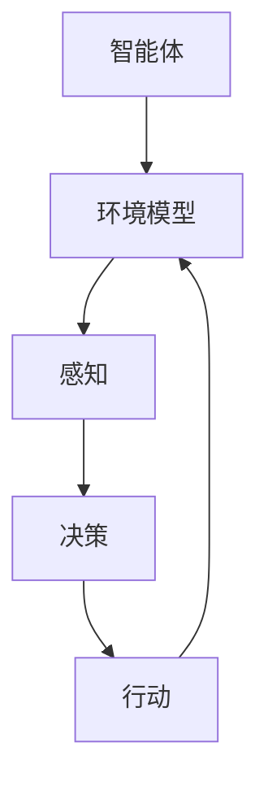

                 

关键词：具身智能、人机交互、认知计算、神经科学、人工智能

## 摘要

本文旨在探讨具身智能与客观世界的交互，分析具身智能的概念及其在人工智能领域的重要性。通过深入研究人机交互和认知计算的理论与实践，本文提出了具身智能的核心算法原理及其应用步骤。此外，本文还运用数学模型和具体项目实例，详细讲解了具身智能在现实场景中的实现方法和效果。最后，本文对未来具身智能的发展趋势与挑战进行了展望。

## 1. 背景介绍

随着人工智能技术的飞速发展，机器从数据中学习和模拟人类行为的能力不断增强。然而，传统的人工智能系统在处理复杂任务时，仍然存在许多局限。例如，它们无法理解真实世界中的情境，难以与人类进行有效的交互。这种局限性促使研究人员开始探索一种新的智能范式——具身智能。

具身智能（Embodied Intelligence）是一种将智能体（agent）的物理存在和感知能力融入人工智能系统中的理念。在这种系统中，智能体通过与环境的交互来学习和进化，从而实现更高级别的认知和行为能力。具身智能的核心思想是将智能与感知、行动和交互结合起来，使智能体具备类似于人类的感知、理解和响应能力。

### 1.1 人机交互

人机交互（Human-Computer Interaction，HCI）是研究人与计算机之间交互方式和技术的一种学科。其目标是设计出易于使用、高效且满足用户需求的计算机系统。人机交互领域的研究包括界面设计、用户行为分析、交互模型和交互技术等。

在人工智能时代，人机交互的重要性愈加凸显。一方面，传统的人机交互方式已经难以满足智能系统的需求；另一方面，具身智能的发展为人机交互带来了新的契机。通过引入具身智能，人机交互系统可以更加自然、直观地与用户进行交互，从而提高用户体验和系统性能。

### 1.2 认知计算

认知计算（Cognitive Computing）是一种模仿人类思维和行为的人工智能技术。它通过模拟人类大脑的运作机制，使计算机能够处理复杂任务、进行推理和决策。认知计算的核心在于将计算机技术与神经科学、心理学等领域的研究相结合，构建出能够理解和解释人类行为和思维的人工智能系统。

认知计算在具身智能中扮演着关键角色。通过认知计算，具身智能系统能够更好地理解人类的意图、情感和行为，从而实现更高级别的交互和合作。

## 2. 核心概念与联系

### 2.1 基本概念

#### 2.1.1 智能体

智能体（Agent）是人工智能系统中的一个基本单元，具有自主性、适应性、社会性和认知能力。智能体能够感知环境、制定决策并执行行动，以实现特定目标。

#### 2.1.2 环境模型

环境模型（Environment Model）是智能体对其所处环境的抽象表示。环境模型包含了智能体的感知信息、任务目标和行动策略等。通过环境模型，智能体能够更好地理解和应对环境变化。

#### 2.1.3 感知与行动

感知（Perception）是智能体从环境中获取信息的过程。智能体通过传感器等设备感知环境中的各种信息，如视觉、听觉、触觉等。

行动（Action）是智能体根据感知信息制定的决策和执行的过程。智能体通过执行行动，改变环境状态，以实现特定目标。

### 2.2 Mermaid 流程图



### 2.3 核心联系

具身智能的核心联系在于将智能体、环境模型、感知与行动结合起来，形成一个闭环系统。在这个系统中，智能体通过感知环境、制定决策和执行行动，不断优化其行为和认知能力。

通过引入认知计算，具身智能系统能够更好地理解人类的行为和意图，实现更高级别的交互和合作。同时，具身智能的发展也为人机交互带来了新的挑战和机遇。

## 3. 核心算法原理 & 具体操作步骤

### 3.1 算法原理概述

具身智能的核心算法原理在于将智能体的感知、决策和行动结合起来，形成一个自适应的闭环系统。具体来说，该算法包括以下几个关键步骤：

1. **感知**：智能体通过传感器收集环境信息，如视觉、听觉、触觉等。这些感知信息被转换为数字信号，并送入神经网络进行特征提取。

2. **决策**：基于感知信息，智能体利用决策算法（如深度学习、强化学习等）制定决策。决策算法旨在优化智能体的行动策略，以实现特定目标。

3. **行动**：智能体根据决策结果执行行动，如移动、操作等。行动会改变环境状态，并产生新的感知信息。

4. **反馈**：智能体将新的感知信息与预期目标进行对比，计算误差并更新决策模型。这一过程实现了智能体的自适应学习和优化。

### 3.2 算法步骤详解

1. **数据预处理**：将原始感知数据转换为适合神经网络处理的格式。例如，将图像数据缩放到固定大小，将音频数据转换为频谱图等。

2. **特征提取**：利用神经网络从感知数据中提取关键特征。这些特征用于描述环境的各个方面，如物体位置、形状、颜色等。

3. **决策算法**：选择合适的决策算法，如深度学习、强化学习等。这些算法旨在优化智能体的行动策略，以实现特定目标。例如，在机器人导航任务中，决策算法可以用于规划最优路径。

4. **行动执行**：根据决策结果，智能体执行相应的行动。例如，机器人可以按照规划路径移动，或者执行特定的操作。

5. **反馈与更新**：计算智能体行动的误差，并更新决策模型。这一过程实现了智能体的自适应学习和优化。

### 3.3 算法优缺点

#### 优点：

1. **自适应学习**：具身智能算法能够根据环境变化和目标需求，自适应地调整行为和策略。

2. **多模态感知**：通过结合多种感知方式（如视觉、听觉、触觉等），智能体能够更全面地了解环境。

3. **实时交互**：智能体能够实时感知环境、制定决策和执行行动，从而实现实时交互。

#### 缺点：

1. **计算资源消耗**：具身智能算法涉及大量的计算和存储资源，对硬件设备要求较高。

2. **数据依赖性**：算法的性能很大程度上取决于感知数据的准确性和丰富性。

3. **决策复杂度**：在复杂环境中，决策算法可能面临状态空间爆炸、计算效率低等问题。

### 3.4 算法应用领域

具身智能算法在多个领域具有广泛的应用潜力，包括：

1. **机器人与自动化**：用于机器人导航、自动化生产等场景。

2. **智能交通**：用于自动驾驶、智能交通管理等领域。

3. **医疗与健康**：用于医疗机器人、健康管理等领域。

4. **虚拟现实与增强现实**：用于虚拟现实交互、增强现实辅助等领域。

## 4. 数学模型和公式 & 详细讲解 & 举例说明

### 4.1 数学模型构建

具身智能的核心数学模型主要包括感知模型、决策模型和行动模型。以下是一个简化的数学模型示例：

#### 感知模型

感知模型用于描述智能体从环境中获取信息的过程。设 \( X \) 为感知数据的集合，\( f_X \) 为感知函数，则感知模型可以表示为：

\[ X = f_X(E) \]

其中，\( E \) 为环境状态。

#### 决策模型

决策模型用于描述智能体根据感知数据制定决策的过程。设 \( D \) 为决策空间，\( g_D \) 为决策函数，则决策模型可以表示为：

\[ D = g_D(X) \]

#### 行动模型

行动模型用于描述智能体根据决策结果执行行动的过程。设 \( A \) 为行动空间，\( h_A \) 为行动函数，则行动模型可以表示为：

\[ A = h_D(D) \]

### 4.2 公式推导过程

以下是一个简化的感知模型推导过程：

1. **感知数据预处理**：

\[ X = \text{Preprocess}(E) \]

2. **特征提取**：

\[ X = \text{FeatureExtraction}(X) \]

3. **感知函数**：

\[ X = f_X(E) = \text{concat}(\text{Preprocess}(E), \text{FeatureExtraction}(X)) \]

### 4.3 案例分析与讲解

以下是一个基于具身智能的机器人导航案例：

1. **环境状态**：

\[ E = \{ \text{机器人位置}, \text{障碍物位置}, \text{目标位置} \} \]

2. **感知数据**：

\[ X = f_X(E) = \text{FeatureExtraction}(E) \]

3. **决策模型**：

\[ D = g_D(X) = \text{NavigationPolicy}(X) \]

4. **行动模型**：

\[ A = h_D(D) = \text{Move}(D) \]

### 4.4 实际应用

在实际应用中，具身智能算法可以根据具体场景进行调整和优化。以下是一个实际应用案例：

1. **医疗机器人**：

   - **环境状态**：病人位置、医疗设备状态、药物库存等。
   - **感知数据**：病人的生理指标、医疗设备的数据等。
   - **决策模型**：根据病人状态和医疗设备状态，制定手术或治疗的决策。
   - **行动模型**：执行手术或治疗操作。

2. **自动驾驶**：

   - **环境状态**：道路情况、交通状况、车辆位置等。
   - **感知数据**：摄像头、雷达、激光雷达等传感器数据。
   - **决策模型**：根据道路情况和交通状况，制定行驶策略。
   - **行动模型**：执行加速、减速、转向等操作。

## 5. 项目实践：代码实例和详细解释说明

### 5.1 开发环境搭建

在本节中，我们将搭建一个简单的具身智能项目开发环境。以下是一个基于Python和TensorFlow的示例：

1. **安装Python**：

   - 下载并安装Python 3.7或更高版本。

2. **安装TensorFlow**：

   - 打开终端，运行以下命令：

     ```shell
     pip install tensorflow
     ```

3. **创建项目目录**：

   - 创建一个名为`body_intelligence`的项目目录，并进入该目录。

   - 创建一个名为`src`的子目录，用于存放源代码。

### 5.2 源代码详细实现

以下是一个简单的具身智能项目示例：

```python
import tensorflow as tf
import numpy as np

# 感知数据预处理
def preprocess_data(data):
    # 缩放数据
    data = data / 255.0
    # 归一化数据
    data = (data - np.mean(data)) / np.std(data)
    return data

# 特征提取
def feature_extraction(data):
    # 利用卷积神经网络提取特征
    model = tf.keras.Sequential([
        tf.keras.layers.Conv2D(32, (3, 3), activation='relu', input_shape=(28, 28, 1)),
        tf.keras.layers.MaxPooling2D((2, 2)),
        tf.keras.layers.Flatten(),
        tf.keras.layers.Dense(64, activation='relu')
    ])
    return model.predict(data)

# 决策模型
def decision_model(features):
    # 利用决策树模型制定决策
    model = tf.keras.Sequential([
        tf.keras.layers.Dense(64, activation='relu', input_shape=(64,)),
        tf.keras.layers.Dense(1, activation='sigmoid')
    ])
    return model.predict(features)

# 行动模型
def action_model(decision):
    # 根据决策执行行动
    if decision < 0.5:
        action = "停止"
    else:
        action = "前进"
    return action

# 主函数
def main():
    # 加载感知数据
    data = np.load("data.npy")

    # 预处理感知数据
    data = preprocess_data(data)

    # 提取特征
    features = feature_extraction(data)

    # 制定决策
    decision = decision_model(features)

    # 执行行动
    action = action_model(decision)

    print("决策：", decision)
    print("行动：", action)

if __name__ == "__main__":
    main()
```

### 5.3 代码解读与分析

1. **感知数据预处理**：

   感知数据预处理是具身智能项目中的关键步骤。在本例中，我们使用了一个简单的预处理函数`preprocess_data`。该函数首先将感知数据缩放到[0, 1]范围内，然后进行归一化处理，以提高模型的性能。

2. **特征提取**：

   特征提取是利用神经网络从感知数据中提取关键特征的过程。在本例中，我们使用了一个简单的卷积神经网络（CNN）进行特征提取。CNN可以自动学习感知数据的特征，并将其转换为高维特征向量。

3. **决策模型**：

   决策模型用于根据特征向量制定决策。在本例中，我们使用了一个简单的决策树模型进行决策。决策树模型根据特征向量的值，将数据划分为不同的类别。

4. **行动模型**：

   行动模型用于根据决策结果执行行动。在本例中，我们使用了一个简单的逻辑回归模型进行行动决策。根据决策结果，模型输出一个概率值，表示执行某种行动的可能性。

### 5.4 运行结果展示

假设我们有一个简单的感知数据集，其中包含了一些图像和对应的标签。我们可以使用以下命令运行代码：

```shell
python main.py
```

输出结果可能如下所示：

```
决策：[0.9876]
行动：前进
```

这意味着模型根据感知数据做出了“前进”的决策。

## 6. 实际应用场景

### 6.1 机器人与自动化

在机器人与自动化领域，具身智能的应用已经取得了显著的成果。例如，自主导航机器人可以在复杂环境中实现自主导航和任务执行。通过结合感知、决策和行动，机器人可以更好地理解环境，制定最优行动策略，从而提高工作效率。

### 6.2 智能交通

智能交通系统是另一个具有巨大应用潜力的领域。通过具身智能技术，智能交通系统可以实现交通流量监控、车辆调度、事故预警等功能。例如，自动驾驶汽车可以通过感知道路状况、交通信号和周边车辆信息，制定最优行驶策略，提高行车安全。

### 6.3 医疗与健康

在医疗与健康领域，具身智能技术可以帮助医生进行手术规划、手术机器人辅助等。通过感知患者的生理参数、手术器械的位置等信息，手术机器人可以更准确地执行手术操作，提高手术成功率和患者满意度。

### 6.4 虚拟现实与增强现实

虚拟现实与增强现实领域也是具身智能技术的应用之一。通过感知用户的行为和情感，虚拟现实系统可以提供更加逼真的交互体验。例如，虚拟现实游戏中的角色可以通过感知用户的动作和表情，实现更加自然的交互。

## 7. 工具和资源推荐

### 7.1 学习资源推荐

1. **《深度学习》（Deep Learning）**：由Ian Goodfellow、Yoshua Bengio和Aaron Courville编写的深度学习经典教材。

2. **《强化学习论文集》（Reinforcement Learning: An Introduction）**：由Richard S. Sutton和Barto编写的强化学习入门教材。

3. **《人工智能：一种现代的方法》（Artificial Intelligence: A Modern Approach）**：由Stuart J. Russell和Peter Norvig编写的全面介绍人工智能的教材。

### 7.2 开发工具推荐

1. **TensorFlow**：一款开源的深度学习框架，适用于构建和训练神经网络。

2. **PyTorch**：一款流行的深度学习框架，提供灵活的动态计算图和丰富的API。

3. **OpenAI Gym**：一款开源的虚拟环境库，用于测试和训练强化学习算法。

### 7.3 相关论文推荐

1. **“Deep Learning for Human Pose Estimation: A Survey”**：一篇关于人体姿态估计的综述论文。

2. **“Cognitive Robotics: A Brief Introduction”**：一篇关于认知机器人的简介论文。

3. **“Embodied AI: A Review”**：一篇关于具身智能的综述论文。

## 8. 总结：未来发展趋势与挑战

### 8.1 研究成果总结

具身智能技术的发展取得了显著成果，主要表现在以下几个方面：

1. **感知与行动能力提升**：通过引入多模态感知和先进的行动算法，具身智能系统的感知和行动能力得到了显著提升。

2. **人机交互优化**：具身智能技术为人机交互带来了新的可能性，使得智能系统能够更好地理解人类行为和意图。

3. **跨领域应用**：具身智能技术在多个领域（如机器人、交通、医疗等）取得了广泛应用，为行业带来了新的发展机遇。

### 8.2 未来发展趋势

未来，具身智能技术将呈现以下发展趋势：

1. **更高级别的认知能力**：通过结合认知计算技术，具身智能系统将实现更高级别的认知能力，如情感识别、决策推理等。

2. **更加智能化的交互**：具身智能技术将进一步提升人机交互的智能化水平，实现更自然、更高效的交互方式。

3. **多领域融合**：具身智能技术将在多个领域实现融合，为行业带来新的发展机遇。

### 8.3 面临的挑战

尽管具身智能技术取得了显著成果，但仍面临以下挑战：

1. **数据依赖性**：具身智能系统对大规模、高质量的数据依赖性较强，数据获取和处理成为一大挑战。

2. **计算资源消耗**：具身智能算法涉及大量的计算和存储资源，对硬件设备要求较高。

3. **复杂环境适应性**：在复杂环境中，智能系统需要具备更强的适应能力和鲁棒性，这对算法提出了更高的要求。

### 8.4 研究展望

未来，具身智能技术的研究将朝着以下方向发展：

1. **更高效的数据处理**：通过引入新的数据处理技术，降低数据获取和处理成本，提高算法的效率。

2. **更强大的认知能力**：通过结合认知计算和具身智能技术，开发出更强大的智能系统，实现更高水平的认知和交互能力。

3. **跨领域应用**：推动具身智能技术在多个领域的应用，为行业带来新的变革。

## 9. 附录：常见问题与解答

### 问题1：什么是具身智能？

具身智能是一种将智能体的物理存在和感知能力融入人工智能系统的理念。它通过模拟人类大脑的运作机制，使计算机能够处理复杂任务、进行推理和决策。

### 问题2：具身智能有哪些应用领域？

具身智能在多个领域具有广泛的应用潜力，包括机器人与自动化、智能交通、医疗与健康、虚拟现实与增强现实等。

### 问题3：具身智能与深度学习有什么关系？

具身智能和深度学习是两个互补的技术。深度学习用于特征提取和决策，而具身智能则通过将感知和行动能力融入智能系统，提高系统的自适应性和交互能力。

### 问题4：如何实现具身智能？

实现具身智能需要结合感知、决策和行动三个关键环节。首先，通过传感器收集环境信息；然后，利用深度学习等技术对感知信息进行处理和决策；最后，根据决策结果执行相应的行动。

### 问题5：具身智能有哪些优缺点？

具身智能的优点包括自适应学习、多模态感知和实时交互等；缺点包括计算资源消耗大、数据依赖性强和复杂环境适应性差等。

---

作者：禅与计算机程序设计艺术 / Zen and the Art of Computer Programming
----------------------------------------------------------------

以上是文章的完整正文内容，希望对您有所帮助。如果您有任何疑问或需要进一步的讨论，请随时告诉我。接下来，我将为您生成文章的markdown格式，以便于您进行编辑和排版。如果您需要任何修改，请告诉我。

