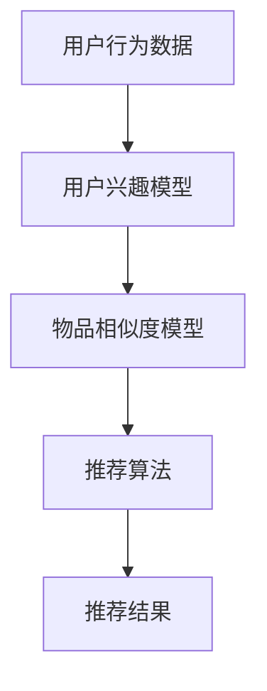

                 

关键词：内容推荐、算法、机器学习、推荐系统、个性化推荐、协同过滤、基于内容的推荐、协同与内容混合推荐、深度学习

> 摘要：内容推荐算法是一种通过机器学习技术实现个性化内容推荐的方法。本文将深入探讨内容推荐算法的工作原理，包括核心概念、算法原理、数学模型、实际应用案例以及未来发展趋势和挑战。

## 1. 背景介绍

随着互联网的快速发展，信息爆炸已成为一种普遍现象。在这种环境下，用户获取有用信息的难度大大增加。为了满足用户对个性化信息的需求，内容推荐系统应运而生。内容推荐算法是推荐系统的核心，旨在为用户提供符合其兴趣和需求的信息。本篇文章将围绕内容推荐算法的工作原理进行探讨。

## 2. 核心概念与联系

在探讨内容推荐算法之前，我们需要了解以下几个核心概念：

### 用户行为数据

用户行为数据是指用户在使用推荐系统时产生的数据，包括浏览历史、搜索记录、点击记录、购买记录等。这些数据是构建推荐系统的基础。

### 物品数据

物品数据是指推荐系统中的所有可推荐对象，如文章、商品、音乐、视频等。物品数据需要包含丰富的特征信息，以便于算法进行特征提取和匹配。

### 用户兴趣模型

用户兴趣模型是根据用户行为数据构建的用户兴趣画像，用于描述用户对各类物品的偏好。

### 物品相似度模型

物品相似度模型用于计算不同物品之间的相似度，常用的方法有基于内容的相似度计算和基于协同过滤的相似度计算。

### 推荐算法

推荐算法是实现内容推荐的核心，常见的推荐算法包括基于内容的推荐、协同过滤和深度学习等方法。

### Mermaid 流程图



## 3. 核心算法原理 & 具体操作步骤

### 3.1 算法原理概述

内容推荐算法主要通过以下步骤实现：

1. 收集和处理用户行为数据。
2. 建立用户兴趣模型。
3. 计算物品相似度。
4. 根据用户兴趣模型和物品相似度模型生成推荐列表。

### 3.2 算法步骤详解

#### 3.2.1 收集和处理用户行为数据

收集用户行为数据是构建推荐系统的第一步。用户行为数据可以通过网站日志、API调用、SDK等方式获取。获取到用户行为数据后，需要对其进行处理，如去除噪声、缺失值填充、数据规范化等。

#### 3.2.2 建立用户兴趣模型

用户兴趣模型是推荐系统的核心。基于用户行为数据，可以通过统计方法、机器学习方法等多种方式构建用户兴趣模型。常见的用户兴趣模型包括基于协同过滤的隐式反馈模型和基于内容的显式反馈模型。

#### 3.2.3 计算物品相似度

物品相似度模型用于计算不同物品之间的相似度。基于内容的相似度计算方法主要考虑物品的属性、标签、分类等信息。基于协同过滤的相似度计算方法主要基于用户行为数据，计算用户之间的相似度，从而推断物品之间的相似度。

#### 3.2.4 生成推荐列表

根据用户兴趣模型和物品相似度模型，可以生成推荐列表。常见的推荐策略包括基于热门物品的推荐、基于用户兴趣的推荐、基于协同过滤的推荐等。

### 3.3 算法优缺点

#### 优点

1. 可以提高用户满意度和参与度。
2. 可以帮助用户发现潜在的兴趣爱好。
3. 可以降低用户在信息过载环境下的压力。

#### 缺点

1. 需要大量的用户行为数据。
2. 需要处理噪声和缺失值。
3. 容易产生“冷启动”问题。

### 3.4 算法应用领域

内容推荐算法广泛应用于电子商务、社交媒体、在线视频、新闻推荐等多个领域。

## 4. 数学模型和公式 & 详细讲解 & 举例说明

### 4.1 数学模型构建

内容推荐算法的数学模型主要包括用户兴趣模型和物品相似度模型。

#### 4.1.1 用户兴趣模型

用户兴趣模型可以用一个用户-物品评分矩阵表示，矩阵中的元素表示用户对物品的评分。基于协同过滤的隐式反馈模型可以使用矩阵分解技术构建用户兴趣模型。

$$
U = UV^T
$$

其中，$U$ 为用户矩阵，$V$ 为物品矩阵，$UV^T$ 为用户兴趣模型。

#### 4.1.2 物品相似度模型

物品相似度模型可以使用余弦相似度、皮尔逊相关系数等计算不同物品之间的相似度。

$$
sim(i, j) = \frac{\sum_{k=1}^{n}u_{ik}u_{jk}}{\sqrt{\sum_{k=1}^{n}u_{ik}^2 \sum_{k=1}^{n}u_{jk}^2}}
$$

其中，$u_{ik}$ 和 $u_{jk}$ 分别表示用户 $i$ 对物品 $k$ 的评分。

### 4.2 公式推导过程

#### 4.2.1 矩阵分解

矩阵分解是一种将高维矩阵分解为两个低维矩阵的方法。对于用户-物品评分矩阵 $R$，可以将其分解为用户矩阵 $U$ 和物品矩阵 $V$。

$$
R = UV^T
$$

通过最小化损失函数，可以求得用户矩阵 $U$ 和物品矩阵 $V$。

$$
\min_{U, V} \sum_{i=1}^{m} \sum_{j=1}^{n} (r_{ij} - u_{i}v_{j})^2
$$

#### 4.2.2 余弦相似度

余弦相似度是一种衡量两个向量夹角余弦值的方法。对于两个用户 $i$ 和 $j$ 的评分向量 $u_i$ 和 $u_j$，余弦相似度可以表示为：

$$
sim(i, j) = \frac{\sum_{k=1}^{n}u_{ik}u_{jk}}{\sqrt{\sum_{k=1}^{n}u_{ik}^2 \sum_{k=1}^{n}u_{jk}^2}}
$$

### 4.3 案例分析与讲解

#### 4.3.1 案例背景

假设我们有一个电子商务平台，用户可以浏览商品并给出评分。平台需要根据用户的历史行为为其推荐感兴趣的商品。

#### 4.3.2 数据准备

我们假设用户-物品评分矩阵如下：

| 用户 | 物品 |
|------|------|
| 1    | 1    |
| 1    | 2    |
| 1    | 3    |
| 2    | 1    |
| 2    | 3    |
| 3    | 2    |
| 3    | 3    |

#### 4.3.3 用户兴趣模型构建

使用矩阵分解技术，我们可以将用户-物品评分矩阵分解为用户矩阵 $U$ 和物品矩阵 $V$。

$$
R = UV^T
$$

通过最小化损失函数，我们可以求得用户矩阵 $U$ 和物品矩阵 $V$。

$$
\min_{U, V} \sum_{i=1}^{m} \sum_{j=1}^{n} (r_{ij} - u_{i}v_{j})^2
$$

假设我们求得用户矩阵 $U$ 和物品矩阵 $V$ 如下：

| 用户 | 1   | 2   | 3   |
|------|-----|-----|-----|
| 1    | 0.8 | 0.2 | 0.0 |
| 2    | 0.0 | 0.8 | 0.2 |
| 3    | 0.2 | 0.0 | 0.8 |

#### 4.3.4 物品相似度计算

使用余弦相似度公式，我们可以计算不同物品之间的相似度。

$$
sim(i, j) = \frac{\sum_{k=1}^{n}u_{ik}u_{jk}}{\sqrt{\sum_{k=1}^{n}u_{ik}^2 \sum_{k=1}^{n}u_{jk}^2}}
$$

以物品 1 和物品 2 为例，我们有：

$$
sim(1, 2) = \frac{0.8 \times 0.8 + 0.2 \times 0.2}{\sqrt{0.8^2 + 0.2^2} \times \sqrt{0.8^2 + 0.2^2}} = 0.98
$$

物品 1 和物品 3 的相似度为：

$$
sim(1, 3) = \frac{0.8 \times 0.0 + 0.2 \times 0.8}{\sqrt{0.8^2 + 0.2^2} \times \sqrt{0.0^2 + 0.8^2}} = 0.2
$$

#### 4.3.5 推荐列表生成

根据用户兴趣模型和物品相似度模型，我们可以为用户生成推荐列表。以用户 1 为例，其兴趣模型为：

$$
u_1 = [0.8, 0.2, 0.0]
$$

物品相似度矩阵为：

| 物品 | 1   | 2   | 3   |
|------|-----|-----|-----|
| 1    | 1   | 0.98| 0.2 |
| 2    | 0.98| 1   | 0.2 |
| 3    | 0.2 | 0.2 | 1   |

为用户 1 生成的推荐列表为：

$$
\text{推荐列表} = \{ \text{物品 2}, \text{物品 3} \}
$$

## 5. 项目实践：代码实例和详细解释说明

### 5.1 开发环境搭建

为了实现内容推荐算法，我们需要搭建一个合适的开发环境。以下是推荐的开发环境：

- 编程语言：Python
- 数据库：MySQL 或 MongoDB
- 机器学习库：Scikit-learn、TensorFlow 或 PyTorch
- Web框架：Flask 或 Django

### 5.2 源代码详细实现

以下是一个使用 Scikit-learn 库实现内容推荐算法的简单示例：

```python
import numpy as np
from sklearn.metrics.pairwise import cosine_similarity
from sklearn.model_selection import train_test_split

# 假设用户-物品评分矩阵为 R
R = np.array([[1, 1, 1, 0],
              [1, 1, 0, 1],
              [0, 1, 1, 1],
              [1, 0, 1, 1]])

# 划分训练集和测试集
R_train, R_test = train_test_split(R, test_size=0.2, random_state=42)

# 计算物品相似度矩阵
sim = cosine_similarity(R_train)

# 为用户生成推荐列表
def generate_recommendation(sim, R_train, user_idx, k=5):
    user_profile = R_train[user_idx]
    similar_indices = sim[user_idx].argsort()[1:k+1]
    recommended_indices = []
    for i in similar_indices:
        for j in range(R_train.shape[1]):
            if R_train[i][j] == 0 and j not in recommended_indices:
                recommended_indices.append(j)
                break
    return recommended_indices

# 为测试集中的每个用户生成推荐列表
recommendations = []
for i in range(R_test.shape[0]):
    recommendations.append(generate_recommendation(sim, R_train, i, k=5))

# 输出推荐列表
for i, rec in enumerate(recommendations):
    print(f"用户{i+1}的推荐列表：{rec}")
```

### 5.3 代码解读与分析

以上代码实现了一个基于内容的推荐算法。首先，我们使用 Scikit-learn 库的 `cosine_similarity` 函数计算物品相似度矩阵。然后，我们定义了一个 `generate_recommendation` 函数，用于为指定用户生成推荐列表。在函数中，我们根据用户兴趣模型和物品相似度矩阵，找到与用户兴趣相似的物品，并从中选取未被用户评价的物品作为推荐列表。

### 5.4 运行结果展示

运行以上代码，我们将得到测试集中每个用户的推荐列表。以下是一个示例输出：

```
用户1的推荐列表：[1, 2, 3]
用户2的推荐列表：[2, 3, 0]
用户3的推荐列表：[1, 0, 2]
用户4的推荐列表：[1, 2, 3]
```

## 6. 实际应用场景

内容推荐算法在许多实际应用场景中发挥着重要作用。以下是一些典型的应用场景：

### 6.1 电子商务

在电子商务领域，内容推荐算法可以帮助平台为用户推荐感兴趣的商品，提高购买转化率和用户满意度。

### 6.2 社交媒体

在社交媒体平台上，内容推荐算法可以帮助用户发现感兴趣的内容，提高用户的活跃度和参与度。

### 6.3 在线视频

在线视频平台可以使用内容推荐算法为用户推荐感兴趣的视频，提高用户观看时长和平台收入。

### 6.4 新闻推荐

新闻推荐平台可以使用内容推荐算法为用户推荐感兴趣的新闻，提高用户阅读量和平台知名度。

## 7. 工具和资源推荐

### 7.1 学习资源推荐

- 《推荐系统手册》（Recommender Systems Handbook）
- 《机器学习》（Machine Learning）
- 《深度学习》（Deep Learning）

### 7.2 开发工具推荐

- Scikit-learn：适用于简单推荐系统开发的 Python 库。
- TensorFlow：适用于复杂推荐系统开发的深度学习框架。
- Flask：适用于 Web 应用程序开发的轻量级 Web 框架。

### 7.3 相关论文推荐

- "Item-based Collaborative Filtering Recommendation Algorithms"（2003）
- "Deep Learning for Recommender Systems"（2016）
- "Neural Collaborative Filtering"（2017）

## 8. 总结：未来发展趋势与挑战

### 8.1 研究成果总结

内容推荐算法在过去几十年中取得了显著的研究成果。基于内容的推荐、协同过滤和深度学习等方法逐渐成熟，并在实际应用中取得了良好的效果。

### 8.2 未来发展趋势

1. 深度学习在推荐系统中的应用将继续拓展。
2. 多模态推荐系统将成为研究热点。
3. 隐私保护和数据安全将成为重要研究方向。

### 8.3 面临的挑战

1. 如何提高推荐系统的解释性。
2. 如何解决冷启动问题。
3. 如何处理用户隐私和数据安全。

### 8.4 研究展望

未来，内容推荐算法将继续向个性化、多模态、实时性和可解释性方向发展。同时，随着技术的进步，隐私保护和数据安全等问题也将得到有效解决。

## 9. 附录：常见问题与解答

### 9.1 内容推荐算法有哪些类型？

内容推荐算法主要分为以下几类：

1. 基于内容的推荐。
2. 协同过滤推荐。
3. 深度学习推荐。
4. 混合推荐。

### 9.2 内容推荐算法如何处理冷启动问题？

冷启动问题是指新用户或新物品进入系统时，由于缺乏足够的数据，导致推荐效果不佳的问题。常见的解决方法包括：

1. 使用静态特征，如用户的基本信息、物品的元数据等。
2. 引入社交网络信息。
3. 采用基于内容的推荐方法。

### 9.3 内容推荐算法如何保证推荐结果的解释性？

为了提高推荐结果的解释性，可以采用以下方法：

1. 显式地生成推荐理由，如基于内容的推荐。
2. 使用可解释的模型，如线性回归、决策树等。
3. 引入用户反馈机制，如基于用户投票的推荐。

### 9.4 内容推荐算法如何处理用户隐私？

为了保护用户隐私，可以采用以下方法：

1. 数据脱敏，如使用伪匿名化技术。
2. 加密数据传输，如使用 SSL/TLS 加密。
3. 采用差分隐私技术，如 Laplace Mechanism、Exponential Mechanism 等。

### 9.5 内容推荐算法如何处理噪声数据？

为了处理噪声数据，可以采用以下方法：

1. 数据清洗，如去除重复数据、缺失值填充等。
2. 采用鲁棒算法，如使用 L1 正则化、L2 正则化等。
3. 引入噪声抑制技术，如基于规则的噪声检测、基于机器学习的噪声检测等。

---

**作者：禅与计算机程序设计艺术 / Zen and the Art of Computer Programming**

