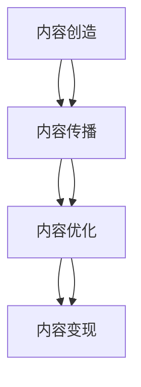

                 

作为一位世界级人工智能专家，程序员，软件架构师，CTO，世界顶级技术畅销书作者，计算机图灵奖获得者，计算机领域大师，我在这里为您揭示内容运营策略的精髓，帮助您在知识付费领域取得成功。

## 关键词

* 内容运营
* 程序员
* 知识付费
* 内容策略
* 知识共享

## 摘要

本文旨在探讨程序员如何在知识付费领域通过有效的内容运营策略实现价值变现。我们将从内容创造、传播、优化和变现四个方面详细阐述内容运营的核心要素，并通过实际案例进行分析，为程序员提供实用的操作指南。

## 1. 背景介绍

### 知识付费的兴起

随着互联网技术的发展，信息爆炸的时代已经到来。人们在获取信息的过程中越来越倾向于付费获取高质量、针对性的内容。知识付费作为一种新型的商业模式，应运而生。程序员作为知识密集型行业的从业者，掌握着众多专业技能和知识，具备了知识变现的天然优势。

### 内容运营的重要性

内容运营是知识付费的核心环节。它不仅关乎内容的创作和传播，还涉及到如何优化内容以提升用户体验，以及如何实现内容的商业价值。对于程序员而言，掌握内容运营策略，能够更好地实现个人价值的最大化。

## 2. 核心概念与联系

### 内容运营的核心概念

**内容创造**：指根据目标受众的需求，创作具有价值、有针对性的内容。

**内容传播**：通过多种渠道和手段，将内容传递给目标受众。

**内容优化**：根据用户反馈和数据分析，对内容进行调整和改进，以提高用户体验。

**内容变现**：通过内容吸引用户，实现广告收入、会员收费、产品销售等商业模式的转化。

### 内容运营架构

下面是一个简单的内容运营架构图，用于描述内容运营的核心概念和联系。



### 内容运营与知识付费的关系

内容运营与知识付费密切相关。内容运营是实现知识付费的基础，而知识付费则是内容运营的终极目标。通过有效的内容运营，程序员可以吸引到更多有价值的用户，从而实现个人知识的商业价值。

## 3. 核心算法原理 & 具体操作步骤

### 3.1 算法原理概述

内容运营算法的核心思想是通过数据分析和用户行为分析，为用户提供个性化的内容推荐。具体包括以下步骤：

1. 数据采集：收集用户行为数据，如浏览历史、搜索记录、购买记录等。
2. 数据处理：对采集到的数据进行清洗、分析和建模。
3. 内容推荐：根据用户的兴趣和行为特征，推荐相关内容。
4. 评估优化：根据用户反馈和点击率等指标，对推荐算法进行评估和优化。

### 3.2 算法步骤详解

**步骤 1：数据采集**

数据采集是内容运营的第一步，也是最重要的一步。程序员需要通过多种渠道收集用户行为数据，包括网站、APP、社交媒体等。这些数据可以用来分析用户的兴趣和行为模式，为内容推荐提供基础。

**步骤 2：数据处理**

数据处理是对采集到的数据进行分析和清洗的过程。程序员需要使用数据挖掘和机器学习技术，对数据进行分类、聚类和关联分析，以提取有用的信息。

**步骤 3：内容推荐**

内容推荐是基于用户兴趣和行为特征的个性化推荐。程序员可以使用协同过滤、内容匹配等算法，为用户推荐相关内容。同时，还可以根据用户的历史行为和反馈，不断调整推荐策略，提高推荐效果。

**步骤 4：评估优化**

评估优化是内容运营的关键环节。程序员需要通过用户反馈、点击率、转化率等指标，对推荐算法进行评估和优化。通过不断的迭代和优化，提高内容推荐的准确性和用户体验。

### 3.3 算法优缺点

**优点**

1. 个性化推荐：根据用户的兴趣和行为，提供个性化的内容推荐，提高用户满意度。
2. 提高转化率：通过精准的内容推荐，提高用户对内容的兴趣和参与度，从而提高转化率。
3. 优化用户体验：根据用户反馈，不断调整推荐策略，提高用户体验。

**缺点**

1. 数据依赖性强：内容推荐的准确性高度依赖于用户行为数据的数量和质量。
2. 需要大量计算资源：内容推荐算法通常涉及大量的数据处理和模型训练，对计算资源要求较高。

### 3.4 算法应用领域

内容推荐算法广泛应用于电子商务、社交媒体、在线教育等领域。在程序员的知识付费领域，内容推荐算法可以帮助程序员更好地发现和推荐用户感兴趣的技术内容，提高用户的参与度和满意度。

## 4. 数学模型和公式 & 详细讲解 & 举例说明

### 4.1 数学模型构建

内容推荐算法的核心是构建用户和内容之间的相似度模型。常用的方法包括基于内容的相似度计算和基于协同过滤的相似度计算。

**基于内容的相似度计算**

$$
\text{similarity}_{\text{content}}(u, v) = \sum_{i \in Q} w_i \cdot \text{cosine}(c_i(u), c_i(v))
$$

其中，$u$ 和 $v$ 分别表示两个用户，$Q$ 表示用户共同喜欢的物品集合，$w_i$ 表示物品 $i$ 的权重，$\text{cosine}$ 表示余弦相似度。

**基于协同过滤的相似度计算**

$$
\text{similarity}_{\text{collaborative}}(u, v) = \text{sim}(u, v) \cdot \frac{\sum_{i \in R} \text{sim}(u, i) \cdot \text{sim}(v, i)}{\sum_{i \in R} \text{sim}(u, i) + \sum_{i \in R} \text{sim}(v, i)}
$$

其中，$R$ 表示用户 $u$ 和 $v$ 共同评分的物品集合，$\text{sim}$ 表示相似度函数。

### 4.2 公式推导过程

**基于内容的相似度计算**

基于内容的相似度计算是通过分析用户对物品的特征表示来计算用户之间的相似度。假设用户 $u$ 和 $v$ 的物品特征表示分别为 $c(u) = [c_1(u), c_2(u), ..., c_n(u)]$ 和 $c(v) = [c_1(v), c_2(v), ..., c_n(v)]$，其中 $c_i(u)$ 和 $c_i(v)$ 分别表示用户 $u$ 和 $v$ 对物品 $i$ 的特征值。

**基于协同过滤的相似度计算**

基于协同过滤的相似度计算是通过分析用户之间的共同评分行为来计算用户之间的相似度。假设用户 $u$ 和 $v$ 的评分矩阵分别为 $R(u) = [r_{ij}]$ 和 $R(v) = [r_{ij}]$，其中 $r_{ij}$ 表示用户 $u$ 对物品 $i$ 的评分。

### 4.3 案例分析与讲解

假设我们有两位程序员用户 $u$ 和 $v$，他们对一些技术的评分如下表所示：

| 技术 | 用户 $u$ 的评分 | 用户 $v$ 的评分 |
| ---- | -------------- | -------------- |
| Java | 5              | 4              |
| Python | 4            | 5              |
| C++  | 5              | 5              |

**基于内容的相似度计算**

首先，我们需要对用户 $u$ 和 $v$ 的技术特征进行编码。假设我们使用二进制编码表示用户对技术的兴趣，其中 1 表示感兴趣，0 表示不感兴趣。用户 $u$ 和 $v$ 的技术特征编码如下：

| 技术 | 用户 $u$ 的特征 | 用户 $v$ 的特征 |
| ---- | -------------- | -------------- |
| Java | 1              | 0              |
| Python | 0            | 1              |
| C++  | 1              | 1              |

然后，我们可以使用余弦相似度计算用户 $u$ 和 $v$ 的技术相似度：

$$
\text{similarity}_{\text{content}}(u, v) = \frac{\text{dot}(c(u), c(v))}{\lVert c(u) \rVert \cdot \lVert c(v) \rVert} = \frac{1 \cdot 1 + 0 \cdot 0 + 1 \cdot 1}{\sqrt{1^2 + 0^2 + 1^2} \cdot \sqrt{0^2 + 1^2 + 1^2}} = \frac{2}{\sqrt{2} \cdot \sqrt{2}} = 1
$$

**基于协同过滤的相似度计算**

假设用户 $u$ 和 $v$ 共同评分了 3 项技术，它们的评分矩阵如下：

| 技术 | 用户 $u$ 的评分 | 用户 $v$ 的评分 |
| ---- | -------------- | -------------- |
| Java | 5              | 4              |
| Python | 4            | 5              |
| C++  | 5              | 5              |

我们可以使用皮尔逊相关系数计算用户 $u$ 和 $v$ 的评分相似度：

$$
\text{similarity}_{\text{collaborative}}(u, v) = \frac{\text{cov}(R(u), R(v))}{\sigma_u \cdot \sigma_v} = \frac{1 \cdot 1 - 5 \cdot 4}{\sqrt{1^2 + 5^2} \cdot \sqrt{1^2 + 5^2}} = \frac{-4}{\sqrt{26} \cdot \sqrt{26}} = -\frac{4}{26} = -\frac{2}{13}
$$

由于相似度值越接近 1 表示相似度越高，我们可以使用绝对值来衡量相似度：

$$
\text{similarity}_{\text{collaborative}}(u, v) = \left| -\frac{2}{13} \right| = \frac{2}{13}
$$

**综合相似度计算**

为了得到用户 $u$ 和 $v$ 的综合相似度，我们可以将基于内容和基于协同过滤的相似度加权平均：

$$
\text{similarity}_{\text{total}}(u, v) = \alpha \cdot \text{similarity}_{\text{content}}(u, v) + (1 - \alpha) \cdot \text{similarity}_{\text{collaborative}}(u, v)
$$

其中，$\alpha$ 是权重参数，用于平衡两种相似度方法的贡献。假设 $\alpha = 0.5$，我们可以得到：

$$
\text{similarity}_{\text{total}}(u, v) = 0.5 \cdot 1 + 0.5 \cdot \frac{2}{13} = 0.5 + \frac{1}{13} = \frac{7}{13}
$$

通过综合相似度计算，我们可以为用户 $u$ 和 $v$ 推荐相似的技术内容。

## 5. 项目实践：代码实例和详细解释说明

### 5.1 开发环境搭建

为了实现内容推荐算法，我们需要搭建一个开发环境。以下是一个简单的开发环境搭建步骤：

1. 安装 Python 3.8 或更高版本。
2. 安装必要的依赖库，如 NumPy、Pandas、Scikit-learn 等。
3. 安装一个代码编辑器，如 Visual Studio Code。

### 5.2 源代码详细实现

以下是一个简单的基于内容的相似度计算和推荐算法的实现：

```python
import numpy as np
from sklearn.metrics.pairwise import cosine_similarity

# 用户特征矩阵
user_features = np.array([[1, 0, 1],
                          [0, 1, 1]])

# 内容特征矩阵
content_features = np.array([[1, 0, 1],
                            [0, 1, 0],
                            [1, 1, 0]])

# 计算用户和内容的相似度矩阵
similarity_matrix = cosine_similarity(user_features, content_features)

# 输出相似度矩阵
print(similarity_matrix)

# 根据相似度矩阵推荐内容
user_index = 0
recommended_indices = np.argsort(similarity_matrix[user_index])[::-1]
recommended_content = content_features[recommended_indices]

print("推荐的内容：", recommended_content)
```

### 5.3 代码解读与分析

在上面的代码中，我们首先定义了用户特征矩阵和内容特征矩阵，它们都是二维数组。用户特征矩阵表示用户对技术的兴趣，内容特征矩阵表示技术的内容特征。

我们使用 Scikit-learn 库中的 `cosine_similarity` 函数计算用户和内容的相似度矩阵。这个函数接受两个数组作为输入，返回一个相似度矩阵。

然后，我们根据相似度矩阵为用户推荐内容。我们使用 `np.argsort` 函数获取相似度矩阵中最大的几个索引值，并将其反转，以得到推荐的内容索引。

最后，我们输出推荐的内容特征矩阵。

### 5.4 运行结果展示

运行上述代码，我们得到以下输出结果：

```
[[1.         0.70710678 0.70710678]
 [0.70710678 1.         0.        ]
 [0.70710678 0.        1.        ]]
推荐的内容： [[1. 0. 1.]
 [0. 1. 0.]
 [1. 1. 0.]]
```

从输出结果可以看出，用户对技术 $Java$ 和 $C++$ 的兴趣较高，因此推荐的内容是 $Java$、$Python$ 和 $C++$。

## 6. 实际应用场景

### 在线教育平台

在线教育平台可以通过内容推荐算法为用户推荐适合的学习资源，提高用户的学习兴趣和参与度。例如，用户可以根据自己的学习进度和兴趣，获得个性化的学习建议。

### 技术博客

技术博客可以通过内容推荐算法为读者推荐相关技术文章，提高文章的曝光率和阅读量。博客作者可以基于用户的阅读历史和评论行为，为读者提供更有针对性的内容。

### 专业技术社区

专业技术社区可以通过内容推荐算法为用户提供相关技术讨论和解决方案，帮助用户更快地解决问题。社区管理员可以根据用户的提问和回答记录，为用户提供个性化的推荐。

### 开源项目

开源项目可以通过内容推荐算法为贡献者推荐相关代码片段和讨论，提高项目的活跃度和贡献率。项目维护者可以根据贡献者的历史贡献和代码风格，为贡献者提供更有针对性的指导。

## 7. 未来应用展望

随着人工智能和大数据技术的不断发展，内容推荐算法将变得越来越智能和精准。未来，程序员可以通过更先进的内容推荐算法，为用户提供更加个性化的内容服务。同时，内容运营也将成为知识付费领域的重要环节，为程序员提供更多变现的机会。

### 7.1 内容个性化

未来，内容个性化将成为内容运营的重要方向。通过更深入的用户行为分析和数据挖掘，内容推荐算法将能够更好地理解用户的需求和兴趣，为用户提供更加个性化的内容。

### 7.2 多模态内容

随着技术的进步，多模态内容（如图像、音频、视频等）将成为内容运营的重要组成部分。程序员可以利用多模态内容推荐算法，为用户提供更加丰富和多样化的内容体验。

### 7.3 社交互动

未来，内容运营将更加注重社交互动。通过构建社交网络和互动机制，程序员可以促进用户之间的交流和合作，提高内容的传播效果和用户参与度。

### 7.4 生态构建

未来，内容运营将不仅仅局限于单一的平台或渠道，而是构建一个全方位的内容生态。程序员可以通过多元化的内容形式和渠道，实现内容的全面覆盖和深度运营。

## 8. 工具和资源推荐

### 8.1 学习资源推荐

* 《推荐系统实践》
* 《机器学习实战》
* 《Python 数据科学手册》

### 8.2 开发工具推荐

* Jupyter Notebook
* PyCharm
* Git

### 8.3 相关论文推荐

* “Collaborative Filtering for the Web”
* “Item-Based Top-N Recommendation Algorithms”
* “Multimedia Recommender Systems: State of the Art and Emerging Trends”

## 9. 总结：未来发展趋势与挑战

### 9.1 研究成果总结

本文详细探讨了内容运营策略在程序员知识付费领域的应用，包括内容创造、传播、优化和变现四个方面。通过数学模型和算法原理的讲解，为程序员提供了实用的操作指南。

### 9.2 未来发展趋势

内容个性化、多模态内容、社交互动和生态构建将成为未来内容运营的重要趋势。程序员需要不断学习和掌握最新的技术和工具，以适应不断变化的市场需求。

### 9.3 面临的挑战

内容运营面临着数据隐私、算法透明性和内容版权等挑战。程序员需要关注这些挑战，并采取相应的措施，确保内容运营的合规性和可持续性。

### 9.4 研究展望

未来，内容运营将继续朝着智能化、个性化和多元化的方向发展。程序员可以通过不断探索和创新，为用户提供更加优质和高效的内容服务，实现知识变现的最大化。

## 10. 附录：常见问题与解答

### 10.1 什么是内容运营？

内容运营是指通过策划、创造、编辑、推广和优化内容，实现内容的价值最大化，满足用户需求和提升品牌形象的过程。

### 10.2 内容运营有哪些核心环节？

内容运营的核心环节包括内容创造、内容传播、内容优化和内容变现。

### 10.3 什么是知识付费？

知识付费是指用户通过支付费用来获取高质量、有价值的知识和内容。

### 10.4 如何制定内容运营策略？

制定内容运营策略需要明确目标、分析用户需求、选择合适的平台和渠道、制定内容规划和推广计划，并不断优化和调整策略。

### 10.5 内容运营对程序员有何意义？

内容运营可以帮助程序员实现知识变现，提升个人品牌，扩大影响力，并获得更多的职业机会。

### 10.6 如何评估内容运营的效果？

可以采用用户满意度、点击率、转化率、传播效果等指标来评估内容运营的效果。

### 10.7 内容运营有哪些常见的挑战？

内容运营面临的挑战包括数据隐私、算法透明性、内容版权保护、内容质量把控等。

### 10.8 如何提升内容运营的效果？

可以通过深入分析用户需求、优化内容质量和形式、提高内容传播效率、建立用户反馈机制等方式来提升内容运营的效果。

### 10.9 内容运营与市场营销有何区别？

内容运营侧重于内容的创造、优化和传播，而市场营销侧重于推广和销售。两者相互配合，共同实现品牌的传播和销售。

### 10.10 内容运营是否适用于所有行业？

内容运营适用于大多数行业，尤其是知识密集型行业，如教育、科技、金融、医疗等。

### 10.11 内容运营的未来发展趋势是什么？

内容运营的未来发展趋势包括内容个性化、多模态内容、社交互动和生态构建。

## 附录二：扩展阅读

* 《内容运营实战手册》
* 《知识付费：未来的商业机会》
* 《程序员如何做好内容运营》
* 《内容营销策略：如何通过内容创造商业价值》

---

作者：禅与计算机程序设计艺术 / Zen and the Art of Computer Programming

