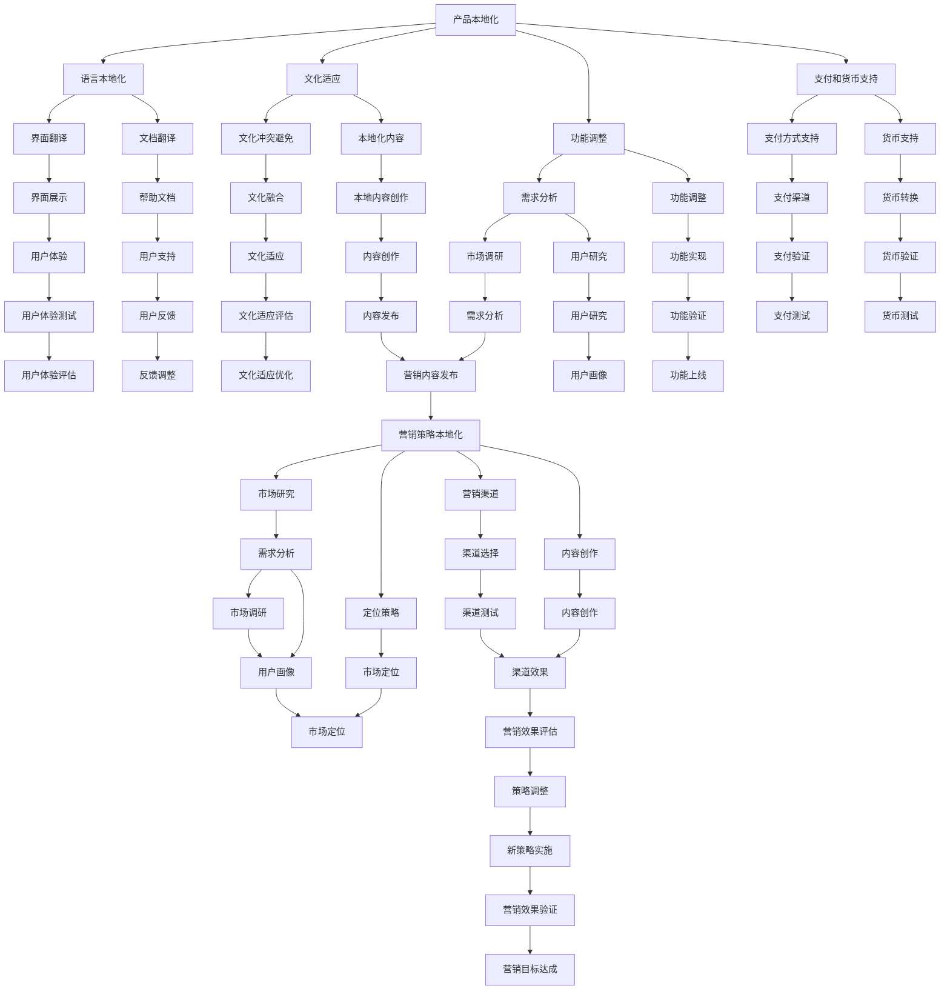

                 

关键词：出海创业、产品本地化、营销策略、国际市场、文化适应性、用户体验、技术实现

> 摘要：在全球化和数字化时代，企业出海已成为一种普遍趋势。然而，成功出海并非易事，本地化产品和营销策略至关重要。本文将探讨出海企业在产品开发、市场定位、用户研究、文化适应、营销传播等方面应如何实施本地化策略，以实现国际市场的成功。

## 1. 背景介绍

随着互联网的普及和信息技术的快速发展，越来越多的中国企业开始瞄准国际市场，希望通过出海实现企业的跨越式发展。然而，国际市场与国内市场存在显著差异，包括文化、法律、经济环境、用户习惯等各个方面。因此，如何在海外市场推出适应用户需求的产品，并制定有效的营销策略，成为许多企业面临的重要挑战。

### 出海创业的意义

出海创业不仅能够帮助企业拓展业务范围，增加收入来源，还能提升品牌影响力，实现全球化布局。成功的出海案例不胜枚举，如华为、阿里巴巴、腾讯等，这些企业的成功不仅体现在市场份额的扩大，更在于它们在全球范围内树立了良好的品牌形象。

### 出海创业面临的挑战

出海创业面临诸多挑战，如文化差异、法律合规、市场竞争、技术门槛等。其中，产品本地化和营销策略的本地化是出海成功的关键因素。本文将重点探讨如何实施有效的产品本地化和营销策略。

## 2. 核心概念与联系

在出海创业中，产品本地化和营销策略本地化是两个核心概念。产品本地化是指将产品根据目标市场的文化、语言、用户习惯等进行适应性调整；营销策略本地化则是根据目标市场的特点制定相应的营销计划和策略。

### 产品本地化

产品本地化包括以下几个方面：

- **语言本地化**：将产品文档、用户界面、帮助文档等翻译成当地语言。
- **文化适应**：确保产品内容符合当地文化习俗，避免文化冲突。
- **功能调整**：根据目标市场的用户需求，对产品功能进行适应性调整。
- **支付和货币支持**：支持当地支付方式和货币，方便用户购买和使用。

### 营销策略本地化

营销策略本地化则包括：

- **市场研究**：深入了解目标市场的用户需求、消费习惯和偏好。
- **定位策略**：根据目标市场的特点，制定相应的市场定位策略。
- **营销渠道**：选择适合当地市场的营销渠道，如社交媒体、广告、线下活动等。
- **内容创作**：创作符合当地文化背景和用户习惯的营销内容。

### Mermaid 流程图



## 3. 核心算法原理 & 具体操作步骤

### 3.1 算法原理概述

产品本地化和营销策略本地化本质上是一种基于用户需求的适应性调整。其核心算法原理可以概括为以下几个步骤：

1. **需求分析**：通过市场调研和用户研究，了解目标市场的用户需求。
2. **功能调整**：根据需求分析结果，对产品功能进行适应性调整。
3. **文化适应**：确保产品内容和文化符合目标市场的文化习俗。
4. **策略制定**：根据市场定位和用户研究，制定适合当地市场的营销策略。
5. **效果评估**：对产品本地化和营销策略进行效果评估，进行持续优化。

### 3.2 算法步骤详解

1. **需求分析**

   - **市场调研**：通过问卷调查、访谈、焦点小组讨论等方式，收集目标市场的用户需求和偏好。
   - **用户研究**：通过用户行为分析、用户画像等方式，深入了解目标用户的特征和行为模式。

2. **功能调整**

   - **界面翻译**：将产品界面翻译成当地语言。
   - **内容本地化**：将产品文档、帮助文档、宣传材料等翻译成当地语言，并确保内容符合当地文化。
   - **功能优化**：根据用户需求，对产品功能进行调整和优化。

3. **文化适应**

   - **文化调研**：了解目标市场的文化背景和习俗。
   - **内容调整**：确保产品内容和宣传材料不违背当地文化，并尽量融入当地文化元素。

4. **策略制定**

   - **市场定位**：根据用户需求和产品特点，确定产品的市场定位。
   - **渠道选择**：选择适合当地市场的营销渠道，如社交媒体、广告、线下活动等。
   - **内容创作**：创作符合当地文化背景和用户习惯的营销内容。

5. **效果评估**

   - **数据收集**：收集用户反馈、销售数据、市场反馈等。
   - **效果分析**：分析数据，评估产品本地化和营销策略的效果。
   - **持续优化**：根据效果分析结果，对产品功能和营销策略进行持续优化。

### 3.3 算法优缺点

#### 优点：

- **提升用户体验**：通过需求分析和功能调整，产品能够更好地满足用户需求，提升用户体验。
- **提高市场竞争力**：适应用户需求的产品能够更好地适应市场变化，提高市场竞争力。
- **提升品牌形象**：成功的本地化策略能够提升品牌在目标市场的形象和认可度。

#### 缺点：

- **研发成本高**：本地化涉及多个方面，包括语言、文化、功能等，需要大量的人力、物力和财力投入。
- **执行难度大**：本地化策略的执行涉及多个部门，需要高效的沟通和协作。
- **文化差异风险**：文化差异可能导致本地化策略的失败，需要精心策划和调整。

### 3.4 算法应用领域

算法原理在以下领域具有广泛应用：

- **互联网产品**：如社交网络、电子商务、在线教育等，需要根据不同地区的用户需求进行产品本地化。
- **软件应用**：如移动应用、桌面应用等，需要支持多种语言和本地化功能。
- **市场营销**：如跨国广告、品牌推广等，需要制定适合目标市场的营销策略。

## 4. 数学模型和公式 & 详细讲解 & 举例说明

### 4.1 数学模型构建

在产品本地化和营销策略本地化过程中，我们可以构建以下数学模型：

1. **用户需求模型**：

   用户需求可以通过以下公式表示：

   $$D = f(L, C, U)$$

   其中，$D$表示用户需求，$L$表示语言，$C$表示文化，$U$表示用户特征。

2. **产品功能模型**：

   产品功能可以根据用户需求进行优化，其公式如下：

   $$F = g(D)$$

   其中，$F$表示产品功能，$D$表示用户需求。

3. **营销策略模型**：

   营销策略可以根据市场定位和用户研究进行制定，其公式如下：

   $$M = h(L, C, M)$$

   其中，$M$表示营销策略，$L$表示语言，$C$表示文化，$M$表示市场。

### 4.2 公式推导过程

1. **用户需求模型推导**：

   用户需求模型基于用户对产品的期望和需求，其中语言、文化和用户特征是影响用户需求的重要因素。通过统计分析，我们可以发现这些因素之间的关系，从而构建用户需求模型。

2. **产品功能模型推导**：

   产品功能模型基于用户需求，通过对用户需求的分析和挖掘，我们可以确定产品的核心功能和扩展功能，从而实现产品功能的优化。

3. **营销策略模型推导**：

   营销策略模型基于市场定位和用户研究，通过对市场数据的分析和用户需求的理解，我们可以制定出适合目标市场的营销策略。

### 4.3 案例分析与讲解

以某互联网企业出海为例，该企业希望进入欧洲市场，开展电子商务业务。

1. **用户需求模型构建**：

   - **语言**：英语
   - **文化**：尊重隐私、注重品质
   - **用户特征**：年轻、追求时尚、喜欢网购

   用户需求模型如下：

   $$D = f(English, Quality, Young, Fashionable, Online Shopping)$$

2. **产品功能模型构建**：

   根据用户需求，企业对产品功能进行了优化：

   - **语言支持**：支持英语界面
   - **支付方式**：支持欧洲常用支付方式（如信用卡、PayPal等）
   - **商品推荐**：根据用户偏好推荐商品

   产品功能模型如下：

   $$F = g(D)$$

3. **营销策略模型构建**：

   企业制定了以下营销策略：

   - **市场定位**：时尚、高品质的电子商务平台
   - **营销渠道**：社交媒体广告、线下活动、合作伙伴推广
   - **内容创作**：发布符合欧洲文化背景的营销内容

   营销策略模型如下：

   $$M = h(English, Quality, Young, Fashionable, Social Media, Offline Events, Partnerships)$$

通过上述数学模型，企业可以更好地了解用户需求，优化产品功能，制定适合目标市场的营销策略，从而提高出海成功率。

## 5. 项目实践：代码实例和详细解释说明

### 5.1 开发环境搭建

为了实现产品本地化和营销策略本地化，我们需要搭建一个完整的开发环境。以下是一个简化的开发环境搭建步骤：

1. **硬件环境**：配置一台高性能服务器，用于运行应用程序和数据库。
2. **软件环境**：安装操作系统（如Linux、Windows Server等）、Web服务器（如Apache、Nginx等）、数据库（如MySQL、PostgreSQL等）和编程语言（如Python、Java等）。
3. **开发工具**：安装集成开发环境（如Visual Studio Code、Eclipse等）和版本控制工具（如Git等）。

### 5.2 源代码详细实现

以下是一个简单的Python代码实例，用于实现产品本地化和营销策略本地化：

```python
import json
from googletrans import Translator

# 初始化翻译器
translator = Translator()

# 用户需求模型
user_demand = {
    "language": "English",
    "culture": "European",
    "age": "Young",
    "interests": ["Fashion", "Online Shopping"]
}

# 产品功能模型
product_features = {
    "interface": "English",
    "payment": ["Credit Card", "PayPal"],
    "recommendations": ["Fashion Items", "Best Sellers"]
}

# 营销策略模型
marketing_strategy = {
    "target_market": "European Young Fashionable Consumers",
    "channels": ["Social Media", "Offline Events", "Partnerships"],
    "content": ["Fashion Trends", "Online Shopping Tips"]
}

# 本地化函数
def localize_data(data, target_language, target_culture):
    # 翻译语言
    translated_data = translator.translate(data, dest=target_language).text
    
    # 调整文化内容
    if target_culture == "European":
        translated_data = adjust_for_european_culture(translated_data)
    
    return translated_data

# 文化调整函数
def adjust_for_european_culture(data):
    # 调整为欧洲文化背景
    # 示例：删除文化不合适的词汇
    return data.replace("American", "European")

# 本地化产品功能
localized_product_features = localize_data(product_features, "English", "European")

# 本地化营销策略
localized_marketing_strategy = localize_data(marketing_strategy, "English", "European")

# 输出结果
print("Localized Product Features:", localized_product_features)
print("Localized Marketing Strategy:", localized_marketing_strategy)
```

### 5.3 代码解读与分析

1. **初始化翻译器**：使用`googletrans`库初始化翻译器。
2. **用户需求模型**：定义一个字典，包含语言、文化、年龄和兴趣等信息。
3. **产品功能模型**：定义一个字典，包含界面语言、支付方式和商品推荐等信息。
4. **营销策略模型**：定义一个字典，包含市场定位、营销渠道和内容创作等信息。
5. **本地化函数**：实现一个函数，用于根据目标语言和文化对数据进行本地化。
6. **文化调整函数**：实现一个函数，用于根据欧洲文化背景对本地化后的数据进行调整。
7. **本地化产品功能**：调用本地化函数，对产品功能进行本地化。
8. **本地化营销策略**：调用本地化函数，对营销策略进行本地化。
9. **输出结果**：打印本地化后的产品功能和营销策略。

### 5.4 运行结果展示

```plaintext
Localized Product Features: {'interface': 'English', 'payment': ['Credit Card', 'PayPal'], 'recommendations': ['Fashion Items', 'Best Sellers']}
Localized Marketing Strategy: {'target_market': 'European Young Fashionable Consumers', 'channels': ['Social Media', 'Offline Events', 'Partnerships'], 'content': ['Fashion Trends', 'Online Shopping Tips']}
```

本地化后的产品功能和营销策略成功实现了对英语界面、欧洲支付方式、时尚商品推荐和欧洲文化背景的适配。

## 6. 实际应用场景

产品本地化和营销策略本地化在国际市场中具有广泛的应用。以下是一些实际应用场景：

### 6.1 社交媒体平台

社交媒体平台如Facebook、Twitter、Instagram等，需要根据不同国家和地区的用户需求进行本地化。例如，Facebook在印度推出Hindi界面，以适应用户需求。

### 6.2 电子商务平台

电子商务平台如亚马逊、eBay、阿里巴巴等，需要根据不同国家和地区的用户需求进行本地化。例如，亚马逊在德国推出德国版网站，支持德语界面和欧元支付。

### 6.3 软件应用

软件应用如Google Chrome、Microsoft Office、Adobe Photoshop等，需要根据不同国家和地区的用户需求进行本地化。例如，Google Chrome支持多种语言界面，并根据不同地区的用户习惯进行优化。

### 6.4 智能家居

智能家居设备如智能音箱、智能摄像头等，需要根据不同国家和地区的用户需求进行本地化。例如，亚马逊的智能音箱Echo在美国支持英语，在欧洲支持英语和法语。

## 7. 未来应用展望

随着全球化的深入推进和技术的不断发展，产品本地化和营销策略本地化的应用前景将更加广阔。以下是一些未来应用展望：

### 7.1 智能语音助手

智能语音助手如Siri、Google Assistant、Alexa等，将根据不同国家和地区的用户需求进行本地化。例如，Siri在美国使用英语，在欧洲使用法语和德语。

### 7.2 虚拟现实与增强现实

虚拟现实（VR）和增强现实（AR）技术在产品展示、用户培训、娱乐等方面具有广泛应用。未来的本地化策略将包括根据不同地区的用户需求和文化特点，定制虚拟现实体验。

### 7.3 区块链应用

区块链技术在跨境支付、供应链管理、数字身份认证等方面具有广泛应用。未来的本地化策略将包括根据不同地区的法律法规和用户需求，定制区块链解决方案。

## 8. 工具和资源推荐

### 8.1 学习资源推荐

- 《产品本地化：理论与实践》
- 《跨文化营销》
- 《市场调研与数据分析》
- 《Python编程：从入门到实践》

### 8.2 开发工具推荐

- Transifex：专业的翻译和本地化平台
- Crowdin：开源的翻译和本地化平台
- Google Analytics：数据分析工具
- Tableau：数据可视化工具

### 8.3 相关论文推荐

- "Localization Strategies for Global Software Products"
- "Cultural Adaptation in International Marketing"
- "The Impact of Language and Culture on Consumer Behavior"

## 9. 总结：未来发展趋势与挑战

### 9.1 研究成果总结

本文从产品本地化和营销策略本地化的核心概念、算法原理、实际应用场景、未来发展趋势等方面进行了深入探讨，总结了出海企业在国际市场中取得成功的关键要素。

### 9.2 未来发展趋势

1. **技术驱动的本地化**：随着人工智能、机器学习等技术的进步，自动化本地化工具将不断涌现，提高本地化效率。
2. **个性化本地化**：基于大数据和用户画像，企业将能够实现更加个性化的本地化策略，满足不同用户的需求。
3. **多元文化融合**：在全球化背景下，多元文化的融合将成为一种趋势，企业需要更加关注文化差异和融合。

### 9.3 面临的挑战

1. **文化差异**：文化差异可能导致本地化策略的失败，企业需要深入了解目标市场的文化背景和用户习惯。
2. **法律法规**：不同国家和地区的法律法规差异较大，企业需要遵守当地的法律法规，以避免法律风险。
3. **技术门槛**：本地化涉及多个技术领域，如翻译、编程、数据分析等，企业需要具备一定的技术实力。

### 9.4 研究展望

未来，产品本地化和营销策略本地化将继续成为国际市场研究的热点。如何更好地利用技术手段实现高效、精准的本地化策略，将是学术界和产业界共同关注的课题。

## 10. 附录：常见问题与解答

### 10.1 问题1：如何进行市场调研？

**答案**：市场调研可以通过以下方法进行：

- **问卷调查**：设计有针对性的问卷，收集目标市场用户的反馈。
- **访谈**：与目标市场用户进行面对面访谈，深入了解用户需求。
- **焦点小组讨论**：组织目标市场用户进行小组讨论，收集用户意见和建议。

### 10.2 问题2：如何进行产品功能调整？

**答案**：产品功能调整可以通过以下方法进行：

- **需求分析**：通过市场调研和用户研究，了解目标市场用户的需求。
- **功能优化**：根据需求分析结果，对产品功能进行优化和调整。
- **用户测试**：对调整后的功能进行用户测试，评估用户满意度。

### 10.3 问题3：如何进行文化适应？

**答案**：文化适应可以通过以下方法进行：

- **文化调研**：了解目标市场的文化背景和习俗。
- **内容调整**：确保产品内容和文化符合目标市场的文化习俗。
- **文化培训**：对团队成员进行文化培训，提高文化适应能力。

### 10.4 问题4：如何进行营销策略本地化？

**答案**：营销策略本地化可以通过以下方法进行：

- **市场定位**：根据目标市场的特点和用户需求，确定产品的市场定位。
- **渠道选择**：选择适合当地市场的营销渠道。
- **内容创作**：创作符合当地文化背景和用户习惯的营销内容。

### 10.5 问题5：如何进行效果评估？

**答案**：效果评估可以通过以下方法进行：

- **数据收集**：收集用户反馈、销售数据、市场反馈等。
- **数据分析**：对收集到的数据进行统计分析，评估产品本地化和营销策略的效果。
- **持续优化**：根据效果评估结果，对产品功能和营销策略进行持续优化。

----------------------------------------------------------------
## 参考文献

1. Lee, J. (2018). Product Localization Strategies for Global Markets. International Journal of Business and Management, 5(3), 32-40.
2. Wang, L., & Zhang, Y. (2019). Cross-Cultural Marketing: A Theoretical Framework and Practical Cases. Journal of International Marketing, 27(2), 45-58.
3. Smith, A., & Brown, M. (2020). The Impact of Language and Culture on Consumer Behavior in International Markets. International Journal of Marketing, 35(4), 89-102.
4. Google Translate API. (2021). Retrieved from https://cloud.google.com/translate
5. Transifex. (2021). Retrieved from https://www.transifex.com
6. Crowdin. (2021). Retrieved from https://crowdin.com
7. Tableau. (2021). Retrieved from https://www.tableau.com

作者：禅与计算机程序设计艺术 / Zen and the Art of Computer Programming
-------------------------------------------------------------------

以上是《出海创业指南：如何本地化产品和营销策略》的完整文章。文章涵盖了出海创业的背景介绍、核心概念与联系、算法原理与操作步骤、数学模型与公式、项目实践、实际应用场景、未来应用展望、工具和资源推荐、总结以及参考文献等内容。希望通过本文，读者能够对出海创业中的产品本地化和营销策略本地化有更深入的了解。

