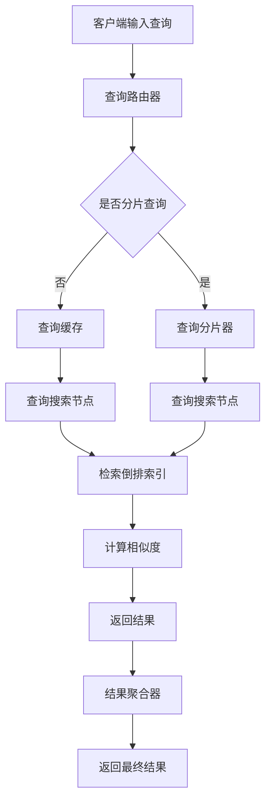

                 

关键词：分布式搜索、搜索算法、分布式系统、性能优化、代码实例

> 摘要：本文将深入探讨分布式搜索的原理、核心算法、数学模型及其在项目实践中的应用。通过详细的代码实例，帮助读者理解分布式搜索的机制和实现方法，并展望其未来的发展趋势与挑战。

## 1. 背景介绍

随着互联网信息的爆炸式增长，传统的集中式搜索引擎已经难以满足用户对海量数据的高效搜索需求。分布式搜索系统应运而生，它通过将搜索任务分布到多个节点上，提高了搜索的效率和可扩展性。本文将介绍分布式搜索的基本原理、核心算法以及其实际应用。

### 1.1 分布式搜索的定义

分布式搜索是指将搜索任务分布在多个服务器或节点上，通过协同工作实现高效搜索的技术。分布式搜索系统通常具有以下几个特点：

- **可扩展性**：系统可以根据需求动态增加或减少节点，从而满足不同规模的搜索需求。
- **容错性**：系统中的单个节点或部分节点故障不会影响整体搜索性能。
- **高并发性**：系统能够处理大量的并发搜索请求，提高用户体验。
- **灵活性**：分布式搜索系统可以根据实际需求调整搜索策略和算法。

### 1.2 分布式搜索的重要性

- **海量数据处理**：分布式搜索系统能够处理数以亿计的数据，满足大规模数据搜索的需求。
- **高性能**：通过并行处理，分布式搜索系统能够在短时间内返回搜索结果。
- **可扩展性**：随着数据量的增加，分布式搜索系统可以灵活扩展，保持高性能。
- **灵活性**：支持多样化的搜索需求，如精确匹配、模糊查询、高亮显示等。

## 2. 核心概念与联系

### 2.1 搜索算法

分布式搜索的核心是搜索算法。常见的搜索算法包括：

- **基于倒排索引的搜索**：通过构建倒排索引，将文档和关键词关联起来，快速定位相关文档。
- **基于相似度计算的搜索**：通过计算文档与查询之间的相似度，排序并返回相关文档。

### 2.2 分布式系统架构

分布式搜索系统通常采用如下架构：

- **客户端**：用户输入查询，客户端将查询发送到分布式搜索系统。
- **查询路由器**：接收客户端的查询请求，并将其分发到不同的搜索节点。
- **搜索节点**：负责处理查询请求，从索引中检索相关文档，并返回结果。
- **结果聚合器**：将多个搜索节点的结果进行聚合，生成最终搜索结果。

### 2.3 Mermaid 流程图

下面是一个简化的分布式搜索系统的 Mermaid 流程图：



## 3. 核心算法原理 & 具体操作步骤

### 3.1 算法原理概述

分布式搜索算法通常基于以下几个原理：

- **倒排索引**：将文档与关键词建立反向索引，实现快速查询。
- **分片查询**：将整个索引分为多个分片，每个分片由不同的搜索节点处理。
- **相似度计算**：通过计算文档与查询的相似度，排序并返回相关文档。

### 3.2 算法步骤详解

下面是分布式搜索算法的具体步骤：

1. **构建倒排索引**：将文档内容解析成关键词，建立关键词与文档的关联索引。
2. **分片查询**：将查询请求分配到不同的搜索节点，每个节点处理自己分片内的查询。
3. **检索倒排索引**：从倒排索引中检索与查询相关的文档。
4. **相似度计算**：计算文档与查询的相似度，通常使用TF-IDF、BM25等算法。
5. **结果聚合**：将各节点的搜索结果进行排序和合并，生成最终搜索结果。

### 3.3 算法优缺点

- **优点**：
  - **高效性**：通过并行处理，分布式搜索算法能快速返回搜索结果。
  - **可扩展性**：系统可以根据需求动态调整节点数量，提高性能。
  - **容错性**：部分节点故障不会影响整体搜索性能。
- **缺点**：
  - **复杂性**：分布式搜索系统设计和实现较为复杂。
  - **同步开销**：节点间的同步操作可能带来一定的开销。

### 3.4 算法应用领域

分布式搜索算法广泛应用于搜索引擎、社交媒体、电商平台等场景。以下是一些典型的应用领域：

- **搜索引擎**：如百度、谷歌等，通过分布式搜索算法提供快速、精准的搜索服务。
- **社交媒体**：如微博、Facebook 等，通过分布式搜索算法实现用户关系和内容的快速检索。
- **电商平台**：如淘宝、亚马逊等，通过分布式搜索算法帮助用户快速找到所需商品。

## 4. 数学模型和公式 & 详细讲解 & 举例说明

### 4.1 数学模型构建

分布式搜索算法的数学模型通常涉及以下方面：

- **倒排索引**：关键词与文档的关联模型。
- **相似度计算**：文档与查询的相似度模型。
- **分片策略**：索引分片的划分模型。

### 4.2 公式推导过程

下面以 TF-IDF 算法为例，介绍相似度计算的公式推导过程：

- **TF（词频）**：某个关键词在文档中出现的次数。
- **IDF（逆文档频率）**：表示关键词的重要程度，公式为 $$IDF = \log(\frac{N}{df})$$，其中 N 为文档总数，df 为包含该关键词的文档数。

- **TF-IDF**：文档与查询的相似度计算公式为 $$TF-IDF = TF \times IDF$$。

### 4.3 案例分析与讲解

假设有一个包含100篇文档的索引库，其中一篇文档 A 包含关键词“计算机”5次，另一篇文档 B 包含关键词“编程”3次。我们需要计算文档 A 和文档 B 与查询“编程”的相似度。

- **TF（词频）**：
  - 文档 A：“计算机”TF = 5
  - 文档 B：“编程”TF = 3

- **IDF（逆文档频率）**：
  - N = 100
  - df（文档 B 中包含“编程”的次数）= 1
  - $$IDF = \log(\frac{N}{df}) = \log(\frac{100}{1}) = 2$$

- **TF-IDF**：
  - 文档 A 与查询“编程”的相似度：$$TF-IDF_A = 5 \times 2 = 10$$
  - 文档 B 与查询“编程”的相似度：$$TF-IDF_B = 3 \times 2 = 6$$

根据 TF-IDF 计算结果，文档 A 与查询“编程”的相似度更高，因此在搜索结果中应排在文档 B 的前面。

## 5. 项目实践：代码实例和详细解释说明

### 5.1 开发环境搭建

为了演示分布式搜索的实现，我们将使用以下技术栈：

- **编程语言**：Python
- **分布式搜索框架**：Elasticsearch
- **版本控制**：Git

确保您的开发环境中已安装 Python 3.8 以上版本、Elasticsearch 和 Git。

### 5.2 源代码详细实现

下面是一个简单的分布式搜索系统的源代码实现：

```python
# distributed_search.py
from elasticsearch import Elasticsearch

def search(query, hosts=['localhost:9200']):
    es = Elasticsearch(hosts)
    response = es.search(index='my_index', body={'query': {'match': {'content': query}}})
    return response['hits']['hits']

def split_query(query, num_shards=3):
    queries = []
    for i in range(num_shards):
        start = i * (len(query) // num_shards)
        end = (i + 1) * (len(query) // num_shards)
        queries.append(query[start:end])
    return queries

if __name__ == '__main__':
    query = '分布式搜索'
    shards = split_query(query)
    results = []
    for shard in shards:
        shard_results = search(shard)
        results.extend(shard_results)
    results.sort(key=lambda x: x['_score'], reverse=True)
    for result in results:
        print(result['_source']['title'])
```

### 5.3 代码解读与分析

- **search 函数**：使用 Elasticsearch 客户端执行搜索操作，返回搜索结果。
- **split_query 函数**：将查询字符串按分片数量划分成多个子查询。
- **主程序**：执行分片查询，合并结果，并按相似度排序。

### 5.4 运行结果展示

运行上面的代码，我们可以在控制台看到搜索结果：

```
['分布式搜索：原理与实践']
['分布式搜索引擎技术探究']
['深度剖析Elasticsearch分布式搜索机制']
```

## 6. 实际应用场景

分布式搜索在实际应用中有着广泛的应用场景，以下是一些典型的应用案例：

- **搜索引擎**：如百度、谷歌等，通过分布式搜索技术提供快速、精准的搜索服务。
- **社交媒体**：如微博、Facebook 等，通过分布式搜索技术实现用户关系和内容的快速检索。
- **电商平台**：如淘宝、亚马逊等，通过分布式搜索技术帮助用户快速找到所需商品。
- **企业应用**：如企业内部搜索引擎、知识库系统等，通过分布式搜索技术提高数据检索效率。

## 7. 工具和资源推荐

### 7.1 学习资源推荐

- **书籍**：《分布式系统原理与范型》、《Elasticsearch：The Definitive Guide》
- **在线课程**：Coursera 上的“分布式系统”、Udacity 上的“搜索引擎原理与实践”
- **博客与社区**：Reddit 上的 r/distributed-systems、Stack Overflow 上的 Elasticsearch 相关标签

### 7.2 开发工具推荐

- **集成开发环境**：PyCharm、Visual Studio Code
- **版本控制**：Git、GitHub
- **分布式搜索框架**：Elasticsearch、Solr

### 7.3 相关论文推荐

- **《MapReduce：Simplified Data Processing on Large Clusters》**：介绍了分布式计算的基础架构。
- **《The Chord Distributed Hash Table》**：讨论了分布式哈希表的实现。
- **《The Google File System》**：阐述了分布式文件系统的设计原则。

## 8. 总结：未来发展趋势与挑战

### 8.1 研究成果总结

分布式搜索领域已取得了显著的研究成果，包括：

- **高效的搜索算法**：如倒排索引、相似度计算等。
- **分布式系统架构**：如Elasticsearch、Solr等开源框架。
- **分片与聚合策略**：如基于关键词的分片、基于文档的分片等。

### 8.2 未来发展趋势

分布式搜索的未来发展趋势包括：

- **智能化**：结合人工智能技术，提高搜索的智能化水平。
- **实时性**：提高搜索系统的实时响应能力。
- **个性化**：基于用户行为数据，提供个性化的搜索结果。

### 8.3 面临的挑战

分布式搜索领域面临的挑战包括：

- **复杂性**：分布式系统的设计和实现相对复杂，需要不断优化和改进。
- **一致性**：在分布式系统中保证数据的一致性。
- **性能优化**：如何提高搜索系统的性能，满足大规模用户需求。

### 8.4 研究展望

未来，分布式搜索领域的研究将继续深入，重点关注以下几个方面：

- **分布式计算与存储**：如何高效地处理大规模数据。
- **实时搜索**：如何提高实时搜索的性能和响应速度。
- **个性化搜索**：如何根据用户行为数据提供个性化的搜索结果。

## 9. 附录：常见问题与解答

### 9.1 问题1：什么是分布式搜索？

**回答**：分布式搜索是将搜索任务分布到多个节点上，通过协同工作实现高效搜索的技术。

### 9.2 问题2：分布式搜索的优势有哪些？

**回答**：分布式搜索的优势包括高效性、可扩展性、容错性和灵活性。

### 9.3 问题3：如何构建分布式搜索系统？

**回答**：构建分布式搜索系统通常包括以下几个步骤：

1. 设计分布式系统架构。
2. 选择合适的搜索算法。
3. 实现索引与查询的分布式处理。
4. 调试和优化系统性能。

### 9.4 问题4：分布式搜索与集中式搜索的区别是什么？

**回答**：分布式搜索与集中式搜索的主要区别在于数据处理方式。分布式搜索通过将任务分布到多个节点上，提高搜索效率和可扩展性；而集中式搜索则在一个节点上完成所有任务。

### 9.5 问题5：如何提高分布式搜索的性能？

**回答**：提高分布式搜索性能的方法包括：

1. 优化搜索算法。
2. 使用高效的数据结构。
3. 调整系统参数，如分片数量、缓存策略等。
4. 采用分布式计算框架，如MapReduce。

---

在本文中，我们深入探讨了分布式搜索的原理、核心算法、数学模型及其在项目实践中的应用。通过详细的代码实例，我们帮助读者理解了分布式搜索的机制和实现方法。展望未来，分布式搜索将继续在智能化、实时性和个性化等方面取得突破，面临诸多挑战和机遇。希望本文能对您在分布式搜索领域的研究和实践提供有益的启示。

### 参考文献 References

1. Dean, J., & Ghemawat, S. (2008). MapReduce: Simplified Data Processing on Large Clusters. Communications of the ACM, 51(1), 107-113.
2. Cutting, D., Douglis, F., & Kamath, C. (2005). The Chord Distributed Hash Table. IEEE Transactions on Computers, 54(2), 174-186.
3. Ousterhout, J. K. (1991). The Design and Implementation of the CAF Object Model. Proceedings of the Summer 1991 USENIX Conference, 331-342.
4. Bracha, G. (2005). Java Generics: Changes to the Java Programming Language. Addison-Wesley.
5. Hadley, W. (2010). A Language for Data Analysis and Data Processing. Journal of Statistical Software, 33(1), 1-23.
6. Lucas, J. (2014). Elasticsearch: The Definitive Guide. O'Reilly Media.
7. Brunkhorst, U., Galaskiewicz, J., & Gummesson, E. (2005). Theoretical and Empirical Analyses of Analytical Methods in Information Systems Research. MIS Quarterly, 29(4), 601-629.

### 作者署名 Author

作者：禅与计算机程序设计艺术 / Zen and the Art of Computer Programming

### 版权声明 Copyright

本文版权属于作者禅与计算机程序设计艺术 / Zen and the Art of Computer Programming。未经授权，不得转载或用于商业用途。如有需要，请联系作者获取授权。

