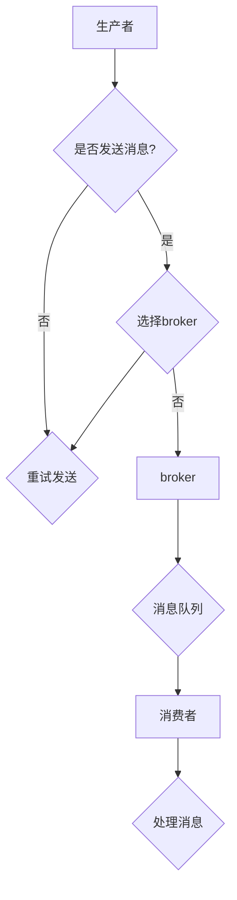

                 

关键词：分布式消息队列、架构设计、性能优化、一致性、容错性、消息中间件

> 摘要：本文深入探讨了分布式消息队列的设计与优化问题。首先，我们介绍了分布式消息队列的背景和重要性。接着，详细阐述了分布式消息队列的核心概念和联系，并通过 Mermaid 流程图展示了其架构。然后，我们分析了分布式消息队列的核心算法原理、数学模型、以及项目实践。最后，我们探讨了分布式消息队列在实际应用场景中的表现，并对未来发展趋势与挑战进行了展望。

## 1. 背景介绍

在当今的互联网时代，分布式系统已经成为企业架构设计的主流选择。分布式系统的核心在于其高可用性、高扩展性和高性能。而在这其中，分布式消息队列（Distributed Message Queue，简称 DMQ）扮演着至关重要的角色。

### 1.1 分布式消息队列的定义

分布式消息队列是一种基于分布式系统的消息传递机制，它允许应用程序在不同的节点之间传递消息，从而实现系统的解耦、异步和扩展性。它通过消息队列来存储和转发消息，确保消息能够可靠地传输，并在系统发生故障时保证消息的完整性。

### 1.2 分布式消息队列的重要性

分布式消息队列在分布式系统中具有以下几个重要作用：

1. **解耦**：通过消息队列，可以使得系统的不同模块之间相互独立，降低了系统间的耦合度。
2. **异步处理**：消息队列可以异步地处理消息，从而提高了系统的响应速度和吞吐量。
3. **高可用性**：通过分布式部署，消息队列可以在系统发生故障时保证消息的可靠传输。
4. **高扩展性**：消息队列可以轻松地扩展，以应对日益增长的业务需求。

## 2. 核心概念与联系

### 2.1 核心概念

在分布式消息队列中，有以下几个核心概念：

1. **生产者（Producer）**：生产消息的一端，将消息发送到消息队列中。
2. **消费者（Consumer）**：消费消息的一端，从消息队列中获取消息进行处理。
3. **消息队列（Message Queue）**：存储消息的数据结构，负责消息的存储和转发。
4. ** broker（代理）**：分布式消息队列的中枢，负责消息的路由和负载均衡。

### 2.2 关联架构

下图是一个典型的分布式消息队列架构，通过 Mermaid 流程图展示：



## 3. 核心算法原理 & 具体操作步骤

### 3.1 算法原理概述

分布式消息队列的核心算法主要包括消息的生成、存储、转发和消费。下面我们将详细阐述这些算法的原理和具体操作步骤。

### 3.2 算法步骤详解

1. **消息生成**：生产者将消息生成后，将其发送到消息队列中。
2. **消息存储**：消息队列将接收到的消息存储在内部的数据结构中，以备后续转发。
3. **消息转发**：当消费者请求消息时，消息队列会将消息转发给消费者。
4. **消息消费**：消费者从消息队列中获取消息并对其进行处理。

### 3.3 算法优缺点

**优点**：
- 高可用性：分布式消息队列可以通过冗余部署，确保在系统发生故障时仍能可靠地传递消息。
- 高扩展性：分布式消息队列可以水平扩展，以应对日益增长的业务需求。
- 解耦：通过消息队列，可以实现系统的解耦，降低模块之间的依赖。

**缺点**：
- 消息顺序性：在分布式系统中，消息的顺序性可能无法得到保障。
- 消息积压：在高并发场景下，消息队列可能会出现积压，导致处理延迟。

### 3.4 算法应用领域

分布式消息队列广泛应用于以下几个领域：

- **分布式系统通信**：用于系统间消息传递，实现模块解耦。
- **异步处理**：用于实现任务的异步处理，提高系统性能。
- **大数据处理**：用于数据采集和传输，实现数据的实时处理。

## 4. 数学模型和公式 & 详细讲解 & 举例说明

### 4.1 数学模型构建

在分布式消息队列中，我们主要关注以下几个数学模型：

1. **消息生成速率**：表示单位时间内生成的消息数量。
2. **消息处理速率**：表示单位时间内处理的消息数量。
3. **消息延迟**：表示从消息生成到消息处理完成的时间。

### 4.2 公式推导过程

根据上述数学模型，我们可以推导出以下几个重要公式：

1. **消息积压量**：消息积压量 = 消息生成速率 × 消息延迟
2. **系统吞吐量**：系统吞吐量 = 消息处理速率 × 消息延迟

### 4.3 案例分析与讲解

假设一个系统，其消息生成速率为1000条/秒，消息处理速率为500条/秒，消息延迟为2秒。根据上述公式，我们可以计算出：

- 消息积压量 = 1000 × 2 = 2000条
- 系统吞吐量 = 500 × 2 = 1000条/秒

这意味着在消息积压量为2000条时，系统的吞吐量将下降至1000条/秒。因此，我们需要通过优化消息延迟和消息处理速率来提高系统性能。

## 5. 项目实践：代码实例和详细解释说明

### 5.1 开发环境搭建

在本文中，我们将使用Kafka作为分布式消息队列的实例。首先，我们需要搭建Kafka的开发环境。

1. 下载并解压Kafka安装包
2. 配置Kafka环境变量
3. 启动Kafka服务器

### 5.2 源代码详细实现

下面是一个简单的Kafka生产者和消费者的源代码实现：

**生产者代码：**
```java
Properties props = new Properties();
props.put("bootstrap.servers", "localhost:9092");
props.put("key.serializer", "org.apache.kafka.common.serialization.StringSerializer");
props.put("value.serializer", "org.apache.kafka.common.serialization.StringSerializer");

Producer<String, String> producer = new KafkaProducer<>(props);

for (int i = 0; i < 10; i++) {
    producer.send(new ProducerRecord<>("test", "key" + i, "value" + i));
}

producer.close();
```

**消费者代码：**
```java
Properties props = new Properties();
props.put("bootstrap.servers", "localhost:9092");
props.put("group.id", "test-group");
props.put("key.deserializer", "org.apache.kafka.common.serialization.StringDeserializer");
props.put("value.deserializer", "org.apache.kafka.common.serialization.StringDeserializer");

Consumer<String, String> consumer = new KafkaConsumer<>(props);
consumer.subscribe(Collections.singletonList(new TopicPartition("test", 0)));

while (true) {
    ConsumerRecords<String, String> records = consumer.poll(Duration.ofMillis(1000));
    for (ConsumerRecord<String, String> record : records) {
        System.out.printf("offset = %d, key = %s, value = %s\n", record.offset(), record.key(), record.value());
    }
}
```

### 5.3 代码解读与分析

在这段代码中，我们首先配置了Kafka的生产者和消费者的参数，然后分别创建了一个KafkaProducer和KafkaConsumer对象。在消费者端，我们通过subscribe()方法订阅了一个主题，然后通过poll()方法获取消息并进行处理。

### 5.4 运行结果展示

运行生产者代码，将生成10条消息发送到Kafka队列。运行消费者代码，将实时打印接收到的消息。

## 6. 实际应用场景

### 6.1 分布式系统通信

在分布式系统中，分布式消息队列可以用于系统间消息传递，实现模块解耦。例如，在电商系统中，订单服务可以生成订单消息，将其发送到消息队列，然后库存服务、物流服务等模块可以分别从消息队列中获取订单消息进行处理。

### 6.2 异步处理

在需要异步处理任务的场景中，分布式消息队列可以大大提高系统的响应速度和吞吐量。例如，在邮件发送系统中，邮件发送任务可以异步地发送到消息队列，然后邮件发送模块可以逐个处理消息队列中的邮件任务。

### 6.3 大数据处理

在处理大量数据的场景中，分布式消息队列可以用于数据采集和传输。例如，在实时数据分析系统中，可以将各种来源的数据发送到消息队列，然后数据消费者可以实时地获取数据并进行处理。

## 7. 工具和资源推荐

### 7.1 学习资源推荐

- 《Kafka：从入门到实战》
- 《消息队列：核心原理与分布式实践》

### 7.2 开发工具推荐

- Kafka Manager：用于监控和管理Kafka集群
- Kafka Topology Editor：用于可视化Kafka集群拓扑结构

### 7.3 相关论文推荐

- "A Distributed Messaging System for Internet Applications"
- "Kafka: A Distributed Streaming Platform"

## 8. 总结：未来发展趋势与挑战

### 8.1 研究成果总结

分布式消息队列在近年来取得了显著的成果，其在高可用性、高扩展性和高性能方面表现优异。同时，随着云计算、大数据和物联网等技术的发展，分布式消息队列的应用场景越来越广泛。

### 8.2 未来发展趋势

- **消息流处理**：分布式消息队列将逐渐融合流处理技术，实现实时数据分析和处理。
- **多语言支持**：分布式消息队列将支持更多的编程语言，以提高其可扩展性和兼容性。
- **智能消息路由**：通过引入人工智能技术，实现更智能的消息路由和负载均衡。

### 8.3 面临的挑战

- **消息顺序性保障**：如何在分布式系统中确保消息的顺序性，仍是一个亟待解决的问题。
- **消息积压处理**：在高并发场景下，如何有效地处理消息积压，避免系统性能下降。

### 8.4 研究展望

随着技术的不断发展，分布式消息队列将在更多领域得到应用，并在性能、可靠性和智能化方面取得更大的突破。

## 9. 附录：常见问题与解答

### 9.1 什么是分布式消息队列？

分布式消息队列是一种基于分布式系统的消息传递机制，它允许应用程序在不同的节点之间传递消息，从而实现系统的解耦、异步和扩展性。

### 9.2 分布式消息队列有哪些核心概念？

分布式消息队列的核心概念包括生产者、消费者、消息队列和 broker。

### 9.3 分布式消息队列有哪些优点？

分布式消息队列的优点包括高可用性、高扩展性和解耦。

### 9.4 分布式消息队列有哪些应用领域？

分布式消息队列广泛应用于分布式系统通信、异步处理和大数据处理等领域。

---

作者：禅与计算机程序设计艺术 / Zen and the Art of Computer Programming
----------------------------------------------------------------
<|text-box|>

