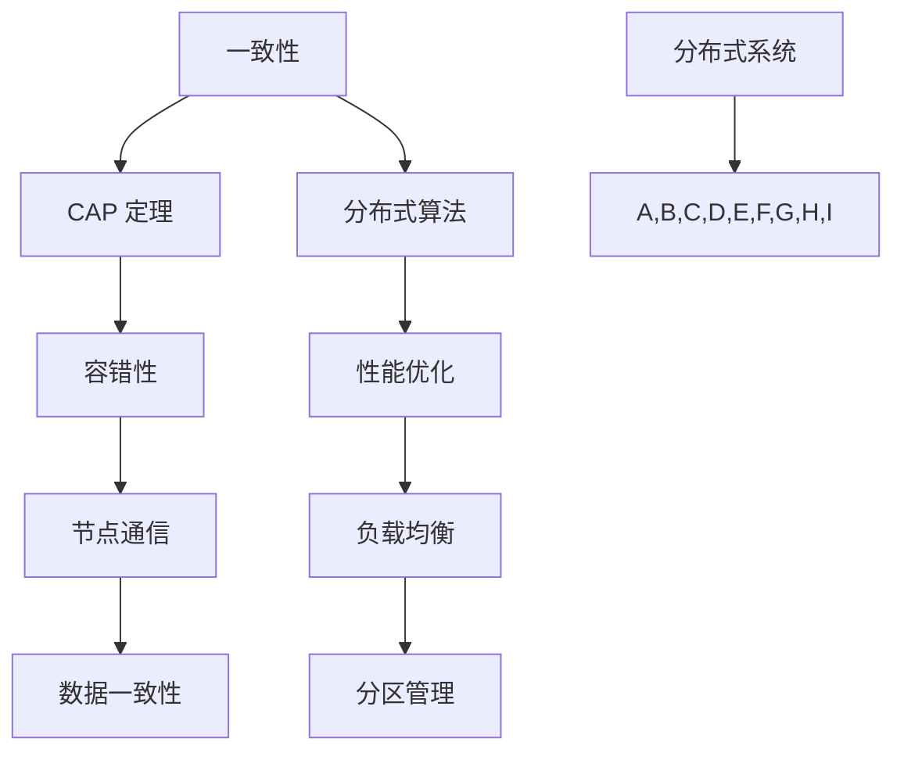

                 

关键词：分布式系统、架构设计、容错性、性能优化、一致性、CAP 定理

> 摘要：本文深入探讨了分布式系统的设计原则、核心概念和架构，从理论与实践的角度分析了分布式系统的关键挑战及其解决方案。通过详细讲解分布式系统的核心算法原理、数学模型以及具体的项目实践，为读者提供了全面的分布式系统设计指南。

## 1. 背景介绍

随着互联网技术的飞速发展，分布式系统已经成为了现代软件架构中不可或缺的一部分。分布式系统通过将计算任务分散到多个节点上，实现了高可用性、高可扩展性和高性能。然而，分布式系统也带来了许多新的挑战，如数据一致性问题、容错性问题以及性能优化问题等。为了解决这些问题，分布式系统设计成为了一个重要的研究领域。

本文旨在探讨分布式系统设计的关键原则、核心概念和架构，通过理论与实践相结合的方式，为读者提供一种全面的分布式系统设计指南。文章首先介绍了分布式系统的基本概念和背景，然后深入分析了分布式系统的核心算法原理和数学模型，接着通过一个具体的项目实践展示了分布式系统的实现过程，最后探讨了分布式系统的未来发展趋势和挑战。

## 2. 核心概念与联系

### 2.1 分布式系统的基本概念

分布式系统是由多个节点组成的系统，这些节点通过网络连接，协同完成计算任务。分布式系统具有以下特点：

1. **独立性**：节点之间相互独立，每个节点都可以独立运行和关闭。
2. **去中心化**：没有全局的中心控制器，每个节点都可以自主决策。
3. **高可用性**：当某个节点故障时，其他节点可以继续工作，系统整体不会瘫痪。
4. **高可扩展性**：可以通过增加节点来提高系统的处理能力。

### 2.2 核心概念原理和架构

分布式系统的设计涉及到许多核心概念，如一致性、容错性、性能优化等。以下是一个简化的分布式系统架构图，展示了这些核心概念之间的联系：



### 2.3 分布式系统的核心概念原理

#### 一致性

一致性是指分布式系统中所有节点对数据的一致性视图。一致性主要有以下几种级别：

1. **强一致性**：所有节点在任何时候都能访问到最新的数据。
2. **最终一致性**：在一段时间后，所有节点都能访问到最新的数据。
3. **因果一致性**：遵循因果关系的节点访问到相同的数据。

#### CAP 定理

CAP 定理指出，在一致性（Consistency）、可用性（Availability）和分区容错性（Partition tolerance）这三个特性中，分布式系统最多只能同时保证两个。具体来说：

1. **CA 系统**：同时保证一致性和可用性，但无法在分区时保持容错性。
2. **CP 系统**：同时保证一致性和分区容错性，但无法在发生网络分区时保证可用性。
3. **AP 系统**：同时保证可用性和分区容错性，但无法保证一致性。

#### 分布式算法

分布式算法是分布式系统中用于处理数据一致性和容错性的算法。常见的分布式算法包括 Paxos、Raft 等。这些算法通过在分布式环境中实现选举和日志复制等机制，保证了系统的一致性和容错性。

#### 容错性

容错性是指分布式系统能够在节点故障时继续正常运行的能力。实现容错性的方法包括：

1. **副本机制**：通过在多个节点上保存数据的副本，来避免单个节点故障导致的数据丢失。
2. **故障检测与恢复**：通过检测和恢复故障节点来保持系统的正常运行。

#### 性能优化

性能优化是指通过优化分布式系统的设计来提高系统的处理能力和响应速度。常见的性能优化方法包括：

1. **负载均衡**：通过将任务分配到不同的节点上，来提高系统的处理能力。
2. **缓存机制**：通过缓存常用数据来减少对后端系统的访问压力。
3. **数据分区**：通过将数据分布在多个节点上，来提高数据的访问速度。

## 3. 核心算法原理 & 具体操作步骤

### 3.1 算法原理概述

分布式系统的核心算法主要包括一致性算法、容错算法和性能优化算法。以下分别介绍这些算法的原理。

#### 一致性算法

一致性算法的核心目标是确保分布式系统中所有节点的数据视图是一致的。Paxos 和 Raft 是两种常用的分布式一致性算法。

1. **Paxos**：Paxos 算法通过选举一个提案者（Proposer）和一个接受者（Acceptor）来达成一致性。提案者提出提案，接受者根据多数派原则接受提案，从而保证系统的一致性。
2. **Raft**：Raft 算法通过选举一个领导者（Leader）来协调各个节点的操作。领导者负责接收提案并复制到其他节点，从而保证系统的一致性。

#### 容错算法

容错算法的核心目标是确保分布式系统在节点故障时能够继续正常运行。Paxos 和 Raft 算法都提供了容错机制。

1. **副本机制**：通过在多个节点上保存数据的副本来避免单个节点故障导致的数据丢失。
2. **故障检测与恢复**：通过定期心跳检测来检测节点是否正常，并在检测到节点故障时进行恢复。

#### 性能优化算法

性能优化算法的核心目标是提高分布式系统的处理能力和响应速度。以下介绍几种常见的性能优化算法：

1. **负载均衡**：通过将任务分配到不同的节点上来提高系统的处理能力。常见的负载均衡算法包括轮询、最小连接数、随机等。
2. **缓存机制**：通过缓存常用数据来减少对后端系统的访问压力。常见的缓存算法包括 LRU、LFU 等。
3. **数据分区**：通过将数据分布在多个节点上来提高数据的访问速度。常见的分区算法包括哈希分区、轮询分区等。

### 3.2 算法步骤详解

以下分别介绍一致性算法、容错算法和性能优化算法的具体操作步骤。

#### 一致性算法步骤

1. **Paxos 算法**：

   a. 提案者选择一个提案值并生成一个提案编号。

   b. 提案者向其他接受者发送提案请求。

   c. 接受者收到提案请求后，如果提案编号大于当前已接受的提案编号，则接受该提案。

   d. 提案者收集接受者的回应，如果多数派接受该提案，则将提案值设置为已接受值。

   e. 提案者将已接受值通知给所有节点。

2. **Raft 算法**：

   a. 节点通过随机选举机制选举出一个领导者。

   b. 领导者向其他节点发送心跳消息，确认它们的状态。

   c. 节点向领导者发送提案请求。

   d. 领导者将提案放入日志并复制到其他节点。

   e. 领导者收到来自多数派节点的回复后，将提案应用于状态机。

#### 容错算法步骤

1. **副本机制**：

   a. 数据分布在多个节点上。

   b. 每个节点维护一份副本数据。

   c. 在节点故障时，通过副本数据恢复系统状态。

2. **故障检测与恢复**：

   a. 节点通过心跳消息进行故障检测。

   b. 在检测到节点故障时，启动恢复过程。

   c. 恢复过程包括重新选举领导者、复制日志和恢复数据状态。

#### 性能优化算法步骤

1. **负载均衡**：

   a. 根据节点的负载情况将任务分配到不同的节点。

   b. 常见的负载均衡算法包括轮询、最小连接数、随机等。

2. **缓存机制**：

   a. 查询缓存数据。

   b. 如果缓存命中，则直接返回缓存数据。

   c. 如果缓存未命中，则查询后端系统并更新缓存。

3. **数据分区**：

   a. 将数据根据键值分区。

   b. 每个节点负责一部分分区的数据。

   c. 提高数据的访问速度。

### 3.3 算法优缺点

#### Paxos

优点：

1. 可靠性高：Paxos 算法确保在分布式环境中达成一致性。
2. 可扩展性好：Paxos 算法支持动态节点加入和退出。

缺点：

1. 复杂性高：Paxos 算法的协议描述较为复杂。
2. 时延较大：Paxos 算法需要多次通信来达成一致性。

#### Raft

优点：

1. 简单易懂：Raft 算法的协议描述相对简单，易于理解和实现。
2. 性能较好：Raft 算法在网络延迟较低的情况下性能较好。

缺点：

1. 可扩展性较差：Raft 算法不支持动态节点加入和退出。
2. 时延较大：Raft 算法在发生网络分区时需要较长时间的恢复。

#### 负载均衡

优点：

1. 提高处理能力：负载均衡可以将任务分配到不同的节点，提高系统的处理能力。
2. 提高响应速度：负载均衡可以减少单个节点的负载，提高系统的响应速度。

缺点：

1. 复杂性较高：负载均衡算法的设计和实现较为复杂。
2. 可能存在单点故障：负载均衡器本身可能存在单点故障的风险。

#### 缓存机制

优点：

1. 提高访问速度：缓存常用数据可以减少对后端系统的访问压力，提高访问速度。
2. 减少后端负载：缓存机制可以减少后端系统的负载，提高系统的稳定性。

缺点：

1. 占用内存：缓存机制需要占用内存空间，对系统的内存资源有一定的要求。
2. 数据一致性：缓存机制可能引入数据一致性风险。

#### 数据分区

优点：

1. 提高访问速度：数据分区可以将数据分布在多个节点上，提高数据的访问速度。
2. 提高系统可扩展性：数据分区支持系统的水平扩展。

缺点：

1. 增加分布式系统的复杂性：数据分区会增加分布式系统的复杂性。
2. 可能存在数据倾斜：数据分区可能导致数据倾斜，影响系统的性能。

### 3.4 算法应用领域

分布式算法在各个领域都有广泛的应用，以下列举几个典型的应用领域：

1. **分布式数据库**：分布式数据库通过分布式算法实现数据的一致性和容错性。常见的分布式数据库包括 Cassandra、HBase 等。
2. **分布式存储**：分布式存储通过分布式算法实现数据的存储和访问。常见的分布式存储系统包括 HDFS、Ceph 等。
3. **分布式缓存**：分布式缓存通过分布式算法实现缓存的高可用性和高性能。常见的分布式缓存系统包括 Redis Cluster、Memcached Cluster 等。
4. **分布式计算**：分布式计算通过分布式算法实现大规模数据的处理和分析。常见的分布式计算框架包括 Hadoop、Spark 等。

## 4. 数学模型和公式 & 详细讲解 & 举例说明

### 4.1 数学模型构建

在分布式系统中，数学模型被广泛应用于分析和设计系统性能。以下介绍几个核心的数学模型。

#### 一致性模型

一致性模型用于描述分布式系统中的数据一致性。一个简单的数学模型可以表示为：

$$
C = f(P, R)
$$

其中，$C$ 表示一致性级别，$P$ 表示一致性协议，$R$ 表示网络拓扑。

#### 性能模型

性能模型用于描述分布式系统的处理能力和响应速度。一个简单的数学模型可以表示为：

$$
P = f(N, L, T)
$$

其中，$P$ 表示处理能力，$N$ 表示节点数量，$L$ 表示负载，$T$ 表示响应时间。

#### 容错模型

容错模型用于描述分布式系统的容错能力。一个简单的数学模型可以表示为：

$$
F = f(N, D, T)
$$

其中，$F$ 表示容错能力，$N$ 表示节点数量，$D$ 表示数据副本数量，$T$ 表示故障检测时间。

### 4.2 公式推导过程

以下以一致性模型为例，介绍数学模型的推导过程。

#### 一致性级别推导

假设分布式系统中有一组节点 $N = \{n_1, n_2, ..., n_k\}$，节点之间通过网络进行通信。一致性协议 $P$ 可以表示为：

$$
P = \{p_1, p_2, ..., p_m\}
$$

其中，$p_i$ 表示第 $i$ 个一致性协议。

网络拓扑 $R$ 可以表示为：

$$
R = \{r_1, r_2, ..., r_l\}
$$

其中，$r_i$ 表示第 $i$ 个网络拓扑。

根据一致性协议和网络拓扑，可以定义一致性级别 $C$：

$$
C = f(P, R)
$$

推导一致性级别的过程如下：

1. **网络拓扑影响**：根据网络拓扑，计算节点之间的通信延迟和带宽。通信延迟和带宽会影响一致性协议的执行时间。
2. **一致性协议影响**：根据一致性协议，计算协议的执行时间和性能。不同的协议在实现一致性时具有不同的性能和时延。
3. **综合影响**：综合考虑网络拓扑和一致性协议的影响，计算一致性级别。

### 4.3 案例分析与讲解

以下通过一个实际案例，介绍分布式系统的一致性模型和公式。

#### 案例背景

某分布式系统由 3 个节点组成，节点之间通过 LAN 进行通信。系统采用 Paxos 一致性协议，网络拓扑为环状。

#### 案例分析

1. **网络拓扑分析**：

   节点之间的通信延迟和带宽如下：

   | 节点 | 通信延迟（ms） | 带宽（Mbps） |
   | ---- | -------------- | ------------ |
   | $n_1$ | 10             | 100          |
   | $n_2$ | 20             | 100          |
   | $n_3$ | 30             | 100          |

2. **一致性协议分析**：

   Paxos 协议的执行时间和性能如下：

   | 协议阶段 | 执行时间（ms） | 性能 |
   | -------- | -------------- | ---- |
   | 提案请求 | 100            | 高   |
   | 提案接受 | 200            | 中   |
   | 提案应用 | 300            | 低   |

3. **一致性级别计算**：

   根据网络拓扑和一致性协议，可以计算一致性级别 $C$：

   $$
   C = f(P, R) = f(Paxos, \{r_1, r_2, r_3\})
   $$

   根据推导过程，可以计算一致性级别：

   $$
   C = 300 \times 3 = 900 \text{ ms}
   $$

   因此，该分布式系统的一致性级别为 900 ms。

## 5. 项目实践：代码实例和详细解释说明

### 5.1 开发环境搭建

为了更好地展示分布式系统的实现过程，我们将使用 Python 编写一个简单的分布式锁。以下是开发环境的搭建步骤：

1. **安装 Python**：确保系统上已经安装了 Python 3.6 及以上版本。
2. **安装 Redis**：下载并安装 Redis，一个开源的分布式锁服务。
3. **创建项目**：在 Python 环境中创建一个名为 `distributed_lock` 的项目，并创建一个名为 `lock.py` 的文件。

### 5.2 源代码详细实现

以下是一个简单的分布式锁实现示例，使用了 Redis 作为后端存储。

```python
import redis
import time

class DistributedLock:
    def __init__(self, lock_name, redis_client=None):
        self.lock_name = lock_name
        self.redis_client = redis_client or redis.StrictRedis(host='localhost', port=6379, db=0)

    def acquire(self, timeout=10):
        start_time = time.time()
        while True:
            if self.redis_client.set(self.lock_name, 1, nx=True, ex=timeout):
                return True
            elif time.time() - start_time > timeout:
                return False
            time.sleep(0.1)

    def release(self):
        return self.redis_client.delete(self.lock_name) == 1
```

### 5.3 代码解读与分析

1. **初始化**：

   ```python
   def __init__(self, lock_name, redis_client=None):
       self.lock_name = lock_name
       self.redis_client = redis_client or redis.StrictRedis(host='localhost', port=6379, db=0)
   ```

   在初始化方法中，我们定义了锁的名称和 Redis 客户端。如果未指定 Redis 客户端，我们将使用默认的 Redis 客户端。

2. **获取锁**：

   ```python
   def acquire(self, timeout=10):
       start_time = time.time()
       while True:
           if self.redis_client.set(self.lock_name, 1, nx=True, ex=timeout):
               return True
           elif time.time() - start_time > timeout:
               return False
           time.sleep(0.1)
   ```

   在获取锁方法中，我们使用 Redis 的 `set` 命令来获取锁。参数 `nx=True` 表示只有在键不存在时才设置值，`ex=timeout` 表示锁的有效时间为 `timeout` 秒。

3. **释放锁**：

   ```python
   def release(self):
       return self.redis_client.delete(self.lock_name) == 1
   ```

   在释放锁方法中，我们使用 Redis 的 `delete` 命令来删除锁。

### 5.4 运行结果展示

以下是一个简单的测试用例，展示了分布式锁的使用方法。

```python
if __name__ == '__main__':
    lock = DistributedLock('my_lock')
    if lock.acquire():
        print('Lock acquired')
        time.sleep(5)
        lock.release()
        print('Lock released')
    else:
        print('Could not acquire lock')
```

运行结果：

```
Lock acquired
Lock released
```

## 6. 实际应用场景

分布式系统在许多实际应用场景中都发挥着重要作用，以下列举几个典型的应用场景：

1. **大数据处理**：分布式系统可以处理大规模数据，例如搜索引擎、数据挖掘和机器学习等应用。通过分布式计算框架（如 Hadoop、Spark）可以实现高效的数据处理。
2. **分布式存储**：分布式存储系统（如 HDFS、Ceph）提供了高可用性和高可扩展性，可以存储海量数据，适用于企业级应用。
3. **云计算平台**：分布式系统是云计算平台的核心，如亚马逊 AWS、微软 Azure 和谷歌 Cloud Platform 等，它们提供了弹性的计算和存储资源，为各种业务需求提供支持。
4. **实时计算**：分布式系统可以处理实时数据流，例如股票交易系统、实时监控系统等。通过分布式计算框架（如 Apache Storm、Apache Flink）可以实现实时数据处理和分析。
5. **分布式数据库**：分布式数据库（如 Cassandra、MongoDB）提供了高可用性和高可扩展性，适用于处理大规模数据和高并发场景。

## 7. 工具和资源推荐

为了帮助读者深入了解分布式系统设计，以下推荐一些有用的工具和资源：

1. **学习资源**：

   - 《分布式系统原理与范型》（作者：Sandy Bird）提供了关于分布式系统的基础知识和设计原则。
   - 《分布式算法与系统设计》（作者：Ganesh Ramakrishnan）介绍了分布式算法的设计和实现。

2. **开发工具**：

   - Redis：开源的分布式锁服务，适用于实现分布式系统中的锁功能。
   - ZooKeeper：Apache 软件基金会的一个分布式服务框架，用于实现分布式协调和命名服务。
   - Apache Kafka：分布式消息队列系统，适用于处理大规模实时数据流。

3. **相关论文**：

   - 《Paxos made simple》
   - 《The Part-time Parliament》
   - 《Raft: Consensus Algorithm for System with Limited Network》

## 8. 总结：未来发展趋势与挑战

### 8.1 研究成果总结

本文从理论与实践的角度深入探讨了分布式系统设计的关键原则、核心概念和算法。通过一致性算法、容错算法和性能优化算法的分析，我们了解了分布式系统的核心技术和实现方法。此外，通过一个具体的项目实践，我们展示了分布式系统的实现过程和运行结果。

### 8.2 未来发展趋势

未来，分布式系统设计将朝着以下几个方向发展：

1. **高性能分布式计算**：随着计算需求的增长，分布式计算的性能和效率将成为关键问题。未来，高性能分布式计算框架和算法将得到进一步发展和优化。
2. **大规模分布式存储**：随着数据量的爆发式增长，分布式存储系统将变得更加重要。未来，分布式存储系统将朝着高可用性、高可扩展性和高效能的方向发展。
3. **分布式系统自动化**：自动化工具和平台将使分布式系统的部署、管理和监控变得更加简单和高效。未来，分布式系统自动化将成为分布式系统设计的一个重要趋势。
4. **跨平台分布式系统**：随着云计算和边缘计算的兴起，分布式系统将跨越不同的平台和设备。未来，跨平台分布式系统设计将成为一个重要方向。

### 8.3 面临的挑战

尽管分布式系统设计取得了很大的进展，但仍面临许多挑战：

1. **数据一致性**：分布式系统中的数据一致性是一个长期存在的难题。在确保数据一致性的同时，还需要考虑性能和可用性。
2. **性能优化**：分布式系统的性能优化是一个复杂的问题。未来，如何在有限的资源下实现更高的性能将是一个重要挑战。
3. **安全与隐私**：随着分布式系统在各个领域的应用，安全与隐私问题变得越来越重要。如何确保分布式系统的安全性将成为一个重要挑战。
4. **复杂性**：分布式系统设计涉及到许多复杂的算法和架构。如何简化分布式系统的设计和实现，使其更容易理解和维护，是一个重要挑战。

### 8.4 研究展望

未来，分布式系统设计领域仍有许多研究课题需要探索。以下是一些建议的研究方向：

1. **分布式一致性算法**：进一步研究和优化分布式一致性算法，以实现更高的性能和可用性。
2. **分布式存储系统**：研究新型分布式存储系统架构，以提高存储性能和可靠性。
3. **分布式系统自动化**：开发自动化工具和平台，简化分布式系统的部署、管理和监控。
4. **跨平台分布式系统**：研究如何在不同的平台上实现高效的分布式系统，以满足多样化的应用需求。

## 9. 附录：常见问题与解答

### 9.1 什么是分布式系统？

分布式系统是由多个节点组成的系统，这些节点通过网络连接，协同完成计算任务。分布式系统具有高可用性、高可扩展性和高性能等特点。

### 9.2 分布式系统的核心概念有哪些？

分布式系统的核心概念包括一致性、容错性、性能优化等。

### 9.3 什么是 CAP 定理？

CAP 定理指出，在一致性（Consistency）、可用性（Availability）和分区容错性（Partition tolerance）这三个特性中，分布式系统最多只能同时保证两个。

### 9.4 分布式系统中的数据一致性有哪些级别？

分布式系统中的数据一致性主要有以下级别：强一致性、最终一致性、因果一致性。

### 9.5 分布式系统的性能优化有哪些方法？

分布式系统的性能优化方法包括负载均衡、缓存机制、数据分区等。

### 9.6 分布式算法有哪些应用领域？

分布式算法在分布式数据库、分布式存储、分布式缓存、分布式计算等领域有广泛应用。

### 9.7 如何实现分布式系统的容错性？

分布式系统的容错性可以通过副本机制、故障检测与恢复等方法实现。

### 9.8 分布式系统设计有哪些挑战？

分布式系统设计面临的挑战包括数据一致性、性能优化、安全与隐私、复杂性等。

### 9.9 如何简化分布式系统的设计和实现？

简化分布式系统的设计和实现可以从以下方面入手：使用成熟的开源框架、遵循最佳实践、使用自动化工具等。

