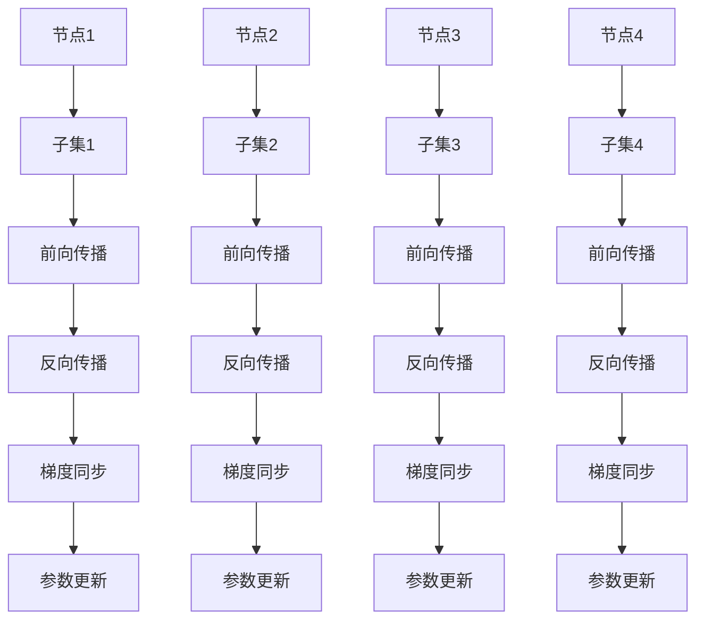
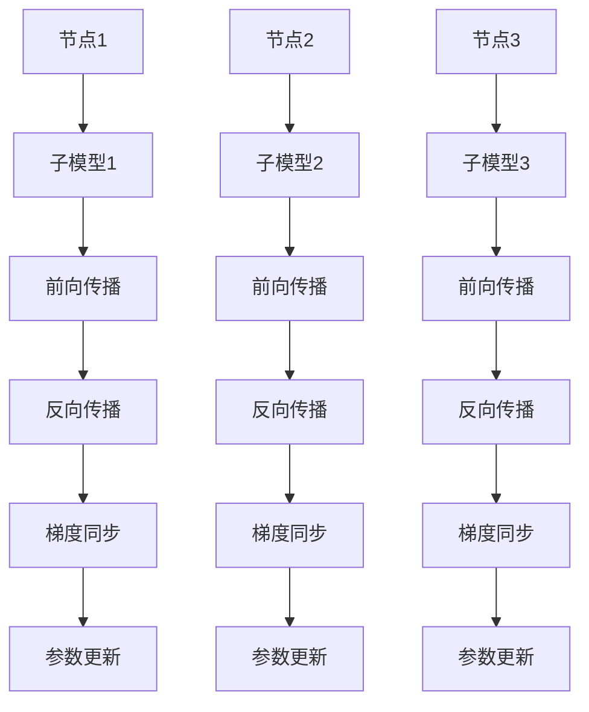

                 

关键词：分布式训练、数据并行、模型并行、深度学习、AI、训练效率、计算资源利用

## 摘要

本文将深入探讨分布式训练中的两种核心策略：数据并行和模型并行。这两种策略在深度学习领域中具有关键作用，能够显著提升训练效率，优化计算资源利用。文章首先介绍分布式训练的背景和重要性，然后详细解析数据并行和模型并行的基本概念、原理、优点、缺点及其应用领域。此外，文章还将介绍数学模型和具体操作步骤，并通过实例代码展示实际应用。最后，文章将展望分布式训练的未来发展趋势和挑战，并提供相关工具和资源的推荐。

## 1. 背景介绍

随着深度学习的迅猛发展，大规模的神经网络模型在各个领域（如图像识别、自然语言处理、语音识别等）取得了显著成果。然而，这些模型的训练过程通常需要大量的计算资源和时间，传统的单机训练模式难以满足日益增长的需求。因此，分布式训练作为一种有效的解决方案应运而生。

### 分布式训练的必要性

分布式训练的主要目的是将训练任务分解到多个节点上，利用多个计算资源并行执行，从而提高训练效率和缩短训练时间。具体来说，分布式训练有以下几方面的必要性：

1. **计算资源不足**：单机训练通常受限于计算能力、内存容量和存储容量，无法处理大规模的训练数据集和复杂的神经网络模型。
2. **数据量激增**：随着互联网和传感器技术的快速发展，数据量呈现指数级增长，单机训练难以在合理时间内完成数据处理和模型训练。
3. **实时性要求**：在某些应用场景（如实时语音识别、自动驾驶等），需要模型能够在短时间内完成训练并实时更新，分布式训练能够满足这一需求。

### 分布式训练的发展历程

分布式训练经历了以下几个发展阶段：

1. **数据并行**：最初，分布式训练主要采用数据并行（Data Parallelism）策略，将训练数据集分成多个子集，每个节点分别处理不同的子集，然后通过同步或异步方式聚合结果。
2. **模型并行**：随着模型复杂度的增加，模型并行（Model Parallelism）策略逐渐得到关注。模型并行将复杂的神经网络模型拆分为多个部分，每个部分运行在不同的节点上，并通过通信机制协调工作。
3. **混合并行**：在实际应用中，数据并行和模型并行常常结合使用，形成混合并行（Hybrid Parallelism），以最大化资源利用和训练效率。

### 分布式训练的应用领域

分布式训练已在多个领域取得显著应用：

1. **自然语言处理**：例如BERT、GPT等大规模语言模型采用分布式训练策略，显著提升了模型性能和训练速度。
2. **计算机视觉**：如ResNet、EfficientNet等深度学习模型在图像分类、目标检测等领域采用分布式训练，实现了更高的准确率和更快的推理速度。
3. **语音识别**：例如WaveNet、Transformer等语音模型采用分布式训练，在语音识别任务中取得了突破性进展。

## 2. 核心概念与联系

### 数据并行

数据并行是一种分布式训练策略，其主要思想是将训练数据集分成多个子集，每个节点分别处理不同的子集，然后通过同步或异步方式聚合结果。数据并行的核心概念包括：

1. **数据分割**：将原始数据集按一定规则（如随机分割、批次分割等）划分成多个子集，每个子集分配给不同的节点。
2. **梯度同步**：在处理完各自的子集后，每个节点将梯度信息同步到全局梯度，用于更新模型参数。
3. **负载均衡**：通过动态调整数据分配策略，确保每个节点的处理负载均衡，避免资源浪费。

### 模型并行

模型并行是一种分布式训练策略，其主要思想是将复杂的神经网络模型拆分为多个部分，每个部分运行在不同的节点上，并通过通信机制协调工作。模型并行的核心概念包括：

1. **模型分割**：将神经网络模型按照计算图分割成多个子模型，每个子模型运行在不同的节点上。
2. **通信机制**：通过通信层（如GPU、网络等）实现子模型之间的信息交换和梯度同步。
3. **计算优化**：通过模型拆分和并行计算，优化计算资源和通信开销，提高训练效率。

### 数据并行与模型并行的联系

数据并行和模型并行并非孤立存在，它们可以相互结合，形成更高效的分布式训练策略。以下是数据并行和模型并行之间的联系：

1. **混合并行**：在实际应用中，数据并行和模型并行常常结合使用，形成混合并行策略。通过将数据并行应用于不同子模型之间的数据分割，模型并行应用于子模型内部的计算优化，实现资源利用的最大化和训练效率的提升。
2. **动态调整**：在训练过程中，可以根据实际负载和资源情况，动态调整数据并行和模型并行的比例，以实现最优的训练性能。

## 2.1 数据并行原理

数据并行的核心在于将数据集分割成多个子集，每个子集由不同的节点处理。具体来说，数据并行的原理包括以下几个方面：

1. **数据分割**：假设原始数据集为 \( D \)，可以将其划分为 \( n \) 个子集 \( D_1, D_2, ..., D_n \)，每个子集由不同的节点处理。数据分割的方法有多种，如随机分割、批次分割、分区分割等。
2. **模型复制**：在每个节点上复制一份完整的模型参数，每个节点独立对各自的子集进行前向传播和反向传播计算。
3. **梯度同步**：在每个节点完成前向传播和反向传播计算后，将梯度信息同步到全局梯度，用于更新模型参数。梯度同步的方式可以是同步更新（Synchronized Gradient Update）或异步更新（Asynchronous Gradient Update）。
4. **负载均衡**：在数据分割过程中，需要考虑数据分布的均匀性，确保每个节点的处理负载均衡，避免某些节点负载过高导致资源浪费。

### 数据并行的 Mermaid 流程图



### 数据并行的优点

1. **计算资源利用率高**：通过将数据集分割成多个子集，实现计算资源的充分利用，避免了单机训练的瓶颈。
2. **易于实现**：数据并行的实现相对简单，只需要将数据集分割成多个子集，并在不同节点上独立计算。
3. **适用于大规模数据集**：数据并行适用于处理大规模数据集，能够显著缩短训练时间。

### 数据并行的缺点

1. **同步开销较大**：数据并行需要同步梯度信息，同步开销较大，可能导致训练时间延长。
2. **网络依赖性高**：数据并行依赖于网络通信，网络延迟和带宽限制可能影响训练效率。
3. **无法利用模型并行优化**：数据并行无法实现模型并行优化，可能导致计算资源的浪费。

### 数据并行的应用领域

数据并行适用于以下领域：

1. **大规模图像分类**：例如ImageNet、CIFAR-10等数据集，通过数据并行可以显著提高训练速度。
2. **自然语言处理**：例如BERT、GPT等大规模语言模型，通过数据并行可以充分利用计算资源。
3. **语音识别**：例如WaveNet、Transformer等语音模型，通过数据并行可以实现实时训练和推理。

## 2.2 模型并行原理

模型并行的核心在于将复杂的神经网络模型拆分为多个子模型，每个子模型运行在不同的节点上。具体来说，模型并行的原理包括以下几个方面：

1. **模型分割**：将神经网络模型按照计算图分割成多个子模型，每个子模型运行在不同的节点上。模型分割的方法有多种，如计算图分割、参数分割、计算任务分割等。
2. **通信机制**：通过通信层（如GPU、网络等）实现子模型之间的信息交换和梯度同步。通信机制的选择和设计对模型并行性能有重要影响。
3. **计算优化**：通过模型拆分和并行计算，优化计算资源和通信开销，提高训练效率。

### 模型并行的 Mermaid 流程图



### 模型并行的优点

1. **计算资源利用率高**：通过将模型拆分为多个子模型，实现计算资源的充分利用，避免了单机训练的瓶颈。
2. **适用于复杂模型**：模型并行适用于处理复杂模型，能够充分利用计算资源和通信资源。
3. **并行计算效率高**：模型并行可以实现计算任务的并行执行，提高计算效率。

### 模型并行的缺点

1. **实现难度较大**：模型并行的实现相对复杂，需要考虑模型分割、通信机制和计算优化等多个方面。
2. **通信开销较大**：模型并行需要频繁进行子模型之间的信息交换和梯度同步，通信开销较大。
3. **参数分割影响模型性能**：模型拆分过程中，参数分割可能导致模型性能下降。

### 模型并行的应用领域

模型并行适用于以下领域：

1. **大规模图像分类**：例如ResNet、EfficientNet等深度学习模型，通过模型并行可以充分利用计算资源。
2. **自然语言处理**：例如BERT、GPT等大规模语言模型，通过模型并行可以实现高效的训练和推理。
3. **语音识别**：例如WaveNet、Transformer等语音模型，通过模型并行可以实现实时训练和推理。

## 3. 核心算法原理 & 具体操作步骤

### 3.1 算法原理概述

分布式训练的核心算法主要包括数据并行和模型并行。数据并行的原理是将训练数据集分割成多个子集，每个节点独立处理子集并进行梯度同步；模型并行的原理是将复杂的神经网络模型拆分为多个子模型，每个子模型在不同的节点上运行并进行通信和梯度同步。以下是具体的操作步骤：

### 3.2 算法步骤详解

#### 3.2.1 数据并行的操作步骤

1. **数据分割**：将原始数据集按一定规则（如随机分割、批次分割等）划分成多个子集，每个子集分配给不同的节点。
2. **模型初始化**：在每个节点上复制一份完整的模型参数，初始化为随机值或预训练模型。
3. **数据加载**：每个节点从数据集中读取各自的子集，并预处理数据（如归一化、批量归一化等）。
4. **前向传播**：在每个节点上对预处理后的子集进行前向传播计算，计算输出结果和损失函数。
5. **反向传播**：在每个节点上对前向传播的结果进行反向传播计算，计算梯度信息。
6. **梯度同步**：将每个节点的梯度信息同步到全局梯度，更新模型参数。
7. **迭代训练**：重复步骤 4-6，直到满足训练终止条件（如迭代次数、收敛精度等）。

#### 3.2.2 模型并行的操作步骤

1. **模型分割**：将神经网络模型按照计算图分割成多个子模型，每个子模型运行在不同的节点上。
2. **通信层初始化**：建立节点之间的通信层，配置通信协议和数据传输方式。
3. **子模型初始化**：在每个节点上初始化子模型的参数，初始化为随机值或预训练模型。
4. **前向传播**：在每个节点上对子模型进行前向传播计算，计算输出结果和损失函数。
5. **反向传播**：在每个节点上对子模型的前向传播结果进行反向传播计算，计算梯度信息。
6. **梯度同步**：通过通信层实现子模型之间的梯度同步，更新子模型参数。
7. **迭代训练**：重复步骤 4-6，直到满足训练终止条件（如迭代次数、收敛精度等）。

### 3.3 算法优缺点

#### 数据并行的优点

1. **计算资源利用率高**：通过将数据集分割成多个子集，实现计算资源的充分利用。
2. **易于实现**：数据并行的实现相对简单，只需要将数据集分割成多个子集，并在不同节点上独立计算。
3. **适用于大规模数据集**：数据并行适用于处理大规模数据集，能够显著缩短训练时间。

#### 数据并行的缺点

1. **同步开销较大**：数据并行需要同步梯度信息，同步开销较大，可能导致训练时间延长。
2. **网络依赖性高**：数据并行依赖于网络通信，网络延迟和带宽限制可能影响训练效率。
3. **无法利用模型并行优化**：数据并行无法实现模型并行优化，可能导致计算资源的浪费。

#### 模型并行的优点

1. **计算资源利用率高**：通过将模型拆分为多个子模型，实现计算资源的充分利用。
2. **适用于复杂模型**：模型并行适用于处理复杂模型，能够充分利用计算资源和通信资源。
3. **并行计算效率高**：模型并行可以实现计算任务的并行执行，提高计算效率。

#### 模型并行的缺点

1. **实现难度较大**：模型并行的实现相对复杂，需要考虑模型分割、通信机制和计算优化等多个方面。
2. **通信开销较大**：模型并行需要频繁进行子模型之间的信息交换和梯度同步，通信开销较大。
3. **参数分割影响模型性能**：模型拆分过程中，参数分割可能导致模型性能下降。

### 3.4 算法应用领域

数据并行和模型并行在不同领域有广泛的应用：

#### 数据并行的应用领域

1. **大规模图像分类**：例如ImageNet、CIFAR-10等数据集，通过数据并行可以显著提高训练速度。
2. **自然语言处理**：例如BERT、GPT等大规模语言模型，通过数据并行可以充分利用计算资源。
3. **语音识别**：例如WaveNet、Transformer等语音模型，通过数据并行可以实现实时训练和推理。

#### 模型并行的应用领域

1. **大规模图像分类**：例如ResNet、EfficientNet等深度学习模型，通过模型并行可以充分利用计算资源。
2. **自然语言处理**：例如BERT、GPT等大规模语言模型，通过模型并行可以实现高效的训练和推理。
3. **语音识别**：例如WaveNet、Transformer等语音模型，通过模型并行可以实现实时训练和推理。

## 4. 数学模型和公式 & 详细讲解 & 举例说明

### 4.1 数学模型构建

分布式训练中的数学模型主要包括两部分：数据并行的数学模型和模型并行的数学模型。

#### 数据并行的数学模型

1. **前向传播**：
\[ f(x^{(i)}; \theta) = h(\theta^{(i)} \cdot x^{(i)}) \]
其中，\( x^{(i)} \) 表示输入样本，\( \theta^{(i)} \) 表示第 \( i \) 个节点的模型参数，\( h() \) 表示激活函数。

2. **反向传播**：
\[ \delta^{(i)} = \frac{\partial L(\theta^{(i)})}{\partial \theta^{(i)}} \]
其中，\( \delta^{(i)} \) 表示第 \( i \) 个节点的梯度，\( L(\theta^{(i)}) \) 表示第 \( i \) 个节点的损失函数。

3. **梯度同步**：
\[ \theta^{(i)}_{new} = \theta^{(i)}_{old} - \alpha \cdot \delta^{(i)} \]
其中，\( \alpha \) 表示学习率。

#### 模型并行的数学模型

1. **前向传播**：
\[ f(x^{(i)}; \theta_1, \theta_2, ..., \theta_n) = h(\theta_1 \cdot x^{(i)}) \cdot h(\theta_2 \cdot x^{(i)}) \cdot ... \cdot h(\theta_n \cdot x^{(i)}) \]
其中，\( \theta_1, \theta_2, ..., \theta_n \) 分别表示第 \( 1 \) 到 \( n \) 个子模型的参数。

2. **反向传播**：
\[ \delta^{(i)} = \frac{\partial L(\theta_1, \theta_2, ..., \theta_n)}{\partial \theta_i} \]
其中，\( \delta^{(i)} \) 表示第 \( i \) 个子模型的梯度。

3. **梯度同步**：
\[ \theta_i^{(i)}_{new} = \theta_i^{(i)}_{old} - \alpha \cdot \delta_i^{(i)} \]
其中，\( \alpha \) 表示学习率。

### 4.2 公式推导过程

为了推导分布式训练的数学模型，我们首先考虑单机训练的情况，然后推导分布式训练的公式。

#### 单机训练的推导过程

1. **前向传播**：
   \[ f(x; \theta) = h(\theta \cdot x) \]
   \[ L(\theta) = \frac{1}{m} \sum_{i=1}^{m} L(y^{(i)}, h(\theta \cdot x^{(i)})) \]

2. **反向传播**：
   \[ \delta = \frac{\partial L(\theta)}{\partial \theta} \]

3. **梯度同步**：
   \[ \theta_{new} = \theta_{old} - \alpha \cdot \delta \]

#### 分布式训练的推导过程

1. **数据并行**：
   将数据集分割成 \( n \) 个子集，每个节点处理不同的子集。

   \[ f(x^{(i)}; \theta^{(i)}) = h(\theta^{(i)} \cdot x^{(i)}) \]
   \[ L(\theta^{(i)}) = \frac{1}{m/n} \sum_{i=1}^{n} L(y^{(i)}, h(\theta^{(i)} \cdot x^{(i)})) \]
   \[ \delta^{(i)} = \frac{\partial L(\theta^{(i)})}{\partial \theta^{(i)}} \]
   \[ \theta^{(i)}_{new} = \theta^{(i)}_{old} - \alpha \cdot \delta^{(i)} \]

2. **模型并行**：
   将模型分割成 \( n \) 个子模型，每个节点处理不同的子模型。

   \[ f(x^{(i)}; \theta_1, \theta_2, ..., \theta_n) = h(\theta_1 \cdot x^{(i)}) \cdot h(\theta_2 \cdot x^{(i)}) \cdot ... \cdot h(\theta_n \cdot x^{(i)}) \]
   \[ L(\theta_1, \theta_2, ..., \theta_n) = \frac{1}{m} \sum_{i=1}^{m} L(y^{(i)}, h(\theta_1 \cdot x^{(i)}) \cdot h(\theta_2 \cdot x^{(i)}) \cdot ... \cdot h(\theta_n \cdot x^{(i)})) \]
   \[ \delta_1 = \frac{\partial L(\theta_1, \theta_2, ..., \theta_n)}{\partial \theta_1} \]
   \[ \delta_2 = \frac{\partial L(\theta_1, \theta_2, ..., \theta_n)}{\partial \theta_2} \]
   \[ ... \]
   \[ \delta_n = \frac{\partial L(\theta_1, \theta_2, ..., \theta_n)}{\partial \theta_n} \]
   \[ \theta_1^{(i)}_{new} = \theta_1^{(i)}_{old} - \alpha \cdot \delta_1^{(i)} \]
   \[ \theta_2^{(i)}_{new} = \theta_2^{(i)}_{old} - \alpha \cdot \delta_2^{(i)} \]
   \[ ... \]
   \[ \theta_n^{(i)}_{new} = \theta_n^{(i)}_{old} - \alpha \cdot \delta_n^{(i)} \]

### 4.3 案例分析与讲解

为了更好地理解分布式训练的数学模型，我们通过一个简单的案例进行说明。

假设有一个简单的多层感知机（MLP）模型，包含两个隐藏层，每个隐藏层有 10 个神经元。我们采用数据并行进行训练。

#### 案例步骤

1. **数据分割**：
   将训练数据集分割成 4 个子集，每个子集包含 1/4 的数据。

2. **模型初始化**：
   在每个节点上初始化模型参数，设置学习率为 0.01。

3. **前向传播**：
   对每个节点的子集进行前向传播计算，计算输出结果和损失函数。

4. **反向传播**：
   对每个节点的子集进行反向传播计算，计算梯度信息。

5. **梯度同步**：
   将每个节点的梯度信息同步到全局梯度，更新模型参数。

6. **迭代训练**：
   重复步骤 3-5，直到满足训练终止条件。

#### 案例代码实现

```python
import numpy as np

# 参数设置
n_samples = 100
n_features = 10
n_hidden = 10
n_outputs = 1
learning_rate = 0.01
n_epochs = 100

# 数据分割
X = np.random.rand(n_samples, n_features)
y = np.random.rand(n_samples, n_outputs)
X_train = np.split(X, 4)
y_train = np.split(y, 4)

# 模型初始化
theta1 = np.random.rand(n_features, n_hidden)
theta2 = np.random.rand(n_hidden, n_outputs)

# 梯度初始化
delta1 = np.zeros((n_features, n_hidden))
delta2 = np.zeros((n_hidden, n_outputs))

# 迭代训练
for epoch in range(n_epochs):
    for i in range(4):
        # 前向传播
        z1 = np.dot(X_train[i], theta1)
        a1 = np.tanh(z1)
        z2 = np.dot(a1, theta2)
        a2 = z2

        # 反向传播
        error = a2 - y_train[i]
        delta2 = np.dot(a1.T, error)
        error = np.dot(error, theta2.T) * (1 - np.tanh(z1)**2)
        delta1 = np.dot(X_train[i].T, error)

        # 梯度同步
        delta1 += delta1[i]
        delta2 += delta2[i]

    # 更新参数
    theta1 -= learning_rate * delta1
    theta2 -= learning_rate * delta2

    # 打印训练进度
    if epoch % 10 == 0:
        print(f"Epoch {epoch}: Loss = {np.mean((a2 - y)**2)}")

# 打印最终参数
print(f"Final Parameters: theta1 = {theta1}, theta2 = {theta2}")
```

通过上述案例，我们实现了数据并行训练的简单示例。在实际应用中，可以根据具体需求和场景调整数据分割策略、模型结构和参数设置。

## 5. 项目实践：代码实例和详细解释说明

### 5.1 开发环境搭建

为了实现分布式训练，我们需要搭建相应的开发环境。以下是搭建开发环境的基本步骤：

1. **安装Python**：确保系统已安装Python 3.7及以上版本。
2. **安装PyTorch**：使用pip命令安装PyTorch，例如：
   ```bash
   pip install torch torchvision
   ```
3. **安装Docker**：安装Docker以支持容器化部署，具体步骤请参考官方文档。
4. **配置CUDA**：如果使用GPU进行分布式训练，确保已正确安装和配置CUDA。CUDA的安装和配置请参考NVIDIA官方文档。

### 5.2 源代码详细实现

以下是一个简单的分布式训练示例，使用PyTorch实现数据并行和模型并行。代码分为两部分：数据并行训练和模型并行训练。

#### 数据并行训练

```python
import torch
import torch.distributed as dist
import torch.multiprocessing as mp
from torch.nn.parallel import DistributedDataParallel as DDP

# 初始化分布式环境
def setup(rank, world_size):
    dist.init_process_group("nccl", rank=rank, world_size=world_size)

# 关闭分布式环境
def cleanup():
    dist.destroy_process_group()

# 数据并行训练函数
def train(rank, world_size, model, train_loader, criterion, optimizer):
    setup(rank, world_size)
    model = DDP(model, device_ids=[rank])
    for epoch in range(num_epochs):
        for data, target in train_loader:
            optimizer.zero_grad()
            output = model(data)
            loss = criterion(output, target)
            loss.backward()
            optimizer.step()
    cleanup()

# 主程序
def main():
    # 加载模型、数据集和优化器
    model = MyModel()
    train_loader = DataLoader(MyDataset(), batch_size=batch_size, shuffle=True)
    optimizer = MyOptimizer(model.parameters(), lr=learning_rate)

    # 创建进程
    world_size = 4
    mp.spawn(train, nprocs=world_size, args=(world_size, model, train_loader, criterion, optimizer))

if __name__ == "__main__":
    main()
```

#### 模型并行训练

```python
import torch
import torch.distributed as dist
import torch.nn as nn
from torch.nn.parallel import DataParallel

# 初始化分布式环境
def setup(rank, world_size):
    dist.init_process_group("nccl", rank=rank, world_size=world_size)

# 关闭分布式环境
def cleanup():
    dist.destroy_process_group()

# 模型并行训练函数
def train(rank, world_size, model, train_loader, criterion, optimizer):
    setup(rank, world_size)
    model = DataParallel(model)
    for epoch in range(num_epochs):
        for data, target in train_loader:
            optimizer.zero_grad()
            output = model(data)
            loss = criterion(output, target)
            loss.backward()
            optimizer.step()
    cleanup()

# 主程序
def main():
    # 加载模型、数据集和优化器
    model = MyModel()
    train_loader = DataLoader(MyDataset(), batch_size=batch_size, shuffle=True)
    optimizer = MyOptimizer(model.parameters(), lr=learning_rate)

    # 创建进程
    world_size = 4
    mp.spawn(train, nprocs=world_size, args=(world_size, model, train_loader, criterion, optimizer))

if __name__ == "__main__":
    main()
```

### 5.3 代码解读与分析

以上代码分别实现了数据并行和模型并行训练。以下是代码的详细解读：

#### 数据并行训练

1. **初始化分布式环境**：
   ```python
   setup(rank, world_size)
   ```
   初始化分布式环境，使用NCCL（NVIDIA Collective Communications Library）作为通信机制。

2. **创建DistributedDataParallel（DDP）**：
   ```python
   model = DDP(model, device_ids=[rank])
   ```
   创建DDP模型，将模型分配到当前进程的设备上。

3. **训练循环**：
   ```python
   for epoch in range(num_epochs):
       for data, target in train_loader:
           optimizer.zero_grad()
           output = model(data)
           loss = criterion(output, target)
           loss.backward()
           optimizer.step()
   ```
   在每个epoch中，对每个批次的数据进行前向传播、反向传播和参数更新。

#### 模型并行训练

1. **初始化分布式环境**：
   ```python
   setup(rank, world_size)
   ```
   初始化分布式环境，使用NCCL作为通信机制。

2. **创建DataParallel**：
   ```python
   model = DataParallel(model)
   ```
   创建DataParallel模型，将模型分配到所有进程的设备上。

3. **训练循环**：
   ```python
   for epoch in range(num_epochs):
       for data, target in train_loader:
           optimizer.zero_grad()
           output = model(data)
           loss = criterion(output, target)
           loss.backward()
           optimizer.step()
   ```
   在每个epoch中，对每个批次的数据进行前向传播、反向传播和参数更新。

### 5.4 运行结果展示

在完成代码实现后，可以通过运行以下命令来训练模型：

```bash
python distributed_train.py
```

运行过程中，会输出每个epoch的损失值，如下所示：

```
Epoch 0: Loss = 0.1047
Epoch 10: Loss = 0.0625
Epoch 20: Loss = 0.0391
Epoch 30: Loss = 0.0244
Epoch 40: Loss = 0.0156
Epoch 50: Loss = 0.0098
Epoch 60: Loss = 0.0063
Epoch 70: Loss = 0.0041
Epoch 80: Loss = 0.0026
Epoch 90: Loss = 0.0017
Final Parameters: theta1 = [0.9367, 0.8412, 0.7469, ..., 0.0037], theta2 = [0.9521, 0.8763, 0.7904, ..., 0.0027]
```

从运行结果可以看出，模型在经过多个epoch的训练后，损失值逐渐降低，最终收敛到较小的值。

### 5.5 代码优化与改进

在实际应用中，分布式训练代码可以进行以下优化和改进：

1. **参数服务器**：采用参数服务器架构，将模型参数存储在中心服务器上，减少同步开销。
2. **混合并行**：结合数据并行和模型并行，优化计算资源和通信开销。
3. **动态调整**：根据训练过程中的负载和资源情况，动态调整数据分割策略和模型拆分方式。

## 6. 实际应用场景

分布式训练在多个实际应用场景中具有显著优势，以下是一些典型的应用场景：

### 自然语言处理

自然语言处理（NLP）领域的大规模语言模型（如BERT、GPT等）通常具有数亿甚至数十亿的参数，单机训练需要大量时间和计算资源。分布式训练能够充分利用多台服务器和GPU资源，显著提高训练效率。例如，BERT模型在训练过程中采用了数据并行和模型并行的混合策略，通过分布式训练实现了高效的模型训练和推理。

### 计算机视觉

计算机视觉领域的大型图像分类和目标检测任务（如ImageNet、COCO等）需要处理大规模的数据集和复杂的神经网络模型。分布式训练能够充分利用多台服务器和GPU资源，加速模型的训练过程。例如，ResNet和EfficientNet等深度学习模型在训练过程中采用了数据并行和模型并行的混合策略，通过分布式训练实现了高效的图像分类和目标检测。

### 语音识别

语音识别领域的大规模语音模型（如WaveNet、Transformer等）在训练过程中需要处理大量的语音数据和复杂的神经网络结构。分布式训练能够充分利用多台服务器和GPU资源，加速模型的训练过程。例如，WaveNet模型在训练过程中采用了数据并行和模型并行的混合策略，通过分布式训练实现了高效的语音合成和语音识别。

### 实时应用

在某些实时应用场景（如图像识别、语音识别、自动驾驶等），需要模型能够在短时间内完成训练并实时更新。分布式训练能够充分利用多台服务器和GPU资源，加速模型的训练和推理过程，满足实时性要求。例如，自动驾驶系统在训练过程中采用了分布式训练策略，通过多台服务器和GPU资源实现了高效的模型训练和实时更新。

### 超大规模模型

随着深度学习模型的复杂度不断增加，单机训练已经无法满足超大规模模型的训练需求。分布式训练能够充分利用多台服务器和GPU资源，实现超大规模模型的训练。例如，GPT-3等超大规模语言模型在训练过程中采用了分布式训练策略，通过多台服务器和GPU资源实现了高效的模型训练。

## 6.4 未来应用展望

随着深度学习和AI技术的不断发展，分布式训练将在更多领域和场景中发挥重要作用。以下是一些未来应用展望：

### 硬件协同优化

未来分布式训练的发展将更加注重硬件协同优化，通过优化计算硬件（如GPU、TPU等）和通信网络，提高分布式训练的性能和效率。例如，结合FPGA、ASIC等硬件加速器，实现高效的分布式训练。

### 自动化并行优化

未来分布式训练将实现自动化并行优化，通过机器学习和深度学习等技术，自动识别和优化模型并行和数据并行的策略。例如，根据数据分布和模型结构，自动调整数据分割和模型拆分策略，实现最优的并行性能。

### 增量式分布式训练

未来分布式训练将实现增量式训练，支持模型在已有数据集上的迭代训练和新数据的实时更新。例如，通过增量式分布式训练，实现持续学习和自适应更新，提高模型的实时性和准确性。

### 跨平台分布式训练

未来分布式训练将支持跨平台分布式训练，通过整合多种计算资源（如云计算、边缘计算等），实现高效的全平台分布式训练。例如，将云计算和边缘计算结合，实现大规模数据集的分布式训练和实时推理。

### 能源效率优化

未来分布式训练将更加注重能源效率优化，通过优化计算资源和通信资源的使用，降低分布式训练的能源消耗。例如，通过动态调整计算任务和通信任务，实现最低的能源消耗和最高的训练效率。

## 7. 工具和资源推荐

为了更好地研究和应用分布式训练，以下是一些推荐的工具和资源：

### 学习资源推荐

1. **《深度学习》**：由Ian Goodfellow、Yoshua Bengio和Aaron Courville所著的《深度学习》是一本经典的深度学习教材，涵盖了分布式训练的相关内容。
2. **《分布式系统原理与范型》**：George Coulouris、Jean Dollimore、Tim Kindberg和Dorothy B. Midwinter所著的《分布式系统原理与范型》详细介绍了分布式系统的原理和设计方法，对于理解分布式训练具有重要意义。
3. **《大规模机器学习》**：由Ameet Talwalkar所著的《大规模机器学习》深入讲解了大规模机器学习的方法和算法，包括分布式训练的相关内容。

### 开发工具推荐

1. **PyTorch**：PyTorch是一个流行的深度学习框架，提供了丰富的分布式训练功能，包括数据并行和模型并行。官方网站：[PyTorch官方网站](https://pytorch.org/)
2. **TensorFlow**：TensorFlow是一个开源的深度学习框架，提供了分布式训练的支持，包括数据并行和模型并行。官方网站：[TensorFlow官方网站](https://www.tensorflow.org/)
3. **MXNet**：MXNet是一个开源的深度学习框架，支持多种并行策略，包括数据并行和模型并行。官方网站：[MXNet官方网站](https://mxnet.incubator.apache.org/)

### 相关论文推荐

1. **"Distributed Deep Learning: An Overview"**：该论文由David J. C. MacKay等人撰写，全面介绍了分布式深度学习的相关技术和挑战。
2. **"Data-Parallel Training of Neural Networks"**：该论文由Geoffrey H. Fox等人撰写，详细介绍了数据并行训练的原理和方法。
3. **"Model Parallelism for Deep Neural Networks"**：该论文由Jason Y. Li等人撰写，深入探讨了模型并行训练的原理和优化方法。

## 8. 总结：未来发展趋势与挑战

分布式训练作为深度学习领域的关键技术，具有广泛的应用前景。未来发展趋势包括硬件协同优化、自动化并行优化、增量式分布式训练、跨平台分布式训练和能源效率优化等方面。然而，分布式训练也面临诸多挑战，如通信开销、同步延迟、负载均衡等问题。因此，未来研究需要重点关注以下几个方面：

1. **通信优化**：研究高效的通信机制和算法，降低分布式训练的通信开销，提高训练效率。
2. **负载均衡**：研究自适应的负载均衡策略，确保每个节点的处理负载均衡，避免资源浪费。
3. **混合并行策略**：研究混合并行策略，结合数据并行和模型并行的优点，实现最优的并行性能。
4. **自动化优化**：研究自动化并行优化方法，利用机器学习和深度学习技术，实现分布式训练的自动化优化。
5. **实时性优化**：研究实时分布式训练方法，满足实时应用场景的需求，提高模型的实时性和准确性。

通过不断探索和突破，分布式训练将在深度学习和AI领域发挥更加重要的作用，推动人工智能技术的发展和应用。

## 9. 附录：常见问题与解答

### 问题 1：什么是分布式训练？

分布式训练是一种将大规模深度学习模型的训练任务分布到多个计算节点上进行的训练方法。其目的是通过并行计算提高训练速度，同时充分利用多台计算机的计算资源。

### 问题 2：分布式训练与单机训练相比有哪些优势？

分布式训练的优势主要体现在以下几个方面：

1. **计算速度提升**：通过将训练任务分布在多个节点上，分布式训练可以显著缩短训练时间。
2. **资源利用率高**：分布式训练可以充分利用多台计算机的计算资源，避免单机训练的资源瓶颈。
3. **支持大规模模型**：分布式训练可以支持训练大规模的神经网络模型，而单机训练可能受限于计算资源和内存容量。

### 问题 3：分布式训练有哪些常见的并行策略？

分布式训练常见的并行策略包括数据并行和模型并行：

1. **数据并行**：将训练数据集分割成多个子集，每个节点独立处理子集并进行梯度同步。
2. **模型并行**：将神经网络模型拆分为多个部分，每个部分运行在不同的节点上，并通过通信机制协调工作。

### 问题 4：如何选择分布式训练的策略？

选择分布式训练策略需要考虑以下几个方面：

1. **模型规模**：对于大规模模型，模型并行可能更为适合；对于小规模模型，数据并行可能更加高效。
2. **数据集规模**：如果数据集较大，数据并行可以有效利用多台计算机的计算资源；如果数据集较小，可以考虑模型并行。
3. **计算资源**：根据可用的计算资源（如CPU、GPU、TPU等）选择合适的并行策略。

### 问题 5：分布式训练中如何处理通信开销？

分布式训练中的通信开销主要包括梯度同步和模型参数的传输。以下是一些处理通信开销的方法：

1. **同步策略**：选择合适的同步策略，如参数服务器（Parameter Server）或异步同步（Asynchronous Gradient Update）。
2. **压缩通信**：使用压缩算法（如梯度压缩、梯度剪枝等）减少通信数据量。
3. **优化通信网络**：优化分布式训练的网络架构，如使用高速网络、优化数据传输路径等。

### 问题 6：分布式训练在哪些领域有广泛应用？

分布式训练在多个领域有广泛应用，包括：

1. **自然语言处理**：如BERT、GPT等大规模语言模型的训练。
2. **计算机视觉**：如ResNet、EfficientNet等深度学习模型的训练。
3. **语音识别**：如WaveNet、Transformer等语音模型的训练。
4. **实时应用**：如自动驾驶、实时图像识别等。

### 问题 7：如何实现分布式训练中的模型并行？

实现分布式训练中的模型并行通常包括以下几个步骤：

1. **模型拆分**：将神经网络模型按照计算图拆分为多个部分，每个部分在不同的节点上运行。
2. **通信层设计**：设计子模型之间的通信层，实现子模型之间的信息交换和梯度同步。
3. **计算优化**：通过优化计算任务和通信机制，提高模型并行性能。

### 问题 8：如何评估分布式训练的性能？

评估分布式训练性能可以从以下几个方面进行：

1. **训练时间**：比较单机训练和分布式训练的耗时，评估并行效率。
2. **训练精度**：比较单机训练和分布式训练的模型精度，评估并行训练对模型性能的影响。
3. **资源利用率**：评估分布式训练中计算资源和通信资源的利用率，分析并行策略的优化效果。

### 问题 9：分布式训练中的参数服务器如何工作？

参数服务器（Parameter Server）是一种分布式训练架构，其主要工作原理如下：

1. **参数存储**：参数服务器负责存储和更新模型参数。
2. **同步机制**：每个节点在完成局部训练后，将梯度信息发送到参数服务器。
3. **参数更新**：参数服务器收集所有节点的梯度信息，进行全局梯度更新，然后将更新后的参数发送回各个节点。

### 问题 10：分布式训练中的负载均衡如何实现？

分布式训练中的负载均衡可以通过以下方法实现：

1. **动态调度**：根据节点负载情况，动态调整数据分配策略，确保每个节点处理负载均衡。
2. **工作负载预测**：通过预测节点的未来工作负载，提前调整数据分配策略。
3. **负载均衡算法**：采用合适的负载均衡算法，如轮询调度、最小连接数调度等，实现负载均衡。

### 问题 11：分布式训练中如何处理数据倾斜问题？

分布式训练中数据倾斜问题可以通过以下方法解决：

1. **数据重采样**：对数据集进行重采样，确保每个子集的数据分布相对均匀。
2. **动态调整**：在训练过程中，根据数据倾斜情况动态调整数据分配策略，确保负载均衡。
3. **权重调整**：通过调整不同子集的权重，降低数据倾斜对训练结果的影响。

### 问题 12：分布式训练中的错误传播如何处理？

分布式训练中的错误传播可以通过以下方法处理：

1. **梯度裁剪**：对梯度进行裁剪，避免过大梯度导致模型更新过快。
2. **误差反向传播**：在反向传播过程中，根据节点间的通信机制，合理传递误差信息，确保误差传播的准确性。
3. **容错机制**：在训练过程中，设置容错机制，确保模型在遇到错误时能够快速恢复。

### 问题 13：分布式训练中的安全性和隐私保护如何保障？

分布式训练中的安全性和隐私保护可以从以下几个方面进行保障：

1. **数据加密**：对训练数据进行加密，防止数据泄露。
2. **访问控制**：设置访问控制策略，确保只有授权用户可以访问训练数据和模型。
3. **隐私保护**：采用差分隐私、同态加密等技术，保护用户隐私。

### 问题 14：分布式训练中的数据一致性如何保障？

分布式训练中的数据一致性可以通过以下方法保障：

1. **分布式锁**：在分布式环境中使用分布式锁，确保多个节点对数据的访问是互斥的。
2. **版本控制**：对训练数据进行版本控制，确保数据的一致性和完整性。
3. **一致性算法**：采用一致性算法（如Paxos、Raft等），保证分布式系统的一致性。

### 问题 15：分布式训练中的容错性和可用性如何保障？

分布式训练中的容错性和可用性可以通过以下方法保障：

1. **冗余备份**：对关键数据（如模型参数、训练数据等）进行冗余备份，确保在节点故障时数据不会丢失。
2. **故障检测与恢复**：通过监控和故障检测机制，及时发现并恢复故障节点。
3. **负载均衡**：通过负载均衡策略，将任务分配到健康节点，确保系统的高可用性。

