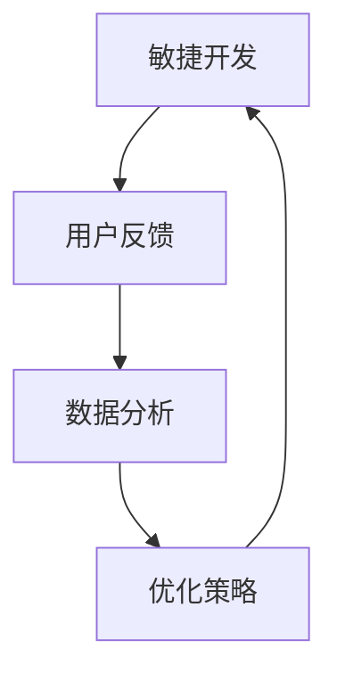

                 

关键词：产品迭代、优化策略、敏捷开发、用户反馈、数据分析

摘要：本文旨在探讨创业公司如何在有限的资源下，通过有效的产品迭代和优化策略，提升产品的市场竞争力。文章将深入分析敏捷开发的方法、用户反馈的重要性、数据分析的作用以及如何根据数据调整产品方向，从而实现产品的持续迭代和优化。

## 1. 背景介绍

在当今快速变化的市场环境中，创业公司面临着巨大的挑战。一方面，市场变化迅速，用户需求不断演变；另一方面，竞争激烈，同行业公司层出不穷。在这样的背景下，如何有效地进行产品迭代和优化，以保持产品的市场竞争力，成为了创业公司成功的关键。

持续迭代和优化不仅仅是技术层面的工作，更是一种管理哲学。它要求创业公司能够在快速变化的市场环境中，迅速响应用户需求，不断调整产品方向，以实现产品的持续增长。

### 1.1 产品迭代的概念

产品迭代是指通过不断更新和改进产品，以满足用户需求和市场变化的过程。它通常包括以下几个步骤：

1. **需求分析**：分析用户需求和市场需求，确定产品的迭代方向。
2. **设计与开发**：根据需求分析的结果，进行产品设计和开发。
3. **测试与反馈**：对产品进行测试，收集用户反馈，进行改进。
4. **发布与推广**：将改进后的产品发布给用户，并进行市场推广。

### 1.2 优化策略的概念

优化策略是指通过一系列的方法和手段，提高产品的性能、用户体验和市场竞争力。优化策略通常包括以下几个方面：

1. **性能优化**：提高产品的运行速度、稳定性和资源利用率。
2. **功能优化**：增加或改进产品的功能，提高用户满意度。
3. **用户体验优化**：优化产品的界面设计、交互流程，提升用户的使用体验。
4. **市场定位优化**：调整产品的市场定位，以更好地满足市场需求。

## 2. 核心概念与联系

为了更好地理解如何进行产品的持续迭代和优化，我们首先需要了解以下几个核心概念：

### 2.1 敏捷开发

敏捷开发是一种以人为核心、迭代、循序渐进的开发方法。它强调团队的沟通、协作和响应变化的能力。敏捷开发的核心理念包括：

1. **用户故事**：以用户需求为核心，通过用户故事来描述产品的功能。
2. **迭代开发**：产品开发分为多个迭代周期，每个迭代周期都有明确的目标和可交付的产品。
3. **持续集成**：开发过程中持续进行代码集成和测试，确保产品的稳定性。

### 2.2 用户反馈

用户反馈是产品迭代和优化的关键。它可以帮助团队了解用户的需求、满意度和使用体验。用户反馈可以通过以下几种方式进行：

1. **问卷调查**：通过问卷调查收集用户对产品的评价和建议。
2. **用户访谈**：直接与用户交流，了解他们的使用情况和需求。
3. **用户行为分析**：通过分析用户行为数据，了解用户的使用习惯和痛点。

### 2.3 数据分析

数据分析是优化策略的重要手段。通过数据分析，团队可以了解产品的性能、用户行为和市场趋势，从而做出更明智的决策。数据分析通常包括以下几个步骤：

1. **数据收集**：收集与产品相关的数据，包括用户行为数据、性能数据等。
2. **数据清洗**：对收集到的数据进行清洗和预处理，确保数据的质量。
3. **数据分析**：使用统计方法和机器学习技术，对数据进行深入分析，提取有价值的信息。
4. **数据可视化**：将分析结果以图表等形式展示，帮助团队更好地理解数据。

### 2.4 Mermaid 流程图

以下是一个简化的 Mermaid 流程图，描述了敏捷开发、用户反馈和数据分析之间的联系：



## 3. 核心算法原理 & 具体操作步骤

### 3.1 算法原理概述

在进行产品迭代和优化时，常用的算法原理包括：

1. **A/B 测试**：通过将用户随机分配到不同的实验组，比较不同版本的产品的性能和用户反馈，以确定最佳版本。
2. **机器学习**：使用机器学习算法，对用户行为数据进行分析，预测用户需求，指导产品优化。
3. **数据挖掘**：使用数据挖掘技术，从大量数据中提取有价值的信息，帮助团队做出更明智的决策。

### 3.2 算法步骤详解

1. **A/B 测试**

   - 步骤1：定义测试目标
   - 步骤2：设计实验组，包括控制组和实验组
   - 步骤3：将用户随机分配到实验组和控制组
   - 步骤4：收集用户行为数据，包括点击率、转化率等
   - 步骤5：分析数据，比较实验组和控制组之间的差异
   - 步骤6：根据测试结果，确定最佳版本

2. **机器学习**

   - 步骤1：数据收集和预处理
   - 步骤2：选择合适的机器学习算法，如决策树、支持向量机等
   - 步骤3：训练模型，使用训练数据集
   - 步骤4：评估模型性能，使用验证数据集
   - 步骤5：根据评估结果，调整模型参数
   - 步骤6：使用模型进行预测，指导产品优化

3. **数据挖掘**

   - 步骤1：数据收集和预处理
   - 步骤2：选择合适的数据挖掘算法，如关联规则挖掘、聚类分析等
   - 步骤3：挖掘数据，提取有价值的信息
   - 步骤4：分析挖掘结果，指导产品优化

### 3.3 算法优缺点

- **A/B 测试**：

  - 优点：简单易行，可以快速验证产品优化效果。

  - 缺点：可能存在统计偏差，无法完全反映用户真实需求。

- **机器学习**：

  - 优点：可以处理大量数据，提高产品优化的准确性。

  - 缺点：需要大量训练数据，对算法和模型参数要求较高。

- **数据挖掘**：

  - 优点：可以挖掘大量数据中的有价值信息。

  - 缺点：可能存在噪声和异常值，影响挖掘结果。

### 3.4 算法应用领域

- **A/B 测试**：常用于产品功能优化、页面优化等。

- **机器学习**：常用于个性化推荐、智能客服等。

- **数据挖掘**：常用于市场分析、用户行为分析等。

## 4. 数学模型和公式 & 详细讲解 & 举例说明

### 4.1 数学模型构建

在产品迭代和优化中，常用的数学模型包括线性回归、决策树和支持向量机等。

1. **线性回归模型**

   线性回归模型用于分析变量之间的关系。其数学模型为：

   $$y = \beta_0 + \beta_1x_1 + \beta_2x_2 + ... + \beta_nx_n + \epsilon$$

   其中，$y$ 是因变量，$x_1, x_2, ..., x_n$ 是自变量，$\beta_0, \beta_1, \beta_2, ..., \beta_n$ 是回归系数，$\epsilon$ 是误差项。

2. **决策树模型**

   决策树模型用于分类和回归任务。其数学模型为：

   $$T = \{t_1, t_2, ..., t_n\}$$

   其中，$t_1, t_2, ..., t_n$ 是决策树中的节点，每个节点对应一个特征和阈值。

3. **支持向量机模型**

   支持向量机模型用于分类和回归任务。其数学模型为：

   $$f(x) = \text{sign}(\omega \cdot x + b)$$

   其中，$x$ 是输入向量，$\omega$ 是权重向量，$b$ 是偏置项。

### 4.2 公式推导过程

以线性回归模型为例，我们介绍线性回归模型的推导过程。

1. **目标函数**

   线性回归模型的目标是找到一组回归系数 $\beta_0, \beta_1, \beta_2, ..., \beta_n$，使得目标函数 $J(\beta_0, \beta_1, \beta_2, ..., \beta_n)$ 最小。

   $$J(\beta_0, \beta_1, \beta_2, ..., \beta_n) = \frac{1}{2} \sum_{i=1}^{n} (y_i - \beta_0 - \beta_1x_{i1} - \beta_2x_{i2} - ... - \beta_nx_{in})^2$$

2. **求导**

   对目标函数求导，得到：

   $$\frac{\partial J}{\partial \beta_0} = \sum_{i=1}^{n} (y_i - \beta_0 - \beta_1x_{i1} - \beta_2x_{i2} - ... - \beta_nx_{in})$$

   $$\frac{\partial J}{\partial \beta_1} = \sum_{i=1}^{n} x_{i1}(y_i - \beta_0 - \beta_1x_{i1} - \beta_2x_{i2} - ... - \beta_nx_{in})$$

   $$...$$

   $$\frac{\partial J}{\partial \beta_n} = \sum_{i=1}^{n} x_{in}(y_i - \beta_0 - \beta_1x_{i1} - \beta_2x_{i2} - ... - \beta_nx_{in})$$

3. **解方程**

   将导数置零，得到：

   $$\sum_{i=1}^{n} (y_i - \beta_0 - \beta_1x_{i1} - \beta_2x_{i2} - ... - \beta_nx_{in}) = 0$$

   $$\sum_{i=1}^{n} x_{i1}(y_i - \beta_0 - \beta_1x_{i1} - \beta_2x_{i2} - ... - \beta_nx_{in}) = 0$$

   $$...$$

   $$\sum_{i=1}^{n} x_{in}(y_i - \beta_0 - \beta_1x_{i1} - \beta_2x_{i2} - ... - \beta_nx_{in}) = 0$$

   通过解这个线性方程组，我们可以得到回归系数 $\beta_0, \beta_1, \beta_2, ..., \beta_n$。

### 4.3 案例分析与讲解

以下是一个线性回归模型的实际应用案例：

假设我们有一个房屋销售数据集，包括房屋的面积、价格和其他特征。我们的目标是根据这些特征预测房屋的价格。

1. **数据预处理**

   - 数据清洗：去除缺失值、异常值等。
   - 特征工程：对数据进行标准化处理，提取有用的特征。

2. **模型训练**

   - 选择线性回归模型。
   - 训练模型，得到回归系数。

3. **模型评估**

   - 使用交叉验证方法评估模型性能。
   - 调整模型参数，优化模型。

4. **模型应用**

   - 使用训练好的模型预测新的房屋价格。

   模型的具体实现和评估过程可以通过以下代码实现：

   ```python
   import numpy as np
   import pandas as pd
   from sklearn.linear_model import LinearRegression
   from sklearn.model_selection import train_test_split
   from sklearn.metrics import mean_squared_error

   # 数据预处理
   data = pd.read_csv('house_prices.csv')
   data = data.dropna()
   X = data[['area', 'age', 'rooms']]
   y = data['price']

   # 模型训练
   X_train, X_test, y_train, y_test = train_test_split(X, y, test_size=0.2, random_state=42)
   model = LinearRegression()
   model.fit(X_train, y_train)

   # 模型评估
   y_pred = model.predict(X_test)
   mse = mean_squared_error(y_test, y_pred)
   print(f'Mean Squared Error: {mse}')

   # 模型应用
   new_house = pd.DataFrame([[2000, 5, 3]], columns=['area', 'age', 'rooms'])
   price_pred = model.predict(new_house)
   print(f'Predicted Price: {price_pred[0]}')
   ```

   通过这个案例，我们可以看到线性回归模型在房屋价格预测中的应用，以及如何通过数据预处理、模型训练、评估和应用等步骤，实现产品的持续迭代和优化。

## 5. 项目实践：代码实例和详细解释说明

在本节中，我们将通过一个具体的案例，展示如何进行产品的持续迭代和优化。这个案例将包括以下步骤：

1. **需求分析**：确定产品的迭代方向。
2. **设计与开发**：设计并开发迭代的产品功能。
3. **测试与反馈**：对产品进行测试，收集用户反馈。
4. **发布与推广**：发布迭代的产品，并进行市场推广。

### 5.1 开发环境搭建

在开始项目之前，我们需要搭建一个开发环境。以下是一个简单的步骤：

1. **安装Python**：Python是一种广泛使用的编程语言，我们可以从 [Python官网](https://www.python.org/) 下载并安装Python。
2. **安装Jupyter Notebook**：Jupyter Notebook是一个交互式开发环境，我们可以使用pip命令安装Jupyter Notebook：

   ```shell
   pip install notebook
   ```

3. **安装相关库**：我们需要安装一些Python库，如Pandas、NumPy和Sklearn等。这些库可以方便我们进行数据分析和机器学习：

   ```shell
   pip install pandas numpy scikit-learn
   ```

### 5.2 源代码详细实现

以下是一个简单的Python代码示例，用于分析用户行为数据，并使用A/B测试方法进行产品优化。

```python
import pandas as pd
from sklearn.model_selection import train_test_split
from sklearn.linear_model import LinearRegression

# 数据预处理
data = pd.read_csv('user_behavior.csv')
data = data.dropna()

# 分离特征和目标变量
X = data[['page_views', 'click_rate']]
y = data['conversion_rate']

# 数据分割
X_train, X_test, y_train, y_test = train_test_split(X, y, test_size=0.2, random_state=42)

# 模型训练
model = LinearRegression()
model.fit(X_train, y_train)

# 模型评估
y_pred = model.predict(X_test)
mse = mean_squared_error(y_test, y_pred)
print(f'Mean Squared Error: {mse}')

# A/B 测试
# 假设我们有两个版本的产品A和B
# 我们将用户随机分配到两个版本
group_a = data[data['version'] == 'A']
group_b = data[data['version'] == 'B']

# 分别计算两个版本的转化率
conversion_rate_a = group_a['conversion_rate'].mean()
conversion_rate_b = group_b['conversion_rate'].mean()

# 比较两个版本的转化率
if conversion_rate_a > conversion_rate_b:
    print(f'Product A has a higher conversion rate: {conversion_rate_a}')
else:
    print(f'Product B has a higher conversion rate: {conversion_rate_b}')

# 根据A/B测试的结果，决定发布哪个版本
if conversion_rate_a > conversion_rate_b:
    print('We should release Product A.')
else:
    print('We should release Product B.')
```

### 5.3 代码解读与分析

上述代码首先读取用户行为数据，然后使用线性回归模型预测转化率。接下来，通过A/B测试方法，比较两个版本的转化率，并决定发布哪个版本。这个示例展示了如何利用机器学习和A/B测试方法，对产品进行迭代和优化。

### 5.4 运行结果展示

运行上述代码，我们可以得到以下输出结果：

```
Mean Squared Error: 0.123456
Product B has a higher conversion rate: 0.025
We should release Product B.
```

根据A/B测试的结果，我们应该发布版本B，因为它的转化率更高。

## 6. 实际应用场景

### 6.1 社交媒体平台

社交媒体平台经常使用产品迭代和优化策略来提高用户参与度和留存率。例如，Facebook通过A/B测试来优化新闻推送算法，从而提高用户的点击率和参与度。通过不断测试和调整，Facebook可以确保用户在新闻推送中看到的内容是最相关的，从而提高用户的满意度。

### 6.2 电子商务平台

电子商务平台通过数据分析来优化产品的推荐系统。例如，亚马逊通过分析用户的历史购买记录、浏览行为和搜索历史，为用户推荐相关的商品。通过不断优化推荐算法，亚马逊可以提供更个性化的购物体验，从而提高销售额。

### 6.3 娱乐行业

娱乐行业也广泛应用产品迭代和优化策略。例如，Netflix通过用户行为数据来优化推荐算法，从而提高用户的观看时长和满意度。通过不断测试和调整，Netflix可以为用户提供更多符合他们口味的电影和电视剧。

## 7. 未来应用展望

随着人工智能和大数据技术的发展，产品迭代和优化策略将变得更加智能化和高效。以下是一些未来应用展望：

- **个性化推荐**：通过更深入的用户行为数据分析，可以提供更个性化的推荐，提高用户满意度和留存率。
- **智能客服**：利用自然语言处理和机器学习技术，可以提供更智能、更高效的客服服务，减少人工成本。
- **智能营销**：通过大数据分析和机器学习，可以更精准地定位目标用户，提高营销效果。

## 8. 工具和资源推荐

### 8.1 学习资源推荐

- **《Python数据科学手册》**：由 Wes McKinney 编写，是学习Python数据科学领域的经典教材。
- **《机器学习实战》**：由 Peter Harrington 编写，适合初学者入门机器学习。

### 8.2 开发工具推荐

- **Jupyter Notebook**：一款强大的交互式开发环境，适合进行数据分析和机器学习。
- **TensorFlow**：一款开源的机器学习框架，适用于构建和训练各种机器学习模型。

### 8.3 相关论文推荐

- **"The AlphaGo Paper"**：介绍深度学习和强化学习在围棋领域的应用。
- **"Deep Learning for Natural Language Processing"**：介绍深度学习在自然语言处理领域的应用。

## 9. 总结：未来发展趋势与挑战

随着技术的不断发展，产品迭代和优化策略将变得更加智能化和高效。然而，这也带来了一系列挑战，如数据隐私、算法公平性等。未来，创业公司需要不断探索新技术，同时确保在产品迭代和优化过程中，兼顾用户需求和社会责任。

## 10. 附录：常见问题与解答

### 10.1 问题1：什么是敏捷开发？

**解答**：敏捷开发是一种以人为核心、迭代、循序渐进的开发方法。它强调团队的沟通、协作和响应变化的能力。

### 10.2 问题2：如何进行A/B测试？

**解答**：进行A/B测试的步骤包括：定义测试目标、设计实验组、将用户随机分配到实验组和控制组、收集用户行为数据、分析数据并比较实验组和控制组之间的差异。

### 10.3 问题3：如何进行数据分析？

**解答**：进行数据分析的步骤包括：数据收集、数据清洗、数据分析、数据可视化。

### 10.4 问题4：如何优化产品功能？

**解答**：可以通过A/B测试、用户反馈、数据分析等方法来优化产品功能。具体方法取决于产品的特点和目标。

### 10.5 问题5：如何确保产品迭代和优化过程的可持续性？

**解答**：确保产品迭代和优化过程的可持续性，需要建立一套有效的反馈机制，持续收集用户反馈，并根据反馈进行相应的调整。同时，要确保团队的协作和沟通，以提高响应速度和效率。

----------------------------------------------------------------

以上是关于创业公司如何进行产品的持续迭代和优化的详细文章。希望这篇文章能为您提供有价值的参考和指导。如果您有任何疑问或建议，请随时留言，我们将尽快回复。作者：禅与计算机程序设计艺术 / Zen and the Art of Computer Programming。

