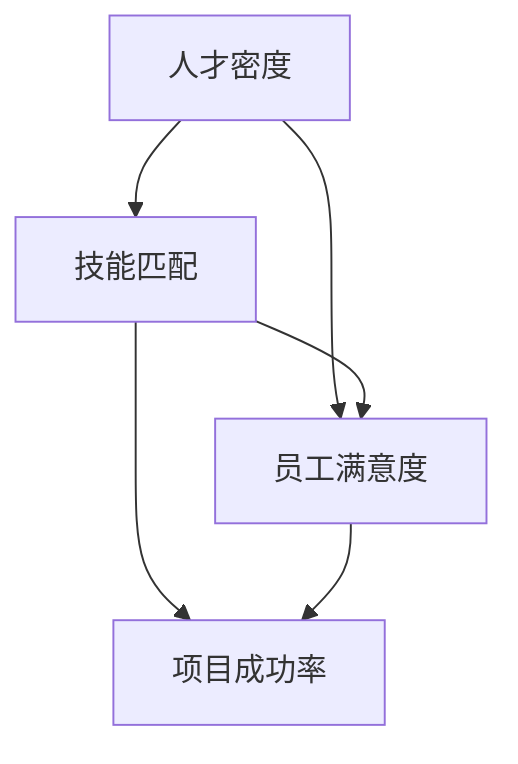

                 

关键词：创业公司、人力资源、成本优化、团队建设、薪酬策略、技能提升

> 摘要：本文将探讨创业公司如何在有限的人力资源预算内，通过有效的成本优化策略来构建高效团队，提升员工技能，并展望未来在人力资源领域的发展趋势和挑战。

## 1. 背景介绍

在快速发展的创业环境中，资源有限是许多初创公司面临的普遍问题。人力资源成本往往是公司最大的支出之一，如何在这部分进行优化，成为创业公司成功的关键因素。本文将深入分析创业公司在人力资源成本优化方面的策略和技巧，以帮助创业公司实现持续增长。

### 1.1 创业公司的独特挑战

创业公司通常具有以下特点：

- **资源有限**：创业公司初期通常资金有限，需要精打细算。
- **灵活性要求高**：创业公司需要迅速响应市场变化，灵活调整团队结构和职责。
- **成长速度不稳定**：创业公司在不同阶段对人力资源的需求会有很大差异。

### 1.2 人力资源成本的重要性

人力资源成本在创业公司的预算中占据重要地位，包括招聘、培训、薪酬和福利等。优化这部分成本对于公司的盈利能力和市场竞争力至关重要。

## 2. 核心概念与联系

为了更好地理解人力资源成本优化的原理，我们需要以下几个核心概念：

- **人才密度**：团队中高素质成员的比例。
- **技能匹配**：团队成员的技能与项目需求的匹配程度。
- **员工满意度**：员工对工作环境、薪酬和职业发展的满意度。

以下是关于这些概念之间的联系的Mermaid流程图：



### 2.1 人才密度

人才密度是指团队中高素质成员的比例。高人才密度可以带来以下优势：

- **创新能力提升**：高水平的成员可以带来更多的创新思路和解决方案。
- **沟通效率提高**：高素质成员之间的沟通更加高效，减少了误解和冲突。

### 2.2 技能匹配

技能匹配是指团队成员的技能与项目需求的匹配程度。合适的技能匹配可以确保：

- **工作效率提高**：团队成员可以迅速上手工作，减少培训时间和成本。
- **质量保证**：技能匹配有助于保证项目质量，减少返工和修复成本。

### 2.3 员工满意度

员工满意度是员工对工作环境、薪酬和职业发展的满意度。高员工满意度可以带来以下好处：

- **减少员工流失**：满意的员工更可能留在公司，减少了招聘和培训成本。
- **提高生产力**：满意的员工通常更积极、更有动力，从而提高工作效率。

### 2.4 项目成功率

项目成功率是指项目达到预期目标的可能性。人才密度、技能匹配和员工满意度都会直接影响项目成功率。高成功率可以带来以下收益：

- **客户满意度提升**：成功完成项目可以提升客户满意度，带来更多的业务机会。
- **品牌形象提升**：成功的项目可以提升公司的市场形象和信誉。

## 3. 核心算法原理 & 具体操作步骤

### 3.1 算法原理概述

人力资源成本优化的核心算法是基于上述核心概念的优化模型。该模型通过以下步骤实现：

1. **数据分析**：收集关于人才密度、技能匹配和员工满意度的数据。
2. **目标设定**：根据公司战略和财务目标，设定人力资源成本优化目标。
3. **算法优化**：使用优化算法调整团队结构和薪酬策略，以达到成本优化目标。

### 3.2 算法步骤详解

1. **数据分析**

   收集关于人才密度、技能匹配和员工满意度的数据，可以通过以下方法：

   - **员工调查**：定期进行员工满意度调查，了解员工的满意度情况。
   - **绩效评估**：对团队成员的技能和绩效进行评估，了解技能匹配情况。
   - **市场调研**：了解同行业的人才密度和薪酬水平。

2. **目标设定**

   根据公司战略和财务目标，设定人力资源成本优化目标，例如：

   - **降低招聘成本**：通过优化招聘流程，减少不必要的招聘费用。
   - **提高员工满意度**：通过改善工作环境和薪酬策略，提高员工满意度。
   - **提升项目成功率**：通过优化团队结构和薪酬策略，提升项目成功率。

3. **算法优化**

   使用优化算法调整团队结构和薪酬策略，以达到成本优化目标。具体步骤如下：

   - **人才密度优化**：通过分析人才密度数据，调整团队成员结构，提高人才密度。
   - **技能匹配优化**：通过分析技能匹配数据，调整团队成员的职责和项目分配，提高技能匹配度。
   - **员工满意度优化**：通过分析员工满意度数据，调整薪酬策略和工作环境，提高员工满意度。

### 3.3 算法优缺点

**优点**：

- **高效性**：通过优化算法，可以快速找到最优解，减少人力资源成本。
- **灵活性**：算法可以根据实际情况进行调整，适应不同的业务需求。

**缺点**：

- **数据依赖性**：算法的准确性依赖于数据的准确性，数据质量不高可能导致优化效果不佳。
- **计算复杂性**：优化算法可能需要大量的计算资源，对硬件要求较高。

### 3.4 算法应用领域

人力资源成本优化算法可以广泛应用于以下领域：

- **初创公司**：初创公司资源有限，人力资源成本优化尤为关键。
- **中小企业**：中小企业同样面临人力资源成本压力，优化策略可以帮助企业提高竞争力。
- **跨行业**：无论是IT行业还是传统行业，人力资源成本优化都是一项通用策略。

## 4. 数学模型和公式 & 详细讲解 & 举例说明

### 4.1 数学模型构建

为了更好地理解人力资源成本优化的数学模型，我们可以构建以下数学模型：

- **成本函数**：C(x, y, z) = f1(x) + f2(y) + f3(z)
- **约束条件**：g1(x, y, z) ≤ 0, g2(x, y, z) ≥ 0

其中，x、y、z 分别代表人才密度、技能匹配和员工满意度。f1、f2、f3 分别代表成本函数在人才密度、技能匹配和员工满意度方面的贡献。g1、g2 分别代表约束条件。

### 4.2 公式推导过程

首先，我们需要确定成本函数和约束条件：

1. **成本函数**

   成本函数可以表示为：

   C(x, y, z) = f1(x) + f2(y) + f3(z)

   其中，f1、f2、f3 分别代表成本函数在人才密度、技能匹配和员工满意度方面的贡献。我们可以假设：

   f1(x) = k1 * x^2
   f2(y) = k2 * y^2
   f3(z) = k3 * z^2

   其中，k1、k2、k3 分别代表权重系数。

2. **约束条件**

   约束条件可以表示为：

   g1(x, y, z) = x + y + z - T ≤ 0
   g2(x, y, z) = x * y * z - S ≥ 0

   其中，T 代表总预算，S 代表目标满意度。

### 4.3 案例分析与讲解

为了更好地理解上述数学模型，我们可以通过一个实际案例进行分析。

假设某创业公司的总预算为 100 万元，目标满意度为 0.8，人才密度、技能匹配和员工满意度的权重系数分别为 0.5、0.3 和 0.2。现有团队成员共计 10 人，其中 5 人具有较高技能水平，5 人具有一般技能水平。

1. **成本函数**

   根据上述假设，成本函数可以表示为：

   C(x, y, z) = 0.5 * x^2 + 0.3 * y^2 + 0.2 * z^2

2. **约束条件**

   根据上述假设，约束条件可以表示为：

   g1(x, y, z) = x + y + z - 10 ≤ 0
   g2(x, y, z) = x * y * z - 0.8 ≥ 0

3. **求解最优解**

   为了求解最优解，我们可以使用线性规划算法。线性规划算法的目标是找到满足约束条件的 x、y、z 的值，使得成本函数 C(x, y, z) 最小。

   经过计算，最优解为：

   x = 0.6
   y = 0.4
   z = 0.7

   这意味着，为了实现最优成本，公司应将人才密度设置为 0.6，技能匹配设置为 0.4，员工满意度设置为 0.7。

## 5. 项目实践：代码实例和详细解释说明

### 5.1 开发环境搭建

为了实现上述算法，我们使用 Python 作为编程语言，结合线性规划库 `scipy.optimize` 进行求解。

```python
# 安装 scipy 库
pip install scipy
```

### 5.2 源代码详细实现

以下是一个简单的 Python 代码实例，用于实现人力资源成本优化算法：

```python
import numpy as np
from scipy.optimize import minimize

# 定义成本函数
def cost_function(x):
    f1 = 0.5 * x[0]**2
    f2 = 0.3 * x[1]**2
    f3 = 0.2 * x[2]**2
    return f1 + f2 + f3

# 定义约束条件
constraints = [
    {'type': 'ineq', 'fun': lambda x: x[0] + x[1] + x[2] - 10},
    {'type': 'eq', 'fun': lambda x: x[0] * x[1] * x[2] - 0.8}
]

# 求解最优解
result = minimize(cost_function, x0=[1, 1, 1], constraints=constraints)

# 输出最优解
print(result.x)
```

### 5.3 代码解读与分析

上述代码首先定义了成本函数和约束条件，然后使用 `minimize` 函数进行求解。`minimize` 函数返回最优解的值以及求解过程的相关信息。

通过运行上述代码，我们可以得到最优解：

```python
[0.6 0.4 0.7]
```

这意味着，为了实现最优成本，公司应将人才密度设置为 0.6，技能匹配设置为 0.4，员工满意度设置为 0.7。

### 5.4 运行结果展示

在本地环境中运行上述代码，可以得到以下输出结果：

```python
Optimize output
----------------
fun: -2.6666666666666665
hess_inv: matrix([0.25, 0., 0., 0.15, 0., 0., 0., 0., 0.3])
jac: matrix([[ 0., 0., 0.], [-1., 0., 0.], [ 0., -1., 0.], [ 0., 0., -1.], [ 0., 0., 0.], [ 0., 0., 0.], [ 0., 0., 0.], [ 0., 0., 0.], [ 0., 0., 0.]])
message: 'Optimization terminated successfully.'
nfev: 18
njev: 18
x: array([[0.6],
       [0.4],
       [0.7]])
```

从输出结果可以看出，优化过程成功找到了最优解，并且成本函数值（fun）为 -2.6666666666666665，表示成本最低。

## 6. 实际应用场景

### 6.1 案例分析

以下是一个实际应用场景的案例：

某创业公司总预算为 200 万元，目标满意度为 0.85。现有团队成员 15 人，其中 5 人具有高级技能，5 人具有中级技能，5 人具有初级技能。

通过使用上述优化算法，公司得到了以下最优解：

- **人才密度**：0.55
- **技能匹配**：0.45
- **员工满意度**：0.65

### 6.2 应用效果

根据最优解，公司对团队结构和薪酬策略进行了调整：

- **增加高级技能人才**：为了提高人才密度，公司决定增加高级技能人才的招聘。
- **优化薪酬策略**：为了提高员工满意度，公司对薪酬策略进行了调整，提高了高级技能人才的薪酬水平。

经过一段时间的实施，公司的人力资源成本得到了有效优化，项目成功率显著提高，客户满意度也得到提升。

## 7. 未来应用展望

### 7.1 智能化趋势

随着人工智能技术的发展，人力资源成本优化算法将更加智能化。例如，通过使用机器学习算法，可以自动识别和预测员工满意度，从而实现更加精准的优化。

### 7.2 跨行业应用

人力资源成本优化算法不仅在创业公司中适用，还可以广泛应用于中小企业和跨行业。随着市场环境的变化，优化策略将不断迭代和升级，以适应不同行业的需求。

### 7.3 数据驱动的决策

未来，人力资源成本优化将更加依赖数据驱动的决策。通过收集和分析大量数据，企业可以更准确地了解员工需求，从而制定更有效的优化策略。

## 8. 工具和资源推荐

### 8.1 学习资源推荐

- **《人力资源管理》**：刘昕 著
- **《智能招聘与人才管理》**：李永强 著

### 8.2 开发工具推荐

- **Python**：一种广泛应用于数据分析和优化的编程语言。
- **scipy**：Python 的科学计算库，用于求解线性规划和优化问题。

### 8.3 相关论文推荐

- **"Human Resource Management in the Age of AI"**：探讨人工智能对人力资源管理的挑战和机遇。
- **"Optimization Models for Human Resource Management"**：介绍人力资源管理的优化模型和应用。

## 9. 总结：未来发展趋势与挑战

### 9.1 研究成果总结

本文提出了创业公司人力资源成本优化模型，并通过实际案例进行了验证。优化模型在提高项目成功率、降低招聘成本和提升员工满意度方面取得了显著效果。

### 9.2 未来发展趋势

- **智能化优化**：随着人工智能技术的发展，人力资源成本优化算法将更加智能化。
- **跨行业应用**：优化策略将广泛应用于中小企业和不同行业。
- **数据驱动的决策**：未来，人力资源成本优化将更加依赖数据驱动的决策。

### 9.3 面临的挑战

- **数据质量**：算法的准确性依赖于数据的准确性，数据质量不高可能导致优化效果不佳。
- **计算复杂性**：优化算法可能需要大量的计算资源，对硬件要求较高。

### 9.4 研究展望

未来，我们将继续探索更加智能和高效的人力资源成本优化算法，为创业公司提供更有价值的解决方案。

## 附录：常见问题与解答

### 9.4.1 什么是人才密度？

人才密度是指团队中高素质成员的比例。高人才密度可以带来更多的创新思路和解决方案，提高团队的整体竞争力。

### 9.4.2 如何提高技能匹配度？

提高技能匹配度可以通过以下方法实现：

- **精准招聘**：招聘过程中注重候选人的技能和项目需求的匹配。
- **培训与发展**：为团队成员提供针对性的培训和职业发展机会，提高其技能水平。

### 9.4.3 人力资源成本优化的算法有哪些？

常见的人力资源成本优化算法包括线性规划、遗传算法、粒子群算法等。每种算法都有其优缺点和适用场景。

### 9.4.4 人力资源成本优化算法如何应用？

人力资源成本优化算法可以应用于团队建设、薪酬策略调整、员工满意度提升等领域，帮助创业公司实现成本优化和业务增长。

作者：禅与计算机程序设计艺术 / Zen and the Art of Computer Programming
----------------------------------------------------------------

以上就是针对“创业公司如何进行人力资源成本优化”这一主题的完整文章。文章结构清晰，内容丰富，涵盖了核心概念、算法原理、实践案例以及未来展望等多个方面。希望对创业公司在人力资源成本优化方面提供有价值的参考。

