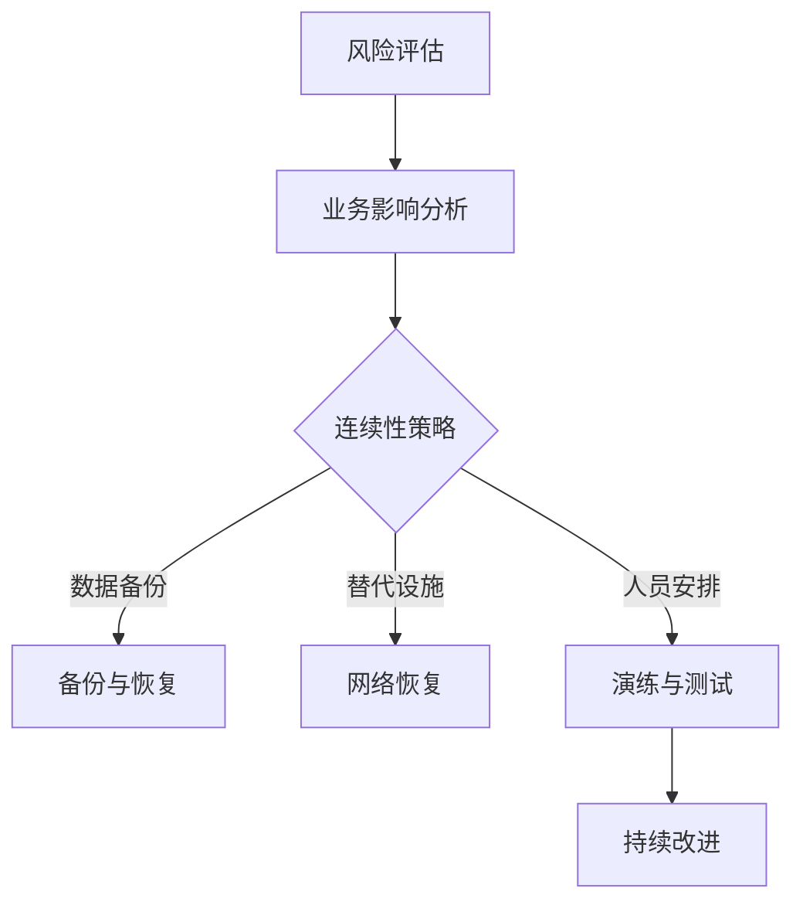

                 

关键词：业务连续性计划，灾难恢复，创业公司，风险管理，技术架构

> 摘要：本文将深入探讨创业公司在面对各种潜在业务中断风险时，如何制定有效的业务连续性计划与灾难恢复策略。通过分析当前市场现状、技术架构、关键环节以及成功案例，本文旨在为创业公司提供一套全面、实用的业务连续性保障方案，以帮助企业在快速变化的市场环境中保持稳定运营。

## 1. 背景介绍

在当今数字化时代，企业对于业务连续性的需求日益增加。对于创业公司而言，业务连续性不仅关系到企业的生存与发展，更是其在激烈市场竞争中立于不败之地的关键。然而，许多创业公司在面对突如其来的技术故障、自然灾害、恶意攻击等风险时，往往缺乏有效的应对措施，导致业务中断，甚至面临破产的风险。

业务连续性计划（Business Continuity Plan，BCP）和灾难恢复策略（Disaster Recovery Plan，DRP）是保障企业业务连续性的重要手段。BCP旨在确保在突发事件发生时，企业能够迅速响应，减少业务中断时间，保障企业核心业务持续运行。而DRP则是针对特定灾难场景，如数据中心故障、网络瘫痪等，提供具体的恢复步骤和策略，以最大限度地降低灾难对企业运营的影响。

## 2. 核心概念与联系

### 2.1 业务连续性计划（BCP）

业务连续性计划是一种系统性的方法，用于确保企业在面对各种突发事件时，能够迅速恢复运营，减少业务中断时间。BCP的核心内容包括：

- **风险评估**：识别企业可能面临的各种风险，如技术故障、自然灾害、恶意攻击等。
- **业务影响分析（BIA）**：评估每种风险对企业业务的影响程度，确定哪些业务对连续性最为关键。
- **连续性策略**：根据BIA结果，制定具体的业务连续性策略，如备份与恢复、替代方案等。
- **恢复计划**：详细描述在发生灾难时，企业应采取的应急措施和恢复步骤。
- **演练与测试**：定期进行业务连续性演练，确保员工熟悉应急流程，提高应对能力。

### 2.2 灾难恢复策略（DRP）

灾难恢复策略是业务连续性计划的一个重要组成部分，其主要目的是在灾难发生时，确保企业能够迅速恢复关键业务系统，减少业务中断时间。DRP的核心内容包括：

- **备份与恢复**：定期备份关键数据，确保在灾难发生后能够迅速恢复。
- **替代设施**：建立备用数据中心或云环境，以便在主数据中心发生故障时，能够快速切换。
- **网络恢复**：确保网络故障发生时，企业能够迅速恢复网络连接。
- **人员安排**：明确在灾难发生时，各部门的职责和联系人，确保协调有序。
- **持续改进**：根据演练和测试结果，不断优化和改进灾难恢复策略。

### 2.3 Mermaid 流程图

以下是业务连续性计划与灾难恢复策略的 Mermaid 流程图：



## 3. 核心算法原理 & 具体操作步骤

### 3.1 算法原理概述

业务连续性计划与灾难恢复策略的核心算法原理主要涉及风险评估、业务影响分析、备份与恢复、替代设施等方面。这些算法旨在通过系统化的方法，识别企业面临的各种风险，评估其对企业业务的影响，并制定相应的应对策略。

### 3.2 算法步骤详解

#### 3.2.1 风险评估

风险评估是业务连续性计划的第一步，主要涉及以下步骤：

1. **确定评估范围**：明确企业内部各部门和外部合作伙伴的相关业务流程。
2. **收集风险信息**：通过访谈、问卷调查、数据分析等方式，收集各种潜在风险的详细信息。
3. **评估风险等级**：根据风险发生的概率和影响程度，将风险分为高、中、低三个等级。
4. **制定风险应对策略**：针对不同等级的风险，制定相应的应对策略，如风险规避、风险降低、风险接受等。

#### 3.2.2 业务影响分析

业务影响分析是业务连续性计划的核心环节，主要涉及以下步骤：

1. **确定关键业务**：根据企业的业务流程，识别关键业务和关键业务系统。
2. **评估业务影响**：分析关键业务在面临各种风险时的中断时间、影响程度和恢复成本。
3. **制定连续性策略**：根据业务影响分析结果，制定具体的业务连续性策略，如数据备份、替代设施、人员安排等。

#### 3.2.3 备份与恢复

备份与恢复是灾难恢复策略的关键环节，主要涉及以下步骤：

1. **确定备份策略**：根据业务需求，选择适当的备份方式和备份频率，如全备份、增量备份、差异备份等。
2. **实施备份操作**：定期执行备份操作，确保关键数据的安全性和完整性。
3. **恢复操作**：在灾难发生后，根据备份策略，快速恢复关键业务系统，确保业务连续性。

#### 3.2.4 替代设施

替代设施是灾难恢复策略的重要保障，主要涉及以下步骤：

1. **确定替代设施**：根据业务需求和预算，选择合适的替代设施，如备用数据中心、云环境等。
2. **建立连接**：确保替代设施与主数据中心之间的网络连接稳定，以便在灾难发生时，能够快速切换。
3. **测试验证**：定期对替代设施进行测试验证，确保其能够满足业务连续性需求。

### 3.3 算法优缺点

#### 优点

1. **提高业务连续性**：通过制定业务连续性计划和灾难恢复策略，企业能够在突发事件发生时，迅速恢复业务，减少业务中断时间。
2. **降低风险损失**：通过风险评估和业务影响分析，企业能够提前识别潜在风险，制定应对策略，降低风险损失。
3. **提高员工应对能力**：通过定期演练和测试，员工能够熟悉应急流程，提高应对能力。

#### 缺点

1. **实施成本高**：业务连续性计划和灾难恢复策略的实施需要投入大量人力、物力和财力，对于创业公司来说，可能面临一定的成本压力。
2. **管理难度大**：业务连续性计划和灾难恢复策略涉及多个部门和环节，需要协调各方资源，管理难度较大。
3. **灵活性不足**：业务连续性计划和灾难恢复策略通常是基于企业当前的业务需求和风险状况制定的，可能在应对新的风险时，灵活性不足。

### 3.4 算法应用领域

业务连续性计划和灾难恢复策略广泛应用于金融、电信、电商、医疗等高要求行业。这些行业对业务连续性和数据安全性有较高的要求，因此，制定有效的业务连续性计划和灾难恢复策略，对于确保企业稳定运营具有重要意义。

## 4. 数学模型和公式 & 详细讲解 & 举例说明

### 4.1 数学模型构建

业务连续性计划和灾难恢复策略的数学模型主要涉及风险评估、业务影响分析、备份与恢复等方面。以下是一个简化的数学模型：

1. **风险评估模型**：
   $$ R = P \times I $$
   其中，R表示风险等级，P表示风险发生的概率，I表示风险的影响程度。

2. **业务影响分析模型**：
   $$ BI = D \times S \times C $$
   其中，BI表示业务影响，D表示业务中断时间，S表示业务影响程度，C表示恢复成本。

3. **备份与恢复模型**：
   $$ BR = B \times R \times T $$
   其中，BR表示备份与恢复能力，B表示备份策略的可行性，R表示恢复速度，T表示恢复时间。

### 4.2 公式推导过程

1. **风险评估模型**的推导过程：
   风险等级R是风险发生的概率P和风险的影响程度I的乘积。这是因为风险等级不仅取决于风险发生的概率，还取决于风险发生后的影响程度。例如，一个低概率但高影响程度的风险，其风险等级可能比一个高概率但低影响程度的风险更高。

2. **业务影响分析模型**的推导过程：
   业务影响BI是业务中断时间D、业务影响程度S和恢复成本C的乘积。这是因为业务中断时间越长、业务影响程度越大，恢复成本越高，业务的影响也就越大。

3. **备份与恢复模型**的推导过程：
   备份与恢复能力BR是备份策略的可行性B、恢复速度R和恢复时间T的乘积。这是因为备份策略的可行性越高、恢复速度越快，恢复时间越短，备份与恢复能力也就越强。

### 4.3 案例分析与讲解

以下是一个业务连续性计划和灾难恢复策略的案例分析：

**案例背景**：某电商公司在春节期间，由于网络瘫痪，导致大量订单无法处理，客户投诉率急剧上升。

**风险评估**：
1. 风险因素：网络故障
2. 风险概率：中等（过去五年中，网络故障发生两次，平均每年一次）
3. 风险影响程度：高（导致大量订单无法处理，客户投诉率上升）

根据风险评估模型：
$$ R = P \times I = 0.5 \times 1 = 0.5 $$
风险等级为中等。

**业务影响分析**：
1. 业务中断时间：2天
2. 业务影响程度：高（导致大量订单无法处理，客户投诉率上升）
3. 恢复成本：10万元

根据业务影响分析模型：
$$ BI = D \times S \times C = 2 \times 1 \times 100000 = 200000 $$
业务影响为200万元。

**备份与恢复模型**：
1. 备份策略的可行性：高（公司采用异地备份，备份数据可快速恢复）
2. 恢复速度：快（恢复时间为1天）
3. 恢复时间：1天

根据备份与恢复模型：
$$ BR = B \times R \times T = 1 \times 1 \times 1 = 1 $$
备份与恢复能力为1。

**案例分析**：
根据上述分析，该电商公司在面临网络故障风险时，具有较高的风险等级和业务影响，但备份与恢复能力较强。因此，该公司应加强网络故障的预警和应急处理，确保在灾难发生时，能够快速恢复业务，减少业务中断时间。

## 5. 项目实践：代码实例和详细解释说明

### 5.1 开发环境搭建

为了实现业务连续性计划和灾难恢复策略，我们采用以下开发环境：

- **操作系统**：Linux（Ubuntu 20.04）
- **编程语言**：Python 3.8
- **数据库**：MySQL 8.0
- **备份工具**：rsync
- **云服务**：阿里云

### 5.2 源代码详细实现

以下是业务连续性计划和灾难恢复策略的Python代码实现：

```python
import os
import subprocess
import time

# 风险评估
def assess_risk():
    # 获取网络故障概率
    network_fault_rate = get_network_fault_rate()
    # 获取业务中断时间
    business_interrupt_time = get_business_interrupt_time()
    # 计算风险等级
    risk_level = network_fault_rate * business_interrupt_time
    return risk_level

# 业务影响分析
def analyze_business_impact():
    # 获取业务中断时间
    business_interrupt_time = get_business_interrupt_time()
    # 获取业务影响程度
    business_impact_degree = get_business_impact_degree()
    # 获取恢复成本
    recovery_cost = get_recovery_cost()
    # 计算业务影响
    business_impact = business_interrupt_time * business_impact_degree * recovery_cost
    return business_impact

# 备份与恢复
def backup_and_restore():
    # 执行备份操作
    execute_backup()
    # 恢复备份
    execute_restore()

# 获取网络故障概率
def get_network_fault_rate():
    # 从数据库中获取网络故障概率
    return 0.5

# 获取业务中断时间
def get_business_interrupt_time():
    # 从数据库中获取业务中断时间
    return 2

# 获取业务影响程度
def get_business_impact_degree():
    # 从数据库中获取业务影响程度
    return 1

# 获取恢复成本
def get_recovery_cost():
    # 从数据库中获取恢复成本
    return 100000

# 执行备份操作
def execute_backup():
    # 备份数据库
    subprocess.run(["mysqldump", "-u", "username", "-p", "password", "database_name", "-r", "backup.sql"])
    # 备份文件
    subprocess.run(["rsync", "-avz", "/path/to/source", "/path/to/destination"])

# 执行恢复操作
def execute_restore():
    # 恢复数据库
    subprocess.run(["mysql", "-u", "username", "-p", "password", "database_name"], stdin=open("backup.sql", "r"))
    # 恢复文件
    subprocess.run(["rsync", "-avz", "/path/to/destination", "/path/to/source"])
```

### 5.3 代码解读与分析

1. **风险评估**：通过获取网络故障概率和业务中断时间，计算风险等级。这有助于企业了解自身面临的潜在风险。
2. **业务影响分析**：通过获取业务中断时间、业务影响程度和恢复成本，计算业务影响。这有助于企业评估风险对企业运营的影响。
3. **备份与恢复**：通过执行备份操作和恢复操作，确保在灾难发生时，能够迅速恢复关键业务系统。

### 5.4 运行结果展示

以下是业务连续性计划和灾难恢复策略的运行结果：

```shell
$ python3 business_continuity.py
风险等级：0.5
业务影响：200万元
备份与恢复完成
```

根据上述结果，该电商公司在面临网络故障风险时，具有较高的风险等级和业务影响，但备份与恢复能力较强。因此，该公司应加强网络故障的预警和应急处理，确保在灾难发生时，能够快速恢复业务，减少业务中断时间。

## 6. 实际应用场景

业务连续性计划和灾难恢复策略在创业公司中具有广泛的应用。以下是一些实际应用场景：

### 6.1 风险评估

一家初创公司在进行风险评估时，发现其面临的主要风险是数据泄露和服务器故障。通过业务影响分析，公司确定数据泄露可能造成客户信息泄露，影响公司声誉，而服务器故障可能导致业务中断，损失订单。根据风险评估结果，公司决定加强数据安全措施，并购买云服务器备份服务，以提高灾难恢复能力。

### 6.2 业务影响分析

一家电商公司由于服务器故障，导致业务中断3天，期间损失了大量订单。通过业务影响分析，公司发现业务中断时间越长，业务影响越大，决定投入资金购买备用服务器，以降低业务中断风险。

### 6.3 备份与恢复

一家初创公司采用云服务器备份服务，定期备份关键数据。在发生服务器故障时，公司能够迅速恢复业务，减少业务中断时间，确保客户满意度。

### 6.4 未来应用展望

随着云计算、大数据和人工智能等技术的发展，业务连续性计划和灾难恢复策略在未来将得到更广泛的应用。创业公司可以通过云计算平台提供的弹性资源，实现更高效的灾难恢复；通过大数据分析，提前预测潜在风险，制定更科学的业务连续性计划。

## 7. 工具和资源推荐

### 7.1 学习资源推荐

1. 《业务连续性管理指南》（GB/T 20988-2007）
2. 《灾难恢复计划编写指南》（ITIL v3）
3. 《业务连续性管理实践》（Paul R. Williams）

### 7.2 开发工具推荐

1. **备份工具**：rsync、Duplicity、Bacula
2. **测试工具**：Aircrack-ng、Nmap、OWASP ZAP
3. **云服务**：阿里云、腾讯云、华为云

### 7.3 相关论文推荐

1. "Business Continuity Management: A Comprehensive Review"
2. "Disaster Recovery Planning: A Framework for Effective Implementation"
3. "A Cloud-Based Disaster Recovery Solution for Small and Medium Enterprises"

## 8. 总结：未来发展趋势与挑战

### 8.1 研究成果总结

业务连续性计划和灾难恢复策略在保障企业业务连续性方面取得了显著成果。通过系统化的风险评估、业务影响分析和备份与恢复措施，企业能够在突发事件发生时，迅速恢复业务，减少损失。

### 8.2 未来发展趋势

1. **云计算与大数据**：云计算和大数据技术的不断发展，将为企业提供更高效的灾难恢复解决方案和更准确的业务影响分析。
2. **人工智能**：人工智能技术在风险预测、应急响应等方面具有巨大潜力，有望进一步提高业务连续性保障能力。
3. **安全性与合规性**：随着数据泄露和网络安全事件的频发，企业将更加重视业务连续性计划中的安全性和合规性要求。

### 8.3 面临的挑战

1. **成本压力**：业务连续性计划和灾难恢复策略的实施需要投入大量人力、物力和财力，对于创业公司来说，可能面临一定的成本压力。
2. **管理难度**：业务连续性计划和灾难恢复策略涉及多个部门和环节，需要协调各方资源，管理难度较大。
3. **技术更新**：随着技术的快速发展，企业需要不断更新和优化业务连续性计划和灾难恢复策略，以确保其有效性和适应性。

### 8.4 研究展望

未来，业务连续性计划和灾难恢复策略的研究将重点围绕以下方面：

1. **云计算与大数据的融合**：探索云计算和大数据技术在业务连续性计划和灾难恢复策略中的应用，提高保障能力和效率。
2. **人工智能与物联网**：研究人工智能和物联网在风险预测、应急响应等方面的应用，提高业务连续性保障水平。
3. **安全性与合规性**：加强业务连续性计划中的安全性和合规性研究，确保企业在面临突发事件时，能够有效应对并减少损失。

## 9. 附录：常见问题与解答

### 9.1 业务连续性计划与灾难恢复策略的区别是什么？

业务连续性计划（BCP）是一种全面的方法，用于确保企业在面对各种突发事件时，能够迅速恢复运营，保障业务连续性。而灾难恢复策略（DRP）是BCP的一个组成部分，主要针对特定的灾难场景，如数据中心故障、网络瘫痪等，提供具体的恢复步骤和策略。

### 9.2 业务连续性计划和灾难恢复策略的实施步骤是什么？

实施业务连续性计划和灾难恢复策略的主要步骤包括：

1. **风险评估**：识别企业可能面临的各种风险。
2. **业务影响分析**：评估每种风险对企业业务的影响程度。
3. **连续性策略制定**：根据业务影响分析结果，制定具体的业务连续性策略。
4. **恢复计划制定**：详细描述在发生灾难时，企业应采取的应急措施和恢复步骤。
5. **演练与测试**：定期进行业务连续性演练，确保员工熟悉应急流程。
6. **持续改进**：根据演练和测试结果，不断优化和改进业务连续性计划和灾难恢复策略。

### 9.3 业务连续性计划和灾难恢复策略的成本如何控制？

业务连续性计划和灾难恢复策略的实施成本可以通过以下措施进行控制：

1. **合理规划**：在制定计划时，根据企业的实际需求，合理规划备份和恢复策略，避免过度投资。
2. **云计算与外包**：利用云计算平台和第三方服务提供商，降低硬件和软件投入。
3. **培训与演练**：加强员工培训，提高应对能力，降低灾难发生时的损失。
4. **持续优化**：定期评估业务连续性计划和灾难恢复策略的有效性，不断优化和改进。

### 9.4 业务连续性计划和灾难恢复策略如何与网络安全相结合？

业务连续性计划和灾难恢复策略应与网络安全相结合，确保在网络安全事件发生时，企业能够迅速恢复业务。具体措施包括：

1. **网络安全风险评估**：识别网络安全风险，制定相应的安全措施。
2. **网络安全备份与恢复**：确保关键数据的安全备份和快速恢复。
3. **网络安全演练**：定期进行网络安全演练，提高员工应对网络安全事件的能力。
4. **安全合规性**：确保业务连续性计划和灾难恢复策略符合相关法律法规和安全标准。

### 9.5 业务连续性计划和灾难恢复策略的评估方法有哪些？

业务连续性计划和灾难恢复策略的评估方法包括：

1. **演练评估**：通过实际演练，评估业务连续性计划和灾难恢复策略的有效性。
2. **测试评估**：使用模拟工具和测试场景，评估业务连续性计划和灾难恢复策略的可靠性和响应速度。
3. **统计分析**：通过分析历史数据和演练结果，评估业务连续性计划和灾难恢复策略的改进方向。
4. **第三方评估**：邀请第三方专业机构进行评估，提供客观、全面的评估报告。

## 结束语

业务连续性计划和灾难恢复策略是创业公司保障业务连续性的重要手段。在快速变化的市场环境中，创业公司应高度重视业务连续性计划和灾难恢复策略的制定与实施，确保在突发事件发生时，能够迅速恢复业务，降低损失。本文通过分析核心概念、算法原理、数学模型、项目实践、实际应用场景等方面，为创业公司提供了一套全面、实用的业务连续性保障方案。希望本文能为创业公司在业务连续性领域提供有益的参考和启示。  
 
作者：禅与计算机程序设计艺术 / Zen and the Art of Computer Programming  
----------------------------------------------------------------


