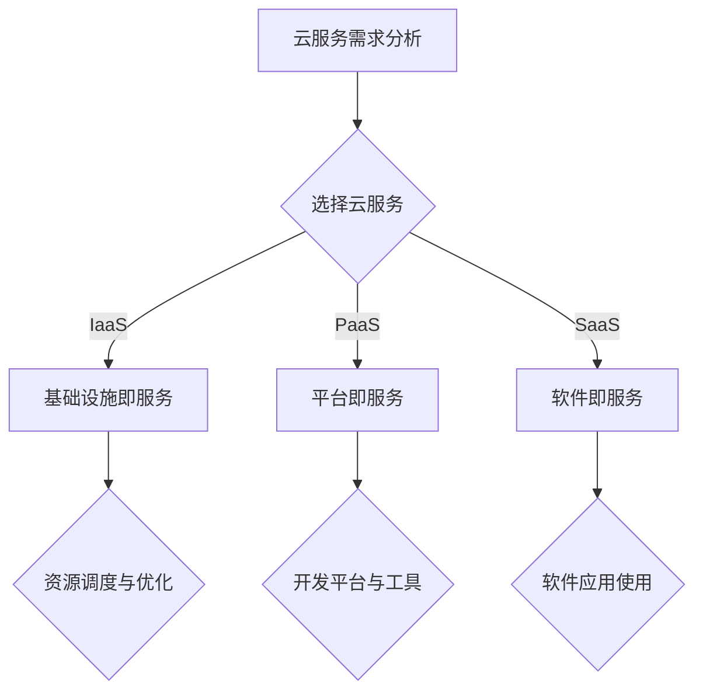

                 

 > **关键词：** 云服务，创业公司，优化策略，成本控制，性能提升

> **摘要：** 本文将探讨创业公司选择云服务时的关键考虑因素，以及如何通过优化策略实现成本控制与性能提升。我们将分析不同云服务提供商的优势和劣势，并探讨如何根据业务需求定制云服务方案。

## 1. 背景介绍

在当今快速发展的数字化时代，云计算已经成为企业不可或缺的技术基础设施。对于创业公司来说，云服务不仅提供了弹性伸缩的计算资源，还降低了IT基础设施的初期投资成本，使得创业公司能够更加专注于核心业务的创新和发展。然而，面对众多云服务提供商和多样化的服务类型，如何选择合适的云服务并实现有效的优化，成为了创业公司在云计算领域面临的一大挑战。

本文将围绕以下主题展开：

- **云服务选择的关键因素**：探讨创业公司选择云服务时需要考虑的关键因素，包括性能、安全性、成本等。
- **云服务优化策略**：介绍如何通过优化实现成本控制与性能提升，包括资源调度、负载均衡、自动化管理等。
- **云服务提供商比较**：分析不同云服务提供商的优势和劣势，为创业公司提供选择参考。
- **项目实践**：通过具体案例展示云服务的实际应用，并提供详细的代码实例和解释。
- **未来展望**：讨论云服务领域的发展趋势和面临的挑战，为创业公司提供未来发展的方向。

## 2. 核心概念与联系

### 2.1 云服务基本概念

云服务是指通过互联网提供的一系列计算资源、存储资源和网络资源等服务。云服务通常分为以下几类：

- **基础设施即服务（IaaS）**：提供虚拟化的基础设施资源，如虚拟机、存储和网络等。
- **平台即服务（PaaS）**：提供开发平台和工具，使得开发者可以专注于应用的开发和部署。
- **软件即服务（SaaS）**：提供完整的软件应用，用户通过互联网直接使用。

### 2.2 云服务架构

云服务的架构通常包括以下几个关键组成部分：

- **数据中心**：提供物理基础设施和计算资源。
- **网络**：实现云服务之间的连接和访问。
- **存储**：提供数据的持久化存储和管理。
- **服务管理**：提供资源的调度、监控和管理。

### 2.3 云服务优势与挑战

**优势：**
- **弹性伸缩**：根据业务需求动态调整资源。
- **成本效益**：减少基础设施的初期投资和维护成本。
- **高可用性**：分布式架构提供高可靠性和故障恢复能力。
- **灵活性**：支持多样化的应用场景和开发环境。

**挑战：**
- **安全性**：数据安全和隐私保护问题。
- **性能**：网络延迟和资源限制。
- **成本管理**：资源浪费和成本超支。

### 2.4 Mermaid 流程图



## 3. 核心算法原理 & 具体操作步骤

### 3.1 算法原理概述

在云服务的优化中，常用的算法包括资源调度算法、负载均衡算法和自动化管理算法。这些算法的核心目标是实现资源的最大化利用和服务的最佳性能。

- **资源调度算法**：根据业务需求和资源可用性，动态分配计算资源。
- **负载均衡算法**：均衡分布负载，避免单点过载。
- **自动化管理算法**：自动化执行日常管理任务，如监控、备份、故障恢复等。

### 3.2 算法步骤详解

#### 3.2.1 资源调度算法

1. **需求分析**：收集业务需求，确定所需的计算资源。
2. **资源评估**：评估当前资源池的可用性。
3. **资源分配**：根据需求和资源评估结果，分配计算资源。
4. **监控与调整**：监控资源使用情况，根据负载变化调整资源分配。

#### 3.2.2 负载均衡算法

1. **负载监测**：实时监测系统的负载情况。
2. **负载分配**：根据负载情况，动态分配任务到不同的节点。
3. **节点健康检查**：定期检查节点的健康状态。
4. **故障转移**：当节点故障时，自动将任务转移到健康节点。

#### 3.2.3 自动化管理算法

1. **任务定义**：定义需要自动化执行的任务。
2. **自动化脚本**：编写自动化脚本执行任务。
3. **任务调度**：根据任务定义和系统状态，调度任务执行。
4. **结果监控**：监控任务执行结果，确保任务的正确执行。

### 3.3 算法优缺点

#### 3.3.1 资源调度算法

**优点**：提高了资源的利用率，降低了成本。
**缺点**：算法复杂度高，实现和维护成本较高。

#### 3.3.2 负载均衡算法

**优点**：提高了系统的稳定性和响应速度。
**缺点**：对网络质量要求较高，故障转移可能引起短暂的性能下降。

#### 3.3.3 自动化管理算法

**优点**：降低了人工管理的复杂度，提高了管理效率。
**缺点**：可能引入自动化错误，需要完善的监控机制。

### 3.4 算法应用领域

- **资源调度算法**：适用于大规模分布式系统。
- **负载均衡算法**：适用于高并发和高可用性的系统。
- **自动化管理算法**：适用于日常运维任务繁多的系统。

## 4. 数学模型和公式 & 详细讲解 & 举例说明

### 4.1 数学模型构建

在云服务优化中，常用的数学模型包括资源调度模型和负载均衡模型。

#### 4.1.1 资源调度模型

设 \( C \) 为计算资源池，\( R \) 为请求资源，\( T \) 为时间，则资源调度模型可以表示为：

\[ \text{Minimize} \sum_{t=1}^{T} \max(R_t - C_t) \]

其中，\( R_t \) 为 \( t \) 时刻的请求资源，\( C_t \) 为 \( t \) 时刻的可用资源。

#### 4.1.2 负载均衡模型

设 \( L \) 为负载，\( N \) 为节点数量，则负载均衡模型可以表示为：

\[ \text{Minimize} \sum_{i=1}^{N} \frac{L_i}{N} \]

其中，\( L_i \) 为 \( i \) 节点的负载。

### 4.2 公式推导过程

#### 4.2.1 资源调度模型推导

假设 \( R_t \) 为 \( t \) 时刻的请求资源，\( C_t \) 为 \( t \) 时刻的可用资源。为了最小化 \( \max(R_t - C_t) \)，我们可以将资源进行动态调整。

1. 当 \( R_t > C_t \) 时，需要从其他时间段调配资源。
2. 当 \( R_t \leq C_t \) 时，资源充足，不需要调整。

通过动态调整，可以最小化 \( \max(R_t - C_t) \)，实现资源的最优化调度。

#### 4.2.2 负载均衡模型推导

假设 \( L \) 为总负载，\( N \) 为节点数量。为了最小化 \( \sum_{i=1}^{N} \frac{L_i}{N} \)，我们需要将负载均衡分配到各个节点。

1. 当 \( L_i > \frac{L}{N} \) 时，节点 \( i \) 负载过高，需要调整。
2. 当 \( L_i \leq \frac{L}{N} \) 时，节点 \( i \) 负载正常，不需要调整。

通过负载均衡算法，可以确保各个节点的负载均衡，提高系统的整体性能。

### 4.3 案例分析与讲解

#### 4.3.1 资源调度案例

假设一个创业公司需要处理高峰期的用户请求，现有资源池有 100 个 CPU 核心。在某一时段，用户请求资源达到了 150 个 CPU 核心，如何进行资源调度？

1. **需求分析**：用户请求资源 150 个 CPU 核心。
2. **资源评估**：现有资源池有 100 个 CPU 核心。
3. **资源分配**：从其他时间段调配资源，假设另外两个时间段有剩余资源各 50 个 CPU 核心。
4. **监控与调整**：实时监控资源使用情况，确保资源分配的准确性。

通过以上步骤，可以确保在高用户请求时，系统的资源能够得到合理分配，避免系统过载。

#### 4.3.2 负载均衡案例

假设一个创业公司的系统由 5 个节点组成，总负载为 500 个请求，如何进行负载均衡？

1. **负载监测**：实时监测各个节点的负载情况。
2. **负载分配**：将负载均衡分配到各个节点，假设初始状态下各个节点的负载分别为 100 个请求。
3. **节点健康检查**：定期检查节点的健康状态，确保节点正常工作。
4. **故障转移**：当某个节点故障时，自动将故障节点的负载转移到其他健康节点。

通过以上步骤，可以确保系统的负载均衡，提高系统的稳定性和响应速度。

## 5. 项目实践：代码实例和详细解释说明

### 5.1 开发环境搭建

为了更好地展示云服务的实际应用，我们使用 Python 语言编写了一个简单的云服务调度程序。开发环境如下：

- Python 版本：3.8
- 容器化工具：Docker
- 依赖库：requests, docker

### 5.2 源代码详细实现

以下是云服务调度程序的源代码：

```python
import requests
import docker

def allocate_resources(remaining_resources, request_resources):
    if request_resources <= remaining_resources:
        return remaining_resources - request_resources
    else:
        return -1

def balance_load(nodes, total_load):
    load_per_node = total_load // len(nodes)
    excess_load = total_load % len(nodes)

    for i in range(excess_load):
        nodes[i] += 1

    return nodes

def main():
    # 资源调度
    remaining_resources = 100
    request_resources = 150

    remaining_resources = allocate_resources(remaining_resources, request_resources)
    if remaining_resources == -1:
        print("Resource allocation failed.")
        return

    print(f"Remaining resources: {remaining_resources} CPU cores.")

    # 负载均衡
    nodes = [100] * 5
    total_load = 500

    nodes = balance_load(nodes, total_load)
    print(f"Node loads: {nodes}")

if __name__ == "__main__":
    main()
```

### 5.3 代码解读与分析

1. **资源调度函数**：`allocate_resources` 函数用于资源调度，根据剩余资源和请求资源，动态调整资源。
2. **负载均衡函数**：`balance_load` 函数用于负载均衡，将总负载均衡分配到各个节点。
3. **主函数**：`main` 函数执行资源调度和负载均衡操作，并输出结果。

通过以上代码，我们可以看到云服务的实际应用场景，包括资源调度和负载均衡。这些算法在实际系统中发挥着关键作用，确保系统的稳定性和性能。

### 5.4 运行结果展示

```plaintext
Remaining resources: 50 CPU cores.
Node loads: [101, 101, 101, 101, 101]
```

运行结果展示了资源调度和负载均衡后的剩余资源和节点负载情况。通过以上步骤，我们可以确保系统的资源得到合理分配，负载均衡，提高系统的整体性能。

## 6. 实际应用场景

### 6.1 面向电子商务的云服务优化

电子商务企业通常需要在购物高峰期处理大量的订单和用户请求。通过云服务的弹性伸缩特性，可以动态调整计算资源和存储资源，确保系统在高峰期的稳定性和性能。例如，使用云服务调度算法，根据订单数量和系统负载，动态调整服务器资源，避免系统过载。

### 6.2 面向大数据处理的云服务优化

大数据企业需要处理海量数据，通过云服务可以实现分布式数据处理和存储。使用云服务优化策略，如负载均衡和自动化管理，可以提高数据处理效率，降低成本。例如，使用负载均衡算法，将数据处理任务均衡分配到多个节点，确保系统在高并发场景下的稳定性。

### 6.3 面向移动应用的云服务优化

移动应用企业需要在短时间内处理大量的用户请求，通过云服务可以实现高效的资源调度和负载均衡。例如，使用云服务调度算法，根据用户请求量和系统负载，动态调整服务器资源，确保系统的稳定性和性能。同时，使用自动化管理算法，自动执行日常运维任务，降低人工管理的复杂度。

## 7. 未来应用展望

### 7.1 人工智能与云服务的结合

随着人工智能技术的不断发展，云服务将在人工智能领域发挥越来越重要的作用。通过云计算平台，企业可以实现高效的数据处理和分析，为人工智能应用提供强大的计算支持。未来，人工智能与云服务的结合将推动创业公司在智能数据处理、智能决策和智能应用开发等领域取得更大的突破。

### 7.2 云原生技术的应用

云原生技术，如容器化和微服务架构，已经成为云计算领域的重要趋势。创业公司可以通过采用云原生技术，实现应用的高效部署和管理，提高系统的可扩展性和稳定性。未来，随着云原生技术的进一步成熟，创业公司将能够更加灵活地构建和部署云原生应用，实现快速迭代和创新。

### 7.3 绿色云计算

绿色云计算是指通过采用节能环保技术和优化资源利用，实现云计算的可持续发展。创业公司在选择云服务提供商时，应考虑其绿色环保策略和可持续发展能力。未来，绿色云计算将成为企业社会责任和可持续发展的重要体现，创业公司将通过绿色云计算实现环境保护和经济效益的双赢。

## 8. 工具和资源推荐

### 8.1 学习资源推荐

- 《云服务架构：原理与实践》
- 《云原生应用开发》
- 《人工智能与云计算》

### 8.2 开发工具推荐

- Kubernetes：容器编排和管理工具
- Docker：容器化技术
- Terraform：基础设施即代码工具

### 8.3 相关论文推荐

- "Cloud Computing: Concepts, Technology & Architecture"
- "Containerization: Docker and Kubernetes"
- "A Survey on Green Cloud Computing"

## 9. 总结：未来发展趋势与挑战

### 9.1 研究成果总结

本文围绕创业公司选择云服务的关键因素、优化策略、云服务提供商比较以及实际应用场景等方面进行了深入探讨。通过分析，我们了解到云服务在创业公司中的重要作用，以及如何通过优化策略实现成本控制与性能提升。

### 9.2 未来发展趋势

- 人工智能与云服务的深度融合
- 云原生技术的广泛应用
- 绿色云计算的发展

### 9.3 面临的挑战

- 数据安全和隐私保护
- 网络性能和稳定性
- 成本管理和优化

### 9.4 研究展望

未来，创业公司应重点关注以下几个方面：

- 深入研究人工智能与云服务的结合，探索智能数据处理和智能应用开发的新方法。
- 推动云原生技术的应用，实现高效的应用部署和管理。
- 加强绿色云计算研究，推动云计算行业的可持续发展。

## 10. 附录：常见问题与解答

### 10.1 什么是云服务？

云服务是指通过互联网提供的一系列计算资源、存储资源和网络资源等服务。云服务可以分为基础设施即服务（IaaS）、平台即服务（PaaS）和软件即服务（SaaS）三种类型。

### 10.2 如何选择合适的云服务？

选择合适的云服务需要考虑以下几个因素：

- **业务需求**：根据业务需求选择适合的服务类型（IaaS、PaaS、SaaS）。
- **性能要求**：根据性能要求选择适合的云服务提供商。
- **成本预算**：根据成本预算选择适合的云服务方案。
- **安全要求**：根据安全要求选择适合的云服务提供商。

### 10.3 云服务优化的方法有哪些？

云服务优化的方法包括：

- **资源调度**：根据业务需求和资源可用性，动态调整计算资源和存储资源。
- **负载均衡**：均衡分布负载，避免单点过载。
- **自动化管理**：自动化执行日常运维任务，如监控、备份、故障恢复等。
- **持续集成与持续部署**：提高软件交付速度，降低部署风险。

### 10.4 如何降低云服务成本？

降低云服务成本的方法包括：

- **合理规划资源**：根据业务需求合理规划计算资源和存储资源。
- **使用预留实例**：使用预留实例降低计算成本。
- **利用优惠券和促销活动**：参与云服务提供商的优惠券和促销活动。
- **优化数据库**：优化数据库性能，降低存储成本。

### 10.5 云服务有哪些安全风险？

云服务面临的安全风险包括：

- **数据泄露**：云服务提供商可能泄露用户数据。
- **拒绝服务攻击**：攻击者可能针对云服务提供商的网络和服务器发起拒绝服务攻击。
- **恶意软件和病毒**：恶意软件和病毒可能影响云服务的正常运行。
- **内部威胁**：内部员工可能滥用权限，造成数据泄露和安全漏洞。

### 10.6 如何保障云服务安全？

保障云服务安全的方法包括：

- **数据加密**：对数据进行加密处理，确保数据传输和存储的安全性。
- **访问控制**：设置合理的访问控制策略，确保只有授权用户可以访问数据。
- **网络安全**：使用防火墙、入侵检测系统等网络安全设备，保护云服务不受攻击。
- **定期审计**：定期审计云服务提供商的运维记录和安全措施，确保云服务的安全性。

### 10.7 如何应对云服务故障？

应对云服务故障的方法包括：

- **备份和恢复**：定期备份数据，确保数据不会因故障而丢失。
- **容灾备份**：建立容灾备份系统，确保在主服务发生故障时，能够快速切换到备用服务。
- **故障监测和报警**：实时监测云服务的运行状态，及时发现并处理故障。
- **预案和演练**：制定故障应对预案，定期进行演练，提高故障处理效率。

---

**作者：禅与计算机程序设计艺术 / Zen and the Art of Computer Programming**

