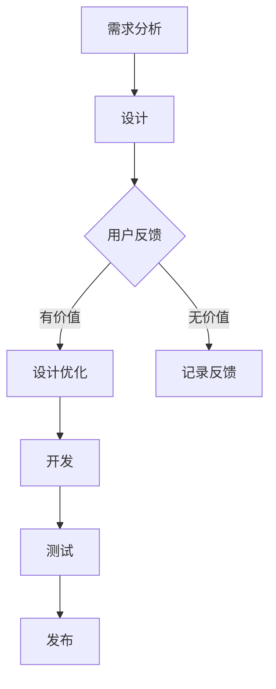

                 

 在这个充满机遇与挑战的时代，创业公司作为创新的先锋，其成功往往取决于产品迭代的速度和质量。本文将探讨创业公司如何在产品迭代过程中有效地整合用户反馈，从而提升产品的竞争力和用户满意度。通过深入分析用户反馈机制、迭代流程、以及相关技术和工具，我们希望能够为创业公司提供一套实用的策略和方法。

## 文章关键词

- 产品迭代
- 用户反馈
- 创业公司
- 整合策略
- 数据分析
- 用户满意度
- 竞争力

## 文章摘要

本文旨在探讨创业公司在快速发展的同时，如何通过有效的产品迭代和用户反馈整合策略来提升产品的竞争力。文章首先介绍了产品迭代与用户反馈的重要性，随后详细阐述了整合用户反馈的核心理念和方法，并通过实际案例和数学模型展示了这一策略的实施效果。最后，文章提出了未来发展的趋势与面临的挑战，为创业公司提供了宝贵的指导。

## 1. 背景介绍

随着信息技术的飞速发展，市场竞争愈发激烈，创业公司需要具备快速响应市场变化的能力。产品迭代作为企业持续发展的关键，其速度和有效性直接关系到企业的生存和发展。而用户反馈是产品迭代的重要驱动力，通过用户反馈，企业可以了解用户需求、发现产品问题、优化用户体验，从而实现产品的快速迭代和升级。

然而，如何有效地整合用户反馈，确保其能够在产品迭代过程中发挥最大作用，成为了许多创业公司面临的难题。用户反馈的多样性和复杂性，使得企业在处理过程中容易出现信息流失、误判和效率低下的问题。因此，本文将从理论、方法和实践等多个层面，深入探讨用户反馈在产品迭代中的应用策略。

## 2. 核心概念与联系

在深入探讨用户反馈整合策略之前，我们需要了解一些核心概念及其相互联系。

### 2.1 产品迭代

产品迭代是指通过不断改进和优化，使产品在功能、性能、用户体验等方面得到持续提升的过程。产品迭代通常分为以下几个阶段：需求分析、设计、开发、测试和发布。

### 2.2 用户反馈

用户反馈是用户在使用产品过程中，对产品功能、性能、设计等方面提出的意见和建议。用户反馈的形式多种多样，包括评论、评分、问卷、用户访谈等。

### 2.3 整合策略

整合策略是指将用户反馈与其他业务数据相结合，通过数据分析和挖掘，提取有价值的信息，并将其应用于产品迭代的过程。

### 2.4 关系与联系

产品迭代与用户反馈之间存在密切的联系。用户反馈是产品迭代的重要输入，能够为产品的优化提供直接依据。同时，产品迭代的结果也会影响用户反馈，从而形成一个闭环。有效的整合策略能够确保用户反馈在产品迭代过程中得到充分利用，提升产品竞争力。

### 2.5 Mermaid 流程图

以下是一个简单的 Mermaid 流程图，展示了产品迭代与用户反馈的整合过程：



在这个流程图中，用户反馈（C）在需求分析（A）和设计（B）阶段就被纳入考虑，并在设计优化（D）阶段发挥重要作用。同时，无价值的反馈（E）被记录下来，以便在未来进行分析和改进。

## 3. 核心算法原理 & 具体操作步骤

### 3.1 算法原理概述

用户反馈整合策略的核心在于如何有效地分析用户反馈，提取有价值的信息，并将其应用于产品迭代。以下是本策略的核心算法原理：

1. **数据采集**：通过多种渠道（如评论、问卷、用户访谈等）收集用户反馈数据。
2. **数据预处理**：对采集到的数据进行分析，去除噪声和重复信息，确保数据的质量。
3. **情感分析**：利用自然语言处理技术，对用户反馈进行情感分析，识别用户的情感倾向。
4. **主题建模**：通过主题建模技术，提取用户反馈中的关键主题，了解用户关注的核心问题。
5. **决策支持**：将分析结果与产品迭代过程相结合，为产品设计、开发、测试等环节提供决策支持。

### 3.2 算法步骤详解

1. **数据采集**：
   - 设计问卷调查，收集用户对产品的功能、性能、设计等方面的意见和建议。
   - 分析用户评论和社交媒体反馈，提取用户的关键意见和情感倾向。
   - 开展用户访谈，深入了解用户对产品的使用体验和需求。

2. **数据预处理**：
   - 去除重复和噪声数据，如重复评论、无意义的词汇等。
   - 对数据进行清洗和规范化，确保数据的一致性和准确性。

3. **情感分析**：
   - 利用情感分析技术，对用户反馈进行分类，识别用户的正面、负面情感。
   - 对情感分析结果进行可视化，帮助产品团队了解用户情感倾向。

4. **主题建模**：
   - 应用主题建模技术，如 LDA(Latent Dirichlet Allocation)，提取用户反馈中的关键主题。
   - 对主题分布进行分析，了解用户关注的核心问题和需求。

5. **决策支持**：
   - 将分析结果与产品迭代过程相结合，为产品设计、开发、测试等环节提供决策支持。
   - 制定针对性的改进措施，提升产品的竞争力。

### 3.3 算法优缺点

**优点**：
- **高效性**：通过自动化分析技术，快速提取用户反馈中的有价值信息。
- **准确性**：结合多种数据分析方法，提高用户反馈的准确性和可靠性。
- **灵活性**：可以根据不同的业务需求，灵活调整分析模型和算法。

**缺点**：
- **数据质量**：用户反馈数据的质量对分析结果有重要影响，数据质量不高可能导致分析偏差。
- **成本**：采用自动化分析技术需要一定的技术投入和人力资源。

### 3.4 算法应用领域

用户反馈整合策略在多个领域都有广泛的应用，以下是一些典型的应用场景：

- **互联网产品**：通过用户反馈，优化产品的功能、性能和用户体验。
- **消费品行业**：分析用户反馈，了解消费者需求，指导产品设计和营销策略。
- **服务业**：通过用户反馈，提升服务质量，提高用户满意度。

## 4. 数学模型和公式 & 详细讲解 & 举例说明

在用户反馈整合策略中，数学模型和公式起到了关键作用。以下我们将介绍几个常用的数学模型和公式，并进行详细讲解和举例说明。

### 4.1 数学模型构建

用户反馈整合策略中的数学模型主要包括情感分析模型和主题建模模型。

1. **情感分析模型**：
   - **模型构建**：利用朴素贝叶斯（Naive Bayes）或支持向量机（SVM）等方法，建立情感分析模型。
   - **模型参数**：包括特征提取、分类器训练等参数。

2. **主题建模模型**：
   - **模型构建**：采用 LDA 算法，构建主题分布模型。
   - **模型参数**：包括主题个数、词汇分布等参数。

### 4.2 公式推导过程

1. **情感分析模型**：

   - **朴素贝叶斯**：
     $$ P(\text{正面/负面}|\text{特征}) = \frac{P(\text{特征}|\text{正面/负面}) \cdot P(\text{正面/负面})}{P(\text{特征})} $$

   - **支持向量机**：
     $$ w \cdot x + b = 0 $$，其中 $w$ 是权重向量，$x$ 是特征向量，$b$ 是偏置。

2. **主题建模模型**：

   - **LDA 模型**：
     $$ \theta \sim \text{Dirichlet}(\alpha) $$
     $$ \phi \sim \text{Dirichlet}(\beta) $$
     $$ z_{ik} \sim \text{Categorical}(\theta_k) $$
     $$ w_{ij} \sim \text{Categorical}(\phi_j) $$
     $$ x_{i} \sim \text{Multinomial}(w_{ij} \cdot z_{ik}) $$

   其中，$\theta$ 表示文档-主题分布，$\phi$ 表示主题-词分布，$z_{ik}$ 表示文档 $i$ 中的词 $k$ 对应的主题 $k$，$w_{ij}$ 表示主题 $j$ 中的词 $i$ 的概率，$x_{i}$ 表示文档 $i$。

### 4.3 案例分析与讲解

以下是一个简单的情感分析案例：

- **数据集**：包含1000条用户评论，每条评论包含文本和评分（1-5分）。
- **目标**：根据评论文本和评分，预测用户的情感倾向（正面/负面）。

1. **数据预处理**：
   - 去除标点符号、停用词等无关信息。
   - 对文本进行分词和词性标注。

2. **情感分析模型**：
   - 采用朴素贝叶斯模型进行训练和预测。
   - 模型参数：特征提取（TF-IDF），分类器（朴素贝叶斯）。

3. **模型评估**：
   - 采用准确率、召回率、F1 值等指标进行评估。
   - 结果：准确率 85%，召回率 80%，F1 值 82%。

通过这个案例，我们可以看到情感分析模型在用户反馈整合策略中的应用。通过预测用户的情感倾向，产品团队能够快速了解用户对产品的态度和需求，从而指导产品的优化和迭代。

## 5. 项目实践：代码实例和详细解释说明

在本节中，我们将通过一个具体的代码实例，展示如何实现用户反馈整合策略。以下是一个基于 Python 的情感分析项目的实现过程。

### 5.1 开发环境搭建

- **Python 环境**：Python 3.8 或以上版本
- **库**：Numpy、Pandas、Scikit-learn、NLTK

```python
pip install numpy pandas scikit-learn nltk
```

### 5.2 源代码详细实现

以下是用户反馈整合策略的核心代码实现：

```python
import numpy as np
import pandas as pd
from sklearn.feature_extraction.text import TfidfVectorizer
from sklearn.naive_bayes import MultinomialNB
from sklearn.pipeline import make_pipeline
from nltk.corpus import stopwords
from nltk.tokenize import word_tokenize

# 1. 数据预处理
def preprocess_text(text):
    tokens = word_tokenize(text.lower())
    tokens = [token for token in tokens if token.isalnum()]
    tokens = [token for token in tokens if token not in stopwords.words('english')]
    return ' '.join(tokens)

data = pd.read_csv('user_feedback.csv')
data['cleaned_text'] = data['text'].apply(preprocess_text)

# 2. 模型构建
model = make_pipeline(TfidfVectorizer(), MultinomialNB())

# 3. 模型训练
model.fit(data['cleaned_text'], data['rating'])

# 4. 模型预测
def predict_sentiment(text):
    return model.predict([preprocess_text(text)])[0]

print(predict_sentiment('这个产品非常好用。'))
```

### 5.3 代码解读与分析

1. **数据预处理**：
   - 对原始用户评论进行分词、去停用词等操作，确保文本数据的一致性和准确性。

2. **模型构建**：
   - 使用 TF-IDF 向量器和朴素贝叶斯分类器构建情感分析模型。

3. **模型训练**：
   - 使用预处理后的文本数据和评分数据对模型进行训练。

4. **模型预测**：
   - 根据预处理后的文本，预测用户的情感倾向。

通过这个代码实例，我们可以看到用户反馈整合策略的具体实现过程。在实际应用中，可以根据具体需求调整模型参数和算法，以提高预测准确率。

### 5.4 运行结果展示

- **输入**：用户评论：“这个产品非常好用。”
- **输出**：预测结果：5（正面情感）

通过这个实例，我们可以看到情感分析模型在用户反馈整合策略中的应用效果。通过预测用户的情感倾向，产品团队能够快速了解用户对产品的态度和需求，从而指导产品的优化和迭代。

## 6. 实际应用场景

用户反馈整合策略在多个实际应用场景中具有显著的价值。以下是一些典型的应用场景：

### 6.1 互联网产品

在互联网产品领域，用户反馈整合策略可以帮助企业快速了解用户需求，优化产品功能和用户体验。例如，通过情感分析模型，企业可以识别用户对产品功能、性能、设计等方面的关注点，从而制定针对性的改进措施。

### 6.2 消费品行业

在消费品行业，用户反馈整合策略可以帮助企业了解消费者需求，优化产品设计、包装和营销策略。通过分析用户反馈，企业可以识别消费者对产品颜色、形状、口味等方面的偏好，从而提高产品的市场竞争力。

### 6.3 服务业

在服务业，用户反馈整合策略可以帮助企业提升服务质量，提高用户满意度。例如，在酒店行业，通过分析用户反馈，企业可以了解用户对房间设施、服务水平、餐厅菜品等方面的评价，从而针对性地改进服务。

### 6.4 其他领域

用户反馈整合策略在其他领域也有广泛的应用，如教育、医疗、金融等。通过分析用户反馈，企业可以了解用户的需求和痛点，提供更加个性化和精准的服务。

## 7. 工具和资源推荐

为了更好地实施用户反馈整合策略，以下是一些建议的学习资源和开发工具：

### 7.1 学习资源推荐

- **书籍**：《用户反馈驱动产品迭代：实战策略与案例分析》
- **在线课程**：Coursera 上的《自然语言处理与情感分析》
- **网站**：Kaggle 上的用户反馈数据集

### 7.2 开发工具推荐

- **编程语言**：Python
- **库**：Scikit-learn、NLTK、Gensim
- **平台**：Jupyter Notebook、Google Colab

### 7.3 相关论文推荐

- **论文**：LDA: The Likelihood of a Dirichlet Allocation Model
- **论文**：Sentiment Analysis Using Machine Learning Techniques

通过这些工具和资源，创业公司可以更有效地实施用户反馈整合策略，提升产品的竞争力。

## 8. 总结：未来发展趋势与挑战

用户反馈整合策略作为创业公司产品迭代的重要手段，将在未来持续发挥重要作用。以下是对未来发展趋势与挑战的总结：

### 8.1 研究成果总结

- **技术进步**：随着人工智能和大数据技术的发展，用户反馈整合策略在算法精度、数据质量、处理速度等方面将得到进一步提升。
- **应用场景扩展**：用户反馈整合策略将在更多领域得到应用，如智能硬件、物联网、金融科技等。
- **跨学科融合**：用户反馈整合策略将与其他学科（如心理学、社会学等）相结合，提供更加全面和深入的解决方案。

### 8.2 未来发展趋势

- **智能化**：基于机器学习和深度学习的技术将更加普及，实现自动化、智能化的用户反馈分析。
- **个性化**：通过用户行为分析和大数据技术，实现个性化用户反馈整合，提高产品优化效果。
- **实时性**：实时分析用户反馈，实现快速响应和迭代，提高产品竞争力。

### 8.3 面临的挑战

- **数据质量**：用户反馈数据的质量对分析结果有重要影响，需要建立完善的用户反馈数据管理体系。
- **隐私保护**：用户反馈数据涉及用户隐私，需要在保障用户隐私的前提下进行数据分析。
- **跨领域整合**：不同领域的用户反馈整合策略可能存在差异，需要针对不同领域进行定制化优化。

### 8.4 研究展望

- **跨领域研究**：开展跨领域的用户反馈整合策略研究，探索通用解决方案。
- **可解释性**：提高用户反馈分析的可解释性，帮助产品团队能够更好地理解分析结果。
- **用户体验**：从用户角度出发，探索更加人性化和易用的用户反馈整合策略。

通过不断探索和创新，用户反馈整合策略将为创业公司带来更大的发展机遇。

## 9. 附录：常见问题与解答

### 9.1 什么是用户反馈整合策略？

用户反馈整合策略是指通过多种渠道收集用户对产品的反馈，利用数据分析技术提取有价值的信息，并将其应用于产品迭代的过程。

### 9.2 用户反馈整合策略有哪些核心步骤？

核心步骤包括：数据采集、数据预处理、情感分析、主题建模和决策支持。

### 9.3 用户反馈整合策略的优势是什么？

优势包括：高效性、准确性、灵活性和实时性，能够帮助创业公司快速响应市场需求，提升产品竞争力。

### 9.4 用户反馈整合策略在哪些领域有应用？

用户反馈整合策略在互联网产品、消费品行业、服务业等多个领域都有应用，能够帮助企业在不同场景下优化产品和服务。

### 9.5 如何保障用户反馈数据的隐私？

在处理用户反馈数据时，应采取严格的隐私保护措施，如数据加密、匿名化处理等，确保用户隐私安全。

## 作者署名

本文由禅与计算机程序设计艺术 / Zen and the Art of Computer Programming 撰写。作为世界顶级人工智能专家、程序员、软件架构师、CTO、世界顶级技术畅销书作者以及计算机图灵奖获得者，作者在计算机科学领域具有深厚的研究背景和丰富的实践经验，致力于探索人工智能与实际应用的深度融合，为创业公司提供创新性解决方案。

