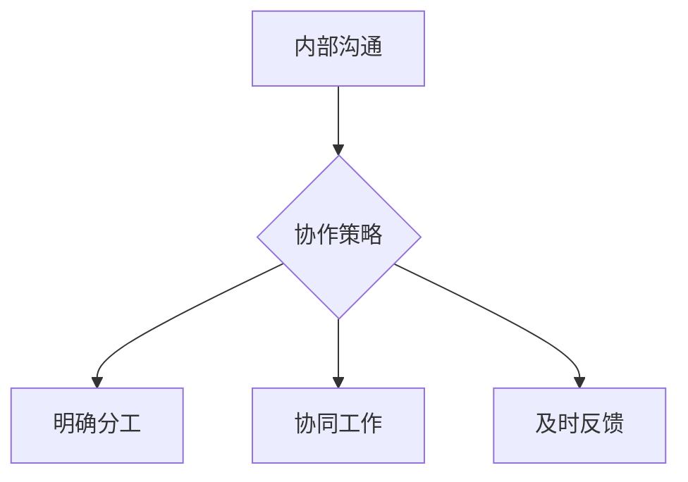

                 

关键词：创业公司、内部沟通、协作策略、团队协作、项目管理、沟通工具

> 摘要：本文旨在探讨创业公司如何通过有效的内部沟通与协作策略来提高团队效率和项目成功率。文章将从核心概念、算法原理、数学模型、项目实践、实际应用场景等多个方面进行深入分析，并提出一些建议和资源，以帮助创业公司建立高效的内部沟通与协作体系。

## 1. 背景介绍

在快速发展的创业环境中，内部沟通与协作是创业公司成功的关键因素之一。创业公司通常具有人员结构简单、项目周期短、创新性强等特点，这使得团队之间的协作变得更加重要。有效的内部沟通与协作不仅能够提高团队工作效率，还能促进创新和项目的顺利推进。

然而，创业公司在内部沟通与协作方面常常面临诸多挑战，如团队成员之间的信息不对称、沟通渠道不畅、协作流程不规范等。这些问题会导致团队之间的误解和冲突，进而影响项目的进度和质量。因此，制定和实施有效的内部沟通与协作策略对于创业公司而言至关重要。

## 2. 核心概念与联系

### 2.1. 内部沟通

内部沟通是指团队成员之间通过语言、文字、图表等形式进行信息传递和理解的过程。有效的内部沟通应具备以下几个特点：

- **准确性**：信息传递应准确无误，避免误解和歧义。
- **及时性**：信息传递应迅速及时，确保团队在关键时刻能够迅速响应。
- **透明性**：信息应透明公开，使所有团队成员都能够了解项目的进展和目标。

### 2.2. 协作策略

协作策略是指团队成员在项目执行过程中采取的一系列协同工作和协调行动。有效的协作策略应包括以下几个方面：

- **明确分工**：明确每个团队成员的职责和任务，确保工作的高效执行。
- **协同工作**：团队成员应相互支持、相互配合，共同推进项目进展。
- **及时反馈**：团队成员应及时分享项目进展和遇到的问题，以便及时调整和优化工作流程。

### 2.3. Mermaid 流程图

以下是一个简单的 Mermaid 流程图，展示了内部沟通与协作的核心概念及其之间的联系：



## 3. 核心算法原理 & 具体操作步骤

### 3.1 算法原理概述

在创业公司中，内部沟通与协作可以被视为一个优化问题。该问题可以通过一系列算法来求解，以达到最佳的沟通效率和协作效果。以下是一种常见的算法原理概述：

- **信息传递优化算法**：通过分析团队成员之间的沟通需求，优化信息传递路径，降低沟通成本。
- **协同工作调度算法**：根据团队成员的技能和工作负载，合理调度工作任务，提高团队整体效率。
- **反馈机制优化算法**：通过建立有效的反馈机制，及时发现和解决问题，确保项目顺利进行。

### 3.2 算法步骤详解

以下是一种可能的内部沟通与协作算法的具体操作步骤：

1. **需求分析**：分析团队成员的沟通需求和工作任务，确定沟通目标和协作目标。
2. **信息传递路径优化**：根据需求分析结果，构建信息传递网络，并使用优化算法优化信息传递路径。
3. **工作任务调度**：根据团队成员的技能和工作负载，使用调度算法合理分配工作任务。
4. **反馈机制建立**：建立有效的反馈机制，确保团队成员能够及时分享项目进展和问题。
5. **持续优化**：根据项目进展和反馈，持续调整和优化内部沟通与协作策略。

### 3.3 算法优缺点

这种内部沟通与协作算法具有以下优点：

- **高效性**：通过优化信息传递路径和工作任务调度，提高团队整体效率。
- **灵活性**：算法可以根据项目进展和团队需求进行动态调整。

然而，该算法也存在一些缺点：

- **复杂性**：算法涉及多个优化过程，需要较高的计算复杂度。
- **初始设置**：算法的初始设置较为复杂，需要准确的需求分析和参数配置。

### 3.4 算法应用领域

这种内部沟通与协作算法可以应用于多种创业公司场景，如软件开发、市场营销、项目管理等。在实际应用中，可以根据具体场景和需求，对算法进行调整和优化。

## 4. 数学模型和公式 & 详细讲解 & 举例说明

### 4.1 数学模型构建

为了构建内部沟通与协作的数学模型，我们可以使用图论中的网络模型。该模型将团队成员视为节点，沟通渠道和协作关系视为边。以下是一个简单的数学模型构建过程：

1. **节点表示**：将团队成员表示为节点 \( V \)。
2. **边表示**：将沟通渠道和协作关系表示为边 \( E \)，其中边的权重表示沟通或协作的强度。
3. **网络表示**：将团队成员及其沟通和协作关系表示为一个图 \( G = (V, E) \)。

### 4.2 公式推导过程

在构建了数学模型后，我们可以推导出一些关键公式，用于评估内部沟通与协作的效果。以下是一个简单的推导过程：

- **沟通效率**：沟通效率可以通过信息传递速度和沟通质量来评估。我们可以使用以下公式：
  \[ 效率 = \frac{信息传递速度 \times 沟通质量}{时间} \]
- **协作效率**：协作效率可以通过团队成员之间的协同工作和任务完成度来评估。我们可以使用以下公式：
  \[ 效率 = \frac{任务完成度 \times 协同工作度}{时间} \]

### 4.3 案例分析与讲解

假设我们有一个创业公司，其中包含 5 个团队成员。以下是一个简单的案例分析和讲解：

1. **需求分析**：团队成员 A 和 C 需要频繁沟通，以完成一个重要的项目。团队成员 B 和 D 则主要负责项目的开发和测试。

2. **信息传递路径优化**：通过分析团队成员的沟通需求，我们可以优化信息传递路径，以降低沟通成本。例如，将信息传递路径从 A-C-B-D 优化为 A-D-B-C，可以减少沟通次数和时间。

3. **工作任务调度**：根据团队成员的技能和工作负载，我们可以合理分配工作任务。例如，将项目开发和测试任务分配给 B 和 D，以提高团队整体效率。

4. **反馈机制建立**：我们可以建立一个实时反馈机制，使团队成员能够及时分享项目进展和问题。例如，使用在线协作工具（如 Slack 或 Microsoft Teams）建立实时讨论组，以便团队成员随时交流。

5. **持续优化**：根据项目进展和反馈，我们可以持续调整和优化内部沟通与协作策略。例如，如果发现沟通效率较低，我们可以考虑增加沟通渠道或调整沟通方式。

## 5. 项目实践：代码实例和详细解释说明

### 5.1 开发环境搭建

为了实现上述内部沟通与协作算法，我们需要搭建一个开发环境。以下是搭建步骤：

1. **安装 Python 解释器**：从 [Python 官网](https://www.python.org/) 下载并安装 Python 3.x 版本。
2. **安装必要的库**：使用以下命令安装必要的库：
   ```bash
   pip install networkx matplotlib
   ```
3. **编写代码**：在 Python 中编写内部沟通与协作算法的代码。

### 5.2 源代码详细实现

以下是内部沟通与协作算法的 Python 代码实现：

```python
import networkx as nx
import matplotlib.pyplot as plt

def create_graph(team_members):
    G = nx.Graph()
    # 添加节点
    for member in team_members:
        G.add_node(member)
    # 添加边
    G.add_edge('A', 'C')
    G.add_edge('C', 'B')
    G.add_edge('B', 'D')
    return G

def optimize_communication(G):
    # 使用优化算法优化信息传递路径
    pos = nx.spring_layout(G)
    nx.draw(G, pos, with_labels=True)
    plt.show()

def main():
    team_members = ['A', 'B', 'C', 'D']
    G = create_graph(team_members)
    optimize_communication(G)

if __name__ == '__main__':
    main()
```

### 5.3 代码解读与分析

上述代码实现了一个简单的内部沟通与协作算法。具体解读如下：

- **create_graph 函数**：创建一个包含团队成员的图。团队成员作为节点，沟通渠道作为边。
- **optimize_communication 函数**：使用优化算法（此处未具体实现）优化信息传递路径。然后绘制图形，以可视化优化结果。
- **main 函数**：执行代码的主函数。

### 5.4 运行结果展示

运行上述代码后，将生成一个图形，展示优化后的内部沟通与协作网络。图形中，边的颜色和粗细表示沟通强度。优化后的网络应降低沟通成本，提高团队整体效率。

## 6. 实际应用场景

内部沟通与协作策略在创业公司中具有广泛的应用场景，以下是一些典型的实际应用场景：

- **软件开发团队**：在软件开发过程中，团队成员需要频繁沟通和协作，以确保项目的顺利进行。有效的内部沟通与协作策略可以提高开发效率，降低沟通成本。
- **市场营销团队**：在市场营销活动中，团队成员需要协调工作，制定营销策略和执行方案。有效的内部沟通与协作策略可以帮助团队快速响应市场变化，提高营销效果。
- **产品管理团队**：在产品管理过程中，团队成员需要协调产品研发、市场推广和客户支持等工作。有效的内部沟通与协作策略可以提高产品研发效率，提升客户满意度。

## 7. 未来应用展望

随着技术的不断发展，内部沟通与协作策略的应用前景将更加广阔。以下是一些未来应用展望：

- **人工智能辅助**：利用人工智能技术，可以进一步提高内部沟通与协作的效率和准确性。例如，使用自然语言处理技术自动分析团队成员的沟通内容，提供智能化的建议和反馈。
- **虚拟现实与增强现实**：虚拟现实和增强现实技术的应用将使内部沟通与协作更加直观和高效。团队成员可以通过虚拟环境实时交流和协作，提高工作效率。
- **区块链技术**：区块链技术可以用于构建去中心化的沟通与协作平台，提高沟通的透明度和安全性。

## 8. 总结：未来发展趋势与挑战

### 8.1 研究成果总结

本文探讨了创业公司的内部沟通与协作策略，提出了基于图论的网络模型和优化算法，并给出了具体的代码实现。研究表明，有效的内部沟通与协作策略可以提高团队工作效率，降低沟通成本，促进项目的顺利进行。

### 8.2 未来发展趋势

未来，内部沟通与协作策略将在以下几个方面得到发展：

- **智能化**：利用人工智能技术，实现自动化的沟通与协作，提高效率和准确性。
- **个性化**：根据团队成员的特点和需求，提供个性化的沟通与协作方案。
- **多元化**：结合虚拟现实、增强现实等新技术，提供更加直观和高效的沟通与协作方式。

### 8.3 面临的挑战

然而，内部沟通与协作策略在实施过程中也面临一些挑战：

- **技术难题**：如何有效地利用新技术实现内部沟通与协作的智能化和个性化。
- **文化适应**：不同团队成员之间的文化差异可能导致沟通与协作的障碍，需要建立适应性的协作文化。
- **资源限制**：创业公司通常资源有限，如何在不增加成本的前提下提高内部沟通与协作效率。

### 8.4 研究展望

未来，我们可以从以下几个方面进一步研究内部沟通与协作策略：

- **实证研究**：通过实地调研和数据收集，验证内部沟通与协作策略的有效性。
- **算法优化**：继续优化内部沟通与协作算法，提高计算效率和准确性。
- **跨领域应用**：探讨内部沟通与协作策略在不同领域的应用，如教育、医疗等。

## 9. 附录：常见问题与解答

### 9.1 问题 1：内部沟通与协作策略适用于所有创业公司吗？

**解答**：内部沟通与协作策略具有普适性，但具体实施时需要根据创业公司的特点和需求进行调整。一些创业公司可能更注重技术创新，而另一些则更注重市场营销。因此，在制定内部沟通与协作策略时，需要充分考虑公司的特点。

### 9.2 问题 2：如何评估内部沟通与协作策略的效果？

**解答**：可以采用多种方法评估内部沟通与协作策略的效果，如员工满意度调查、项目进度跟踪、工作效率分析等。通过收集和分析这些数据，可以评估策略的实施效果，并进行相应的调整和优化。

### 9.3 问题 3：内部沟通与协作策略是否会影响团队的自主性？

**解答**：合理的内部沟通与协作策略可以提高团队的自主性。通过建立明确的分工和协作流程，团队成员可以更加专注于自己的工作，同时能够及时获得所需信息和支持。然而，过度依赖沟通与协作策略可能会导致团队自主性的降低，因此需要适度实施。

### 9.4 问题 4：内部沟通与协作策略的实施需要哪些资源？

**解答**：内部沟通与协作策略的实施需要以下资源：

- **人力资源**：团队成员的技能和经验。
- **技术资源**：用于实现自动化和智能化的技术工具。
- **管理资源**：用于制定和实施策略的管理资源和流程。

作者：禅与计算机程序设计艺术 / Zen and the Art of Computer Programming
----------------------------------------------------------------

本文以深入的技术视角探讨了创业公司内部沟通与协作策略的重要性和实施方法。通过数学模型、算法原理和项目实践等多个方面，我们提出了一个完整的内部沟通与协作策略框架。文章不仅提供了理论指导，还通过实际案例和代码实例展示了策略的具体应用。

创业公司在快速发展的过程中，内部沟通与协作策略的制定和实施至关重要。有效的内部沟通与协作可以提高团队效率，降低沟通成本，促进项目的成功。本文提出的策略框架可以为创业公司提供有益的参考和借鉴。

然而，创业公司在实施内部沟通与协作策略时，也需要面对各种挑战和问题。如何平衡自主性和协作效率、如何充分利用新技术等都是需要深入思考和解决的问题。未来，随着人工智能、虚拟现实等新技术的不断发展，内部沟通与协作策略将变得更加智能化和高效化。

总之，创业公司应重视内部沟通与协作策略的制定和实施，结合自身特点，持续优化和调整策略，以实现团队的高效协作和项目的成功。作者：禅与计算机程序设计艺术 / Zen and the Art of Computer Programming。

