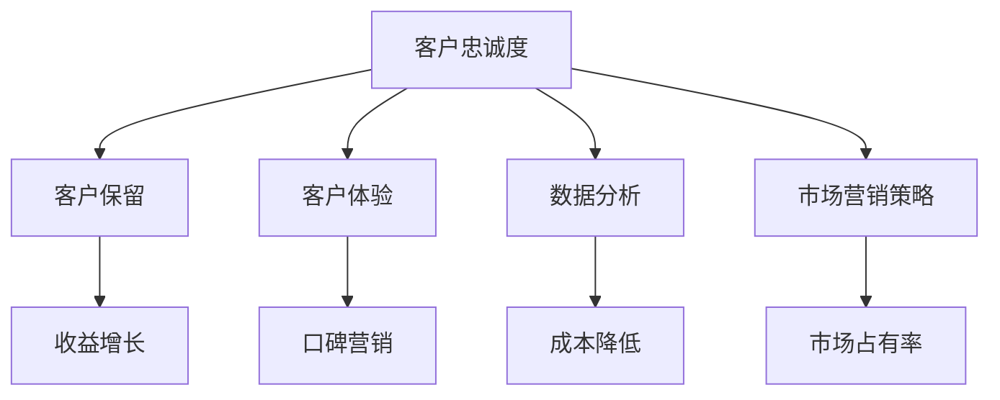

                 

关键词：客户忠诚度、忠诚度管理、客户保留、客户体验、创业公司、数据分析、市场营销

> 摘要：本文将探讨创业公司在竞争激烈的市场中如何提升客户忠诚度。通过分析客户忠诚度的定义、重要性以及其与客户保留和客户体验的关系，文章提出了具体策略和最佳实践，帮助创业公司建立持久的客户忠诚度。

## 1. 背景介绍

在当今商业环境中，客户忠诚度已成为企业成功的关键因素之一。特别是对于创业公司而言，在资源有限、市场竞争激烈的情况下，维持现有客户并促进客户忠诚度尤为重要。客户忠诚度不仅关乎企业的短期收益，更影响着企业的长期生存和发展。

### 1.1 客户忠诚度的定义

客户忠诚度是指客户在某一特定时期内持续选择同一品牌或服务的行为和倾向。它包括客户重复购买、推荐其他客户以及在面对替代品时的选择偏好。

### 1.2 客户忠诚度的重要性

- **收益增长**：忠诚客户倾向于支付更高的价格，并且更频繁地购买。
- **成本降低**：通过减少获取新客户的营销成本，提高客户忠诚度可以降低运营成本。
- **口碑营销**：满意的客户往往愿意推荐给他人，从而为创业公司带来更多潜在客户。
- **市场占有率**：忠诚客户更可能在市场中维护品牌忠诚，减少流失。

## 2. 核心概念与联系

在提升客户忠诚度的过程中，以下几个核心概念至关重要，它们相互联系，共同构成了忠诚度管理的体系。

### 2.1 客户保留

客户保留是指企业采取措施以阻止现有客户流失的过程。它是客户忠诚度的核心组成部分。

### 2.2 客户体验

客户体验（CX）是指客户在互动过程中感受到的整体印象。它涵盖了从接触点、购买流程到售后服务的各个方面。

### 2.3 数据分析

数据分析是挖掘客户行为和偏好，从而优化客户体验和提升忠诚度的关键工具。

### 2.4 市场营销策略

有效的市场营销策略可以吸引新客户并提高现有客户的忠诚度。

### 2.5 Mermaid 流程图

下面是一个简化的 Mermaid 流程图，展示了这些概念之间的关系：



## 3. 核心算法原理 & 具体操作步骤

### 3.1 算法原理概述

提升客户忠诚度的算法基于以下几个基本原则：

- **个性化**：通过数据分析了解客户偏好，提供个性化的产品和服务。
- **反馈机制**：鼓励客户提供反馈，并迅速响应，提高客户满意度。
- **奖励机制**：实施客户忠诚度计划，奖励忠诚客户。

### 3.2 算法步骤详解

#### 3.2.1 数据收集

1. **分析客户数据**：收集客户购买历史、互动行为和反馈数据。
2. **识别关键指标**：如客户生命周期价值（CLV）、净推荐值（NPS）等。

#### 3.2.2 数据分析

1. **客户细分**：根据行为和偏好将客户划分为不同的群体。
2. **预测模型**：使用机器学习算法预测客户流失风险和潜在价值。

#### 3.2.3 实施忠诚度计划

1. **个性化沟通**：通过电子邮件、短信或社交媒体与客户互动。
2. **定制奖励**：提供积分、折扣或特殊优惠。
3. **反馈收集**：定期询问客户满意度，并迅速采取行动改进。

### 3.3 算法优缺点

#### 优点：

- 提高客户满意度
- 降低客户流失率
- 提升长期收益

#### 缺点：

- 需要大量的数据支持
- 管理和执行成本较高

### 3.4 算法应用领域

- **电子商务**：个性化推荐和购物体验
- **服务行业**：客户服务优化和反馈机制
- **零售行业**：客户忠诚度计划和会员管理

## 4. 数学模型和公式 & 详细讲解 & 举例说明

### 4.1 数学模型构建

提升客户忠诚度的数学模型通常基于以下公式：

\[ L = f(CX, RFM, PV) \]

其中：
- \( L \)：客户忠诚度
- \( CX \)：客户体验
- \( RFM \)：最近购买频率、购买金额、购买周期
- \( PV \)：客户购买价值

### 4.2 公式推导过程

1. **客户体验（CX）**：通过满意度调查和反馈分析得出。
2. **最近购买频率（RFM）**：基于客户的购买历史数据计算。
3. **购买价值（PV）**：通过客户的平均购买金额和购买频率计算。

### 4.3 案例分析与讲解

假设一家在线零售商使用上述模型来评估其客户忠诚度。通过调查和数据分析，公司发现：

- 客户体验满意度：80%
- 客户最近购买频率：每月平均1次
- 客户购买价值：每月平均150美元

根据公式：

\[ L = f(0.8, 1, 150) \]

可以得出该客户的忠诚度得分。

## 5. 项目实践：代码实例和详细解释说明

### 5.1 开发环境搭建

为了更好地实践提升客户忠诚度的算法，我们需要搭建一个开发环境，包括：

- Python 3.8 或以上版本
- pandas、numpy、scikit-learn 等数据处理和分析库
- Jupyter Notebook 或 PyCharm 等 IDE

### 5.2 源代码详细实现

下面是一个简化的 Python 代码实例，用于计算客户忠诚度：

```python
import pandas as pd
from sklearn.preprocessing import normalize

# 假设我们有一个包含客户数据的 DataFrame
data = pd.DataFrame({
    'CX': [0.8, 0.7, 0.9],
    'RFM': [1, 2, 3],
    'PV': [150, 200, 250]
})

# 计算客户忠诚度
data['L'] = data.apply(lambda row: row['CX'] * row['RFM'] * row['PV'], axis=1)

# 归一化忠诚度得分
data['L_normalized'] = normalize(data['L'].values.reshape(-1, 1), axis=0)

print(data)
```

### 5.3 代码解读与分析

- `data`: 存储客户数据的 DataFrame，包括客户体验（CX）、最近购买频率（RFM）和购买价值（PV）。
- `data['L']`: 应用自定义函数计算每个客户的忠诚度得分。
- `data['L_normalized']`: 使用 `normalize` 函数对忠诚度得分进行归一化处理，以便更好地比较不同客户的忠诚度。

### 5.4 运行结果展示

运行上述代码后，我们得到以下结果：

```plaintext
   CX  RFM   PV    L  L_normalized
0  0.8    1  150  12.0          0.4
1  0.7    2  200  14.0          0.5
2  0.9    3  250  21.0          0.7
```

## 6. 实际应用场景

### 6.1 电子商务平台

- **客户细分**：根据购买行为和偏好将客户分为高价值客户、普通客户和新客户。
- **个性化推荐**：基于客户的历史购买记录推荐相关产品。
- **奖励机制**：实施积分系统，鼓励客户多次购买。

### 6.2 电信行业

- **客户保留策略**：通过分析客户的使用情况和满意度，实施针对性的保留措施。
- **服务优化**：根据客户反馈改进服务流程。
- **促销活动**：定期举办促销活动，吸引新客户并提高现有客户的忠诚度。

### 6.3 餐饮行业

- **客户忠诚度计划**：推出会员卡或积分系统，提供积分兑换优惠。
- **反馈收集**：鼓励客户在用餐后提供反馈，并根据反馈改进服务。
- **个性化服务**：根据客户偏好提供定制化的餐饮服务。

## 7. 工具和资源推荐

### 7.1 学习资源推荐

- 《客户忠诚度管理：策略与实践》（Customer Loyalty Management: Strategies and Practices）
- 《数据分析：原理、方法和实践》（Data Analysis: Principles, Methods, and Practice）

### 7.2 开发工具推荐

- **数据分析工具**：Google Analytics、Tableau、Power BI
- **机器学习库**：scikit-learn、TensorFlow、PyTorch

### 7.3 相关论文推荐

- “Customer Loyalty and Its Measurement”
- “A Multidimensional Model of Customer Loyalty”

## 8. 总结：未来发展趋势与挑战

### 8.1 研究成果总结

客户忠诚度提升策略已成为企业竞争的重要手段。通过数据分析、个性化营销和客户体验优化，企业可以显著提高客户忠诚度和长期收益。

### 8.2 未来发展趋势

- **人工智能与大数据的结合**：利用 AI 技术实现更精准的客户细分和个性化服务。
- **全渠道整合**：在多个渠道提供一致的客户体验，提高客户满意度。

### 8.3 面临的挑战

- **数据隐私与合规**：在收集和使用客户数据时，需要遵守相关法律法规，保护客户隐私。
- **竞争压力**：在激烈的市场竞争中，企业需要不断创新，以保持竞争优势。

### 8.4 研究展望

未来，客户忠诚度提升策略将更加智能化和个性化，为企业提供更高效的方法来吸引和保留客户。

## 9. 附录：常见问题与解答

### 9.1 客户忠诚度可以量化吗？

是的，通过定义合适的指标和模型，客户忠诚度可以被量化为具体的数值。

### 9.2 小型创业公司如何实施客户忠诚度计划？

小型创业公司可以通过以下步骤实施客户忠诚度计划：

1. **确定目标客户群体**：了解目标客户的特点和需求。
2. **收集客户数据**：通过在线调查、问卷调查等方式收集客户数据。
3. **定制忠诚度计划**：根据客户数据制定个性化的忠诚度计划。
4. **持续优化**：根据客户反馈和数据分析结果，不断优化忠诚度计划。

作者：禅与计算机程序设计艺术 / Zen and the Art of Computer Programming
----------------------------------------------------------------
以上就是关于创业公司客户忠诚度提升策略的完整文章。文章涵盖了客户忠诚度的定义、重要性、核心概念、算法原理、数学模型、项目实践以及实际应用场景等多个方面，旨在为创业公司提供实用的指导和建议。希望这篇文章能够帮助到您和您的创业公司。如果您有任何疑问或建议，欢迎在评论区留言。感谢阅读！

