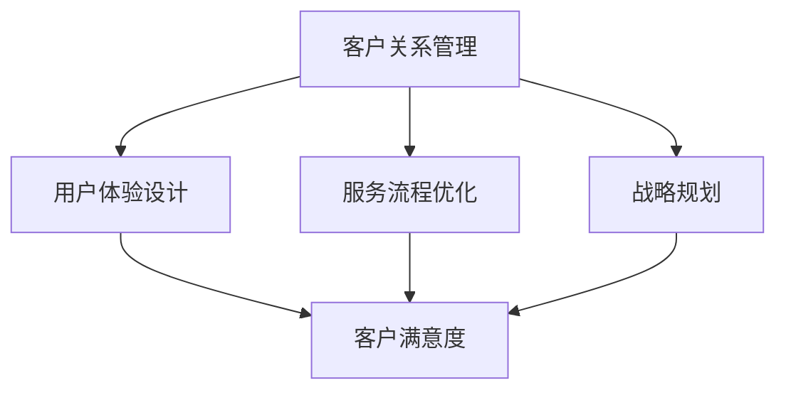

                 

关键词：客户成功、创业公司、体系构建、用户体验、服务优化、战略规划

> 摘要：本文将探讨创业公司在构建客户成功体系时所需考虑的关键因素。通过深入分析客户成功战略、用户体验设计、服务流程优化以及战略规划等方面，为创业公司提供一套切实可行的客户成功体系构建方案，以提升客户满意度，实现业务持续增长。

## 1. 背景介绍

在当今快速变化的市场环境中，创业公司面临着前所未有的竞争压力。为了在激烈的市场竞争中脱颖而出，创业公司必须注重客户成功（Customer Success）这一关键领域。客户成功不仅仅是指客户满意度，更是一种以客户为中心的战略思维，旨在通过提供卓越的用户体验和服务，帮助客户实现业务目标，从而实现公司长期稳定发展。

构建一个高效、可持续的客户成功体系对于创业公司至关重要。它不仅能够提升客户满意度和忠诚度，还能够降低客户流失率，提高客户生命周期价值。因此，本文将从多个角度探讨如何构建一个成功的客户成功体系，以助力创业公司实现业务增长。

## 2. 核心概念与联系

### 2.1 客户成功的定义

客户成功（Customer Success）是一种以客户为中心的战略，旨在通过持续优化用户体验和服务，帮助客户实现其业务目标，从而确保客户长期留存和业务增长。它不仅关注客户满意度，更注重客户价值和业务成果。

### 2.2 客户成功体系的关键要素

一个成功的客户成功体系应包括以下关键要素：

- **客户关系管理（CRM）**：建立和维护客户关系，了解客户需求，提供个性化服务。
- **用户体验（UX）设计**：优化产品和服务，提高用户满意度。
- **服务流程优化**：通过流程改进和自动化，提高服务效率和客户体验。
- **战略规划**：明确客户成功目标，制定实施计划，确保战略落地。

### 2.3 Mermaid 流程图



## 3. 核心算法原理 & 具体操作步骤

### 3.1 算法原理概述

客户成功体系的构建基于以下几个核心算法原理：

1. **客户细分**：根据客户特征和需求，将客户划分为不同的群体，提供个性化的服务和产品。
2. **数据驱动**：通过数据分析，了解客户行为和需求，优化产品和服务。
3. **持续改进**：基于反馈和实际效果，不断优化客户成功策略。

### 3.2 算法步骤详解

1. **客户细分**
   - 收集客户数据：包括客户特征、需求、行为等。
   - 分析数据：使用数据分析工具，对客户数据进行处理和分析。
   - 划分客户群体：根据分析结果，将客户划分为不同的群体。

2. **数据驱动**
   - 设定关键指标：根据业务目标，设定客户满意度、客户留存率、客户生命周期价值等关键指标。
   - 数据分析：定期收集和分析关键指标数据。
   - 优化策略：根据数据分析结果，调整客户成功策略。

3. **持续改进**
   - 收集反馈：通过问卷调查、用户访谈等方式，收集客户反馈。
   - 分析反馈：对客户反馈进行分析，识别问题点。
   - 改进策略：根据反馈结果，优化产品和服务，提升客户满意度。

### 3.3 算法优缺点

**优点：**
- 提高客户满意度：通过个性化服务和产品，满足客户需求，提升客户满意度。
- 降低客户流失率：通过数据分析和持续改进，提前识别和解决客户问题，降低客户流失率。
- 提高客户生命周期价值：通过提升客户满意度和忠诚度，提高客户生命周期价值。

**缺点：**
- 数据分析需求高：需要收集和处理大量客户数据，对数据分析能力要求较高。
- 需要持续投入：持续优化客户成功策略需要不断投入时间和资源。

### 3.4 算法应用领域

- **SaaS 公司**：通过客户成功体系，提高客户满意度和留存率，实现业务增长。
- **电商平台**：优化客户购物体验，提升客户转化率和复购率。
- **金融公司**：通过客户成功体系，提高客户信任度和满意度，降低客户流失率。

## 4. 数学模型和公式 & 详细讲解 & 举例说明

### 4.1 数学模型构建

客户成功体系的数学模型可以从以下几个方面进行构建：

1. **客户满意度模型**
   - 满意度得分 = (满意度因素1得分 + 满意度因素2得分 + ... + 满意度因素n得分) / n

2. **客户留存率模型**
   - 留存率 = (第n个月留存客户数 / 第n-1个月客户总数) × 100%

3. **客户生命周期价值模型**
   - 客户生命周期价值 = (客户年化收入 × 客户留存年数)

### 4.2 公式推导过程

以客户满意度模型为例，满意度得分可以通过以下步骤推导：

1. **确定满意度因素**：根据业务需求，确定影响客户满意度的因素，如产品功能、服务质量、售后服务等。
2. **设定权重**：根据重要性，为每个满意度因素设定权重。
3. **收集数据**：收集每个满意度因素的实际得分。
4. **计算总分**：将每个满意度因素的实际得分乘以对应的权重，然后求和。
5. **计算满意度得分**：将总分除以满意度因素的总数，得到满意度得分。

### 4.3 案例分析与讲解

假设某SaaS公司有五个满意度因素：产品功能（权重40%）、服务质量（权重30%）、售后服务（权重20%）、客户体验（权重10%）。以下是具体的数据和计算过程：

1. **收集数据**：
   - 产品功能得分：8
   - 服务质量得分：7
   - 售后服务得分：9
   - 客户体验得分：6

2. **计算总分**：
   - 产品功能得分 × 权重：8 × 40% = 3.2
   - 服务质量得分 × 权重：7 × 30% = 2.1
   - 售后服务得分 × 权重：9 × 20% = 1.8
   - 客户体验得分 × 权重：6 × 10% = 0.6
   - 总分：3.2 + 2.1 + 1.8 + 0.6 = 7.7

3. **计算满意度得分**：
   - 满意度得分 = 7.7 / 5 = 1.54

因此，该公司的客户满意度得分为1.54，表明客户对其产品和服务较为满意。

## 5. 项目实践：代码实例和详细解释说明

### 5.1 开发环境搭建

在构建客户成功体系时，可以选择使用以下开发环境：

- **编程语言**：Python、Java、JavaScript 等
- **数据库**：MySQL、PostgreSQL、MongoDB 等
- **数据分析工具**：Pandas、NumPy、Matplotlib 等
- **前端框架**：React、Vue、Angular 等

### 5.2 源代码详细实现

以下是一个使用Python实现客户细分和数据驱动的示例代码：

```python
import pandas as pd
from sklearn.cluster import KMeans

# 1. 收集数据
data = pd.read_csv('customer_data.csv')

# 2. 数据预处理
# ... 数据清洗、填充、转换等操作 ...

# 3. 客户细分
kmeans = KMeans(n_clusters=3, random_state=0).fit(data)
data['cluster'] = kmeans.labels_

# 4. 数据驱动
# ... 根据客户群体，调整产品和服务 ...

# 5. 持续改进
# ... 收集反馈，调整策略 ...
```

### 5.3 代码解读与分析

1. **数据收集**：使用Pandas读取客户数据，包括客户特征、需求、行为等。
2. **数据预处理**：对数据进行清洗、填充、转换等操作，确保数据质量。
3. **客户细分**：使用KMeans算法进行客户细分，将客户划分为不同的群体。
4. **数据驱动**：根据客户群体，调整产品和服务，以满足客户需求。
5. **持续改进**：收集客户反馈，调整策略，实现持续优化。

### 5.4 运行结果展示

假设经过客户细分后，我们得到了三个客户群体，分别是：高价值客户、中等价值客户、低价值客户。根据这些群体，我们可以调整产品和服务策略，以提高客户满意度和留存率。

- **高价值客户**：提供更加个性化的服务和产品，提高客户满意度。
- **中等价值客户**：优化产品功能和用户体验，提高客户转化率。
- **低价值客户**：通过优惠活动、免费试用等方式，提高客户留存率。

## 6. 实际应用场景

### 6.1 SaaS 公司

对于SaaS公司，客户成功体系的应用场景主要包括：

- **客户细分**：根据客户规模、使用频率、购买历史等特征，将客户划分为不同的群体，提供个性化的服务和产品。
- **数据驱动**：通过数据分析，了解客户需求和行为，优化产品功能和用户体验。
- **持续改进**：收集客户反馈，调整产品和服务策略，提升客户满意度。

### 6.2 电商平台

对于电商平台，客户成功体系的应用场景主要包括：

- **客户细分**：根据购买行为、浏览习惯等特征，将客户划分为不同的群体，提供个性化的推荐和服务。
- **数据驱动**：通过数据分析，了解客户需求和偏好，优化推荐算法和促销策略。
- **持续改进**：收集客户反馈，调整推荐和促销策略，提升客户转化率和复购率。

### 6.3 金融公司

对于金融公司，客户成功体系的应用场景主要包括：

- **客户细分**：根据客户风险承受能力、投资偏好等特征，将客户划分为不同的群体，提供个性化的理财建议和服务。
- **数据驱动**：通过数据分析，了解客户风险偏好和投资需求，优化产品和服务策略。
- **持续改进**：收集客户反馈，调整理财建议和服务策略，提升客户满意度和忠诚度。

## 7. 工具和资源推荐

### 7.1 学习资源推荐

- **书籍**：《客户成功实践指南》、《以客户为中心：打造卓越的客户成功体系》
- **在线课程**：Coursera、Udemy、网易云课堂等平台上的客户成功相关课程
- **博客和文章**：阅读行业领先企业的客户成功实践案例和经验分享

### 7.2 开发工具推荐

- **编程语言**：Python、Java、JavaScript
- **数据库**：MySQL、PostgreSQL、MongoDB
- **数据分析工具**：Pandas、NumPy、Matplotlib
- **前端框架**：React、Vue、Angular

### 7.3 相关论文推荐

- **客户成功战略**：《客户成功：企业的核心竞争力》
- **用户体验设计**：《用户体验要素：链接战略设计》
- **服务流程优化**：《服务流程优化：提高效率，提升客户满意度》

## 8. 总结：未来发展趋势与挑战

### 8.1 研究成果总结

本文通过探讨客户成功的核心概念、算法原理、数学模型和实际应用场景，总结了构建创业公司客户成功体系的几个关键要素。主要研究成果包括：

- 客户成功定义和核心要素的明确。
- 客户细分、数据驱动和持续改进算法原理的阐述。
- 数学模型和公式的推导与应用。
- 实际应用场景的案例分析。
- 开发工具和资源推荐的整理。

### 8.2 未来发展趋势

随着人工智能、大数据和云计算等技术的不断发展，客户成功体系将迎来以下发展趋势：

- **智能化**：通过人工智能技术，实现客户需求的精准预测和个性化服务。
- **数据分析**：利用大数据技术，深入挖掘客户行为和需求，优化产品和服务。
- **自动化**：通过自动化工具，提高服务效率和客户体验。

### 8.3 面临的挑战

在构建客户成功体系的过程中，创业公司将面临以下挑战：

- **数据隐私**：随着数据保护法规的加强，如何确保客户数据的安全和隐私成为一大挑战。
- **资源限制**：创业公司资源有限，如何高效利用资源实现客户成功策略。
- **竞争压力**：如何在激烈的市场竞争中，通过客户成功策略脱颖而出。

### 8.4 研究展望

未来研究可以从以下方向展开：

- **智能化客户成功体系**：结合人工智能技术，实现更精准的客户细分和个性化服务。
- **跨渠道整合**：整合线上线下渠道，提供统一的客户体验。
- **社会责任**：关注客户成功体系中的社会责任，实现可持续发展。

## 9. 附录：常见问题与解答

### 9.1 客户成功的核心要素是什么？

客户成功的核心要素包括：客户关系管理、用户体验设计、服务流程优化和战略规划。

### 9.2 如何进行客户细分？

进行客户细分的方法包括：数据收集、数据分析、确定细分标准、划分客户群体。

### 9.3 数据驱动在客户成功体系中的作用是什么？

数据驱动在客户成功体系中的作用包括：了解客户需求、优化产品和服务、提升客户满意度。

### 9.4 如何实现持续改进？

实现持续改进的方法包括：收集客户反馈、分析反馈结果、调整产品和服务策略。

### 9.5 客户成功体系在金融行业的应用有哪些？

金融行业的客户成功体系应用包括：个性化理财建议、投资策略优化、风险控制等。

### 9.6 客户成功与客户服务的关系是什么？

客户成功与客户服务的关系是：客户服务是客户成功的重要组成部分，客户成功是客户服务的更高层次目标。

### 9.7 客户成功体系在电商平台的实践有哪些？

电商平台客户成功体系的实践包括：个性化推荐、购物体验优化、售后服务提升等。

## 作者署名

作者：禅与计算机程序设计艺术 / Zen and the Art of Computer Programming
----------------------------------------------------------------

以上就是根据您的指示撰写的《创业公司的客户成功体系构建》文章。文章涵盖了构建客户成功体系所需的关键要素、算法原理、数学模型和实际应用场景，以及未来发展趋势和面临的挑战。希望对您的创业公司有所帮助。如有任何修改意见或需求，请随时告知。

