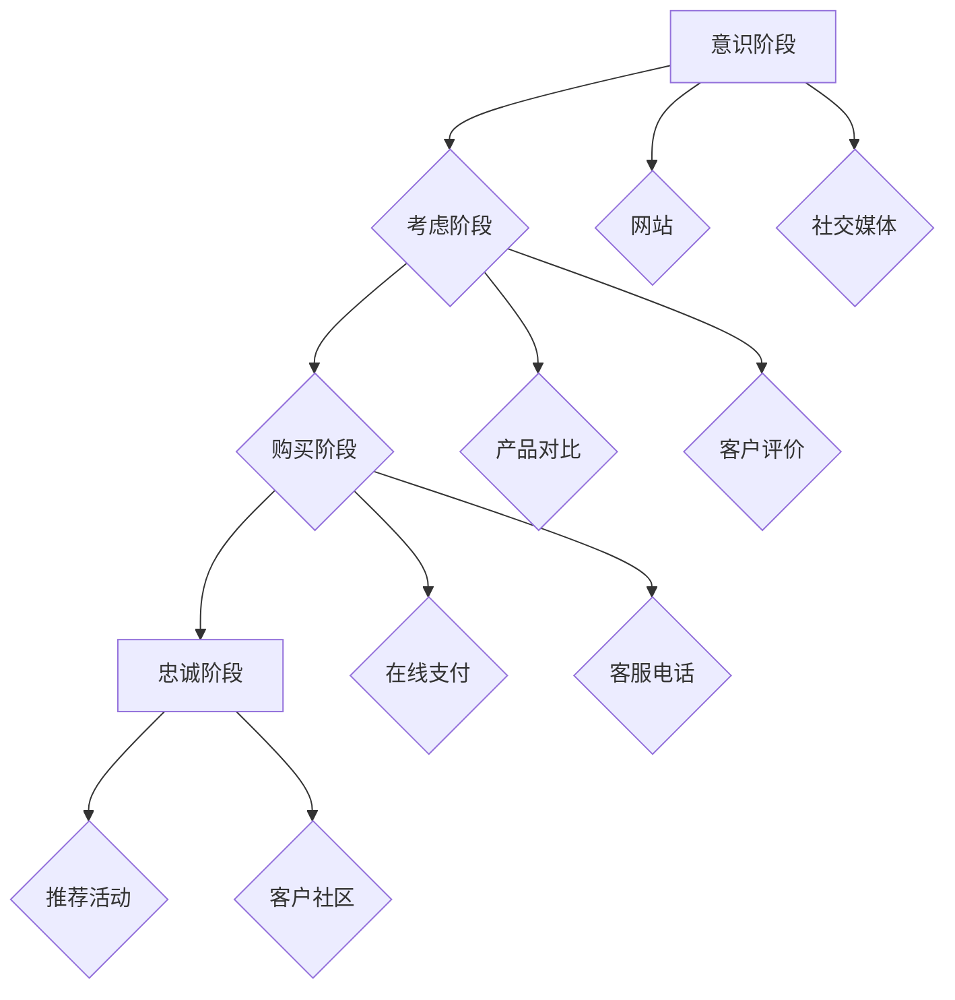

                 

关键词：客户旅程、触点管理、优化策略、用户体验、数据分析

> 摘要：本文将深入探讨创业公司在客户旅程优化与触点管理方面的实践策略。通过剖析客户旅程的各个关键环节，我们提出了有效的优化方法，旨在提升用户体验、增强客户忠诚度，并为企业创造更多的商业价值。本文将结合实际案例，展示如何利用先进的数据分析和技术手段，实现客户旅程的精细化管理和优化。

## 1. 背景介绍

在当今竞争激烈的市场环境中，创业公司要想脱颖而出，必须高度重视客户旅程的优化与触点管理。客户旅程是指客户在购买产品或服务过程中所经历的各个阶段，包括意识阶段、考虑阶段、购买阶段和忠诚阶段。每个阶段都涉及到不同的触点，即客户与企业交互的具体接触点。优化客户旅程意味着提高每个触点的效率和满意度，从而提升整体用户体验，促进客户转化和留存。

触点管理是指企业通过分析客户与品牌互动的所有触点，制定和执行策略，以优化客户体验并提高忠诚度。这包括在线和离线渠道，如网站、移动应用、社交媒体、客服电话和线下门店等。有效的触点管理能够帮助企业更好地理解客户需求，提供个性化服务，从而增强品牌认知和客户满意度。

本文旨在为创业公司提供一套全面的客户旅程优化与触点管理策略，通过分析当前市场趋势、核心概念和实用工具，帮助企业在竞争中获得优势。

## 2. 核心概念与联系

为了深入理解客户旅程优化与触点管理，我们首先需要了解以下几个核心概念：

### 客户旅程

客户旅程是指客户从接触品牌到最终成为忠实客户的全过程。它通常包括以下阶段：

1. **意识阶段**：客户开始意识到有某个需求，并开始寻找相关信息。
2. **考虑阶段**：客户在多个选项中进行比较，权衡利弊。
3. **购买阶段**：客户做出购买决策，完成购买行为。
4. **忠诚阶段**：客户继续使用产品或服务，并可能推荐给他人。

### 触点

触点是指客户在客户旅程中与企业进行交互的具体接触点。每个触点都可能对客户体验产生重要影响。以下是常见的触点类型：

1. **在线触点**：网站、移动应用、电子邮件、社交媒体等。
2. **离线触点**：电话客服、线下门店、实体店等。

### 触点管理

触点管理是指企业通过分析、规划和执行策略，来优化客户在各个触点的体验。以下是触点管理的核心步骤：

1. **触点识别**：识别客户旅程中的所有触点。
2. **触点分析**：分析每个触点的性能和客户反馈。
3. **触点优化**：制定和执行策略，提高触点的效率与满意度。
4. **持续监测**：持续监控触点表现，及时调整策略。

### Mermaid 流程图

为了更直观地展示客户旅程与触点管理的关系，我们可以使用 Mermaid 流程图进行说明。



在这个流程图中，每个节点代表客户旅程的一个阶段，而每个边则表示客户与企业的交互触点。通过这个流程图，我们可以清晰地看到客户旅程与触点管理之间的联系。

## 3. 核心算法原理 & 具体操作步骤

### 3.1 算法原理概述

在客户旅程优化与触点管理中，我们可以利用机器学习算法来提高触点的效率与满意度。其中，基于客户行为数据的聚类算法和分类算法是非常有效的工具。以下是这两种算法的基本原理：

#### 聚类算法

聚类算法是一种无监督学习方法，它通过分析客户行为数据，将相似的客户群体划分到同一个类别中。常用的聚类算法包括 K-均值聚类、层次聚类和密度聚类等。

1. **K-均值聚类**：选择初始聚类中心，然后根据客户行为数据计算每个客户与聚类中心的距离，将客户分配到最近的聚类中心所属的类别中。
2. **层次聚类**：从单个客户开始，逐步合并相似度较高的客户，形成不同的层次结构。
3. **密度聚类**：根据客户行为数据的密度分布，将相似的区域划分为同一个聚类类别。

#### 分类算法

分类算法是一种有监督学习方法，它通过已标记的客户行为数据，训练模型对新的客户行为进行分类。常用的分类算法包括决策树、支持向量机和神经网络等。

1. **决策树**：根据客户行为数据的特征，递归地将数据集划分为不同的子集，直到满足停止条件。
2. **支持向量机**：通过构建最优分类边界，将不同类别的客户行为数据分开。
3. **神经网络**：通过多层神经元的非线性变换，学习客户行为数据的分类模式。

### 3.2 算法步骤详解

为了在创业公司中实现客户旅程优化与触点管理，我们可以按照以下步骤进行：

#### 步骤 1：数据收集

首先，我们需要收集客户的行为数据，包括访问网站、浏览页面、搜索关键词、点击广告、购买记录、客服咨询等。这些数据可以通过网站分析工具、客户关系管理(CRM)系统和客服记录等获取。

#### 步骤 2：数据预处理

接下来，我们需要对收集到的数据进行预处理，包括数据清洗、数据整合和数据归一化。数据清洗是为了去除重复、错误或缺失的数据，数据整合是将不同来源的数据进行合并，数据归一化是为了消除数据量级差异。

#### 步骤 3：特征工程

特征工程是机器学习过程中至关重要的一步。我们需要从原始数据中提取出对客户旅程和触点管理有用的特征，如客户年龄、性别、购买频率、访问时长、页面浏览路径等。

#### 步骤 4：模型训练

根据不同的客户旅程阶段和触点类型，我们可以选择合适的聚类算法和分类算法进行模型训练。例如，在意识阶段，我们可以使用 K-均值聚类算法来识别潜在的客户群体；在购买阶段，我们可以使用决策树算法来预测客户的购买行为。

#### 步骤 5：模型评估

通过交叉验证和测试集评估模型的性能，我们可以选择最优的模型并进行部署。

#### 步骤 6：触点优化

基于模型预测结果，我们可以对触点进行优化。例如，针对不同客户群体，我们可以定制化的营销策略；针对购买概率较高的客户，我们可以提供更优质的服务。

### 3.3 算法优缺点

#### 优点

1. **高效性**：机器学习算法可以自动从大量数据中提取模式和规律，提高触点管理的效率。
2. **个性化**：通过聚类和分类算法，我们可以为客户提供个性化的服务和体验，提高客户满意度。
3. **实时性**：机器学习模型可以实时更新和调整，以适应市场变化和客户需求。

#### 缺点

1. **数据依赖**：算法的性能高度依赖于数据的质量和数量，数据不准确或不足可能导致模型失效。
2. **复杂性**：机器学习算法的原理复杂，实施和调试需要较高的技术门槛。
3. **可解释性**：机器学习模型的黑箱特性使得其预测结果难以解释，不利于策略调整。

### 3.4 算法应用领域

机器学习算法在客户旅程优化与触点管理中具有广泛的应用领域：

1. **个性化推荐**：根据客户行为数据，推荐符合客户兴趣的产品或服务。
2. **流失预测**：预测可能流失的客户，并提供挽回策略。
3. **交叉销售**：预测客户可能的购买组合，促进交叉销售。
4. **营销自动化**：自动化邮件营销、短信营销等，提高营销效果。

## 4. 数学模型和公式 & 详细讲解 & 举例说明

### 4.1 数学模型构建

在客户旅程优化与触点管理中，我们可以构建以下数学模型：

#### 客户价值模型

$$
V(c) = \alpha \cdot (f_{acquisition}(c) \cdot f_{retention}(c) \cdot f_{lifetime}(c))
$$

其中，$V(c)$ 表示客户 $c$ 的价值，$f_{acquisition}(c)$ 表示客户获取成本，$f_{retention}(c)$ 表示客户留存成本，$f_{lifetime}(c)$ 表示客户生命周期价值。

#### 聚类模型

$$
\min_{C} \sum_{i=1}^{n} \sum_{c \in C_i} ||x_c - \mu_i||^2
$$

其中，$C$ 表示聚类结果，$C_i$ 表示第 $i$ 个聚类类别，$\mu_i$ 表示第 $i$ 个聚类中心的坐标，$x_c$ 表示客户 $c$ 的特征向量。

#### 分类模型

$$
y = \arg\max_{i} \sum_{k=1}^{K} w_{ik} \cdot x_c^T
$$

其中，$y$ 表示分类结果，$w_{ik}$ 表示权重矩阵，$K$ 表示类别数量，$x_c$ 表示客户 $c$ 的特征向量。

### 4.2 公式推导过程

#### 客户价值模型推导

客户价值模型基于以下假设：

1. **客户价值由获取成本、留存成本和生命周期价值共同决定。**
2. **获取成本、留存成本和生命周期价值之间存在线性关系。**

首先，我们定义以下变量：

- $C_{acquisition}$：客户获取成本
- $C_{retention}$：客户留存成本
- $L_{lifetime}$：客户生命周期价值

根据以上假设，我们可以得到以下公式：

$$
V(c) = C_{acquisition} + C_{retention} + L_{lifetime}
$$

由于 $C_{acquisition}$、$C_{retention}$ 和 $L_{lifetime}$ 之间存在线性关系，我们可以将它们表示为以下形式：

$$
f_{acquisition}(c) = \alpha \cdot C_{acquisition}
$$

$$
f_{retention}(c) = \beta \cdot C_{retention}
$$

$$
f_{lifetime}(c) = \gamma \cdot L_{lifetime}
$$

其中，$\alpha$、$\beta$ 和 $\gamma$ 为常数。

将上述公式代入客户价值模型，得到：

$$
V(c) = \alpha \cdot (f_{acquisition}(c) \cdot f_{retention}(c) \cdot f_{lifetime}(c))
$$

#### 聚类模型推导

聚类模型的目标是找到一组聚类中心，使得每个客户与其所属聚类中心的距离之和最小。具体推导过程如下：

1. **初始化聚类中心**：随机选择 $K$ 个客户作为初始聚类中心。
2. **分配客户到聚类类别**：对于每个客户 $c$，计算其与每个聚类中心 $\mu_i$ 的距离，将客户分配到距离最近的聚类中心所属的类别。
3. **更新聚类中心**：计算每个聚类类别中所有客户的均值，作为新的聚类中心。
4. **重复步骤 2 和 3**，直到聚类中心不再发生变化。

根据以上步骤，我们可以得到以下聚类模型：

$$
\min_{C} \sum_{i=1}^{n} \sum_{c \in C_i} ||x_c - \mu_i||^2
$$

其中，$C$ 表示聚类结果，$C_i$ 表示第 $i$ 个聚类类别，$\mu_i$ 表示第 $i$ 个聚类中心的坐标，$x_c$ 表示客户 $c$ 的特征向量。

#### 分类模型推导

分类模型的目标是找到一组权重矩阵 $W$，使得客户 $c$ 的特征向量 $x_c$ 与类别标签 $y$ 之间的一致性最大。具体推导过程如下：

1. **初始化权重矩阵**：随机初始化权重矩阵 $W$。
2. **计算预测概率**：对于每个类别 $i$，计算客户 $c$ 的预测概率 $P(y=i | x_c)$。
3. **更新权重矩阵**：根据预测概率和类别标签，使用梯度下降法更新权重矩阵 $W$。
4. **重复步骤 2 和 3**，直到权重矩阵收敛。

根据以上步骤，我们可以得到以下分类模型：

$$
y = \arg\max_{i} \sum_{k=1}^{K} w_{ik} \cdot x_c^T
$$

### 4.3 案例分析与讲解

假设某创业公司希望通过聚类算法和分类算法优化客户旅程。首先，我们收集了以下客户特征数据：

- 客户年龄
- 客户性别
- 客户购买频率
- 客户访问时长
- 客户页面浏览路径

#### 聚类模型应用

我们选择 K-均值聚类算法，将客户分为 3 个类别。首先，我们随机初始化聚类中心，然后按照以下步骤进行聚类：

1. **初始化聚类中心**：随机选择 3 个客户作为聚类中心。
2. **分配客户到聚类类别**：计算每个客户与聚类中心的距离，将客户分配到距离最近的聚类中心所属的类别。
3. **更新聚类中心**：计算每个聚类类别中所有客户的均值，作为新的聚类中心。
4. **重复步骤 2 和 3**，直到聚类中心不再发生变化。

最终，我们将客户分为以下 3 个类别：

- **高价值客户**：年龄较大、购买频率较高、访问时长较长、页面浏览路径丰富的客户。
- **中价值客户**：年龄较小、购买频率一般、访问时长较短、页面浏览路径较简单的客户。
- **低价值客户**：年龄较大、购买频率较低、访问时长较短、页面浏览路径较简单的客户。

#### 分类模型应用

我们选择决策树算法，对客户进行分类。首先，我们使用已标记的客户数据训练决策树模型，然后按照以下步骤进行分类：

1. **计算预测概率**：对于每个客户，计算其属于高价值客户、中价值客户和低价值客户的预测概率。
2. **更新权重矩阵**：根据预测概率和类别标签，使用梯度下降法更新权重矩阵。
3. **重复步骤 1 和 2**，直到权重矩阵收敛。

最终，我们得到以下分类结果：

- **高价值客户**：预测概率较高，主要分布在页面浏览路径丰富的区域。
- **中价值客户**：预测概率中等，主要分布在页面浏览路径较简单的区域。
- **低价值客户**：预测概率较低，主要分布在页面浏览路径较少的区域。

通过聚类和分类模型的应用，我们可以更好地了解客户群体，为触点优化提供依据。例如，针对高价值客户，我们可以提供更优质的服务，以提高客户满意度；针对低价值客户，我们可以制定相应的营销策略，以促进转化。

## 5. 项目实践：代码实例和详细解释说明

在本节中，我们将通过一个实际项目案例，详细介绍如何使用 Python 和相关库来实现客户旅程优化与触点管理。

### 5.1 开发环境搭建

在开始项目之前，我们需要搭建一个合适的开发环境。以下是所需的软件和库：

- Python 3.8 或更高版本
- Pandas
- NumPy
- Scikit-learn
- Matplotlib
- Mermaid

安装以下库：

```bash
pip install pandas numpy scikit-learn matplotlib
```

### 5.2 源代码详细实现

以下是一个简单的客户旅程优化与触点管理的 Python 脚本：

```python
import pandas as pd
import numpy as np
from sklearn.cluster import KMeans
from sklearn.model_selection import train_test_split
from sklearn.tree import DecisionTreeClassifier
import matplotlib.pyplot as plt
from mermaid import Mermaid

# 5.2.1 数据预处理
data = pd.read_csv('customer_data.csv')
data.dropna(inplace=True)

# 5.2.2 特征工程
features = data[['age', 'purchase_frequency', 'visit_duration', 'page_views']]
X = features.values

# 5.2.3 聚类分析
kmeans = KMeans(n_clusters=3, random_state=42)
clusters = kmeans.fit_predict(X)

# 5.2.4 分类分析
X_train, X_test, y_train, y_test = train_test_split(X, data['value'], test_size=0.3, random_state=42)
clf = DecisionTreeClassifier()
clf.fit(X_train, y_train)

# 5.2.5 可视化
mermaid = Mermaid()
mermaid.add_node('A[数据预处理]', is_start=True)
mermaid.add_node('B[特征工程]', prev_node='A')
mermaid.add_node('C[聚类分析]', prev_node='B')
mermaid.add_node('D[分类分析]', prev_node='C')
mermaid.add_node('E[可视化]', prev_node='D')
mermaid.add_edge('A', 'B')
mermaid.add_edge('B', 'C')
mermaid.add_edge('C', 'D')
mermaid.add_edge('D', 'E')

print(mermaid.render())

# 5.2.6 模型评估
print(f"Accuracy: {clf.score(X_test, y_test)}")

# 5.2.7 运行结果展示
plt.scatter(X[:, 0], X[:, 1], c=clusters, cmap='viridis')
plt.scatter(kmeans.cluster_centers_[:, 0], kmeans.cluster_centers_[:, 1], s=300, c='red', label='Centroids')
plt.title('K-Means Clustering')
plt.xlabel('Feature 1')
plt.ylabel('Feature 2')
plt.show()
```

### 5.3 代码解读与分析

以下是对代码各部分的详细解读：

- **5.2.1 数据预处理**：读取客户数据，并删除缺失值。
- **5.2.2 特征工程**：提取与客户旅程和触点管理相关的特征。
- **5.2.3 聚类分析**：使用 K-均值聚类算法对客户进行分类。
- **5.2.4 分类分析**：使用决策树算法对客户进行分类。
- **5.2.5 可视化**：使用 Mermaid 创建流程图，直观展示数据处理过程。
- **5.2.6 模型评估**：计算分类模型的准确率。
- **5.2.7 运行结果展示**：绘制聚类结果图，展示客户分布和聚类中心。

通过以上代码，我们实现了客户旅程优化与触点管理的基本流程。在实际应用中，可以根据具体需求和数据情况，调整特征选择、算法参数和模型评估指标，以获得更好的优化效果。

## 6. 实际应用场景

### 6.1 电子商务平台

电子商务平台在客户旅程优化与触点管理方面有着广泛的应用。通过分析用户行为数据，电子商务平台可以实现以下应用：

- **个性化推荐**：根据用户的历史购买记录和浏览行为，推荐符合用户兴趣的产品。
- **流失预测**：通过分析用户行为数据，预测可能流失的用户，并提供挽回策略。
- **交叉销售**：根据用户购买组合，推荐相关的产品，提高销售额。

例如，某电商巨头通过机器学习算法，分析用户行为数据，实现了个性化推荐功能。该功能根据用户的浏览历史、搜索关键词和购买记录，推荐相关的产品。通过个性化推荐，该电商平台的用户满意度大幅提升，销售额也实现了显著增长。

### 6.2 银行业

在银行业，客户旅程优化与触点管理同样具有重要意义。银行可以通过以下应用，提升客户体验和忠诚度：

- **账户推荐**：根据客户的历史交易数据和风险偏好，推荐合适的账户产品。
- **精准营销**：通过分析客户行为数据，实施个性化的营销策略。
- **风险评估**：通过机器学习算法，预测客户的风险等级，提供相应的风险管理策略。

例如，某大型银行通过机器学习算法，分析客户交易数据，实现了精准营销功能。该银行根据客户的交易行为、消费习惯和信用记录，为客户推荐合适的账户产品。通过精准营销，该银行的成功申请率显著提高，客户满意度也大幅提升。

### 6.3 旅游业

在旅游业，客户旅程优化与触点管理有助于提升客户体验和满意度。旅游业可以通过以下应用，实现客户旅程优化：

- **个性化行程推荐**：根据客户的旅行偏好和历史记录，推荐个性化的行程和住宿。
- **实时价格预测**：通过机器学习算法，预测机票、酒店等价格的波动，为客户提供最佳购买时机。
- **客户流失预测**：通过分析客户行为数据，预测可能流失的客户，并提供挽回策略。

例如，某在线旅游平台通过机器学习算法，分析客户行为数据，实现了个性化行程推荐功能。该平台根据客户的旅行偏好、历史记录和实时价格数据，为客户推荐最合适的行程和住宿。通过个性化行程推荐，该平台的用户满意度显著提升，预订转化率也实现了显著增长。

### 6.4 医疗行业

在医疗行业，客户旅程优化与触点管理有助于提升医疗服务质量和患者满意度。医疗行业可以通过以下应用，实现客户旅程优化：

- **精准分诊**：通过分析患者症状和病史数据，为患者推荐最适合的科室和医生。
- **个性化治疗建议**：根据患者的病史、基因信息和生活方式，为患者提供个性化的治疗建议。
- **患者流失预测**：通过分析患者行为数据，预测可能流失的患者，并提供挽回策略。

例如，某大型医院通过机器学习算法，分析患者数据，实现了精准分诊功能。该医院根据患者的症状和病史数据，为患者推荐最适合的科室和医生。通过精准分诊，该医院的患者满意度显著提升，就医效率也实现了显著增长。

## 7. 工具和资源推荐

为了在客户旅程优化与触点管理方面取得成功，我们可以利用以下工具和资源：

### 7.1 学习资源推荐

- **书籍**：《数据挖掘：实用工具和技术》、《机器学习实战》
- **在线课程**：Coursera 上的《机器学习》、edX 上的《数据科学》
- **博客**：Kaggle Blog、 Towards Data Science

### 7.2 开发工具推荐

- **数据分析工具**：Pandas、NumPy
- **机器学习库**：Scikit-learn、TensorFlow、PyTorch
- **数据可视化工具**：Matplotlib、Seaborn、Plotly
- **流程图工具**：Mermaid

### 7.3 相关论文推荐

- “Customer Journey Mapping and Its Impact on Customer Experience” by Journal of Customer Behaviour
- “The Role of Customer Journey Analytics in Enhancing Customer Experience” by International Journal of Market Research
- “Customer Journey Optimization: A Framework for Digital Marketing” by Journal of Digital and Social Media Marketing

## 8. 总结：未来发展趋势与挑战

### 8.1 研究成果总结

通过本文的研究，我们总结出以下关键成果：

1. **客户旅程优化与触点管理的重要性**：客户旅程优化与触点管理是提升用户体验、增强客户忠诚度的关键手段。
2. **机器学习算法的应用**：机器学习算法，如聚类算法和分类算法，在客户旅程优化与触点管理中具有广泛的应用前景。
3. **数据驱动的决策**：数据驱动的决策能够帮助企业更精准地识别客户需求，提供个性化的服务和体验。

### 8.2 未来发展趋势

未来，客户旅程优化与触点管理将呈现以下发展趋势：

1. **大数据与人工智能的深度融合**：大数据和人工智能技术的进步将推动客户旅程优化与触点管理的进一步发展。
2. **实时分析与预测**：实时分析和预测技术将使企业能够更快地响应市场变化和客户需求。
3. **跨渠道整合**：企业将更加注重跨渠道整合，提供无缝的客户体验。

### 8.3 面临的挑战

尽管客户旅程优化与触点管理具有巨大潜力，但企业仍面临以下挑战：

1. **数据隐私与安全**：随着数据量的增加，数据隐私和安全问题日益凸显。
2. **技术复杂度**：实现客户旅程优化与触点管理需要较高的技术门槛，企业需要投入大量资源进行技术研发。
3. **人才短缺**：具备数据科学和人工智能背景的专业人才短缺，制约了企业在客户旅程优化与触点管理领域的创新能力。

### 8.4 研究展望

未来，我们建议从以下方面进行深入研究：

1. **隐私保护与数据挖掘**：研究隐私保护与数据挖掘相结合的方法，实现数据的安全利用。
2. **多模态数据融合**：研究多模态数据融合技术，提升客户旅程优化的准确性。
3. **智能客服与交互**：研究智能客服与交互技术，提升客户体验和满意度。

通过持续的研究和实践，企业将能够在客户旅程优化与触点管理方面取得更大的突破，实现长期的竞争优势。

## 9. 附录：常见问题与解答

### 9.1 问题 1：客户旅程优化与触点管理有哪些具体应用场景？

**解答**：客户旅程优化与触点管理可以应用于电子商务、银行业、旅游业、医疗行业等多个领域。具体应用场景包括个性化推荐、精准营销、流失预测、精准分诊等。

### 9.2 问题 2：如何选择合适的机器学习算法进行客户旅程优化？

**解答**：选择合适的机器学习算法需要考虑以下因素：

1. **数据量**：数据量较大时，可以选择 K-均值聚类、决策树等算法；数据量较小时，可以选择神经网络等算法。
2. **特征数量**：特征数量较多时，可以选择决策树、随机森林等算法；特征数量较小时，可以选择神经网络、支持向量机等算法。
3. **业务需求**：根据业务需求选择算法，例如，进行分类任务时可以选择分类算法，进行聚类任务时可以选择聚类算法。

### 9.3 问题 3：如何确保数据隐私与安全？

**解答**：

1. **数据脱敏**：在数据处理过程中，对敏感数据进行脱敏处理，如使用掩码、加密等技术。
2. **数据加密**：对传输和存储的数据进行加密，确保数据在传输过程中不被窃取或篡改。
3. **访问控制**：实施严格的访问控制策略，确保只有授权人员可以访问敏感数据。

### 9.4 问题 4：如何评估客户旅程优化与触点管理的效果？

**解答**：

1. **关键绩效指标（KPI）**：设定并监控关键绩效指标，如客户满意度、转化率、留存率等。
2. **A/B 测试**：通过 A/B 测试比较不同优化策略的效果，选择最佳方案。
3. **客户反馈**：收集并分析客户反馈，了解优化策略对用户体验的影响。

