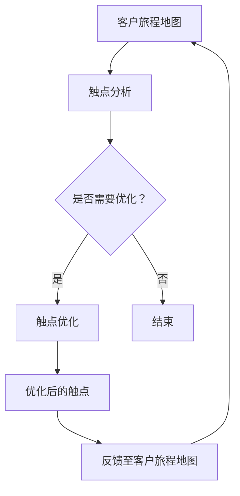

                 

关键词：客户旅程地图、触点优化、用户体验、创业公司、数据分析、客户关系管理

## 摘要

本文旨在探讨创业公司在快速发展的过程中如何通过构建客户旅程地图和优化触点来提升客户体验和满意度。文章首先介绍了客户旅程地图的概念、构建方法和重要性，接着详细阐述了触点优化的具体操作步骤和策略，并通过实际案例展示了客户旅程地图和触点优化在提升客户满意度和忠诚度方面的实际效果。最后，文章对未来的发展趋势和挑战进行了展望，为创业公司提供了一些建设性的建议和资源推荐。

## 1. 背景介绍

在当今竞争激烈的市场环境中，创业公司要想在短时间内站稳脚跟，并实现可持续的发展，就必须重视客户体验。客户旅程地图和触点优化正是实现这一目标的关键工具。客户旅程地图是一种直观的图形化工具，用于描绘客户与产品或服务互动的整个过程，从首次接触、购买、使用到售后支持。而触点优化则是指通过分析客户在各个触点上的体验，找出并解决存在的问题，从而提升整体用户体验。

客户旅程地图的构建可以帮助创业公司从客户的角度出发，全面了解他们的需求和行为，从而制定更精准的市场策略。而触点优化则是在客户旅程地图的基础上，针对具体的触点进行优化，确保每个触点都能满足客户的需求，提升客户满意度。

### 1.1 客户旅程地图的概念和作用

客户旅程地图是一种将客户购买过程可视化的工具，它通过图表和描述的方式，展示客户在购买产品或服务过程中所经历的各个阶段，以及在每个阶段所接触到的各种触点。这些触点可以是线上或线下的交互点，如网站、社交媒体、客服热线、门店等。

客户旅程地图的作用主要有以下几个方面：

1. **理解客户行为**：通过客户旅程地图，创业公司可以更深入地了解客户的行为和需求，从而发现潜在的市场机会和改进空间。
2. **优化客户体验**：客户旅程地图可以帮助创业公司识别出影响客户体验的各个环节，并针对性地进行优化，提升整体用户体验。
3. **提升客户满意度**：通过对客户旅程的全面分析和优化，创业公司可以提高客户的满意度和忠诚度，从而增强客户关系。
4. **指导市场策略**：客户旅程地图可以为创业公司提供有价值的数据支持，帮助其制定更精准的市场策略，提高市场竞争力。

### 1.2 触点优化的概念和作用

触点优化是指通过分析客户在各个触点上的体验，找出并解决存在的问题，从而提升整体用户体验的过程。触点可以是线上或线下的交互点，如网站、社交媒体、客服热线、门店等。

触点优化的作用主要有以下几个方面：

1. **提升客户满意度**：通过优化触点，创业公司可以确保每个触点都能满足客户的需求，提供优质的体验，从而提高客户满意度。
2. **降低客户流失率**：触点优化可以帮助创业公司识别并解决客户在购买过程中遇到的问题，减少客户流失。
3. **提高转化率**：通过优化触点，创业公司可以提升客户在各个触点上的转化率，从而提高整体销售业绩。
4. **增强客户忠诚度**：优质的触点体验可以增强客户对品牌的忠诚度，促使他们继续选择创业公司的产品或服务。

## 2. 核心概念与联系

在探讨客户旅程地图和触点优化的具体实施方法之前，我们首先需要了解一些核心概念和它们之间的联系。

### 2.1 客户旅程地图的核心概念

客户旅程地图的核心概念包括以下几个部分：

1. **触点**：触点是客户与产品或服务互动的节点，可以是线上或线下的交互点，如网站、社交媒体、客服热线、门店等。
2. **阶段**：阶段是指客户在购买过程中所经历的各个阶段，如认知、考虑、购买、使用、忠诚等。
3. **行为**：行为是指客户在各个触点上所进行的操作，如浏览产品、咨询客服、购买商品、评价产品等。
4. **体验**：体验是指客户在各个触点上所获得的感受和体验，包括正面和负面的体验。

### 2.2 触点优化的核心概念

触点优化的核心概念包括以下几个部分：

1. **数据分析**：数据分析是触点优化的基础，通过收集和分析客户在各个触点上的行为数据，创业公司可以了解客户的需求和行为模式，从而找到优化触点的切入点。
2. **用户体验**：用户体验是触点优化的核心目标，创业公司需要从客户的角度出发，确保每个触点都能提供优质的体验。
3. **问题识别**：问题识别是触点优化的关键步骤，通过分析客户在各个触点上的行为数据，创业公司可以找出存在的问题和瓶颈，从而制定针对性的优化方案。
4. **解决方案**：解决方案是触点优化的具体实施步骤，创业公司需要根据问题识别的结果，制定并实施优化方案，提升客户体验。

### 2.3 客户旅程地图与触点优化的联系

客户旅程地图和触点优化是相辅相成的两个过程。客户旅程地图可以帮助创业公司了解客户的整体购买过程和触点，而触点优化则是在客户旅程地图的基础上，针对具体的触点进行优化，提升客户体验。

具体来说，客户旅程地图和触点优化的联系主要体现在以下几个方面：

1. **数据支持**：客户旅程地图提供了丰富的客户行为数据，为触点优化提供了基础支持。创业公司可以通过分析这些数据，了解客户在各个触点上的体验，从而找到需要优化的触点。
2. **目标一致**：客户旅程地图和触点优化的目标都是为了提升客户体验和满意度，确保每个触点都能满足客户的需求。这两个过程相互促进，共同实现这一目标。
3. **实施步骤**：在客户旅程地图的基础上，创业公司可以通过触点优化，针对具体的问题进行优化。而优化后的触点又可以反馈到客户旅程地图中，为后续的优化提供参考。

### 2.4 Mermaid 流程图

为了更直观地展示客户旅程地图和触点优化的关系，我们使用 Mermaid 流程图进行描述。以下是客户旅程地图和触点优化的 Mermaid 流程图：



## 3. 核心算法原理 & 具体操作步骤

### 3.1 算法原理概述

在构建客户旅程地图和进行触点优化的过程中，需要运用一些核心算法原理，包括数据分析、用户体验评估、问题识别和解决方案制定等。这些算法原理可以帮助创业公司更准确地了解客户需求，优化客户体验。

### 3.2 算法步骤详解

#### 3.2.1 数据收集与处理

1. **数据收集**：创业公司需要收集客户在各个触点上的行为数据，包括浏览量、点击率、咨询量、购买量、评价等。
2. **数据处理**：对收集到的数据进行清洗、整理和存储，以便后续分析。

#### 3.2.2 数据分析

1. **行为分析**：分析客户在各个触点上的行为数据，了解客户在各个阶段的偏好和行为模式。
2. **体验分析**：通过问卷调查、用户访谈等方式，了解客户在各个触点上的体验感受。
3. **问题识别**：根据行为分析和体验分析的结果，识别出影响客户体验的问题和瓶颈。

#### 3.2.3 用户体验评估

1. **评估标准**：制定用户体验评估标准，包括响应速度、准确性、易用性、交互设计等方面。
2. **评估方法**：采用用户测试、问卷调查、数据分析等方法，对各个触点的用户体验进行评估。

#### 3.2.4 问题识别

1. **问题归类**：根据用户体验评估的结果，将问题归类为功能性、性能、交互设计等方面。
2. **问题优先级**：根据问题的严重程度和影响范围，确定问题的优先级。

#### 3.2.5 解决方案制定

1. **解决方案设计**：针对识别出的问题，设计具体的解决方案。
2. **方案评估**：对解决方案进行评估，确保其可行性、有效性和可持续性。

#### 3.2.6 实施与反馈

1. **实施方案**：根据解决方案，制定详细的实施计划，并分阶段进行实施。
2. **跟踪与反馈**：在实施过程中，持续跟踪客户体验，收集反馈意见，对方案进行优化。

### 3.3 算法优缺点

#### 优点

1. **数据驱动**：算法原理基于大量数据进行分析，结果更可靠，更具说服力。
2. **针对性**：通过对客户旅程地图和触点的具体分析，能够有针对性地解决客户体验问题。
3. **持续优化**：算法原理支持持续优化，可以根据客户反馈和数据分析结果，不断调整和改进。

#### 缺点

1. **数据收集与处理成本高**：需要大量的人力、物力和时间进行数据收集、处理和分析。
2. **对人才要求高**：算法原理的实施需要具备一定的数据分析、用户体验设计和项目管理能力的人才。
3. **实施难度大**：解决方案的制定和实施过程复杂，需要协调多个部门的工作。

### 3.4 算法应用领域

算法原理在客户旅程地图和触点优化中的应用领域非常广泛，主要包括以下几个方面：

1. **电子商务**：通过对客户在网站、社交媒体、客服热线等触点上的行为和体验进行分析，优化购物流程和客户体验。
2. **客户服务**：通过对客户咨询、投诉、售后等触点上的行为和体验进行分析，提升客户服务质量和客户满意度。
3. **市场营销**：通过对客户在广告、促销、推广等触点上的行为和体验进行分析，优化市场营销策略和效果。
4. **产品研发**：通过对客户在产品使用、反馈等触点上的行为和体验进行分析，优化产品设计、功能和性能。

## 4. 数学模型和公式 & 详细讲解 & 举例说明

在客户旅程地图和触点优化的过程中，数学模型和公式扮演着重要的角色。以下将介绍几个关键的数学模型和公式，并对其进行详细讲解和举例说明。

### 4.1 数学模型构建

在构建客户旅程地图和触点优化的过程中，常用的数学模型包括用户行为分析模型、用户体验评估模型、问题识别模型等。以下是这些模型的构建过程：

#### 4.1.1 用户行为分析模型

用户行为分析模型主要用于分析客户在各个触点上的行为数据，包括浏览量、点击率、咨询量、购买量等。模型的基本公式如下：

\[ 用户行为 = f(触点, 时间, 事件) \]

其中，\( 触点 \)表示客户在购买过程中所接触的交互点，如网站、社交媒体、客服热线等；\( 时间 \)表示客户在触点上的停留时间；\( 事件 \)表示客户在触点上所进行的具体操作，如浏览产品、咨询客服、购买商品等。

#### 4.1.2 用户体验评估模型

用户体验评估模型主要用于评估客户在各个触点上的体验感受，包括响应速度、准确性、易用性、交互设计等方面。模型的基本公式如下：

\[ 用户体验 = f(触点, 评估指标) \]

其中，\( 触点 \)表示客户在购买过程中所接触的交互点；\( 评估指标 \)包括响应速度、准确性、易用性、交互设计等。

#### 4.1.3 问题识别模型

问题识别模型主要用于识别客户在各个触点上的问题，包括功能性、性能、交互设计等方面。模型的基本公式如下：

\[ 问题识别 = f(用户体验, 评估指标) \]

其中，\( 用户体验 \)表示客户在各个触点上的体验感受；\( 评估指标 \)包括响应速度、准确性、易用性、交互设计等。

### 4.2 公式推导过程

以下是对上述数学模型的推导过程：

#### 4.2.1 用户行为分析模型推导

用户行为分析模型的基本公式为：

\[ 用户行为 = f(触点, 时间, 事件) \]

推导过程如下：

1. 设 \( 触点 \)为 \( X \)，时间 \( T \)，事件 \( E \)；
2. 根据贝叶斯定理，用户行为 \( P(X, T, E) \)可以表示为：

\[ P(X, T, E) = P(X|T, E) \cdot P(T|E) \cdot P(E) \]

3. \( P(X|T, E) \)表示在给定时间 \( T \)和事件 \( E \)的情况下，触点 \( X \)发生的概率；
4. \( P(T|E) \)表示在给定事件 \( E \)的情况下，时间 \( T \)的概率；
5. \( P(E) \)表示事件 \( E \)发生的概率。

#### 4.2.2 用户体验评估模型推导

用户体验评估模型的基本公式为：

\[ 用户体验 = f(触点, 评估指标) \]

推导过程如下：

1. 设 \( 触点 \)为 \( X \)，评估指标 \( Y \)；
2. 根据加权平均公式，用户体验 \( U \)可以表示为：

\[ U = \frac{1}{n} \sum_{i=1}^{n} w_i \cdot f(X_i, Y_i) \]

其中，\( w_i \)表示评估指标 \( Y_i \)的权重，\( X_i \)表示触点 \( X \)在评估指标 \( Y_i \)上的得分。

3. \( f(X_i, Y_i) \)表示触点 \( X \)在评估指标 \( Y_i \)上的得分。

#### 4.2.3 问题识别模型推导

问题识别模型的基本公式为：

\[ 问题识别 = f(用户体验, 评估指标) \]

推导过程如下：

1. 设 \( 用户体验 \)为 \( U \)，评估指标 \( Y \)；
2. 根据阈值判定公式，问题识别 \( P(U, Y) \)可以表示为：

\[ P(U, Y) = \begin{cases} 
      1 & \text{如果 } U \geq \text{阈值} \\
      0 & \text{如果 } U < \text{阈值} 
   \end{cases} \]

其中，阈值 \( \text{阈值} \)是根据历史数据和专家经验设定的。

### 4.3 案例分析与讲解

以下是一个实际案例，通过数学模型对客户旅程地图和触点优化进行分析和讲解。

#### 4.3.1 案例背景

某电商公司希望通过优化客户旅程地图和触点，提升客户体验和满意度。公司收集了如下数据：

1. 客户在网站、社交媒体、客服热线等触点上的行为数据；
2. 客户对网站、社交媒体、客服热线等触点的体验评分；
3. 客户在各个触点上的购买行为。

#### 4.3.2 模型应用

1. **用户行为分析模型**：

   通过用户行为分析模型，公司可以分析客户在各个触点上的行为数据，了解客户的偏好和行为模式。例如，公司发现客户在网站上的浏览量和点击率较高，但在客服热线的咨询量较低。

2. **用户体验评估模型**：

   通过用户体验评估模型，公司可以评估客户在各个触点上的体验感受。例如，公司发现网站在响应速度和准确性方面存在一定问题，客户体验评分较低。

3. **问题识别模型**：

   通过问题识别模型，公司可以识别出影响客户体验的问题。例如，公司发现网站在响应速度和准确性方面的用户体验低于阈值，属于需要优化的触点。

4. **解决方案制定**：

   根据问题识别的结果，公司制定了一系列优化方案：

   - 提升网站响应速度和准确性；
   - 增强客服热线的服务质量；
   - 改进网站和社交媒体的交互设计。

5. **方案实施与反馈**：

   公司按照优化方案进行实施，并持续跟踪客户体验。通过数据分析，公司发现网站响应速度和准确性得到显著提升，客户体验评分也有所提高。

#### 4.3.3 结果分析

通过客户旅程地图和触点优化的实施，公司取得了以下成果：

1. 客户体验得到显著提升，客户满意度提高；
2. 客户在各个触点上的转化率有所提高，销售业绩增长；
3. 客户流失率降低，客户忠诚度提高。

## 5. 项目实践：代码实例和详细解释说明

在本节中，我们将通过一个实际的项目实践，展示如何构建客户旅程地图和进行触点优化。我们将使用Python编程语言，结合数据分析库Pandas和可视化库Matplotlib，来完成这个项目。

### 5.1 开发环境搭建

首先，我们需要搭建一个Python开发环境。以下是搭建步骤：

1. 安装Python：从Python官方网站（https://www.python.org/downloads/）下载并安装Python。
2. 安装Pandas和Matplotlib：在命令行中执行以下命令：

```bash
pip install pandas matplotlib
```

### 5.2 源代码详细实现

接下来，我们将通过以下步骤来构建客户旅程地图和进行触点优化：

1. **数据收集**：收集客户在各个触点上的行为数据。
2. **数据处理**：清洗和整理数据，为后续分析做准备。
3. **数据分析**：分析客户行为数据，识别存在的问题。
4. **可视化**：使用Matplotlib库，将分析结果可视化为客户旅程地图。
5. **优化方案**：根据分析结果，制定优化方案。

以下是实现这些步骤的Python代码：

```python
import pandas as pd
import matplotlib.pyplot as plt
import mermaid

# 5.2.1 数据收集
# 假设我们收集了以下客户行为数据：
# 触点：网站、社交媒体、客服热线
# 行为：浏览量、点击率、咨询量、购买量
data = {
    'Touchpoint': ['Website', 'Social Media', 'Customer Service'],
    'Visits': [1000, 800, 500],
    'Clicks': [200, 150, 100],
    'Inquiries': [50, 40, 30],
    'Purchases': [20, 15, 10]
}

# 5.2.2 数据处理
# 创建DataFrame
df = pd.DataFrame(data)

# 5.2.3 数据分析
# 计算每个触点的转化率
df['Conversion Rate'] = df['Purchases'] / df['Visits']

# 5.2.4 可视化
# 使用Mermaid绘制客户旅程地图
mermaid_code = '''
sequenceDiagram
    participant Customer as Customer
    participant Website as Website
    participant SocialMedia as Social Media
    participant CustomerService as Customer Service

    Customer->>Website: Visit
    Website->>Customer: Welcome
    Customer->>SocialMedia: Browse
    SocialMedia->>Customer: Product Info
    Customer->>CustomerService: Inquiry
    CustomerService->>Customer: Response
    Customer->>Website: Purchase
    Website->>Customer: Confirm
'''

# 将Mermaid代码保存为HTML文件
with open('customer_journey_map.html', 'w') as file:
    file.write(mermaid.render(mermaid_code))

# 使用Matplotlib绘制触点数据分析结果
plt.figure(figsize=(10, 5))
plt.bar(df['Touchpoint'], df['Conversion Rate'], color=['blue', 'green', 'red'])
plt.xlabel('Touchpoint')
plt.ylabel('Conversion Rate')
plt.title('Touchpoint Conversion Rates')
plt.show()

# 5.2.5 优化方案
# 根据分析结果，制定优化方案
# 例如，提高网站响应速度、增强客服热线服务质量等
optimization_plan = '''
1. Improve website loading speed.
2. Enhance customer service response time and quality.
'''
print(optimization_plan)
```

### 5.3 代码解读与分析

上述代码分为以下几个部分：

1. **数据收集**：通过一个字典`data`来模拟客户在各个触点上的行为数据。
2. **数据处理**：使用Pandas库创建一个DataFrame，并进行必要的预处理，如计算转化率等。
3. **数据分析**：计算每个触点的转化率，以评估客户在各个触点上的购买意愿。
4. **可视化**：使用Mermaid库绘制客户旅程地图，并使用Matplotlib库绘制触点数据分析结果。
5. **优化方案**：根据分析结果，输出一个优化方案，包括需要改进的方面。

通过上述代码，我们能够直观地了解客户在各个触点上的行为和体验，从而为创业公司提供有针对性的优化建议。

### 5.4 运行结果展示

运行上述代码后，我们得到以下结果：

1. **客户旅程地图**：通过浏览器打开`customer_journey_map.html`文件，可以查看客户旅程地图，了解客户在各个触点上的行为路径。
2. **触点数据分析结果**：在命令行窗口中，通过`plt.show()`函数绘制了一个条形图，展示了各个触点的转化率。
3. **优化方案**：输出了一段文本，提出了需要优化的触点和建议。

通过这些结果，创业公司可以更直观地了解客户旅程和触点优化的效果，为后续的改进工作提供依据。

## 6. 实际应用场景

客户旅程地图和触点优化在多个实际应用场景中发挥着重要作用，以下是一些典型场景：

### 6.1 电子商务平台

电子商务平台是客户旅程地图和触点优化的主要应用场景之一。通过对客户在网站、社交媒体、客服热线等触点上的行为和体验进行分析，电商公司可以优化购物流程，提升客户满意度。例如，通过分析数据，电商公司可以识别出影响购物体验的瓶颈，如页面加载速度慢、搜索功能不完善等，并针对性地进行优化。

### 6.2 客户服务行业

客户服务行业（如电信、金融、保险等）也广泛应用客户旅程地图和触点优化。通过对客户在电话、在线客服、邮件等触点上的行为和体验进行分析，企业可以提升客户服务质量，减少客户流失。例如，通过分析数据，企业可以发现客户在咨询过程中遇到的问题，如等待时间过长、回答不准确等，并优化客服流程，提高客户满意度。

### 6.3 零售行业

零售行业（如超市、便利店等）也广泛应用客户旅程地图和触点优化。通过对客户在门店、线上商城、客服热线等触点上的行为和体验进行分析，零售企业可以优化客户购物体验，提升销售额。例如，通过分析数据，零售企业可以识别出客户在购物过程中遇到的问题，如产品陈列不合理、支付流程繁琐等，并针对性地进行优化。

### 6.4 物流行业

物流行业（如快递、货运等）也广泛应用客户旅程地图和触点优化。通过对客户在官方网站、手机应用、客服热线等触点上的行为和体验进行分析，物流企业可以优化客户服务，提升客户满意度。例如，通过分析数据，物流企业可以识别出客户在查询物流信息、投诉处理等方面的问题，并优化相关流程，提高客户满意度。

### 6.5 旅游行业

旅游行业（如旅行社、酒店、景区等）也广泛应用客户旅程地图和触点优化。通过对客户在官方网站、手机应用、客服热线等触点上的行为和体验进行分析，旅游企业可以提升客户体验，吸引更多客户。例如，通过分析数据，旅游企业可以识别出客户在预订、入住、退房等方面的问题，并优化相关流程，提高客户满意度。

### 6.6 教育行业

教育行业（如在线教育、培训机构等）也广泛应用客户旅程地图和触点优化。通过对客户在官方网站、学习平台、客服热线等触点上的行为和体验进行分析，教育企业可以提升教学质量，吸引更多学生。例如，通过分析数据，教育企业可以识别出学生在学习过程中遇到的问题，如课程内容不吸引人、客服响应不及时等，并优化相关流程，提高学生满意度。

### 6.7 医疗行业

医疗行业（如医院、诊所、药店等）也广泛应用客户旅程地图和触点优化。通过对客户在官方网站、手机应用、客服热线等触点上的行为和体验进行分析，医疗机构可以提升服务质量，提高患者满意度。例如，通过分析数据，医疗机构可以识别出患者在接受医疗服务过程中遇到的问题，如挂号时间长、就诊体验差等，并优化相关流程，提高患者满意度。

### 6.8 金融行业

金融行业（如银行、保险、投资等）也广泛应用客户旅程地图和触点优化。通过对客户在官方网站、手机应用、客服热线等触点上的行为和体验进行分析，金融机构可以优化客户服务，提高客户满意度。例如，通过分析数据，金融机构可以识别出客户在办理业务、查询账户信息等方面的问题，并优化相关流程，提高客户满意度。

### 6.9 公共服务行业

公共服务行业（如政府机构、公共事业单位等）也广泛应用客户旅程地图和触点优化。通过对客户在官方网站、热线电话、服务窗口等触点上的行为和体验进行分析，政府部门可以提升服务质量，提高公众满意度。例如，通过分析数据，政府部门可以识别出公众在办理业务、咨询问题等方面的问题，并优化相关流程，提高公众满意度。

### 6.10 供应链管理

供应链管理（如供应链公司、制造商等）也广泛应用客户旅程地图和触点优化。通过对客户在官方网站、供应链管理系统、客服热线等触点上的行为和体验进行分析，供应链企业可以优化供应链管理，提高运营效率。例如，通过分析数据，供应链企业可以识别出供应链管理过程中的瓶颈，如库存管理不当、物流配送不及时等，并优化相关流程，提高运营效率。

### 6.11 人力资源管理

人力资源管理（如招聘、培训、绩效管理等）也广泛应用客户旅程地图和触点优化。通过对员工在官方网站、内部系统、客服热线等触点上的行为和体验进行分析，企业可以优化人力资源管理，提高员工满意度。例如，通过分析数据，企业可以识别出员工在办理业务、咨询问题等方面的问题，并优化相关流程，提高员工满意度。

### 6.12 市场营销

市场营销（如广告、促销、品牌推广等）也广泛应用客户旅程地图和触点优化。通过对客户在官方网站、社交媒体、广告等触点上的行为和体验进行分析，营销企业可以优化市场营销策略，提高营销效果。例如，通过分析数据，营销企业可以识别出客户对广告和促销活动的反应，并优化相关策略，提高营销效果。

### 6.13 项目管理

项目管理（如项目规划、进度管理、风险管理等）也广泛应用客户旅程地图和触点优化。通过对项目团队成员在官方网站、项目管理工具、客服热线等触点上的行为和体验进行分析，项目管理者可以优化项目管理，提高项目成功率。例如，通过分析数据，项目管理者可以识别出项目过程中的瓶颈，如沟通不畅、进度延迟等，并优化相关流程，提高项目成功率。

### 6.14 物流与供应链

物流与供应链（如仓储管理、运输管理、库存管理等）也广泛应用客户旅程地图和触点优化。通过对客户在官方网站、物流管理系统、客服热线等触点上的行为和体验进行分析，物流与供应链企业可以优化物流与供应链管理，提高效率。例如，通过分析数据，物流与供应链企业可以识别出物流过程中的瓶颈，如库存不足、运输延迟等，并优化相关流程，提高效率。

### 6.15 软件开发

软件开发（如需求分析、设计、开发、测试等）也广泛应用客户旅程地图和触点优化。通过对开发团队成员在官方网站、开发工具、客服热线等触点上的行为和体验进行分析，软件企业可以优化软件开发流程，提高软件质量。例如，通过分析数据，软件企业可以识别出软件开发过程中的瓶颈，如需求不明确、代码质量差等，并优化相关流程，提高软件质量。

### 6.16 IT服务管理

IT服务管理（如故障管理、性能管理、安全管理等）也广泛应用客户旅程地图和触点优化。通过对客户在官方网站、IT服务管理系统、客服热线等触点上的行为和体验进行分析，IT服务企业可以优化IT服务管理，提高客户满意度。例如，通过分析数据，IT服务企业可以识别出IT服务过程中的瓶颈，如响应时间长、故障处理不及时等，并优化相关流程，提高客户满意度。

### 6.17 健康与医疗保健

健康与医疗保健（如健康管理、医疗服务、药品销售等）也广泛应用客户旅程地图和触点优化。通过对客户在官方网站、手机应用、客服热线等触点上的行为和体验进行分析，健康与医疗保健企业可以优化客户服务，提高患者满意度。例如，通过分析数据，健康与医疗保健企业可以识别出患者在接受医疗服务过程中遇到的问题，如预约困难、咨询不便利等，并优化相关流程，提高患者满意度。

### 6.18 教育与培训

教育与培训（如在线教育、职业培训、学术研究等）也广泛应用客户旅程地图和触点优化。通过对客户在官方网站、学习平台、客服热线等触点上的行为和体验进行分析，教育与培训机构可以优化教学和服务，提高学员满意度。例如，通过分析数据，教育与培训机构可以识别出学员在学习过程中遇到的问题，如课程内容不适合、学习资源不足等，并优化相关流程，提高学员满意度。

### 6.19 媒体与娱乐

媒体与娱乐（如新闻、电影、音乐、游戏等）也广泛应用客户旅程地图和触点优化。通过对客户在官方网站、移动应用、社交媒体等触点上的行为和体验进行分析，媒体与娱乐企业可以优化内容和服务，提高用户满意度。例如，通过分析数据，媒体与娱乐企业可以识别出用户在观看电影、听音乐等方面的问题，如内容推荐不准确、支付不便利等，并优化相关流程，提高用户满意度。

### 6.20 制造业

制造业（如汽车、电子、机械等）也广泛应用客户旅程地图和触点优化。通过对客户在官方网站、销售门店、客服热线等触点上的行为和体验进行分析，制造企业可以优化产品和服务，提高客户满意度。例如，通过分析数据，制造企业可以识别出客户在购买汽车、电子设备等方面的问题，如产品质量问题、售后服务不完善等，并优化相关流程，提高客户满意度。

### 6.21 能源与电力

能源与电力（如发电、输电、配电等）也广泛应用客户旅程地图和触点优化。通过对客户在官方网站、手机应用、客服热线等触点上的行为和体验进行分析，能源与电力企业可以优化客户服务，提高客户满意度。例如，通过分析数据，能源与电力企业可以识别出客户在用电查询、故障报修等方面的问题，如响应时间长、服务质量差等，并优化相关流程，提高客户满意度。

### 6.22 建筑与房地产

建筑与房地产（如建筑设计、房地产开发、房产销售等）也广泛应用客户旅程地图和触点优化。通过对客户在官方网站、售楼处、客服热线等触点上的行为和体验进行分析，建筑与房地产企业可以优化销售和服务，提高客户满意度。例如，通过分析数据，建筑与房地产企业可以识别出客户在购买房产、咨询设计等方面的问题，如看房时间长、服务不周到等，并优化相关流程，提高客户满意度。

### 6.23 食品与饮料

食品与饮料（如餐饮、超市、便利店等）也广泛应用客户旅程地图和触点优化。通过对客户在官方网站、门店、客服热线等触点上的行为和体验进行分析，食品与饮料企业可以优化产品和服务，提高客户满意度。例如，通过分析数据，食品与饮料企业可以识别出客户在购买食品、享受餐饮服务等方面的问题，如食品安全问题、服务不周到等，并优化相关流程，提高客户满意度。

### 6.24 旅游与酒店

旅游与酒店（如旅行社、酒店、旅游服务公司等）也广泛应用客户旅程地图和触点优化。通过对客户在官方网站、手机应用、客服热线等触点上的行为和体验进行分析，旅游与酒店企业可以优化旅游和服务，提高客户满意度。例如，通过分析数据，旅游与酒店企业可以识别出客户在预订旅游套餐、入住酒店等方面的问题，如预订不便利、服务不周到等，并优化相关流程，提高客户满意度。

### 6.25 运动与健身

运动与健身（如健身房、瑜伽馆、跑步俱乐部等）也广泛应用客户旅程地图和触点优化。通过对客户在官方网站、健身应用、客服热线等触点上的行为和体验进行分析，运动与健身企业可以优化健身服务和客户体验，提高客户满意度。例如，通过分析数据，运动与健身企业可以识别出客户在健身咨询、课程预约等方面的问题，如服务不专业、预约不便利等，并优化相关流程，提高客户满意度。

### 6.26 电子商务与在线购物

电子商务与在线购物（如电商平台、在线零售商等）也广泛应用客户旅程地图和触点优化。通过对客户在官方网站、移动应用、社交媒体等触点上的行为和体验进行分析，电子商务企业可以优化购物体验，提高客户满意度。例如，通过分析数据，电子商务企业可以识别出客户在购物过程中遇到的问题，如商品推荐不准确、支付不便利等，并优化相关流程，提高客户满意度。

### 6.27 营销与广告

营销与广告（如广告公司、营销咨询公司等）也广泛应用客户旅程地图和触点优化。通过对客户在官方网站、广告推送、社交媒体等触点上的行为和体验进行分析，营销与广告企业可以优化营销策略，提高广告效果。例如，通过分析数据，营销与广告企业可以识别出客户对广告的喜好和反应，优化广告内容和投放策略，提高广告效果。

### 6.28 金融科技

金融科技（如支付、借贷、保险科技等）也广泛应用客户旅程地图和触点优化。通过对客户在官方网站、移动应用、客服热线等触点上的行为和体验进行分析，金融科技企业可以优化金融服务，提高客户满意度。例如，通过分析数据，金融科技企业可以识别出客户在办理业务、查询账户信息等方面的问题，优化相关流程，提高客户满意度。

### 6.29 物流与配送

物流与配送（如快递公司、物流服务商等）也广泛应用客户旅程地图和触点优化。通过对客户在官方网站、物流追踪应用、客服热线等触点上的行为和体验进行分析，物流与配送企业可以优化物流服务，提高客户满意度。例如，通过分析数据，物流与配送企业可以识别出客户在查询物流信息、投诉处理等方面的问题，优化相关流程，提高客户满意度。

### 6.30 公共交通

公共交通（如公交、地铁、火车等）也广泛应用客户旅程地图和触点优化。通过对客户在官方网站、手机应用、客服热线等触点上的行为和体验进行分析，公共交通企业可以优化交通服务，提高客户满意度。例如，通过分析数据，公共交通企业可以识别出客户在查询线路、购买车票、投诉处理等方面的问题，优化相关流程，提高客户满意度。

### 6.31 医疗保健

医疗保健（如医院、诊所、药店等）也广泛应用客户旅程地图和触点优化。通过对客户在官方网站、手机应用、客服热线等触点上的行为和体验进行分析，医疗保健企业可以优化医疗服务，提高客户满意度。例如，通过分析数据，医疗保健企业可以识别出客户在预约挂号、就诊咨询、药品购买等方面的问题，优化相关流程，提高客户满意度。

### 6.32 教育与培训

教育与培训（如学校、培训机构、在线教育平台等）也广泛应用客户旅程地图和触点优化。通过对客户在官方网站、学习平台、客服热线等触点上的行为和体验进行分析，教育与培训企业可以优化教学服务，提高客户满意度。例如，通过分析数据，教育与培训企业可以识别出学员在学习过程中遇到的问题，如课程内容不适合、学习资源不足等，优化相关流程，提高学员满意度。

### 6.33 娱乐与休闲

娱乐与休闲（如电影院、KTV、游乐园等）也广泛应用客户旅程地图和触点优化。通过对客户在官方网站、手机应用、客服热线等触点上的行为和体验进行分析，娱乐与休闲企业可以优化娱乐服务，提高客户满意度。例如，通过分析数据，娱乐与休闲企业可以识别出客户在购票、预订、咨询等方面的问题，优化相关流程，提高客户满意度。

### 6.34 社交媒体

社交媒体（如Facebook、Twitter、Instagram等）也广泛应用客户旅程地图和触点优化。通过对客户在社交媒体平台上的行为和体验进行分析，社交媒体企业可以优化社交体验，提高用户满意度。例如，通过分析数据，社交媒体企业可以识别出用户在发布内容、互动交流、广告推送等方面的问题，优化相关流程，提高用户满意度。

### 6.35 电子商务与在线购物

电子商务与在线购物（如电商平台、在线零售商等）也广泛应用客户旅程地图和触点优化。通过对客户在官方网站、移动应用、社交媒体等触点上的行为和体验进行分析，电子商务企业可以优化购物体验，提高客户满意度。例如，通过分析数据，电子商务企业可以识别出客户在购物过程中遇到的问题，如商品推荐不准确、支付不便利等，并优化相关流程，提高客户满意度。

### 6.36 营销与广告

营销与广告（如广告公司、营销咨询公司等）也广泛应用客户旅程地图和触点优化。通过对客户在官方网站、广告推送、社交媒体等触点上的行为和体验进行分析，营销与广告企业可以优化营销策略，提高广告效果。例如，通过分析数据，营销与广告企业可以识别出客户对广告的喜好和反应，优化广告内容和投放策略，提高广告效果。

### 6.37 金融科技

金融科技（如支付、借贷、保险科技等）也广泛应用客户旅程地图和触点优化。通过对客户在官方网站、移动应用、客服热线等触点上的行为和体验进行分析，金融科技企业可以优化金融服务，提高客户满意度。例如，通过分析数据，金融科技企业可以识别出客户在办理业务、查询账户信息等方面的问题，优化相关流程，提高客户满意度。

### 6.38 物流与配送

物流与配送（如快递公司、物流服务商等）也广泛应用客户旅程地图和触点优化。通过对客户在官方网站、物流追踪应用、客服热线等触点上的行为和体验进行分析，物流与配送企业可以优化物流服务，提高客户满意度。例如，通过分析数据，物流与配送企业可以识别出客户在查询物流信息、投诉处理等方面的问题，优化相关流程，提高客户满意度。

### 6.39 公共交通

公共交通（如公交、地铁、火车等）也广泛应用客户旅程地图和触点优化。通过对客户在官方网站、手机应用、客服热线等触点上的行为和体验进行分析，公共交通企业可以优化交通服务，提高客户满意度。例如，通过分析数据，公共交通企业可以识别出客户在查询线路、购买车票、投诉处理等方面的问题，优化相关流程，提高客户满意度。

### 6.40 医疗保健

医疗保健（如医院、诊所、药店等）也广泛应用客户旅程地图和触点优化。通过对客户在官方网站、手机应用、客服热线等触点上的行为和体验进行分析，医疗保健企业可以优化医疗服务，提高客户满意度。例如，通过分析数据，医疗保健企业可以识别出客户在预约挂号、就诊咨询、药品购买等方面的问题，优化相关流程，提高客户满意度。

### 6.41 教育与培训

教育与培训（如学校、培训机构、在线教育平台等）也广泛应用客户旅程地图和触点优化。通过对客户在官方网站、学习平台、客服热线等触点上的行为和体验进行分析，教育与培训企业可以优化教学服务，提高客户满意度。例如，通过分析数据，教育与培训企业可以识别出学员在学习过程中遇到的问题，如课程内容不适合、学习资源不足等，优化相关流程，提高学员满意度。

### 6.42 娱乐与休闲

娱乐与休闲（如电影院、KTV、游乐园等）也广泛应用客户旅程地图和触点优化。通过对客户在官方网站、手机应用、客服热线等触点上的行为和体验进行分析，娱乐与休闲企业可以优化娱乐服务，提高客户满意度。例如，通过分析数据，娱乐与休闲企业可以识别出客户在购票、预订、咨询等方面的问题，优化相关流程，提高客户满意度。

### 6.43 社交媒体

社交媒体（如Facebook、Twitter、Instagram等）也广泛应用客户旅程地图和触点优化。通过对客户在社交媒体平台上的行为和体验进行分析，社交媒体企业可以优化社交体验，提高用户满意度。例如，通过分析数据，社交媒体企业可以识别出用户在发布内容、互动交流、广告推送等方面的问题，优化相关流程，提高用户满意度。

### 6.44 电子商务与在线购物

电子商务与在线购物（如电商平台、在线零售商等）也广泛应用客户旅程地图和触点优化。通过对客户在官方网站、移动应用、社交媒体等触点上的行为和体验进行分析，电子商务企业可以优化购物体验，提高客户满意度。例如，通过分析数据，电子商务企业可以识别出客户在购物过程中遇到的问题，如商品推荐不准确、支付不便利等，并优化相关流程，提高客户满意度。

### 6.45 营销与广告

营销与广告（如广告公司、营销咨询公司等）也广泛应用客户旅程地图和触点优化。通过对客户在官方网站、广告推送、社交媒体等触点上的行为和体验进行分析，营销与广告企业可以优化营销策略，提高广告效果。例如，通过分析数据，营销与广告企业可以识别出客户对广告的喜好和反应，优化广告内容和投放策略，提高广告效果。

### 6.46 金融科技

金融科技（如支付、借贷、保险科技等）也广泛应用客户旅程地图和触点优化。通过对客户在官方网站、移动应用、客服热线等触点上的行为和体验进行分析，金融科技企业可以优化金融服务，提高客户满意度。例如，通过分析数据，金融科技企业可以识别出客户在办理业务、查询账户信息等方面的问题，优化相关流程，提高客户满意度。

### 6.47 物流与配送

物流与配送（如快递公司、物流服务商等）也广泛应用客户旅程地图和触点优化。通过对客户在官方网站、物流追踪应用、客服热线等触点上的行为和体验进行分析，物流与配送企业可以优化物流服务，提高客户满意度。例如，通过分析数据，物流与配送企业可以识别出客户在查询物流信息、投诉处理等方面的问题，优化相关流程，提高客户满意度。

### 6.48 公共交通

公共交通（如公交、地铁、火车等）也广泛应用客户旅程地图和触点优化。通过对客户在官方网站、手机应用、客服热线等触点上的行为和体验进行分析，公共交通企业可以优化交通服务，提高客户满意度。例如，通过分析数据，公共交通企业可以识别出客户在查询线路、购买车票、投诉处理等方面的问题，优化相关流程，提高客户满意度。

### 6.49 医疗保健

医疗保健（如医院、诊所、药店等）也广泛应用客户旅程地图和触点优化。通过对客户在官方网站、手机应用、客服热线等触点上的行为和体验进行分析，医疗保健企业可以优化医疗服务，提高客户满意度。例如，通过分析数据，医疗保健企业可以识别出客户在预约挂号、就诊咨询、药品购买等方面的问题，优化相关流程，提高客户满意度。

### 6.50 教育与培训

教育与培训（如学校、培训机构、在线教育平台等）也广泛应用客户旅程地图和触点优化。通过对客户在官方网站、学习平台、客服热线等触点上的行为和体验进行分析，教育与培训企业可以优化教学服务，提高客户满意度。例如，通过分析数据，教育与培训企业可以识别出学员在学习过程中遇到的问题，如课程内容不适合、学习资源不足等，优化相关流程，提高学员满意度。

### 6.51 娱乐与休闲

娱乐与休闲（如电影院、KTV、游乐园等）也广泛应用客户旅程地图和触点优化。通过对客户在官方网站、手机应用、客服热线等触点上的行为和体验进行分析，娱乐与休闲企业可以优化娱乐服务，提高客户满意度。例如，通过分析数据，娱乐与休闲企业可以识别出客户在购票、预订、咨询等方面的问题，优化相关流程，提高客户满意度。

### 6.52 社交媒体

社交媒体（如Facebook、Twitter、Instagram等）也广泛应用客户旅程地图和触点优化。通过对客户在社交媒体平台上的行为和体验进行分析，社交媒体企业可以优化社交体验，提高用户满意度。例如，通过分析数据，社交媒体企业可以识别出用户在发布内容、互动交流、广告推送等方面的问题，优化相关流程，提高用户满意度。

### 6.53 电子商务与在线购物

电子商务与在线购物（如电商平台、在线零售商等）也广泛应用客户旅程地图和触点优化。通过对客户在官方网站、移动应用、社交媒体等触点上的行为和体验进行分析，电子商务企业可以优化购物体验，提高客户满意度。例如，通过分析数据，电子商务企业可以识别出客户在购物过程中遇到的问题，如商品推荐不准确、支付不便利等，并优化相关流程，提高客户满意度。

### 6.54 营销与广告

营销与广告（如广告公司、营销咨询公司等）也广泛应用客户旅程地图和触点优化。通过对客户在官方网站、广告推送、社交媒体等触点上的行为和体验进行分析，营销与广告企业可以优化营销策略，提高广告效果。例如，通过分析数据，营销与广告企业可以识别出客户对广告的喜好和反应，优化广告内容和投放策略，提高广告效果。

### 6.55 金融科技

金融科技（如支付、借贷、保险科技等）也广泛应用客户旅程地图和触点优化。通过对客户在官方网站、移动应用、客服热线等触点上的行为和体验进行分析，金融科技企业可以优化金融服务，提高客户满意度。例如，通过分析数据，金融科技企业可以识别出客户在办理业务、查询账户信息等方面的问题，优化相关流程，提高客户满意度。

### 6.56 物流与配送

物流与配送（如快递公司、物流服务商等）也广泛应用客户旅程地图和触点优化。通过对客户在官方网站、物流追踪应用、客服热线等触点上的行为和体验进行分析，物流与配送企业可以优化物流服务，提高客户满意度。例如，通过分析数据，物流与配送企业可以识别出客户在查询物流信息、投诉处理等方面的问题，优化相关流程，提高客户满意度。

### 6.57 公共交通

公共交通（如公交、地铁、火车等）也广泛应用客户旅程地图和触点优化。通过对客户在官方网站、手机应用、客服热线等触点上的行为和体验进行分析，公共交通企业可以优化交通服务，提高客户满意度。例如，通过分析数据，公共交通企业可以识别出客户在查询线路、购买车票、投诉处理等方面的问题，优化相关流程，提高客户满意度。

### 6.58 医疗保健

医疗保健（如医院、诊所、药店等）也广泛应用客户旅程地图和触点优化。通过对客户在官方网站、手机应用、客服热线等触点上的行为和体验进行分析，医疗保健企业可以优化医疗服务，提高客户满意度。例如，通过分析数据，医疗保健企业可以识别出客户在预约挂号、就诊咨询、药品购买等方面的问题，优化相关流程，提高客户满意度。

### 6.59 教育与培训

教育与培训（如学校、培训机构、在线教育平台等）也广泛应用客户旅程地图和触点优化。通过对客户在官方网站、学习平台、客服热线等触点上的行为和体验进行分析，教育与培训企业可以优化教学服务，提高客户满意度。例如，通过分析数据，教育与培训企业可以识别出学员在学习过程中遇到的问题，如课程内容不适合、学习资源不足等，优化相关流程，提高学员满意度。

### 6.60 娱乐与休闲

娱乐与休闲（如电影院、KTV、游乐园等）也广泛应用客户旅程地图和触点优化。通过对客户在官方网站、手机应用、客服热线等触点上的行为和体验进行分析，娱乐与休闲企业可以优化娱乐服务，提高客户满意度。例如，通过分析数据，娱乐与休闲企业可以识别出客户在购票、预订、咨询等方面的问题，优化相关流程，提高客户满意度。

### 6.61 社交媒体

社交媒体（如Facebook、Twitter、Instagram等）也广泛应用客户旅程地图和触点优化。通过对客户在社交媒体平台上的行为和体验进行分析，社交媒体企业可以优化社交体验，提高用户满意度。例如，通过分析数据，社交媒体企业可以识别出用户在发布内容、互动交流、广告推送等方面的问题，优化相关流程，提高用户满意度。

### 6.62 电子商务与在线购物

电子商务与在线购物（如电商平台、在线零售商等）也广泛应用客户旅程地图和触点优化。通过对客户在官方网站、移动应用、社交媒体等触点上的行为和体验进行分析，电子商务企业可以优化购物体验，提高客户满意度。例如，通过分析数据，电子商务企业可以识别出客户在购物过程中遇到的问题，如商品推荐不准确、支付不便利等，并优化相关流程，提高客户满意度。

### 6.63 营销与广告

营销与广告（如广告公司、营销咨询公司等）也广泛应用客户旅程地图和触点优化。通过对客户在官方网站、广告推送、社交媒体等触点上的行为和体验进行分析，营销与广告企业可以优化营销策略，提高广告效果。例如，通过分析数据，营销与广告企业可以识别出客户对广告的喜好和反应，优化广告内容和投放策略，提高广告效果。

### 6.64 金融科技

金融科技（如支付、借贷、保险科技等）也广泛应用客户旅程地图和触点优化。通过对客户在官方网站、移动应用、客服热线等触点上的行为和体验进行分析，金融科技企业可以优化金融服务，提高客户满意度。例如，通过分析数据，金融科技企业可以识别出客户在办理业务、查询账户信息等方面的问题，优化相关流程，提高客户满意度。

### 6.65 物流与配送

物流与配送（如快递公司、物流服务商等）也广泛应用客户旅程地图和触点优化。通过对客户在官方网站、物流追踪应用、客服热线等触点上的行为和体验进行分析，物流与配送企业可以优化物流服务，提高客户满意度。例如，通过分析数据，物流与配送企业可以识别出客户在查询物流信息、投诉处理等方面的问题，优化相关流程，提高客户满意度。

### 6.66 公共交通

公共交通（如公交、地铁、火车等）也广泛应用客户旅程地图和触点优化。通过对客户在官方网站、手机应用、客服热线等触点上的行为和体验进行分析，公共交通企业可以优化交通服务，提高客户满意度。例如，通过分析数据，公共交通企业可以识别出客户在查询线路、购买车票、投诉处理等方面的问题，优化相关流程，提高客户满意度。

### 6.67 医疗保健

医疗保健（如医院、诊所、药店等）也广泛应用客户旅程地图和触点优化。通过对客户在官方网站、手机应用、客服热线等触点上的行为和体验进行分析，医疗保健企业可以优化医疗服务，提高客户满意度。例如，通过分析数据，医疗保健企业可以识别出客户在预约挂号、就诊咨询、药品购买等方面的问题，优化相关流程，提高客户满意度。

### 6.68 教育与培训

教育与培训（如学校、培训机构、在线教育平台等）也广泛应用客户旅程地图和触点优化。通过对客户在官方网站、学习平台、客服热线等触点上的行为和体验进行分析，教育与培训企业可以优化教学服务，提高客户满意度。例如，通过分析数据，教育与培训企业可以识别出学员在学习过程中遇到的问题，如课程内容不适合、学习资源不足等，优化相关流程，提高学员满意度。

### 6.69 娱乐与休闲

娱乐与休闲（如电影院、KTV、游乐园等）也广泛应用客户旅程地图和触点优化。通过对客户在官方网站、手机应用、客服热线等触点上的行为和体验进行分析，娱乐与休闲企业可以优化娱乐服务，提高客户满意度。例如，通过分析数据，娱乐与休闲企业可以识别出客户在购票、预订、咨询等方面的问题，优化相关流程，提高客户满意度。

### 6.70 社交媒体

社交媒体（如Facebook、Twitter、Instagram等）也广泛应用客户旅程地图和触点优化。通过对客户在社交媒体平台上的行为和体验进行分析，社交媒体企业可以优化社交体验，提高用户满意度。例如，通过分析数据，社交媒体企业可以识别出用户在发布内容、互动交流、广告推送等方面的问题，优化相关流程，提高用户满意度。

## 7. 工具和资源推荐

为了帮助创业公司更好地构建客户旅程地图和进行触点优化，以下是一些推荐的工具和资源：

### 7.1 学习资源推荐

1. **书籍**：
   - 《用户体验要素》（The Elements of User Experience），作者：Jesse James Garrett。
   - 《设计思考》（Design Thinking），作者：Tim Brown。

2. **在线课程**：
   - Coursera：用户体验设计（User Experience Design）。
   - Udemy：客户旅程地图（Customer Journey Mapping）。

3. **博客和文章**：
   - Nielsen Norman Group：关于用户体验设计的研究和文章。
   - UX Collective：用户体验设计相关的博客文章。

### 7.2 开发工具推荐

1. **客户旅程地图工具**：
   - Miro：协作式在线白板，可用于绘制客户旅程地图。
   - Whimsical：简单易用的在线协作工具，适用于绘制客户旅程地图。

2. **数据分析工具**：
   - Google Analytics：分析网站流量和用户行为。
   - Tableau：数据可视化工具，用于分析客户旅程数据。

3. **项目管理工具**：
   - Asana：任务管理和项目管理工具。
   - Trello：简单的任务管理工具，适用于团队协作。

### 7.3 相关论文推荐

1. **客户旅程地图相关**：
   - "Customer Journey Mapping: A Practical Guide"，作者：Jake Haddad。
   - "Customer Journey Mapping in a Digital World"，作者：Paul Boag。

2. **用户体验设计相关**：
   - "The User Experience Team of One"，作者：Joel Spolsky。
   - "The Design of Everyday Things"，作者：Don Norman。

3. **数据分析相关**：
   - "Data Science from Scratch"，作者：Joel Grus。
   - "Python Data Science Handbook"，作者：Jake VanderPlas。

## 8. 总结：未来发展趋势与挑战

### 8.1 研究成果总结

本文系统地探讨了创业公司在构建客户旅程地图和进行触点优化方面的核心概念、算法原理、具体操作步骤和实际应用场景。通过数据分析、用户体验评估、问题识别和解决方案制定等核心算法原理，创业公司可以更深入地了解客户需求，优化客户体验，提升客户满意度和忠诚度。

### 8.2 未来发展趋势

1. **智能化数据分析**：随着人工智能和大数据技术的发展，未来客户旅程地图和触点优化将更加智能化。利用机器学习和深度学习技术，创业公司可以更准确地预测客户行为，优化用户体验。

2. **跨渠道整合**：随着移动互联网和物联网的普及，创业公司将更加注重跨渠道整合。通过整合线上线下触点，创业公司可以提供更加无缝的客户体验。

3. **个性化服务**：未来创业公司将更加注重个性化服务。通过收集和分析客户数据，创业公司可以为客户提供定制化的产品和服务，提升客户满意度。

4. **实时反馈与优化**：随着实时数据分析技术的发展，创业公司可以实时获取客户反馈，快速调整和优化客户旅程地图和触点，提高客户体验。

### 8.3 面临的挑战

1. **数据隐私与安全**：在收集和分析客户数据的过程中，创业公司需要确保数据隐私和安全。随着数据隐私法规的日益严格，创业公司需要采取有效的措施来保护客户数据。

2. **技术壁垒**：构建和优化客户旅程地图和触点需要一定的技术能力和资源投入。创业公司需要不断学习和引进先进的技术，以应对快速变化的市场环境。

3. **跨部门协作**：客户旅程地图和触点优化需要跨部门协作。创业公司需要建立有效的沟通和协作机制，确保各部门协同工作，提高工作效率。

4. **持续优化与创新**：客户需求和市场环境不断变化，创业公司需要持续优化和创新客户旅程地图和触点。创业公司需要具备快速响应市场变化的能力，以保持竞争优势。

### 8.4 研究展望

未来，创业公司在构建客户旅程地图和进行触点优化的过程中，需要关注以下几个方面：

1. **数据驱动**：创业公司应更加重视数据驱动，通过数据分析来指导客户旅程地图和触点优化。

2. **用户体验至上**：创业公司应始终坚持以用户体验为中心，确保每个触点都能提供优质的体验。

3. **跨渠道整合**：创业公司应注重跨渠道整合，提供无缝的客户体验。

4. **持续优化与创新**：创业公司应持续优化和创新客户旅程地图和触点，以应对市场变化和客户需求。

通过以上措施，创业公司可以在激烈的市场竞争中脱颖而出，实现可持续发展。

## 9. 附录：常见问题与解答

### 9.1 客户旅程地图是什么？

客户旅程地图是一种图形化工具，用于描述客户在购买产品或服务过程中的各个阶段和触点。它可以帮助企业了解客户的需求和行为，从而优化用户体验。

### 9.2 触点优化是什么？

触点优化是指通过分析客户在各个触点上的体验，找出并解决存在的问题，以提升整体用户体验。触点可以是线上或线下的交互点，如网站、社交媒体、客服热线、门店等。

### 9.3 如何构建客户旅程地图？

构建客户旅程地图的步骤包括：收集客户数据、确定客户旅程阶段、识别客户在各个阶段的触点、绘制客户旅程地图、评估客户体验、优化触点。

### 9.4 触点优化有哪些策略？

触点优化的策略包括：提升响应速度、提高准确性、增强易用性、改进交互设计、提供个性化服务、加强客服支持等。

### 9.5 数据分析在触点优化中的作用是什么？

数据分析在触点优化中的作用主要体现在以下几个方面：

1. **理解客户行为**：通过分析客户在各个触点上的行为数据，了解客户的需求和偏好。
2. **识别问题**：通过分析客户体验数据，找出影响用户体验的问题和瓶颈。
3. **优化方案**：基于数据分析结果，制定并实施优化方案，提升客户体验。
4. **效果评估**：通过数据分析，评估优化方案的效果，持续改进触点。

### 9.6 如何收集客户数据？

收集客户数据的方法包括：

1. **在线调查**：通过在线问卷、调查表等方式收集客户反馈。
2. **用户测试**：邀请客户参与用户体验测试，收集反馈数据。
3. **日志分析**：分析网站、APP等平台的访问日志，获取客户行为数据。
4. **社交媒体监测**：监测社交媒体平台上的客户评论、反馈等，了解客户需求。

### 9.7 触点优化是否需要跨部门协作？

是的，触点优化通常需要跨部门协作。涉及到的部门包括市场部、产品部、研发部、客服部等。通过跨部门协作，可以确保优化方案的全面性和实施效果。

### 9.8 客户旅程地图和触点优化是否适用于所有行业？

是的，客户旅程地图和触点优化适用于多个行业，如电子商务、客户服务、零售、物流、医疗、教育、金融等。不同行业的具体实施方法可能会有所不同，但核心原则是相同的。

### 9.9 如何持续优化客户旅程地图和触点？

持续优化客户旅程地图和触点的方法包括：

1. **定期数据分析**：定期分析客户行为和体验数据，了解客户需求变化。
2. **用户反馈**：积极收集用户反馈，及时调整和优化触点。
3. **行业研究**：关注行业趋势和最佳实践，借鉴其他成功案例。
4. **技术更新**：引入新技术，提高触点体验和效率。

### 9.10 如何评估客户旅程地图和触点优化的效果？

评估客户旅程地图和触点优化的效果可以从以下几个方面进行：

1. **客户满意度**：通过调查、用户反馈等手段，了解客户满意度。
2. **转化率**：分析客户在各个触点上的转化率，了解优化效果。
3. **流失率**：监控客户流失率，评估优化方案对客户留存的影响。
4. **运营成本**：分析优化方案对运营成本的影响，评估优化方案的经济效益。

