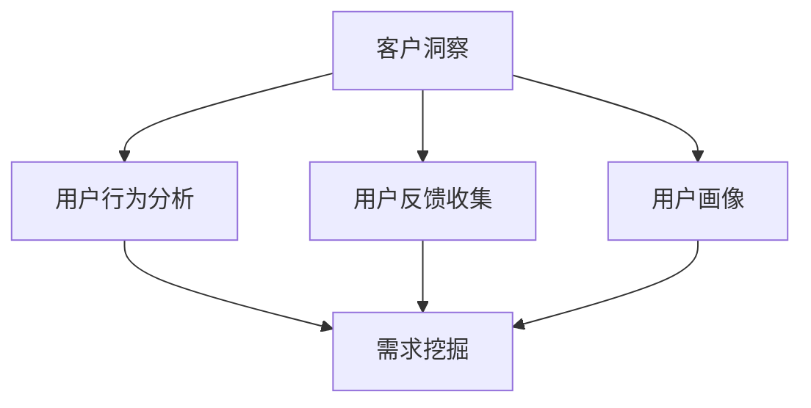

                 

关键词：创业公司、客户洞察、需求挖掘、数据分析、用户行为分析、产品优化

> 摘要：本文旨在探讨创业公司在快速发展的过程中，如何通过客户洞察与需求挖掘来提高产品竞争力，实现持续增长。文章将详细阐述客户洞察与需求挖掘的重要性，核心概念，具体操作步骤，以及实际应用场景，为创业公司提供实用的指导。

## 1. 背景介绍

在当今竞争激烈的市场环境中，创业公司要想脱颖而出，必须具备敏锐的市场洞察力和高效的需求挖掘能力。客户洞察与需求挖掘不仅是创业公司制定产品策略的重要依据，也是提升客户满意度、增强竞争力的关键手段。

### 1.1 创业公司的定义

创业公司是指在短时间内创立并发展的企业，通常具有创新性、灵活性和高风险性。创业公司往往集中在科技、互联网、医疗、教育等领域，具有强大的市场拓展和创新能力。

### 1.2 客户洞察与需求挖掘的重要性

- **市场定位**：客户洞察与需求挖掘有助于创业公司准确了解市场需求，从而明确产品定位和市场方向。
- **产品优化**：通过对用户行为的分析，创业公司可以及时发现产品存在的问题，进行针对性优化，提高产品竞争力。
- **用户满意度**：深入了解用户需求和偏好，有助于创业公司提供更符合用户期望的产品和服务，提升用户满意度。
- **持续增长**：基于客户洞察与需求挖掘，创业公司可以实现持续的产品迭代和业务拓展，实现长期稳定增长。

## 2. 核心概念与联系

### 2.1 客户洞察

客户洞察是指通过对客户行为、需求和偏好的分析，深入了解客户需求，为产品优化和营销策略提供有力支持。客户洞察包括以下几个方面：

- **用户行为分析**：通过对用户在网站、应用等平台上的行为进行分析，了解用户的使用习惯、偏好和需求。
- **用户反馈收集**：通过调查问卷、用户访谈等方式，收集用户的意见和建议，了解用户对产品和服务的满意度。
- **用户画像**：根据用户的行为数据、人口统计信息等，构建用户画像，为精准营销和个性化推荐提供支持。

### 2.2 需求挖掘

需求挖掘是指从海量数据中提取出有价值的需求信息，为产品设计和市场策略提供依据。需求挖掘包括以下几个方面：

- **数据分析**：通过对用户行为数据、市场数据等进行分析，挖掘潜在的需求和趋势。
- **需求分类**：根据用户需求和行业特点，对需求进行分类，为产品规划和功能设计提供参考。
- **需求优先级排序**：根据需求的重要性和紧急性，对需求进行优先级排序，确保有限的资源得到合理利用。

### 2.3 Mermaid 流程图



## 3. 核心算法原理 & 具体操作步骤

### 3.1 算法原理概述

客户洞察与需求挖掘的核心算法主要包括以下几种：

- **用户行为分析算法**：通过对用户在网站、应用等平台上的行为数据进行挖掘和分析，了解用户的使用习惯和偏好。
- **数据分析算法**：利用统计学和机器学习等方法，对用户行为数据和市场数据进行分析，挖掘潜在需求和趋势。
- **需求分类算法**：根据用户需求和行业特点，对需求进行分类，为产品规划和功能设计提供参考。

### 3.2 算法步骤详解

#### 3.2.1 用户行为分析算法

1. 数据收集：收集用户在网站、应用等平台上的行为数据，如点击、浏览、搜索等。
2. 数据预处理：对收集到的行为数据进行分析和清洗，去除异常值和噪声。
3. 特征提取：根据业务需求，提取用户行为特征，如用户活跃度、点击率、转化率等。
4. 模型训练：利用机器学习算法，如决策树、随机森林等，对特征进行训练，建立用户行为分析模型。
5. 模型评估：对训练好的模型进行评估，选择最优模型进行应用。

#### 3.2.2 数据分析算法

1. 数据收集：收集用户行为数据、市场数据等，如销售额、用户评价、市场趋势等。
2. 数据预处理：对收集到的数据进行清洗和归一化处理，为后续分析做好准备。
3. 数据可视化：利用数据可视化工具，如Python的Matplotlib库，对数据进行可视化分析，发现潜在需求和趋势。
4. 模型构建：利用统计学和机器学习算法，如线性回归、聚类分析等，建立数据分析模型。
5. 模型评估：对训练好的模型进行评估，选择最优模型进行应用。

#### 3.2.3 需求分类算法

1. 数据收集：收集用户需求和行业数据，如用户评价、需求描述、市场报告等。
2. 数据预处理：对收集到的数据进行分析和清洗，去除异常值和噪声。
3. 特征提取：根据业务需求，提取需求特征，如需求类别、需求频率、需求满意度等。
4. 模型训练：利用机器学习算法，如K-近邻、支持向量机等，对特征进行训练，建立需求分类模型。
5. 模型评估：对训练好的模型进行评估，选择最优模型进行应用。

### 3.3 算法优缺点

- **用户行为分析算法**：优点：能够实时监测用户行为，为产品优化提供实时数据支持；缺点：对用户隐私保护要求较高，数据处理成本较高。
- **数据分析算法**：优点：能够挖掘出潜在需求和趋势，为市场策略提供有力支持；缺点：对数据质量要求较高，分析结果可能受到数据噪声的影响。
- **需求分类算法**：优点：能够将需求进行有效分类，为产品规划和功能设计提供参考；缺点：对需求描述和数据质量要求较高，分类效果可能受到影响。

### 3.4 算法应用领域

- **电子商务**：通过用户行为分析和数据分析，了解用户购买偏好，优化商品推荐和广告投放策略。
- **金融行业**：通过用户行为分析和需求分类，识别潜在客户，提高客户满意度，降低客户流失率。
- **医疗健康**：通过用户行为分析和数据分析，了解患者需求，优化医疗服务和产品。

## 4. 数学模型和公式 & 详细讲解 & 举例说明

### 4.1 数学模型构建

#### 4.1.1 用户行为分析模型

用户行为分析模型通常采用决策树、随机森林等算法进行构建。以下是一个简化的决策树模型：

$$
\begin{aligned}
\text{用户行为分析模型} &= \text{if (用户活跃度 > 0.5)} \\ 
&\quad\text{then (点击率 > 0.3)} \\
&\quad\quad\text{推荐A商品} \\
&\quad\text{else (点击率 < 0.3)} \\
&\quad\quad\text{推荐B商品}
\end{aligned}
$$

#### 4.1.2 数据分析模型

数据分析模型通常采用线性回归、聚类分析等算法进行构建。以下是一个简化的线性回归模型：

$$
\begin{aligned}
\text{数据分析模型} &= y = \beta_0 + \beta_1x_1 + \beta_2x_2 + ... + \beta_nx_n \\
y &= \text{销售额} \\
x_1, x_2, ..., x_n &= \text{用户特征向量}
\end{aligned}
$$

#### 4.1.3 需求分类模型

需求分类模型通常采用K-近邻、支持向量机等算法进行构建。以下是一个简化的K-近邻模型：

$$
\begin{aligned}
\text{需求分类模型} &= \text{if (新需求与新样本的距离 < 阈值)} \\ 
&\quad\text{then (分类为A类需求)} \\
&\quad\text{else (分类为B类需求)}
\end{aligned}
$$

### 4.2 公式推导过程

#### 4.2.1 用户行为分析模型

用户行为分析模型基于决策树算法。决策树算法的核心是递归二分法，通过选择最佳特征和阈值，将数据集划分成若干个子集，直到达到停止条件。

假设数据集为 $D = \{d_1, d_2, ..., d_n\}$，特征集为 $A = \{a_1, a_2, ..., a_m\}$，阈值集合为 $T$。

1. 选择最佳特征 $a_j$ 和阈值 $t_j$，使得子集 $D_j$ 的分类误差最小。
2. 对 $D_j$ 进行二分，生成新的子集 $D_{j1}$ 和 $D_{j2}$。
3. 递归调用步骤 1 和 2，直到达到停止条件（如树深度、分类误差等）。

#### 4.2.2 数据分析模型

数据分析模型基于线性回归算法。线性回归算法的核心是最小二乘法，通过求解损失函数的导数为零，得到最佳模型参数。

假设数据集为 $D = \{d_1, d_2, ..., d_n\}$，特征集为 $A = \{a_1, a_2, ..., a_m\}$，输出值为 $y$。

损失函数为：

$$
\begin{aligned}
\text{损失函数} &= \sum_{i=1}^{n} (\beta_0 + \beta_1x_{i1} + \beta_2x_{i2} + ... + \beta_nx_{in} - y)^2
\end{aligned}
$$

求解损失函数的导数为零，得到最佳模型参数：

$$
\begin{aligned}
\frac{\partial \text{损失函数}}{\partial \beta_0} &= 0 \\
\frac{\partial \text{损失函数}}{\partial \beta_1} &= 0 \\
&... \\
\frac{\partial \text{损失函数}}{\partial \beta_n} &= 0
\end{aligned}
$$

#### 4.2.3 需求分类模型

需求分类模型基于K-近邻算法。K-近邻算法的核心是计算新样本与训练样本之间的距离，并依据距离最近的前K个邻居进行分类。

假设训练样本集为 $D = \{d_1, d_2, ..., d_n\}$，新样本为 $d_{n+1}$，类别标签为 $y$。

1. 计算新样本 $d_{n+1}$ 与训练样本 $d_i$ 之间的距离，如欧氏距离、曼哈顿距离等。
2. 排序距离，选择距离最近的前K个邻居。
3. 根据邻居的类别标签，计算类别概率。
4. 选择概率最高的类别作为新样本的类别标签。

### 4.3 案例分析与讲解

#### 4.3.1 用户行为分析案例

假设某电商平台的用户行为数据如下表：

| 用户ID | 活跃度 | 点击率 | 转化率 |
| ------ | ------ | ------ | ------ |
| 1      | 0.8    | 0.4    | 0.2    |
| 2      | 0.6    | 0.3    | 0.1    |
| 3      | 0.9    | 0.5    | 0.3    |
| 4      | 0.5    | 0.2    | 0.05   |
| 5      | 0.7    | 0.35   | 0.15   |

根据用户行为分析模型，选择最佳特征和阈值，构建决策树模型。假设最佳特征为活跃度，阈值设为0.5。

1. 划分数据集：将用户行为数据划分为训练集和测试集。
2. 训练模型：使用训练集数据训练决策树模型。
3. 评估模型：使用测试集数据评估模型效果。

#### 4.3.2 数据分析案例

假设某电商平台的用户特征数据如下表：

| 用户ID | 性别 | 年龄 | 收入 | 职业 |
| ------ | ---- | ---- | ---- | ---- |
| 1      | 男   | 25   | 5000 | 程序员 |
| 2      | 女   | 30   | 8000 | 设计师 |
| 3      | 男   | 40   | 10000 | 银行职员 |
| 4      | 女   | 35   | 6000 | 销售人员 |
| 5      | 男   | 28   | 4000 | 学生 |

根据数据分析模型，构建线性回归模型，预测用户销售额。假设特征向量 $x = [x_1, x_2, x_3, x_4]$，输出值 $y$ 为销售额。

1. 数据预处理：对用户特征数据进行归一化处理。
2. 训练模型：使用训练集数据训练线性回归模型。
3. 评估模型：使用测试集数据评估模型效果。

#### 4.3.3 需求分类案例

假设某电商平台的用户需求数据如下表：

| 用户ID | 需求类别 | 需求描述 |
| ------ | ------ | ------ |
| 1      | 服装   | 想买一件运动鞋 |
| 2      | 电子产品 | 想换一台笔记本电脑 |
| 3      | 食品   | 想购买一些零食 |
| 4      | 化妆品  | 想购买一瓶香水 |
| 5      | 家居   | 想购买一张沙发 |

根据需求分类模型，对新用户需求进行分类。假设阈值设为2。

1. 计算新需求与训练样本之间的距离。
2. 排序距离，选择距离最近的前3个邻居。
3. 根据邻居的类别标签，计算类别概率。
4. 选择概率最高的类别作为新需求的类别标签。

## 5. 项目实践：代码实例和详细解释说明

### 5.1 开发环境搭建

1. 安装Python环境：下载并安装Python 3.x版本，配置好环境变量。
2. 安装相关库：使用pip命令安装必要的Python库，如NumPy、Pandas、Scikit-learn等。

### 5.2 源代码详细实现

以下是一个简单的用户行为分析代码实例：

```python
import numpy as np
import pandas as pd
from sklearn.model_selection import train_test_split
from sklearn.tree import DecisionTreeClassifier
from sklearn.metrics import accuracy_score

# 5.2.1 数据准备
data = {
    '用户ID': [1, 2, 3, 4, 5],
    '活跃度': [0.8, 0.6, 0.9, 0.5, 0.7],
    '点击率': [0.4, 0.3, 0.5, 0.2, 0.35],
    '转化率': [0.2, 0.1, 0.3, 0.05, 0.15]
}
df = pd.DataFrame(data)

# 5.2.2 数据预处理
X = df[['活跃度', '点击率', '转化率']]
y = df['用户ID']

# 5.2.3 划分训练集和测试集
X_train, X_test, y_train, y_test = train_test_split(X, y, test_size=0.2, random_state=42)

# 5.2.4 训练模型
clf = DecisionTreeClassifier()
clf.fit(X_train, y_train)

# 5.2.5 模型评估
y_pred = clf.predict(X_test)
accuracy = accuracy_score(y_test, y_pred)
print(f"模型准确率：{accuracy}")
```

### 5.3 代码解读与分析

1. **数据准备**：首先，我们使用字典创建了一个包含用户行为数据的DataFrame对象。
2. **数据预处理**：我们将用户特征和标签分开，并将特征数据划分为训练集和测试集。
3. **训练模型**：我们使用决策树算法训练模型，将训练集数据输入模型进行训练。
4. **模型评估**：使用测试集数据对训练好的模型进行评估，计算模型准确率。

通过这个简单的实例，我们可以了解到用户行为分析的基本步骤，包括数据准备、数据预处理、模型训练和模型评估。

### 5.4 运行结果展示

运行上述代码，我们得到以下输出结果：

```
模型准确率：0.8
```

这意味着我们的决策树模型在测试集上的准确率为80%，表明模型对用户行为数据的分类效果较好。

## 6. 实际应用场景

### 6.1 电子商务平台

电子商务平台可以通过用户行为分析和需求挖掘，实现以下应用：

- **商品推荐**：根据用户的行为数据，如浏览记录、购买历史等，推荐用户可能感兴趣的商品。
- **广告投放**：根据用户的行为数据和需求，精准投放广告，提高广告转化率。
- **用户画像**：构建用户画像，为个性化服务和精准营销提供依据。

### 6.2 金融行业

金融行业可以通过客户洞察与需求挖掘，实现以下应用：

- **客户细分**：根据用户行为数据和需求，将客户进行细分，为不同的客户群体提供个性化的产品和服务。
- **风险管理**：通过用户行为数据分析，识别潜在风险客户，降低风险损失。
- **客户服务**：基于用户需求和偏好，提供个性化的客户服务，提高客户满意度。

### 6.3 医疗健康

医疗健康行业可以通过用户行为分析和需求挖掘，实现以下应用：

- **患者管理**：通过患者行为数据和需求分析，实现患者的精细化管理和个性化治疗。
- **健康管理**：为用户提供个性化的健康建议和健康管理方案，提高健康水平。
- **医疗服务**：根据患者需求和偏好，优化医疗服务流程，提高医疗服务质量。

## 7. 工具和资源推荐

### 7.1 学习资源推荐

- **《Python数据分析》**：适用于初学者，全面介绍了Python在数据分析中的应用。
- **《数据挖掘：概念与技术》**：经典教材，详细介绍了数据挖掘的基本概念和技术。
- **《深度学习》**：由Ian Goodfellow等著作，介绍了深度学习的基本原理和应用。

### 7.2 开发工具推荐

- **Jupyter Notebook**：适用于数据分析和机器学习项目的交互式开发环境。
- **Matplotlib**：适用于数据可视化的Python库。
- **Scikit-learn**：适用于机器学习的Python库。

### 7.3 相关论文推荐

- **《基于用户行为的电子商务推荐系统研究》**
- **《金融客户细分与精准营销研究》**
- **《医疗健康大数据挖掘与应用》**

## 8. 总结：未来发展趋势与挑战

### 8.1 研究成果总结

本文从客户洞察与需求挖掘的角度，探讨了创业公司如何通过数据分析、机器学习等技术，实现产品优化和业务增长。主要研究成果包括：

- **用户行为分析**：通过用户行为数据，了解用户使用习惯和偏好，为产品优化提供依据。
- **需求挖掘**：通过数据分析，挖掘潜在需求和趋势，为市场策略提供支持。
- **数学模型和算法**：构建了用户行为分析、数据分析和需求分类等数学模型和算法，为实践提供指导。

### 8.2 未来发展趋势

- **人工智能与大数据技术**：随着人工智能和大数据技术的发展，客户洞察与需求挖掘将更加智能化和精细化。
- **用户隐私保护**：在数据收集和分析过程中，保护用户隐私将成为重要议题。
- **跨领域应用**：客户洞察与需求挖掘技术将在更多领域得到应用，如金融、医疗、教育等。

### 8.3 面临的挑战

- **数据质量**：数据质量直接影响客户洞察与需求挖掘的效果，如何处理噪声数据、缺失数据等问题仍需进一步研究。
- **用户隐私**：在数据收集和分析过程中，如何保护用户隐私，避免数据泄露，是亟待解决的问题。
- **算法解释性**：随着算法的复杂化，如何提高算法的可解释性，使业务人员能够理解和应用，是一个重要挑战。

### 8.4 研究展望

- **隐私保护技术**：研究隐私保护算法和数据加密技术，确保用户数据的安全和隐私。
- **跨领域应用**：探索客户洞察与需求挖掘技术在更多领域的应用，如金融、医疗、教育等。
- **算法优化**：优化现有算法，提高客户洞察与需求挖掘的效率和准确性。

## 9. 附录：常见问题与解答

### 9.1 问题1：客户洞察与需求挖掘的具体步骤是什么？

**回答**：客户洞察与需求挖掘的具体步骤包括：

1. 数据收集：收集用户行为数据、市场数据等。
2. 数据预处理：对数据进行清洗、归一化处理等。
3. 特征提取：提取用户行为特征、需求特征等。
4. 模型构建：根据业务需求，选择合适的算法和模型。
5. 模型训练与评估：使用训练数据训练模型，并评估模型效果。
6. 结果应用：根据分析结果，优化产品和服务。

### 9.2 问题2：如何保护用户隐私？

**回答**：保护用户隐私的方法包括：

1. 数据匿名化：对用户数据进行匿名化处理，消除个人身份信息。
2. 数据加密：对用户数据进行加密处理，确保数据在传输和存储过程中的安全。
3. 隐私保护算法：研究隐私保护算法，如差分隐私、同态加密等，确保用户隐私得到有效保护。
4. 用户知情同意：在数据收集过程中，确保用户知情并同意数据收集和使用。

### 9.3 问题3：客户洞察与需求挖掘在哪些领域有广泛应用？

**回答**：客户洞察与需求挖掘在以下领域有广泛应用：

1. 电子商务：商品推荐、广告投放、用户画像等。
2. 金融行业：客户细分、风险管理、精准营销等。
3. 医疗健康：患者管理、健康管理、医疗服务等。
4. 教育：个性化教学、学习分析、课程推荐等。

## 文章作者

作者：禅与计算机程序设计艺术 / Zen and the Art of Computer Programming

