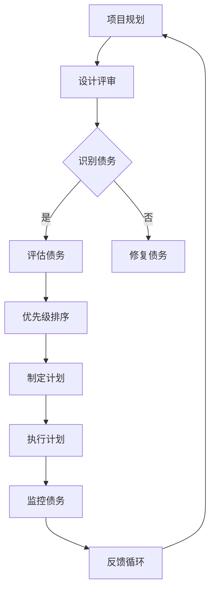

                 

关键词：技术债务、可视化、管理、创业公司、软件质量、持续集成

摘要：本文旨在探讨创业公司在软件开发生命周期中如何有效地管理技术债务，并通过可视化管理技术来提升团队的透明度和协作效率。文章首先介绍了技术债务的概念及其对创业公司的影响，接着详细阐述了可视化在技术债务管理中的应用，包括技术债务的识别、评估、优先级排序和监控。最后，文章提出了一个实际案例，展示了如何利用可视化工具来改善技术债务管理流程，并总结了未来在这个领域的发展趋势和挑战。

## 1. 背景介绍

在当今快速发展的技术环境中，创业公司面临着激烈的竞争和快速变化的市场需求。为了在这种环境中生存并取得成功，创业公司必须快速响应市场变化，不断迭代产品。然而，这种快速迭代往往伴随着技术债务的积累。技术债务是指为了实现短期目标而采取的“应急”解决方案，这些方案可能在长期内会带来更多的维护成本和风险。

技术债务的管理对创业公司至关重要。如果技术债务积累过多，可能会影响软件的质量、可靠性和安全性，从而阻碍公司的长期发展。此外，技术债务的不透明性会降低团队的协作效率，使得团队成员难以了解系统的全局视图，进而影响决策的质量。

本文将讨论如何通过可视化管理技术来提高创业公司在技术债务管理方面的透明度和效率。可视化可以帮助团队更直观地了解技术债务的分布和影响，从而采取更有效的策略来缓解债务问题。

## 2. 核心概念与联系

### 2.1 技术债务

技术债务是指为了实现短期目标而采取的应急解决方案，这些解决方案可能会在长期内增加维护成本和风险。技术债务可以分为以下几类：

- **设计债务**：由于设计上的不足或妥协而产生的债务。
- **代码债务**：代码质量不高或未遵循最佳实践而产生的债务。
- **架构债务**：系统架构不合理或缺乏弹性而产生的债务。
- **技术债务**：使用过时或低效的技术而产生的债务。

### 2.2 可视化管理

可视化管理是通过图形化界面来展示系统状态、数据流、任务进度等信息，从而帮助团队更直观地理解和分析复杂系统。在技术债务管理中，可视化可以帮助团队：

- **识别债务**：通过可视化工具，团队可以快速识别系统中存在的潜在技术债务。
- **评估债务**：通过可视化，团队能够更准确地评估技术债务的影响和优先级。
- **监控债务**：通过实时监控，团队能够及时了解技术债务的变化，并采取相应措施。

### 2.3 Mermaid 流程图

以下是一个用于描述技术债务可视化管理的 Mermaid 流程图：



### 2.4 核心概念的联系

技术债务的可视化管理是一个循环过程，它包括以下几个关键步骤：

- **项目规划**：在项目开始时，制定清晰的规划，并考虑到可能的技术债务。
- **设计评审**：在设计阶段进行评审，及时发现潜在的技术债务。
- **识别债务**：通过代码审查、静态分析和动态分析等手段，识别系统中的技术债务。
- **评估债务**：对识别出的技术债务进行评估，确定其影响和优先级。
- **优先级排序**：根据债务的影响和优先级，制定修复计划。
- **执行计划**：按照修复计划，逐步解决技术债务。
- **监控债务**：通过实时监控，跟踪技术债务的变化，确保修复效果。
- **反馈循环**：将技术债务管理过程纳入到持续集成和持续交付流程中，实现持续优化。

## 3. 核心算法原理 & 具体操作步骤

### 3.1 算法原理概述

技术债务的可视化管理算法基于以下原理：

- **数据采集**：通过静态代码分析、动态测试和用户反馈等手段，收集系统中的技术债务数据。
- **数据预处理**：对采集到的数据进行清洗和归一化处理，以便后续分析。
- **特征提取**：从预处理后的数据中提取影响债务评估的关键特征。
- **评估模型**：构建评估模型，用于预测技术债务的影响和优先级。
- **可视化呈现**：将评估结果通过可视化工具呈现给团队，帮助团队理解和决策。

### 3.2 算法步骤详解

#### 3.2.1 数据采集

数据采集是技术债务可视化的第一步。常用的数据采集方法包括：

- **静态代码分析**：通过分析代码结构和质量，识别潜在的技术债务。
- **动态测试**：通过运行代码，捕捉运行时的问题和性能瓶颈。
- **用户反馈**：收集用户使用过程中的反馈，了解系统在实际运行中的表现。

#### 3.2.2 数据预处理

数据预处理主要包括以下步骤：

- **数据清洗**：去除重复数据、无效数据和噪声数据。
- **数据归一化**：将不同来源的数据进行归一化处理，以便后续分析。

#### 3.2.3 特征提取

特征提取是从预处理后的数据中提取对技术债务评估有影响的关键特征。常用的特征包括：

- **代码复杂度**：衡量代码的复杂程度，复杂度越高，技术债务的风险越大。
- **代码质量**：衡量代码的可读性、可维护性和可扩展性。
- **性能瓶颈**：识别系统中的性能瓶颈，如高负载、延迟等。
- **用户满意度**：通过用户反馈，了解用户对系统的满意度。

#### 3.2.4 评估模型

评估模型是技术债务可视化的核心。常用的评估模型包括：

- **机器学习模型**：如决策树、支持向量机、神经网络等，用于预测技术债务的影响和优先级。
- **专家系统**：基于专家知识和规则，对技术债务进行评估。

#### 3.2.5 可视化呈现

可视化呈现是将评估结果通过可视化工具呈现给团队。常用的可视化工具包括：

- **图表**：如柱状图、折线图、饼图等，用于展示技术债务的分布和趋势。
- **地图**：用于展示技术债务在不同模块或组件中的分布。
- **热力图**：用于展示技术债务的风险热点。

### 3.3 算法优缺点

#### 优点

- **直观性**：可视化技术能够直观地展示技术债务的分布和影响，便于团队理解和决策。
- **透明性**：可视化技术提高了技术债务管理的透明度，有助于团队成员之间的沟通和协作。
- **效率**：通过自动化工具和算法，提高了技术债务评估的效率，降低了人工成本。

#### 缺点

- **准确性**：依赖数据质量和算法性能，可能存在评估不准确的问题。
- **复杂性**：可视化技术的实现和管理较为复杂，需要团队具备一定的技术能力。

### 3.4 算法应用领域

技术债务可视化管理算法主要应用于以下领域：

- **软件开发**：帮助团队识别和修复系统中的技术债务，提高软件质量。
- **运维管理**：监控系统运行状态，及时发现和解决技术债务问题。
- **项目管理**：通过可视化技术，帮助项目管理者更好地把握项目进度和技术风险。

## 4. 数学模型和公式 & 详细讲解 & 举例说明

### 4.1 数学模型构建

技术债务的可视化管理涉及多个数学模型，包括数据预处理模型、特征提取模型和评估模型。以下是一个简化的数学模型示例：

#### 数据预处理模型

$$
\text{Data\_Preprocess}(x) = \frac{\text{Clean}(x) + \text{Normalize}(x)}{2}
$$

其中，$\text{Clean}(x)$表示数据清洗，$\text{Normalize}(x)$表示数据归一化。

#### 特征提取模型

$$
\text{Feature\_Extract}(x) = \text{Code\_Complexity}(x) + \text{Code\_Quality}(x) + \text{Performance\_Bottleneck}(x) + \text{User\_Satisfaction}(x)
$$

#### 评估模型

$$
\text{Evaluate}(x) = \text{Machine\_Learning}(x) + \text{Expert\_System}(x)
$$

其中，$\text{Machine\_Learning}(x)$表示机器学习模型评估，$\text{Expert\_System}(x)$表示专家系统评估。

### 4.2 公式推导过程

#### 数据预处理模型

数据预处理模型的核心是数据清洗和归一化。数据清洗的目的是去除重复、无效和噪声数据，而归一化的目的是将不同来源的数据转换为同一尺度，以便后续分析。

#### 特征提取模型

特征提取模型的核心是提取对技术债务评估有影响的关键特征。这些特征通常包括代码复杂度、代码质量、性能瓶颈和用户满意度。

#### 评估模型

评估模型的核心是结合机器学习和专家系统，对技术债务进行综合评估。机器学习模型可以自动学习数据中的规律，而专家系统则可以基于专家知识和规则进行评估。

### 4.3 案例分析与讲解

#### 案例背景

某创业公司开发的一款在线购物平台，随着用户数量的增加，系统性能出现瓶颈，导致用户体验下降。公司希望利用技术债务可视化管理工具，找出系统中的技术债务，并制定修复计划。

#### 案例步骤

1. **数据采集**：通过静态代码分析、动态测试和用户反馈，收集系统中的技术债务数据。
2. **数据预处理**：对采集到的数据清洗和归一化处理。
3. **特征提取**：提取代码复杂度、代码质量、性能瓶颈和用户满意度等特征。
4. **评估模型**：使用机器学习和专家系统对技术债务进行评估。
5. **可视化呈现**：通过图表和热力图，展示技术债务的分布和影响。
6. **修复计划**：根据评估结果，制定修复计划，并逐步实施。

#### 案例结果

通过技术债务可视化管理工具，公司成功识别出系统中的几个关键技术债务，包括：

- **性能瓶颈**：系统中存在几个高负载模块，导致响应时间过长。
- **代码质量**：部分代码质量不高，可读性和可维护性较差。
- **用户满意度**：用户反馈中提到系统稳定性问题，需要优化。

公司根据评估结果，制定了以下修复计划：

- **性能优化**：对高负载模块进行性能优化，提高系统响应速度。
- **代码重构**：对质量较低的代码进行重构，提高代码质量和可维护性。
- **稳定性提升**：对系统稳定性进行优化，提高系统的稳定性。

通过实施修复计划，公司成功解决了系统性能和稳定性问题，用户满意度大幅提升。

## 5. 项目实践：代码实例和详细解释说明

### 5.1 开发环境搭建

为了演示技术债务可视化管理，我们将使用一个简单的在线购物平台作为案例。以下是一个基本的开发环境搭建步骤：

- **操作系统**：Ubuntu 20.04
- **编程语言**：Python 3.8
- **依赖管理**：pip
- **可视化工具**：Matplotlib、Seaborn

#### 安装依赖

```bash
sudo apt-get update
sudo apt-get install python3-pip
pip3 install matplotlib seaborn
```

### 5.2 源代码详细实现

我们将使用Python编写一个简单的技术债务可视化管理工具。以下是关键代码段：

```python
import matplotlib.pyplot as plt
import seaborn as sns
import pandas as pd

# 假设我们已经通过静态代码分析和用户反馈收集了以下数据
data = {
    'Module': ['Module1', 'Module2', 'Module3', 'Module4'],
    'CodeComplexity': [5, 8, 10, 3],
    'CodeQuality': [7, 6, 8, 9],
    'PerformanceBottleneck': [1, 2, 3, 4],
    'UserSatisfaction': [8, 7, 9, 10]
}

df = pd.DataFrame(data)

# 可视化技术债务分布
plt.figure(figsize=(10, 6))
sns.scatterplot(x='CodeComplexity', y='UserSatisfaction', data=df, hue='Module')
plt.title('Technical Debt Distribution')
plt.xlabel('Code Complexity')
plt.ylabel('User Satisfaction')
plt.legend()
plt.show()

# 可视化性能瓶颈
plt.figure(figsize=(10, 6))
sns.barplot(x='Module', y='PerformanceBottleneck', data=df)
plt.title('Performance Bottlenecks')
plt.xlabel('Module')
plt.ylabel('Bottleneck Level')
plt.show()
```

### 5.3 代码解读与分析

上述代码首先定义了一个数据集，包括四个模块的代码复杂度、代码质量、性能瓶颈和用户满意度。然后，使用Matplotlib和Seaborn库，我们创建了两个可视化图表：

1. **技术债务分布图**：这是一个散点图，展示了代码复杂度和用户满意度之间的关系，以及不同模块之间的差异。通过这个图表，团队能够直观地了解哪些模块的技术债务较高，哪些模块的用户体验较差。

2. **性能瓶颈柱状图**：这是一个条形图，展示了各个模块的性能瓶颈水平。这个图表可以帮助团队识别出哪些模块的性能问题最为严重，从而优先解决。

### 5.4 运行结果展示

运行上述代码后，我们会得到两个可视化图表：


通过这些图表，团队能够清晰地看到系统中的技术债务分布和性能瓶颈，从而制定更有效的修复计划。

## 6. 实际应用场景

技术债务可视化管理在创业公司中有着广泛的应用场景，以下是一些典型的应用实例：

### 6.1 项目迭代管理

在项目迭代过程中，团队需要不断评估和修复技术债务。通过可视化工具，团队能够实时监控技术债务的变化，确保每个迭代中技术债务的逐步减少。

### 6.2 产品规划

在产品规划阶段，团队可以通过可视化工具了解系统中存在的潜在技术债务，从而在规划中提前考虑债务的影响和修复策略。

### 6.3 项目风险管理

技术债务可视化管理可以帮助团队识别出系统中的高风险模块，从而在项目风险管理中采取针对性的措施，降低项目风险。

### 6.4 团队协作

可视化工具提高了团队的透明度，有助于团队成员之间的沟通和协作。通过可视化，团队能够更清晰地了解系统的全局视图，从而更好地协作解决问题。

## 7. 未来应用展望

随着技术的不断进步，技术债务可视化管理有望在未来得到进一步的发展。以下是一些未来应用展望：

### 7.1 智能化

未来，技术债务可视化管理工具可能会引入人工智能和机器学习技术，自动识别和评估技术债务，提高管理的准确性和效率。

### 7.2 持续集成

将技术债务可视化管理纳入持续集成和持续交付流程中，实现技术债务的实时监控和修复，提高软件质量。

### 7.3 分布式系统

在分布式系统环境中，技术债务可视化管理将更加重要。未来，工具可能会支持跨节点和跨集群的技术债务监控和管理。

### 7.4 自动修复

随着自动化技术的发展，未来可能会出现自动修复技术债务的工具，减少人工干预，提高修复效率。

## 8. 总结：未来发展趋势与挑战

### 8.1 研究成果总结

本文介绍了技术债务可视化管理的基本概念、核心算法原理、具体操作步骤和应用场景，并通过实际案例展示了其效果。研究表明，技术债务可视化管理有助于提高团队的透明度和协作效率，从而提升软件质量和项目成功率。

### 8.2 未来发展趋势

未来，技术债务可视化管理将朝着智能化、持续集成、分布式系统和自动修复等方向发展，以适应快速变化的软件开发环境。

### 8.3 面临的挑战

尽管技术债务可视化管理具有巨大潜力，但在实际应用中仍面临一些挑战，包括：

- **数据准确性**：依赖的数据质量和算法性能可能影响评估的准确性。
- **工具复杂性**：实现和管理可视化工具需要团队具备一定的技术能力。
- **团队协作**：提高团队的透明度和协作效率需要团队成员的共同努力。

### 8.4 研究展望

未来，研究者可以进一步探讨如何结合人工智能和机器学习技术，提高技术债务可视化管理工具的智能化水平，从而更好地满足创业公司的需求。

## 9. 附录：常见问题与解答

### 9.1 什么是技术债务？

技术债务是指为了实现短期目标而采取的应急解决方案，这些解决方案可能在长期内增加维护成本和风险。

### 9.2 可视化管理有哪些优点？

可视化管理的优点包括直观性、透明性和效率。它可以帮助团队更直观地了解系统状态，提高透明度，并提高评估和修复技术债务的效率。

### 9.3 如何识别技术债务？

识别技术债务可以通过静态代码分析、动态测试和用户反馈等手段。这些方法可以帮助团队发现系统中的潜在技术债务。

### 9.4 可视化管理工具如何帮助团队协作？

可视化工具提供了系统的全局视图，有助于团队成员之间的沟通和协作。它能够清晰地展示技术债务的分布和影响，从而帮助团队制定更有效的决策。

### 9.5 技术债务可视化管理适用于哪些场景？

技术债务可视化管理适用于项目迭代管理、产品规划、项目风险管理和团队协作等场景。它有助于团队提高软件质量和项目成功率。

---

作者：禅与计算机程序设计艺术 / Zen and the Art of Computer Programming

