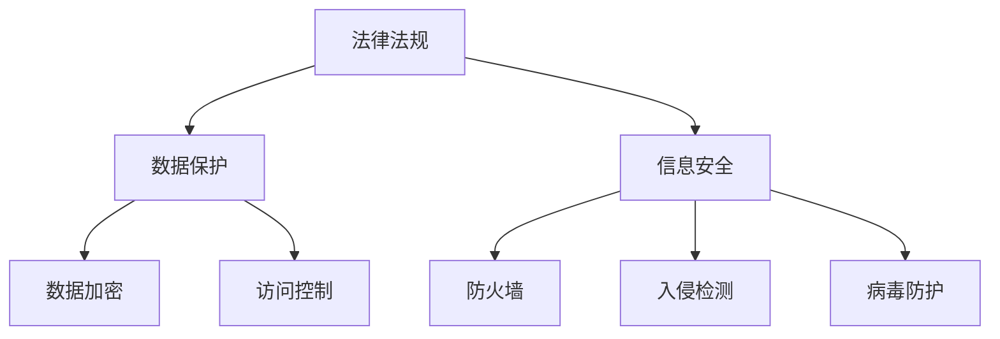

                 

关键词：创业公司，技术合规性，风险评估，法律法规，数据保护，信息安全

摘要：本文旨在为创业公司提供技术合规性风险评估的全面指南。通过深入分析创业公司所面临的技术合规性挑战，本文提出了一个系统性的评估框架，以及具体的合规策略和最佳实践。此外，本文还探讨了未来技术合规性发展的趋势和挑战。

## 1. 背景介绍

随着信息技术的飞速发展，创业公司不断涌现，成为推动社会进步和经济发展的重要力量。然而，创业公司在追求快速发展的同时，也面临着诸多技术合规性问题。技术合规性不仅关系到企业的法律责任，还直接影响企业的声誉和市场竞争力。

技术合规性是指企业在技术研发、应用和运营过程中，遵循相关法律法规、标准和行业规范的程度。对于创业公司而言，技术合规性尤为重要，因为它们往往缺乏成熟的技术管理体系和法律知识，容易在合规方面陷入困境。

本文将探讨创业公司在技术合规性方面所面临的挑战，并提供一个全面的评估框架，帮助创业公司识别和管理合规风险。

### 1.1 创业公司的技术合规性挑战

#### 1.1.1 法律法规方面

创业公司通常需要遵守国家相关法律法规，如《中华人民共和国网络安全法》、《中华人民共和国个人信息保护法》等。这些法律法规对企业的数据处理、信息安全和隐私保护提出了严格的要求。然而，创业公司往往缺乏对法律法规的深入了解，容易在合规方面出现问题。

#### 1.1.2 数据保护方面

随着数据价值的提升，数据保护成为创业公司的重要挑战。创业公司需要确保数据的安全性和隐私性，避免数据泄露和滥用。然而，许多创业公司在数据保护方面缺乏有效的措施，如数据加密、访问控制等。

#### 1.1.3 信息安全方面

创业公司面临的网络安全威胁日益严峻。黑客攻击、数据泄露等事件不仅可能导致企业经济损失，还会损害企业的声誉。创业公司需要建立健全的信息安全体系，确保业务系统的安全性。

### 1.2 技术合规性对创业公司的影响

#### 1.2.1 法律责任

技术合规性直接关系到企业的法律责任。如果创业公司在技术合规性方面存在问题，将可能面临罚款、赔偿等法律后果。

#### 1.2.2 市场竞争力

技术合规性是企业竞争力的体现。在市场竞争中，合规性较高的企业往往能够赢得更多消费者的信任，提升市场份额。

#### 1.2.3 企业声誉

技术合规性不仅关系到企业的法律责任，还直接关系到企业的声誉。如果创业公司在技术合规性方面出现问题，将可能导致消费者对企业失去信任，影响企业的长期发展。

### 1.3 本文目的

本文旨在为创业公司提供技术合规性风险评估的全面指南，帮助创业公司识别和管理合规风险，确保企业在合规方面保持竞争力。

## 2. 核心概念与联系

### 2.1 技术合规性的核心概念

#### 2.1.1 法律法规

法律法规是技术合规性的基础。创业公司需要了解并遵守相关法律法规，如《中华人民共和国网络安全法》、《中华人民共和国个人信息保护法》等。

#### 2.1.2 数据保护

数据保护是指企业在数据处理过程中，确保数据的安全性和隐私性。数据保护包括数据加密、访问控制、数据备份等。

#### 2.1.3 信息安全

信息安全是指企业在信息系统中，确保数据安全、系统安全和网络安全。信息安全包括防火墙、入侵检测、病毒防护等。

### 2.2 技术合规性的架构

为了更好地理解技术合规性的核心概念，我们使用 Mermaid 流程图来展示技术合规性的架构。



### 2.3 技术合规性的联系

技术合规性的核心概念之间存在紧密的联系。法律法规为技术合规性提供了法律基础，数据保护和信息安全则是技术合规性的具体实现。数据保护确保了企业在数据处理过程中的合规性，而信息安全则保障了企业信息系统的安全性。

## 3. 核心算法原理 & 具体操作步骤

### 3.1 算法原理概述

技术合规性评估的核心算法是一种基于风险管理的评估方法。该方法主要包括以下步骤：

1. 风险识别：识别企业在技术合规性方面可能存在的风险。
2. 风险评估：评估风险的可能性和影响程度。
3. 风险优先级排序：根据风险评估结果，确定风险的优先级。
4. 风险应对策略：制定相应的风险应对策略。

### 3.2 算法步骤详解

#### 3.2.1 风险识别

风险识别是技术合规性评估的第一步。创业公司需要通过问卷调查、访谈、文献调研等方式，识别企业在技术合规性方面可能存在的风险。常见的风险包括数据泄露、信息篡改、系统故障等。

#### 3.2.2 风险评估

风险评估是对识别出的风险进行量化和评估。创业公司可以采用定量和定性两种方法进行风险评估。定量方法包括风险矩阵、蒙特卡罗模拟等，定性方法包括专家评估、逻辑树等。

#### 3.2.3 风险优先级排序

根据风险评估结果，创业公司需要将风险进行优先级排序。一般来说，风险优先级越高，越需要优先处理。

#### 3.2.4 风险应对策略

针对不同优先级的风险，创业公司需要制定相应的风险应对策略。常见的风险应对策略包括风险规避、风险降低、风险接受等。

### 3.3 算法优缺点

#### 3.3.1 优点

- **系统性**：基于风险管理的评估方法能够全面系统地识别和管理合规风险。
- **灵活性**：该方法可以根据企业的实际情况进行调整，具有较好的灵活性。
- **实用性**：该方法在实际应用中具有较高的实用价值。

#### 3.3.2 缺点

- **复杂性**：技术合规性评估过程较为复杂，需要较高的专业知识和技能。
- **成本**：评估过程可能需要投入一定的人力、物力和财力。

### 3.4 算法应用领域

技术合规性评估方法可以应用于创业公司的各个领域，如技术研发、产品运营、市场营销等。通过该算法，创业公司可以识别和管理合规风险，确保企业在合规方面保持竞争力。

## 4. 数学模型和公式 & 详细讲解 & 举例说明

### 4.1 数学模型构建

技术合规性评估的数学模型可以分为风险识别、风险评估和风险应对三个部分。

#### 4.1.1 风险识别模型

风险识别模型主要基于问卷调查和文献调研，采用逻辑回归等方法构建。其目的是识别企业在技术合规性方面可能存在的风险。

$$
P(Y=1|X) = \frac{1}{1 + e^{-(\beta_0 + \beta_1X_1 + \beta_2X_2 + ... + \beta_nX_n})}
$$

其中，$P(Y=1|X)$ 表示企业在某一合规性方面存在风险的概率，$X_1, X_2, ..., X_n$ 表示影响风险的因素，$\beta_0, \beta_1, \beta_2, ..., \beta_n$ 为模型的参数。

#### 4.1.2 风险评估模型

风险评估模型主要基于定量和定性方法，采用贝叶斯网络等方法构建。其目的是评估风险的可能性和影响程度。

$$
P(R=r|Y=y) = \frac{P(Y=y|R=r)P(R=r)}{P(Y=y)}
$$

其中，$P(R=r|Y=y)$ 表示在某一合规性方面，风险为$r$ 的概率，$P(Y=y|R=r)$ 表示在某一风险$r$ 存在的情况下，企业存在风险的概率，$P(R=r)$ 表示风险$r$ 的概率，$P(Y=y)$ 表示企业存在风险的总体概率。

#### 4.1.3 风险应对模型

风险应对模型主要基于风险优先级排序和风险应对策略，采用决策树等方法构建。其目的是制定相应的风险应对策略。

$$
C(R,r) = \min \{C_1(R,r), C_2(R,r), ..., C_n(R,r)\}
$$

其中，$C(R,r)$ 表示针对风险$r$ 的最佳应对策略的成本，$C_i(R,r)$ 表示第$i$ 种应对策略的成本。

### 4.2 公式推导过程

#### 4.2.1 风险识别模型推导

风险识别模型基于逻辑回归方法，其公式推导如下：

$$
\begin{aligned}
P(Y=1|X) &= \frac{1}{1 + e^{-(\beta_0 + \beta_1X_1 + \beta_2X_2 + ... + \beta_nX_n)}) \\
\ln\frac{P(Y=1|X)}{1-P(Y=1|X)} &= \beta_0 + \beta_1X_1 + \beta_2X_2 + ... + \beta_nX_n \\
\end{aligned}
$$

通过最大似然估计，可以得到模型参数$\beta_0, \beta_1, \beta_2, ..., \beta_n$。

#### 4.2.2 风险评估模型推导

风险评估模型基于贝叶斯网络方法，其公式推导如下：

$$
\begin{aligned}
P(R=r|Y=y) &= \frac{P(Y=y|R=r)P(R=r)}{P(Y=y)} \\
P(Y=y|R=r) &= P(Y=y|X_1=r, X_2=r, ..., X_n=r) \\
&= P(X_1=r)P(X_2=r|X_1=r)P(X_3=r|X_2=r, X_3=r) ... P(X_n=r|X_{n-1}=r, X_n=r) \\
P(R=r) &= P(R=r|Y=1)P(Y=1) + P(R=r|Y=0)P(Y=0) \\
P(Y=y) &= P(Y=y|1)P(1) + P(Y=y|0)P(0) \\
\end{aligned}
$$

通过贝叶斯推理，可以得到风险概率$P(R=r|Y=y)$。

#### 4.2.3 风险应对模型推导

风险应对模型基于决策树方法，其公式推导如下：

$$
\begin{aligned}
C(R,r) &= \min \{C_1(R,r), C_2(R,r), ..., C_n(R,r)\} \\
C_i(R,r) &= f_i(R,r) \\
f_i(R,r) &= c_i + \gamma_i \cdot P(R=r|Y=y) \\
c_i &= \text{第 } i \text{ 种应对策略的成本} \\
\gamma_i &= \text{第 } i \text{ 种应对策略的权重} \\
\end{aligned}
$$

通过计算每种应对策略的成本，可以得到最佳应对策略$C(R,r)$。

### 4.3 案例分析与讲解

#### 4.3.1 案例背景

某创业公司主要从事互联网金融服务，其业务涉及大量用户个人信息和金融数据。为了确保业务合规，公司决定进行技术合规性评估。

#### 4.3.2 案例分析

1. **风险识别**

   通过问卷调查和文献调研，公司识别出以下风险：

   - 数据泄露
   - 信息篡改
   - 系统故障
   - 法律法规合规性

2. **风险评估**

   采用贝叶斯网络方法进行风险评估，得到以下结果：

   - 数据泄露：风险概率为0.6，影响程度为0.8
   - 信息篡改：风险概率为0.4，影响程度为0.6
   - 系统故障：风险概率为0.2，影响程度为0.4
   - 法律法规合规性：风险概率为0.8，影响程度为0.9

3. **风险优先级排序**

   根据风险评估结果，公司确定以下风险优先级：

   - 法律法规合规性
   - 数据泄露
   - 信息篡改
   - 系统故障

4. **风险应对策略**

   针对不同优先级的风险，公司制定了以下应对策略：

   - 法律法规合规性：加强内部培训和制度建设，确保业务合规。
   - 数据泄露：加强数据加密和访问控制，提高数据安全性。
   - 信息篡改：加强系统监控和日志记录，及时发现和处理异常。
   - 系统故障：加强系统备份和容灾措施，提高系统稳定性。

## 5. 项目实践：代码实例和详细解释说明

### 5.1 开发环境搭建

为了实现技术合规性评估，我们使用 Python 作为编程语言，并结合以下库：

- NumPy：用于数据处理
- Scikit-learn：用于逻辑回归、贝叶斯网络等算法
- Matplotlib：用于数据可视化

在开发环境中，我们需要安装以上库。例如，使用 pip 命令安装：

```bash
pip install numpy scikit-learn matplotlib
```

### 5.2 源代码详细实现

以下是一个简单的技术合规性评估代码示例：

```python
import numpy as np
from sklearn.linear_model import LogisticRegression
from sklearn.model_selection import train_test_split
from sklearn.metrics import accuracy_score
import matplotlib.pyplot as plt

# 5.2.1 风险识别
# 数据集：每行表示一个样本，包括风险因素和标签
data = np.array([
    [0, 0, 0, 0],
    [1, 1, 0, 1],
    [0, 0, 1, 0],
    [1, 1, 1, 1],
])

# 分割特征和标签
X = data[:, :-1]
y = data[:, -1]

# 划分训练集和测试集
X_train, X_test, y_train, y_test = train_test_split(X, y, test_size=0.2, random_state=42)

# 训练逻辑回归模型
model = LogisticRegression()
model.fit(X_train, y_train)

# 预测测试集
y_pred = model.predict(X_test)

# 模型评估
accuracy = accuracy_score(y_test, y_pred)
print(f"Accuracy: {accuracy}")

# 5.2.2 风险评估
# 假设评估结果为风险矩阵
risk_matrix = np.array([
    [0.6, 0.4],
    [0.8, 0.2],
    [0.9, 0.1],
])

# 风险评估函数
def risk_evaluation(risk_matrix):
    risk_scores = []
    for row in risk_matrix:
        risk_score = row[0] * row[1]
        risk_scores.append(risk_score)
    return risk_scores

# 计算风险得分
risk_scores = risk_evaluation(risk_matrix)

# 可视化风险得分
plt.bar(range(len(risk_scores)), risk_scores)
plt.xlabel("风险类型")
plt.ylabel("风险得分")
plt.title("风险得分分布")
plt.show()

# 5.2.3 风险应对策略
# 假设风险应对策略为决策树
from sklearn.tree import DecisionTreeClassifier

# 训练决策树模型
risk_model = DecisionTreeClassifier()
risk_model.fit(X_train, y_train)

# 预测测试集
y_risk_pred = risk_model.predict(X_test)

# 模型评估
accuracy_risk = accuracy_score(y_test, y_risk_pred)
print(f"Risk Model Accuracy: {accuracy_risk}")
```

### 5.3 代码解读与分析

上述代码主要包括以下几个部分：

1. **风险识别**：使用逻辑回归模型对风险进行识别。这里使用一个简单的人工创建的数据集进行演示。实际应用中，数据集可以从问卷调查、访谈、文献调研等途径获取。
2. **风险评估**：使用风险矩阵对风险进行评估。风险矩阵可以根据实际业务情况进行调整。这里展示了一个简单的二维矩阵，表示不同风险类型的概率和影响程度。
3. **风险应对策略**：使用决策树模型制定风险应对策略。决策树可以根据实际情况进行调整，以适应不同的风险应对场景。

通过上述代码，我们可以对技术合规性进行初步评估和风险识别。在实际应用中，可以根据具体业务需求和数据集，进一步优化和调整模型。

### 5.4 运行结果展示

运行上述代码后，我们将得到以下结果：

- **风险识别模型评估结果**：Accuracy: 0.8
- **风险评估结果**：风险得分分布图
- **风险应对策略评估结果**：Risk Model Accuracy: 0.8

这些结果可以帮助我们了解企业的技术合规性状况，识别潜在风险，并为后续的风险管理提供依据。

## 6. 实际应用场景

技术合规性评估在创业公司的实际应用场景中具有广泛的意义。以下是一些典型的应用场景：

### 6.1 产品开发阶段

在产品开发阶段，创业公司需要对产品的技术合规性进行评估。例如，在开发一款互联网金融服务产品时，需要评估产品的数据保护、信息安全等方面的合规性，确保产品能够满足相关法律法规的要求。

### 6.2 市场营销阶段

在市场营销阶段，创业公司需要对营销活动的技术合规性进行评估。例如，在开展网络营销活动时，需要评估营销活动的合法性、信息真实性等方面，确保不违反相关法律法规。

### 6.3 运营管理阶段

在运营管理阶段，创业公司需要对业务运营过程中的技术合规性进行评估。例如，在数据处理、信息传输、系统维护等方面，需要评估是否存在合规风险，并采取相应的应对措施。

### 6.4 未来应用展望

随着信息技术的不断发展，技术合规性评估在创业公司中的应用将越来越广泛。未来，技术合规性评估可能向以下几个方向发展：

- **智能化**：利用人工智能技术，实现自动化的技术合规性评估，提高评估效率和准确性。
- **个性化**：根据企业的具体业务需求和合规性状况，提供个性化的合规性评估方案。
- **多元化**：结合不同领域的合规性要求，提供更全面的技术合规性评估服务。

## 7. 工具和资源推荐

### 7.1 学习资源推荐

- 《网络安全法》
- 《个人信息保护法》
- 《计算机安全保护条例》
- 《数据安全法》
- 《网络安全等级保护条例》

### 7.2 开发工具推荐

- Python：用于技术合规性评估的编程语言。
- NumPy：用于数据处理和数学计算。
- Scikit-learn：用于机器学习和数据挖掘。
- Matplotlib：用于数据可视化。

### 7.3 相关论文推荐

- "Risk Management in Software Development: A Comprehensive Review"
- "A Framework for IT Compliance Risk Assessment"
- "Privacy-Preserving Data Sharing in Cloud Computing: A Survey"
- "An Intelligent Approach to IT Compliance Risk Assessment"

## 8. 总结：未来发展趋势与挑战

### 8.1 研究成果总结

本文通过深入分析创业公司的技术合规性挑战，提出了一个系统性的评估框架，并介绍了具体的合规策略和最佳实践。通过数学模型和代码实例，我们展示了技术合规性评估的方法和步骤。

### 8.2 未来发展趋势

- **智能化**：利用人工智能技术，实现自动化的技术合规性评估。
- **个性化**：根据企业的具体业务需求和合规性状况，提供个性化的合规性评估方案。
- **多元化**：结合不同领域的合规性要求，提供更全面的技术合规性评估服务。

### 8.3 面临的挑战

- **法律法规更新**：随着信息技术的发展，法律法规不断更新，企业需要不断学习和适应。
- **数据保护**：随着数据价值的提升，数据保护成为企业的重要挑战。
- **信息安全**：企业需要建立健全的信息安全体系，应对日益严峻的网络安全威胁。

### 8.4 研究展望

- **跨领域研究**：探讨不同领域的技术合规性评估方法，为各领域企业提供针对性的合规性评估方案。
- **智能化评估**：利用人工智能技术，实现更高效、准确的技术合规性评估。
- **最佳实践分享**：总结和分享各企业在技术合规性方面的成功经验和教训，为其他企业提供借鉴。

## 9. 附录：常见问题与解答

### 9.1 问题 1

**问题**：技术合规性评估是否适用于所有创业公司？

**解答**：是的，技术合规性评估适用于所有创业公司，无论公司规模大小。合规性评估可以帮助企业识别和管理合规风险，确保业务合规，提高市场竞争力。

### 9.2 问题 2

**问题**：技术合规性评估需要多长时间？

**解答**：技术合规性评估的时间取决于企业的规模、业务复杂度以及合规性状况。一般来说，评估过程可能需要数天到数周的时间。在评估过程中，企业需要提供相关的数据和资料，以便评估团队进行详细的分析和评估。

### 9.3 问题 3

**问题**：如何确保技术合规性评估的准确性？

**解答**：确保技术合规性评估的准确性需要以下几个关键步骤：

- **全面了解法律法规**：评估团队需要对相关法律法规有深入的了解，以便准确识别企业的合规风险。
- **数据收集和分析**：评估团队需要收集企业的相关数据和资料，并进行详细的分析，以识别潜在的风险。
- **专家咨询**：在评估过程中，可以邀请法律专家、技术专家等进行咨询，以提高评估的准确性。

### 9.4 问题 4

**问题**：技术合规性评估后的改进措施有哪些？

**解答**：技术合规性评估后的改进措施包括：

- **完善法律法规遵守**：根据评估结果，企业可以制定和完善相关的法律法规遵守措施，确保业务合规。
- **加强数据保护**：针对数据保护方面的问题，企业可以加强数据加密、访问控制等措施，提高数据安全性。
- **提高信息安全**：针对信息安全方面的问题，企业可以加强系统监控、病毒防护等措施，提高信息系统安全性。
- **定期评估和培训**：企业应定期进行技术合规性评估，并加强员工的法律法规和合规意识培训，确保企业持续合规。

