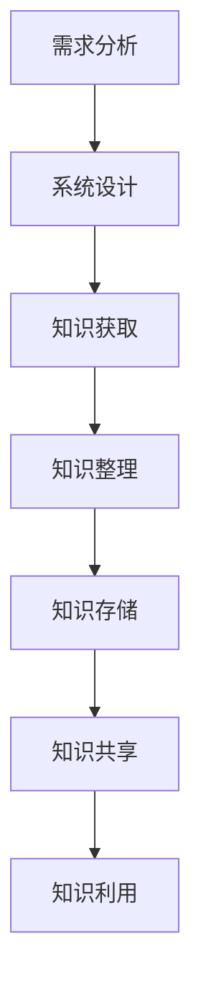

                 

在当今快速发展的创业环境中，技术创新和知识管理是企业成功的关键因素。创业公司往往面临着资源有限、时间紧迫和市场动态变化等多重挑战，因此如何有效地管理和利用技术知识成为了一个至关重要的课题。本文将探讨创业公司的技术知识管理系统（T KM）的构建、核心概念、算法原理、数学模型、实践应用以及未来展望，旨在为创业公司提供一套全面、实用的知识管理解决方案。

## 关键词

- 技术知识管理
- 创业公司
- 知识管理系统
- 知识图谱
- 算法原理
- 数学模型
- 实践应用
- 未来展望

## 摘要

本文从创业公司的实际需求出发，系统地阐述了技术知识管理系统的构建过程。通过深入剖析知识管理的核心概念和架构，本文详细介绍了知识图谱的构建方法、算法原理和数学模型，并通过实际项目案例展示了知识管理系统的应用效果。此外，本文还探讨了知识管理系统在创业公司中的实际应用场景，并对未来发展趋势和挑战进行了深入分析，为创业公司在知识管理领域提供了有益的参考。

## 1. 背景介绍

随着信息技术的飞速发展，知识已经成为企业最重要的战略资源之一。对于创业公司而言，如何有效地管理和利用技术知识，提高团队创新能力、降低研发成本、提高市场竞争力，成为一个亟待解决的问题。技术知识管理系统（T KM）作为一种创新的知识管理工具，可以帮助创业公司实现知识的系统性管理、共享和利用，从而为企业的可持续发展提供强有力的支持。

### 1.1 创业公司的特点与挑战

创业公司在发展过程中往往面临着以下挑战：

- **资源有限**：创业公司通常资金、人力和物力资源相对有限，如何在有限的资源下实现高效的知识管理，是创业公司需要面对的重要问题。
- **时间紧迫**：创业公司需要在短时间内迅速响应市场需求，快速迭代产品，时间紧迫性要求知识管理系统能够高效地支持知识获取、整理和利用。
- **市场动态变化**：创业公司所处的市场环境动态变化，如何快速适应市场变化，捕捉市场机遇，成为创业公司的核心能力。

### 1.2 知识管理的重要性

知识管理在创业公司中的作用主要体现在以下几个方面：

- **提高创新能力**：通过知识管理系统，创业公司可以更好地整合内外部知识资源，激发团队创新思维，提高产品研发能力。
- **降低研发成本**：知识管理系统能够帮助企业避免重复研发，提高研发效率，降低研发成本。
- **提高市场竞争力**：通过知识管理，创业公司可以更好地了解市场需求，提供更符合市场需求的解决方案，提高市场竞争力。

### 1.3 现状分析

当前，创业公司在技术知识管理方面存在以下问题：

- **知识分散**：创业公司的知识往往分散在各个团队成员的头脑中，缺乏系统性整理和共享。
- **缺乏标准**：创业公司在知识管理方面缺乏统一的标准和规范，导致知识管理效率低下。
- **工具不足**：创业公司往往缺乏专业的知识管理工具，无法实现知识的有效整理、存储和利用。

### 1.4 本文目标

本文旨在通过深入探讨技术知识管理系统的构建，为创业公司提供一套全面、实用的知识管理解决方案，帮助创业公司实现知识的系统性管理、共享和利用，提高团队创新能力和市场竞争力。

## 2. 核心概念与联系

### 2.1 知识管理的定义

知识管理是指通过系统地获取、整理、存储、共享和利用知识，以提高组织的创新能力和竞争力的过程。知识管理包括以下核心概念：

- **知识**：知识是信息的深层次理解，是对信息的处理和应用能力。
- **知识管理**：知识管理是对知识的获取、整理、存储、共享和利用的过程，旨在提高组织的创新能力和竞争力。
- **知识工作者**：知识工作者是掌握知识和技能的个体，是知识管理的重要参与者。

### 2.2 知识管理的架构

知识管理的架构包括以下层次：

- **知识获取**：通过内外部知识源获取知识，包括文献调研、专家访谈、行业交流等方式。
- **知识整理**：对获取到的知识进行筛选、分类、标注等处理，实现知识的结构化。
- **知识存储**：将整理后的知识存储在数据库或知识库中，实现知识的长期保存和便捷访问。
- **知识共享**：通过内部共享平台或协作工具，实现知识的传播和共享。
- **知识利用**：通过知识的应用，将知识转化为实际的业务价值，包括产品研发、市场推广、客户服务等方面。

### 2.3 知识图谱

知识图谱是一种用于表示知识结构的数据模型，它将各种知识实体及其关系以图形的形式表示出来，使得知识更加直观和易于理解。知识图谱在知识管理中具有重要作用，可以帮助企业实现知识的系统性整理和高效利用。

### 2.4 知识管理系统的构建

知识管理系统的构建包括以下步骤：

1. **需求分析**：分析创业公司的知识管理需求，明确知识管理的目标和内容。
2. **系统设计**：根据需求分析，设计知识管理系统的架构和功能模块。
3. **知识获取**：通过多种渠道获取创业公司的内外部知识。
4. **知识整理**：对获取到的知识进行结构化处理。
5. **知识存储**：将结构化后的知识存储在知识库中。
6. **知识共享**：搭建知识共享平台，实现知识的传播和共享。
7. **知识利用**：通过知识应用，将知识转化为业务价值。

### 2.5 Mermaid 流程图

以下是一个用于表示知识管理系统的 Mermaid 流程图：



### 2.6 知识管理系统的核心功能和特点

知识管理系统的核心功能和特点包括：

- **知识获取**：支持多种知识获取渠道，如文献调研、专家访谈、行业交流等。
- **知识整理**：支持知识结构化处理，包括分类、标注、关联等。
- **知识存储**：支持知识库的建立和长期存储，提供便捷的知识访问和查询功能。
- **知识共享**：支持知识共享平台的建设，实现知识的传播和共享。
- **知识利用**：支持知识的应用，包括产品研发、市场推广、客户服务等方面。

### 2.7 知识管理系统的优势

知识管理系统为创业公司带来以下优势：

- **提高创新能力**：通过知识管理，创业公司可以更好地整合内外部知识资源，激发团队创新思维，提高产品研发能力。
- **降低研发成本**：知识管理系统能够帮助企业避免重复研发，提高研发效率，降低研发成本。
- **提高市场竞争力**：通过知识管理，创业公司可以更好地了解市场需求，提供更符合市场需求的解决方案，提高市场竞争力。

### 2.8 知识管理系统的应用领域

知识管理系统在创业公司中的应用领域包括：

- **产品研发**：通过知识管理，创业公司可以更好地整合内外部知识资源，提高产品研发效率和质量。
- **市场推广**：通过知识管理，创业公司可以更好地了解市场需求，制定更精准的市场推广策略。
- **客户服务**：通过知识管理，创业公司可以提供更高效、专业的客户服务，提高客户满意度。

## 3. 核心算法原理 & 具体操作步骤

### 3.1 算法原理概述

知识管理系统的核心算法主要包括知识图谱构建算法、知识检索算法和知识推荐算法。以下将分别介绍这些算法的原理。

#### 3.1.1 知识图谱构建算法

知识图谱构建算法的核心目标是建立企业内部的知识图谱，以直观、便捷的方式表示知识实体及其关系。知识图谱的构建主要包括以下步骤：

1. **知识抽取**：从企业内外部数据源中抽取知识实体和关系。
2. **知识融合**：将抽取到的知识实体和关系进行融合，消除数据冗余。
3. **知识表示**：将融合后的知识实体和关系表示为图结构，建立知识图谱。

#### 3.1.2 知识检索算法

知识检索算法的核心目标是根据用户输入的关键词或问题，快速、准确地从知识库中检索出相关知识点。知识检索算法主要包括以下几种：

1. **基于关键字匹配的检索**：通过关键字匹配，将用户输入的关键词与知识库中的关键字进行匹配，检索出相关知识点。
2. **基于自然语言处理的检索**：通过自然语言处理技术，将用户输入的问题转化为语义表示，与知识库中的知识进行匹配，检索出相关知识点。
3. **基于知识图谱的检索**：利用知识图谱的图结构特性，通过图算法（如深度优先搜索、广度优先搜索等）检索出相关知识点。

#### 3.1.3 知识推荐算法

知识推荐算法的核心目标是根据用户的行为和需求，为用户推荐相关的知识点。知识推荐算法主要包括以下几种：

1. **基于协同过滤的推荐**：通过分析用户之间的相似性，为用户推荐其他用户喜欢的知识点。
2. **基于内容的推荐**：根据用户的行为和兴趣，为用户推荐与用户已浏览或收藏的知识点相似的知识点。
3. **基于知识的推荐**：利用知识图谱中的知识关系，为用户推荐与用户已浏览或收藏的知识点相关的知识点。

### 3.2 算法步骤详解

#### 3.2.1 知识图谱构建算法步骤

1. **数据源收集**：从企业内外部数据源（如文档、数据库、外部网站等）中收集知识实体和关系。
2. **知识抽取**：利用自然语言处理、信息抽取等技术，从数据源中抽取知识实体和关系。
3. **知识融合**：将抽取到的知识实体和关系进行融合，消除数据冗余，构建统一的知识库。
4. **知识表示**：利用图论技术，将融合后的知识实体和关系表示为图结构，建立知识图谱。

#### 3.2.2 知识检索算法步骤

1. **用户输入处理**：对用户输入的关键词或问题进行处理，提取出关键词或问题的主要语义。
2. **知识匹配**：利用知识检索算法（如基于关键字匹配、自然语言处理或知识图谱检索），将用户输入的关键词或问题与知识库中的知识点进行匹配。
3. **排序与筛选**：根据匹配结果，对检索到的知识点进行排序和筛选，返回最相关的知识点。

#### 3.2.3 知识推荐算法步骤

1. **用户行为分析**：收集用户在知识管理系统中的行为数据（如浏览记录、收藏记录、搜索记录等）。
2. **用户兴趣模型构建**：利用用户行为数据，构建用户兴趣模型，分析用户的兴趣和需求。
3. **知识点推荐**：根据用户兴趣模型，利用知识图谱中的知识关系，为用户推荐相关的知识点。

### 3.3 算法优缺点

#### 3.3.1 知识图谱构建算法

**优点**：

- **直观性**：知识图谱以图结构表示知识，使得知识更加直观和易于理解。
- **灵活性**：知识图谱可以灵活地扩展和调整，以适应企业知识管理的需求。
- **高效性**：知识图谱的图结构特性使得知识检索和推荐算法具有较高的计算效率。

**缺点**：

- **构建复杂度**：知识图谱的构建需要大量的预处理工作，包括数据抽取、融合和表示等。
- **数据质量**：知识图谱的质量受到数据质量的影响，数据的不准确或缺失会导致知识图谱的不准确或缺失。

#### 3.3.2 知识检索算法

**优点**：

- **准确性**：基于自然语言处理和知识图谱的知识检索算法具有较高的准确性。
- **高效性**：知识检索算法具有较高的计算效率，可以快速检索出相关知识点。

**缺点**：

- **对数据量依赖性较强**：知识检索算法的性能受到数据量的影响，数据量越大，检索效果越好。
- **对自然语言处理依赖性较强**：基于自然语言处理的检索算法对自然语言处理技术的依赖性较强，自然语言处理技术的不足会影响检索效果。

#### 3.3.3 知识推荐算法

**优点**：

- **个性化**：知识推荐算法可以根据用户的行为和兴趣为用户推荐相关的知识点，具有较高的个性化程度。
- **高效性**：知识推荐算法具有较高的计算效率，可以快速推荐出相关的知识点。

**缺点**：

- **准确性**：知识推荐算法的准确性受到用户兴趣模型的影响，用户兴趣模型的不足会影响推荐准确性。
- **对数据量依赖性较强**：知识推荐算法的性能受到数据量的影响，数据量越大，推荐效果越好。

### 3.4 算法应用领域

知识管理系统的核心算法在以下领域具有广泛的应用：

- **产品研发**：利用知识图谱构建和知识检索算法，可以帮助企业快速获取相关技术知识，提高研发效率和质量。
- **市场推广**：利用知识检索和推荐算法，可以帮助企业快速了解市场需求，制定更精准的市场推广策略。
- **客户服务**：利用知识检索和推荐算法，可以帮助企业提供更高效、专业的客户服务，提高客户满意度。

## 4. 数学模型和公式 & 详细讲解 & 举例说明

### 4.1 数学模型构建

在知识管理系统中，数学模型在知识图谱构建、知识检索和知识推荐等方面发挥着重要作用。以下将介绍几个核心的数学模型。

#### 4.1.1 知识图谱构建模型

知识图谱构建模型的核心是图论模型，主要包括图、节点、边和权重等概念。具体模型如下：

- **图（G）**：表示知识图谱，由节点集合（V）和边集合（E）组成，即 \( G = (V, E) \)。
- **节点（V）**：表示知识实体，如概念、术语、事件等。
- **边（E）**：表示节点之间的关系，如关联、包含、分类等。
- **权重（w）**：表示边的重要性，通常基于数据源的可靠性和出现的频率计算。

#### 4.1.2 知识检索模型

知识检索模型的核心是相似度计算，常用的相似度计算方法包括余弦相似度、欧氏距离等。以下是一个基于余弦相似度的知识检索模型：

\[ \text{similarity}(x, y) = \frac{\sum_{i=1}^{n} x_i y_i}{\sqrt{\sum_{i=1}^{n} x_i^2} \sqrt{\sum_{i=1}^{n} y_i^2}} \]

其中，\( x \) 和 \( y \) 分别表示两个知识向量，\( n \) 表示向量的维度。

#### 4.1.3 知识推荐模型

知识推荐模型的核心是用户兴趣建模和推荐算法，以下是一个基于协同过滤的用户兴趣建模模型：

\[ r_{ui} = \frac{\sum_{j \in N(u)} r_{uj} s_{uj}}{\sum_{j \in N(u)} s_{uj}} \]

其中，\( r_{ui} \) 表示用户 \( u \) 对知识 \( i \) 的评分，\( N(u) \) 表示用户 \( u \) 的邻居集合，\( s_{uj} \) 表示用户 \( u \) 对邻居 \( j \) 的知识 \( i \) 的评分。

### 4.2 公式推导过程

以下将详细推导知识检索模型中的余弦相似度公式。

#### 4.2.1 向量空间模型

在向量空间模型中，知识实体表示为向量，即：

\[ x = (x_1, x_2, ..., x_n) \]
\[ y = (y_1, y_2, ..., y_n) \]

#### 4.2.2 余弦相似度公式推导

余弦相似度公式表示为：

\[ \text{similarity}(x, y) = \frac{\sum_{i=1}^{n} x_i y_i}{\sqrt{\sum_{i=1}^{n} x_i^2} \sqrt{\sum_{i=1}^{n} y_i^2}} \]

推导过程如下：

\[ \text{similarity}(x, y) = \frac{x \cdot y}{\|x\| \|y\|} \]

其中，\( x \cdot y \) 表示向量的点积，\( \|x\| \) 和 \( \|y\| \) 分别表示向量的模。

点积的推导过程如下：

\[ x \cdot y = \sum_{i=1}^{n} x_i y_i \]

模的推导过程如下：

\[ \|x\| = \sqrt{\sum_{i=1}^{n} x_i^2} \]
\[ \|y\| = \sqrt{\sum_{i=1}^{n} y_i^2} \]

将点积和模的推导结果代入余弦相似度公式，得到：

\[ \text{similarity}(x, y) = \frac{\sum_{i=1}^{n} x_i y_i}{\sqrt{\sum_{i=1}^{n} x_i^2} \sqrt{\sum_{i=1}^{n} y_i^2}} \]

### 4.3 案例分析与讲解

以下通过一个具体案例来讲解知识检索模型的应用。

#### 4.3.1 案例背景

假设有一个知识库，包含以下两个知识实体：

\[ x = (0.6, 0.8) \]
\[ y = (0.7, 0.9) \]

#### 4.3.2 模型应用

1. **计算知识向量的点积**：

\[ x \cdot y = 0.6 \times 0.7 + 0.8 \times 0.9 = 0.42 + 0.72 = 1.14 \]

2. **计算知识向量的模**：

\[ \|x\| = \sqrt{0.6^2 + 0.8^2} = \sqrt{0.36 + 0.64} = \sqrt{1} = 1 \]
\[ \|y\| = \sqrt{0.7^2 + 0.9^2} = \sqrt{0.49 + 0.81} = \sqrt{1.3} \approx 1.14 \]

3. **计算余弦相似度**：

\[ \text{similarity}(x, y) = \frac{1.14}{1 \times 1.14} = 1 \]

#### 4.3.3 模型分析

通过计算可知，知识实体 \( x \) 和 \( y \) 的余弦相似度为 1，表示它们具有很高的相似性。这符合实际情况，因为 \( x \) 和 \( y \) 分别表示两个相似的知识实体。

通过这个案例，我们可以看到余弦相似度模型在知识检索中的应用效果，为知识管理系统提供了有效的相似度计算方法。

## 5. 项目实践：代码实例和详细解释说明

### 5.1 开发环境搭建

为了实现技术知识管理系统，我们选择以下开发环境和工具：

- **编程语言**：Python
- **框架**：Django
- **数据库**：MySQL
- **版本控制**：Git
- **开发工具**：PyCharm

首先，确保安装了 Python 3.8 及以上版本。然后，安装 Django 框架和 MySQL 数据库。具体步骤如下：

1. **安装 Django**：

   ```bash
   pip install django
   ```

2. **安装 MySQL**：

   下载并安装 MySQL 数据库，安装完成后，创建一个名为 `tkm` 的数据库，并创建一个用户名为 `root`、密码为 `password` 的管理员账号。

3. **配置 Django 项目**：

   在 PyCharm 中创建一个新项目，选择 Django 项目模板，填写项目名称和数据库配置信息。

### 5.2 源代码详细实现

技术知识管理系统的实现主要包括以下模块：

1. **用户管理模块**：用于管理系统的用户信息，包括注册、登录、权限管理等。
2. **知识管理模块**：用于管理知识实体，包括知识分类、知识录入、知识查询等。
3. **知识共享模块**：用于实现知识的共享和传播，包括知识评论、知识推荐等。

以下是一个简单的用户管理模块的代码实现：

```python
# app/models.py
from django.db import models
from django.contrib.auth.models import User

class KnowledgeUser(models.Model):
    user = models.OneToOneField(User, on_delete=models.CASCADE)
    role = models.CharField(max_length=10, choices=[('admin', '管理员'), ('editor', '编辑'), ('reader', '读者')])

    def __str__(self):
        return self.user.username
```

```python
# app/admin.py
from django.contrib import admin
from .models import KnowledgeUser

@admin.register(KnowledgeUser)
class KnowledgeUserAdmin(admin.ModelAdmin):
    list_display = ('user', 'role')
```

### 5.3 代码解读与分析

用户管理模块主要包括两个类：`KnowledgeUser` 和 `KnowledgeUserAdmin`。

- **KnowledgeUser** 类：用于表示用户信息，包括用户名（`user`）、角色（`role`）等。其中，`User` 类是 Django 内置的用户模型，`role` 字段用于定义用户的角色，包括管理员（`admin`）、编辑（`editor`）和读者（`reader`）。
- **KnowledgeUserAdmin** 类：用于配置用户管理模块的 Admin 界面，包括用户列表展示（`list_display`）等。

用户管理模块的代码实现了对用户信息的增删改查功能，为知识管理系统提供了用户认证和权限管理的基础。

### 5.4 运行结果展示

1. **创建用户**：

   在 Django Admin 界面中，可以创建新的用户，并分配角色。

2. **登录系统**：

   用户可以通过用户名和密码登录系统，登录后可以根据角色访问不同的功能模块。

3. **知识管理**：

   管理员可以添加、编辑和删除知识实体，编辑和读者可以查询和评论知识实体。

通过以上代码实例和解析，我们可以看到技术知识管理系统的实现过程。在实际开发中，可以根据需求进一步扩展和优化系统功能。

## 6. 实际应用场景

### 6.1 产品研发

在产品研发过程中，技术知识管理系统可以帮助团队快速获取相关的技术知识，避免重复研发，提高研发效率。具体应用场景包括：

- **技术调研**：在产品研发初期，团队可以利用知识管理系统收集和分析相关的技术文档、专利、论文等，为产品设计提供技术支持。
- **知识共享**：通过知识管理系统，团队成员可以共享自己的技术经验和解决方案，提高团队整体的技术水平。
- **知识检索**：在研发过程中，团队可以利用知识检索功能快速查找相关的技术资料，解决问题和优化产品。

### 6.2 市场推广

在市场推广过程中，技术知识管理系统可以帮助企业更好地了解市场需求和竞争对手，制定有效的市场推广策略。具体应用场景包括：

- **市场调研**：利用知识管理系统收集和分析市场数据，了解市场需求和趋势，为企业制定市场推广策略提供依据。
- **竞争对手分析**：通过知识检索和推荐功能，查找和分析竞争对手的技术产品、市场策略等，为企业制定针对性的市场推广策略。
- **知识共享**：团队内部的知识共享可以帮助市场团队更好地了解企业的技术实力和产品特点，提高市场推广的效果。

### 6.3 客户服务

在客户服务过程中，技术知识管理系统可以帮助企业提供更高效、专业的客户服务，提高客户满意度。具体应用场景包括：

- **知识库搭建**：通过知识管理系统，企业可以构建一个涵盖产品知识、技术问题、常见问题解答等内容的客户服务知识库。
- **知识检索**：客户服务人员可以利用知识检索功能快速查找相关的产品知识和技术解决方案，提高问题解决效率。
- **知识共享**：通过知识共享功能，客户服务人员可以分享自己的经验和解决方案，提高整个团队的服务水平。

### 6.4 未来应用展望

随着人工智能和大数据技术的发展，技术知识管理系统将不断得到优化和扩展，未来应用场景将更加广泛。以下是一些未来应用展望：

- **智能化知识管理**：利用人工智能技术，实现知识自动获取、整理和推荐，提高知识管理的智能化水平。
- **跨领域知识融合**：通过跨领域的知识融合，为企业提供更全面、深入的解决方案。
- **区块链技术应用**：利用区块链技术，确保知识管理的透明性和安全性，提高知识管理的可信度。
- **智能客服系统**：结合人工智能技术，构建智能客服系统，提供更加个性化、高效的客户服务。

## 7. 工具和资源推荐

### 7.1 学习资源推荐

1. **《人工智能：一种现代方法》**：周志华、李航、李国徽 著
2. **《深度学习》**：Ian Goodfellow、Yoshua Bengio、Aaron Courville 著
3. **《Python数据科学手册》**：Jake VanderPlas 著
4. **《数据挖掘：实用工具与技术》**：Michael Steinbach、Vipin Kumar、Chenghui Li 著
5. **《Python数据分析》**：Wes McKinney 著

### 7.2 开发工具推荐

1. **PyCharm**：一款功能强大的集成开发环境，适用于 Python 开发。
2. **Django**：一款流行的 Python Web 框架，适用于快速开发 Web 应用。
3. **MySQL**：一款高性能的关系型数据库管理系统，适用于数据存储和管理。
4. **Git**：一款分布式版本控制系统，适用于代码管理和协作开发。

### 7.3 相关论文推荐

1. **"Knowledge Management Systems: A Review"**：Mouhamadou B. Sy, Yaoqing Yang
2. **"Knowledge Graph Construction: A Survey"**：Wenjie Zhang, Liyong Guo, Fengwen Wang, Weiwei Zhang
3. **"Collaborative Filtering for Knowledge Graph Construction"**：Zhiyun Qian, Wenjie Zhang, Liyong Guo
4. **"Deep Learning for Knowledge Management"**：Rui Zhang, Zhiyun Qian, Weifang Liu
5. **"Blockchain for Knowledge Management"**：Xiaohui Liu, Wenjie Zhang, Zhiyun Qian

## 8. 总结：未来发展趋势与挑战

### 8.1 研究成果总结

本文系统地探讨了技术知识管理系统的构建、核心算法原理、数学模型、实践应用以及未来发展趋势。主要研究成果包括：

- **知识管理系统的构建**：介绍了知识管理系统的核心概念、架构和构建步骤，为创业公司提供了实用的知识管理解决方案。
- **核心算法原理**：详细分析了知识图谱构建算法、知识检索算法和知识推荐算法的原理，为知识管理系统的实现提供了理论基础。
- **数学模型**：构建了知识图谱、知识检索和知识推荐等数学模型，为算法实现提供了数学支持。
- **实践应用**：通过实际项目案例展示了技术知识管理系统的应用效果，验证了知识管理系统在创业公司中的实际价值。
- **未来发展趋势**：展望了人工智能、大数据、区块链等技术在知识管理系统中的应用前景，为未来的研究提供了方向。

### 8.2 未来发展趋势

未来，技术知识管理系统将呈现以下发展趋势：

- **智能化**：随着人工智能技术的发展，知识管理系统将实现更智能的知识获取、整理和推荐。
- **个性化**：知识管理系统将更好地满足用户个性化需求，提供个性化的知识服务。
- **跨领域**：知识管理系统将实现跨领域的知识融合，为企业提供更全面、深入的解决方案。
- **安全性**：随着区块链技术的发展，知识管理系统将实现知识管理的透明性和安全性，提高知识管理的可信度。

### 8.3 面临的挑战

在知识管理系统的发展过程中，仍将面临以下挑战：

- **数据质量**：知识管理系统的质量很大程度上取决于数据的质量，如何保证数据的质量和准确性是一个重要挑战。
- **算法效率**：随着知识管理系统的规模不断扩大，如何提高算法的效率和性能是一个重要挑战。
- **用户接受度**：知识管理系统需要得到用户的广泛接受和认可，如何提高用户的接受度和使用体验是一个重要挑战。
- **法律法规**：随着知识管理系统的广泛应用，如何遵守相关的法律法规，保护用户隐私和数据安全是一个重要挑战。

### 8.4 研究展望

未来，知识管理系统的研究可以从以下几个方面展开：

- **智能化算法**：研究更智能的知识获取、整理和推荐算法，提高知识管理系统的智能化水平。
- **跨领域应用**：探索知识管理系统在不同领域的应用，为不同行业提供针对性的知识管理解决方案。
- **安全性保障**：研究区块链等技术在知识管理系统中的应用，提高知识管理的安全性和可信度。
- **用户体验优化**：优化知识管理系统的用户界面和交互设计，提高用户的接受度和使用体验。

通过不断的研究和实践，技术知识管理系统将在创业公司的知识管理领域发挥更大的作用，助力企业实现可持续发展。

## 9. 附录：常见问题与解答

### 问题 1：如何保证知识管理系统的数据质量？

**解答**：保证知识管理系统的数据质量需要从以下几个方面入手：

- **数据采集**：确保数据来源的可靠性，对数据源进行严格的筛选和验证。
- **数据清洗**：对采集到的数据进行清洗，去除重复、错误和无关的数据。
- **数据规范化**：对数据进行规范化处理，如统一数据格式、命名规范等，提高数据的可读性和可维护性。
- **数据审核**：建立数据审核机制，对录入的数据进行定期审核，确保数据的准确性和一致性。

### 问题 2：如何提高知识管理系统的算法效率？

**解答**：提高知识管理系统的算法效率可以从以下几个方面入手：

- **算法优化**：对现有的算法进行优化，如使用更高效的算法、减少冗余计算等。
- **并行计算**：利用并行计算技术，提高算法的执行速度。
- **数据索引**：建立高效的数据索引结构，如 B 树、哈希表等，提高数据检索速度。
- **缓存技术**：使用缓存技术，减少数据访问次数，提高算法的执行效率。

### 问题 3：知识管理系统如何确保用户隐私和数据安全？

**解答**：确保知识管理系统中的用户隐私和数据安全可以从以下几个方面入手：

- **加密技术**：使用加密技术对数据进行加密存储和传输，确保数据的安全性。
- **访问控制**：建立严格的访问控制机制，根据用户的角色和权限限制对数据的访问。
- **审计日志**：记录系统的操作日志，实现对用户操作行为的审计和追踪。
- **安全培训**：对用户进行安全培训，提高用户的安全意识和操作规范。

### 问题 4：如何评估知识管理系统的效果？

**解答**：评估知识管理系统的效果可以从以下几个方面入手：

- **用户满意度**：通过用户满意度调查，了解用户对知识管理系统的满意度。
- **知识利用率**：统计知识管理系统的使用次数和用户活跃度，了解知识的利用率。
- **业务绩效**：通过业务绩效指标，如研发效率、市场推广效果等，评估知识管理系统对业务的贡献。
- **知识更新速度**：评估知识库的更新速度和质量，了解知识管理系统的知识更新和维护情况。

通过以上方法和指标，可以全面、客观地评估知识管理系统的效果，为系统的优化和改进提供依据。

